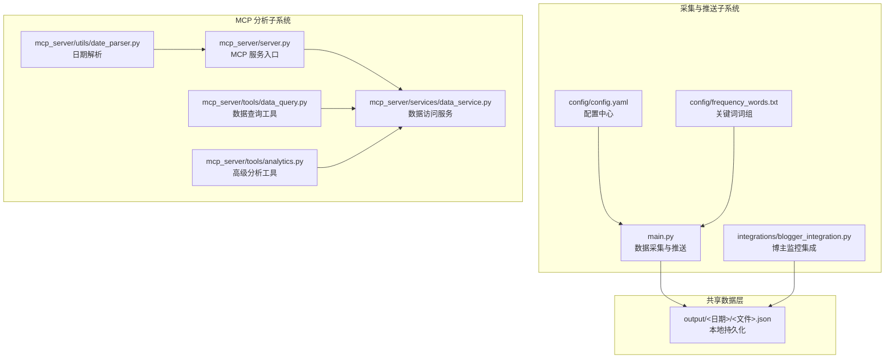
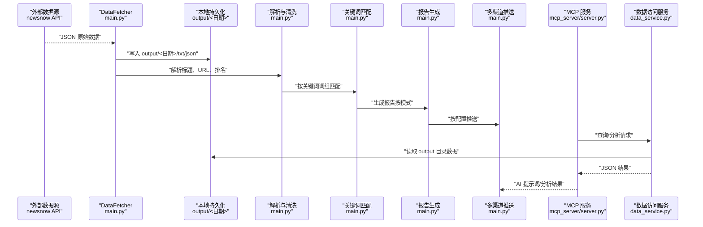
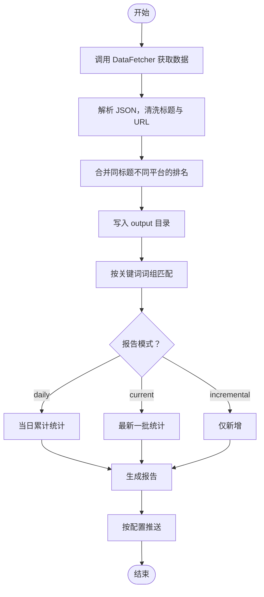
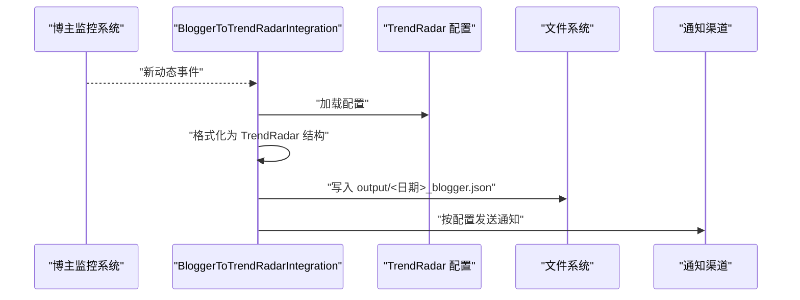
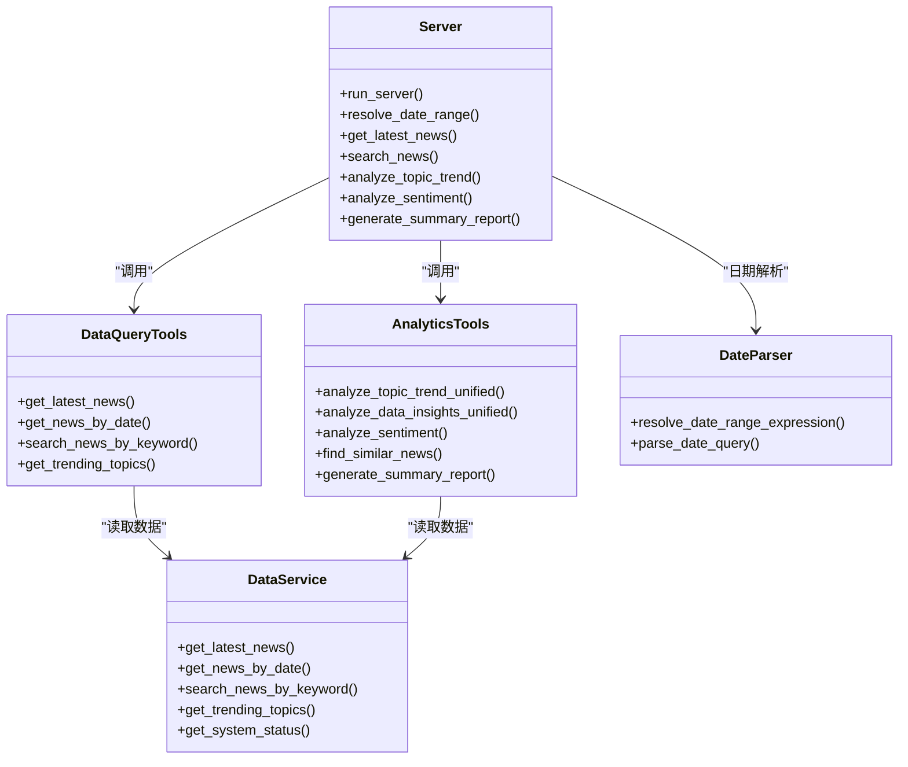
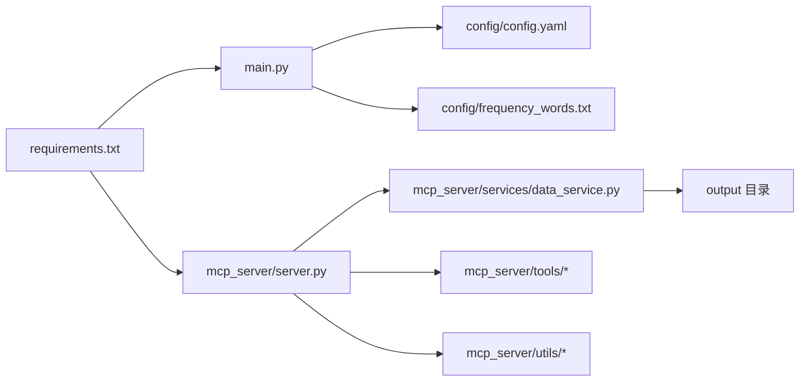

# 数据流与处理管道

<cite>
**本文引用的文件**
- [BlogMonitor-Architecture.md](file://BlogMonitor-Architecture.md)
- [main.py](file://main.py)
- [config/config.yaml](file://config/config.yaml)
- [config/frequency_words.txt](file://config/frequency_words.txt)
- [integrations/blogger_integration.py](file://integrations/blogger_integration.py)
- [mcp_server/server.py](file://mcp_server/server.py)
- [mcp_server/tools/data_query.py](file://mcp_server/tools/data_query.py)
- [mcp_server/tools/analytics.py](file://mcp_server/tools/analytics.py)
- [mcp_server/utils/date_parser.py](file://mcp_server/utils/date_parser.py)
- [mcp_server/services/data_service.py](file://mcp_server/services/data_service.py)
- [docker/docker-compose.yml](file://docker/docker-compose.yml)
- [requirements.txt](file://requirements.txt)
- [README.md](file://README.md)
</cite>

## 目录
1. [简介](#简介)
2. [项目结构](#项目结构)
3. [核心组件](#核心组件)
4. [架构总览](#架构总览)
5. [详细组件分析](#详细组件分析)
6. [依赖关系分析](#依赖关系分析)
7. [性能考量](#性能考量)
8. [故障排查指南](#故障排查指南)
9. [结论](#结论)
10. [附录](#附录)

## 简介
本文件围绕 TrendRadar 的数据流设计，系统性梳理从 API 数据源到用户终端的端到端路径，并补充从数据存储到 MCP 服务器的分析路径。文档重点解释：
- 数据采集模块如何从知乎、微博等平台拉取原始数据；
- 数据在系统内的存储、处理与转换；
- 关键词匹配与热点算法如何生成报告；
- 多渠道推送如何将结果送达用户；
- MCP 服务器如何支持自然语言查询与深度分析；
- 数据在各组件间传递的格式（JSON）、缓存策略（Redis）与持久化机制；
- 性能瓶颈与优化策略（批量处理、异步 I/O）。

## 项目结构
TrendRadar 由“新闻采集与推送”和“MCP 分析服务”两大子系统构成，二者通过本地文件系统共享数据，MCP 服务提供自然语言查询与分析能力。

图表来源
- [main.py](file://main.py#L1-L200)
- [config/config.yaml](file://config/config.yaml#L1-L140)
- [config/frequency_words.txt](file://config/frequency_words.txt#L1-L114)
- [integrations/blogger_integration.py](file://integrations/blogger_integration.py#L1-L293)
- [mcp_server/server.py](file://mcp_server/server.py#L1-L200)
- [mcp_server/tools/data_query.py](file://mcp_server/tools/data_query.py#L1-L120)
- [mcp_server/tools/analytics.py](file://mcp_server/tools/analytics.py#L1-L120)
- [mcp_server/utils/date_parser.py](file://mcp_server/utils/date_parser.py#L1-L120)
- [mcp_server/services/data_service.py](file://mcp_server/services/data_service.py#L1-L120)

章节来源
- [BlogMonitor-Architecture.md](file://BlogMonitor-Architecture.md#L1-L120)
- [README.md](file://README.md#L220-L370)

## 核心组件
- 数据采集与推送（main.py）
  - 从 newsnow API 拉取多平台热搜数据，解析为统一结构，写入本地 output 目录；支持按平台、按时间窗口、按关键词筛选；按配置进行多渠道推送。
- 配置与关键词（config/config.yaml、config/frequency_words.txt）
  - 配置爬虫、推送、权重、平台列表等；关键词词组决定热点匹配与统计口径。
- 博主监控集成（integrations/blogger_integration.py）
  - 将博主监控系统的新动态转换为 TrendRadar 格式并持久化，同时复用 TrendRadar 的推送通道。
- MCP 服务（mcp_server/server.py）
  - 提供标准 MCP 工具集，支持自然语言日期解析、数据查询、趋势分析、情感分析、相似新闻查找、摘要生成等。
- 数据访问服务（mcp_server/services/data_service.py）
  - 封装读取 output 目录下的标题数据，提供最新/按日期/关键词检索、趋势统计、系统状态等接口。
- 工具与解析（mcp_server/tools/*、mcp_server/utils/*）
  - 数据查询工具、高级分析工具、日期解析工具，统一参数校验与错误处理。

章节来源
- [main.py](file://main.py#L1-L200)
- [config/config.yaml](file://config/config.yaml#L1-L140)
- [config/frequency_words.txt](file://config/frequency_words.txt#L1-L114)
- [integrations/blogger_integration.py](file://integrations/blogger_integration.py#L1-L120)
- [mcp_server/server.py](file://mcp_server/server.py#L1-L120)
- [mcp_server/services/data_service.py](file://mcp_server/services/data_service.py#L1-L120)

## 架构总览
下图展示了从数据源到用户终端的端到端数据路径，以及 MCP 服务器的分析路径。

图表来源
- [main.py](file://main.py#L616-L790)
- [mcp_server/server.py](file://mcp_server/server.py#L110-L220)
- [mcp_server/services/data_service.py](file://mcp_server/services/data_service.py#L30-L120)

章节来源
- [BlogMonitor-Architecture.md](file://BlogMonitor-Architecture.md#L1-L120)
- [README.md](file://README.md#L330-L420)

## 详细组件分析

### 数据采集与处理（main.py）
- 数据获取
  - DataFetcher 通过 newsnow API 获取多平台热搜，解析 JSON，合并同标题不同平台的排名，去重并保存到 output 目录。
- 数据解析与清洗
  - 清洗标题、过滤无效条目、记录 URL 与移动端链接，按时间窗口与请求间隔控制。
- 关键词匹配与报告
  - 读取 config/frequency_words.txt，按词组进行匹配，统计词频与新闻数量；根据 report 模式（daily/current/incremental）生成报告。
- 推送
  - 支持飞书、钉钉、企业微信、Telegram、邮件、ntfy、Bark、Slack 等多渠道；支持分批与时间窗口控制。

图表来源
- [main.py](file://main.py#L616-L790)
- [config/config.yaml](file://config/config.yaml#L1-L140)
- [config/frequency_words.txt](file://config/frequency_words.txt#L1-L114)

章节来源
- [main.py](file://main.py#L616-L790)
- [config/config.yaml](file://config/config.yaml#L1-L140)
- [config/frequency_words.txt](file://config/frequency_words.txt#L1-L114)

### 博主监控集成（integrations/blogger_integration.py）
- 将博主监控系统的新动态转换为 TrendRadar 格式，写入 output/<日期>_blogger.json；
- 读取 TrendRadar 配置，复用其推送通道（飞书、钉钉、Telegram）进行通知；
- 通过本地缓存文件记录已处理通知，避免重复推送。

图表来源
- [integrations/blogger_integration.py](file://integrations/blogger_integration.py#L1-L293)
- [config/config.yaml](file://config/config.yaml#L92-L140)

章节来源
- [integrations/blogger_integration.py](file://integrations/blogger_integration.py#L1-L293)
- [config/config.yaml](file://config/config.yaml#L92-L140)

### MCP 服务器与分析路径
- MCP 服务入口
  - mcp_server/server.py 注册各类工具（数据查询、趋势分析、情感分析、相似新闻、摘要生成、系统状态等），支持 stdio 与 HTTP 两种传输模式。
- 数据查询工具
  - data_query.py 提供最新新闻、按日期查询、关键词检索、趋势话题等工具，内部调用 data_service.py 读取 output 目录数据。
- 高级分析工具
  - analytics.py 提供统一话题趋势分析、平台对比、关键词共现、情感分析、相似新闻查找、摘要生成等，内部使用权重算法与去重逻辑。
- 日期解析
  - date_parser.py 将自然语言日期表达式解析为标准日期范围，确保 AI 与工具链的一致性。
- 数据访问服务
  - data_service.py 封装读取逻辑，提供缓存（Redis）、可用日期范围扫描、系统状态查询等。

图表来源
- [mcp_server/server.py](file://mcp_server/server.py#L110-L220)
- [mcp_server/tools/data_query.py](file://mcp_server/tools/data_query.py#L1-L120)
- [mcp_server/tools/analytics.py](file://mcp_server/tools/analytics.py#L1-L120)
- [mcp_server/utils/date_parser.py](file://mcp_server/utils/date_parser.py#L1-L120)
- [mcp_server/services/data_service.py](file://mcp_server/services/data_service.py#L1-L120)

章节来源
- [mcp_server/server.py](file://mcp_server/server.py#L1-L200)
- [mcp_server/tools/data_query.py](file://mcp_server/tools/data_query.py#L1-L120)
- [mcp_server/tools/analytics.py](file://mcp_server/tools/analytics.py#L1-L120)
- [mcp_server/utils/date_parser.py](file://mcp_server/utils/date_parser.py#L1-L120)
- [mcp_server/services/data_service.py](file://mcp_server/services/data_service.py#L1-L120)

### 数据在组件间的传递格式与持久化
- 传递格式
  - API 响应与中间数据以 JSON 为主；工具返回统一为 JSON 字典，包含 success、error、结果主体等字段。
- 持久化
  - 采集数据写入 output/<日期> 目录，包含 txt 与 json 文件；MCP 查询与分析均基于本地文件系统读取。
- 缓存策略
  - MCP 侧使用 Redis 缓存热点查询结果（如 latest_news、trending_topics、config），提高查询性能与稳定性。

章节来源
- [mcp_server/server.py](file://mcp_server/server.py#L110-L220)
- [mcp_server/services/data_service.py](file://mcp_server/services/data_service.py#L30-L120)
- [docker/docker-compose.yml](file://docker/docker-compose.yml#L1-L74)

## 依赖关系分析
- 外部依赖
  - requests、pytz、PyYAML、fastmcp、websockets 等，满足网络请求、时区处理、配置解析、MCP 协议与 WebSocket 支持。
- 内部依赖
  - main.py 依赖 config 与推送通道；MCP 服务依赖 data_service 与工具模块；data_service 依赖解析与缓存组件。

图表来源
- [requirements.txt](file://requirements.txt#L1-L6)
- [main.py](file://main.py#L1-L120)
- [mcp_server/server.py](file://mcp_server/server.py#L1-L120)
- [mcp_server/services/data_service.py](file://mcp_server/services/data_service.py#L1-L120)

章节来源
- [requirements.txt](file://requirements.txt#L1-L6)
- [README.md](file://README.md#L330-L420)

## 性能考量
- 缓存与热点数据
  - MCP 侧对最新新闻、趋势话题、配置等进行缓存，降低重复查询开销；建议在高并发场景下合理设置 TTL。
- 批量处理与异步 I/O
  - 推送侧采用分批与分段策略，避免消息超限；MCP 服务支持 HTTP 传输，便于异步调用与并发扩展。
- 存储与读取
  - 本地文件系统读取速度快、成本低；建议定期清理过期数据，控制 output 目录规模。
- 网络与速率控制
  - DataFetcher 对请求间隔与重试进行控制，避免触发上游限流；建议结合平台 API 限制合理配置。

章节来源
- [mcp_server/services/data_service.py](file://mcp_server/services/data_service.py#L30-L120)
- [main.py](file://main.py#L616-L790)
- [config/config.yaml](file://config/config.yaml#L1-L140)

## 故障排查指南
- 推送失败
  - 检查各渠道 webhook 配置是否正确；确认分批大小与消息长度限制；查看推送时间窗口是否命中。
- 数据缺失
  - 确认 output 目录是否存在对应日期文件；检查 MCP 服务是否能读取到数据；核对平台 ID 与日期范围。
- MCP 工具报错
  - 使用 resolve_date_range 工具先解析日期表达式；检查参数格式与范围；查看工具返回的 error 字段定位问题。
- 性能问题
  - 增加缓存 TTL 或减少查询频率；优化关键词词组，减少匹配开销；必要时拆分查询范围。

章节来源
- [config/config.yaml](file://config/config.yaml#L92-L140)
- [mcp_server/server.py](file://mcp_server/server.py#L1-L120)
- [mcp_server/utils/date_parser.py](file://mcp_server/utils/date_parser.py#L1-L120)
- [mcp_server/services/data_service.py](file://mcp_server/services/data_service.py#L498-L605)

## 结论
TrendRadar 的数据流以“采集-解析-匹配-报告-推送”为主线，辅以 MCP 服务器提供自然语言查询与深度分析能力。通过本地文件持久化与 Redis 缓存，系统在保证数据一致性的同时兼顾性能与可扩展性。建议在生产环境中结合缓存策略、批量处理与异步 I/O 进一步优化吞吐与延迟。

## 附录
- Docker 部署
  - 双容器架构：trend-radar（推送服务）与 trend-radar-mcp（MCP 服务），端口分别为 8080（Web）、3333（MCP）。
- 版本与依赖
  - 依赖包与版本范围见 requirements.txt；README 提供部署与功能说明。

章节来源
- [docker/docker-compose.yml](file://docker/docker-compose.yml#L1-L74)
- [requirements.txt](file://requirements.txt#L1-L6)
- [README.md](file://README.md#L414-L431)