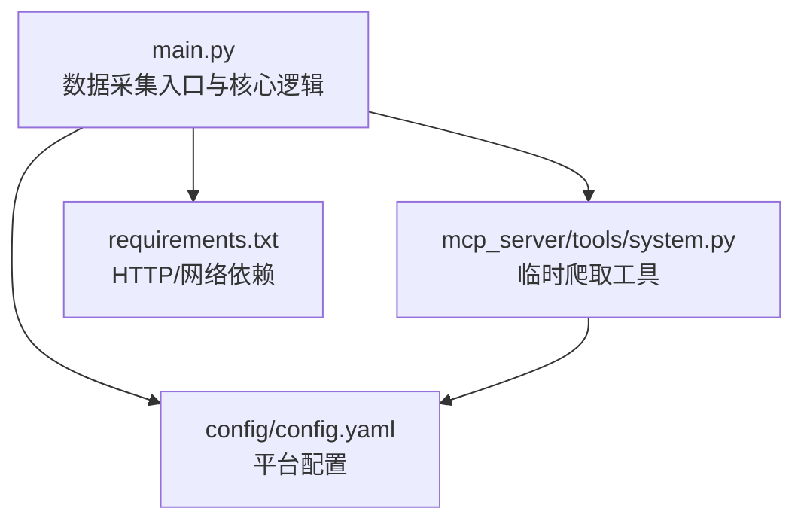
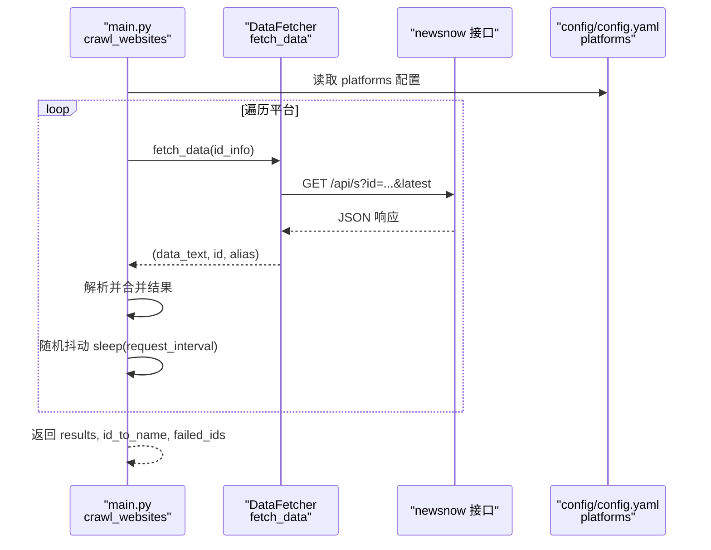
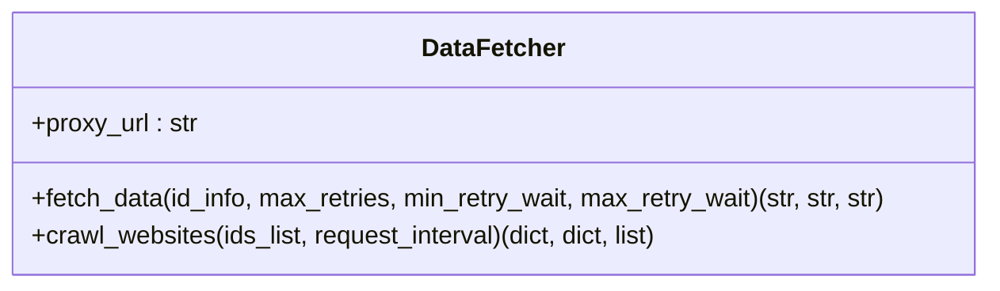
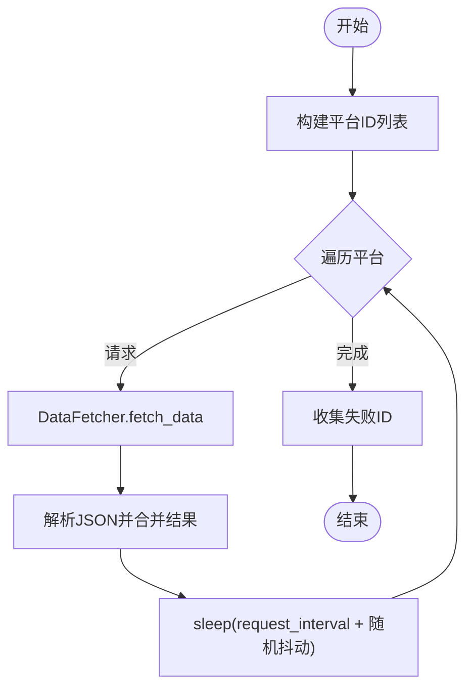
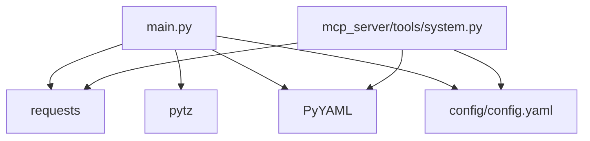

# 数据采集阶段

<cite>
**本文引用的文件**
- [main.py](file://main.py)
- [config/config.yaml](file://config/config.yaml)
- [mcp_server/tools/system.py](file://mcp_server/tools/system.py)
- [mcp_server/utils/validators.py](file://mcp_server/utils/validators.py)
- [mcp_server/utils/errors.py](file://mcp_server/utils/errors.py)
- [requirements.txt](file://requirements.txt)
</cite>

## 目录
1. [简介](#简介)
2. [项目结构](#项目结构)
3. [核心组件](#核心组件)
4. [架构总览](#架构总览)
5. [详细组件分析](#详细组件分析)
6. [依赖关系分析](#依赖关系分析)
7. [性能考量](#性能考量)
8. [故障排查指南](#故障排查指南)
9. [结论](#结论)
10. [附录](#附录)

## 简介
本章节聚焦 TrendRadar 的数据采集阶段，围绕从知乎、微博、抖音、bilibili 等平台获取原始数据的流程展开，重点说明 DataFetcher 类的设计与实现、重试机制、代理支持与请求头配置；解释如何通过 config.yaml 中的 platforms 配置定义采集目标，以及如何处理采集失败的情况；结合 main.py 中的 crawl_websites 方法，展示多平台并发采集的流程；提供扩展新数据源的方法与性能优化建议，特别是 REQUEST_INTERVAL 参数的设置策略。

## 项目结构
- 数据采集入口与核心逻辑集中在 main.py，其中包含 DataFetcher 类与 crawl_websites 方法。
- 平台配置位于 config/config.yaml 的 platforms 字段，定义了监控平台的 id 与 name。
- MCP 服务中也实现了类似的临时爬取逻辑，便于调试与集成。
- 依赖库通过 requirements.txt 管理，主要使用 requests 进行 HTTP 请求。

图表来源
- [main.py](file://main.py#L616-L740)
- [config/config.yaml](file://config/config.yaml#L116-L140)
- [mcp_server/tools/system.py](file://mcp_server/tools/system.py#L68-L263)
- [requirements.txt](file://requirements.txt#L1-L6)

章节来源
- [main.py](file://main.py#L616-L740)
- [config/config.yaml](file://config/config.yaml#L116-L140)
- [mcp_server/tools/system.py](file://mcp_server/tools/system.py#L68-L263)
- [requirements.txt](file://requirements.txt#L1-L6)

## 核心组件
- DataFetcher：封装 HTTP 请求、重试、代理与请求头配置，负责从统一接口获取各平台热搜数据，并进行基础解析与失败收集。
- crawl_websites：遍历 platforms 配置，逐个调用 DataFetcher.fetch_data，并在请求间隔上做随机抖动，最终汇总成功与失败结果。
- 平台配置：config/config.yaml 的 platforms 字段定义了采集目标 id 与显示名称，支持扩展新平台。
- MCP 临时爬取：mcp_server/tools/system.py 提供 trigger_crawl，可按需临时爬取指定平台，复用与 main.py 相同的请求逻辑与重试策略。

章节来源
- [main.py](file://main.py#L616-L740)
- [config/config.yaml](file://config/config.yaml#L116-L140)
- [mcp_server/tools/system.py](file://mcp_server/tools/system.py#L68-L263)

## 架构总览
数据采集阶段采用“配置驱动 + 统一接口”的模式：
- 配置层：config/config.yaml 的 platforms 定义采集目标。
- 采集层：DataFetcher 负责统一请求与解析，crawl_websites 负责调度与间隔控制。
- 失败处理：将失败的平台 id 收集到 failed_ids，便于后续重试或告警。
- MCP 集成：mcp_server/tools/system.py 的 trigger_crawl 提供临时爬取能力，便于调试与二次开发。

图表来源
- [main.py](file://main.py#L683-L739)
- [main.py](file://main.py#L616-L682)
- [config/config.yaml](file://config/config.yaml#L116-L140)

## 详细组件分析

### DataFetcher 类设计与实现
- 职责
  - 统一构建请求 URL、请求头与代理配置。
  - 执行请求并校验响应状态，支持指数退避与抖动的重试。
  - 将成功响应解析为结构化数据，失败则记录失败 id。
- 关键点
  - 代理支持：当配置启用代理时，构造 http/https 代理字典传入请求。
  - 请求头配置：包含 User-Agent、Accept、Accept-Language、Connection、Cache-Control 等常用字段。
  - 重试机制：最大重试次数、最小/最大等待时间，每次重试增加额外等待，避免集中请求。
  - 响应校验：校验 status 字段是否为 success 或 cache，异常时抛出并计入失败。
  - 结果合并：将同一平台多条热搜按标题去重，合并排名与链接信息。
- 失败处理
  - JSON 解析失败或处理异常时，将平台 id 加入 failed_ids。
  - 请求失败且超过最大重试次数，同样将平台 id 加入 failed_ids。

图表来源
- [main.py](file://main.py#L616-L740)

章节来源
- [main.py](file://main.py#L616-L740)

### 平台配置与扩展
- platforms 配置
  - id：平台标识，用于拼接请求 URL 的 id 参数。
  - name：平台显示名称，便于日志与报告展示。
- 扩展新平台
  - 在 config/config.yaml 的 platforms 中新增一项，id 与 name 均可自定义。
  - 确保 newsnow 接口支持该 id；若接口不支持，将导致请求失败并被归类为 failed_ids。
- MCP 平台校验
  - mcp_server/utils/validators.py 提供平台校验逻辑，若配置加载失败，将允许所有平台通过（降级策略）。

章节来源
- [config/config.yaml](file://config/config.yaml#L116-L140)
- [mcp_server/utils/validators.py](file://mcp_server/utils/validators.py#L47-L77)

### 并发采集流程与请求间隔控制
- main.py 中的 crawl_websites
  - 读取 CONFIG["PLATFORMS"]，构建 id 列表（支持带别名的元组）。
  - 逐个调用 DataFetcher.fetch_data，解析响应并合并结果。
  - 在相邻请求之间插入 sleep，sleep 时间由 request_interval 加上 [-10, 20] 的随机抖动组成，且最小不低于 50ms。
- MCP 临时爬取
  - mcp_server/tools/system.py 的 trigger_crawl 与 main.py 的 crawl_websites 逻辑高度一致，便于在 MCP 环境中临时触发与调试。

图表来源
- [main.py](file://main.py#L683-L739)
- [mcp_server/tools/system.py](file://mcp_server/tools/system.py#L132-L170)

章节来源
- [main.py](file://main.py#L683-L739)
- [mcp_server/tools/system.py](file://mcp_server/tools/system.py#L68-L263)

### 请求头与代理配置
- 请求头
  - User-Agent、Accept、Accept-Language、Connection、Cache-Control 等字段，模拟现代浏览器行为。
- 代理
  - 当 CONFIG["USE_PROXY"] 为真时，使用 CONFIG["DEFAULT_PROXY"] 作为 http/https 代理。
  - DataFetcher 构造 proxies 字典并传入请求。
- 重试与退避
  - 基础等待时间在 [min_retry_wait, max_retry_wait] 之间随机，随后叠加 (retries-1)*[1,2] 的额外等待，避免雪崩效应。

章节来源
- [main.py](file://main.py#L616-L682)
- [config/config.yaml](file://config/config.yaml#L5-L10)

### 失败处理与重试策略
- 失败分类
  - 请求异常（网络、超时、状态码异常）：计入 failed_ids。
  - JSON 解析失败或处理异常：计入 failed_ids。
  - 响应状态非 success 或 cache：计入 failed_ids。
- 重试策略
  - 最大重试次数可配置，默认 2 次。
  - 等待时间包含随机抖动，避免集中请求。
- MCP 错误类型
  - mcp_server/utils/errors.py 定义了 CrawlTaskError、PlatformNotSupportedError 等，便于 MCP 层统一错误处理。

章节来源
- [main.py](file://main.py#L616-L682)
- [mcp_server/utils/errors.py](file://mcp_server/utils/errors.py#L52-L93)

## 依赖关系分析
- 外部依赖
  - requests：用于 HTTP 请求与代理支持。
  - pytz：用于时间与时区处理。
  - PyYAML：用于加载 YAML 配置。
- 内部依赖
  - main.py 依赖 config/config.yaml 的配置，依赖 requests/pytz/PyYAML。
  - MCP 工具依赖本地 YAML 读取与 requests，逻辑与 main.py 保持一致。

图表来源
- [main.py](file://main.py#L1-L40)
- [requirements.txt](file://requirements.txt#L1-L6)
- [mcp_server/tools/system.py](file://mcp_server/tools/system.py#L90-L112)

章节来源
- [main.py](file://main.py#L1-L40)
- [requirements.txt](file://requirements.txt#L1-L6)
- [mcp_server/tools/system.py](file://mcp_server/tools/system.py#L90-L112)

## 性能考量
- 请求频率限制
  - REQUEST_INTERVAL：全局请求间隔（毫秒），默认 1000。
  - crawl_websites 在相邻请求之间 sleep(request_interval + 随机抖动)，且最小不低于 50ms，避免过于频繁的请求。
- 并发与限速
  - 当前实现为串行请求，无显式并发控制。若平台较多，建议：
    - 适当增大 REQUEST_INTERVAL，避免触发目标接口限流。
    - 若需并发，可在 crawl_websites 中引入线程/进程池或异步协程，并配合信号量控制并发度。
- 代理与稳定性
  - 启用代理可提升稳定性，但会增加延迟；建议在代理质量不佳时适当提高 REQUEST_INTERVAL。
- 解析与合并
  - 合并相同标题的热搜时，按排名列表累加；建议在大规模数据时优化去重与排序策略，减少内存占用。

章节来源
- [config/config.yaml](file://config/config.yaml#L5-L10)
- [main.py](file://main.py#L683-L739)

## 故障排查指南
- 常见问题
  - 平台 id 不存在或接口不支持：请求失败并被归类为 failed_ids。
  - 网络异常/超时：重试后仍失败，计入 failed_ids。
  - JSON 解析失败：响应格式不符合预期，计入 failed_ids。
  - 响应状态异常：status 非 success/cache，计入 failed_ids。
- 排查步骤
  - 检查 config/config.yaml 的 platforms 配置是否正确。
  - 检查 CONFIG["USE_PROXY"] 与 CONFIG["DEFAULT_PROXY"] 是否按需启用。
  - 适当增大 REQUEST_INTERVAL，观察是否仍频繁失败。
  - 查看 failed_ids 输出，定位具体失败平台。
- MCP 层错误
  - 若使用 MCP 的 trigger_crawl，遇到平台不支持或配置错误，将抛出 PlatformNotSupportedError 或 CrawlTaskError，便于快速定位。

章节来源
- [main.py](file://main.py#L616-L740)
- [mcp_server/utils/errors.py](file://mcp_server/utils/errors.py#L52-L93)

## 结论
TrendRadar 的数据采集阶段以配置驱动为核心，通过 DataFetcher 统一处理请求、重试与解析，crawl_websites 负责调度与间隔控制。平台扩展简单，仅需在 platforms 中新增 id 与 name；失败处理完善，支持重试与失败收集。为避免触发目标接口限流，建议合理设置 REQUEST_INTERVAL，并在必要时引入并发控制与代理优化。

## 附录

### 扩展新数据源的实践步骤
- 在 config/config.yaml 的 platforms 中新增一项，例如：
  - id：平台标识（需与 newsnow 接口支持的 id 一致）
  - name：显示名称
- 若 newsnow 接口不支持该 id，将导致请求失败并被归类为 failed_ids。
- 如需 MCP 环境中临时测试，可使用 mcp_server/tools/system.py 的 trigger_crawl，传入指定平台列表进行验证。

章节来源
- [config/config.yaml](file://config/config.yaml#L116-L140)
- [mcp_server/tools/system.py](file://mcp_server/tools/system.py#L68-L170)