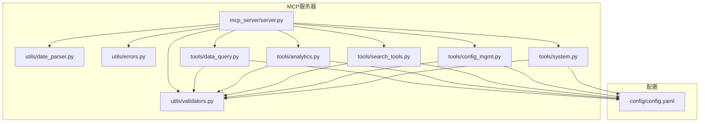
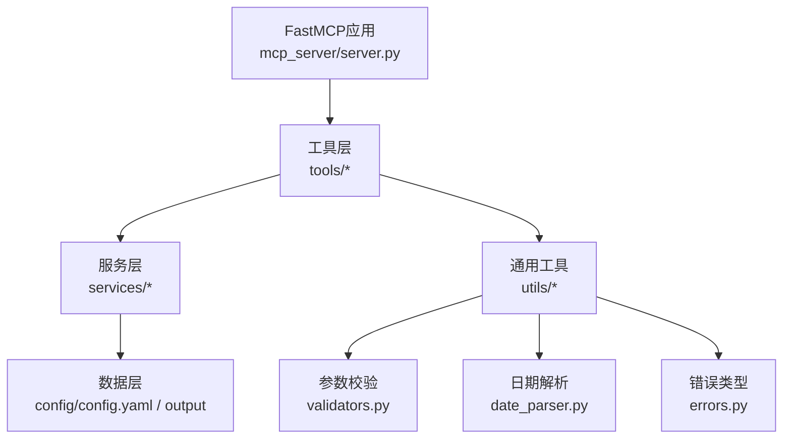
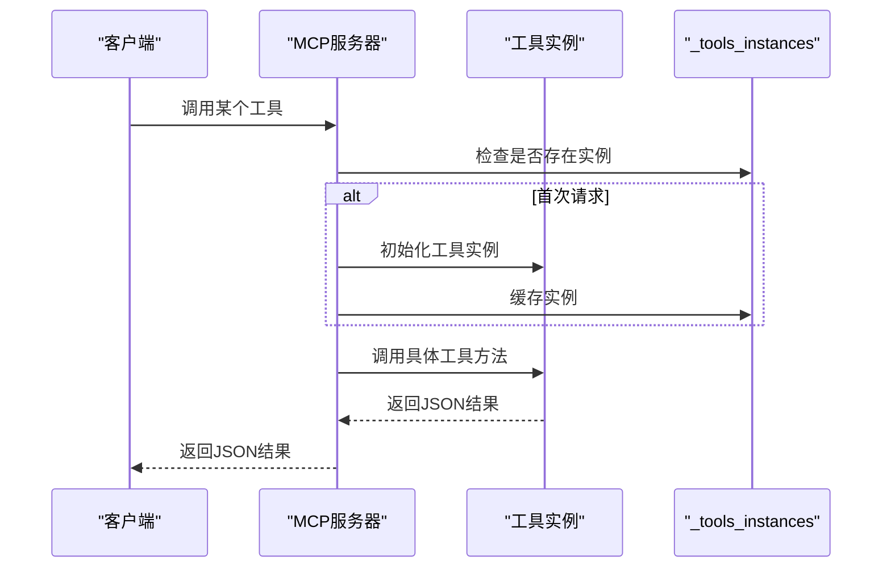
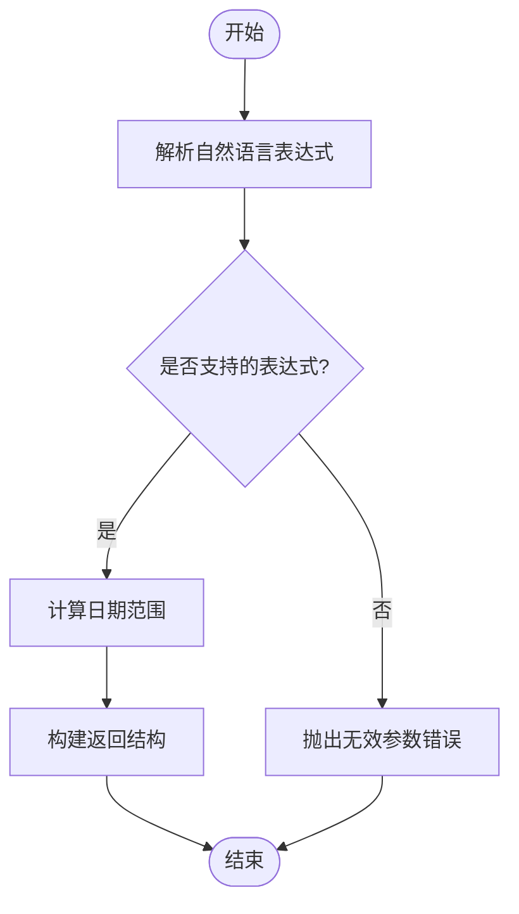
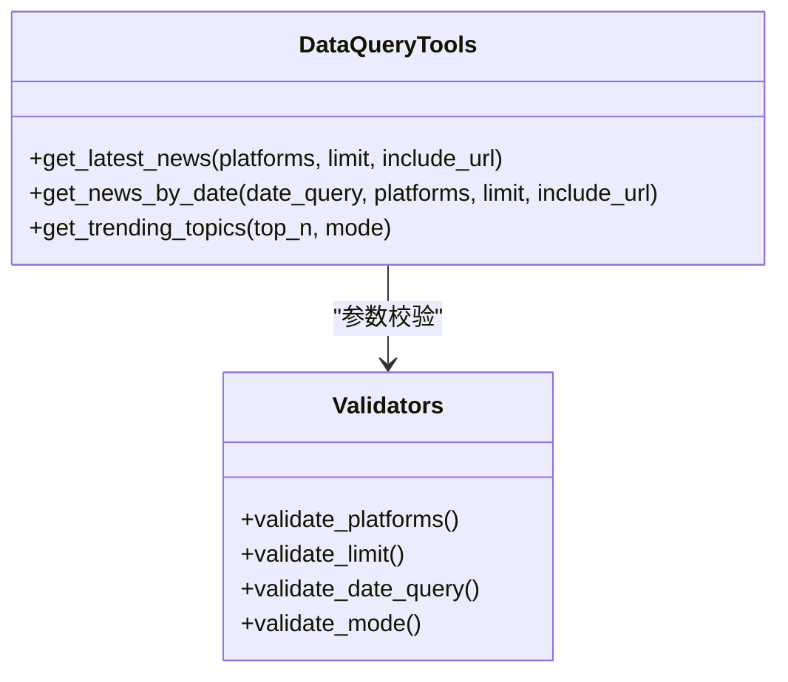
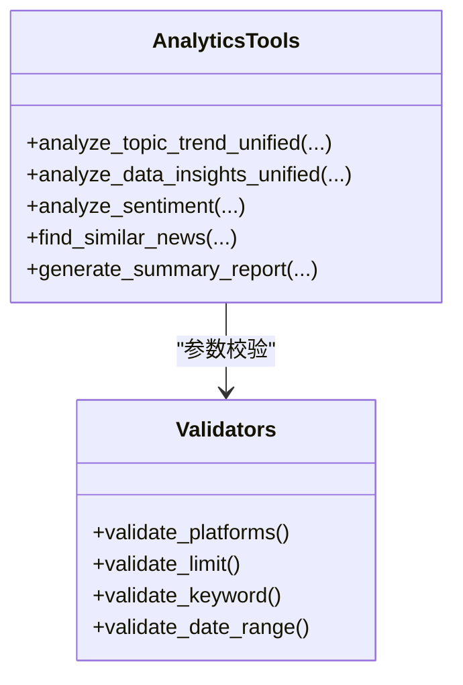
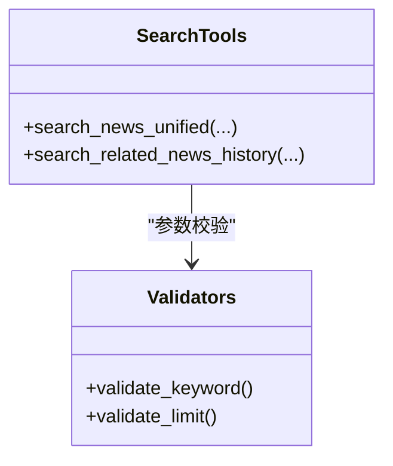
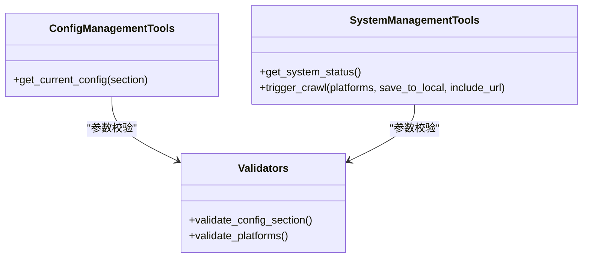
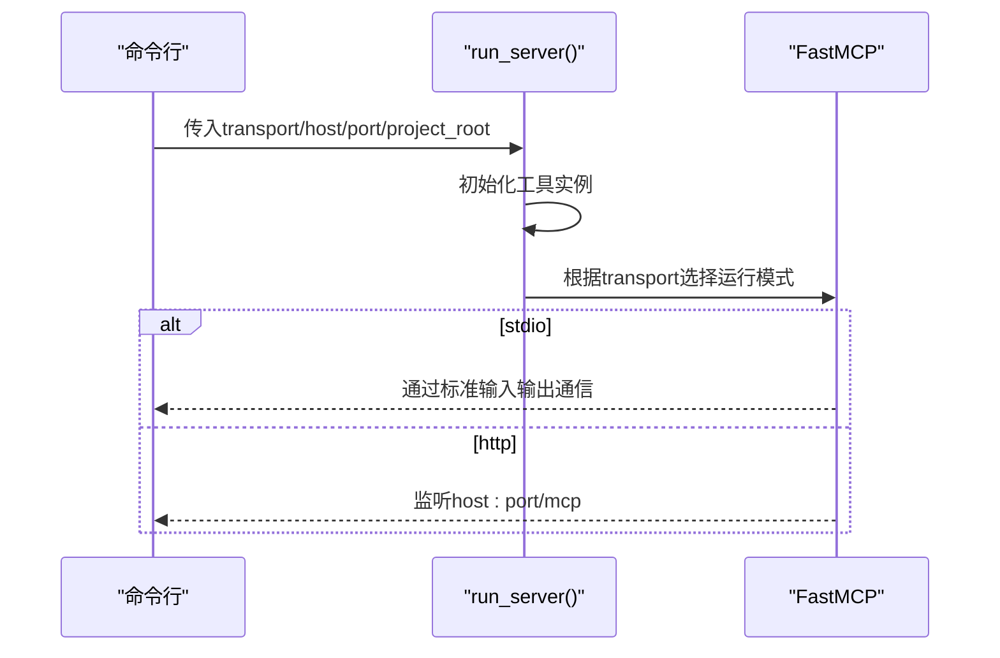
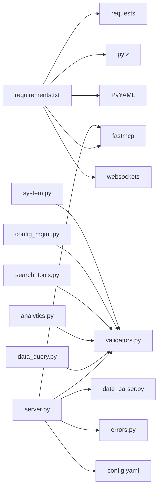

# MCP服务器

<cite>
**本文引用的文件**
- [mcp_server/server.py](file://mcp_server/server.py)
- [mcp_server/tools/data_query.py](file://mcp_server/tools/data_query.py)
- [mcp_server/tools/analytics.py](file://mcp_server/tools/analytics.py)
- [mcp_server/tools/search_tools.py](file://mcp_server/tools/search_tools.py)
- [mcp_server/tools/config_mgmt.py](file://mcp_server/tools/config_mgmt.py)
- [mcp_server/tools/system.py](file://mcp_server/tools/system.py)
- [mcp_server/utils/date_parser.py](file://mcp_server/utils/date_parser.py)
- [mcp_server/utils/errors.py](file://mcp_server/utils/errors.py)
- [mcp_server/utils/validators.py](file://mcp_server/utils/validators.py)
- [config/config.yaml](file://config/config.yaml)
- [requirements.txt](file://requirements.txt)
- [README.md](file://README.md)
- [docs/MCP-API-Reference.md](file://docs/MCP-API-Reference.md)
</cite>

## 目录
1. [简介](#简介)
2. [项目结构](#项目结构)
3. [核心组件](#核心组件)
4. [架构总览](#架构总览)
5. [详细组件分析](#详细组件分析)
6. [依赖关系分析](#依赖关系分析)
7. [性能考量](#性能考量)
8. [故障排查指南](#故障排查指南)
9. [结论](#结论)
10. [附录](#附录)

## 简介
本文件面向TrendRadar的MCP服务器（mcp_server/server.py），聚焦其作为AI分析核心的角色，基于FastMCP 2.0框架提供自然语言驱动的数据查询与分析能力。服务器通过装饰器注册13个MCP工具，分为四大类：
- 日期解析工具：resolve_date_range
- 基础数据查询：get_latest_news、get_news_by_date、get_trending_topics
- 高级数据分析：analyze_topic_trend_unified、analyze_data_insights_unified、analyze_sentiment、find_similar_news、generate_summary_report
- 智能检索：search_news_unified、search_related_news_history
- 系统管理：get_current_config、get_system_status、trigger_crawl

服务器采用单例模式管理工具实例，并支持stdio与HTTP两种传输模式，便于在不同客户端（如Cherry Studio、Claude Desktop、Cursor、Cline等）中集成。

## 项目结构
- mcp_server/server.py：MCP服务器入口，注册工具、单例工具实例、启动逻辑
- mcp_server/tools/*：按功能划分的工具实现（数据查询、分析、检索、配置、系统）
- mcp_server/utils/*：日期解析、错误类型、参数校验等通用工具
- config/config.yaml：平台与系统配置
- requirements.txt：依赖声明
- docs/MCP-API-Reference.md：MCP工具API参考
- README.md：项目总体介绍与MCP功能说明

图表来源
- [mcp_server/server.py](file://mcp_server/server.py#L1-L120)
- [mcp_server/tools/data_query.py](file://mcp_server/tools/data_query.py#L1-L60)
- [mcp_server/tools/analytics.py](file://mcp_server/tools/analytics.py#L1-L60)
- [mcp_server/tools/search_tools.py](file://mcp_server/tools/search_tools.py#L1-L60)
- [mcp_server/tools/config_mgmt.py](file://mcp_server/tools/config_mgmt.py#L1-L40)
- [mcp_server/tools/system.py](file://mcp_server/tools/system.py#L1-L60)
- [mcp_server/utils/date_parser.py](file://mcp_server/utils/date_parser.py#L1-L60)
- [mcp_server/utils/errors.py](file://mcp_server/utils/errors.py#L1-L40)
- [mcp_server/utils/validators.py](file://mcp_server/utils/validators.py#L1-L60)
- [config/config.yaml](file://config/config.yaml#L110-L140)

章节来源
- [mcp_server/server.py](file://mcp_server/server.py#L1-L120)
- [config/config.yaml](file://config/config.yaml#L110-L140)

## 核心组件
- FastMCP应用与工具注册：通过装饰器注册13个工具函数，统一由FastMCP托管
- 单例工具实例管理：_get_tools在首次请求时初始化并缓存，避免重复创建
- 传输模式：run_server支持stdio与HTTP两种模式，HTTP模式默认监听0.0.0.0:3333
- 工具分类与职责：
  - 日期解析：resolve_date_range
  - 基础查询：get_latest_news、get_news_by_date、get_trending_topics
  - 高级分析：analyze_topic_trend_unified、analyze_data_insights_unified、analyze_sentiment、find_similar_news、generate_summary_report
  - 智能检索：search_news_unified、search_related_news_history
  - 系统管理：get_current_config、get_system_status、trigger_crawl

章节来源
- [mcp_server/server.py](file://mcp_server/server.py#L22-L120)
- [mcp_server/server.py](file://mcp_server/server.py#L660-L782)

## 架构总览
MCP服务器采用“工具层-服务层-数据层”的分层架构：
- 工具层：mcp_server/tools/*，封装业务逻辑与API语义
- 服务层：mcp_server/services/*（间接通过工具内部调用），负责数据访问与解析
- 数据层：config/config.yaml、output目录（由系统工具触发爬取生成）
- 工具层依赖通用工具：参数校验、日期解析、错误类型

图表来源
- [mcp_server/server.py](file://mcp_server/server.py#L1-L120)
- [mcp_server/tools/data_query.py](file://mcp_server/tools/data_query.py#L1-L60)
- [mcp_server/tools/analytics.py](file://mcp_server/tools/analytics.py#L1-L60)
- [mcp_server/tools/search_tools.py](file://mcp_server/tools/search_tools.py#L1-L60)
- [mcp_server/tools/config_mgmt.py](file://mcp_server/tools/config_mgmt.py#L1-L40)
- [mcp_server/tools/system.py](file://mcp_server/tools/system.py#L1-L60)
- [mcp_server/utils/validators.py](file://mcp_server/utils/validators.py#L1-L60)
- [mcp_server/utils/date_parser.py](file://mcp_server/utils/date_parser.py#L1-L60)
- [mcp_server/utils/errors.py](file://mcp_server/utils/errors.py#L1-L40)
- [config/config.yaml](file://config/config.yaml#L110-L140)

## 详细组件分析

### 工具单例管理（_get_tools）
- 设计要点：首次请求时创建工具实例并缓存至全局字典，后续请求复用，避免重复初始化
- 工具类别：data、analytics、search、config、system
- 优点：降低资源占用、提高响应速度、保证工具状态一致性

图表来源
- [mcp_server/server.py](file://mcp_server/server.py#L29-L40)

章节来源
- [mcp_server/server.py](file://mcp_server/server.py#L29-L40)

### 日期解析工具（resolve_date_range）
- 职责：将自然语言日期表达式解析为标准日期范围，确保AI模型与服务器端日期计算一致
- 支持表达式：今天/昨天、本周/上周、本月/上月、最近N天、last N days等
- 返回结构：包含起止日期、当前日期、描述等字段

图表来源
- [mcp_server/server.py](file://mcp_server/server.py#L42-L110)
- [mcp_server/utils/date_parser.py](file://mcp_server/utils/date_parser.py#L330-L424)

章节来源
- [mcp_server/server.py](file://mcp_server/server.py#L42-L110)
- [mcp_server/utils/date_parser.py](file://mcp_server/utils/date_parser.py#L1-L120)
- [mcp_server/utils/date_parser.py](file://mcp_server/utils/date_parser.py#L330-L424)

### 基础数据查询工具
- get_latest_news：获取最新一批爬取的新闻，支持平台过滤、数量限制、URL包含
- get_news_by_date：按日期查询新闻，支持自然语言日期解析
- get_trending_topics：基于个人关注词列表统计出现频率

图表来源
- [mcp_server/tools/data_query.py](file://mcp_server/tools/data_query.py#L22-L285)
- [mcp_server/utils/validators.py](file://mcp_server/utils/validators.py#L43-L121)
- [mcp_server/utils/validators.py](file://mcp_server/utils/validators.py#L212-L243)
- [mcp_server/utils/validators.py](file://mcp_server/utils/validators.py#L245-L260)
- [mcp_server/utils/validators.py](file://mcp_server/utils/validators.py#L292-L307)

章节来源
- [mcp_server/tools/data_query.py](file://mcp_server/tools/data_query.py#L22-L285)
- [mcp_server/utils/validators.py](file://mcp_server/utils/validators.py#L43-L121)
- [mcp_server/utils/validators.py](file://mcp_server/utils/validators.py#L212-L243)
- [mcp_server/utils/validators.py](file://mcp_server/utils/validators.py#L245-L260)
- [mcp_server/utils/validators.py](file://mcp_server/utils/validators.py#L292-L307)

### 高级数据分析工具
- analyze_topic_trend_unified：统一话题趋势分析，支持趋势、生命周期、异常检测、预测四种模式
- analyze_data_insights_unified：统一数据洞察，支持平台对比、活跃度统计、关键词共现
- analyze_sentiment：情感倾向分析，生成AI提示词
- find_similar_news：基于标题相似度查找相关新闻
- generate_summary_report：生成每日/每周摘要报告

图表来源
- [mcp_server/tools/analytics.py](file://mcp_server/tools/analytics.py#L77-L155)
- [mcp_server/tools/analytics.py](file://mcp_server/tools/analytics.py#L156-L242)
- [mcp_server/tools/analytics.py](file://mcp_server/tools/analytics.py#L244-L401)
- [mcp_server/tools/analytics.py](file://mcp_server/tools/analytics.py#L402-L525)
- [mcp_server/tools/analytics.py](file://mcp_server/tools/analytics.py#L526-L630)
- [mcp_server/tools/analytics.py](file://mcp_server/tools/analytics.py#L631-L800)
- [mcp_server/utils/validators.py](file://mcp_server/utils/validators.py#L43-L121)
- [mcp_server/utils/validators.py](file://mcp_server/utils/validators.py#L90-L121)
- [mcp_server/utils/validators.py](file://mcp_server/utils/validators.py#L145-L210)
- [mcp_server/utils/validators.py](file://mcp_server/utils/validators.py#L212-L243)

章节来源
- [mcp_server/tools/analytics.py](file://mcp_server/tools/analytics.py#L77-L155)
- [mcp_server/tools/analytics.py](file://mcp_server/tools/analytics.py#L156-L242)
- [mcp_server/tools/analytics.py](file://mcp_server/tools/analytics.py#L244-L401)
- [mcp_server/tools/analytics.py](file://mcp_server/tools/analytics.py#L402-L525)
- [mcp_server/tools/analytics.py](file://mcp_server/tools/analytics.py#L526-L630)
- [mcp_server/tools/analytics.py](file://mcp_server/tools/analytics.py#L631-L800)
- [mcp_server/utils/validators.py](file://mcp_server/utils/validators.py#L43-L121)
- [mcp_server/utils/validators.py](file://mcp_server/utils/validators.py#L90-L121)
- [mcp_server/utils/validators.py](file://mcp_server/utils/validators.py#L145-L210)
- [mcp_server/utils/validators.py](file://mcp_server/utils/validators.py#L212-L243)

### 智能检索工具
- search_news_unified：统一新闻搜索，支持keyword/fuzzy/entity三种模式，支持按相关度/权重/日期排序
- search_related_news_history：在历史数据中搜索与参考新闻相关的新闻，支持时间范围预设与自定义

图表来源
- [mcp_server/tools/search_tools.py](file://mcp_server/tools/search_tools.py#L18-L241)
- [mcp_server/tools/search_tools.py](file://mcp_server/tools/search_tools.py#L242-L702)
- [mcp_server/utils/validators.py](file://mcp_server/utils/validators.py#L90-L121)
- [mcp_server/utils/validators.py](file://mcp_server/utils/validators.py#L212-L243)

章节来源
- [mcp_server/tools/search_tools.py](file://mcp_server/tools/search_tools.py#L18-L241)
- [mcp_server/tools/search_tools.py](file://mcp_server/tools/search_tools.py#L242-L702)
- [mcp_server/utils/validators.py](file://mcp_server/utils/validators.py#L90-L121)
- [mcp_server/utils/validators.py](file://mcp_server/utils/validators.py#L212-L243)

### 系统管理工具
- get_current_config：获取当前系统配置（支持all/crawler/push/keywords/weights）
- get_system_status：获取系统运行状态与健康检查信息
- trigger_crawl：手动触发爬取任务，支持平台过滤、本地保存、URL包含

图表来源
- [mcp_server/tools/config_mgmt.py](file://mcp_server/tools/config_mgmt.py#L14-L67)
- [mcp_server/tools/system.py](file://mcp_server/tools/system.py#L15-L120)
- [mcp_server/tools/system.py](file://mcp_server/tools/system.py#L120-L376)
- [mcp_server/utils/validators.py](file://mcp_server/utils/validators.py#L292-L307)
- [mcp_server/utils/validators.py](file://mcp_server/utils/validators.py#L43-L88)

章节来源
- [mcp_server/tools/config_mgmt.py](file://mcp_server/tools/config_mgmt.py#L14-L67)
- [mcp_server/tools/system.py](file://mcp_server/tools/system.py#L15-L120)
- [mcp_server/tools/system.py](file://mcp_server/tools/system.py#L120-L376)
- [mcp_server/utils/validators.py](file://mcp_server/utils/validators.py#L292-L307)
- [mcp_server/utils/validators.py](file://mcp_server/utils/validators.py#L43-L88)

### 传输模式与启动流程（run_server）
- 支持stdio与http两种传输模式
- HTTP模式默认监听0.0.0.0:3333，端点路径/mcp
- 启动时打印工具清单与传输模式信息

图表来源
- [mcp_server/server.py](file://mcp_server/server.py#L660-L741)
- [mcp_server/server.py](file://mcp_server/server.py#L742-L782)

章节来源
- [mcp_server/server.py](file://mcp_server/server.py#L660-L741)
- [mcp_server/server.py](file://mcp_server/server.py#L742-L782)

## 依赖关系分析
- 外部依赖：fastmcp、requests、pytz、PyYAML、websockets
- 内部依赖：工具层依赖通用工具（validators、date_parser、errors）
- 配置依赖：config/config.yaml提供平台列表、权重、通知等配置

图表来源
- [requirements.txt](file://requirements.txt#L1-L6)
- [mcp_server/server.py](file://mcp_server/server.py#L1-L25)
- [mcp_server/utils/validators.py](file://mcp_server/utils/validators.py#L1-L41)
- [mcp_server/utils/date_parser.py](file://mcp_server/utils/date_parser.py#L1-L30)
- [mcp_server/utils/errors.py](file://mcp_server/utils/errors.py#L1-L30)
- [config/config.yaml](file://config/config.yaml#L110-L140)

章节来源
- [requirements.txt](file://requirements.txt#L1-L6)
- [config/config.yaml](file://config/config.yaml#L110-L140)

## 性能考量
- 工具实例单例：避免重复初始化，降低CPU与内存开销
- 参数限制：limit、top_n等参数上限控制，防止一次性返回过多数据
- 排序与去重：情感分析工具对标题进行去重，减少重复展示
- 缓存与I/O：系统工具触发爬取时，可选择保存到本地output目录，便于后续分析与复用
- 传输模式：HTTP模式适合生产环境，stdio模式适合开发调试

[本节为通用指导，不涉及具体文件分析]

## 故障排查指南
- 参数错误（INVALID_PARAMETER）：检查日期格式、平台ID、limit范围等
- 数据不存在（DATA_NOT_FOUND）：确认日期范围、平台配置、是否已完成爬取
- 爬取任务错误（CRAWL_TASK_ERROR）：检查配置文件是否存在、平台配置是否正确
- 内部错误（INTERNAL_ERROR）：查看返回的traceback信息，定位具体异常

章节来源
- [mcp_server/utils/errors.py](file://mcp_server/utils/errors.py#L1-L94)
- [mcp_server/utils/validators.py](file://mcp_server/utils/validators.py#L145-L210)
- [mcp_server/tools/system.py](file://mcp_server/tools/system.py#L120-L170)

## 结论
MCP服务器通过FastMCP 2.0框架，将自然语言与数据查询、分析能力有机结合。其核心优势在于：
- 工具单例管理与传输模式灵活性
- 严谨的参数校验与错误处理
- 丰富的分析工具矩阵，覆盖基础查询、智能检索、高级分析与系统管理
- 与主程序的数据流协同，支持本地持久化与多客户端接入

[本节为总结性内容，不涉及具体文件分析]

## 附录

### 工具清单与分类
- 日期解析工具：resolve_date_range
- 基础数据查询：get_latest_news、get_news_by_date、get_trending_topics
- 高级数据分析：analyze_topic_trend_unified、analyze_data_insights_unified、analyze_sentiment、find_similar_news、generate_summary_report
- 智能检索：search_news_unified、search_related_news_history
- 系统管理：get_current_config、get_system_status、trigger_crawl

章节来源
- [mcp_server/server.py](file://mcp_server/server.py#L660-L741)
- [docs/MCP-API-Reference.md](file://docs/MCP-API-Reference.md#L1-L120)

### 部署与客户端调用实践
- 部署建议：使用Docker镜像部署MCP服务，端口3333，路径/mcp
- 客户端：Cherry Studio、Claude Desktop、Cursor、Cline等均支持MCP协议
- 调用流程：先调用resolve_date_range获取日期范围，再调用具体分析工具

章节来源
- [README.md](file://README.md#L408-L421)
- [docs/MCP-API-Reference.md](file://docs/MCP-API-Reference.md#L1-L40)
- [mcp_server/server.py](file://mcp_server/server.py#L660-L741)