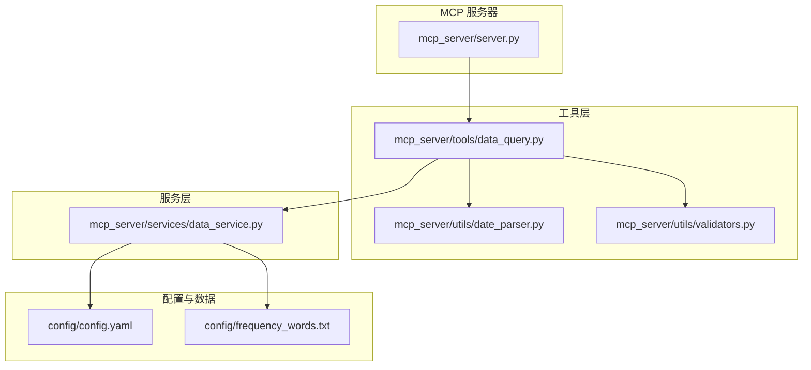
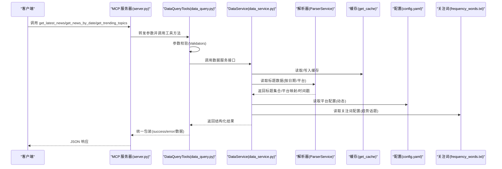
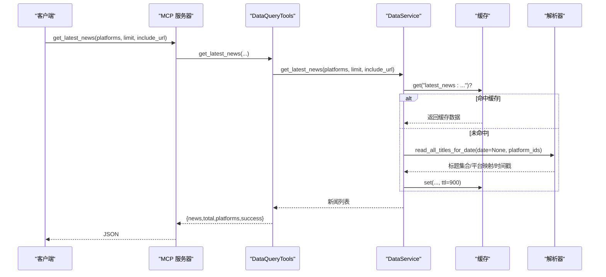
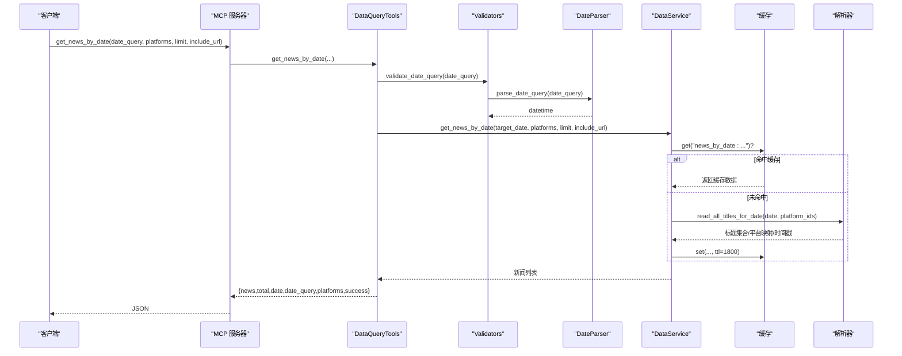
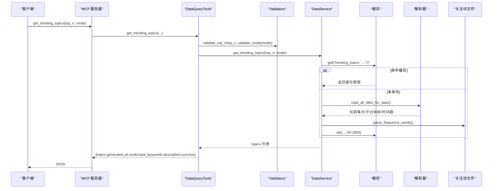
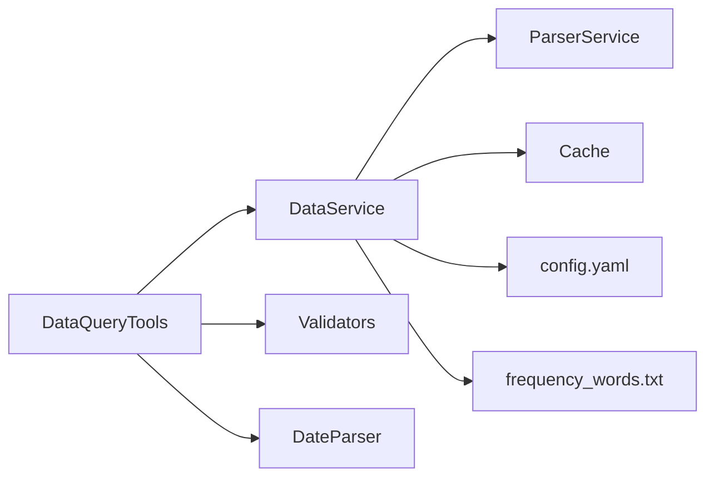

# 基础数据查询

<cite>
**本文引用的文件**
- [mcp_server/tools/data_query.py](file://mcp_server/tools/data_query.py)
- [mcp_server/services/data_service.py](file://mcp_server/services/data_service.py)
- [mcp_server/utils/date_parser.py](file://mcp_server/utils/date_parser.py)
- [mcp_server/utils/validators.py](file://mcp_server/utils/validators.py)
- [mcp_server/server.py](file://mcp_server/server.py)
- [config/frequency_words.txt](file://config/frequency_words.txt)
- [config/config.yaml](file://config/config.yaml)
</cite>

## 目录
1. [简介](#简介)
2. [项目结构](#项目结构)
3. [核心组件](#核心组件)
4. [架构总览](#架构总览)
5. [详细组件分析](#详细组件分析)
6. [依赖关系分析](#依赖关系分析)
7. [性能考量](#性能考量)
8. [故障排查指南](#故障排查指南)
9. [结论](#结论)
10. [附录](#附录)

## 简介
本文件聚焦 TrendRadar MCP 服务器的“基础数据查询”能力，围绕 P0 级核心工具：get_latest_news、get_news_by_date、get_trending_topics，系统阐述其参数定义、数据来源、返回格式与调用流程。文档还说明这些工具在 AI 分析流程中的基础作用，展示如何结合自然语言日期表达式进行实践，并解释与 resolve_date_range 工具的协同工作机制，以及在 stdio/HTTP 两种传输模式下的调用方法。

## 项目结构
- 工具层：mcp_server/tools/data_query.py 提供面向 MCP 的工具方法，负责参数校验与结果包装。
- 服务层：mcp_server/services/data_service.py 封装数据访问逻辑，连接解析器与缓存，提供统一查询接口。
- 工具层：mcp_server/server.py 注册 MCP 工具函数，暴露 get_latest_news、get_news_by_date、get_trending_topics 等 API。
- 工具层：mcp_server/utils/date_parser.py 提供自然语言日期解析与标准日期范围解析能力。
- 工具层：mcp_server/utils/validators.py 提供参数校验（平台、数量、日期范围、模式等）。
- 配置：config/config.yaml 定义平台列表、权重等；config/frequency_words.txt 定义个人关注词列表，用于 get_trending_topics 的统计。

图表来源
- [mcp_server/server.py](file://mcp_server/server.py#L113-L221)
- [mcp_server/tools/data_query.py](file://mcp_server/tools/data_query.py#L34-L284)
- [mcp_server/services/data_service.py](file://mcp_server/services/data_service.py#L30-L401)
- [mcp_server/utils/date_parser.py](file://mcp_server/utils/date_parser.py#L92-L248)
- [mcp_server/utils/validators.py](file://mcp_server/utils/validators.py#L43-L352)
- [config/config.yaml](file://config/config.yaml#L117-L140)
- [config/frequency_words.txt](file://config/frequency_words.txt#L1-L114)

章节来源
- [mcp_server/server.py](file://mcp_server/server.py#L113-L221)
- [mcp_server/tools/data_query.py](file://mcp_server/tools/data_query.py#L34-L284)
- [mcp_server/services/data_service.py](file://mcp_server/services/data_service.py#L30-L401)
- [mcp_server/utils/date_parser.py](file://mcp_server/utils/date_parser.py#L92-L248)
- [mcp_server/utils/validators.py](file://mcp_server/utils/validators.py#L43-L352)
- [config/config.yaml](file://config/config.yaml#L117-L140)
- [config/frequency_words.txt](file://config/frequency_words.txt#L1-L114)

## 核心组件
- DataQueryTools：封装三大基础查询工具，负责参数校验、调用数据服务、统一返回结构与错误处理。
- DataService：统一数据访问层，提供 get_latest_news、get_news_by_date、get_trending_topics 等接口，内置缓存与解析器集成。
- DateParser：解析自然语言日期（相对/绝对/星期/斜杠/中文等），并支持将自然语言表达解析为标准日期范围。
- Validators：参数校验工具，覆盖平台、limit、date_range、keyword、top_n、mode 等。
- MCP Server：注册工具函数，暴露 get_latest_news、get_news_by_date、get_trending_topics 等，支持 stdio/HTTP 两种传输模式。

章节来源
- [mcp_server/tools/data_query.py](file://mcp_server/tools/data_query.py#L22-L284)
- [mcp_server/services/data_service.py](file://mcp_server/services/data_service.py#L17-L401)
- [mcp_server/utils/date_parser.py](file://mcp_server/utils/date_parser.py#L14-L248)
- [mcp_server/utils/validators.py](file://mcp_server/utils/validators.py#L16-L352)
- [mcp_server/server.py](file://mcp_server/server.py#L113-L221)

## 架构总览
以下序列图展示了从 MCP 工具调用到数据服务与缓存的关键交互，以及与解析器、配置文件的关系。

图表来源
- [mcp_server/server.py](file://mcp_server/server.py#L113-L221)
- [mcp_server/tools/data_query.py](file://mcp_server/tools/data_query.py#L34-L284)
- [mcp_server/services/data_service.py](file://mcp_server/services/data_service.py#L30-L401)
- [mcp_server/utils/validators.py](file://mcp_server/utils/validators.py#L43-L352)
- [config/config.yaml](file://config/config.yaml#L117-L140)
- [config/frequency_words.txt](file://config/frequency_words.txt#L1-L114)

## 详细组件分析

### get_latest_news（获取最新新闻）
- 作用：获取最新一批爬取的新闻，快速了解当前热点。
- 参数
  - platforms: 平台ID列表，None 表示使用配置文件中的所有平台。
  - limit: 返回条数限制，默认 50，最大 1000。
  - include_url: 是否包含 URL 链接，默认 False（节省 token）。
- 数据来源
  - 读取当天最新时间戳的数据文件，按平台聚合标题，计算排名与时间戳，支持条件性添加 URL 字段。
  - 使用缓存，缓存有效期 15 分钟。
- 返回格式
  - 包含 news 列表、total、platforms、success 字段；异常时返回 success:false 与 error 字段。
- 错误处理
  - 参数校验失败返回统一错误结构；内部异常转换为 INTERNAL_ERROR。
- 调用链路
  - MCP 工具函数 -> DataQueryTools.get_latest_news -> DataService.get_latest_news -> 缓存/解析器 -> 返回结果。

图表来源
- [mcp_server/server.py](file://mcp_server/server.py#L113-L149)
- [mcp_server/tools/data_query.py](file://mcp_server/tools/data_query.py#L34-L89)
- [mcp_server/services/data_service.py](file://mcp_server/services/data_service.py#L30-L102)

章节来源
- [mcp_server/server.py](file://mcp_server/server.py#L113-L149)
- [mcp_server/tools/data_query.py](file://mcp_server/tools/data_query.py#L34-L89)
- [mcp_server/services/data_service.py](file://mcp_server/services/data_service.py#L30-L102)

### get_news_by_date（按日期查询新闻）
- 作用：按指定日期查询新闻，支持自然语言日期（如“今天”、“昨天”、“3天前”、“上周一”、“2025-10-10”等）。
- 参数
  - date_query: 日期查询字符串，默认“今天”，支持相对/绝对/星期/斜杠等多种格式。
  - platforms: 平台ID列表，None 表示使用配置文件中的所有平台。
  - limit: 返回条数限制，默认 50，最大 1000。
  - include_url: 是否包含 URL 链接，默认 False。
- 数据来源
  - 使用 DateParser.validate_date_query 解析 date_query 为 datetime；
  - 读取指定日期的数据文件，聚合标题，计算平均排名与出现次数，支持条件性添加 URL 字段；
  - 使用缓存，缓存有效期 30 分钟。
- 返回格式
  - 包含 news 列表、total、date、date_query、platforms、success 字段；异常时返回 success:false 与 error 字段。
- 调用链路
  - MCP 工具函数 -> DataQueryTools.get_news_by_date -> Validators.validate_date_query -> DataService.get_news_by_date -> 缓存/解析器 -> 返回结果。

图表来源
- [mcp_server/server.py](file://mcp_server/server.py#L176-L221)
- [mcp_server/tools/data_query.py](file://mcp_server/tools/data_query.py#L211-L284)
- [mcp_server/utils/validators.py](file://mcp_server/utils/validators.py#L309-L352)
- [mcp_server/utils/date_parser.py](file://mcp_server/utils/date_parser.py#L92-L248)
- [mcp_server/services/data_service.py](file://mcp_server/services/data_service.py#L104-L182)

章节来源
- [mcp_server/server.py](file://mcp_server/server.py#L176-L221)
- [mcp_server/tools/data_query.py](file://mcp_server/tools/data_query.py#L211-L284)
- [mcp_server/utils/validators.py](file://mcp_server/utils/validators.py#L309-L352)
- [mcp_server/utils/date_parser.py](file://mcp_server/utils/date_parser.py#L92-L248)
- [mcp_server/services/data_service.py](file://mcp_server/services/data_service.py#L104-L182)

### get_trending_topics（获取趋势话题）
- 作用：统计个人关注词在新闻中的出现频率，基于 config/frequency_words.txt 中的关键词组进行匹配，返回 TOP N。
- 参数
  - top_n: 返回 TOP N 关注词，默认 10，最大 100。
  - mode: 模式选择
    - daily：当日累计统计
    - current：最新一批统计（默认）
- 数据来源
  - 读取当天标题数据，加载关注词组（支持必选/普通两类词），按模式选择处理范围；
  - 统计词频与匹配新闻数量，构建 topics 列表；
  - 使用缓存，缓存有效期 30 分钟。
- 返回格式
  - 包含 topics、generated_at、mode、total_keywords、description、success 字段；异常时返回 success:false 与 error 字段。
- 关键点
  - 该工具统计的是“个人关注词”的频率，而非自动提取的热点；可通过编辑 frequency_words.txt 自定义关注词列表。
- 调用链路
  - MCP 工具函数 -> DataQueryTools.get_trending_topics -> Validators.validate_top_n/validate_mode -> DataService.get_trending_topics -> 缓存/解析器/关注词 -> 返回结果。

图表来源
- [mcp_server/server.py](file://mcp_server/server.py#L151-L174)
- [mcp_server/tools/data_query.py](file://mcp_server/tools/data_query.py#L154-L209)
- [mcp_server/utils/validators.py](file://mcp_server/utils/validators.py#L245-L289)
- [mcp_server/services/data_service.py](file://mcp_server/services/data_service.py#L285-L401)
- [config/frequency_words.txt](file://config/frequency_words.txt#L1-L114)

章节来源
- [mcp_server/server.py](file://mcp_server/server.py#L151-L174)
- [mcp_server/tools/data_query.py](file://mcp_server/tools/data_query.py#L154-L209)
- [mcp_server/utils/validators.py](file://mcp_server/utils/validators.py#L245-L289)
- [mcp_server/services/data_service.py](file://mcp_server/services/data_service.py#L285-L401)
- [config/frequency_words.txt](file://config/frequency_words.txt#L1-L114)

### 与 resolve_date_range 的协同工作
- 作用：将自然语言日期表达式（如“本周”、“最近7天”、“上周”等）解析为标准日期范围，保证 AI 在不同时间点调用时得到一致的日期边界。
- 使用建议：
  - 用户：“分析AI本周的情感倾向”
  - AI 步骤：
    1) resolve_date_range("本周") → 获取 {"date_range": {"start": "...", "end": "..."}}
    2) analyze_sentiment(topic="AI", date_range=上一步返回的 date_range)
- 在 get_news_by_date 中，date_query 本身支持自然语言解析；但在需要与高级分析工具配合时，建议先调用 resolve_date_range，再将返回的 date_range 传入其他工具，确保跨工具一致性。

章节来源
- [mcp_server/server.py](file://mcp_server/server.py#L40-L109)
- [mcp_server/utils/date_parser.py](file://mcp_server/utils/date_parser.py#L331-L423)

### 与解析器、缓存与配置的关系
- 解析器：DataService 通过解析器读取 output 目录下的标题数据，按日期/平台聚合。
- 缓存：对 get_latest_news、get_news_by_date、get_trending_topics 的结果进行缓存，减少 IO 与计算开销。
- 配置：
  - 平台列表：config/config.yaml 的 platforms 决定支持的平台 ID，validators.validate_platforms 会据此校验。
  - 关注词：config/frequency_words.txt 决定 get_trending_topics 的统计词库。

章节来源
- [mcp_server/services/data_service.py](file://mcp_server/services/data_service.py#L30-L102)
- [mcp_server/utils/validators.py](file://mcp_server/utils/validators.py#L16-L88)
- [config/config.yaml](file://config/config.yaml#L117-L140)
- [config/frequency_words.txt](file://config/frequency_words.txt#L1-L114)

## 依赖关系分析
- 工具层依赖服务层：DataQueryTools 通过 DataService 调用统一数据接口。
- 服务层依赖解析器与缓存：DataService 读取解析器输出并使用缓存。
- 工具层依赖参数校验：DataQueryTools 使用 validators 对参数进行统一校验。
- 工具层依赖日期解析：get_news_by_date 使用 DateParser.validate_date_query 解析自然语言日期。
- 配置与数据：DataService 读取 config.yaml 与 frequency_words.txt，决定平台与关注词。

图表来源
- [mcp_server/tools/data_query.py](file://mcp_server/tools/data_query.py#L22-L284)
- [mcp_server/services/data_service.py](file://mcp_server/services/data_service.py#L17-L401)
- [mcp_server/utils/date_parser.py](file://mcp_server/utils/date_parser.py#L92-L248)
- [mcp_server/utils/validators.py](file://mcp_server/utils/validators.py#L43-L352)
- [config/config.yaml](file://config/config.yaml#L117-L140)
- [config/frequency_words.txt](file://config/frequency_words.txt#L1-L114)

章节来源
- [mcp_server/tools/data_query.py](file://mcp_server/tools/data_query.py#L22-L284)
- [mcp_server/services/data_service.py](file://mcp_server/services/data_service.py#L17-L401)
- [mcp_server/utils/date_parser.py](file://mcp_server/utils/date_parser.py#L92-L248)
- [mcp_server/utils/validators.py](file://mcp_server/utils/validators.py#L43-L352)
- [config/config.yaml](file://config/config.yaml#L117-L140)
- [config/frequency_words.txt](file://config/frequency_words.txt#L1-L114)

## 性能考量
- 缓存策略
  - get_latest_news：15 分钟缓存，适合高频查询最新热点。
  - get_news_by_date：30 分钟缓存，历史数据缓存更久。
  - get_trending_topics：30 分钟缓存，关注词统计相对稳定。
- I/O 与解析
  - 通过解析器按日期/平台聚合标题，避免全量扫描；缓存命中可显著降低延迟。
- 参数限制
  - limit 与 top_n 有上限保护，防止过度请求导致资源压力。
- 平台校验
  - 通过 config.yaml 的平台列表进行校验，避免无效平台带来的额外开销。

[本节为通用指导，不涉及具体文件分析]

## 故障排查指南
- 常见错误类型
  - 参数错误：InvalidParameterError（如平台不支持、日期范围非法、limit 超限等）。
  - 数据不存在：DataNotFoundError（如指定日期无数据、未找到关键词新闻）。
  - 内部异常：INTERNAL_ERROR（工具层捕获未预期异常并统一返回）。
- 排查步骤
  - 检查 date_query 是否符合支持格式（相对/绝对/星期/斜杠/中文等）。
  - 检查 platforms 是否在 config.yaml 的 platforms 列表中。
  - 检查 date_range 的 start/end 是否合法且未在未来或过久远。
  - 检查 output 目录是否存在以及日期文件夹命名是否符合规范。
  - 若 get_trending_topics 返回空，确认 frequency_words.txt 是否存在且格式正确。
- 建议
  - 在调用高级分析工具前，优先使用 resolve_date_range 获取标准日期范围，避免跨时间点不一致。
  - 对于历史查询，建议先调用 get_available_date_range（由服务层提供）确认可用日期范围。

章节来源
- [mcp_server/utils/validators.py](file://mcp_server/utils/validators.py#L123-L209)
- [mcp_server/utils/date_parser.py](file://mcp_server/utils/date_parser.py#L295-L329)
- [mcp_server/services/data_service.py](file://mcp_server/services/data_service.py#L498-L537)

## 结论
- get_latest_news、get_news_by_date、get_trending_topics 是 AI 分析流程的 P0 级基础能力，分别覆盖“当前热点”“历史对比”“个人关注词趋势”三大场景。
- 通过统一的参数校验、缓存与解析器集成，三大工具在性能与稳定性方面具备良好表现。
- 与 resolve_date_range 的协同确保了自然语言日期在不同时间点的一致性，提升了 AI 分析的可复现性。
- 在 stdio/HTTP 两种传输模式下均可稳定调用，满足本地调试与生产部署的不同需求。

[本节为总结性内容，不涉及具体文件分析]

## 附录

### 传输模式与调用方法
- stdio 模式
  - 适用于本地调试与轻量集成，通过标准输入输出与 MCP 客户端通信。
  - 启动命令示例：python mcp_server/server.py --transport stdio
- HTTP 模式
  - 适用于生产环境，监听指定 host/port，端点路径为 /mcp。
  - 启动命令示例：python mcp_server/server.py --transport http --host 0.0.0.0 --port 3333

章节来源
- [mcp_server/server.py](file://mcp_server/server.py#L662-L741)

### 自然语言日期实践示例
- 相对日期：今天、昨天、前天、3天前、yesterday、3 days ago
- 星期：上周一、本周三、last monday、this friday
- 绝对日期：2025-10-10、10月10日、2025年10月10日、2025/10/10
- 日期范围：本周、上周、本月、上月、最近7天、最近30天、最近N天、last 7 days、last N days

章节来源
- [mcp_server/utils/date_parser.py](file://mcp_server/utils/date_parser.py#L92-L248)
- [mcp_server/utils/date_parser.py](file://mcp_server/utils/date_parser.py#L331-L423)

### 关注词配置说明
- 位置：config/frequency_words.txt
- 格式：每行一个关注词；支持“!”前缀的排除词；支持分组（相邻行视为同一组）。
- 影响：get_trending_topics 基于此文件统计词频，返回 TOP N 关注词及其匹配新闻数量。

章节来源
- [config/frequency_words.txt](file://config/frequency_words.txt#L1-L114)
- [mcp_server/services/data_service.py](file://mcp_server/services/data_service.py#L285-L399)