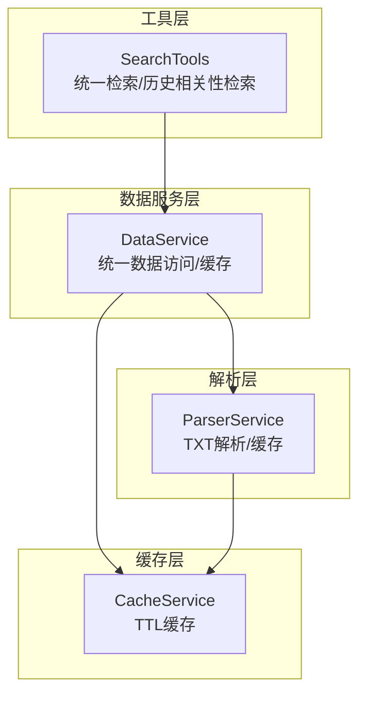
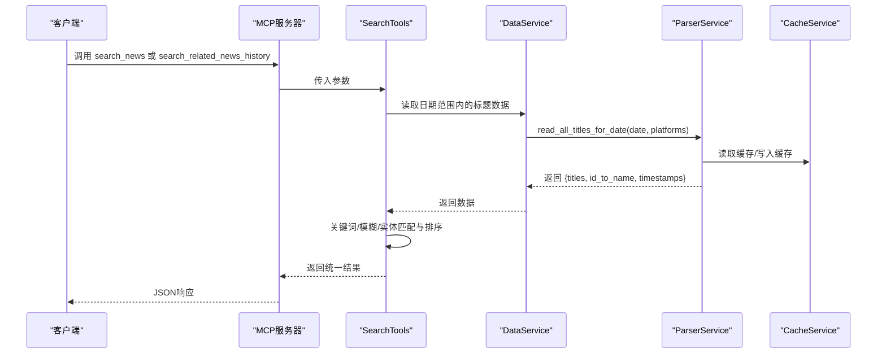
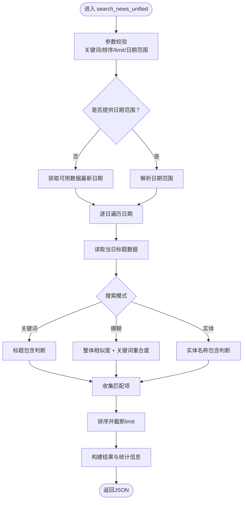
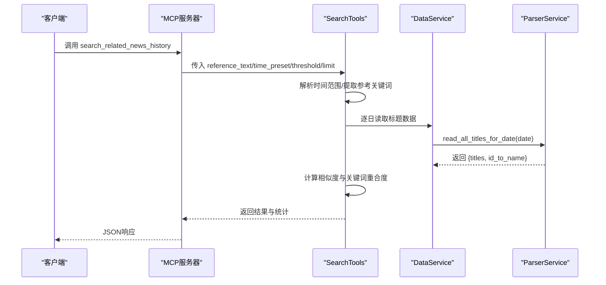
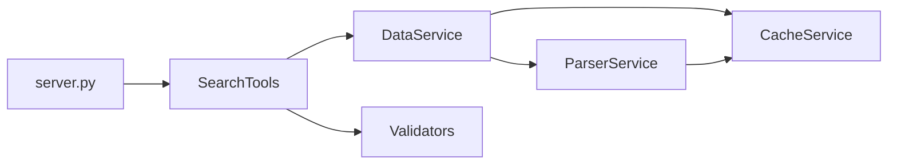

# 智能检索工具

<cite>
**本文引用的文件**
- [mcp_server/tools/search_tools.py](file://mcp_server/tools/search_tools.py)
- [mcp_server/services/data_service.py](file://mcp_server/services/data_service.py)
- [mcp_server/services/parser_service.py](file://mcp_server/services/parser_service.py)
- [mcp_server/services/cache_service.py](file://mcp_server/services/cache_service.py)
- [mcp_server/utils/validators.py](file://mcp_server/utils/validators.py)
- [mcp_server/utils/date_parser.py](file://mcp_server/utils/date_parser.py)
- [mcp_server/server.py](file://mcp_server/server.py)
</cite>

## 目录
1. [简介](#简介)
2. [项目结构](#项目结构)
3. [核心组件](#核心组件)
4. [架构总览](#架构总览)
5. [详细组件分析](#详细组件分析)
6. [依赖关系分析](#依赖关系分析)
7. [性能考量](#性能考量)
8. [故障排查指南](#故障排查指南)
9. [结论](#结论)

## 简介
本文件聚焦于MCP服务器的智能检索功能，围绕两个关键工具展开：统一新闻检索工具与历史相关新闻检索工具。我们将深入解析关键词匹配、模糊搜索与实体识别的技术细节，并结合`search_tools.py`中的实现，说明如何构建统一的新闻检索接口以支持跨平台、跨时间范围的高效查询。同时，我们将阐明其与基础数据查询模块的差异，以及在处理复杂用户查询时的优化策略，如索引机制与查询解析。

## 项目结构
智能检索能力主要由以下模块协同实现：
- 工具层：SearchTools（统一检索与历史相关性检索）
- 数据服务层：DataService（统一数据访问与缓存）
- 解析层：ParserService（TXT标题数据解析与缓存）
- 缓存层：CacheService（TTL缓存）
- 工具层：SearchTools（统一检索与历史相关性检索）
- 工具层：SearchTools（统一检索与历史相关性检索）
- 工具层：SearchTools（统一检索与历史相关性检索）

图表来源
- [mcp_server/tools/search_tools.py](file://mcp_server/tools/search_tools.py#L1-L240)
- [mcp_server/services/data_service.py](file://mcp_server/services/data_service.py#L1-L120)
- [mcp_server/services/parser_service.py](file://mcp_server/services/parser_service.py#L160-L260)
- [mcp_server/services/cache_service.py](file://mcp_server/services/cache_service.py#L1-L120)

章节来源
- [mcp_server/tools/search_tools.py](file://mcp_server/tools/search_tools.py#L1-L240)
- [mcp_server/services/data_service.py](file://mcp_server/services/data_service.py#L1-L120)
- [mcp_server/services/parser_service.py](file://mcp_server/services/parser_service.py#L160-L260)
- [mcp_server/services/cache_service.py](file://mcp_server/services/cache_service.py#L1-L120)

## 核心组件
- SearchTools：提供统一新闻检索与历史相关新闻检索两大能力，支持关键词、模糊、实体三种模式；支持跨平台、跨时间范围查询；内置相似度计算、关键词提取与排序逻辑。
- DataService：封装统一数据访问接口，负责从ParserService读取数据并应用缓存策略；提供最新/指定日期新闻查询与关键词搜索等基础能力。
- ParserService：解析TXT标题数据，支持按日期聚合、平台过滤、缓存；提供标题清洗、URL/MOBILE URL抽取等。
- CacheService：提供线程安全的TTL缓存，支持设置、获取、清理过期、统计等。
- Validators：参数校验工具，统一校验关键词、日期范围、平台列表、limit等。
- DateParser：日期解析工具，支持自然语言日期表达式解析与范围计算。

章节来源
- [mcp_server/tools/search_tools.py](file://mcp_server/tools/search_tools.py#L1-L240)
- [mcp_server/services/data_service.py](file://mcp_server/services/data_service.py#L1-L120)
- [mcp_server/services/parser_service.py](file://mcp_server/services/parser_service.py#L160-L260)
- [mcp_server/services/cache_service.py](file://mcp_server/services/cache_service.py#L1-L120)
- [mcp_server/utils/validators.py](file://mcp_server/utils/validators.py#L1-L120)
- [mcp_server/utils/date_parser.py](file://mcp_server/utils/date_parser.py#L1-L120)

## 架构总览
统一检索与历史相关性检索均通过SearchTools发起，内部委托DataService读取数据，ParserService负责TXT解析与缓存，CacheService提供TTL缓存；参数校验由Validators统一处理；日期解析由DateParser负责。

图表来源
- [mcp_server/server.py](file://mcp_server/server.py#L540-L583)
- [mcp_server/tools/search_tools.py](file://mcp_server/tools/search_tools.py#L1-L240)
- [mcp_server/services/data_service.py](file://mcp_server/services/data_service.py#L160-L260)
- [mcp_server/services/parser_service.py](file://mcp_server/services/parser_service.py#L160-L260)
- [mcp_server/services/cache_service.py](file://mcp_server/services/cache_service.py#L1-L120)

## 详细组件分析

### 统一新闻检索 search_news_unified
- 功能概述
  - 支持三种搜索模式：关键词精确匹配、模糊相似度匹配、实体名称匹配。
  - 支持跨平台、跨时间范围查询；默认按相关度排序，也可按权重或日期排序。
  - 支持阈值控制（模糊模式）、URL可选返回、限制返回条数。
- 关键实现要点
  - 参数校验：关键词、排序方式、limit、日期范围（若提供）。
  - 日期范围确定：若未提供，则使用可用数据的最新日期作为单日查询；若无可用数据，返回错误提示。
  - 数据读取：按日期遍历，调用DataService.parser.read_all_titles_for_date，支持平台过滤。
  - 模式分支：
    - 关键词模式：对标题进行不区分大小写的包含判断。
    - 模糊模式：组合直接包含、整体相似度（SequenceMatcher）与关键词重合度（Jaccard）进行综合判断。
    - 实体模式：对标题进行包含判断（实体名称）。
  - 排序与限制：按相关度/权重/日期排序，截断至limit。
  - 结果汇总：包含统计信息、时间范围描述、阈值提示等。
- 技术细节
  - 相似度计算：使用difflib.SequenceMatcher进行整体相似度；关键词重合度采用Jaccard系数。
  - 关键词提取：去除URL、方括号内容，正则分词，过滤停用词与短词。
  - 错误处理：捕获MCPError与通用异常，返回结构化错误信息；DataNotFoundError时跳过日期继续。

图表来源
- [mcp_server/tools/search_tools.py](file://mcp_server/tools/search_tools.py#L38-L240)

章节来源
- [mcp_server/tools/search_tools.py](file://mcp_server/tools/search_tools.py#L38-L240)

### 历史相关新闻检索 search_related_news_history
- 功能概述
  - 基于参考新闻（标题或内容），在历史数据中检索相关新闻。
  - 支持时间预设（昨天、上周、上月、自定义）；支持阈值与limit控制；可选返回URL。
- 关键实现要点
  - 参数校验：参考文本、阈值、limit。
  - 时间范围确定：根据预设或自定义日期计算起止；若预设为自定义需提供start_date与end_date。
  - 参考文本处理：提取关键词，若无法提取则报错。
  - 遍历日期范围：逐日读取标题数据，计算标题与参考文本的整体相似度与关键词重合度，综合得分（加权）达到阈值即纳入结果。
  - 排序与统计：按综合相似度降序；统计平台分布、日期分布、平均相似度。
- 技术细节
  - 综合相似度：关键词重合度占比更高（0.7），文本相似度占比更低（0.3），以提升语义相关性。
  - 错误处理：DataNotFoundError时跳过日期；异常记录并继续处理其他日期；最终无结果时返回友好提示。

图表来源
- [mcp_server/server.py](file://mcp_server/server.py#L540-L583)
- [mcp_server/tools/search_tools.py](file://mcp_server/tools/search_tools.py#L494-L702)
- [mcp_server/services/data_service.py](file://mcp_server/services/data_service.py#L160-L260)
- [mcp_server/services/parser_service.py](file://mcp_server/services/parser_service.py#L160-L260)

章节来源
- [mcp_server/server.py](file://mcp_server/server.py#L540-L583)
- [mcp_server/tools/search_tools.py](file://mcp_server/tools/search_tools.py#L494-L702)
- [mcp_server/services/data_service.py](file://mcp_server/services/data_service.py#L160-L260)
- [mcp_server/services/parser_service.py](file://mcp_server/services/parser_service.py#L160-L260)

### 与基础数据查询模块的差异
- 统一检索工具（SearchTools）
  - 面向“用户复杂查询”：支持多模式（关键词/模糊/实体）、跨平台、跨时间范围、阈值与排序控制、URL可选返回。
  - 内置相似度与关键词提取：适合语义相近的新闻发现与关联分析。
- 基础数据查询（DataService）
  - 面向“简单条件查询”：提供最新新闻、指定日期新闻、关键词搜索等基础能力，侧重稳定与一致性。
  - 与统一检索共享底层数据访问与缓存，但API设计与返回结构不同，前者更面向“检索体验”，后者更面向“数据直达”。

章节来源
- [mcp_server/tools/search_tools.py](file://mcp_server/tools/search_tools.py#L1-L240)
- [mcp_server/services/data_service.py](file://mcp_server/services/data_service.py#L1-L120)

### 关键词匹配、模糊搜索与实体识别技术细节
- 关键词匹配
  - 不区分大小写包含判断；支持平台过滤与URL可选返回。
- 模糊搜索
  - 组合策略：
    - 直接包含：若查询词包含于标题，直接判定匹配且相似度为1.0。
    - 整体相似度：使用difflib.SequenceMatcher计算两文本的相似度。
    - 关键词重合度：对查询与标题分别提取关键词（去除URL、方括号、停用词、短词），计算Jaccard相似度。
    - 综合阈值：综合相似度与关键词重合度，满足任一条件即匹配。
- 实体识别
  - 以实体名称在标题中的包含作为识别依据，适用于人名、公司名、产品名等固定实体。

章节来源
- [mcp_server/tools/search_tools.py](file://mcp_server/tools/search_tools.py#L242-L493)

### 查询解析与日期范围处理
- 统一检索
  - 若未提供日期范围，默认使用可用数据的最新日期作为单日查询；若无可用数据，返回错误提示。
  - 若提供日期范围，使用validators.validate_date_range进行格式与边界校验。
- 历史相关性检索
  - 支持预设时间范围（昨天、上周、上月、自定义），自定义时需提供start_date与end_date。
  - 参考文本关键词提取失败时，返回参数错误提示。

章节来源
- [mcp_server/tools/search_tools.py](file://mcp_server/tools/search_tools.py#L100-L170)
- [mcp_server/tools/search_tools.py](file://mcp_server/tools/search_tools.py#L534-L633)
- [mcp_server/utils/validators.py](file://mcp_server/utils/validators.py#L145-L210)

## 依赖关系分析
- SearchTools依赖
  - DataService：统一数据访问与缓存。
  - Validators：参数校验（关键词、limit、日期范围）。
  - DateParser：统一检索中日期范围解析（通过DataService间接使用）。
- DataService依赖
  - ParserService：TXT解析与按日期聚合。
  - CacheService：TTL缓存（最新数据15分钟，历史数据1小时）。
- ParserService依赖
  - CacheService：缓存解析结果。
- 服务器集成
  - server.py通过@mcp.tool装饰器注册工具，内部构造SearchTools实例并转发调用。

图表来源
- [mcp_server/server.py](file://mcp_server/server.py#L29-L37)
- [mcp_server/tools/search_tools.py](file://mcp_server/tools/search_tools.py#L1-L40)
- [mcp_server/services/data_service.py](file://mcp_server/services/data_service.py#L1-L40)
- [mcp_server/services/parser_service.py](file://mcp_server/services/parser_service.py#L1-L40)
- [mcp_server/services/cache_service.py](file://mcp_server/services/cache_service.py#L1-L40)

章节来源
- [mcp_server/server.py](file://mcp_server/server.py#L29-L37)
- [mcp_server/tools/search_tools.py](file://mcp_server/tools/search_tools.py#L1-L40)
- [mcp_server/services/data_service.py](file://mcp_server/services/data_service.py#L1-L40)
- [mcp_server/services/parser_service.py](file://mcp_server/services/parser_service.py#L1-L40)
- [mcp_server/services/cache_service.py](file://mcp_server/services/cache_service.py#L1-L40)

## 性能考量
- 缓存策略
  - ParserService与DataService对读取结果进行缓存，最新数据缓存15分钟，历史数据缓存1小时，显著降低重复查询开销。
- 索引与预处理
  - 当前实现未见全文索引或倒排表；相似度计算与关键词提取在内存中完成，适合中小规模数据。
- 优化建议
  - 对高频查询建立轻量索引（如按平台/日期的二级索引），减少遍历成本。
  - 对模糊匹配引入更高效的近似匹配算法（如MinHash/LSH）以加速大规模文本相似度计算。
  - 对关键词提取增加词干化与同义词映射，提升语义召回效果。
  - 对历史相关性检索，可考虑对参考文本建立关键词向量，使用向量检索替代逐日扫描。

[本节为通用性能讨论，无需特定文件引用]

## 故障排查指南
- 常见错误与定位
  - 无可用数据：统一检索在未提供日期范围且无可用数据时返回错误提示；可通过检查output目录与日期范围确认。
  - 参数错误：关键词为空、limit超限、日期范围非法、平台不支持等，均会抛出InvalidParameterError或DataNotFoundError。
  - 参考文本无法提取关键词：历史相关性检索要求参考文本具备可提取关键词，否则返回参数错误。
- 排查步骤
  - 确认output目录存在且包含目标日期数据。
  - 使用统一检索时，若未提供日期范围，确认系统可用数据范围。
  - 使用历史相关性检索时，确认time_preset或自定义日期范围合法。
  - 检查平台ID是否在配置中，避免平台不支持错误。
- 日志与提示
  - 历史相关性检索在处理日期时遇到异常会记录警告并继续处理其他日期，便于定位问题日期。

章节来源
- [mcp_server/tools/search_tools.py](file://mcp_server/tools/search_tools.py#L100-L170)
- [mcp_server/tools/search_tools.py](file://mcp_server/tools/search_tools.py#L534-L633)
- [mcp_server/utils/validators.py](file://mcp_server/utils/validators.py#L145-L210)

## 结论
统一新闻检索与历史相关新闻检索通过SearchTools实现了对关键词、模糊与实体的多模式支持，并在跨平台、跨时间范围内提供高效查询体验。其与基础数据查询模块形成互补：前者面向复杂语义检索与关联分析，后者面向简单条件查询与稳定数据直达。通过DataService与ParserService的缓存机制，系统在性能与一致性之间取得平衡。未来可在索引与向量化检索方面进一步优化，以支撑更大规模与更复杂的查询场景。