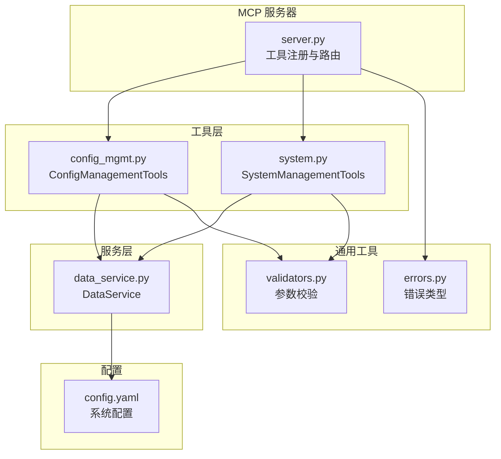
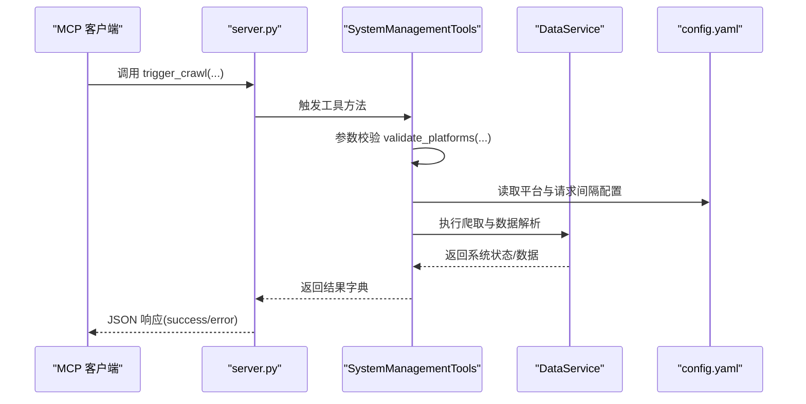
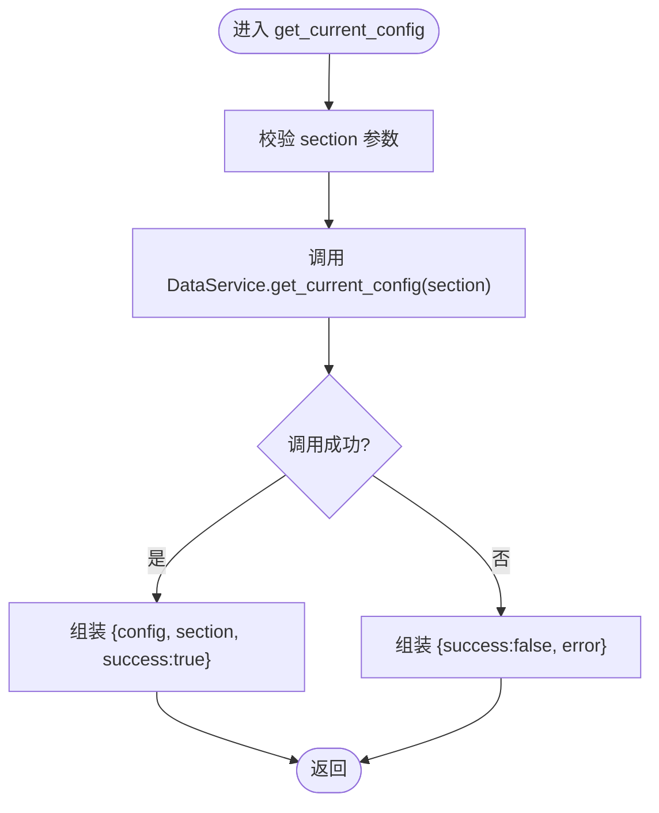
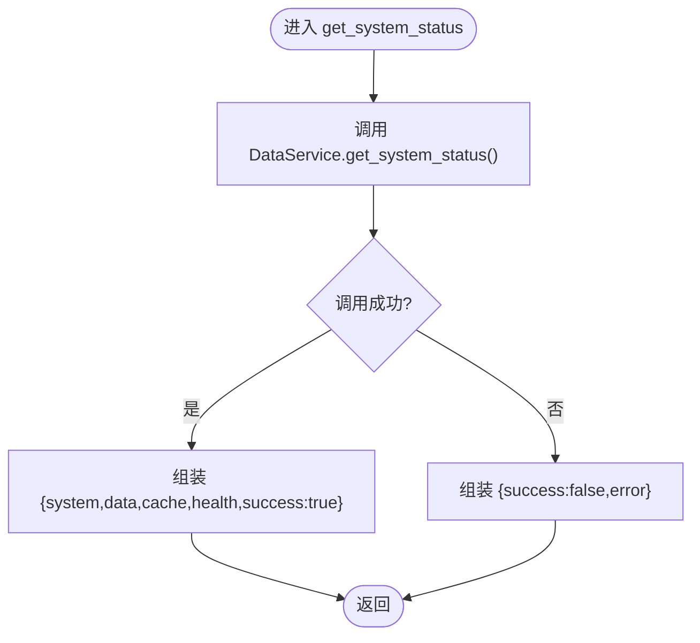
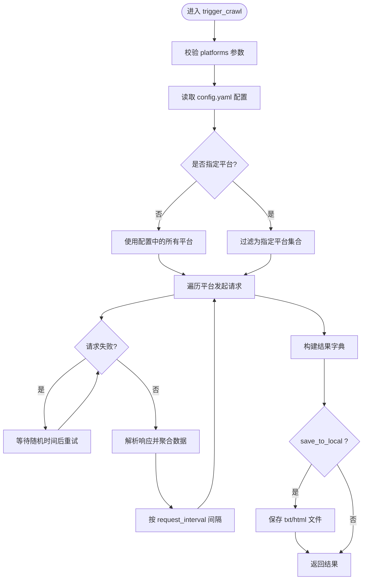
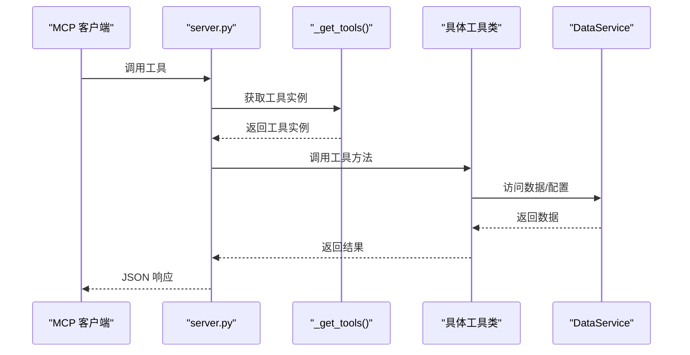
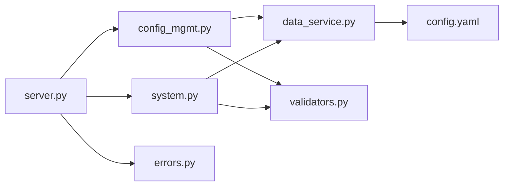

# 系统管理与配置

<cite>
**本文引用的文件**
- [mcp_server/server.py](file://mcp_server/server.py)
- [mcp_server/tools/config_mgmt.py](file://mcp_server/tools/config_mgmt.py)
- [mcp_server/tools/system.py](file://mcp_server/tools/system.py)
- [mcp_server/services/data_service.py](file://mcp_server/services/data_service.py)
- [mcp_server/utils/validators.py](file://mcp_server/utils/validators.py)
- [mcp_server/utils/errors.py](file://mcp_server/utils/errors.py)
- [config/config.yaml](file://config/config.yaml)
- [docs/MCP-API-Reference.md](file://docs/MCP-API-Reference.md)
</cite>

## 目录
1. [简介](#简介)
2. [项目结构](#项目结构)
3. [核心组件](#核心组件)
4. [架构总览](#架构总览)
5. [详细组件分析](#详细组件分析)
6. [依赖关系分析](#依赖关系分析)
7. [性能考量](#性能考量)
8. [故障排查指南](#故障排查指南)
9. [结论](#结论)
10. [附录](#附录)

## 简介
本文件聚焦于 TrendRadar MCP 服务器的系统管理能力，围绕三个关键工具展开：获取当前系统配置（get_current_config）、获取系统运行状态（get_system_status）与手动触发爬取任务（trigger_crawl）。我们将基于 mcp_server/tools/config_mgmt.py 与 mcp_server/tools/system.py 的实现，解释如何安全地暴露系统配置与运行状态信息，并通过 MCP 协议安全地触发主程序的爬取任务。同时提供系统健康检查与手动干预的操作指南，并讨论权限控制与操作审计等安全要点。

## 项目结构
- MCP 服务器入口与工具注册位于 mcp_server/server.py，负责将工具方法暴露为 MCP 工具。
- 配置管理工具与系统管理工具分别位于 mcp_server/tools/config_mgmt.py 与 mcp_server/tools/system.py。
- 数据服务层 mcp_server/services/data_service.py 提供配置与状态查询的具体实现。
- 参数校验与错误类型位于 mcp_server/utils/validators.py 与 mcp_server/utils/errors.py。
- 配置文件 config/config.yaml 定义了爬虫、推送、权重与平台等配置项。

图表来源
- [mcp_server/server.py](file://mcp_server/server.py#L585-L658)
- [mcp_server/tools/config_mgmt.py](file://mcp_server/tools/config_mgmt.py#L1-L67)
- [mcp_server/tools/system.py](file://mcp_server/tools/system.py#L1-L120)
- [mcp_server/services/data_service.py](file://mcp_server/services/data_service.py#L411-L605)
- [mcp_server/utils/validators.py](file://mcp_server/utils/validators.py#L292-L307)
- [mcp_server/utils/errors.py](file://mcp_server/utils/errors.py#L1-L94)
- [config/config.yaml](file://config/config.yaml#L1-L140)

章节来源
- [mcp_server/server.py](file://mcp_server/server.py#L585-L658)
- [mcp_server/tools/config_mgmt.py](file://mcp_server/tools/config_mgmt.py#L1-L67)
- [mcp_server/tools/system.py](file://mcp_server/tools/system.py#L1-L120)
- [mcp_server/services/data_service.py](file://mcp_server/services/data_service.py#L411-L605)
- [mcp_server/utils/validators.py](file://mcp_server/utils/validators.py#L292-L307)
- [mcp_server/utils/errors.py](file://mcp_server/utils/errors.py#L1-L94)
- [config/config.yaml](file://config/config.yaml#L1-L140)

## 核心组件
- 配置管理工具 ConfigManagementTools
  - 通过 get_current_config(section) 返回当前系统配置的子集或全量配置。
  - 使用参数校验 validate_config_section 限定 section 取值。
  - 通过 DataService.get_current_config 读取并缓存配置。
- 系统管理工具 SystemManagementTools
  - get_system_status(): 返回系统版本、数据统计、缓存状态与健康状态。
  - trigger_crawl(platforms, save_to_local, include_url): 手动触发一次临时爬取任务，支持可选持久化与URL包含。
- 服务器入口 server.py
  - 将上述工具方法注册为 MCP 工具，统一返回 JSON 结构，包含 success 与 error 字段。

章节来源
- [mcp_server/tools/config_mgmt.py](file://mcp_server/tools/config_mgmt.py#L26-L67)
- [mcp_server/tools/system.py](file://mcp_server/tools/system.py#L33-L120)
- [mcp_server/server.py](file://mcp_server/server.py#L585-L658)
- [mcp_server/services/data_service.py](file://mcp_server/services/data_service.py#L411-L605)

## 架构总览
MCP 服务器采用“工具层-服务层-配置层”的分层设计：
- 工具层：对外暴露 get_current_config、get_system_status、trigger_crawl 等工具方法。
- 服务层：DataService 封装配置读取、系统状态统计与缓存访问。
- 配置层：config.yaml 提供爬虫、推送、权重与平台等配置；validators.py 提供参数校验；errors.py 提供统一错误类型。

图表来源
- [mcp_server/server.py](file://mcp_server/server.py#L625-L658)
- [mcp_server/tools/system.py](file://mcp_server/tools/system.py#L68-L120)
- [mcp_server/services/data_service.py](file://mcp_server/services/data_service.py#L538-L605)
- [config/config.yaml](file://config/config.yaml#L1-L140)

## 详细组件分析

### 配置管理工具：get_current_config
- 输入参数
  - section: 可选值 "all" | "crawler" | "push" | "keywords" | "weights"，默认 "all"。
- 参数校验
  - 使用 validate_config_section(section) 保证取值合法。
- 数据来源
  - 通过 DataService.get_current_config(section) 读取并缓存配置。
- 返回结构
  - 成功时返回 { config, section, success: true }。
  - 失败时返回 { success: false, error: { code, message, suggestion? } }。
- 安全与健壮性
  - 统一错误处理，避免内部异常泄露。
  - 配置读取带缓存，减少磁盘访问。

图表来源
- [mcp_server/tools/config_mgmt.py](file://mcp_server/tools/config_mgmt.py#L26-L67)
- [mcp_server/utils/validators.py](file://mcp_server/utils/validators.py#L292-L307)
- [mcp_server/services/data_service.py](file://mcp_server/services/data_service.py#L411-L496)
- [mcp_server/utils/errors.py](file://mcp_server/utils/errors.py#L1-L94)

章节来源
- [mcp_server/tools/config_mgmt.py](file://mcp_server/tools/config_mgmt.py#L26-L67)
- [mcp_server/utils/validators.py](file://mcp_server/utils/validators.py#L292-L307)
- [mcp_server/services/data_service.py](file://mcp_server/services/data_service.py#L411-L496)
- [mcp_server/utils/errors.py](file://mcp_server/utils/errors.py#L1-L94)

### 系统状态查询：get_system_status
- 功能概述
  - 返回系统版本、项目根目录、数据存储统计、缓存统计与健康状态。
- 数据来源
  - 通过 DataService.get_system_status() 统计 output 目录大小、最早/最新记录日期、读取版本文件。
- 返回结构
  - 成功时返回 { system, data, cache, health, success: true }。
  - 失败时返回 { success: false, error }。

图表来源
- [mcp_server/tools/system.py](file://mcp_server/tools/system.py#L33-L67)
- [mcp_server/services/data_service.py](file://mcp_server/services/data_service.py#L538-L605)
- [mcp_server/utils/errors.py](file://mcp_server/utils/errors.py#L1-L94)

章节来源
- [mcp_server/tools/system.py](file://mcp_server/tools/system.py#L33-L67)
- [mcp_server/services/data_service.py](file://mcp_server/services/data_service.py#L538-L605)
- [mcp_server/utils/errors.py](file://mcp_server/utils/errors.py#L1-L94)

### 爬取任务触发：trigger_crawl
- 输入参数
  - platforms: 平台ID列表，为空则使用 config.yaml 中配置的所有平台。
  - save_to_local: 是否保存到本地 output 目录。
  - include_url: 是否包含URL链接（节省token）。
- 参数校验
  - 使用 validate_platforms(platforms) 校验平台合法性；若配置加载失败则降级允许所有平台。
- 配置读取
  - 读取 config/config.yaml 的 platforms 与 crawler.request_interval。
- 爬取流程
  - 遍历目标平台，构造请求URL并发起HTTP请求，解析响应，聚合结果。
  - 带重试与随机退避，按 request_interval 间隔请求。
  - 可选保存为 txt/html 文件，生成简单HTML报告。
- 返回结构
  - 成功时返回 { success: true, task_id, status, crawl_time, platforms, total_news, failed_platforms, data, saved_to_local?, saved_files?, note }。
  - 失败时返回 { success: false, error }。

图表来源
- [mcp_server/tools/system.py](file://mcp_server/tools/system.py#L68-L376)
- [mcp_server/utils/validators.py](file://mcp_server/utils/validators.py#L43-L88)
- [config/config.yaml](file://config/config.yaml#L1-L140)
- [mcp_server/utils/errors.py](file://mcp_server/utils/errors.py#L1-L94)

章节来源
- [mcp_server/tools/system.py](file://mcp_server/tools/system.py#L68-L376)
- [mcp_server/utils/validators.py](file://mcp_server/utils/validators.py#L43-L88)
- [config/config.yaml](file://config/config.yaml#L1-L140)
- [mcp_server/utils/errors.py](file://mcp_server/utils/errors.py#L1-L94)

### 服务器工具注册与调用链
- server.py 将工具方法注册为 @mcp.tool，统一包装返回 JSON。
- get_current_config、get_system_status、trigger_crawl 三个工具均通过 _get_tools() 获取单例工具实例，再调用对应工具类的方法。

图表来源
- [mcp_server/server.py](file://mcp_server/server.py#L29-L37)
- [mcp_server/server.py](file://mcp_server/server.py#L585-L658)

章节来源
- [mcp_server/server.py](file://mcp_server/server.py#L29-L37)
- [mcp_server/server.py](file://mcp_server/server.py#L585-L658)

## 依赖关系分析
- 工具层依赖
  - ConfigManagementTools 依赖 DataService 与 validators。
  - SystemManagementTools 依赖 DataService、validators 与错误类型。
- 服务层依赖
  - DataService 依赖缓存与解析服务，读取 config.yaml 并统计系统状态。
- 配置与校验
  - validators 提供平台列表动态获取与参数校验。
  - errors 提供统一错误类型，便于前端/客户端处理。

图表来源
- [mcp_server/tools/config_mgmt.py](file://mcp_server/tools/config_mgmt.py#L1-L67)
- [mcp_server/tools/system.py](file://mcp_server/tools/system.py#L1-L120)
- [mcp_server/services/data_service.py](file://mcp_server/services/data_service.py#L411-L605)
- [mcp_server/utils/validators.py](file://mcp_server/utils/validators.py#L1-L120)
- [mcp_server/utils/errors.py](file://mcp_server/utils/errors.py#L1-L94)
- [mcp_server/server.py](file://mcp_server/server.py#L585-L658)
- [config/config.yaml](file://config/config.yaml#L1-L140)

章节来源
- [mcp_server/tools/config_mgmt.py](file://mcp_server/tools/config_mgmt.py#L1-L67)
- [mcp_server/tools/system.py](file://mcp_server/tools/system.py#L1-L120)
- [mcp_server/services/data_service.py](file://mcp_server/services/data_service.py#L411-L605)
- [mcp_server/utils/validators.py](file://mcp_server/utils/validators.py#L1-L120)
- [mcp_server/utils/errors.py](file://mcp_server/utils/errors.py#L1-L94)
- [mcp_server/server.py](file://mcp_server/server.py#L585-L658)
- [config/config.yaml](file://config/config.yaml#L1-L140)

## 性能考量
- 缓存策略
  - DataService 在多项查询中使用缓存（如 get_latest_news、get_news_by_date、get_trending_topics、get_current_config），显著降低重复查询开销。
- 请求间隔与退避
  - trigger_crawl 使用 request_interval 与随机退避，避免对上游接口造成压力。
- 数据持久化
  - save_to_local 仅在需要时写入文件，避免不必要的I/O。
- 建议
  - 合理设置 limit 与 date_range，避免一次性返回过多数据。
  - 使用 include_url 时注意 token 消耗，必要时关闭以节省成本。

[本节为通用性能建议，不直接分析具体文件]

## 故障排查指南
- 常见错误与定位
  - INVALID_PARAMETER: 参数不合法（如平台ID不在配置中、limit 超限、日期范围错误）。
  - DATA_NOT_FOUND: 数据不存在（如历史日期无数据）。
  - CRAWL_TASK_ERROR: 爬取任务错误（如配置文件缺失、平台不可用）。
  - INTERNAL_ERROR: 服务器内部异常（打印 traceback 便于定位）。
- 排查步骤
  - 使用 get_system_status 检查系统版本、数据统计与缓存状态。
  - 使用 get_current_config(section) 检查配置节是否正确。
  - 若 trigger_crawl 失败，检查 config.yaml 的 platforms 与 request_interval，确认网络可达性与上游接口状态。
  - 查看返回的 error.suggestion 字段获取修复建议。
- 日志与可观测性
  - 服务器启动时打印已注册工具列表与传输模式，便于确认工具可用性。
  - 保存本地文件时，若保存失败会返回 save_error 并提示仅内存中有数据。

章节来源
- [mcp_server/utils/errors.py](file://mcp_server/utils/errors.py#L1-L94)
- [mcp_server/server.py](file://mcp_server/server.py#L660-L741)
- [mcp_server/tools/system.py](file://mcp_server/tools/system.py#L361-L376)
- [mcp_server/services/data_service.py](file://mcp_server/services/data_service.py#L538-L605)

## 结论
- get_current_config、get_system_status、trigger_crawl 三工具通过清晰的参数校验与统一的错误处理，实现了对系统配置与运行状态的安全暴露，以及对主程序爬取任务的安全触发。
- 服务器采用分层设计与缓存策略，兼顾性能与可靠性。
- 建议在生产环境中结合 HTTP 传输模式与严格的权限控制与审计策略，确保 MCP 服务的安全与合规。

[本节为总结性内容，不直接分析具体文件]

## 附录

### 系统健康检查与手动干预操作指南
- 健康检查
  - 调用 get_system_status 获取系统版本、数据统计、缓存状态与健康状态。
  - 若 data.total_storage 为 0 或 data.oldest_record/latest_record 为空，说明尚未产生数据或 output 目录异常。
- 手动干预
  - 使用 trigger_crawl 临时触发爬取，可指定 platforms、save_to_local、include_url。
  - 若 save_to_local=true，系统会在 output/<日期>/<txt|html> 生成文件，便于离线分析。
- 配置核对
  - 使用 get_current_config("crawler") 检查 enable_crawler、use_proxy、request_interval。
  - 使用 get_current_config("push") 检查通知渠道与推送窗口配置。
  - 使用 get_current_config("keywords") 与 get_current_config("weights") 检查关键词与权重配置。

章节来源
- [mcp_server/server.py](file://mcp_server/server.py#L610-L658)
- [mcp_server/tools/system.py](file://mcp_server/tools/system.py#L33-L120)
- [mcp_server/tools/config_mgmt.py](file://mcp_server/tools/config_mgmt.py#L26-L67)
- [config/config.yaml](file://config/config.yaml#L1-L140)

### 权限控制与操作审计安全考虑
- 权限控制
  - 服务器未内置认证/鉴权机制，建议在部署层通过网络隔离、反向代理或容器编排工具限制访问源。
  - 仅在可信网络内暴露 HTTP 端点，避免公网直连。
- 操作审计
  - 建议在反向代理或网关层记录 MCP 请求日志（工具名、参数摘要、时间戳、客户端IP）。
  - 对 trigger_crawl 等高风险操作，可在业务侧增加二次确认与操作记录。
- 配置安全
  - config.yaml 中包含敏感信息（如 webhooks），应妥善保管，避免泄露。
  - 建议使用环境变量或密钥管理服务注入敏感配置，而非直接写入文件。

章节来源
- [config/config.yaml](file://config/config.yaml#L60-L109)
- [docs/MCP-API-Reference.md](file://docs/MCP-API-Reference.md#L384-L407)