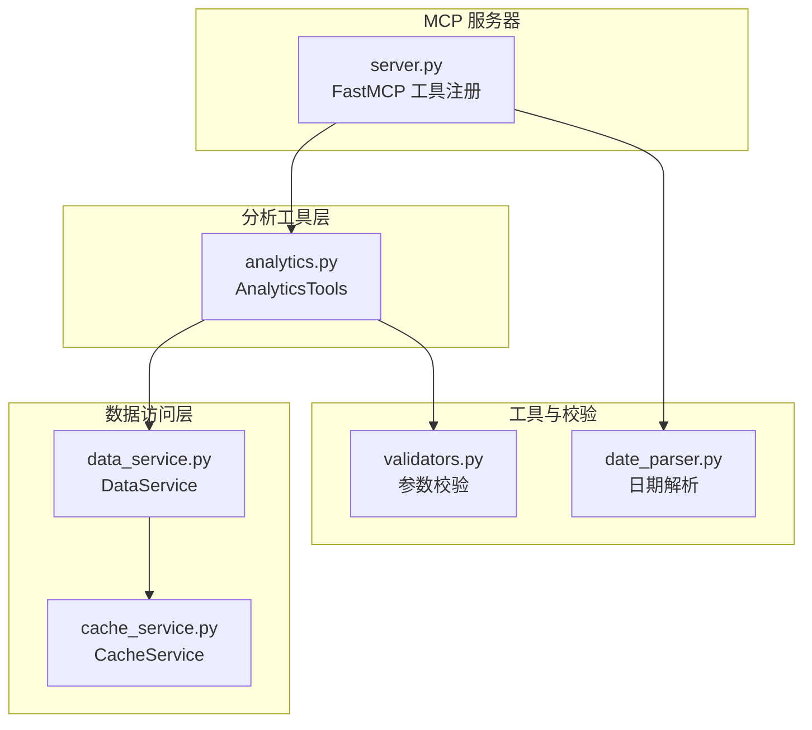
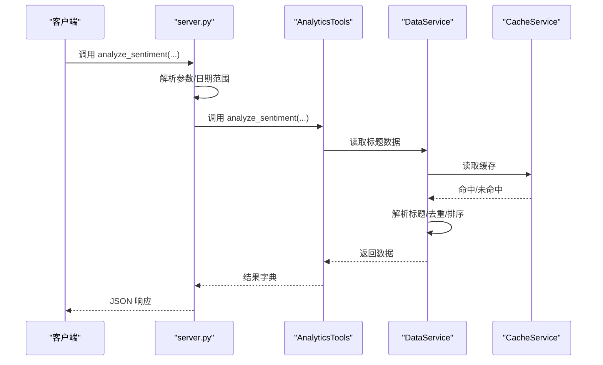
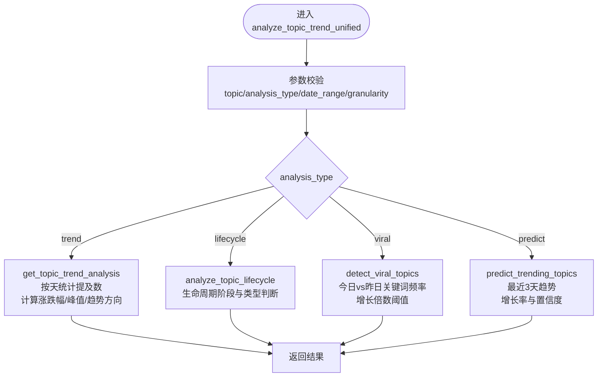
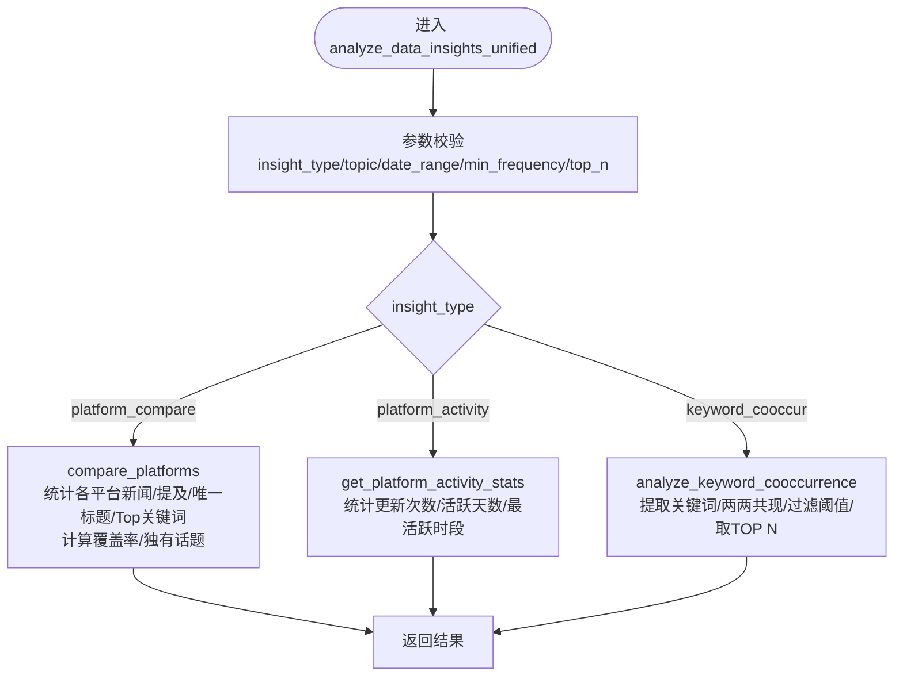
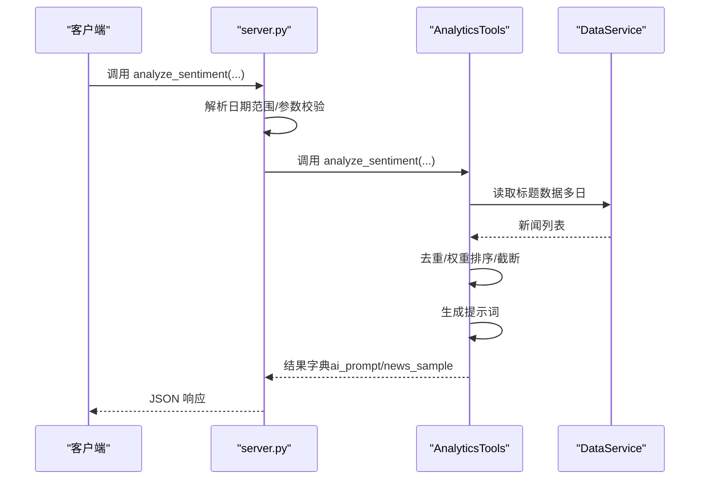
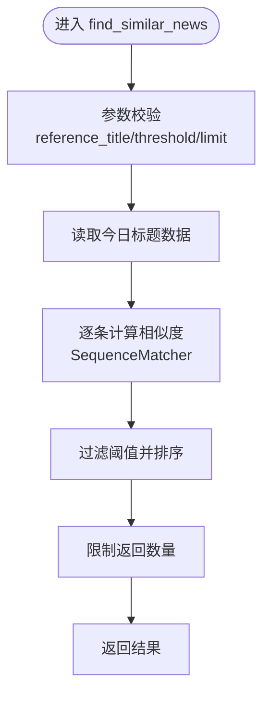
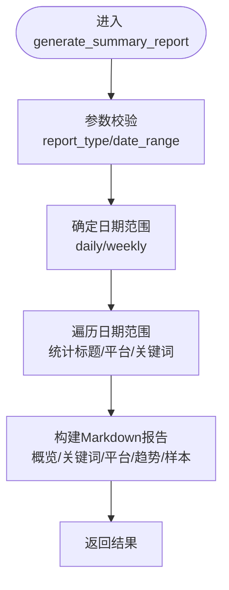
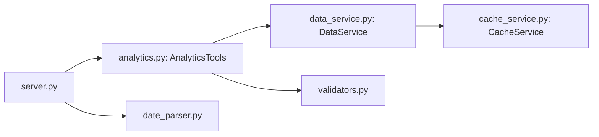

# 高级数据分析

<cite>
**本文引用的文件**
- [analytics.py](file://mcp_server/tools/analytics.py)
- [server.py](file://mcp_server/server.py)
- [data_service.py](file://mcp_server/services/data_service.py)
- [cache_service.py](file://mcp_server/services/cache_service.py)
- [validators.py](file://mcp_server/utils/validators.py)
- [date_parser.py](file://mcp_server/utils/date_parser.py)
</cite>

## 目录
1. [简介](#简介)
2. [项目结构](#项目结构)
3. [核心组件](#核心组件)
4. [架构总览](#架构总览)
5. [详细组件分析](#详细组件分析)
6. [依赖关系分析](#依赖关系分析)
7. [性能考量](#性能考量)
8. [故障排查指南](#故障排查指南)
9. [结论](#结论)
10. [附录](#附录)

## 简介
本文件聚焦 TrendRadar MCP 服务器的高级数据分析能力，围绕以下工具的算法逻辑与实现细节展开：analyze_topic_trend、analyze_data_insights、analyze_sentiment、find_similar_news、generate_summary_report。文档解释话题趋势预测、情感倾向判断和摘要生成的技术方案，说明如何将原始热点数据转化为可操作的业务洞察，并提供客户端调用这些分析功能的完整示例。同时讨论性能优化策略，如结果缓存与计算资源管理。

## 项目结构
- MCP 服务器通过 FastMCP 注册工具，对外暴露统一的分析接口。
- 高级分析工具集中在 analytics.py 中，封装了趋势分析、生命周期分析、异常检测、预测、情感分析、相似新闻查找、摘要报告等功能。
- 数据访问层由 data_service.py 提供，统一读取 output 目录下的聚合数据；缓存由 cache_service.py 提供 TTL 缓存。
- 参数校验与日期解析分别由 validators.py 与 date_parser.py 提供，保证输入合法性与日期一致性。

图表来源
- [server.py](file://mcp_server/server.py#L1-L120)
- [analytics.py](file://mcp_server/tools/analytics.py#L1-L120)
- [data_service.py](file://mcp_server/services/data_service.py#L1-L60)
- [cache_service.py](file://mcp_server/services/cache_service.py#L1-L60)
- [validators.py](file://mcp_server/utils/validators.py#L1-L60)
- [date_parser.py](file://mcp_server/utils/date_parser.py#L1-L60)

章节来源
- [server.py](file://mcp_server/server.py#L1-L120)
- [analytics.py](file://mcp_server/tools/analytics.py#L1-L120)
- [data_service.py](file://mcp_server/services/data_service.py#L1-L60)
- [cache_service.py](file://mcp_server/services/cache_service.py#L1-L60)
- [validators.py](file://mcp_server/utils/validators.py#L1-L60)
- [date_parser.py](file://mcp_server/utils/date_parser.py#L1-L60)

## 核心组件
- AnalyticsTools：高级分析工具集合，负责话题趋势、生命周期、异常检测、预测、情感分析、相似新闻、摘要报告等。
- DataService：统一数据访问层，封装读取标题数据、关键词统计、趋势话题等逻辑，并集成缓存。
- CacheService：轻量 TTL 缓存，提升热点查询性能。
- 参数校验与日期解析：validators.py 与 date_parser.py 提供严格的参数校验与日期范围解析，确保工具输入合法且日期一致。

章节来源
- [analytics.py](file://mcp_server/tools/analytics.py#L77-L120)
- [data_service.py](file://mcp_server/services/data_service.py#L17-L40)
- [cache_service.py](file://mcp_server/services/cache_service.py#L12-L40)
- [validators.py](file://mcp_server/utils/validators.py#L90-L140)
- [date_parser.py](file://mcp_server/utils/date_parser.py#L140-L210)

## 架构总览
MCP 服务器通过 FastMCP 注册工具，客户端以标准协议调用工具。分析工具链路如下：
- 客户端调用工具 → 服务器解析参数 → 日期解析（必要时）→ 参数校验 → 调用 AnalyticsTools → 读取数据（DataService）→ 返回结果。

图表来源
- [server.py](file://mcp_server/server.py#L334-L396)
- [analytics.py](file://mcp_server/tools/analytics.py#L631-L802)
- [data_service.py](file://mcp_server/services/data_service.py#L31-L103)
- [cache_service.py](file://mcp_server/services/cache_service.py#L21-L42)

## 详细组件分析

### analyze_topic_trend（统一话题趋势分析）
- 功能概述：整合“热度趋势”“生命周期”“异常爆火检测”“话题预测”四种模式，支持按自然语言日期解析后的标准日期范围。
- 关键流程：
  - 参数校验：topic、analysis_type、date_range、granularity、阈值与置信度等。
  - 模式路由：根据 analysis_type 调用对应方法。
  - 数据读取：通过 DataService 读取标题数据，按天聚合统计。
  - 指标计算：趋势方向、峰值、涨跌幅、活跃天数、平均提及次数等。
- 算法要点：
  - 热度趋势：按日期遍历，统计包含 topic 的标题数量，计算首尾涨跌幅与峰值时间。
  - 生命周期：识别首次/末次出现、峰值、活跃天数、阶段（上升/爆发/稳定/衰退）与类型（昙花一现/持续热点/周期性热点）。
  - 异常爆火检测：比较今日与昨日关键词频率，计算增长倍数，高于阈值即判定为爆火。
  - 话题预测：基于最近3天关键词频率计算增长率与置信度，筛选上升趋势并排序。

图表来源
- [analytics.py](file://mcp_server/tools/analytics.py#L156-L243)
- [analytics.py](file://mcp_server/tools/analytics.py#L244-L387)
- [analytics.py](file://mcp_server/tools/analytics.py#L1465-L1621)
- [analytics.py](file://mcp_server/tools/analytics.py#L1623-L1757)
- [analytics.py](file://mcp_server/tools/analytics.py#L1759-L1906)

章节来源
- [analytics.py](file://mcp_server/tools/analytics.py#L156-L243)
- [analytics.py](file://mcp_server/tools/analytics.py#L244-L387)
- [analytics.py](file://mcp_server/tools/analytics.py#L1465-L1621)
- [analytics.py](file://mcp_server/tools/analytics.py#L1623-L1757)
- [analytics.py](file://mcp_server/tools/analytics.py#L1759-L1906)

### analyze_data_insights（统一数据洞察分析）
- 功能概述：整合“平台对比”“平台活跃度统计”“关键词共现分析”三种洞察模式。
- 关键流程：
  - 参数校验：insight_type、topic、date_range、min_frequency、top_n。
  - 模式路由：根据 insight_type 调用对应方法。
  - 数据读取：遍历日期范围，统计各平台新闻数、话题提及数、唯一标题数、Top 关键词。
  - 平台对比：计算覆盖率、Top 关键词、平台独有话题。
  - 平台活跃度：统计更新次数、活跃天数、平均每日新闻数、最活跃时段。
  - 关键词共现：提取关键词，统计两两共现频次，过滤阈值并取 TOP N。

图表来源
- [analytics.py](file://mcp_server/tools/analytics.py#L89-L155)
- [analytics.py](file://mcp_server/tools/analytics.py#L402-L525)
- [analytics.py](file://mcp_server/tools/analytics.py#L1338-L1463)
- [analytics.py](file://mcp_server/tools/analytics.py#L526-L630)

章节来源
- [analytics.py](file://mcp_server/tools/analytics.py#L89-L155)
- [analytics.py](file://mcp_server/tools/analytics.py#L402-L525)
- [analytics.py](file://mcp_server/tools/analytics.py#L1338-L1463)
- [analytics.py](file://mcp_server/tools/analytics.py#L526-L630)

### analyze_sentiment（情感倾向分析）
- 功能概述：生成用于 AI 情感分析的结构化提示词，返回新闻样本与统计摘要。
- 关键流程：
  - 参数校验：topic、platforms、date_range、limit、sort_by_weight、include_url。
  - 日期范围：支持自然语言解析后传入的标准日期范围。
  - 数据收集：遍历日期范围，收集标题、平台、ranks、count 等信息。
  - 去重与排序：按标题去重，若启用权重排序则按 calculate_news_weight 排序。
  - 提示词生成：按平台分组，构建结构化提示词，包含任务说明、数据概览、平台列表、输出格式说明等。
- 算法要点：
  - 权重计算：综合排名、频次、高排名比例，形成可排序的权重分数。
  - 提示词模板：固定结构，便于下游模型进行情感分布统计、平台对比、趋势总结与典型样本抽取。

图表来源
- [server.py](file://mcp_server/server.py#L334-L396)
- [analytics.py](file://mcp_server/tools/analytics.py#L631-L802)
- [data_service.py](file://mcp_server/services/data_service.py#L104-L183)

章节来源
- [analytics.py](file://mcp_server/tools/analytics.py#L631-L802)
- [data_service.py](file://mcp_server/services/data_service.py#L104-L183)
- [server.py](file://mcp_server/server.py#L334-L396)

### find_similar_news（相似新闻查找）
- 功能概述：基于标题相似度查找与参考标题相似的新闻。
- 关键流程：
  - 参数校验：reference_title、threshold、limit、include_url。
  - 数据读取：读取今日所有标题。
  - 相似度计算：使用 SequenceMatcher 计算标题相似度，过滤阈值并排序。
  - 结果返回：按相似度降序返回，包含平台、相似度、rank 等信息。

图表来源
- [analytics.py](file://mcp_server/tools/analytics.py#L910-L1015)
- [analytics.py](file://mcp_server/tools/analytics.py#L1951-L1964)

章节来源
- [analytics.py](file://mcp_server/tools/analytics.py#L910-L1015)
- [analytics.py](file://mcp_server/tools/analytics.py#L1951-L1964)

### generate_summary_report（摘要报告生成）
- 功能概述：自动生成每日/每周摘要报告，包含数据概览、热门关键词、平台活跃度、趋势分析与精选样本。
- 关键流程：
  - 参数校验：report_type（daily/weekly）、date_range。
  - 日期范围：默认 daily 为当天，weekly 为最近7天。
  - 数据收集：遍历日期范围，统计标题、平台、关键词。
  - 报告生成：构建 Markdown 格式的报告，包含标题、时间、概览、TOP 10 关键词、平台活跃度、趋势分析、精选样本等。

图表来源
- [analytics.py](file://mcp_server/tools/analytics.py#L1158-L1336)

章节来源
- [analytics.py](file://mcp_server/tools/analytics.py#L1158-L1336)

## 依赖关系分析
- 工具依赖：
  - AnalyticsTools 依赖 DataService 读取标题数据，依赖 validators 进行参数校验，依赖 date_parser 在服务器端解析日期范围。
  - 服务器层 server.py 注册工具，将外部调用转发至对应工具方法。
- 数据与缓存：
  - DataService 通过 CacheService 提供 TTL 缓存，减少重复读取。
  - CacheService 使用锁保护，支持清理过期项与统计信息。

图表来源
- [server.py](file://mcp_server/server.py#L22-L40)
- [analytics.py](file://mcp_server/tools/analytics.py#L77-L120)
- [data_service.py](file://mcp_server/services/data_service.py#L17-L40)
- [cache_service.py](file://mcp_server/services/cache_service.py#L12-L40)
- [validators.py](file://mcp_server/utils/validators.py#L90-L140)
- [date_parser.py](file://mcp_server/utils/date_parser.py#L330-L424)

章节来源
- [server.py](file://mcp_server/server.py#L22-L40)
- [analytics.py](file://mcp_server/tools/analytics.py#L77-L120)
- [data_service.py](file://mcp_server/services/data_service.py#L17-L40)
- [cache_service.py](file://mcp_server/services/cache_service.py#L12-L40)
- [validators.py](file://mcp_server/utils/validators.py#L90-L140)
- [date_parser.py](file://mcp_server/utils/date_parser.py#L330-L424)

## 性能考量
- 缓存策略
  - DataService 对最新新闻、按日期查询、趋势话题、配置等接口使用 TTL 缓存，显著降低重复查询开销。
  - CacheService 提供 get/set/delete/clear/cleanup_expired/get_stats 等能力，支持清理过期项与监控缓存状态。
- 计算优化
  - analyze_sentiment 中的权重排序采用集中计算与一次性排序，避免多次遍历。
  - generate_summary_report 中的样本选择通过关键词计数与标题字母序保证确定性，避免随机性带来的重复计算。
- I/O 优化
  - 通过统一的数据读取接口，减少对文件系统的频繁扫描与解析。
- 资源管理
  - 限制返回数量（limit/top_n/min_frequency 等），防止大规模数据传输与下游处理压力。
  - 对日期范围进行严格校验，避免无效查询导致的资源浪费。

章节来源
- [data_service.py](file://mcp_server/services/data_service.py#L31-L103)
- [data_service.py](file://mcp_server/services/data_service.py#L104-L183)
- [data_service.py](file://mcp_server/services/data_service.py#L285-L401)
- [data_service.py](file://mcp_server/services/data_service.py#L411-L497)
- [cache_service.py](file://mcp_server/services/cache_service.py#L21-L121)
- [validators.py](file://mcp_server/utils/validators.py#L90-L140)
- [validators.py](file://mcp_server/utils/validators.py#L245-L260)

## 故障排查指南
- 日期范围错误
  - 现象：报错提示日期在未来或超出允许范围。
  - 处理：使用 resolve_date_range 工具解析自然语言日期，确保返回的 date_range 传入分析工具。
- 参数非法
  - 现象：参数类型不符、超出上限、不支持的模式或平台。
  - 处理：检查参数类型与取值范围，参考 validators 的错误提示与建议。
- 数据缺失
  - 现象：未找到相关新闻或关键词。
  - 处理：确认 date_range 是否正确、平台配置是否生效、爬虫任务是否执行。
- 相似度阈值过高
  - 现象：find_similar_news 返回空或少量结果。
  - 处理：适当降低 threshold，或扩大搜索范围。

章节来源
- [validators.py](file://mcp_server/utils/validators.py#L145-L210)
- [validators.py](file://mcp_server/utils/validators.py#L212-L243)
- [validators.py](file://mcp_server/utils/validators.py#L245-L260)
- [validators.py](file://mcp_server/utils/validators.py#L292-L307)
- [date_parser.py](file://mcp_server/utils/date_parser.py#L330-L424)
- [server.py](file://mcp_server/server.py#L41-L109)

## 结论
本文件系统性梳理了 TrendRadar MCP 服务器的高级数据分析能力，覆盖趋势分析、生命周期分析、异常检测、预测、情感分析、相似新闻查找与摘要报告生成。通过严格的参数校验、日期解析与缓存策略，工具能够在保证准确性的同时兼顾性能。客户端应遵循“先解析日期再调用”的流程，以获得一致且可靠的分析结果。

## 附录

### 客户端调用示例（基于 server.py 工具签名）
- 解析日期范围
  - resolve_date_range("最近7天")
  - resolve_date_range("本周")
- 趋势分析
  - analyze_topic_trend(topic="AI", analysis_type="trend", date_range=上一步返回的日期范围)
  - analyze_topic_trend(topic="特斯拉", analysis_type="lifecycle", date_range=上一步返回的日期范围)
  - analyze_topic_trend(topic="", analysis_type="viral", threshold=3.0, time_window=24)
  - analyze_topic_trend(topic="", analysis_type="predict", lookahead_hours=6, confidence_threshold=0.7)
- 数据洞察
  - analyze_data_insights(insight_type="platform_compare", topic="人工智能", date_range=上一步返回的日期范围)
  - analyze_data_insights(insight_type="platform_activity", date_range=上一步返回的日期范围)
  - analyze_data_insights(insight_type="keyword_cooccur", min_frequency=5, top_n=15)
- 情感分析
  - analyze_sentiment(topic="AI", date_range=上一步返回的日期范围, limit=50, sort_by_weight=True)
- 相似新闻
  - find_similar_news(reference_title="特斯拉宣布降价", threshold=0.6, limit=10)
- 摘要报告
  - generate_summary_report(report_type="daily")
  - generate_summary_report(report_type="weekly", date_range=上一步返回的日期范围)

章节来源
- [server.py](file://mcp_server/server.py#L227-L289)
- [server.py](file://mcp_server/server.py#L291-L332)
- [server.py](file://mcp_server/server.py#L334-L396)
- [server.py](file://mcp_server/server.py#L398-L432)
- [server.py](file://mcp_server/server.py#L434-L458)
- [server.py](file://mcp_server/server.py#L41-L109)