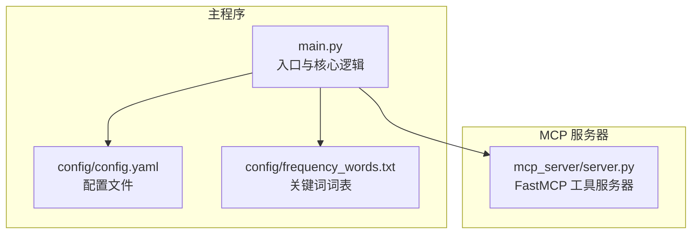
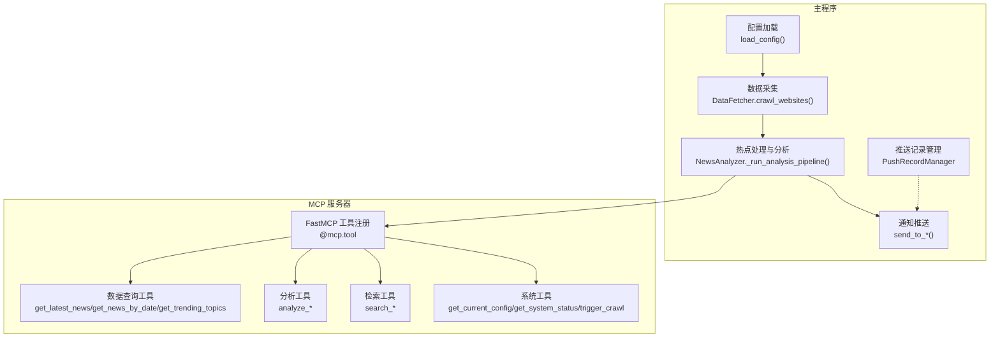
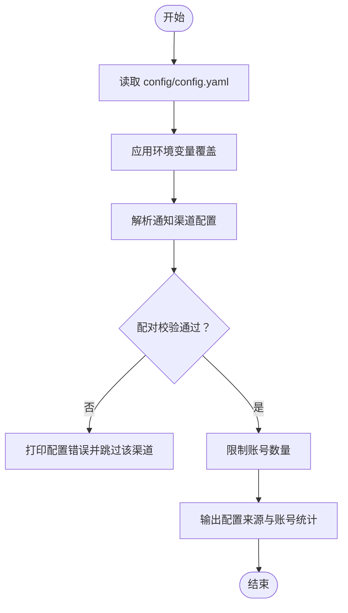
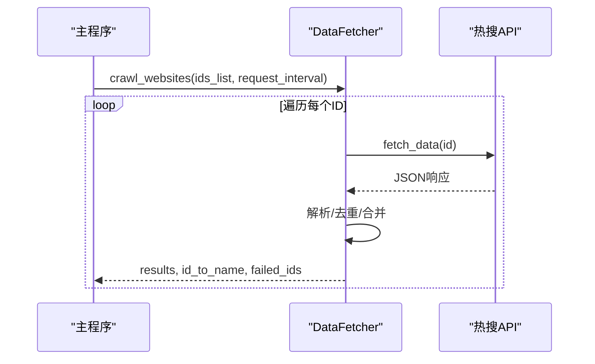
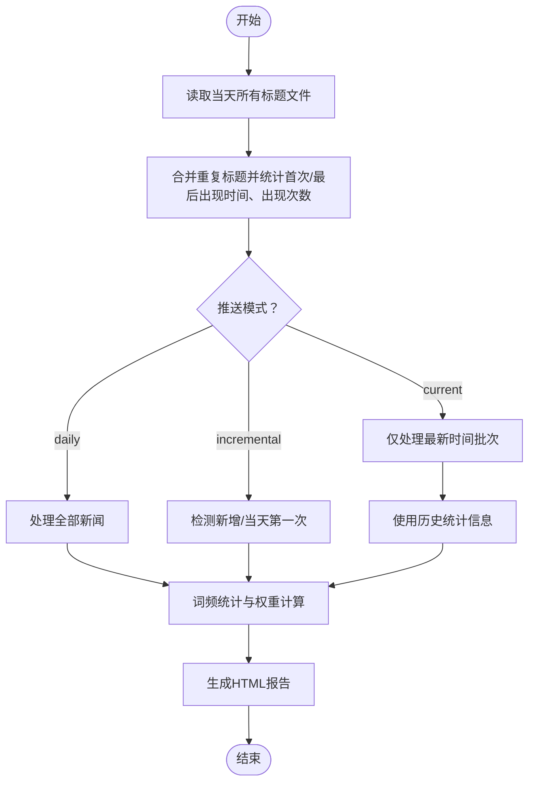
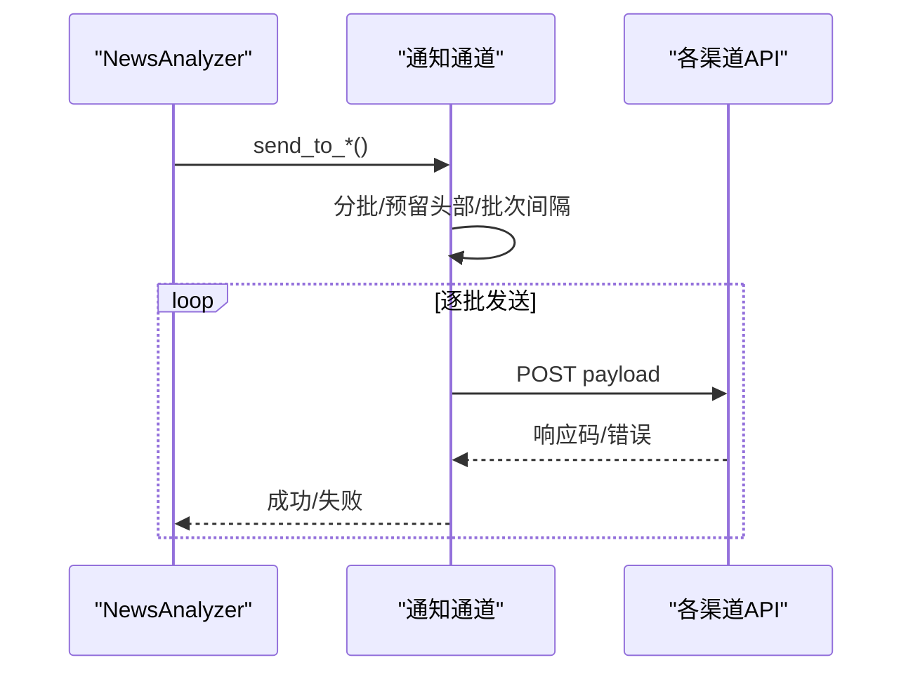
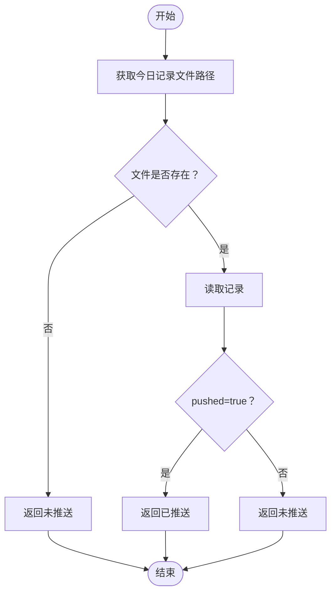
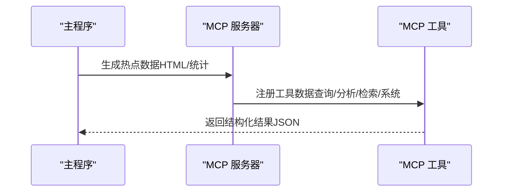
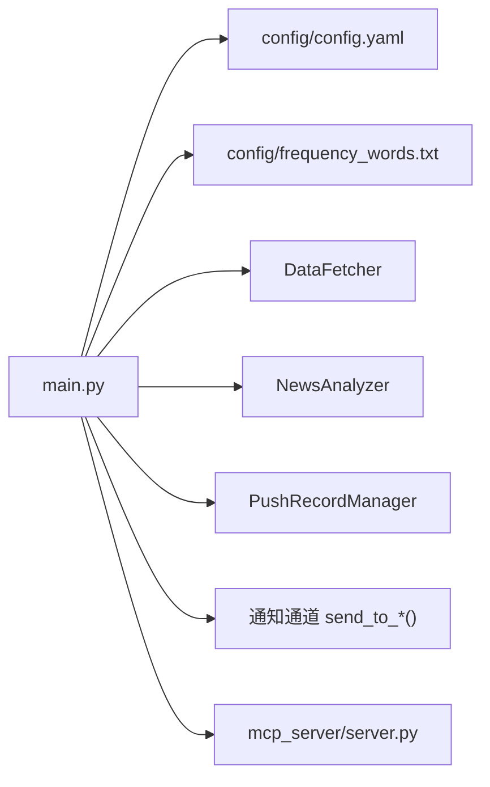
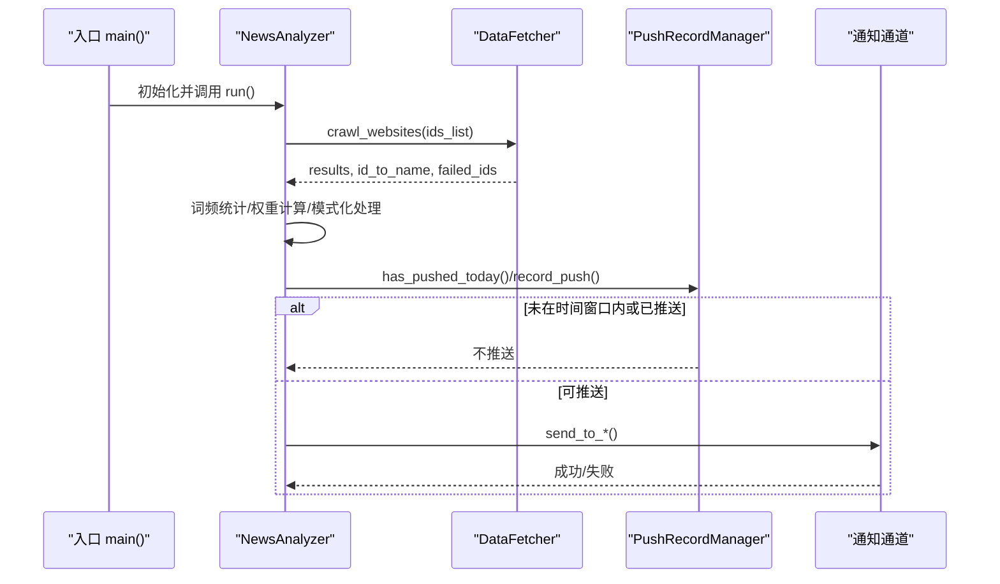

# 主程序

<cite>
**本文引用的文件**
- [main.py](file://main.py)
- [config/config.yaml](file://config/config.yaml)
- [config/frequency_words.txt](file://config/frequency_words.txt)
- [mcp_server/server.py](file://mcp_server/server.py)
</cite>

## 目录
1. [简介](#简介)
2. [项目结构](#项目结构)
3. [核心组件](#核心组件)
4. [架构总览](#架构总览)
5. [详细组件分析](#详细组件分析)
6. [依赖分析](#依赖分析)
7. [性能考量](#性能考量)
8. [故障排查指南](#故障排查指南)
9. [结论](#结论)
10. [附录](#附录)

## 简介
本文件聚焦 TrendRadar 的主程序入口（main.py），系统性阐述其作为系统核心入口点的职责与实现方式，包括：
- 加载配置文件（config.yaml）与环境变量覆盖机制
- 执行数据采集任务（DataFetcher）
- 处理热点信息（词频统计、权重计算、模式化推送）
- 应用智能推送策略（多账号、批次发送、时间窗口控制）
- 通过多种渠道发送通知（飞书、钉钉、企业微信、Telegram、邮件、ntfy、Bark、Slack）
- 与 MCP 服务器的数据协同关系（主程序生成的热点数据被 MCP 服务器消费用于 AI 分析）

此外，文档提供主程序的执行时序图、模块依赖关系图、扩展点说明（新增数据源或通知渠道的实现方式），并给出可操作的排障建议与最佳实践。

## 项目结构
主程序位于项目根目录，负责协调配置加载、数据采集、热点处理与通知推送；MCP 服务器位于 mcp_server 目录，提供 AI 分析与检索工具，二者通过“热点数据”形成数据协同闭环。

图表来源
- [main.py](file://main.py#L1-L120)
- [config/config.yaml](file://config/config.yaml#L1-L140)
- [config/frequency_words.txt](file://config/frequency_words.txt#L1-L114)
- [mcp_server/server.py](file://mcp_server/server.py#L1-L120)

章节来源
- [main.py](file://main.py#L1-L120)
- [config/config.yaml](file://config/config.yaml#L1-L140)
- [config/frequency_words.txt](file://config/frequency_words.txt#L1-L114)
- [mcp_server/server.py](file://mcp_server/server.py#L1-L120)

## 核心组件
- 配置管理（load_config）
  - 从 config/config.yaml 加载基础配置，支持环境变量覆盖
  - 解析通知渠道配置（飞书、钉钉、企业微信、Telegram、邮件、ntfy、Bark、Slack）
  - 解析推送时间窗口与多账号限制
- 数据采集（DataFetcher）
  - 从统一 API 获取各平台热搜数据，支持重试与请求间隔控制
- 热点处理与分析（NewsAnalyzer）
  - 词频统计、权重计算、模式化（每日汇总、当前榜单、增量）
  - 增量模式下的新增检测、current 模式的最新榜单筛选
- 通知推送（多渠道）
  - 分批发送、批次头部预留、时间间隔控制、失败重试与降级
  - 支持多账号轮询与配对校验（Telegram、ntfy）
- 推送记录管理（PushRecordManager）
  - 基于时间窗口的“今日已推送”判定与记录清理

章节来源
- [main.py](file://main.py#L160-L395)
- [main.py](file://main.py#L513-L614)
- [main.py](file://main.py#L616-L740)
- [main.py](file://main.py#L4000-L4799)

## 架构总览
主程序与 MCP 服务器的交互关系如下：主程序负责周期性采集与分析，生成热点数据；MCP 服务器提供 AI 分析与检索工具，消费主程序产出的热点数据，为用户提供更深入的洞察与查询能力。

图表来源
- [main.py](file://main.py#L160-L395)
- [main.py](file://main.py#L616-L740)
- [main.py](file://main.py#L4000-L4799)
- [mcp_server/server.py](file://mcp_server/server.py#L110-L782)

## 详细组件分析

### 配置管理（load_config）
- 从 config/config.yaml 读取 app、crawler、report、notification、weight、platforms 等配置
- 支持环境变量覆盖（如 REPORT_MODE、ENABLE_NOTIFICATION、PUSH_WINDOW_* 等）
- 解析通知渠道配置，支持多账号（分号分隔），并进行配对校验（Telegram、ntfy）
- 输出配置来源与账号数量统计，便于运维核对
- 解析推送时间窗口（enabled、time_range、once_per_day、retention_days）

图表来源
- [main.py](file://main.py#L160-L395)

章节来源
- [main.py](file://main.py#L160-L395)
- [config/config.yaml](file://config/config.yaml#L1-L140)

### 数据采集（DataFetcher）
- 通过统一 API 获取各平台热搜数据，支持重试与请求间隔控制
- 将多平台数据合并为统一结构，按标题去重并记录首次/最后出现时间、出现次数、排名序列
- 支持失败 ID 记录，便于后续诊断

图表来源
- [main.py](file://main.py#L616-L740)

章节来源
- [main.py](file://main.py#L616-L740)

### 热点处理与分析（NewsAnalyzer）
- 词频统计与过滤：支持必选词、普通词、过滤词、全局过滤词
- 权重计算：综合排名、频次、热度阈值，形成可排序的权重
- 模式化处理：
  - daily：当日汇总，处理全部新闻
  - current：当前榜单，仅处理最新时间批次，但统计信息来自历史
  - incremental：增量模式，仅处理新增新闻，或当天第一次爬取时处理全部新闻
- 增量检测：基于历史与最新文件对比，识别新增标题
- 报告生成：生成 HTML 报告并输出路径

图表来源
- [main.py](file://main.py#L960-L1599)

章节来源
- [main.py](file://main.py#L960-L1599)
- [config/frequency_words.txt](file://config/frequency_words.txt#L1-L114)

### 通知推送（多渠道）
- 统一分批策略：按渠道最大字节数预留批次头部，自动拆分并统一添加批次头部
- 批次间隔：统一的批次发送间隔，避免触发限流
- 多账号：支持分号分隔的多账号，按顺序轮询发送
- 配对校验：Telegram、ntfy 的 token/chat_id 或 topic/token 数量必须一致
- 失败处理：逐批失败时记录错误并返回失败；ntfy、Bark 支持部分成功即视为成功
- 渠道差异：
  - 飞书、钉钉、企业微信、Telegram、ntfy、Bark、Slack、邮件
  - 邮件支持自动识别 SMTP 服务器与端口，支持 SSL/TLS
  - Slack 会将 Markdown 转换为 mrkdwn

图表来源
- [main.py](file://main.py#L4000-L4799)

章节来源
- [main.py](file://main.py#L4000-L4799)

### 推送记录管理（PushRecordManager）
- 基于“今日记录文件”判断是否已推送，支持 once_per_day 与时间窗口控制
- 记录清理：按保留天数清理过期记录文件
- 时间范围判断：标准化 HH:MM 格式并进行区间判断

图表来源
- [main.py](file://main.py#L513-L614)

章节来源
- [main.py](file://main.py#L513-L614)

### 与 MCP 服务器的数据协同
- 主程序生成的热点数据（HTML 报告与统计结果）可被 MCP 服务器工具消费
- MCP 服务器提供：
  - 数据查询工具：获取最新新闻、按日期查询新闻、趋势话题
  - 分析工具：话题趋势、数据洞察、情感分析、相似新闻、摘要报告
  - 检索工具：统一新闻搜索、历史相关新闻检索
  - 系统工具：获取当前配置、系统状态、手动触发爬取
- MCP 服务器通过 FastMCP 注册工具，支持 stdio 与 HTTP 两种传输模式

图表来源
- [mcp_server/server.py](file://mcp_server/server.py#L110-L782)

章节来源
- [mcp_server/server.py](file://mcp_server/server.py#L110-L782)

## 依赖分析
- 主程序依赖
  - 配置文件：config/config.yaml、config/frequency_words.txt
  - 第三方库：requests、yaml、pytz、pathlib、datetime、json、email、smtplib 等
  - MCP 服务器：FastMCP 工具注册与调用
- 模块耦合
  - NewsAnalyzer 依赖 DataFetcher、PushRecordManager、各类 send_to_*() 函数
  - 配置加载贯穿全局，通知通道与配置高度耦合
- 外部依赖
  - 各通知渠道 API（飞书、钉钉、企业微信、Telegram、ntfy、Bark、Slack、SMTP）
  - 热搜 API（统一接口）

图表来源
- [main.py](file://main.py#L1-L120)
- [mcp_server/server.py](file://mcp_server/server.py#L1-L120)

章节来源
- [main.py](file://main.py#L1-L120)
- [mcp_server/server.py](file://mcp_server/server.py#L1-L120)

## 性能考量
- 请求间隔与重试：DataFetcher 支持请求间隔与指数退避重试，降低外部 API 压力
- 分批发送：按渠道最大字节数预留头部，避免超限；统一批次间隔减少限流风险
- 增量模式：仅处理新增新闻，显著降低计算与推送成本
- 时间窗口：once_per_day 与时间范围控制，避免非工作时间打扰
- 多账号轮询：账号数量受控，避免过度并发

[本节为通用指导，无需具体文件引用]

## 故障排查指南
- 配置文件缺失
  - 症状：启动时报错提示缺少配置文件
  - 处理：确认 config/config.yaml 与 config/frequency_words.txt 存在
- 通知渠道配置错误
  - 症状：渠道未生效或发送失败
  - 处理：检查环境变量覆盖、多账号分号分隔、配对参数数量一致、SMTP 服务器与端口
- ntfy/Bark 速率限制
  - 症状：429 限流或消息过大被拒绝
  - 处理：遵循 4KB 限制，适当增加批次间隔，必要时使用自托管
- 邮件发送失败
  - 症状：认证错误、服务器断开、收件人/发件人被拒
  - 处理：检查邮箱与授权码、SMTP 服务器与端口、网络连通性

章节来源
- [main.py](file://main.py#L4365-L4503)
- [main.py](file://main.py#L4505-L4786)
- [main.py](file://main.py#L4662-L4786)

## 结论
主程序以“配置驱动 + 模式化处理 + 多渠道推送”为核心，实现了从数据采集到热点分析再到智能推送的完整闭环；同时通过 MCP 服务器提供 AI 分析与检索能力，进一步提升系统的智能化水平。其设计具备良好的扩展性与可维护性，便于新增数据源与通知渠道。

[本节为总结性内容，无需具体文件引用]

## 附录

### 执行时序图（主程序）

图表来源
- [main.py](file://main.py#L5415-L5432)
- [main.py](file://main.py#L616-L740)
- [main.py](file://main.py#L513-L614)
- [main.py](file://main.py#L4000-L4799)

### 扩展点说明
- 新增数据源
  - 在 config/config.yaml 的 platforms 中添加新平台 id/name
  - DataFetcher.crawl_websites 会自动遍历平台列表发起请求
  - 若新平台 API 不同，可在 DataFetcher.fetch_data 中扩展适配
- 新增通知渠道
  - 在 config/config.yaml 的 notification.webhooks 中添加新渠道配置项
  - 在主程序中新增 send_to_<channel>() 函数，遵循分批、预留头部、批次间隔与失败处理规范
  - 若需要多账号或配对参数，使用 parse_multi_account_config 与 validate_paired_configs 辅助
  - 在主程序的配置解析处补充渠道读取与来源统计逻辑

章节来源
- [config/config.yaml](file://config/config.yaml#L110-L140)
- [main.py](file://main.py#L160-L395)
- [main.py](file://main.py#L4000-L4799)