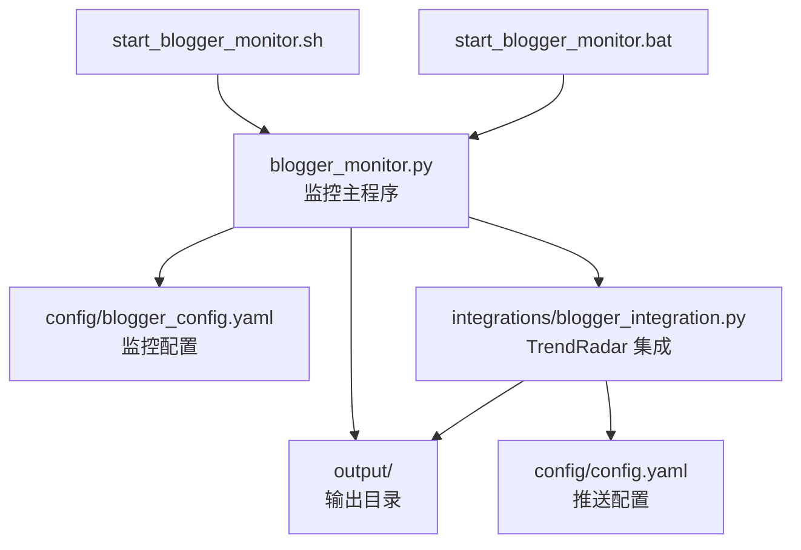
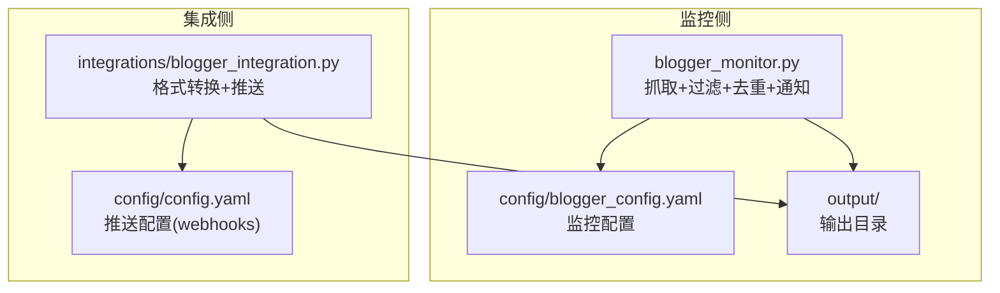
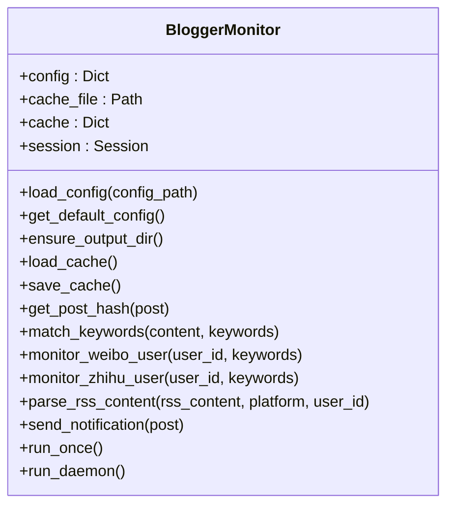
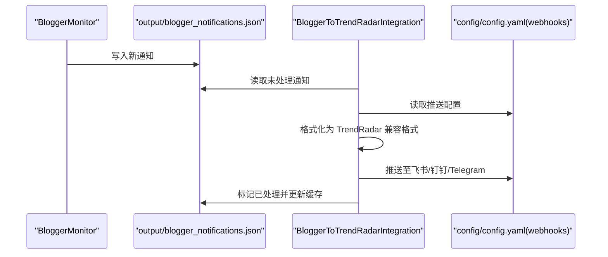
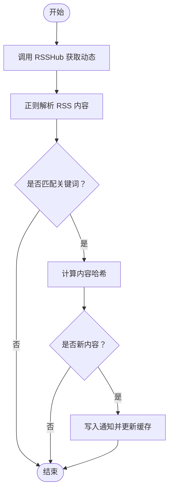
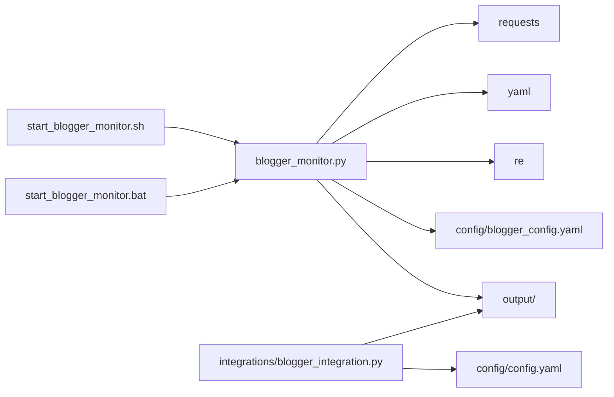

# 博主监控工具

<cite>
**本文引用的文件**
- [blogger_monitor.py](file://blogger_monitor.py)
- [blogger_config.yaml](file://config/blogger_config.yaml)
- [blogger_integration.py](file://integrations/blogger_integration.py)
- [BlogMonitor-Architecture.md](file://BlogMonitor-Architecture.md)
- [README-BloggerMonitor.md](file://README-BloggerMonitor.md)
- [start_blogger_monitor.sh](file://start_blogger_monitor.sh)
- [start_blogger_monitor.bat](file://start_blogger_monitor.bat)
- [config.yaml](file://config/config.yaml)
</cite>

## 目录
1. [简介](#简介)
2. [项目结构](#项目结构)
3. [核心组件](#核心组件)
4. [架构总览](#架构总览)
5. [详细组件分析](#详细组件分析)
6. [依赖关系分析](#依赖关系分析)
7. [性能与可靠性](#性能与可靠性)
8. [故障排查指南](#故障排查指南)
9. [结论](#结论)
10. [附录](#附录)

## 简介
博主监控工具（blogger_monitor.py）是一个独立运行的轻量级脚本，用于监控微博、知乎等平台特定博主的最新动态。它通过 RSSHub 获取用户动态，基于关键词进行过滤，利用内容哈希检测新内容并触发通知。工具支持一次性检查与守护进程模式运行，并可与 TrendRadar 的推送系统集成，将通知统一推送到飞书、钉钉、Telegram 等渠道。同时，它共享 TrendRadar 的输出目录，便于统一管理和后续处理。

## 项目结构
- 主监控脚本：blogger_monitor.py
- 配置文件：config/blogger_config.yaml
- TrendRadar 集成模块：integrations/blogger_integration.py
- 启动脚本（Linux/macOS）：start_blogger_monitor.sh
- 启动脚本（Windows）：start_blogger_monitor.bat
- TrendRadar 主配置（用于推送）：config/config.yaml
- 架构设计文档：BlogMonitor-Architecture.md
- 使用说明文档：README-BloggerMonitor.md

图表来源
- [blogger_monitor.py](file://blogger_monitor.py#L1-L120)
- [blogger_config.yaml](file://config/blogger_config.yaml#L1-L60)
- [blogger_integration.py](file://integrations/blogger_integration.py#L1-L120)
- [config.yaml](file://config/config.yaml#L90-L110)
- [start_blogger_monitor.sh](file://start_blogger_monitor.sh#L1-L60)
- [start_blogger_monitor.bat](file://start_blogger_monitor.bat#L1-L60)

章节来源
- [blogger_monitor.py](file://blogger_monitor.py#L1-L120)
- [blogger_config.yaml](file://config/blogger_config.yaml#L1-L60)
- [blogger_integration.py](file://integrations/blogger_integration.py#L1-L120)
- [config.yaml](file://config/config.yaml#L90-L110)
- [start_blogger_monitor.sh](file://start_blogger_monitor.sh#L1-L60)
- [start_blogger_monitor.bat](file://start_blogger_monitor.bat#L1-L60)

## 核心组件
- 博主监控主类：负责加载配置、缓存、请求会话、RSSHub 数据抓取、关键词过滤、哈希去重、通知输出与守护进程循环。
- 配置文件：定义监控目标、关键词、通知开关、检查间隔、最大抓取数量、RSSHub 地址与缓存参数。
- TrendRadar 集成模块：将博主监控产生的通知转换为 TrendRadar 兼容格式并推送至飞书、钉钉、Telegram 等渠道。
- 启动脚本：提供一键初始化配置、菜单交互、查看日志、集成推送等功能。

章节来源
- [blogger_monitor.py](file://blogger_monitor.py#L31-L120)
- [blogger_config.yaml](file://config/blogger_config.yaml#L1-L60)
- [blogger_integration.py](file://integrations/blogger_integration.py#L1-L120)
- [start_blogger_monitor.sh](file://start_blogger_monitor.sh#L1-L60)
- [start_blogger_monitor.bat](file://start_blogger_monitor.bat#L1-L60)

## 架构总览
博主监控工具采用“独立运行 + 与主系统集成”的双通道架构：
- 独立运行：blogger_monitor.py 直接抓取 RSSHub 数据，过滤关键词，基于哈希去重，输出到 output 目录并打印控制台通知。
- 集成运行：通过 integrations/blogger_integration.py 读取 TrendRadar 的推送配置，将博主通知转换为统一格式并推送到飞书、钉钉、Telegram 等渠道。

图表来源
- [blogger_monitor.py](file://blogger_monitor.py#L293-L351)
- [blogger_config.yaml](file://config/blogger_config.yaml#L1-L60)
- [blogger_integration.py](file://integrations/blogger_integration.py#L1-L120)
- [config.yaml](file://config/config.yaml#L90-L110)

## 详细组件分析

### 组件A：BloggerMonitor 类（监控主流程）
职责与行为：
- 加载配置与默认配置回退
- 确保输出目录存在
- 初始化会话并设置请求头
- 从 RSSHub 抓取微博/知乎用户动态
- 解析 RSS 内容（简化正则解析）
- 关键词匹配（不区分大小写，部分匹配）
- 基于内容哈希检测新内容（MD5）
- 输出通知到 output 目录并打印控制台
- 守护进程循环，按配置间隔轮询

图表来源
- [blogger_monitor.py](file://blogger_monitor.py#L31-L351)

章节来源
- [blogger_monitor.py](file://blogger_monitor.py#L31-L351)

### 组件B：配置文件结构（blogger_config.yaml）
关键字段说明：
- monitors：监控目标列表，每个目标包含 platform、user_id、keywords、name 等。
- keywords：全局关键词，对所有监控目标生效。
- notification：通知开关与渠道（当前控制台输出，其他渠道可扩展）。
- check_interval：检查间隔（秒）。
- max_posts_per_check：每次检查最多抓取的帖子数。
- rsshub：RSSHub 地址配置（公共实例或私有实例）。
- cache：缓存过期天数与最大缓存条目数。

章节来源
- [blogger_config.yaml](file://config/blogger_config.yaml#L1-L60)

### 组件C：与 TrendRadar 集成（blogger_integration.py）
职责与行为：
- 读取 TrendRadar 配置（config/config.yaml），提取 webhooks。
- 将博主帖子格式化为 TrendRadar 兼容格式并保存到 output/YYYYMMDD_blogger.json。
- 通过 webhooks 推送通知到飞书、钉钉、Telegram 等渠道。
- 处理 output/blogger_notifications.json 中的新通知，标记已处理并更新缓存。

图表来源
- [blogger_monitor.py](file://blogger_monitor.py#L245-L329)
- [blogger_integration.py](file://integrations/blogger_integration.py#L1-L283)
- [config.yaml](file://config/config.yaml#L90-L110)

章节来源
- [blogger_integration.py](file://integrations/blogger_integration.py#L1-L283)
- [config.yaml](file://config/config.yaml#L90-L110)

### 组件D：RSSHub 解析与关键词过滤流程
流程说明：
- 通过 RSSHub 获取用户动态（微博/知乎）。
- 使用正则解析 RSS 内容，提取标题、链接、描述、发布时间等。
- 应用用户特定关键词与全局关键词进行过滤。
- 基于内容哈希判断是否为新内容，加入缓存并触发通知。

图表来源
- [blogger_monitor.py](file://blogger_monitor.py#L115-L244)

章节来源
- [blogger_monitor.py](file://blogger_monitor.py#L115-L244)

## 依赖关系分析
- 外部依赖：requests（HTTP 请求）、yaml（配置解析）、re（正则解析）、feedparser（注释建议使用，当前为简化实现）。
- 内部依赖：config/blogger_config.yaml（监控配置）、config/config.yaml（推送配置）、output/（共享输出目录）。
- 启动脚本：start_blogger_monitor.sh / start_blogger_monitor.bat 提供便捷入口与菜单交互。

图表来源
- [blogger_monitor.py](file://blogger_monitor.py#L1-L60)
- [blogger_config.yaml](file://config/blogger_config.yaml#L1-L60)
- [blogger_integration.py](file://integrations/blogger_integration.py#L1-L120)
- [config.yaml](file://config/config.yaml#L90-L110)
- [start_blogger_monitor.sh](file://start_blogger_monitor.sh#L1-L60)
- [start_blogger_monitor.bat](file://start_blogger_monitor.bat#L1-L60)

章节来源
- [blogger_monitor.py](file://blogger_monitor.py#L1-L60)
- [blogger_config.yaml](file://config/blogger_config.yaml#L1-L60)
- [blogger_integration.py](file://integrations/blogger_integration.py#L1-L120)
- [config.yaml](file://config/config.yaml#L90-L110)
- [start_blogger_monitor.sh](file://start_blogger_monitor.sh#L1-L60)
- [start_blogger_monitor.bat](file://start_blogger_monitor.bat#L1-L60)

## 性能与可靠性
- 检查间隔：建议不低于 300 秒（5 分钟），避免频繁请求导致限流或资源浪费。
- 最大抓取数量：max_posts_per_check 建议 5-20，平衡实时性与性能。
- 缓存策略：基于 MD5 哈希去重，避免重复通知；缓存文件位于 output/blogger_cache.json。
- 错误处理：网络异常、RSSHub 解析失败、缓存读写失败均有日志记录与降级处理。
- 并发与稳定性：守护进程模式下出错会短暂等待后重试，保证长期稳定运行。

章节来源
- [blogger_monitor.py](file://blogger_monitor.py#L333-L351)
- [blogger_config.yaml](file://config/blogger_config.yaml#L46-L60)
- [README-BloggerMonitor.md](file://README-BloggerMonitor.md#L82-L90)

## 故障排查指南
常见问题与解决方案：
- RSSHub 访问失败
  - 使用代理或自建 RSSHub 实例，或更换镜像源。
  - 参考：[README-BloggerMonitor.md](file://README-BloggerMonitor.md#L184-L190)
- 用户ID错误
  - 微博必须使用数字ID；知乎可使用用户名或ID。
  - 参考：[README-BloggerMonitor.md](file://README-BloggerMonitor.md#L191-L196)
- 关键词匹配失败
  - 检查关键词是否包含特殊字符，尝试更通用的关键词，查看日志了解匹配过程。
  - 参考：[README-BloggerMonitor.md](file://README-BloggerMonitor.md#L197-L202)
- 推送通知失败
  - 检查 config/config.yaml 中的 webhooks 配置，确认 webhook URL 或 token 正确。
  - 参考：[config.yaml](file://config/config.yaml#L92-L110)
- 缓存与输出
  - 确认 output 目录存在且可写；检查 blogger_cache.json 与 blogger_notifications.json 是否被正确更新。
  - 参考：[blogger_monitor.py](file://blogger_monitor.py#L77-L98)

章节来源
- [README-BloggerMonitor.md](file://README-BloggerMonitor.md#L182-L208)
- [config.yaml](file://config/config.yaml#L92-L110)
- [blogger_monitor.py](file://blogger_monitor.py#L77-L98)

## 结论
博主监控工具以简洁高效的方式实现了对微博、知乎等平台博主的动态监控。通过 RSSHub 获取数据、关键词过滤与哈希去重，确保只推送有价值的新内容。工具既可独立运行，也可无缝集成 TrendRadar 的推送体系，共享输出目录，便于统一管理与后续分析。合理的配置与稳健的错误处理使其适合长期运行与生产环境使用。

## 附录

### 常见使用场景与配置示例
- 初始化配置
  - 使用命令行参数初始化默认配置文件，随后编辑 config/blogger_config.yaml 添加监控目标与关键词。
  - 参考：[README-BloggerMonitor.md](file://README-BloggerMonitor.md#L16-L27)
- 单次运行与守护进程
  - 单次运行用于测试：python blogger_monitor.py --once
  - 守护进程模式用于持续监控：python blogger_monitor.py
  - 参考：[README-BloggerMonitor.md](file://README-BloggerMonitor.md#L56-L65)
- 集成到 TrendRadar 推送
  - 在 config/config.yaml 中配置 webhooks（飞书、钉钉、Telegram 等），然后运行 integrations/blogger_integration.py 处理新通知。
  - 参考：[README-BloggerMonitor.md](file://README-BloggerMonitor.md#L90-L111)，[config.yaml](file://config/config.yaml#L92-L110)

章节来源
- [README-BloggerMonitor.md](file://README-BloggerMonitor.md#L16-L65)
- [README-BloggerMonitor.md](file://README-BloggerMonitor.md#L90-L111)
- [config.yaml](file://config/config.yaml#L92-L110)