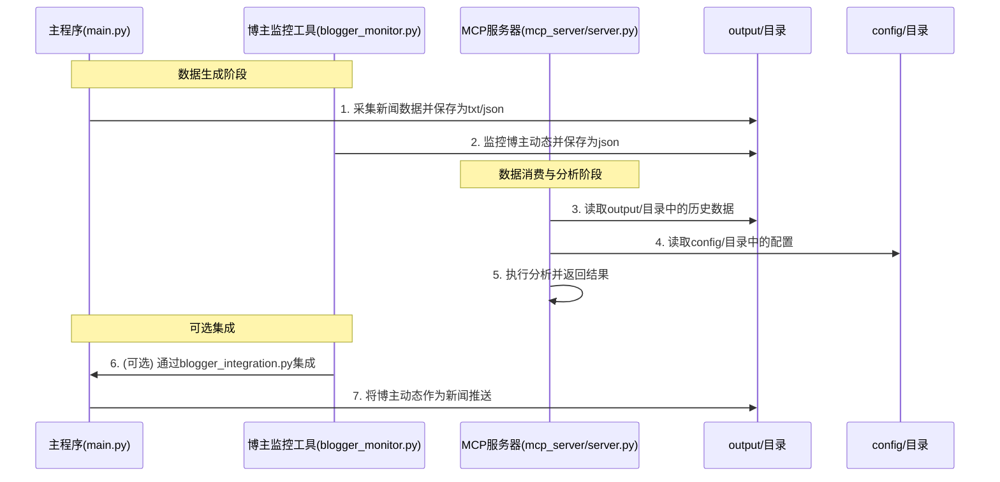

# 核心组件

<cite>
**本文档引用的文件**   
- [main.py](file://main.py)
- [blogger_monitor.py](file://blogger_monitor.py)
- [mcp_server/server.py](file://mcp_server/server.py)
- [config/config.yaml](file://config/config.yaml)
- [config/blogger_config.yaml](file://config/blogger_config.yaml)
- [mcp_server/tools/data_query.py](file://mcp_server/tools/data_query.py)
- [mcp_server/tools/analytics.py](file://mcp_server/tools/analytics.py)
- [mcp_server/services/data_service.py](file://mcp_server/services/data_service.py)
- [mcp_server/utils/date_parser.py](file://mcp_server/utils/date_parser.py)
- [integrations/blogger_integration.py](file://integrations/blogger_integration.py)
</cite>

## 目录
1. [简介](#简介)
2. [主程序 (main.py)](#主程序-mainpy)
3. [博主监控工具 (blogger_monitor.py)](#博主监控工具-blogger_monitorpy)
4. [MCP服务器 (mcp_server/server.py)](#mcp服务器-mcp_serverserverpy)
5. [组件交互与协同工作](#组件交互与协同工作)
6. [扩展点与定制化配置](#扩展点与定制化配置)

## 简介
TrendRadar 是一个集数据采集、监控和智能分析于一体的热点追踪系统。其核心由三个主要组件构成：主程序（main.py）、博主监控工具（blogger_monitor.py）和 MCP 服务器（mcp_server/server.py）。主程序作为系统的入口点，负责从多个平台采集数据、处理并推送报告。博主监控工具是一个独立的模块，专注于监控特定博主在微博、知乎等平台的发言。MCP 服务器则作为 AI 分析的核心，提供自然语言驱动的数据查询和分析能力。这三个组件既可以独立运行，也可以通过共享数据和配置文件协同工作，形成一个完整的数据监控与分析闭环。

## 主程序 (main.py)

主程序 `main.py` 是整个 TrendRadar 系统的入口点和核心引擎，负责执行从配置加载到数据推送的完整流程。

### 职责与功能
`main.py` 的主要职责是作为一个批处理工作流，周期性地执行以下任务：
1.  **配置加载**：从 `config/config.yaml` 文件中读取系统配置，包括监控的平台列表、推送渠道、权重设置等。它还支持通过环境变量覆盖配置文件中的值，提供了灵活的部署方式。
2.  **数据采集**：使用 `DataFetcher` 类，通过 HTTP 请求从预设的新闻聚合 API（如 `newsnow.busiyi.world`）获取多个平台的热搜数据。它实现了重试机制和请求间隔控制，以确保采集的稳定性和避免被目标服务器封锁。
3.  **数据处理与分析**：对采集到的原始数据进行处理，包括标题清理、排名计算和权重分析。它根据配置的权重（排名、频次、热度）计算每条新闻的综合得分，并生成结构化的报告。
4.  **结果推送**：将生成的报告通过多种渠道（如飞书、钉钉、Telegram、邮件等）推送给用户。它支持多账号配置和推送时间窗口控制，以满足不同的通知需求。

### 启动方式与依赖
主程序可以通过直接运行 Python 脚本或使用 Docker 容器来启动。
- **直接运行**：在项目根目录下执行 `python main.py`。
- **Docker 运行**：通过 `docker-compose.yml` 文件定义的服务启动，该服务会挂载 `config` 和 `output` 目录，并设置必要的环境变量。

其主要依赖包括 `requests` 库用于 HTTP 请求，`PyYAML` 库用于解析配置文件，以及 `pytz` 库用于处理时区。

**Section sources**
- [main.py](file://main.py#L1-L800)
- [config/config.yaml](file://config/config.yaml#L1-L140)

## 博主监控工具 (blogger_monitor.py)

博主监控工具 `blogger_monitor.py` 是一个独立的模块，专门用于监控特定博主在社交媒体上的动态。

### 职责与功能
该工具的核心功能是持续监控并推送博主的新发言，其主要职责包括：
1.  **配置加载**：读取 `config/blogger_config.yaml` 文件，获取需要监控的博主列表（包括微博、知乎等平台的用户ID）和关键词过滤规则。
2.  **数据采集**：利用 RSSHub 服务，通过其提供的 API 接口获取指定博主的最新动态。它支持微博和知乎平台，并通过正则表达式解析 RSS 内容。
3.  **内容过滤**：对获取到的帖子内容进行关键词匹配，只有包含配置中指定关键词的帖子才会被认定为“新内容”。
4.  **状态管理与通知**：使用哈希值对已推送的内容进行去重，避免重复通知。当发现匹配的新内容时，会通过控制台日志和文件记录的方式进行通知。

### 启动方式与依赖
该工具支持两种运行模式：
- **一次性检查**：通过命令行参数 `--once` 执行一次检查后退出。
- **守护进程模式**：默认模式，会根据配置的 `check_interval`（默认5分钟）循环执行检查。

启动命令为 `python blogger_monitor.py`，支持 `--config` 参数指定配置文件路径，以及 `--init-config` 参数初始化一个默认配置文件。

其主要依赖包括 `requests` 库用于获取 RSS 数据，`PyYAML` 库用于解析配置，以及 `hashlib` 库用于内容去重。

**Section sources**
- [blogger_monitor.py](file://blogger_monitor.py#L1-L408)
- [config/blogger_config.yaml](file://config/blogger_config.yaml#L1-L60)

## MCP服务器 (mcp_server/server.py)

MCP 服务器 `mcp_server/server.py` 是整个系统的 AI 分析核心，它基于 FastMCP 框架构建，为 AI 模型提供了一套强大的数据查询和分析工具。

### 职责与功能
MCP 服务器的主要职责是作为一个工具服务器，接收来自 AI 客户端的请求，并执行相应的数据操作。其功能可以分为以下几类：
1.  **日期解析工具**：`resolve_date_range` 工具能将自然语言（如“本周”、“最近7天”）解析为精确的日期范围，确保 AI 分析的时间范围准确无误。
2.  **数据查询工具**：提供 `get_latest_news` 和 `get_news_by_date` 等工具，允许 AI 查询最新或历史新闻数据。
3.  **高级数据分析工具**：提供 `analyze_topic_trend`（话题趋势分析）、`analyze_sentiment`（情感分析）、`find_similar_news`（相似新闻查找）等工具，支持复杂的分析任务。
4.  **智能检索工具**：`search_news` 工具支持关键词、模糊和实体等多种模式的搜索。
5.  **系统管理工具**：`get_system_status` 和 `trigger_crawl` 工具可用于获取系统状态和手动触发数据爬取。

### 启动方式与依赖
MCP 服务器支持两种传输模式：
- **stdio 模式**：通过标准输入输出与客户端通信，适用于本地开发和调试。
- **HTTP 模式**：通过 HTTP 服务器（默认端口 3333）提供服务，适用于生产环境。

启动命令为 `python mcp_server/server.py --transport http --port 3333`。其核心依赖是 `fastmcp` 库，用于构建 MCP 服务器，以及 `websockets` 库用于支持 HTTP 模式下的 WebSocket 通信。

**Section sources**
- [mcp_server/server.py](file://mcp_server/server.py#L1-L782)
- [mcp_server/tools/data_query.py](file://mcp_server/tools/data_query.py#L1-L200)
- [mcp_server/tools/analytics.py](file://mcp_server/tools/analytics.py#L1-L200)

## 组件交互与协同工作

TrendRadar 的三个核心组件通过共享文件系统和配置文件进行交互，形成一个高效的工作流。

**Diagram sources **
- [main.py](file://main.py#L1-L800)
- [blogger_monitor.py](file://blogger_monitor.py#L1-L408)
- [mcp_server/server.py](file://mcp_server/server.py#L1-L782)
- [integrations/blogger_integration.py](file://integrations/blogger_integration.py#L1-L293)

### 协同工作流程
1.  **数据生成**：主程序 `main.py` 周期性地运行，将采集到的新闻数据以文本和 JSON 格式保存到 `output/` 目录下。同时，博主监控工具 `blogger_monitor.py` 独立运行，将其监控到的博主动态保存到 `output/blogger_notifications.json` 文件中。
2.  **数据消费**：MCP 服务器 `mcp_server/server.py` 在启动时会挂载 `output/` 和 `config/` 目录。当 AI 客户端调用其提供的工具（如 `get_news_by_date` 或 `analyze_topic_trend`）时，MCP 服务器会从 `output/` 目录中读取历史数据文件，进行查询和分析，并将结果返回给 AI。
3.  **可选集成**：通过 `integrations/blogger_integration.py` 模块，可以将博主监控工具与主程序集成。该模块会读取 `blogger_notifications.json` 文件，将博主动态转换为主程序可识别的新闻格式，并通过主程序的推送渠道发送通知，实现了监控与推送的统一。

## 扩展点与定制化配置

TrendRadar 提供了多个扩展点和丰富的配置选项，允许用户根据需求进行定制。

### 主程序 (main.py) 扩展点
- **平台扩展**：通过修改 `config/config.yaml` 中的 `platforms` 列表，可以轻松添加或移除监控的平台。
- **通知渠道扩展**：代码中预留了多种通知渠道（如 ntfy、Bark、Slack），用户可以通过配置文件启用它们。
- **权重调整**：用户可以通过修改 `config.yaml` 中的 `weight` 配置，调整排名、频次和热度的权重，以改变新闻的排序逻辑。

### 博主监控工具 (blogger_monitor.py) 扩展点
- **平台扩展**：虽然当前只支持微博和知乎，但其模块化设计允许通过添加新的 `monitor_xxx_user` 方法来支持其他平台。
- **通知渠道扩展**：`send_notification` 方法可以被扩展，以支持更多通知方式，如微信、邮件等。
- **关键词过滤**：支持全局和针对特定博主的关键词过滤，提供了灵活的内容筛选能力。

### MCP服务器 (mcp_server/server.py) 扩展点
- **工具扩展**：开发者可以轻松地在 `mcp_server/tools/` 目录下创建新的工具类，并使用 `@mcp.tool` 装饰器将其注册为 MCP 工具。
- **分析算法扩展**：`mcp_server/tools/analytics.py` 中的分析函数（如 `calculate_news_weight`）可以被修改或替换，以实现不同的分析逻辑。
- **数据源扩展**：`mcp_server/services/data_service.py` 负责数据访问，可以通过修改 `ParserService` 来支持不同的数据存储格式或来源。

**Section sources**
- [config/config.yaml](file://config/config.yaml#L1-L140)
- [config/blogger_config.yaml](file://config/blogger_config.yaml#L1-L60)
- [mcp_server/tools/analytics.py](file://mcp_server/tools/analytics.py#L1-L200)
- [mcp_server/services/data_service.py](file://mcp_server/services/data_service.py#L1-L200)