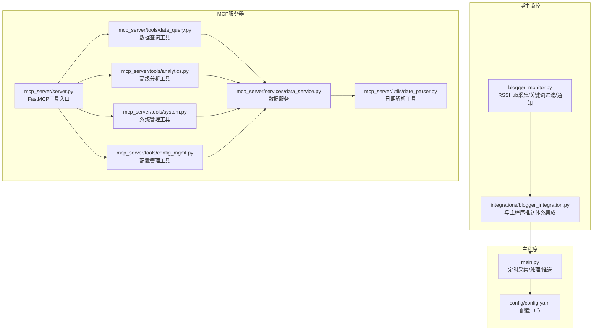
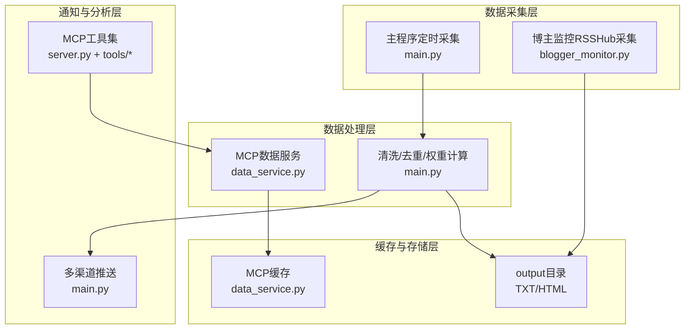
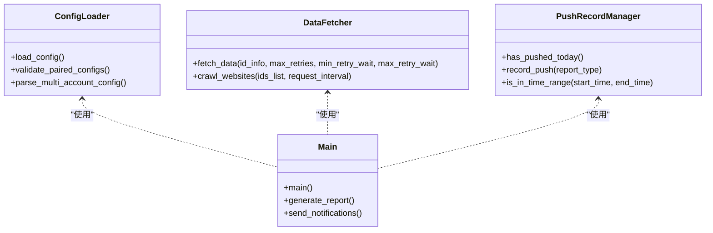
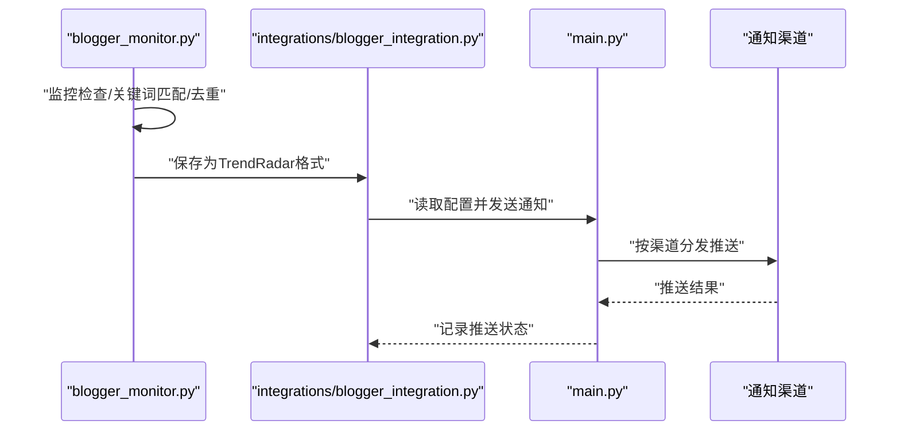
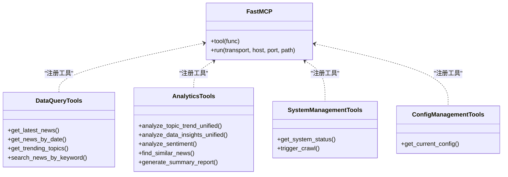
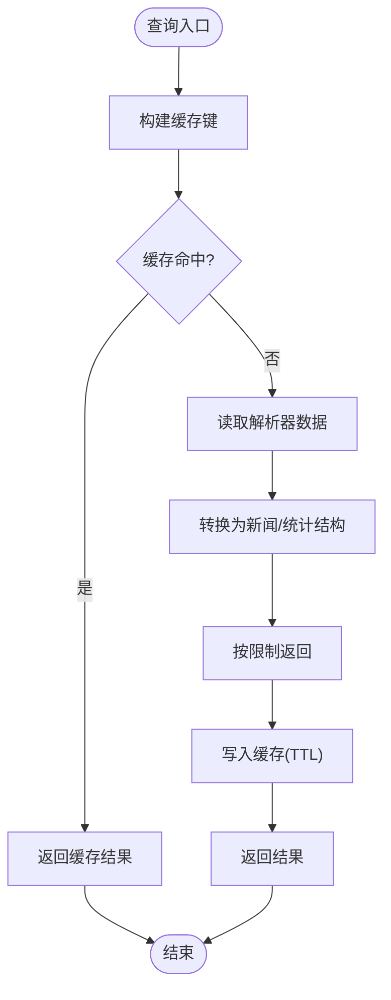
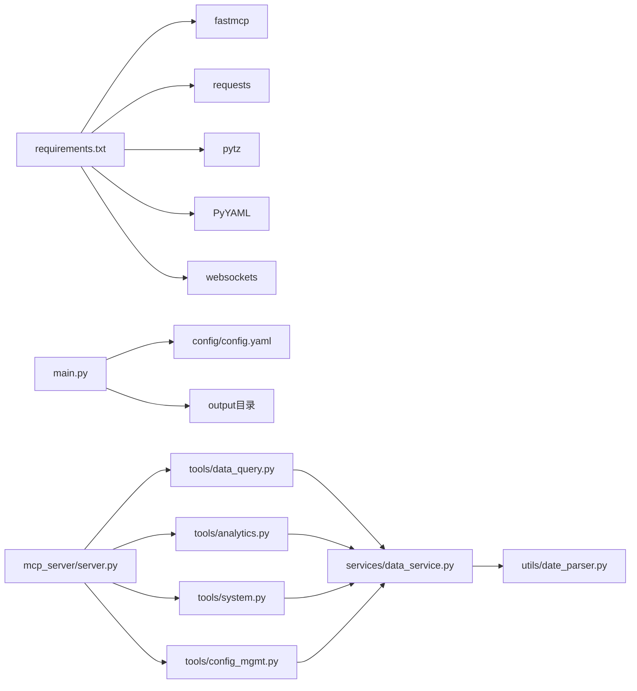

# 系统架构设计

<cite>
**本文引用的文件**
- [main.py](file://main.py)
- [blogger_monitor.py](file://blogger_monitor.py)
- [integrations/blogger_integration.py](file://integrations/blogger_integration.py)
- [mcp_server/server.py](file://mcp_server/server.py)
- [mcp_server/tools/data_query.py](file://mcp_server/tools/data_query.py)
- [mcp_server/tools/analytics.py](file://mcp_server/tools/analytics.py)
- [mcp_server/tools/system.py](file://mcp_server/tools/system.py)
- [mcp_server/tools/config_mgmt.py](file://mcp_server/tools/config_mgmt.py)
- [mcp_server/services/data_service.py](file://mcp_server/services/data_service.py)
- [mcp_server/utils/date_parser.py](file://mcp_server/utils/date_parser.py)
- [config/config.yaml](file://config/config.yaml)
- [BlogMonitor-Architecture.md](file://BlogMonitor-Architecture.md)
- [requirements.txt](file://requirements.txt)
</cite>

## 目录
1. [简介](#简介)
2. [项目结构](#项目结构)
3. [核心组件](#核心组件)
4. [架构总览](#架构总览)
5. [组件深度分析](#组件深度分析)
6. [依赖关系分析](#依赖关系分析)
7. [性能与可维护性](#性能与可维护性)
8. [故障排查指南](#故障排查指南)
9. [结论](#结论)
10. [附录](#附录)

## 简介
本架构文档聚焦 TrendRadar 的整体系统架构，围绕主程序（main.py）、博主监控模块（blogger_monitor.py）与 MCP 服务器（mcp_server/）之间的交互关系展开，系统性梳理数据采集、处理、缓存、分析与推送的全流程。文档重点阐释单例模式在配置管理中的应用、工厂模式在通知渠道创建中的实现以及观察者模式在事件驱动推送中的作用，并结合 BlogMonitor-Architecture.md 的设计思路绘制组件关系图与数据流图，解释采用 fastmcp、websockets 等技术栈的原因及其对系统可维护性与扩展性的深远影响。

## 项目结构
TrendRadar 由三大核心模块构成：
- 主程序（main.py）：负责定时采集、清洗、权重计算、报告生成与多渠道推送。
- 博主监控（blogger_monitor.py）：面向特定博主的发言监控与通知；通过集成模块（integrations/blogger_integration.py）与主程序推送体系打通。
- MCP 服务器（mcp_server/server.py）：基于 FastMCP 2.0 的工具服务器，提供数据查询、趋势分析、检索、系统管理等工具，支持 stdio 与 HTTP 两种传输模式。

图表来源
- [main.py](file://main.py#L1-L200)
- [blogger_monitor.py](file://blogger_monitor.py#L1-L120)
- [integrations/blogger_integration.py](file://integrations/blogger_integration.py#L1-L120)
- [mcp_server/server.py](file://mcp_server/server.py#L1-L120)
- [mcp_server/tools/data_query.py](file://mcp_server/tools/data_query.py#L1-L80)
- [mcp_server/tools/analytics.py](file://mcp_server/tools/analytics.py#L1-L120)
- [mcp_server/tools/system.py](file://mcp_server/tools/system.py#L1-L120)
- [mcp_server/tools/config_mgmt.py](file://mcp_server/tools/config_mgmt.py#L1-L67)
- [mcp_server/services/data_service.py](file://mcp_server/services/data_service.py#L1-L120)
- [mcp_server/utils/date_parser.py](file://mcp_server/utils/date_parser.py#L1-L120)
- [config/config.yaml](file://config/config.yaml#L1-L140)

章节来源
- [main.py](file://main.py#L1-L200)
- [blogger_monitor.py](file://blogger_monitor.py#L1-L120)
- [integrations/blogger_integration.py](file://integrations/blogger_integration.py#L1-L120)
- [mcp_server/server.py](file://mcp_server/server.py#L1-L120)
- [mcp_server/tools/data_query.py](file://mcp_server/tools/data_query.py#L1-L80)
- [mcp_server/tools/analytics.py](file://mcp_server/tools/analytics.py#L1-L120)
- [mcp_server/tools/system.py](file://mcp_server/tools/system.py#L1-L120)
- [mcp_server/tools/config_mgmt.py](file://mcp_server/tools/config_mgmt.py#L1-L67)
- [mcp_server/services/data_service.py](file://mcp_server/services/data_service.py#L1-L120)
- [mcp_server/utils/date_parser.py](file://mcp_server/utils/date_parser.py#L1-L120)
- [config/config.yaml](file://config/config.yaml#L1-L140)

## 核心组件
- 主程序（main.py）
  - 配置加载与校验、多账号推送工具函数、推送记录管理、数据获取器、数据处理与报告生成、通知渠道分发。
  - 关键职责：统一的采集、处理、权重计算、报告与推送。
- 博主监控（blogger_monitor.py）
  - RSSHub 采集、关键词匹配、去重缓存、通知落盘与控制台输出。
  - 关键职责：面向特定博主的增量监控与通知。
- MCP 服务器（mcp_server/server.py）
  - FastMCP 工具入口，注册数据查询、分析、检索、系统管理、配置管理等工具。
  - 关键职责：提供 AI 驱动的查询与分析能力，支撑自然语言交互。

章节来源
- [main.py](file://main.py#L160-L420)
- [blogger_monitor.py](file://blogger_monitor.py#L1-L120)
- [mcp_server/server.py](file://mcp_server/server.py#L1-L120)

## 架构总览
TrendRadar 采用“主程序 + 博主监控 + MCP 服务器”的分层架构：
- 数据采集层：主程序定时抓取多平台热搜，博主监控通过 RSSHub 获取博主动态。
- 数据处理层：主程序进行去重、权重计算、报告生成；MCP 服务器提供统一的数据查询与分析服务。
- 缓存与存储层：主程序输出到 output 目录（TXT/HTML），MCP 服务器内部缓存与解析工具。
- 通知与分析层：主程序多渠道推送；MCP 服务器通过工具提供 AI 分析与检索。

图表来源
- [main.py](file://main.py#L616-L790)
- [blogger_monitor.py](file://blogger_monitor.py#L120-L220)
- [mcp_server/services/data_service.py](file://mcp_server/services/data_service.py#L1-L120)
- [mcp_server/server.py](file://mcp_server/server.py#L1-L120)

## 组件深度分析

### 主程序（main.py）架构与职责
- 配置管理
  - 通过集中配置文件加载与环境变量覆盖，支持多账号推送、推送时间窗口、权重配置等。
  - 单例模式体现在全局 CONFIG 常量的加载与复用，避免重复 IO 与解析开销。
- 数据获取与处理
  - DataFetcher 负责并发抓取与重试；清洗与去重；生成 TXT/HTML 报告。
  - 权重计算与排序逻辑贯穿处理流程，确保热点排序符合业务预期。
- 推送与记录
  - PushRecordManager 管理推送时间窗口与记录，避免重复推送。
  - 多渠道推送工具函数支持飞书、钉钉、企业微信、Telegram、邮件、ntfy、Bark、Slack 等。

图表来源
- [main.py](file://main.py#L160-L420)
- [main.py](file://main.py#L513-L615)
- [main.py](file://main.py#L616-L790)

章节来源
- [main.py](file://main.py#L160-L420)
- [main.py](file://main.py#L513-L615)
- [main.py](file://main.py#L616-L790)

### 博主监控模块（blogger_monitor.py）与集成（integrations/blogger_integration.py）
- 博主监控
  - 通过 RSSHub 获取微博、知乎等平台的用户动态，关键词匹配与去重缓存，控制台输出与通知落盘。
- 集成模块
  - 将博主监控的新动态转换为主程序可识别的新闻格式，保存到 output 目录，并通过主程序配置的 Webhook 进行多渠道推送。

图表来源
- [blogger_monitor.py](file://blogger_monitor.py#L293-L351)
- [integrations/blogger_integration.py](file://integrations/blogger_integration.py#L1-L120)
- [integrations/blogger_integration.py](file://integrations/blogger_integration.py#L120-L240)
- [main.py](file://main.py#L160-L420)

章节来源
- [blogger_monitor.py](file://blogger_monitor.py#L1-L120)
- [blogger_monitor.py](file://blogger_monitor.py#L293-L351)
- [integrations/blogger_integration.py](file://integrations/blogger_integration.py#L1-L120)
- [integrations/blogger_integration.py](file://integrations/blogger_integration.py#L120-L240)
- [main.py](file://main.py#L160-L420)

### MCP 服务器（mcp_server/server.py）与工具集
- 工具注册与单例
  - 通过全局字典维护工具实例，首次请求时初始化，后续复用，体现单例模式，降低初始化成本。
- 工具分类
  - 数据查询（最新新闻、按日期查询、趋势话题）
  - 高级分析（话题趋势、平台对比、情感分析、相似新闻、摘要生成）
  - 智能检索（关键词搜索、历史相关检索）
  - 系统管理（系统状态、触发临时爬取）
  - 配置管理（获取当前配置）
- 传输模式
  - 支持 stdio 与 HTTP 两种模式，HTTP 模式便于生产部署与客户端对接。

图表来源
- [mcp_server/server.py](file://mcp_server/server.py#L1-L120)
- [mcp_server/tools/data_query.py](file://mcp_server/tools/data_query.py#L1-L80)
- [mcp_server/tools/analytics.py](file://mcp_server/tools/analytics.py#L1-L120)
- [mcp_server/tools/system.py](file://mcp_server/tools/system.py#L1-L120)
- [mcp_server/tools/config_mgmt.py](file://mcp_server/tools/config_mgmt.py#L1-L67)

章节来源
- [mcp_server/server.py](file://mcp_server/server.py#L1-L120)
- [mcp_server/tools/data_query.py](file://mcp_server/tools/data_query.py#L1-L80)
- [mcp_server/tools/analytics.py](file://mcp_server/tools/analytics.py#L1-L120)
- [mcp_server/tools/system.py](file://mcp_server/tools/system.py#L1-L120)
- [mcp_server/tools/config_mgmt.py](file://mcp_server/tools/config_mgmt.py#L1-L67)

### 数据服务与缓存（mcp_server/services/data_service.py）
- 数据服务封装
  - 统一的数据访问接口，支持最新新闻、按日期查询、关键词搜索、趋势话题统计、系统状态与可用日期范围扫描。
- 缓存策略
  - 基于缓存键的 TTL 管理，热点数据（如最新新闻、趋势话题）短期缓存，历史数据长期缓存，提升查询性能。
- 日期解析
  - 日期解析工具 DateParser 支持自然语言日期表达式解析，确保 AI 工具计算日期的一致性。

图表来源
- [mcp_server/services/data_service.py](file://mcp_server/services/data_service.py#L1-L120)
- [mcp_server/utils/date_parser.py](file://mcp_server/utils/date_parser.py#L1-L120)

章节来源
- [mcp_server/services/data_service.py](file://mcp_server/services/data_service.py#L1-L120)
- [mcp_server/utils/date_parser.py](file://mcp_server/utils/date_parser.py#L1-L120)

### 通知渠道工厂模式与观察者模式
- 工厂模式（通知渠道创建）
  - 主程序通过配置解析多账号配置，使用工厂函数（如 parse_multi_account_config、validate_paired_configs）统一创建与校验渠道参数，支持飞书、钉钉、企业微信、Telegram、邮件、ntfy、Bark、Slack 等。
- 观察者模式（事件驱动推送）
  - 博主监控模块在发现新内容时，通过集成模块将新动态转换为主程序可识别格式并触发推送；主程序根据配置与时间窗口策略进行观察与决策，最终分发到各渠道。

章节来源
- [main.py](file://main.py#L160-L420)
- [integrations/blogger_integration.py](file://integrations/blogger_integration.py#L1-L120)
- [blogger_monitor.py](file://blogger_monitor.py#L293-L351)

## 依赖关系分析
- 外部依赖
  - requests、pytz、PyYAML、fastmcp、websockets 等，满足网络请求、时区处理、配置解析、MCP 协议与 WebSocket 支持。
- 内部依赖
  - 主程序依赖配置文件与输出目录；MCP 服务器依赖数据服务与解析工具；博主监控依赖 RSSHub 与本地缓存。

图表来源
- [requirements.txt](file://requirements.txt#L1-L6)
- [main.py](file://main.py#L160-L420)
- [mcp_server/server.py](file://mcp_server/server.py#L1-L120)
- [mcp_server/tools/data_query.py](file://mcp_server/tools/data_query.py#L1-L80)
- [mcp_server/tools/analytics.py](file://mcp_server/tools/analytics.py#L1-L120)
- [mcp_server/tools/system.py](file://mcp_server/tools/system.py#L1-L120)
- [mcp_server/tools/config_mgmt.py](file://mcp_server/tools/config_mgmt.py#L1-L67)
- [mcp_server/services/data_service.py](file://mcp_server/services/data_service.py#L1-L120)
- [mcp_server/utils/date_parser.py](file://mcp_server/utils/date_parser.py#L1-L120)
- [config/config.yaml](file://config/config.yaml#L1-L140)

章节来源
- [requirements.txt](file://requirements.txt#L1-L6)
- [config/config.yaml](file://config/config.yaml#L1-L140)

## 性能与可维护性
- 性能优化
  - 缓存策略：MCP 服务器对热点数据进行短期缓存，显著降低重复查询开销。
  - 请求重试与退避：主程序 DataFetcher 在网络波动时采用指数退避与随机抖动，提高成功率。
  - 分批推送：主程序针对不同渠道的消息大小进行分批与分段，避免超限与失败。
- 可维护性
  - 配置中心化：通过 config/config.yaml 与环境变量统一管理，支持多账号与时间窗口等复杂配置。
  - 工具化与模块化：MCP 服务器将功能拆分为独立工具，便于扩展与测试；主程序与博主监控模块职责清晰。
  - 单例与工厂：工具实例单例化与渠道工厂化，降低初始化成本与配置复杂度。
- 技术栈选择
  - fastmcp：提供标准化的 MCP 工具协议，便于与多种客户端集成，支持自然语言交互与 AI 分析。
  - websockets：用于 MCP 服务器的 HTTP 传输模式，便于生产部署与客户端长连接交互。
  - PyYAML/requests/pytz：成熟稳定的生态库，保障配置解析、网络请求与时区处理的可靠性。

[本节为通用指导，不直接分析具体文件]

## 故障排查指南
- 配置问题
  - 确认 config/config.yaml 中的平台、通知渠道与权重配置是否正确；多账号配置需使用分号分隔，且配对参数数量一致。
- 网络与重试
  - 若抓取失败，检查代理设置与请求间隔；主程序 DataFetcher 已内置重试与退避策略。
- MCP 服务器
  - 确认传输模式（stdio/http）与端口配置；工具注册与单例初始化应在首次请求时完成。
- 博主监控
  - 检查 RSSHub 可用性与缓存文件；确认关键词匹配逻辑与去重策略。

章节来源
- [config/config.yaml](file://config/config.yaml#L1-L140)
- [main.py](file://main.py#L616-L790)
- [mcp_server/server.py](file://mcp_server/server.py#L660-L782)
- [blogger_monitor.py](file://blogger_monitor.py#L1-L120)

## 结论
TrendRadar 通过“主程序 + 博主监控 + MCP 服务器”的分层架构，实现了从数据采集、处理、缓存、分析到推送的完整闭环。单例模式在配置与工具实例上的应用提升了系统性能与稳定性；工厂模式在通知渠道创建中的运用增强了可扩展性；观察者模式在事件驱动推送中的体现使得系统具备良好的响应性与可维护性。结合 fastmcp 与 websockets 的技术选型，系统在可维护性与扩展性方面具备坚实基础，能够支持多客户端接入与多样化业务场景。

[本节为总结性内容，不直接分析具体文件]

## 附录
- 与 BlogMonitor-Architecture.md 的关系
  - TrendRadar 的 MCP 服务器与工具集体现了 BlogMonitor-Architecture.md 中“AI分析层”“通知层”“API服务层”的思想，通过 FastMCP 工具实现统一的查询与分析接口，支持自然语言交互与多客户端接入。
- 关键流程参考
  - 数据采集与处理：主程序定时抓取与清洗，生成报告并推送。
  - 博主监控集成：RSSHub 采集与关键词过滤，集成主程序推送体系。
  - MCP 工具链：数据查询、趋势分析、检索与系统管理工具，统一通过 FastMCP 提供。

章节来源
- [BlogMonitor-Architecture.md](file://BlogMonitor-Architecture.md#L1-L120)
- [mcp_server/server.py](file://mcp_server/server.py#L1-L120)