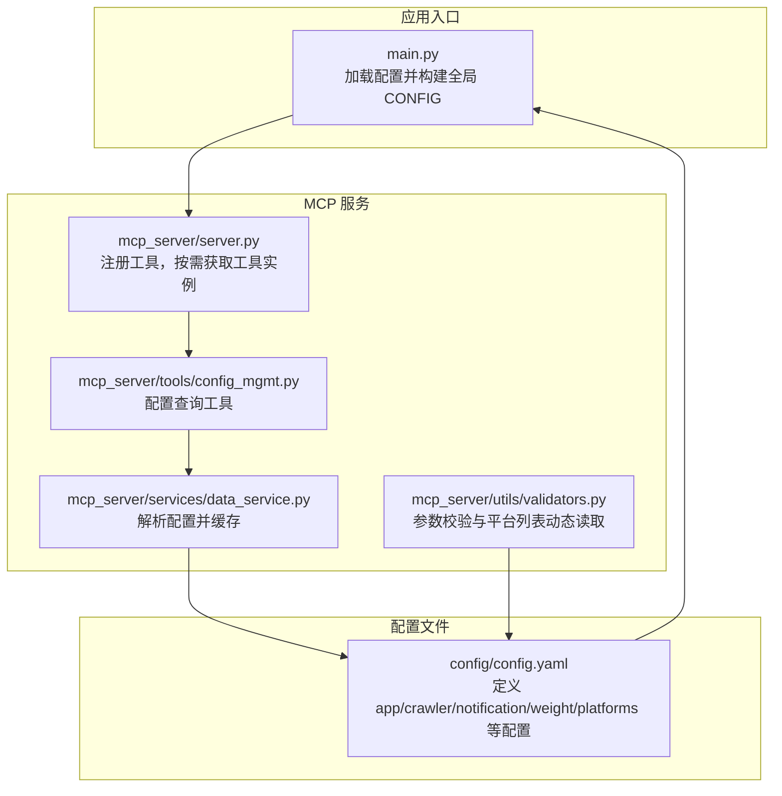
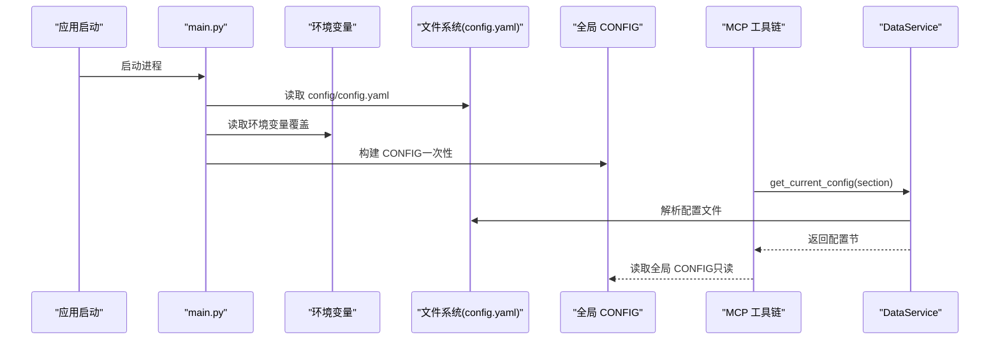
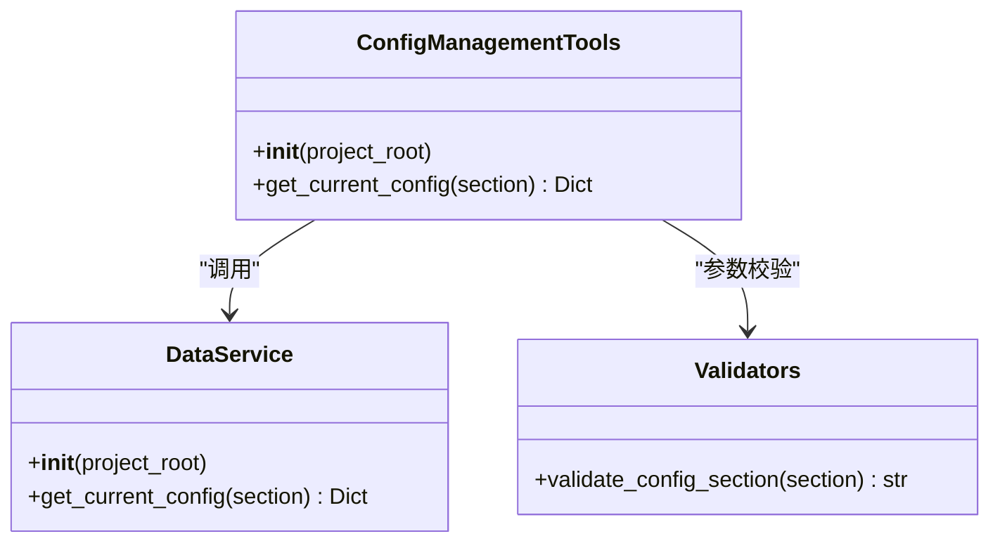
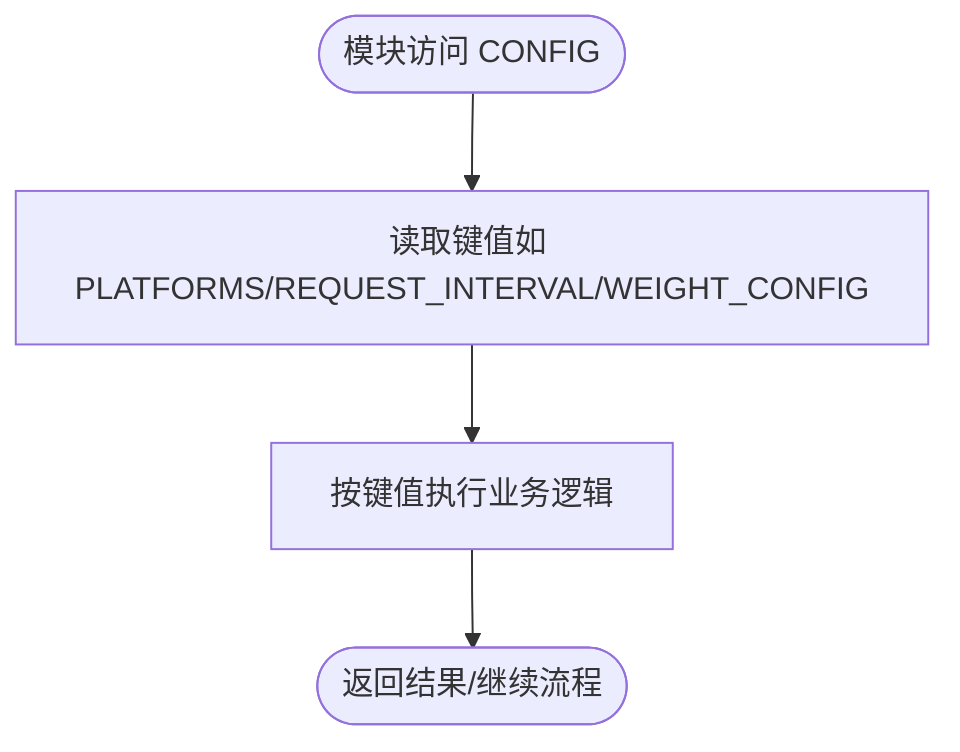
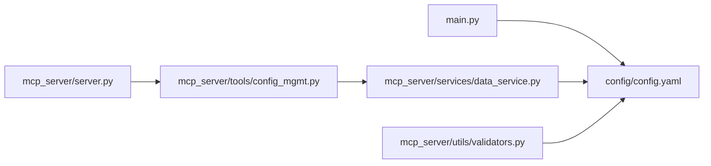

# 单例模式在配置管理中的应用

<cite>
**本文引用的文件**
- [main.py](file://main.py)
- [config/config.yaml](file://config/config.yaml)
- [mcp_server/server.py](file://mcp_server/server.py)
- [mcp_server/tools/config_mgmt.py](file://mcp_server/tools/config_mgmt.py)
- [mcp_server/services/data_service.py](file://mcp_server/services/data_service.py)
- [mcp_server/utils/validators.py](file://mcp_server/utils/validators.py)
</cite>

## 目录
1. [简介](#简介)
2. [项目结构](#项目结构)
3. [核心组件](#核心组件)
4. [架构总览](#架构总览)
5. [详细组件分析](#详细组件分析)
6. [依赖关系分析](#依赖关系分析)
7. [性能考量](#性能考量)
8. [故障排查指南](#故障排查指南)
9. [结论](#结论)

## 简介
本文件聚焦于 TrendRadar 在配置管理中对“单例模式”的实践，围绕全局 CONFIG 对象展开，解释如何通过一次性加载配置并将其作为全局只读数据源，确保配置的一致性与唯一性，避免重复加载与内存浪费。文档将结合 main.py 中的 load_config 函数与 CONFIG 全局变量，说明配置在应用启动时被一次性构建并供所有模块共享；同时阐述该设计在多模块访问场景下的优势与潜在风险（如配置不可变性），并给出其他模块安全引用 CONFIG 的方法与最佳实践。

## 项目结构
- 配置文件集中于 config 目录，核心为 config/config.yaml，定义应用、爬虫、通知、权重与平台等配置项。
- 应用入口 main.py 负责加载配置并构建全局 CONFIG，随后被业务模块与 MCP 服务工具广泛引用。
- MCP 服务层 mcp_server 提供工具接口，其中 ConfigManagementTools 通过 DataService 间接读取配置，形成“配置查询”能力。

图表来源
- [main.py](file://main.py#L398-L402)
- [config/config.yaml](file://config/config.yaml#L1-L140)
- [mcp_server/server.py](file://mcp_server/server.py#L29-L38)
- [mcp_server/tools/config_mgmt.py](file://mcp_server/tools/config_mgmt.py#L1-L67)
- [mcp_server/services/data_service.py](file://mcp_server/services/data_service.py#L411-L496)
- [mcp_server/utils/validators.py](file://mcp_server/utils/validators.py#L16-L41)

章节来源
- [main.py](file://main.py#L398-L402)
- [config/config.yaml](file://config/config.yaml#L1-L140)
- [mcp_server/server.py](file://mcp_server/server.py#L29-L38)

## 核心组件
- 全局 CONFIG 对象：由 main.py 在启动阶段一次性构建，包含应用版本检查、请求间隔、报告模式、权重配置、平台列表、通知渠道与批量发送参数等。
- load_config 函数：负责从配置文件与环境变量中合并构建 CONFIG，支持环境变量覆盖，打印配置来源与账号数量统计，便于运维核验。
- 配置查询工具链：MCP 侧通过 ConfigManagementTools 调用 DataService.get_current_config，后者解析 config/config.yaml 并按节返回配置，同时具备缓存机制。

章节来源
- [main.py](file://main.py#L161-L395)
- [mcp_server/tools/config_mgmt.py](file://mcp_server/tools/config_mgmt.py#L26-L67)
- [mcp_server/services/data_service.py](file://mcp_server/services/data_service.py#L411-L496)

## 架构总览
下图展示了“配置加载—全局共享—工具查询”的整体流程，体现单例模式在配置管理中的落地：应用启动时仅一次加载 CONFIG，后续所有模块共享同一份配置对象，避免重复 IO 与内存占用。

图表来源
- [main.py](file://main.py#L161-L395)
- [mcp_server/tools/config_mgmt.py](file://mcp_server/tools/config_mgmt.py#L26-L67)
- [mcp_server/services/data_service.py](file://mcp_server/services/data_service.py#L411-L496)

## 详细组件分析

### 全局 CONFIG 的构建与单例特性
- 构建时机：应用启动时立即执行 load_config 并赋值给 CONFIG，确保全局唯一。
- 数据来源：优先读取配置文件，再由环境变量覆盖；对通知渠道、SMTP、代理等关键参数进行环境变量优先策略，兼顾灵活性与安全性。
- 输出校验：打印通知渠道来源与账号数量，便于运维核验配置有效性。
- 一致性保障：CONFIG 作为全局只读字典，所有模块通过直接读取 CONFIG 键值访问配置，避免重复加载与并发写入带来的不一致。

章节来源
- [main.py](file://main.py#L161-L395)
- [main.py](file://main.py#L398-L402)

### 配置查询工具链（MCP 侧）
- ConfigManagementTools：对外提供 get_current_config 接口，内部调用 DataService.get_current_config，支持按节返回配置（all/crawler/push/keywords/weights）。
- DataService.get_current_config：解析 config/config.yaml，组装所需配置节，同时具备 1 小时缓存，减少重复解析开销。
- 参数校验：validators.validate_config_section 确保 section 参数合法，避免非法查询。

图表来源
- [mcp_server/tools/config_mgmt.py](file://mcp_server/tools/config_mgmt.py#L14-L67)
- [mcp_server/services/data_service.py](file://mcp_server/services/data_service.py#L411-L496)
- [mcp_server/utils/validators.py](file://mcp_server/utils/validators.py#L292-L307)

章节来源
- [mcp_server/tools/config_mgmt.py](file://mcp_server/tools/config_mgmt.py#L26-L67)
- [mcp_server/services/data_service.py](file://mcp_server/services/data_service.py#L411-L496)
- [mcp_server/utils/validators.py](file://mcp_server/utils/validators.py#L292-L307)

### 配置在业务模块中的使用
- 启动阶段：main.py 打印 CONFIG["PLATFORMS"] 数量，确认平台配置生效。
- 推送记录管理：PushRecordManager 读取 CONFIG["PUSH_WINDOW"]["RECORD_RETENTION_DAYS"] 等参数，控制记录清理策略。
- 爬虫调度：DataFetcher.crawl_websites 读取 CONFIG["REQUEST_INTERVAL"] 控制请求间隔。
- 报告与通知：多处读取 CONFIG["RANK_THRESHOLD"]、CONFIG["WEIGHT_CONFIG"]、CONFIG["FEISHU_MESSAGE_SEPARATOR"] 等参数，统一行为与格式。

图表来源
- [main.py](file://main.py#L400-L402)
- [main.py](file://main.py#L532-L534)
- [main.py](file://main.py#L685-L687)
- [main.py](file://main.py#L1137-L1145)
- [main.py](file://main.py#L1282-L1284)
- [main.py](file://main.py#L1655-L1657)
- [main.py](file://main.py#L2996-L3000)
- [main.py](file://main.py#L3027-L3031)
- [main.py](file://main.py#L3035-L3039)
- [main.py](file://main.py#L3050-L3052)
- [main.py](file://main.py#L3564-L3566)
- [main.py](file://main.py#L3595-L3597)
- [main.py](file://main.py#L3755-L3757)
- [main.py](file://main.py#L3813-L3818)
- [main.py](file://main.py#L3827-L3836)
- [main.py](file://main.py#L3836-L3840)
- [main.py](file://main.py#L3840-L3882)

章节来源
- [main.py](file://main.py#L400-L402)
- [main.py](file://main.py#L532-L534)
- [main.py](file://main.py#L685-L687)
- [main.py](file://main.py#L1137-L1145)
- [main.py](file://main.py#L1282-L1284)
- [main.py](file://main.py#L1655-L1657)
- [main.py](file://main.py#L2996-L3000)
- [main.py](file://main.py#L3027-L3031)
- [main.py](file://main.py#L3035-L3039)
- [main.py](file://main.py#L3050-L3052)
- [main.py](file://main.py#L3564-L3566)
- [main.py](file://main.py#L3595-L3597)
- [main.py](file://main.py#L3755-L3757)
- [main.py](file://main.py#L3813-L3818)
- [main.py](file://main.py#L3827-L3836)
- [main.py](file://main.py#L3836-L3840)
- [main.py](file://main.py#L3840-L3882)

### 单例模式的优势与潜在风险
- 优势
  - 一致性：全局 CONFIG 保证所有模块看到相同的配置视图，避免因重复加载导致的配置漂移。
  - 性能：避免重复 IO 与解析，降低启动与运行时开销。
  - 安全性：环境变量优先策略在不暴露敏感信息的前提下提供灵活覆盖，且 CONFIG 作为只读字典天然防止误修改。
- 潜在风险
  - 不可变性：一旦应用启动，CONFIG 不应被修改。若后续需要热更新，需引入受控的刷新机制（如重启或显式重建 CONFIG）。
  - 配置来源复杂性：ENV 与配置文件的叠加逻辑可能增加调试成本，建议在启动日志中清晰标注来源。

章节来源
- [main.py](file://main.py#L161-L395)
- [config/config.yaml](file://config/config.yaml#L1-L140)

### 其他模块安全引用 CONFIG 的实践
- 直接导入：在模块顶部从 main 导入 CONFIG，然后按需读取键值。注意仅读取，不写入。
- 读取示例（路径引用而非代码）：
  - 读取平台数量：参见 [main.py](file://main.py#L400-L402)
  - 读取请求间隔：参见 [main.py](file://main.py#L685-L687)
  - 读取推送窗口参数：参见 [main.py](file://main.py#L3813-L3818)
  - 读取权重配置：参见 [main.py](file://main.py#L1137-L1145)
- MCP 查询配置：通过 ConfigManagementTools.get_current_config 获取节级配置，避免直接耦合全局 CONFIG。

章节来源
- [main.py](file://main.py#L400-L402)
- [main.py](file://main.py#L685-L687)
- [main.py](file://main.py#L3813-L3818)
- [main.py](file://main.py#L1137-L1145)
- [mcp_server/tools/config_mgmt.py](file://mcp_server/tools/config_mgmt.py#L26-L67)

## 依赖关系分析
- main.py 依赖 config/config.yaml，构建全局 CONFIG。
- MCP 服务通过 server.py 注册工具，ConfigManagementTools 依赖 DataService，DataService 依赖解析器与缓存，最终读取 config/config.yaml。
- validators 通过相对路径读取 config/config.yaml 获取平台列表，用于参数校验。

图表来源
- [main.py](file://main.py#L398-L402)
- [mcp_server/server.py](file://mcp_server/server.py#L29-L38)
- [mcp_server/tools/config_mgmt.py](file://mcp_server/tools/config_mgmt.py#L14-L67)
- [mcp_server/services/data_service.py](file://mcp_server/services/data_service.py#L411-L496)
- [mcp_server/utils/validators.py](file://mcp_server/utils/validators.py#L16-L41)

章节来源
- [main.py](file://main.py#L398-L402)
- [mcp_server/server.py](file://mcp_server/server.py#L29-L38)
- [mcp_server/tools/config_mgmt.py](file://mcp_server/tools/config_mgmt.py#L14-L67)
- [mcp_server/services/data_service.py](file://mcp_server/services/data_service.py#L411-L496)
- [mcp_server/utils/validators.py](file://mcp_server/utils/validators.py#L16-L41)

## 性能考量
- 单次加载：CONFIG 在启动时一次性构建，避免重复 IO 与解析，显著降低启动与运行时开销。
- 缓存策略：MCP 侧 DataService.get_current_config 对配置节结果进行 1 小时缓存；validators.get_supported_platforms 读取平台列表时也具备降级策略，减少异常对系统的影响。
- 环境变量覆盖：通过环境变量覆盖关键参数，可在不修改配置文件的情况下调整行为，兼顾灵活性与性能。

章节来源
- [main.py](file://main.py#L161-L395)
- [mcp_server/services/data_service.py](file://mcp_server/services/data_service.py#L411-L496)
- [mcp_server/utils/validators.py](file://mcp_server/utils/validators.py#L16-L41)

## 故障排查指南
- 配置文件缺失：load_config 会在 CONFIG_PATH 指向的路径不存在时报错，检查 CONFIG_PATH 环境变量与文件路径。
- 通知渠道配置来源：load_config 会打印通知渠道来源与账号数量，若未配置任何渠道，将提示“未配置任何通知渠道”，需核对环境变量或配置文件。
- 平台列表校验：validators.get_supported_platforms 从 config/config.yaml 动态读取平台列表，若读取失败将返回空列表并打印警告，允许所有平台通过（降级策略）。
- 配置节查询：ConfigManagementTools.get_current_config 返回包含 success 与 error 字段的结果，便于定位参数校验与解析错误。

章节来源
- [main.py](file://main.py#L161-L170)
- [main.py](file://main.py#L390-L394)
- [mcp_server/utils/validators.py](file://mcp_server/utils/validators.py#L16-L41)
- [mcp_server/tools/config_mgmt.py](file://mcp_server/tools/config_mgmt.py#L41-L67)

## 结论
TrendRadar 通过在 main.py 中一次性构建全局 CONFIG 并在应用启动时冻结，实现了配置管理的单例模式：既保证了配置的一致性与唯一性，又避免了重复加载与内存浪费。MCP 侧通过 ConfigManagementTools 与 DataService 提供了安全、可控的配置查询能力。在多模块访问场景下，该设计提升了系统性能与配置安全性；同时需要注意 CONFIG 的不可变性与配置来源的可追溯性，必要时引入受控的刷新机制以满足热更新需求。