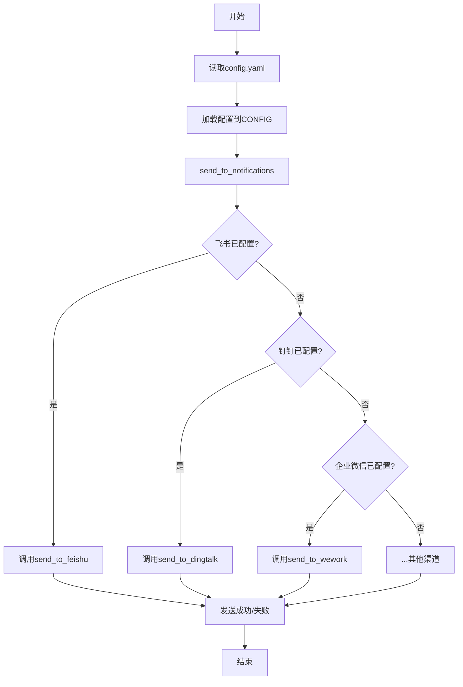

# 工厂模式在通知渠道创建中的应用

<cite>
**本文档引用的文件**   
- [main.py](file://main.py)
- [config/config.yaml](file://config/config.yaml)
</cite>

## 目录
1. [引言](#引言)
2. [配置驱动的工厂模式](#配置驱动的工厂模式)
3. [动态对象创建机制](#动态对象创建机制)
4. [通知发送核心流程](#通知发送核心流程)
5. [可扩展性与维护性分析](#可扩展性与维护性分析)
6. [结论](#结论)

## 引言
TrendRadar项目通过工厂模式实现了通知系统的动态化和可扩展性。该系统能够根据`config.yaml`文件中的`webhooks`配置，动态创建企业微信、飞书、钉钉等多种通知渠道的实例。这种设计模式将对象的创建过程与使用过程分离，使得新增通知渠道时只需添加相应的逻辑，而无需修改核心推送流程，从而极大地提高了系统的灵活性和可维护性。本文将深入分析这一设计模式的实现原理和优势。

## 配置驱动的工厂模式
TrendRadar的通知系统采用了一种基于配置的工厂模式实现。系统的核心配置文件`config.yaml`中的`webhooks`部分定义了所有可用的通知渠道及其凭证，如飞书、钉钉、企业微信等的Webhook URL。当程序启动时，`load_config()`函数会读取此配置文件，并将这些配置信息加载到全局的`CONFIG`字典中。

这种设计将工厂的“产品列表”（即支持的通知渠道）从硬编码的代码中解放出来，转而由外部配置文件定义。这使得系统具备了极高的灵活性：运维人员无需修改任何代码，只需在`config.yaml`中添加一个新的Webhook URL，系统就能自动识别并启用该通知渠道。例如，要添加一个飞书机器人，只需在`webhooks`下添加`feishu_url: "https://your-feishu-webhook-url"`即可。

**Section sources**
- [main.py](file://main.py#L161-L395)
- [config/config.yaml](file://config/config.yaml#L34-L109)

## 动态对象创建机制
通知渠道实例的创建过程完全由`send_to_notifications`函数控制，该函数扮演了“工厂”的角色。它不直接创建具体的对象，而是根据`CONFIG`字典中的配置，决定调用哪个具体的发送函数。

其核心逻辑如下：
1.  **配置解析**：首先，函数通过`parse_multi_account_config()`函数解析`CONFIG`中各个渠道的配置。该函数能处理以分号`;`分隔的多账号配置，将其拆分为一个账号列表。
2.  **条件判断与路由**：函数通过一系列`if`条件判断，检查`CONFIG`中是否存在特定渠道的配置（如`FEISHU_WEBHOOK_URL`、`DINGTALK_WEBHOOK_URL`等）。如果存在，则进入该渠道的创建和发送流程。
3.  **对象创建与调用**：对于每个已配置的渠道，函数会遍历其账号列表，并调用对应的发送函数，如`send_to_feishu()`、`send_to_dingtalk()`等。这些具体的发送函数才是真正的“产品”创建者和执行者。

这种机制完美体现了工厂模式的精髓：客户端（`send_to_notifications`）只依赖于抽象的“发送通知”接口，而具体的实现（飞书、钉钉等）则由配置决定。新增一个通知渠道，只需在`main.py`中添加一个新的`send_to_xxx()`函数，并在`send_to_notifications`中添加一个`if`分支即可，核心的推送逻辑保持不变。

**Diagram sources **
- [main.py](file://main.py#L3801-L3988)

**Section sources**
- [main.py](file://main.py#L3801-L3988)

## 通知发送核心流程
`main.py`中的`send_to_notifications`函数是整个通知系统的中枢。它首先检查是否启用了推送时间窗口，然后准备报告数据。接着，它会依次检查每一种通知渠道的配置。

对于每个渠道，它都遵循相同的模式：
1.  **获取配置**：从`CONFIG`中提取该渠道的配置项（如URL、Token等）。
2.  **解析与验证**：使用`parse_multi_account_config()`解析多账号，并使用`validate_paired_configs()`等函数验证配对参数（如Telegram的Token和Chat ID）的数量是否一致。
3.  **创建与发送**：通过`limit_accounts()`限制账号数量后，遍历每个账号，调用具体的发送函数（如`send_to_feishu()`）来创建通知实例并发送消息。

这种流程确保了所有通知渠道的处理逻辑是统一和可预测的。无论最终调用的是哪个`send_to_xxx()`函数，它们都接收相同结构的`report_data`，从而保证了消息内容的一致性。

**Section sources**
- [main.py](file://main.py#L3801-L3988)

## 可扩展性与维护性分析
TrendRadar的工厂模式设计带来了显著的可扩展性和维护性优势。

**可扩展性**：系统的设计使得添加新的通知渠道变得异常简单。假设需要添加对“企业微信应用”（App）的支持，开发者只需：
1.  在`config.yaml`的`webhooks`部分添加一个新的配置项，如`wework_app_url`。
2.  在`main.py`中实现一个新的`send_to_wework_app()`函数，处理企业微信App的API调用。
3.  在`send_to_notifications`函数中添加一个`if`分支，检查`CONFIG["WEWORK_APP_URL"]`并调用`send_to_wework_app()`。

整个过程完全遵循开闭原则（对扩展开放，对修改关闭），核心的推送流程和已有渠道的代码无需任何改动。

**维护性**：通过将对象创建过程封装在`send_to_notifications`工厂函数中，系统实现了低耦合。每个`send_to_xxx()`函数只关心如何与特定的API交互，而`send_to_notifications`只关心“有哪些渠道需要发送”。这种职责分离使得代码更易于理解和测试。同时，配置与代码的分离也降低了运维的复杂性，非开发人员也能安全地管理通知渠道。

## 结论
TrendRadar项目通过巧妙地运用工厂模式，构建了一个高度灵活和可维护的通知系统。该系统以`config.yaml`为驱动，通过`send_to_notifications`函数作为工厂，根据配置动态地创建和调用不同的通知渠道实例。这种设计不仅实现了对象创建过程的封装，降低了系统各组件间的耦合度，更重要的是，它为系统的未来扩展铺平了道路。任何新的通知服务都可以通过添加配置和实现一个独立的发送函数来轻松集成，而无需触碰核心业务逻辑，充分体现了良好软件设计的价值。