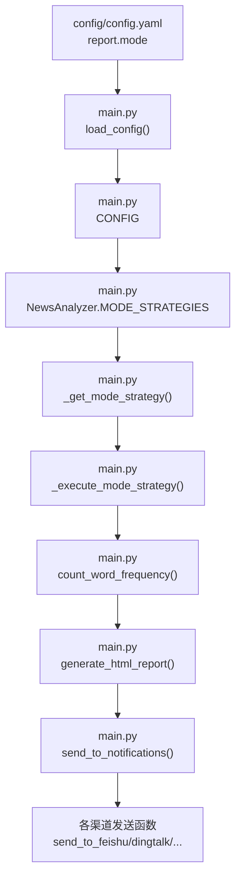
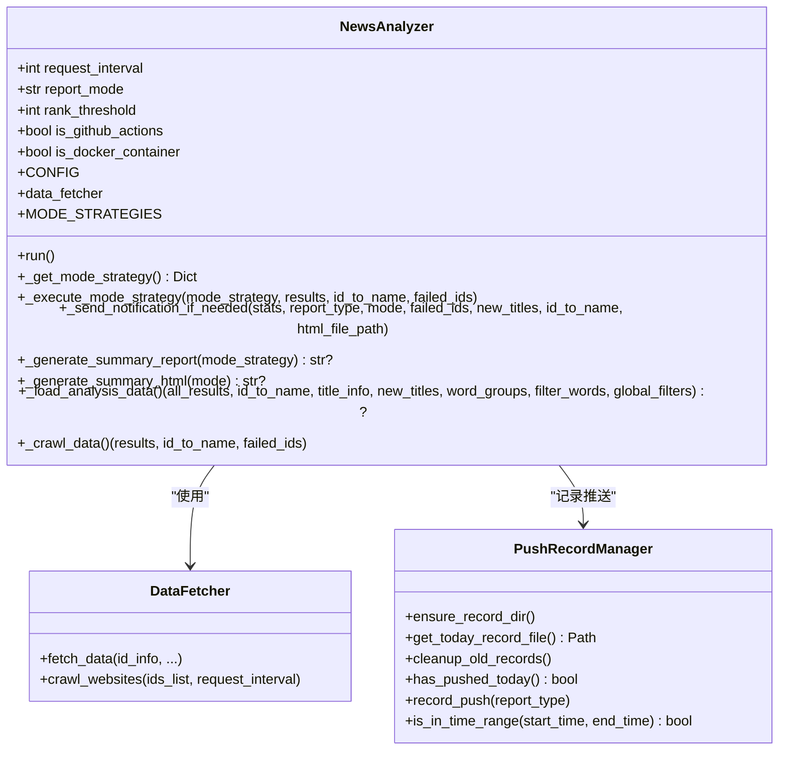
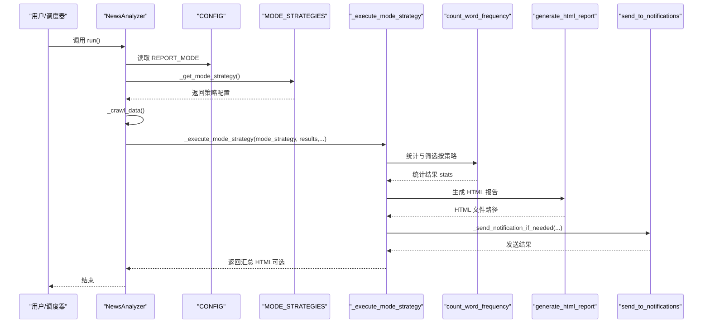
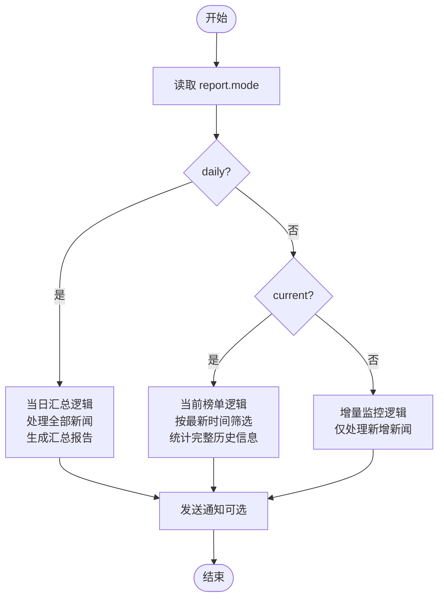

# 策略模式支持多种推送策略的实现

<cite>
**本文引用的文件**
- [main.py](file://main.py)
- [config/config.yaml](file://config/config.yaml)
- [README.md](file://README.md)
- [README-EN.md](file://README-EN.md)
</cite>

## 目录
1. [简介](#简介)
2. [项目结构](#项目结构)
3. [核心组件](#核心组件)
4. [架构总览](#架构总览)
5. [详细组件分析](#详细组件分析)
6. [依赖关系分析](#依赖关系分析)
7. [性能考量](#性能考量)
8. [故障排查指南](#故障排查指南)
9. [结论](#结论)
10. [附录](#附录)

## 简介
本文件围绕 TrendRadar 中“策略模式”在推送策略中的实现展开，重点解释系统如何依据配置项 report.mode 在“当日汇总”、“当前榜单”、“增量监控”三种推送策略之间动态切换，并说明每种策略的业务差异、适用场景以及策略接口与实现类的设计结构。同时，阐述该模式如何提升系统的灵活性与可配置性，使用户可在不修改代码的前提下自由切换推送行为，同时保证核心推送框架的稳定性。

## 项目结构
- 配置入口：config/config.yaml 中的 report.mode 决定推送策略；main.py 负责加载配置、解析策略、执行推送与通知。
- 关键模块：
  - 配置加载与校验：main.py 中 load_config() 与 CONFIG 构建，支持环境变量覆盖。
  - 策略定义与调度：NewsAnalyzer 类内的 MODE_STRATEGIES 与策略执行流程。
  - 数据采集与分析：DataFetcher、统计与排序、HTML 报告生成。
  - 通知发送：统一的 send_to_notifications 与各渠道发送函数（飞书、钉钉、企业微信、Telegram、ntfy、Bark、Slack、邮件）。

图表来源
- [config/config.yaml](file://config/config.yaml#L26-L33)
- [main.py](file://main.py#L162-L260)
- [main.py](file://main.py#L4877-L4910)
- [main.py](file://main.py#L4971-L4974)
- [main.py](file://main.py#L5280-L5397)
- [main.py](file://main.py#L197-L260)
- [main.py](file://main.py#L3900-L3987)

章节来源
- [config/config.yaml](file://config/config.yaml#L26-L33)
- [main.py](file://main.py#L162-L260)
- [main.py](file://main.py#L4877-L4910)
- [main.py](file://main.py#L4971-L4974)
- [main.py](file://main.py#L5280-L5397)
- [main.py](file://main.py#L3900-L3987)

## 核心组件
- 配置加载与策略选择
  - main.py 中 load_config() 从 config/config.yaml 读取 report.mode，并支持环境变量覆盖。
  - NewsAnalyzer.MODE_STRATEGIES 定义三种策略的元数据（名称、描述、是否实时推送、是否生成汇总、汇总模式）。
  - _get_mode_strategy() 根据 CONFIG["REPORT_MODE"] 返回对应策略配置。
- 数据分析与推送执行
  - _execute_mode_strategy() 负责在不同策略下组织数据、生成报告并决定是否发送通知。
  - count_word_frequency() 根据策略模式对数据进行筛选与统计（增量模式、当前榜单模式、当日汇总模式）。
  - send_to_notifications() 统一调度各渠道发送，支持多账号与批次发送。
- 通知渠道
  - 支持飞书、钉钉、企业微信、Telegram、ntfy、Bark、Slack、邮件等多渠道，具备分批发送与配对校验。

章节来源
- [main.py](file://main.py#L162-L260)
- [main.py](file://main.py#L4877-L4910)
- [main.py](file://main.py#L4971-L4974)
- [main.py](file://main.py#L5280-L5397)
- [main.py](file://main.py#L3900-L3987)

## 架构总览
策略模式在此处体现为“策略接口”（策略字典）与“策略实现”（三种模式的配置与行为差异）。NewsAnalyzer 作为上下文，依据配置动态选择策略并执行统一的分析与推送流程。

图表来源
- [main.py](file://main.py#L4877-L4910)
- [main.py](file://main.py#L5280-L5397)
- [main.py](file://main.py#L514-L580)

章节来源
- [main.py](file://main.py#L4877-L4910)
- [main.py](file://main.py#L514-L580)
- [main.py](file://main.py#L5280-L5397)

## 详细组件分析

### 策略接口与实现类设计
- 策略接口（策略字典）
  - NewsAnalyzer.MODE_STRATEGIES 定义三种模式的元数据，包括：
    - mode_name、description
    - realtime 报告类型与汇总报告类型
    - should_send_realtime、should_generate_summary、summary_mode
  - _get_mode_strategy() 基于 CONFIG["REPORT_MODE"] 返回对应策略配置。
- 策略实现（执行流程）
  - _execute_mode_strategy() 根据策略决定：
    - 是否实时推送（should_send_realtime）
    - 是否生成汇总（should_generate_summary）
    - 汇总模式（summary_mode）
  - _generate_summary_report() 与 _generate_summary_html() 生成汇总报告（HTML）。
  - _send_notification_if_needed() 统一判断是否满足发送条件并调用 send_to_notifications()。

图表来源
- [main.py](file://main.py#L4971-L4974)
- [main.py](file://main.py#L5280-L5397)
- [main.py](file://main.py#L5110-L5160)
- [main.py](file://main.py#L5161-L5204)
- [main.py](file://main.py#L5205-L5234)

章节来源
- [main.py](file://main.py#L4877-L4910)
- [main.py](file://main.py#L4971-L4974)
- [main.py](file://main.py#L5110-L5160)
- [main.py](file://main.py#L5161-L5204)
- [main.py](file://main.py#L5205-L5234)
- [main.py](file://main.py#L5280-L5397)

### 三种推送策略的业务逻辑与适用场景
- 当日汇总（daily）
  - 推送时机：按时推送（默认每小时一次）。
  - 显示内容：当日所有匹配新闻 + 新增新闻区域。
  - 适用场景：日报总结、全面了解当日热点趋势。
  - 特点：包含历史推送过的新闻，适合回顾全天趋势。
- 当前榜单（current）
  - 推送时机：按时推送（默认每小时一次）。
  - 显示内容：当前榜单匹配新闻 + 新增新闻区域。
  - 适用场景：实时热点追踪、了解当前最火的内容。
  - 特点：持续在榜的新闻每次都会出现，适合观察排名变化。
- 增量监控（incremental）
  - 推送时机：有新增才推送。
  - 显示内容：新出现的匹配频率词新闻。
  - 适用场景：避免重复信息干扰，高频监控。
  - 特点：零重复，只看首次出现的新闻。

图表来源
- [config/config.yaml](file://config/config.yaml#L26-L33)
- [README.md](file://README.md#L242-L265)
- [README-EN.md](file://README-EN.md#L194-L218)

章节来源
- [config/config.yaml](file://config/config.yaml#L26-L33)
- [README.md](file://README.md#L242-L265)
- [README-EN.md](file://README-EN.md#L194-L218)

### 策略与数据处理的耦合关系
- count_word_frequency() 根据 mode 参数对数据进行差异化处理：
  - incremental：当天第一次抓取时处理全部新闻并标记为新增；非第一次仅处理新增新闻。
  - current：仅处理最新时间批次的新闻，但统计信息来自完整历史，保证排名统计完整性。
  - daily：处理全部新闻，统计全部匹配数量。
- _execute_mode_strategy() 在不同策略下决定是否使用完整历史数据（current 模式）以确保统计准确性。

章节来源
- [main.py](file://main.py#L1277-L1599)
- [main.py](file://main.py#L5280-L5397)

### 通知发送与多账号支持
- send_to_notifications() 统一调度各渠道发送，支持：
  - 多账号：解析分号分隔的多个账号，限制最大账号数。
  - 配对校验：Telegram、ntfy 等需要配对参数数量一致。
  - 分批发送：按渠道最大字节数分批，统一添加批次头部，批次间间隔可控。
  - 推送记录：在启用“每天只推一次”时记录推送，避免重复打扰。

章节来源
- [main.py](file://main.py#L3900-L3987)
- [main.py](file://main.py#L3990-L4200)
- [main.py](file://main.py#L514-L580)

## 依赖关系分析
- 配置依赖：config/config.yaml 的 report.mode 与各渠道配置决定策略与通知行为。
- 策略依赖：NewsAnalyzer 依赖 MODE_STRATEGIES 与 CONFIG["REPORT_MODE"]。
- 数据依赖：count_word_frequency 依赖频率词配置与平台列表过滤。
- 通知依赖：send_to_notifications 依赖 CONFIG["ENABLE_NOTIFICATION"]、各渠道配置与 PushRecordManager 的推送记录。

```mermaid
graph LR
CFG["config/config.yaml"] --> LDC["main.py: load_config()"]
LDC --> C["main.py: CONFIG"]
C --> NS["main.py: NewsAnalyzer.MODE_STRATEGIES"]
NS --> GS["_get_mode_strategy()"]
GS --> EX["_execute_mode_strategy()"]
EX --> CW["count_word_frequency()"]
CW --> GH["generate_html_report()"]
GH --> SN["send_to_notifications()"]
SN --> PR["PushRecordManager"]
```

图表来源
- [config/config.yaml](file://config/config.yaml#L26-L33)
- [main.py](file://main.py#L162-L260)
- [main.py](file://main.py#L4877-L4910)
- [main.py](file://main.py#L4971-L4974)
- [main.py](file://main.py#L5280-L5397)
- [main.py](file://main.py#L1277-L1599)
- [main.py](file://main.py#L3900-L3987)
- [main.py](file://main.py#L514-L580)

章节来源
- [config/config.yaml](file://config/config.yaml#L26-L33)
- [main.py](file://main.py#L162-L260)
- [main.py](file://main.py#L4877-L4910)
- [main.py](file://main.py#L4971-L4974)
- [main.py](file://main.py#L5280-L5397)
- [main.py](file://main.py#L1277-L1599)
- [main.py](file://main.py#L3900-L3987)
- [main.py](file://main.py#L514-L580)

## 性能考量
- 策略选择的开销极低：仅字典查找与分支判断，对整体性能影响可忽略。
- 数据处理的复杂度主要取决于平台数量与抓取新闻条目数，count_word_frequency() 与 generate_html_report() 为 O(N) 级别（N 为新闻条目数）。
- 通知发送采用分批策略，避免单次消息过大导致失败或超时；批次间隔可配置，降低对外部服务的压力。
- 增量模式在非首次执行时仅处理新增新闻，显著减少数据量与处理时间。

## 故障排查指南
- 策略未生效
  - 检查 config/config.yaml 中 report.mode 是否正确；若使用环境变量，确认 REPORT_MODE 是否设置。
- 通知未发送
  - 确认 ENABLE_NOTIFICATION 为 true 且至少配置了一个通知渠道；检查各渠道配置是否完整。
  - 若启用“每天只推一次”，确认 PushRecordManager 是否正确记录。
- 增量模式长时间无推送
  - 可能当前时段无新增；检查关键词配置、监控平台数量或切换至 current/daily 模式验证。
- 多账号配置错误
  - Telegram、ntfy 等渠道需配对参数数量一致；检查分号分隔与数量匹配。

章节来源
- [config/config.yaml](file://config/config.yaml#L26-L33)
- [main.py](file://main.py#L162-L260)
- [main.py](file://main.py#L3900-L3987)
- [main.py](file://main.py#L514-L580)
- [README.md](file://README.md#L1863-L1906)
- [README-EN.md](file://README-EN.md#L1814-L1880)

## 结论
TrendRadar 通过策略模式将“推送策略”抽象为可配置的策略字典，并在 NewsAnalyzer 中以统一的执行流程承载三种模式的差异化行为。该设计使得：
- 用户可通过 report.mode 与环境变量灵活切换策略，无需修改代码；
- 核心推送框架（数据采集、统计、报告生成、通知发送）保持稳定与复用；
- 增量模式、当前榜单模式与当日汇总模式分别满足高频监控、实时追踪与全面回顾的不同需求；
- 多账号、配对校验、分批发送与推送记录等机制进一步提升了系统的可运维性与用户体验。

## 附录
- 配置项说明（节选）
  - report.mode：可选值 "daily"|"incremental"|"current"
  - ENABLE_NOTIFICATION：是否启用通知
  - 各渠道配置：webhooks 下的 feishu_url、dingtalk_url、wework_url、telegram_bot_token/chat_id、email_*、ntfy_*、bark_url、slack_webhook_url 等
  - PUSH_WINDOW：推送时间窗口控制（可选）

章节来源
- [config/config.yaml](file://config/config.yaml#L26-L33)
- [config/config.yaml](file://config/config.yaml#L82-L101)
- [main.py](file://main.py#L162-L260)