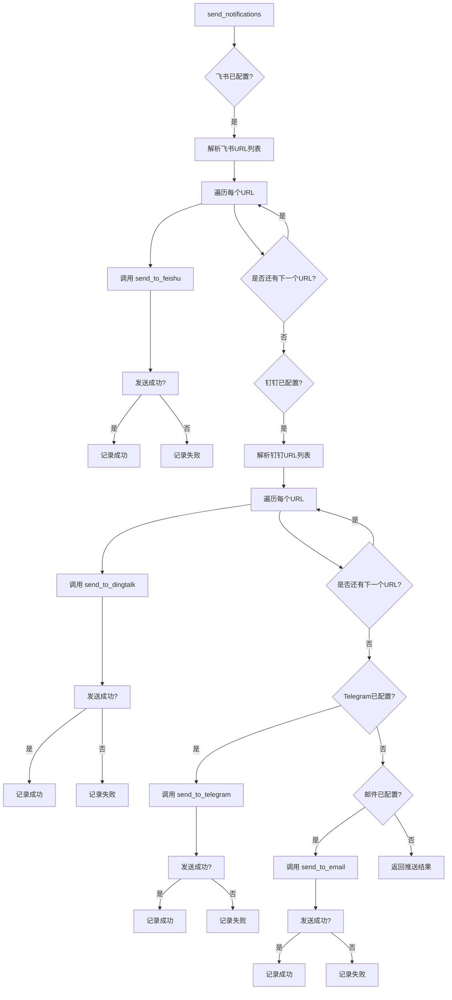

# 观察者模式在事件驱动通知系统中的作用

<cite>
**本文档引用的文件**   
- [main.py](file://main.py)
- [config/config.yaml](file://config/config.yaml)
- [README.md](file://README.md)
</cite>

## 目录
1. [引言](#引言)
2. [观察者模式架构概述](#观察者模式架构概述)
3. [事件触发与响应流程](#事件触发与响应流程)
4. [热点生成与通知解耦机制](#热点生成与通知解耦机制)
5. [多渠道并行推送实现](#多渠道并行推送实现)
6. [实际调用链路示例](#实际调用链路示例)
7. [配置与扩展性](#配置与扩展性)
8. [结论](#结论)

## 引言
TrendRadar系统通过事件驱动架构实现了高效的热点信息监控与通知。该系统的核心在于利用观察者模式（Observer Pattern）将热点数据的产生与通知的发送进行解耦，确保系统在高响应性和灵活性的同时，能够支持多种通知渠道的并行推送。当新热点数据产生时，系统作为被观察者（Subject）会通知所有注册的观察者（Observer），即各种通知渠道，从而实现消息的即时推送。这种设计不仅提升了系统的可维护性，还为未来的功能扩展提供了坚实的基础。

**Section sources**
- [main.py](file://main.py#L1-L5432)
- [README.md](file://README.md#L302-L1970)

## 观察者模式架构概述
在TrendRadar系统中，观察者模式被巧妙地应用于事件驱动的通知机制。系统将热点数据的产生视为一个事件，而各种通知渠道（如飞书、钉钉、Telegram等）则作为观察者，监听这一事件的发生。当新的热点数据被检测到时，系统作为被观察者会主动通知所有注册的观察者，触发消息推送流程。

该模式的核心优势在于实现了热点生成与通知发送的完全解耦。热点数据的产生逻辑与通知渠道的具体实现相互独立，任何一方的变更都不会影响到另一方。这种设计使得系统能够灵活地添加或移除通知渠道，而无需修改核心的热点检测逻辑。

```mermaid
classDiagram
class NewsAnalyzer {
+run() void
+_run_analysis_pipeline() void
-report_mode string
-rank_threshold int
}
class PushNotifier {
+send_notifications() Dict
+send_to_feishu() bool
+send_to_dingtalk() bool
+send_to_telegram() bool
+send_to_email() bool
+send_to_bark() bool
+send_to_slack() bool
}
class DataFetcher {
+fetch_data() Tuple
+crawl_websites() Tuple
}
NewsAnalyzer --> PushNotifier : "触发"
DataFetcher --> NewsAnalyzer : "提供数据"
PushNotifier --> "飞书" : "通知"
PushNotifier --> "钉钉" : "通知"
PushNotifier --> "Telegram" : "通知"
PushNotifier --> "邮件" : "通知"
PushNotifier --> "Bark" : "通知"
PushNotifier --> "Slack" : "通知"
```

**Diagram sources**
- [main.py](file://main.py#L4878-L5431)
- [main.py](file://main.py#L3988-L4745)

**Section sources**
- [main.py](file://main.py#L4878-L5431)
- [main.py](file://main.py#L3988-L4745)

## 事件触发与响应流程
TrendRadar系统的事件触发与响应流程始于`NewsAnalyzer`类的`run`方法。该方法作为系统的主入口，负责协调数据获取、分析和通知发送的整个流程。

1.  **数据获取**：`NewsAnalyzer`首先调用`DataFetcher`类的`crawl_websites`方法，从配置的多个平台（如知乎、微博、抖音）爬取最新的新闻数据。
2.  **数据分析**：获取到原始数据后，`NewsAnalyzer`执行`_run_analysis_pipeline`方法，对数据进行处理和分析。这包括统计词频、计算新闻权重、识别新增热点等。
3.  **事件触发**：当分析完成并确认有需要推送的热点时，`NewsAnalyzer`会触发通知事件。这通过调用`send_notifications`函数来实现，该函数是观察者模式中的“通知”动作。
4.  **响应与推送**：`send_notifications`函数作为被观察者，会遍历所有配置的通知渠道（观察者），并调用相应的`send_to_*`函数（如`send_to_feishu`, `send_to_dingtalk`）来发送消息。每个`send_to_*`函数都实现了具体的推送逻辑，确保消息能够成功送达目标平台。

```mermaid
sequenceDiagram
participant NA as NewsAnalyzer
participant DF as DataFetcher
participant PN as PushNotifier
participant F as 飞书
participant D as 钉钉
participant T as Telegram
NA->>DF : crawl_websites()
DF-->>NA : 返回爬取结果
NA->>NA : _run_analysis_pipeline()
alt 有新热点
NA->>PN : send_notifications()
PN->>F : send_to_feishu()
PN->>D : send_to_dingtalk()
PN->>T : send_to_telegram()
F-->>PN : 成功/失败
D-->>PN : 成功/失败
T-->>PN : 成功/失败
PN-->>NA : 推送结果
else 无新热点
PN-->>NA : 无推送
end
NA-->> : 结束
```

**Diagram sources**
- [main.py](file://main.py#L4878-L5431)
- [main.py](file://main.py#L3988-L4745)

**Section sources**
- [main.py](file://main.py#L4878-L5431)
- [main.py](file://main.py#L3988-L4745)

## 热点生成与通知解耦机制
观察者模式的关键优势在于其解耦能力。在TrendRadar系统中，热点生成（由`NewsAnalyzer`负责）和通知发送（由`send_notifications`及其子函数负责）是两个完全独立的模块。

-   **被观察者（Subject）**：`NewsAnalyzer`是被观察者。它的核心职责是分析数据并决定是否需要发送通知。它不关心“如何”发送，只关心“是否”发送。当它决定发送时，它只需调用`send_notifications`，而无需知道具体有哪些通知渠道。
-   **观察者（Observer）**：各个`send_to_*`函数（如`send_to_feishu`, `send_to_dingtalk`）是观察者。它们负责具体的推送实现。它们监听`send_notifications`的调用，并在被调用时执行自己的推送逻辑。它们不关心热点是如何产生的，只关心自己是否被通知。

这种解耦带来了显著的好处：
1.  **高内聚，低耦合**：每个模块的职责单一且明确。`NewsAnalyzer`专注于数据分析，`send_to_*`函数专注于消息推送。
2.  **易于扩展**：要添加一个新的通知渠道（如企业微信），开发者只需编写一个新的`send_to_wework`函数，并在`send_notifications`中调用它。`NewsAnalyzer`的代码完全不需要修改。
3.  **易于维护**：如果某个通知渠道的API发生变化，只需修改对应的`send_to_*`函数，不会影响到核心的分析逻辑。

**Section sources**
- [main.py](file://main.py#L4878-L5431)
- [main.py](file://main.py#L3988-L4745)

## 多渠道并行推送实现
TrendRadar系统支持飞书、钉钉、Telegram、邮件、Bark、Slack等多种通知渠道，并且能够同时向所有配置的渠道发送消息，实现了真正的并行推送。

这一功能的实现依赖于`send_notifications`函数中的并行处理逻辑。该函数会检查配置文件中是否启用了各个渠道，如果启用，则会依次调用对应的`send_to_*`函数。虽然这些调用在代码中是顺序执行的，但由于每个`send_to_*`函数内部都使用了HTTP请求（通常是异步或快速完成的），因此从整体上看，消息是几乎同时被推送到各个平台的。

此外，系统还支持**多账号推送**。例如，一个飞书Webhook URL可以配置多个群组的Webhook地址，用分号`;`分隔。`send_notifications`函数会解析这些配置，并为每个账号调用一次`send_to_feishu`，从而实现向多个群组同时推送。



**Diagram sources**
- [main.py](file://main.py#L3988-L4745)

**Section sources**
- [main.py](file://main.py#L3988-L4745)

## 实际调用链路示例
以下是一个完整的调用链路示例，展示了从新热点数据产生到消息推送的全过程：

1.  **入口**：`main.py`中的`main()`函数被调用，创建`NewsAnalyzer`实例并执行`run()`方法。
2.  **数据爬取**：`NewsAnalyzer.run()`调用`DataFetcher.crawl_websites()`，从配置的平台获取最新新闻数据。
3.  **数据分析**：`NewsAnalyzer`对爬取的数据进行分析，识别出新增的热点词汇。
4.  **事件触发**：分析完成后，`NewsAnalyzer`调用`send_notifications()`函数，传入分析结果。
5.  **通知分发**：
    *   `send_notifications()`检查`CONFIG["FEISHU_WEBHOOK_URL"]`，发现已配置。
    *   调用`parse_multi_account_config()`解析出多个飞书Webhook URL。
    *   对每个URL，调用`send_to_feishu()`函数。
    *   `send_to_feishu()`将消息内容分批，并通过HTTP POST请求发送到飞书机器人的Webhook地址。
6.  **重复步骤5**：`send_notifications()`函数继续检查并调用`send_to_dingtalk()`, `send_to_telegram()`等其他已配置渠道的函数。
7.  **结果返回**：`send_notifications()`收集所有渠道的推送结果，并返回给`NewsAnalyzer`。

**Section sources**
- [main.py](file://main.py#L5415-L5431)
- [main.py](file://main.py#L3988-L4745)

## 配置与扩展性
TrendRadar系统的通知机制高度依赖于配置文件`config/config.yaml`。用户可以在该文件中轻松地启用或禁用各种通知渠道，并配置相应的Webhook URL、Token等信息。

系统的扩展性体现在以下几个方面：
-   **添加新渠道**：如前所述，添加新渠道只需实现新的`send_to_*`函数。
-   **配置灵活性**：支持环境变量和配置文件两种配置方式，适应GitHub Actions、Docker和本地部署等多种场景。
-   **安全警告**：文档明确警告Fork用户不要在`config.yaml`中配置敏感信息，推荐使用GitHub Secrets，体现了良好的安全实践。

**Section sources**
- [config/config.yaml](file://config/config.yaml#L82-L101)
- [README.md](file://README.md#L846-L2752)

## 结论
TrendRadar系统通过观察者模式构建了一个高效、灵活且可扩展的事件驱动通知系统。该模式成功地将热点数据的产生与通知的发送解耦，使得系统核心逻辑与具体的通知实现相互独立。这不仅简化了代码维护，还极大地提升了系统的响应性和灵活性。通过`send_notifications`函数作为中心枢纽，系统能够并行地向飞书、钉钉、Telegram等众多渠道推送消息，并支持多账号配置，满足了多样化的用户需求。这种设计是TrendRadar能够稳定、高效地为用户提供实时热点信息的关键所在。