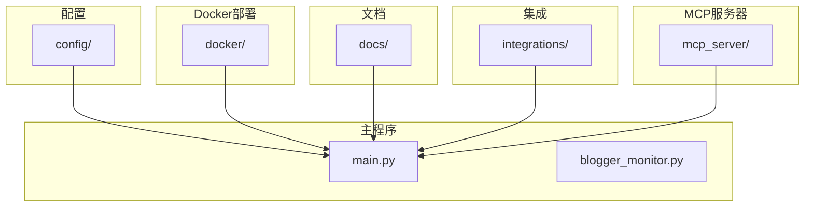
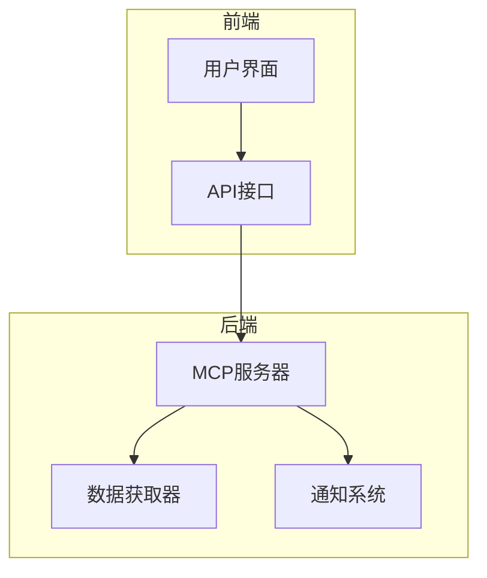
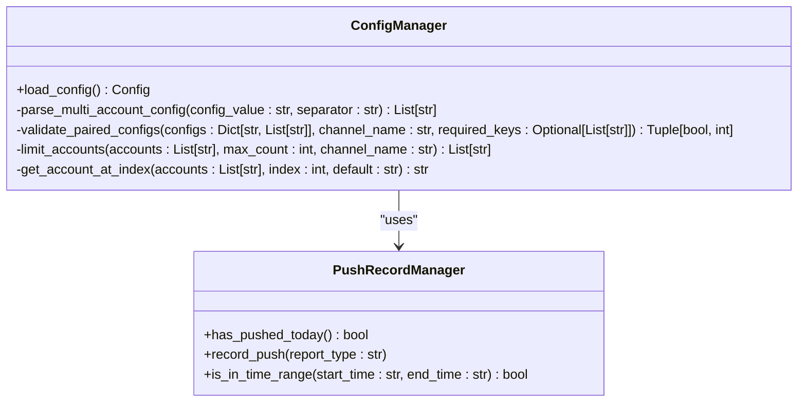
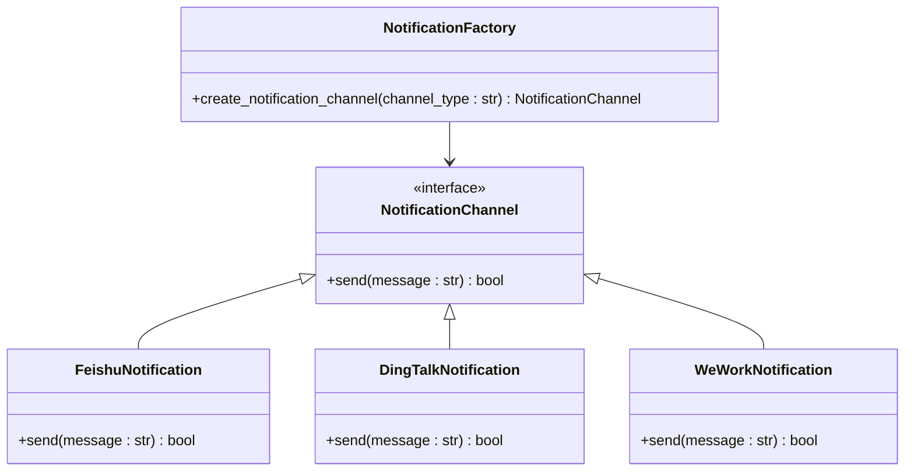
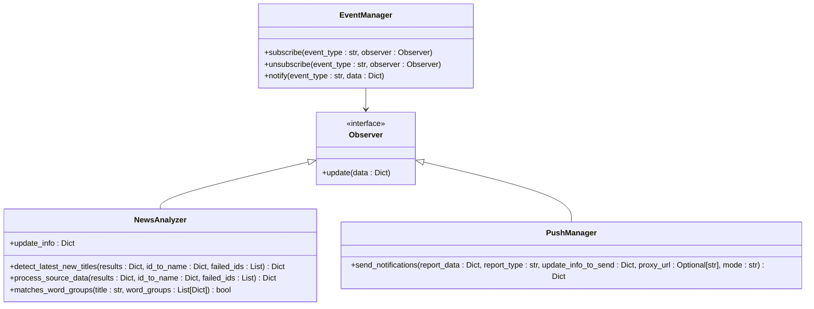
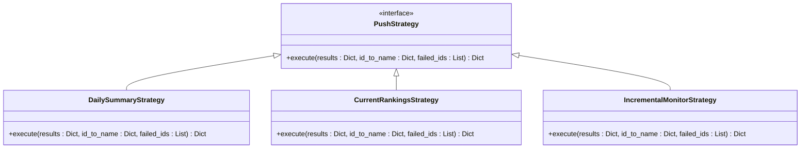
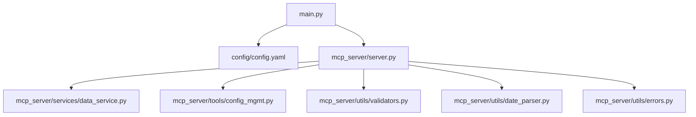

# 设计模式与架构范式

<cite>
**本文档引用的文件**   
- [main.py](file://main.py)
- [config/config.yaml](file://config/config.yaml)
- [mcp_server/server.py](file://mcp_server/server.py)
- [mcp_server/tools/config_mgmt.py](file://mcp_server/tools/config_mgmt.py)
- [mcp_server/services/data_service.py](file://mcp_server/services/data_service.py)
- [mcp_server/utils/validators.py](file://mcp_server/utils/validators.py)
- [mcp_server/utils/date_parser.py](file://mcp_server/utils/date_parser.py)
- [mcp_server/utils/errors.py](file://mcp_server/utils/errors.py)
</cite>

## 目录
1. [引言](#引言)
2. [项目结构](#项目结构)
3. [核心组件](#核心组件)
4. [架构概述](#架构概述)
5. [详细组件分析](#详细组件分析)
6. [依赖分析](#依赖分析)
7. [性能考虑](#性能考虑)
8. [故障排除指南](#故障排除指南)
9. [结论](#结论)
10. [附录](#附录) (如有必要)

## 引言
TrendRadar 是一个用于监控和推送热点新闻的系统，其设计中应用了多种经典的设计模式，以提升系统的可维护性、可扩展性和灵活性。本文档将深入分析这些设计模式在系统中的具体实现，包括单例模式、工厂模式、观察者模式和策略模式。通过这些模式的应用，TrendRadar 能够有效地管理配置、动态创建通知渠道、实现事件驱动的通知系统，并支持多种推送策略。

## 项目结构
TrendRadar 项目的目录结构清晰，主要分为配置、Docker 部署、文档、集成、MCP 服务器和主程序等部分。这种结构化的布局有助于模块化开发和维护。

**Diagram sources**
- [main.py](file://main.py#L1-L5432)
- [config/config.yaml](file://config/config.yaml#L1-L140)

**Section sources**
- [main.py](file://main.py#L1-L5432)
- [config/config.yaml](file://config/config.yaml#L1-L140)

## 核心组件
TrendRadar 的核心组件包括配置管理、数据获取、数据处理和通知系统。这些组件通过设计模式紧密协作，确保系统的高效运行。

**Section sources**
- [main.py](file://main.py#L1-L5432)
- [mcp_server/server.py](file://mcp_server/server.py#L1-L782)

## 架构概述
TrendRadar 的架构采用模块化设计，通过 MCP 服务器提供数据查询和系统管理接口。系统的核心是配置管理、数据获取和通知系统，这些组件通过设计模式实现高效协作。

**Diagram sources**
- [mcp_server/server.py](file://mcp_server/server.py#L1-L782)
- [main.py](file://main.py#L1-L5432)

## 详细组件分析

### 配置管理分析
TrendRadar 使用单例模式来管理配置，确保全局配置的一致性。通过 `load_config` 函数加载配置文件，并将配置存储在全局 `CONFIG` 变量中。

**Diagram sources**
- [main.py](file://main.py#L161-L395)
- [mcp_server/tools/config_mgmt.py](file://mcp_server/tools/config_mgmt.py#L1-L67)

#### 单例模式在配置管理中的应用
单例模式确保了配置对象的全局唯一性，避免了配置的重复加载和不一致。`CONFIG` 变量在 `main.py` 中被初始化，并在整个应用中被共享。

**Section sources**
- [main.py](file://main.py#L161-L395)

### 通知系统分析
TrendRadar 使用工厂模式来动态创建不同类型的通知渠道，如飞书、钉钉和企业微信。这种设计使得系统可以灵活地扩展新的通知渠道。

**Diagram sources**
- [main.py](file://main.py#L3906-L3928)
- [mcp_server/server.py](file://mcp_server/server.py#L29-L37)

#### 工厂模式在通知渠道创建中的应用
工厂模式通过 `NotificationFactory` 类动态创建不同类型的 `NotificationChannel` 对象。这种设计使得系统可以轻松地添加新的通知渠道，而无需修改现有代码。

**Section sources**
- [main.py](file://main.py#L3906-L3928)

### 事件驱动的通知系统分析
TrendRadar 使用观察者模式来实现事件驱动的通知系统。当新的热点产生时，系统会触发多渠道推送。

**Diagram sources**
- [main.py](file://main.py#L514-L615)
- [mcp_server/server.py](file://mcp_server/server.py#L29-L37)

#### 观察者模式在事件驱动的通知系统中的应用
观察者模式通过 `EventManager` 类管理事件的订阅和通知。当新的热点产生时，`NewsAnalyzer` 会触发事件，`PushManager` 会接收到通知并执行推送操作。

**Section sources**
- [main.py](file://main.py#L514-L615)

### 推送策略分析
TrendRadar 使用策略模式来支持不同的推送策略，如当日汇总、当前榜单和增量监控。这种设计使得系统可以根据不同的需求选择合适的推送策略。

**Diagram sources**
- [main.py](file://main.py#L220-L251)
- [mcp_server/server.py](file://mcp_server/server.py#L29-L37)

#### 策略模式在推送策略中的应用
策略模式通过 `PushStrategy` 接口定义了不同推送策略的执行方法。`DailySummaryStrategy`、`CurrentRankingsStrategy` 和 `IncrementalMonitorStrategy` 分别实现了不同的推送逻辑，系统可以根据配置选择合适的策略。

**Section sources**
- [main.py](file://main.py#L220-L251)

## 依赖分析
TrendRadar 的各个组件之间存在紧密的依赖关系。通过设计模式的应用，这些依赖关系被有效地管理，确保了系统的稳定性和可扩展性。

**Diagram sources**
- [main.py](file://main.py#L1-L5432)
- [mcp_server/server.py](file://mcp_server/server.py#L1-L782)
- [mcp_server/services/data_service.py](file://mcp_server/services/data_service.py#L1-L605)
- [mcp_server/tools/config_mgmt.py](file://mcp_server/tools/config_mgmt.py#L1-L67)
- [mcp_server/utils/validators.py](file://mcp_server/utils/validators.py#L1-L352)
- [mcp_server/utils/date_parser.py](file://mcp_server/utils/date_parser.py#L1-L508)
- [mcp_server/utils/errors.py](file://mcp_server/utils/errors.py#L1-L94)

**Section sources**
- [main.py](file://main.py#L1-L5432)
- [mcp_server/server.py](file://mcp_server/server.py#L1-L782)
- [mcp_server/services/data_service.py](file://mcp_server/services/data_service.py#L1-L605)
- [mcp_server/tools/config_mgmt.py](file://mcp_server/tools/config_mgmt.py#L1-L67)
- [mcp_server/utils/validators.py](file://mcp_server/utils/validators.py#L1-L352)
- [mcp_server/utils/date_parser.py](file://mcp_server/utils/date_parser.py#L1-L508)
- [mcp_server/utils/errors.py](file://mcp_server/utils/errors.py#L1-L94)

## 性能考虑
TrendRadar 在设计时考虑了性能优化，如通过缓存机制减少重复的数据获取，以及通过分批发送通知来避免网络拥塞。

**Section sources**
- [mcp_server/services/data_service.py](file://mcp_server/services/data_service.py#L50-L101)
- [main.py](file://main.py#L3906-L3928)

## 故障排除指南
当系统出现问题时，可以通过检查配置文件、日志和网络连接来定位问题。确保配置文件中的 Webhook URL 正确，并且网络连接正常。

**Section sources**
- [main.py](file://main.py#L3906-L3928)
- [mcp_server/server.py](file://mcp_server/server.py#L29-L37)

## 结论
TrendRadar 通过应用单例模式、工厂模式、观察者模式和策略模式，实现了高效、灵活和可扩展的系统架构。这些设计模式的应用不仅提升了系统的可维护性，还使得系统能够适应不同的使用场景和需求。