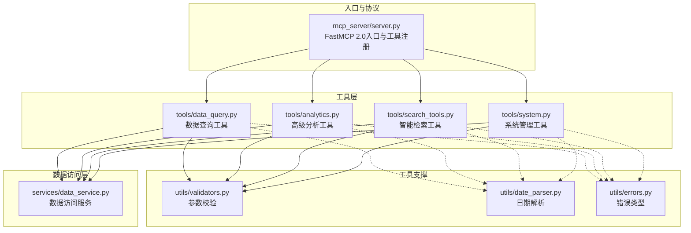
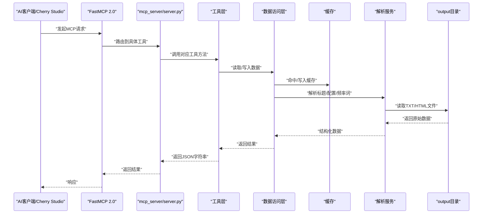
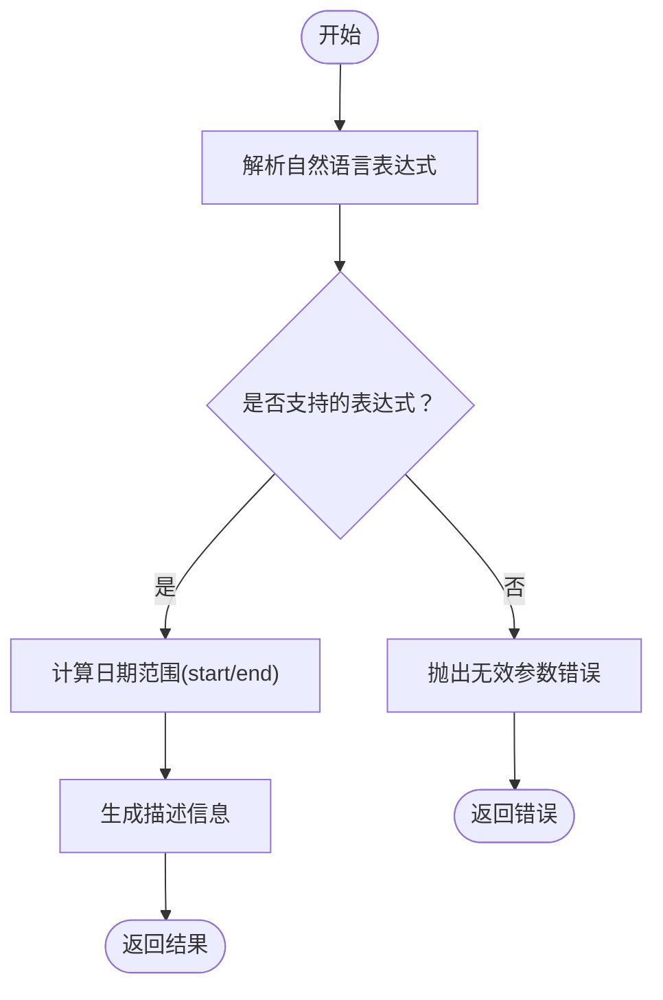
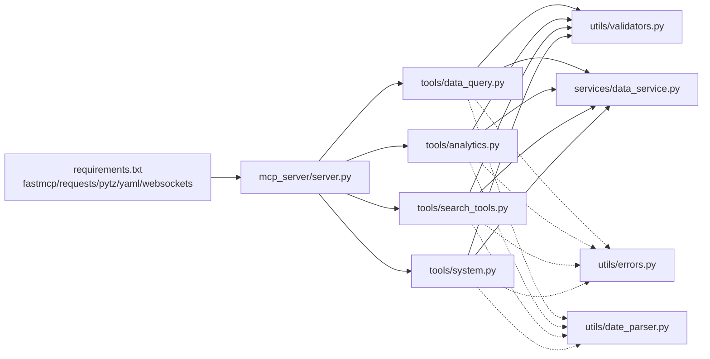

# MCP协议集成

<cite>
**本文引用的文件**
- [mcp_server/server.py](file://mcp_server/server.py)
- [mcp_server/tools/data_query.py](file://mcp_server/tools/data_query.py)
- [mcp_server/tools/analytics.py](file://mcp_server/tools/analytics.py)
- [mcp_server/tools/search_tools.py](file://mcp_server/tools/search_tools.py)
- [mcp_server/tools/system.py](file://mcp_server/tools/system.py)
- [mcp_server/utils/date_parser.py](file://mcp_server/utils/date_parser.py)
- [mcp_server/utils/validators.py](file://mcp_server/utils/validators.py)
- [mcp_server/services/data_service.py](file://mcp_server/services/data_service.py)
- [mcp_server/utils/errors.py](file://mcp_server/utils/errors.py)
- [docs/MCP-API-Reference.md](file://docs/MCP-API-Reference.md)
- [README-Cherry-Studio.md](file://README-Cherry-Studio.md)
- [requirements.txt](file://requirements.txt)
- [start-http.sh](file://start-http.sh)
</cite>

## 目录
1. [简介](#简介)
2. [项目结构](#项目结构)
3. [核心组件](#核心组件)
4. [架构总览](#架构总览)
5. [详细组件分析](#详细组件分析)
6. [依赖关系分析](#依赖关系分析)
7. [性能考量](#性能考量)
8. [故障排查指南](#故障排查指南)
9. [结论](#结论)
10. [附录](#附录)

## 简介
本文件面向希望集成TrendRadar MCP服务器的开发者与系统集成者，聚焦FastMCP 2.0协议的工具暴露与传输模式实现。文档详细说明13个核心工具接口（数据查询、高级分析、智能检索、系统管理）的参数、返回值与调用流程，并强调resolve_date_range作为日期解析前置调用的重要性。同时，文档给出MCP over stdio与HTTP两种传输模式的实现要点，包括HTTP端点路径“/mcp”与端口“3333”的配置说明，并提供与Cherry Studio等AI系统的集成示例与错误处理策略。

## 项目结构
TrendRadar MCP服务器采用模块化组织，核心入口位于mcp_server/server.py，工具层按功能拆分为data_query、analytics、search_tools、system四个模块；工具层依赖utils中的日期解析与参数校验，以及services中的数据访问层；文档与部署脚本分别位于docs与根目录。

图表来源
- [mcp_server/server.py](file://mcp_server/server.py#L1-L120)
- [mcp_server/tools/data_query.py](file://mcp_server/tools/data_query.py#L1-L60)
- [mcp_server/tools/analytics.py](file://mcp_server/tools/analytics.py#L1-L60)
- [mcp_server/tools/search_tools.py](file://mcp_server/tools/search_tools.py#L1-L60)
- [mcp_server/tools/system.py](file://mcp_server/tools/system.py#L1-L40)
- [mcp_server/utils/validators.py](file://mcp_server/utils/validators.py#L1-L40)
- [mcp_server/utils/date_parser.py](file://mcp_server/utils/date_parser.py#L1-L40)
- [mcp_server/utils/errors.py](file://mcp_server/utils/errors.py#L1-L40)
- [mcp_server/services/data_service.py](file://mcp_server/services/data_service.py#L1-L40)

章节来源
- [mcp_server/server.py](file://mcp_server/server.py#L1-L120)
- [docs/MCP-API-Reference.md](file://docs/MCP-API-Reference.md#L1-L40)

## 核心组件
- FastMCP 2.0入口与工具注册：在server.py中通过装饰器注册13个工具，统一返回JSON字符串，内部通过单例工具实例复用。
- 工具层：
  - 数据查询：get_latest_news、get_news_by_date、get_trending_topics
  - 高级分析：analyze_topic_trend、analyze_data_insights、analyze_sentiment、find_similar_news、generate_summary_report
  - 智能检索：search_news、search_related_news_history
  - 系统管理：get_current_config、get_system_status、trigger_crawl
- 工具支撑：
  - 参数校验：validators.py提供平台、limit、日期范围、关键词、模式等校验
  - 日期解析：date_parser.py支持中文/英文自然语言日期表达式解析
  - 错误类型：errors.py定义统一错误结构
- 数据访问层：data_service.py封装缓存、解析与数据读取逻辑

章节来源
- [mcp_server/server.py](file://mcp_server/server.py#L1-L120)
- [mcp_server/tools/data_query.py](file://mcp_server/tools/data_query.py#L1-L60)
- [mcp_server/tools/analytics.py](file://mcp_server/tools/analytics.py#L1-L60)
- [mcp_server/tools/search_tools.py](file://mcp_server/tools/search_tools.py#L1-L60)
- [mcp_server/tools/system.py](file://mcp_server/tools/system.py#L1-L40)
- [mcp_server/utils/validators.py](file://mcp_server/utils/validators.py#L1-L40)
- [mcp_server/utils/date_parser.py](file://mcp_server/utils/date_parser.py#L1-L40)
- [mcp_server/utils/errors.py](file://mcp_server/utils/errors.py#L1-L40)
- [mcp_server/services/data_service.py](file://mcp_server/services/data_service.py#L1-L40)

## 架构总览
MCP服务器通过FastMCP 2.0在stdio或HTTP模式下提供工具接口。工具层调用数据访问层，数据访问层结合缓存与解析服务读取output目录中的历史数据；系统管理工具支持临时爬取并可持久化到output目录。

图表来源
- [mcp_server/server.py](file://mcp_server/server.py#L660-L782)
- [mcp_server/tools/data_query.py](file://mcp_server/tools/data_query.py#L1-L60)
- [mcp_server/tools/analytics.py](file://mcp_server/tools/analytics.py#L1-L60)
- [mcp_server/tools/search_tools.py](file://mcp_server/tools/search_tools.py#L1-L60)
- [mcp_server/tools/system.py](file://mcp_server/tools/system.py#L1-L40)
- [mcp_server/services/data_service.py](file://mcp_server/services/data_service.py#L1-L40)

## 详细组件分析

### resolve_date_range（日期解析前置调用）
- 作用：将自然语言日期表达式解析为标准日期范围，确保AI模型与服务器端日期一致性。
- 支持表达式：今天/昨天、本周/上周、本月/上月、最近N天、last N days等。
- 调用建议：在涉及“本周/最近7天/最近30天”等自然语言日期的分析/检索前，先调用resolve_date_range，再将返回的date_range传入对应工具。
- 返回：包含start/end的标准日期范围与描述信息；失败时返回统一错误结构。

图表来源
- [mcp_server/server.py](file://mcp_server/server.py#L40-L110)
- [mcp_server/utils/date_parser.py](file://mcp_server/utils/date_parser.py#L330-L424)

章节来源
- [mcp_server/server.py](file://mcp_server/server.py#L40-L110)
- [mcp_server/utils/date_parser.py](file://mcp_server/utils/date_parser.py#L330-L424)

### 数据查询工具

#### get_latest_news
- 功能：获取最新一批爬取的新闻，支持平台过滤、数量限制与URL包含。
- 参数要点：platforms（平台ID列表，None表示使用配置中的全部平台）、limit（默认50，最大1000）、include_url（默认False）。
- 返回：包含news列表、total、platforms与success标记；失败时返回统一错误结构。
- 展示建议：工具返回完整列表，建议按用户需求决定是否总结。

章节来源
- [mcp_server/server.py](file://mcp_server/server.py#L111-L170)
- [mcp_server/tools/data_query.py](file://mcp_server/tools/data_query.py#L34-L90)
- [mcp_server/services/data_service.py](file://mcp_server/services/data_service.py#L30-L103)

#### get_news_by_date
- 功能：按指定日期查询新闻，支持自然语言日期（如“今天/昨天/3天前”）。
- 参数要点：date_query（默认“今天”）、platforms、limit（默认50，最大1000）、include_url。
- 返回：包含news列表、total、date_query、date与platforms；失败时返回统一错误结构。
- 展示建议：同上，建议按用户需求决定是否总结。

章节来源
- [mcp_server/server.py](file://mcp_server/server.py#L176-L222)
- [mcp_server/tools/data_query.py](file://mcp_server/tools/data_query.py#L211-L285)
- [mcp_server/utils/validators.py](file://mcp_server/utils/validators.py#L309-L352)

#### get_trending_topics
- 功能：基于个人关注词列表（config/frequency_words.txt）统计出现频率。
- 参数要点：top_n（默认10，最大100）、mode（daily/current/incremental）。
- 返回：topics列表、total_keywords、mode与生成时间；失败时返回统一错误结构。

章节来源
- [mcp_server/server.py](file://mcp_server/server.py#L151-L175)
- [mcp_server/tools/data_query.py](file://mcp_server/tools/data_query.py#L154-L210)
- [mcp_server/services/data_service.py](file://mcp_server/services/data_service.py#L285-L402)

### 高级分析工具

#### analyze_topic_trend
- 功能：统一话题趋势分析，支持trend/lifecycle/viral/predict四种模式。
- 参数要点：topic（必需）、analysis_type（默认trend）、date_range（可选，需由resolve_date_range提供）、granularity（默认day）、threshold/time_window/lookahead_hours/confidence_threshold等。
- 返回：包含topic、date_range、trend_data、statistics与trend_direction等；失败时返回统一错误结构。
- 调用建议：优先resolve_date_range，再调用本工具。

章节来源
- [mcp_server/server.py](file://mcp_server/server.py#L225-L289)
- [mcp_server/tools/analytics.py](file://mcp_server/tools/analytics.py#L156-L243)
- [mcp_server/tools/analytics.py](file://mcp_server/tools/analytics.py#L244-L401)

#### analyze_data_insights
- 功能：统一数据洞察分析，支持platform_compare/platform_activity/keyword_cooccur三种模式。
- 参数要点：insight_type（必需）、topic（platform_compare适用）、date_range（可选）、min_frequency/top_n。
- 返回：按模式返回平台对比/活跃度/关键词共现等统计结果；失败时返回统一错误结构。

章节来源
- [mcp_server/server.py](file://mcp_server/server.py#L291-L332)
- [mcp_server/tools/analytics.py](file://mcp_server/tools/analytics.py#L89-L155)

#### analyze_sentiment
- 功能：情感倾向分析，生成AI提示词与新闻样本。
- 参数要点：topic（可选）、platforms、date_range（默认今天）、limit（默认50，最大100）、sort_by_weight（默认True）、include_url。
- 返回：包含ai_prompt、news_sample与summary统计；失败时返回统一错误结构。
- 展示建议：默认展示完整分析结果，仅在用户明确要求总结时筛选。

章节来源
- [mcp_server/server.py](file://mcp_server/server.py#L334-L396)
- [mcp_server/tools/analytics.py](file://mcp_server/tools/analytics.py#L631-L800)

#### find_similar_news
- 功能：基于标题相似度查找相关新闻。
- 参数要点：reference_title（必需）、threshold（默认0.6）、limit（默认50）、include_url。
- 返回：相似新闻列表与相似度分数；失败时返回统一错误结构。
- 展示建议：默认展示全部结果，仅在用户明确要求总结时筛选。

章节来源
- [mcp_server/server.py](file://mcp_server/server.py#L398-L432)
- [mcp_server/tools/analytics.py](file://mcp_server/tools/analytics.py#L1-L80)

#### generate_summary_report
- 功能：每日/每周摘要报告生成。
- 参数要点：report_type（默认daily）、date_range（可选）。
- 返回：包含Markdown格式报告与统计数据；失败时返回统一错误结构。

章节来源
- [mcp_server/server.py](file://mcp_server/server.py#L434-L458)
- [mcp_server/tools/analytics.py](file://mcp_server/tools/analytics.py#L1-L80)

### 智能检索工具

#### search_news
- 功能：统一新闻搜索，支持keyword/fuzzy/entity三种模式。
- 参数要点：query（必需）、search_mode（默认keyword）、date_range（默认今天）、platforms、limit（默认50，最大1000）、sort_by（默认relevance）、threshold（fuzzy模式，0-1，默认0.6）、include_url。
- 返回：包含results、summary与统计信息；失败时返回统一错误结构。
- 调用建议：涉及自然语言日期时，先resolve_date_range再调用。

章节来源
- [mcp_server/server.py](file://mcp_server/server.py#L460-L539)
- [mcp_server/tools/search_tools.py](file://mcp_server/tools/search_tools.py#L38-L241)
- [mcp_server/utils/validators.py](file://mcp_server/utils/validators.py#L145-L211)

#### search_related_news_history
- 功能：基于种子新闻在历史数据中检索相关新闻。
- 参数要点：reference_text（必需）、time_preset（默认yesterday）、start_date/end_date（custom时必填）、threshold（默认0.4）、limit（默认50）、include_url。
- 返回：包含results、statistics与note；失败时返回统一错误结构。

章节来源
- [mcp_server/server.py](file://mcp_server/server.py#L541-L583)
- [mcp_server/tools/search_tools.py](file://mcp_server/tools/search_tools.py#L494-L702)

### 系统管理工具

#### get_current_config
- 功能：获取当前系统配置（all/crawler/push/keywords/weights）。
- 参数要点：section（默认all）。
- 返回：按节返回配置详情；失败时返回统一错误结构。

章节来源
- [mcp_server/server.py](file://mcp_server/server.py#L586-L608)
- [mcp_server/tools/system.py](file://mcp_server/tools/system.py#L1-L40)
- [mcp_server/services/data_service.py](file://mcp_server/services/data_service.py#L411-L497)

#### get_system_status
- 功能：获取系统运行状态与健康检查信息。
- 返回：包含system、data、cache与health；失败时返回统一错误结构。

章节来源
- [mcp_server/server.py](file://mcp_server/server.py#L610-L623)
- [mcp_server/tools/system.py](file://mcp_server/tools/system.py#L33-L67)
- [mcp_server/services/data_service.py](file://mcp_server/services/data_service.py#L498-L605)

#### trigger_crawl
- 功能：手动触发临时爬取任务，可选持久化到output目录。
- 参数要点：platforms（默认全部）、save_to_local（默认False）、include_url。
- 返回：包含task_id、crawl_time、platforms、total_news、failed_platforms、data与saved_files（若保存）；失败时返回统一错误结构。
- 注意：失败平台会列在failed_platforms中。

章节来源
- [mcp_server/server.py](file://mcp_server/server.py#L625-L658)
- [mcp_server/tools/system.py](file://mcp_server/tools/system.py#L68-L376)
- [mcp_server/services/data_service.py](file://mcp_server/services/data_service.py#L1-L40)

## 依赖关系分析
- 外部依赖：FastMCP 2.0、requests、pytz、PyYAML、websockets。
- 工具层依赖validators与date_parser进行参数与日期校验；依赖data_service进行数据读取与缓存；系统管理工具依赖配置文件与output目录。
- 错误处理：统一继承MCPError，返回包含code/message/suggestion的结构。

图表来源
- [requirements.txt](file://requirements.txt#L1-L6)
- [mcp_server/server.py](file://mcp_server/server.py#L1-L40)
- [mcp_server/tools/data_query.py](file://mcp_server/tools/data_query.py#L1-L40)
- [mcp_server/tools/analytics.py](file://mcp_server/tools/analytics.py#L1-L40)
- [mcp_server/tools/search_tools.py](file://mcp_server/tools/search_tools.py#L1-L40)
- [mcp_server/tools/system.py](file://mcp_server/tools/system.py#L1-L40)
- [mcp_server/utils/validators.py](file://mcp_server/utils/validators.py#L1-L40)
- [mcp_server/utils/date_parser.py](file://mcp_server/utils/date_parser.py#L1-L40)
- [mcp_server/utils/errors.py](file://mcp_server/utils/errors.py#L1-L40)
- [mcp_server/services/data_service.py](file://mcp_server/services/data_service.py#L1-L40)

章节来源
- [requirements.txt](file://requirements.txt#L1-L6)
- [mcp_server/server.py](file://mcp_server/server.py#L1-L40)

## 性能考量
- 缓存策略：数据访问层对常用查询（最新新闻、按日期新闻、趋势话题、配置）进行缓存，减少IO与解析成本。
- 分页与限制：多数工具提供limit参数与最大限制，避免一次性返回大量数据。
- 排序与权重：分析工具支持按权重排序，提升用户感知效率。
- 搜索模式：fuzzy模式会过滤低相似度结果，提高返回质量与性能。

章节来源
- [mcp_server/services/data_service.py](file://mcp_server/services/data_service.py#L30-L103)
- [mcp_server/tools/search_tools.py](file://mcp_server/tools/search_tools.py#L186-L241)
- [mcp_server/tools/analytics.py](file://mcp_server/tools/analytics.py#L1-L80)

## 故障排查指南
- 常见错误码：INVALID_PARAMETER、DATA_NOT_FOUND、CRAWL_TASK_ERROR、INTERNAL_ERROR、NO_DATA_AVAILABLE。
- 参数校验失败：检查platforms、limit、date_range、keyword等参数类型与范围。
- 日期范围问题：确认使用resolve_date_range获取date_range，且start<=end且不为未来日期。
- 数据缺失：确认output目录存在且包含目标日期文件；必要时先trigger_crawl生成数据。
- 爬取失败：查看failed_platforms列表与错误提示，检查网络与代理配置。

章节来源
- [mcp_server/utils/errors.py](file://mcp_server/utils/errors.py#L1-L94)
- [mcp_server/utils/validators.py](file://mcp_server/utils/validators.py#L145-L211)
- [mcp_server/tools/system.py](file://mcp_server/tools/system.py#L68-L130)
- [docs/MCP-API-Reference.md](file://docs/MCP-API-Reference.md#L384-L408)

## 结论
TrendRadar MCP服务器通过FastMCP 2.0提供了完善的新闻数据查询、分析与检索能力，配合resolve_date_range的日期解析前置调用，确保AI模型与服务器端日期一致性。工具层与数据访问层解耦清晰，支持缓存与限流，满足生产环境的稳定性与性能需求。HTTP与stdio两种传输模式可按场景灵活选择，Cherry Studio等客户端可无缝对接。

## 附录

### 传输模式与端点配置
- MCP over stdio：默认开发/调试模式，适合本地联调与Cherry Studio桌面端。
- MCP over HTTP：生产推荐模式，端点路径“/mcp”，默认端口“3333”，可通过命令行参数host/port调整。
- 启动脚本：start-http.sh提供一键启动HTTP模式的示例。

章节来源
- [mcp_server/server.py](file://mcp_server/server.py#L660-L782)
- [start-http.sh](file://start-http.sh#L1-L22)

### 与Cherry Studio集成示例
- 安装与部署：参考README-Cherry-Studio.md，使用setup脚本或手动安装后在Cherry Studio中添加MCP服务器配置。
- HTTP模式配置：在Cherry Studio中配置streamableHttp类型，URL为http://localhost:3333/mcp。
- 常见交互：输入“最近7天的AI新闻”等自然语言指令，AI会自动调用resolve_date_range与search_news等工具链路。

章节来源
- [README-Cherry-Studio.md](file://README-Cherry-Studio.md#L1-L155)