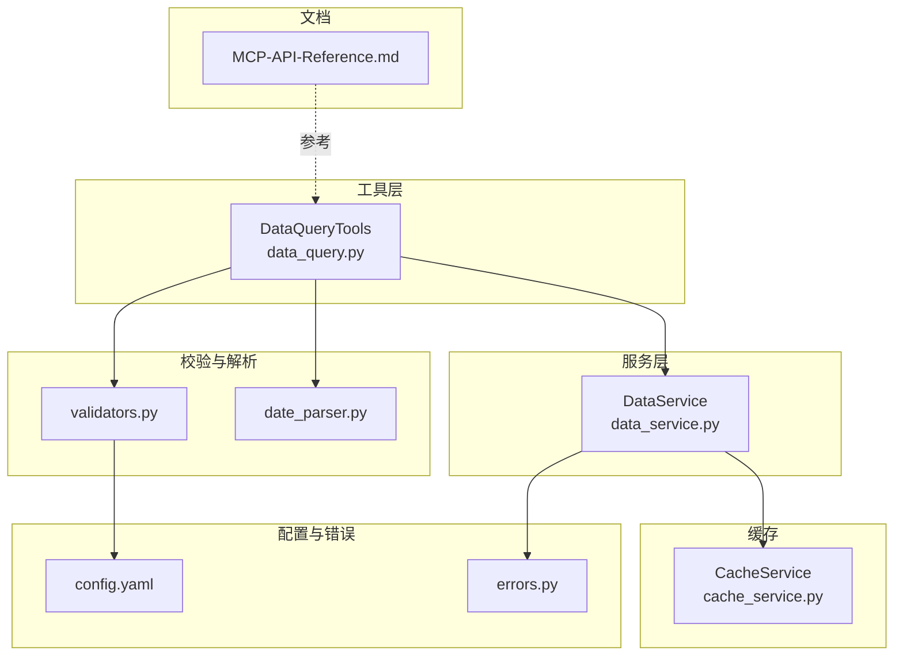
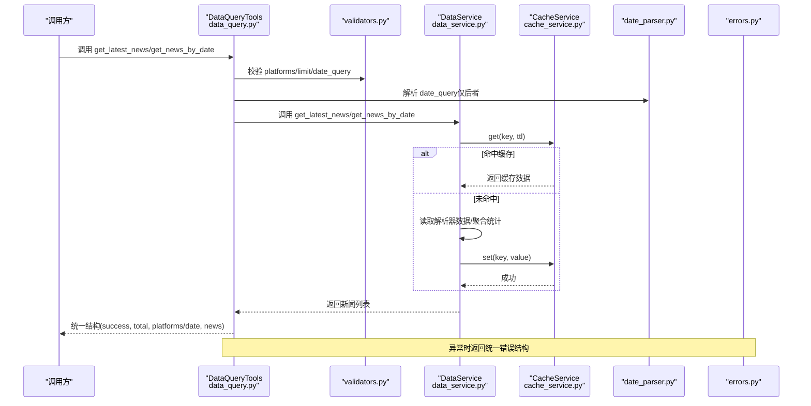
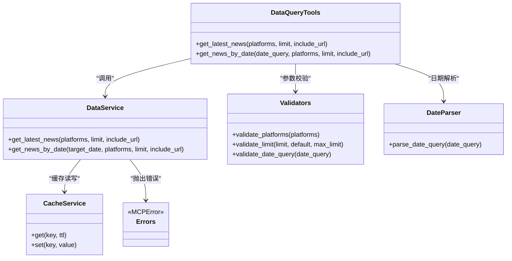

# 数据查询工具

<cite>
**本文引用的文件**
- [data_query.py](file://mcp_server/tools/data_query.py)
- [data_service.py](file://mcp_server/services/data_service.py)
- [cache_service.py](file://mcp_server/services/cache_service.py)
- [validators.py](file://mcp_server/utils/validators.py)
- [date_parser.py](file://mcp_server/utils/date_parser.py)
- [errors.py](file://mcp_server/utils/errors.py)
- [config.yaml](file://config/config.yaml)
- [MCP-API-Reference.md](file://docs/MCP-API-Reference.md)
</cite>

## 目录
1. [简介](#简介)
2. [项目结构](#项目结构)
3. [核心组件](#核心组件)
4. [架构总览](#架构总览)
5. [详细组件分析](#详细组件分析)
6. [依赖关系分析](#依赖关系分析)
7. [性能考量](#性能考量)
8. [故障排查指南](#故障排查指南)
9. [结论](#结论)
10. [附录](#附录)

## 简介
本文件聚焦 TrendRadar MCP 服务器的数据查询工具，重点说明两个核心接口：
- get_latest_news：获取最新一批爬取的新闻数据
- get_news_by_date：按日期查询新闻，支持自然语言日期

内容涵盖参数定义、返回数据结构、调用场景、与 data_service.py 的交互流程、分页机制与性能优化策略，并提供错误处理方式与实际调用示例路径。

## 项目结构
围绕数据查询工具的相关模块组织如下：
- 工具层：mcp_server/tools/data_query.py
- 服务层：mcp_server/services/data_service.py
- 缓存服务：mcp_server/services/cache_service.py
- 参数校验与日期解析：mcp_server/utils/validators.py、mcp_server/utils/date_parser.py
- 错误类型：mcp_server/utils/errors.py
- 平台配置：config/config.yaml
- API参考文档：docs/MCP-API-Reference.md

图表来源
- [data_query.py](file://mcp_server/tools/data_query.py#L1-L285)
- [data_service.py](file://mcp_server/services/data_service.py#L1-L605)
- [cache_service.py](file://mcp_server/services/cache_service.py#L1-L137)
- [validators.py](file://mcp_server/utils/validators.py#L1-L352)
- [date_parser.py](file://mcp_server/utils/date_parser.py#L1-L508)
- [errors.py](file://mcp_server/utils/errors.py#L1-L94)
- [config.yaml](file://config/config.yaml#L1-L140)
- [MCP-API-Reference.md](file://docs/MCP-API-Reference.md#L1-L475)

章节来源
- [data_query.py](file://mcp_server/tools/data_query.py#L1-L285)
- [data_service.py](file://mcp_server/services/data_service.py#L1-L605)
- [cache_service.py](file://mcp_server/services/cache_service.py#L1-L137)
- [validators.py](file://mcp_server/utils/validators.py#L1-L352)
- [date_parser.py](file://mcp_server/utils/date_parser.py#L1-L508)
- [errors.py](file://mcp_server/utils/errors.py#L1-L94)
- [config.yaml](file://config/config.yaml#L1-L140)
- [MCP-API-Reference.md](file://docs/MCP-API-Reference.md#L1-L475)

## 核心组件
- DataQueryTools：对外暴露 get_latest_news 与 get_news_by_date 等工具方法，负责参数校验、调用 DataService 并组装统一返回结构。
- DataService：封装数据访问逻辑，从缓存或解析器读取数据，按平台、日期、限制等条件返回新闻列表。
- CacheService：提供内存级 TTL 缓存，提升热点查询性能。
- validators：参数校验（平台、limit、日期范围、关键词、模式等）。
- date_parser：自然语言日期解析与范围计算。
- errors：统一错误类型，便于工具层捕获并返回标准错误结构。
- config.yaml：平台列表等配置来源，影响平台校验与默认行为。

章节来源
- [data_query.py](file://mcp_server/tools/data_query.py#L22-L285)
- [data_service.py](file://mcp_server/services/data_service.py#L17-L401)
- [cache_service.py](file://mcp_server/services/cache_service.py#L1-L137)
- [validators.py](file://mcp_server/utils/validators.py#L43-L121)
- [date_parser.py](file://mcp_server/utils/date_parser.py#L92-L248)
- [errors.py](file://mcp_server/utils/errors.py#L10-L94)
- [config.yaml](file://config/config.yaml#L116-L140)

## 架构总览
工具层通过参数校验与日期解析后，调用服务层；服务层优先从缓存获取，若未命中则解析数据源并写回缓存；最终统一返回结构包含 success、数据主体与元信息。

图表来源
- [data_query.py](file://mcp_server/tools/data_query.py#L34-L283)
- [data_service.py](file://mcp_server/services/data_service.py#L30-L182)
- [cache_service.py](file://mcp_server/services/cache_service.py#L21-L54)
- [validators.py](file://mcp_server/utils/validators.py#L90-L121)
- [date_parser.py](file://mcp_server/utils/date_parser.py#L92-L121)
- [errors.py](file://mcp_server/utils/errors.py#L10-L94)

## 详细组件分析

### get_latest_news 接口
- 作用：获取最新一批爬取的新闻数据，按平台过滤与条数限制返回。
- 参数
  - platforms: 平台ID列表，如 ["zhihu","weibo"]。默认使用配置文件中的平台列表。
  - limit: 返回条数限制，默认50，最大1000（参见参数校验）。
  - include_url: 是否包含URL链接，默认False（节省token）。
- 返回结构
  - success: 布尔值，请求是否成功
  - news: 新闻数组，元素包含字段：title、platform、platform_name、rank、timestamp（最新一批时间）
  - total: 返回条数
  - platforms: 实际使用的平台列表
- 调用链路
  - 参数校验：validate_platforms、validate_limit
  - 调用 DataService.get_latest_news
  - 返回统一结构（包含 success、news、total、platforms）
- 性能与缓存
  - 缓存键包含 platforms、limit、include_url，TTL 15分钟
  - 结果按 rank 排序，再截取 limit
- 错误处理
  - 捕获 MCPError 并返回统一错误结构
  - 其他异常返回 INTERNAL_ERROR

章节来源
- [data_query.py](file://mcp_server/tools/data_query.py#L34-L89)
- [data_service.py](file://mcp_server/services/data_service.py#L30-L102)
- [validators.py](file://mcp_server/utils/validators.py#L90-L121)
- [cache_service.py](file://mcp_server/services/cache_service.py#L21-L54)
- [errors.py](file://mcp_server/utils/errors.py#L10-L28)

### get_news_by_date 接口
- 作用：按日期查询新闻，支持自然语言日期（如“今天”、“昨天”、“3天前”、“上周一”、“2025-10-10”等）。
- 参数
  - date_query: 日期查询字符串，默认“今天”，支持相对/绝对/星期等多种格式。
  - platforms: 平台ID列表，默认使用配置文件中的平台列表。
  - limit: 返回条数限制，默认50，最大1000（参见参数校验）。
  - include_url: 是否包含URL链接，默认False（节省token）。
- 返回结构
  - success: 布尔值
  - news: 新闻数组，元素包含字段：title、platform、platform_name、rank、avg_rank、count、date
  - total: 返回条数
  - date: 实际目标日期（YYYY-MM-DD）
  - date_query: 原始查询字符串
  - platforms: 实际使用的平台列表
- 调用链路
  - 参数校验：validate_date_query（默认“今天”）、validate_platforms、validate_limit
  - 调用 DataService.get_news_by_date
  - 返回统一结构（包含 success、news、total、date、date_query、platforms）
- 性能与缓存
  - 缓存键包含 date、platforms、limit、include_url，TTL 30分钟
  - 历史数据缓存时间更长，提升复用率
- 错误处理
  - 捕获 MCPError 并返回统一错误结构
  - 其他异常返回 INTERNAL_ERROR

章节来源
- [data_query.py](file://mcp_server/tools/data_query.py#L211-L283)
- [data_service.py](file://mcp_server/services/data_service.py#L104-L182)
- [validators.py](file://mcp_server/utils/validators.py#L90-L121)
- [date_parser.py](file://mcp_server/utils/date_parser.py#L92-L121)
- [cache_service.py](file://mcp_server/services/cache_service.py#L21-L54)
- [errors.py](file://mcp_server/utils/errors.py#L10-L28)

### 与 data_service.py 的交互
- get_latest_news
  - 从解析器读取当天最新一批标题数据，按平台聚合，计算时间戳为最新文件时间，按 rank 排序并截取 limit。
  - 缓存键：latest_news:<platforms>:<limit>:<include_url>，TTL 15分钟。
- get_news_by_date
  - 从解析器读取指定日期的标题数据，计算平均排名与出现次数，按 rank 排序并截取 limit。
  - 缓存键：news_by_date:<date>:<platforms>:<limit>:<include_url>，TTL 30分钟。
- 错误抛出
  - 当未找到数据时抛出 DataNotFoundError，由工具层捕获并返回统一错误结构。

章节来源
- [data_service.py](file://mcp_server/services/data_service.py#L30-L182)
- [errors.py](file://mcp_server/utils/errors.py#L30-L40)

### 参数定义与默认值
- platforms
  - 类型：可选列表
  - 默认：从 config.yaml 的 platforms 配置读取（动态加载）
  - 校验：validate_platforms，支持降级（配置加载失败时允许所有平台）
- limit
  - 类型：整数
  - 默认：get_latest_news=50；get_news_by_date=50
  - 最大：1000（参数校验）
- include_url
  - 类型：布尔
  - 默认：False
  - 影响：是否在返回项中包含 url、mobileUrl 字段
- date_query
  - 类型：字符串
  - 默认：今天
  - 支持：相对日期（今天/昨天/前天/N天前）、英文 today/yesterday、星期（上周一/本周三/last monday/this friday）、绝对日期（YYYY-MM-DD、MM月DD日、YYYY年MM月DD日）

章节来源
- [data_query.py](file://mcp_server/tools/data_query.py#L34-L89)
- [data_query.py](file://mcp_server/tools/data_query.py#L211-L283)
- [validators.py](file://mcp_server/utils/validators.py#L43-L88)
- [validators.py](file://mcp_server/utils/validators.py#L90-L121)
- [validators.py](file://mcp_server/utils/validators.py#L309-L351)
- [date_parser.py](file://mcp_server/utils/date_parser.py#L92-L248)
- [config.yaml](file://config/config.yaml#L116-L140)

### 返回数据结构
- 通用字段
  - success: 布尔值
  - total: 返回条数
  - platforms: 实际平台列表
- get_latest_news 特有
  - news: 数组，元素包含 title、platform、platform_name、rank、timestamp
  - include_url=true 时额外包含 url、mobileUrl
- get_news_by_date 特有
  - date: 目标日期（YYYY-MM-DD）
  - date_query: 原始查询字符串
  - news: 数组，元素包含 title、platform、platform_name、rank、avg_rank、count、date
  - include_url=true 时额外包含 url、mobileUrl

章节来源
- [data_query.py](file://mcp_server/tools/data_query.py#L69-L89)
- [data_query.py](file://mcp_server/tools/data_query.py#L262-L283)
- [data_service.py](file://mcp_server/services/data_service.py#L70-L102)
- [data_service.py](file://mcp_server/services/data_service.py#L134-L182)

### 分页机制与性能优化
- 分页
  - 两条接口均通过 limit 控制返回条数，未实现服务端分页游标或页码参数。
  - 建议：对历史数据查询（如按关键词搜索）可通过 date_range 分批处理，避免一次性拉取过多。
- 缓存策略
  - 最新新闻：TTL 15分钟；历史新闻：TTL 30分钟；系统配置：TTL 1小时（如配置查询）。
  - 缓存键包含关键参数（platforms、limit、include_url、date），减少重复计算。
- 性能优化建议
  - 合理设置 limit，避免超大返回量
  - 优先使用 include_url=false 以减少字段体积
  - 使用自然语言日期时尽量明确范围，减少解析歧义
  - 对高频查询开启缓存复用

章节来源
- [data_service.py](file://mcp_server/services/data_service.py#L50-L102)
- [data_service.py](file://mcp_server/services/data_service.py#L134-L182)
- [cache_service.py](file://mcp_server/services/cache_service.py#L21-L54)
- [MCP-API-Reference.md](file://docs/MCP-API-Reference.md#L459-L475)

### 错误处理
- 统一错误结构
  - success=false
  - error: { code, message, suggestion? }
- 常见错误码
  - INVALID_PARAMETER：参数无效（如 limit<=0、日期范围错误、平台不受支持）
  - DATA_NOT_FOUND：数据不存在（如未找到包含关键词的新闻）
  - INTERNAL_ERROR：内部异常
- 触发场景
  - 参数校验失败：抛出 InvalidParameterError
  - 数据不存在：抛出 DataNotFoundError
  - 其他异常：捕获并返回 INTERNAL_ERROR

章节来源
- [errors.py](file://mcp_server/utils/errors.py#L10-L94)
- [validators.py](file://mcp_server/utils/validators.py#L90-L121)
- [data_service.py](file://mcp_server/services/data_service.py#L184-L205)
- [MCP-API-Reference.md](file://docs/MCP-API-Reference.md#L384-L408)

### 实际调用示例（路径）
- 获取最新热点榜单
  - 参考：[get_latest_news 示例](file://docs/MCP-API-Reference.md#L28-L46)
  - 参数要点：platforms（可选）、limit（默认50）、include_url（可选）
- 获取指定日期的历史新闻
  - 参考：[get_news_by_date 示例](file://docs/MCP-API-Reference.md#L60-L67)
  - 参数要点：date_query（默认“今天”）、platforms（可选）、limit（默认50）、include_url（可选）
- 自然语言日期解析
  - 参考：[date_parser 支持格式](file://mcp_server/utils/date_parser.py#L92-L248)
  - 示例：今天、昨天、前天、3天前、yesterday、3 days ago、上周一、本周三、last monday、this friday、2025-10-10、10月10日、2025年10月10日

章节来源
- [MCP-API-Reference.md](file://docs/MCP-API-Reference.md#L18-L67)
- [date_parser.py](file://mcp_server/utils/date_parser.py#L92-L248)

## 依赖关系分析

图表来源
- [data_query.py](file://mcp_server/tools/data_query.py#L34-L283)
- [data_service.py](file://mcp_server/services/data_service.py#L30-L182)
- [cache_service.py](file://mcp_server/services/cache_service.py#L21-L54)
- [validators.py](file://mcp_server/utils/validators.py#L43-L121)
- [date_parser.py](file://mcp_server/utils/date_parser.py#L92-L121)
- [errors.py](file://mcp_server/utils/errors.py#L10-L94)

## 性能考量
- 缓存命中率
  - 最新新闻与历史新闻分别设置不同 TTL，提高热点数据复用率
- 排序与截断
  - 服务层按 rank 排序后截取 limit，避免前端二次处理
- 字段选择
  - include_url=false 可显著减少返回体大小，降低网络与解析成本
- 参数上限
  - limit 最大1000，防止超大查询导致资源压力

章节来源
- [data_service.py](file://mcp_server/services/data_service.py#L94-L102)
- [data_service.py](file://mcp_server/services/data_service.py#L173-L182)
- [validators.py](file://mcp_server/utils/validators.py#L90-L121)
- [MCP-API-Reference.md](file://docs/MCP-API-Reference.md#L459-L475)

## 故障排查指南
- 参数错误
  - 检查 platforms 是否在 config.yaml 的 platforms 列表中
  - 检查 limit 是否为正整数且不超过1000
  - 检查 date_query 是否符合支持格式
- 数据不存在
  - 若查询关键词或日期范围内无匹配新闻，将抛出 DATA_NOT_FOUND
  - 建议：缩小日期范围或调整关键词
- 缓存问题
  - 若短期内数据未更新，可能是缓存未过期
  - 可等待 TTL 过期或调整查询参数（如 include_url）以命中不同缓存键
- 平台配置
  - 若 config.yaml 读取失败，平台校验将降级为允许所有平台，建议检查配置文件完整性

章节来源
- [validators.py](file://mcp_server/utils/validators.py#L43-L88)
- [validators.py](file://mcp_server/utils/validators.py#L90-L121)
- [date_parser.py](file://mcp_server/utils/date_parser.py#L92-L121)
- [errors.py](file://mcp_server/utils/errors.py#L30-L40)
- [config.yaml](file://config/config.yaml#L116-L140)

## 结论
- get_latest_news 与 get_news_by_date 提供了简洁稳定的查询能力，配合参数校验与缓存机制，满足日常热点榜单与历史数据查询需求。
- 返回结构统一，便于前端与下游系统消费；错误处理规范，便于定位问题。
- 建议在生产环境中合理设置 limit、谨慎开启 include_url，并结合 date_range 分批查询历史数据，以获得最佳性能与体验。

## 附录
- 平台列表来源：config.yaml 的 platforms 配置
- API参考文档：docs/MCP-API-Reference.md

章节来源
- [config.yaml](file://config/config.yaml#L116-L140)
- [MCP-API-Reference.md](file://docs/MCP-API-Reference.md#L1-L475)