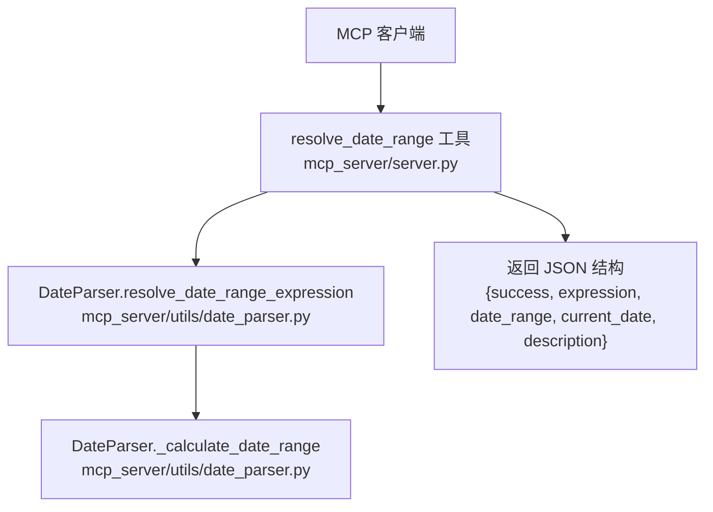
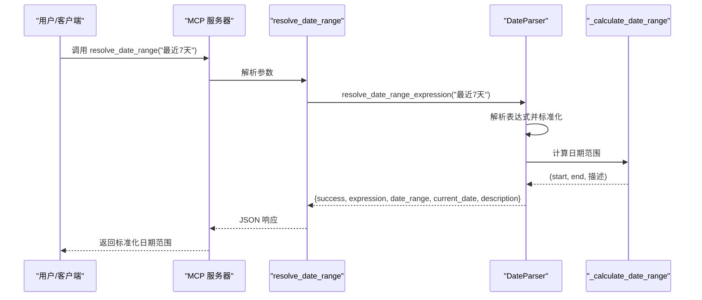
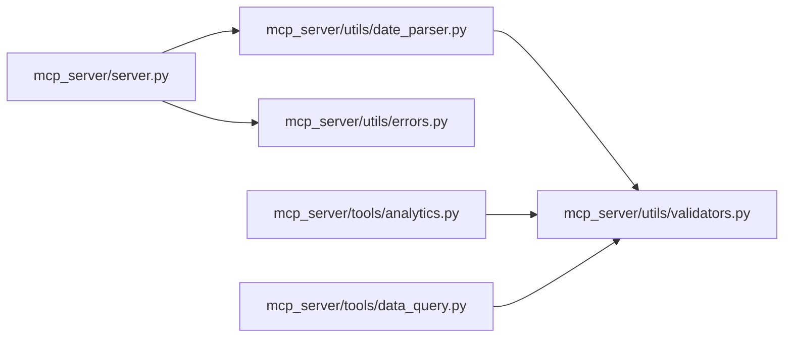

# 日期解析工具

<cite>
**本文引用的文件**
- [mcp_server/server.py](file://mcp_server/server.py)
- [mcp_server/utils/date_parser.py](file://mcp_server/utils/date_parser.py)
- [mcp_server/utils/validators.py](file://mcp_server/utils/validators.py)
- [mcp_server/tools/data_query.py](file://mcp_server/tools/data_query.py)
- [mcp_server/tools/analytics.py](file://mcp_server/tools/analytics.py)
- [docs/MCP-API-Reference.md](file://docs/MCP-API-Reference.md)
</cite>

## 目录
1. [简介](#简介)
2. [项目结构](#项目结构)
3. [核心组件](#核心组件)
4. [架构总览](#架构总览)
5. [详细组件分析](#详细组件分析)
6. [依赖关系分析](#依赖关系分析)
7. [性能考量](#性能考量)
8. [故障排查指南](#故障排查指南)
9. [结论](#结论)
10. [附录](#附录)

## 简介
本文件聚焦 TrendRadar MCP 服务器中的日期解析工具 resolve_date_range，系统性阐述其如何将自然语言日期表达式（如“昨天”、“最近7天”、“本月”）解析为标准 ISO 格式的日期范围，并说明其在 MCP 工具链中的前置作用。文档覆盖：
- 解析流程与正则匹配规则
- 时区与边界情况处理思路
- 与其他时间敏感工具的集成方式
- 常见表达式示例与错误输入处理策略

## 项目结构
resolve_date_range 是 MCP 服务器的一个工具函数，位于 mcp_server/server.py 中，负责将自然语言日期表达式标准化为 {"start": "YYYY-MM-DD", "end": "YYYY-MM-DD"} 的日期范围，供其他分析工具复用。

图表来源
- [mcp_server/server.py](file://mcp_server/server.py#L40-L110)
- [mcp_server/utils/date_parser.py](file://mcp_server/utils/date_parser.py#L330-L491)

章节来源
- [mcp_server/server.py](file://mcp_server/server.py#L40-L110)

## 核心组件
- resolve_date_range：MCP 工具入口，接收自然语言表达式，调用 DateParser 解析并返回标准化日期范围。
- DateParser.resolve_date_range_expression：将自然语言表达式映射为标准化类型（如 this_week、last_7_days），并计算起止日期。
- DateParser._calculate_date_range：根据标准化类型计算具体日期范围，处理周、月、最近N天等场景。
- validate_date_range：参数验证器，确保日期范围合法（格式、先后顺序、不可在未来、不可过久远）。

章节来源
- [mcp_server/server.py](file://mcp_server/server.py#L40-L110)
- [mcp_server/utils/date_parser.py](file://mcp_server/utils/date_parser.py#L330-L491)
- [mcp_server/utils/validators.py](file://mcp_server/utils/validators.py#L145-L210)

## 架构总览
resolve_date_range 在 MCP 工具链中的职责是“统一时间参数”，确保所有分析工具使用一致的时间窗口，避免 AI 模型自行计算导致的不一致。

图表来源
- [mcp_server/server.py](file://mcp_server/server.py#L40-L110)
- [mcp_server/utils/date_parser.py](file://mcp_server/utils/date_parser.py#L330-L491)

## 详细组件分析

### resolve_date_range 工具
- 输入：自然语言日期表达式（如“本周”、“最近7天”、“last week”等）
- 输出：JSON 字符串，包含 success、expression、date_range、current_date、description
- 用途：为其他工具（如 analyze_topic_trend、search_news、analyze_sentiment）提供标准化日期范围
- 错误处理：捕获 MCPError 并返回统一错误结构；其他异常返回 INTERNAL_ERROR

章节来源
- [mcp_server/server.py](file://mcp_server/server.py#L40-L110)

### DateParser.resolve_date_range_expression
- 支持的表达式类型
  - 单日：今天、昨天、today、yesterday
  - 周：本周、上周、this week、last week
  - 月：本月、上月、this month、last month
  - 最近N天：最近7天、最近30天、last 7 days、last 30 days
  - 动态N天：最近N天、last N days
- 解析流程
  1) 标准化表达式（大小写、空白处理）
  2) 若命中预定义映射，直接使用标准化类型
  3) 若为“最近N天/last N days”模式，动态生成 normalized（如 last_7_days）
  4) 调用 _calculate_date_range 计算起止日期
  5) 返回包含当前日期与描述的结构化结果

章节来源
- [mcp_server/utils/date_parser.py](file://mcp_server/utils/date_parser.py#L330-L491)

### DateParser._calculate_date_range
- 单日：today/yesterday 返回当天日期
- 本周：周一到周日，若尚未结束，则结束日期不超过今天
- 上周：上周一到上周日
- 本月：当月1日到今天
- 上月：上月1日到上月最后一天
- 最近N天：从“今天 - N-1 天”到“今天”
- 边界与约束
  - 保证 end 不超过当前日期
  - 保证 start 不早于 end
  - 保证 start/end 符合 ISO 格式

章节来源
- [mcp_server/utils/date_parser.py](file://mcp_server/utils/date_parser.py#L426-L491)

### 与参数验证器的协作
- validate_date_range：确保传入的 date_range 字典包含 start/end，且 start ≤ end，且均不晚于当前日期
- validate_date_query：在 get_news_by_date 等工具中，将自然语言日期解析为 datetime，并进行未来日期与过久远日期的校验

章节来源
- [mcp_server/utils/validators.py](file://mcp_server/utils/validators.py#L145-L210)
- [mcp_server/utils/validators.py](file://mcp_server/utils/validators.py#L309-L352)
- [mcp_server/tools/data_query.py](file://mcp_server/tools/data_query.py#L211-L285)

### 时区与边界情况说明
- 当前实现基于本地时间（datetime.now()）进行日期计算，未显式使用 pytz 进行时区转换
- 边界情况处理
  - 月末/年末：通过 replace(day=1) 计算上月第一天，再减去一天得到上月最后一天
  - 闰年：datetime 构造会自动处理 2 月 29 日
  - 未来日期：通过 validate_date_range 拒绝
  - 过久远日期：通过 validate_date_query 的 max_days_ago 限制

章节来源
- [mcp_server/utils/date_parser.py](file://mcp_server/utils/date_parser.py#L470-L488)
- [mcp_server/utils/validators.py](file://mcp_server/utils/validators.py#L145-L210)
- [mcp_server/utils/validators.py](file://mcp_server/utils/validators.py#L309-L352)

### 常见日期表达式解析示例
- “今天” → {start: 2025-11-26, end: 2025-11-26}
- “昨天” → {start: 2025-11-25, end: 2025-11-25}
- “本周” → {start: 2025-11-17, end: 2025-11-26}（若今天是 2025-11-26）
- “上周” → {start: 2025-11-10, end: 2025-11-16}
- “本月” → {start: 2025-11-01, end: 2025-11-26}
- “上月” → {start: 2025-10-01, end: 2025-10-31}
- “最近7天” → {start: 2025-11-20, end: 2025-11-26}
- “最近30天” → {start: 2025-10-27, end: 2025-11-26}

章节来源
- [mcp_server/utils/date_parser.py](file://mcp_server/utils/date_parser.py#L440-L491)

### 错误输入处理策略
- 空表达式或非字符串：抛出 InvalidParameterError，提示支持的格式
- 无法识别的表达式：返回支持的表达式列表（中文/英文）
- 日期范围非法（start > end）：validate_date_range 抛错
- 未来日期：validate_date_range 抛错并给出可用数据范围提示
- 过久远日期：validate_date_query 抛错

章节来源
- [mcp_server/utils/date_parser.py](file://mcp_server/utils/date_parser.py#L370-L424)
- [mcp_server/utils/validators.py](file://mcp_server/utils/validators.py#L145-L210)
- [mcp_server/utils/validators.py](file://mcp_server/utils/validators.py#L309-L352)

## 依赖关系分析
resolve_date_range 与各模块的依赖关系如下：

图表来源
- [mcp_server/server.py](file://mcp_server/server.py#L40-L110)
- [mcp_server/utils/date_parser.py](file://mcp_server/utils/date_parser.py#L1-L50)
- [mcp_server/utils/validators.py](file://mcp_server/utils/validators.py#L1-L30)
- [mcp_server/tools/analytics.py](file://mcp_server/tools/analytics.py#L1-L30)
- [mcp_server/tools/data_query.py](file://mcp_server/tools/data_query.py#L1-L30)

章节来源
- [mcp_server/server.py](file://mcp_server/server.py#L40-L110)
- [mcp_server/utils/date_parser.py](file://mcp_server/utils/date_parser.py#L1-L50)
- [mcp_server/utils/validators.py](file://mcp_server/utils/validators.py#L1-L30)
- [mcp_server/tools/analytics.py](file://mcp_server/tools/analytics.py#L1-L30)
- [mcp_server/tools/data_query.py](file://mcp_server/tools/data_query.py#L1-L30)

## 性能考量
- 解析复杂度：resolve_date_range_expression 采用线性扫描与少量正则匹配，时间复杂度 O(N)（N 为表达式长度），空间复杂度 O(1)
- 计算复杂度：_calculate_date_range 为常量时间操作，不涉及循环或递归
- 适用性：该工具适合在 MCP 工具链前端调用，避免重复计算，提高整体一致性与性能

## 故障排查指南
- resolve_date_range 返回错误
  - 检查表达式是否在支持列表中（中文/英文）
  - 确认返回的 error.code 与 message，按建议修正
- analyze_topic_trend/search_news/analyze_sentiment 报错
  - 确保先调用 resolve_date_range 获取 date_range
  - 使用 validate_date_range 校验 date_range 格式与范围
- 未来日期或过久远日期
  - 使用 validate_date_query（allow_future=False）或 validate_date_range 进行约束

章节来源
- [mcp_server/server.py](file://mcp_server/server.py#L40-L110)
- [mcp_server/utils/validators.py](file://mcp_server/utils/validators.py#L145-L210)
- [mcp_server/utils/validators.py](file://mcp_server/utils/validators.py#L309-L352)
- [mcp_server/tools/analytics.py](file://mcp_server/tools/analytics.py#L190-L242)
- [mcp_server/tools/data_query.py](file://mcp_server/tools/data_query.py#L118-L153)

## 结论
resolve_date_range 通过标准化自然语言日期表达式，为 TrendRadar MCP 服务器提供了统一、可靠的时间参数来源。它与参数验证器协同工作，确保所有时间敏感工具（如趋势分析、情感分析、新闻检索）获得一致且合法的日期范围，从而提升整体系统的稳定性与可维护性。

## 附录

### API 定义（resolve_date_range）
- 工具名称：resolve_date_range
- 请求参数
  - expression: string，自然语言日期表达式（如“本周”、“最近7天”、“last week”）
- 返回结构
  - success: boolean
  - expression: string（原始表达式）
  - normalized: string（标准化类型）
  - date_range: object
    - start: string（ISO 日期）
    - end: string（ISO 日期）
  - current_date: string（ISO 日期）
  - description: string（人类可读描述）

章节来源
- [mcp_server/server.py](file://mcp_server/server.py#L40-L110)
- [docs/MCP-API-Reference.md](file://docs/MCP-API-Reference.md#L1-L60)