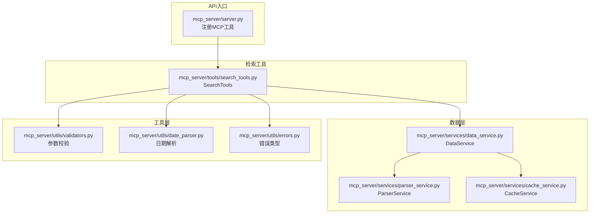
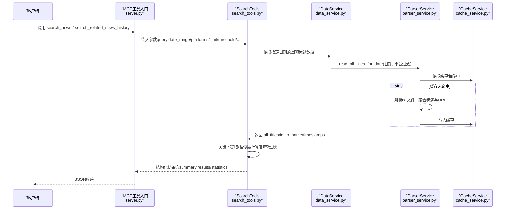
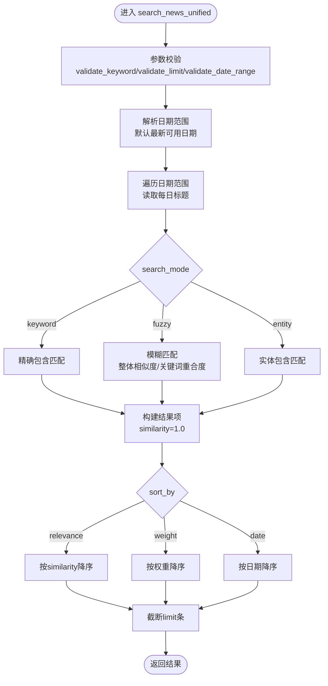
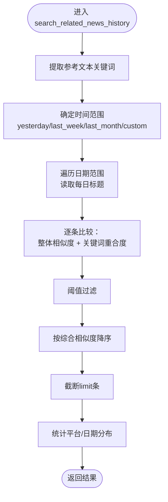
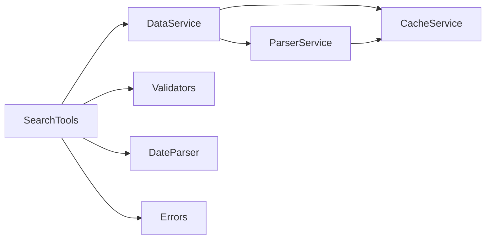

# 智能检索工具

<cite>
**本文引用的文件**
- [mcp_server/server.py](file://mcp_server/server.py)
- [mcp_server/tools/search_tools.py](file://mcp_server/tools/search_tools.py)
- [mcp_server/services/data_service.py](file://mcp_server/services/data_service.py)
- [mcp_server/services/parser_service.py](file://mcp_server/services/parser_service.py)
- [mcp_server/services/cache_service.py](file://mcp_server/services/cache_service.py)
- [mcp_server/utils/date_parser.py](file://mcp_server/utils/date_parser.py)
- [mcp_server/utils/validators.py](file://mcp_server/utils/validators.py)
- [mcp_server/utils/errors.py](file://mcp_server/utils/errors.py)
- [docs/MCP-API-Reference.md](file://docs/MCP-API-Reference.md)
- [config/config.yaml](file://config/config.yaml)
- [config/frequency_words.txt](file://config/frequency_words.txt)
</cite>

## 目录
1. [简介](#简介)
2. [项目结构](#项目结构)
3. [核心组件](#核心组件)
4. [架构总览](#架构总览)
5. [详细组件分析](#详细组件分析)
6. [依赖关系分析](#依赖关系分析)
7. [性能考量](#性能考量)
8. [故障排查指南](#故障排查指南)
9. [结论](#结论)
10. [附录](#附录)

## 简介
本文件面向TrendRadar MCP服务器的智能检索能力，聚焦两大工具：
- search_news：统一新闻搜索，支持关键词精确匹配、模糊匹配与实体搜索，具备日期范围、平台过滤、排序与阈值控制，返回结构化结果（标题、平台、时间、相似度、权重等）。
- search_related_news_history：基于历史数据的关联新闻挖掘，以种子新闻为参考，综合标题相似度与关键词重合度，给出相关性评分与统计分布。

文档将深入解释关键词模糊匹配与相关性排序的实现、全文索引构建机制、搜索权重计算逻辑、结果过滤策略，以及复杂查询表达式的处理方式，并提供实际搜索场景示例与性能表现建议。

## 项目结构
TrendRadar MCP服务器采用模块化设计，智能检索工具位于mcp_server/tools/search_tools.py，数据访问与解析由mcp_server/services/下的数据服务与解析服务提供，参数校验与日期解析由mcp_server/utils/下的工具模块负责，API入口在mcp_server/server.py中注册为MCP工具。

图表来源
- [mcp_server/server.py](file://mcp_server/server.py#L460-L583)
- [mcp_server/tools/search_tools.py](file://mcp_server/tools/search_tools.py#L1-L120)
- [mcp_server/services/data_service.py](file://mcp_server/services/data_service.py#L1-L120)
- [mcp_server/services/parser_service.py](file://mcp_server/services/parser_service.py#L1-L120)
- [mcp_server/services/cache_service.py](file://mcp_server/services/cache_service.py#L1-L80)
- [mcp_server/utils/validators.py](file://mcp_server/utils/validators.py#L1-L120)
- [mcp_server/utils/date_parser.py](file://mcp_server/utils/date_parser.py#L1-L120)
- [mcp_server/utils/errors.py](file://mcp_server/utils/errors.py#L1-L60)

章节来源
- [mcp_server/server.py](file://mcp_server/server.py#L460-L583)
- [mcp_server/tools/search_tools.py](file://mcp_server/tools/search_tools.py#L1-L120)
- [mcp_server/services/data_service.py](file://mcp_server/services/data_service.py#L1-L120)
- [mcp_server/services/parser_service.py](file://mcp_server/services/parser_service.py#L1-L120)
- [mcp_server/services/cache_service.py](file://mcp_server/services/cache_service.py#L1-L80)
- [mcp_server/utils/validators.py](file://mcp_server/utils/validators.py#L1-L120)
- [mcp_server/utils/date_parser.py](file://mcp_server/utils/date_parser.py#L1-L120)
- [mcp_server/utils/errors.py](file://mcp_server/utils/errors.py#L1-L60)

## 核心组件
- SearchTools：提供search_news_unified与search_related_news_history两大核心检索能力，内置参数校验、日期范围处理、关键词提取、相似度计算、排序与过滤。
- DataService：封装数据访问，提供按日期读取、最新新闻、趋势话题、系统状态等能力；内部使用ParserService与CacheService。
- ParserService：解析output目录下的txt数据文件，按日期聚合标题、平台映射与URL信息，并带缓存。
- CacheService：轻量TTL缓存，提升高频查询性能。
- DateParser：统一解析自然语言日期表达式，保证AI侧日期一致性。
- Validators：统一参数校验，包括平台、日期范围、limit、关键词等。
- 错误体系：MCPError及其子类，统一错误返回格式。

章节来源
- [mcp_server/tools/search_tools.py](file://mcp_server/tools/search_tools.py#L1-L120)
- [mcp_server/services/data_service.py](file://mcp_server/services/data_service.py#L1-L120)
- [mcp_server/services/parser_service.py](file://mcp_server/services/parser_service.py#L1-L120)
- [mcp_server/services/cache_service.py](file://mcp_server/services/cache_service.py#L1-L80)
- [mcp_server/utils/date_parser.py](file://mcp_server/utils/date_parser.py#L1-L120)
- [mcp_server/utils/validators.py](file://mcp_server/utils/validators.py#L1-L120)
- [mcp_server/utils/errors.py](file://mcp_server/utils/errors.py#L1-L60)

## 架构总览
检索工具链路从API入口接收请求，经参数校验与日期解析，调用SearchTools执行搜索，SearchTools通过DataService读取ParserService解析的数据，结合CacheService缓存加速，最终返回结构化结果。

图表来源
- [mcp_server/server.py](file://mcp_server/server.py#L460-L583)
- [mcp_server/tools/search_tools.py](file://mcp_server/tools/search_tools.py#L120-L260)
- [mcp_server/services/data_service.py](file://mcp_server/services/data_service.py#L120-L220)
- [mcp_server/services/parser_service.py](file://mcp_server/services/parser_service.py#L160-L260)
- [mcp_server/services/cache_service.py](file://mcp_server/services/cache_service.py#L1-L80)

## 详细组件分析

### search_news 统一检索
- 搜索模式
  - keyword：精确包含匹配，相似度固定为1.0，适合精确话题检索。
  - fuzzy：综合相似度（整体序列相似度）、关键词重合度（Jaccard系数）与直接包含判断，阈值控制匹配严格度。
  - entity：实体名称包含匹配，适合人物/地点/机构等实体检索。
- 日期范围与平台过滤
  - 支持显式date_range或默认使用最新可用日期范围；支持platforms过滤。
- 排序策略
  - relevance：按similarity_score降序。
  - weight：按新闻权重（综合排名、频次、高排名比例）降序。
  - date：按日期降序。
- 结果字段
  - 标题、平台ID与名称、日期、相似度分数、排名集合与计数、权重（weight模式）、URL（可选）。
- 关键实现要点
  - 关键词提取：去除URL与方括号内容，正则分词，过滤停用词与短词。
  - 相似度计算：整体相似度使用SequenceMatcher，关键词重合度使用Jaccard系数。
  - 排序与限制：根据sort_by选择排序键，最终截断limit条。

图表来源
- [mcp_server/tools/search_tools.py](file://mcp_server/tools/search_tools.py#L120-L260)
- [mcp_server/tools/search_tools.py](file://mcp_server/tools/search_tools.py#L242-L390)
- [mcp_server/tools/search_tools.py](file://mcp_server/tools/search_tools.py#L391-L493)
- [mcp_server/utils/validators.py](file://mcp_server/utils/validators.py#L120-L210)

章节来源
- [mcp_server/tools/search_tools.py](file://mcp_server/tools/search_tools.py#L120-L260)
- [mcp_server/tools/search_tools.py](file://mcp_server/tools/search_tools.py#L242-L390)
- [mcp_server/tools/search_tools.py](file://mcp_server/tools/search_tools.py#L391-L493)
- [mcp_server/utils/validators.py](file://mcp_server/utils/validators.py#L120-L210)

### search_related_news_history 历史关联检索
- 参考输入：reference_text（完整或片段），time_preset（yesterday/last_week/last_month/custom）。
- 相似度综合公式：0.7 × 关键词重合度（Jaccard） + 0.3 × 标题整体相似度（SequenceMatcher）。
- 输出字段：标题、平台、日期、综合相似度、关键词重合度、文本相似度、共同关键词、排名等；并提供平台与日期分布统计。
- 过滤策略：阈值控制，最终按相似度降序，截断limit条。

图表来源
- [mcp_server/tools/search_tools.py](file://mcp_server/tools/search_tools.py#L494-L688)
- [mcp_server/tools/search_tools.py](file://mcp_server/tools/search_tools.py#L391-L493)

章节来源
- [mcp_server/tools/search_tools.py](file://mcp_server/tools/search_tools.py#L494-L688)
- [mcp_server/tools/search_tools.py](file://mcp_server/tools/search_tools.py#L391-L493)

### 全文索引构建机制
- 数据来源：output/日期/txt目录下的txt文件，按平台聚合标题、URL与移动端URL。
- 解析与缓存：ParserService解析txt，聚合同标题不同平台的排名；DataService/ParserService对读取结果进行缓存，减少磁盘I/O。
- 索引维度：以“平台ID→标题→排名/URL”建立内存索引，便于快速检索与统计。
- 关键词提取：正则分词、URL与方括号清理、停用词过滤，形成关键词集合，用于模糊匹配与相关性计算。

章节来源
- [mcp_server/services/parser_service.py](file://mcp_server/services/parser_service.py#L160-L260)
- [mcp_server/services/data_service.py](file://mcp_server/services/data_service.py#L120-L220)
- [mcp_server/services/cache_service.py](file://mcp_server/services/cache_service.py#L1-L80)
- [mcp_server/tools/search_tools.py](file://mcp_server/tools/search_tools.py#L442-L493)

### 搜索权重计算逻辑
- 权重来源：SearchTools在keyword/fuzzy/entity模式下返回的相似度分数；在weight排序时，使用独立的calculate_news_weight函数（AnalyticsTools中）综合排名、频次与高排名比例。
- 权重公式（参考）：综合考虑排名得分、出现次数与高排名比例，权重配置与config.yaml保持一致（rank_weight、frequency_weight、hotness_weight）。

章节来源
- [mcp_server/tools/search_tools.py](file://mcp_server/tools/search_tools.py#L186-L196)
- [mcp_server/tools/analytics.py](file://mcp_server/tools/analytics.py#L24-L75)
- [config/config.yaml](file://config/config.yaml#L110-L115)

### 结果过滤策略
- 模糊匹配阈值：fuzzy模式下，similarity_score低于阈值的条目被过滤。
- 相关性阈值：search_related_news_history下，综合相似度低于阈值的条目被过滤。
- limit限制：最终结果按排序后截断至limit条。
- URL条件性返回：include_url为True时附加URL与移动端URL字段，否则不返回，节省token。

章节来源
- [mcp_server/tools/search_tools.py](file://mcp_server/tools/search_tools.py#L186-L260)
- [mcp_server/tools/search_tools.py](file://mcp_server/tools/search_tools.py#L534-L688)

### 复杂查询表达式处理
- 自然语言日期解析：resolve_date_range工具将“本周”、“最近7天”等表达式解析为标准日期范围，避免AI侧自行计算导致不一致。
- 日期范围校验：validators.validate_date_range确保start≤end且日期不为未来；DateParser.validate_date_not_future与validate_date_not_too_old进一步约束。
- 平台过滤：validators.validate_platforms从config.yaml动态读取支持平台列表，未加载时允许所有平台（降级策略）。

章节来源
- [mcp_server/server.py](file://mcp_server/server.py#L40-L109)
- [mcp_server/utils/date_parser.py](file://mcp_server/utils/date_parser.py#L1-L120)
- [mcp_server/utils/validators.py](file://mcp_server/utils/validators.py#L1-L120)
- [config/config.yaml](file://config/config.yaml#L116-L140)

### 实际搜索场景示例
- 场景1：模糊搜索关键词片段
  - 步骤：search_news(query="AI技术", search_mode="fuzzy", threshold=0.5, limit=50)
  - 特点：通过关键词重合度与整体相似度综合判断，适合内容片段检索。
- 场景2：实体搜索人物/机构
  - 步骤：search_news(query="马斯克", search_mode="entity", platforms=["zhihu","weibo"])
  - 特点：精确包含实体名称，适合人物/机构专题检索。
- 场景3：历史关联检索
  - 步骤：search_related_news_history(reference_text="人工智能技术突破", time_preset="last_week", threshold=0.4, limit=50)
  - 特点：综合相似度（关键词重合度×0.7 + 文本相似度×0.3），返回相关性评分与分布统计。
- 场景4：复杂日期范围
  - 步骤：resolve_date_range("最近7天") → analyze_topic_trend_unified(..., date_range=上一步返回)
  - 特点：确保AI侧日期一致性，避免误差。

章节来源
- [mcp_server/server.py](file://mcp_server/server.py#L460-L583)
- [docs/MCP-API-Reference.md](file://docs/MCP-API-Reference.md#L97-L148)

## 依赖关系分析
- 组件耦合
  - SearchTools依赖DataService读取数据，依赖validators与date_parser进行参数与日期校验，依赖errors统一错误处理。
  - DataService依赖ParserService解析文件与缓存，依赖CacheService进行缓存管理。
  - ParserService依赖CacheService进行读取缓存。
- 外部依赖
  - FastMCP框架提供工具注册与调用协议。
  - 配置文件config.yaml与frequency_words.txt提供平台与关键词配置。

图表来源
- [mcp_server/tools/search_tools.py](file://mcp_server/tools/search_tools.py#L1-L120)
- [mcp_server/services/data_service.py](file://mcp_server/services/data_service.py#L1-L120)
- [mcp_server/services/parser_service.py](file://mcp_server/services/parser_service.py#L1-L120)
- [mcp_server/services/cache_service.py](file://mcp_server/services/cache_service.py#L1-L80)
- [mcp_server/utils/validators.py](file://mcp_server/utils/validators.py#L1-L120)
- [mcp_server/utils/date_parser.py](file://mcp_server/utils/date_parser.py#L1-L120)
- [mcp_server/utils/errors.py](file://mcp_server/utils/errors.py#L1-L60)

章节来源
- [mcp_server/tools/search_tools.py](file://mcp_server/tools/search_tools.py#L1-L120)
- [mcp_server/services/data_service.py](file://mcp_server/services/data_service.py#L1-L120)
- [mcp_server/services/parser_service.py](file://mcp_server/services/parser_service.py#L1-L120)
- [mcp_server/services/cache_service.py](file://mcp_server/services/cache_service.py#L1-L80)
- [mcp_server/utils/validators.py](file://mcp_server/utils/validators.py#L1-L120)
- [mcp_server/utils/date_parser.py](file://mcp_server/utils/date_parser.py#L1-L120)
- [mcp_server/utils/errors.py](file://mcp_server/utils/errors.py#L1-L60)

## 性能考量
- 缓存策略
  - ParserService对按日期读取的标题数据进行缓存，历史数据缓存时间较长，今日数据缓存时间较短，以平衡新鲜度与性能。
  - CacheService提供TTL缓存与清理机制，避免内存膨胀。
- I/O优化
  - 通过缓存减少磁盘读取；按日期范围遍历时，遇到DataNotFoundError会跳过该日期，避免中断。
- 排序与截断
  - 先排序后截断limit，避免返回超量数据；weight排序依赖独立权重计算，避免重复计算开销。
- 参数建议
  - 合理设置limit，避免一次性返回过多数据；
  - 使用include_url时注意token消耗；
  - 在模糊搜索中适当调整threshold以平衡召回与精度。

章节来源
- [mcp_server/services/parser_service.py](file://mcp_server/services/parser_service.py#L160-L260)
- [mcp_server/services/cache_service.py](file://mcp_server/services/cache_service.py#L1-L137)
- [mcp_server/tools/search_tools.py](file://mcp_server/tools/search_tools.py#L186-L260)

## 故障排查指南
- 常见错误与定位
  - INVALID_PARAMETER：参数类型或取值不合法（如limit>上限、日期范围错误、平台不支持）。
  - DATA_NOT_FOUND：未找到匹配数据或指定日期无数据。
  - INTERNAL_ERROR：内部异常，检查日志与磁盘权限。
- 建议排查步骤
  - 确认日期范围与平台列表是否有效；
  - 检查output目录是否存在对应日期文件夹；
  - 若使用模糊搜索，适当降低threshold；
  - 如需URL，确认include_url为True；
  - 使用resolve_date_range确保日期解析一致。

章节来源
- [mcp_server/utils/errors.py](file://mcp_server/utils/errors.py#L1-L94)
- [mcp_server/utils/validators.py](file://mcp_server/utils/validators.py#L120-L210)
- [mcp_server/services/data_service.py](file://mcp_server/services/data_service.py#L498-L605)

## 结论
TrendRadar MCP服务器的智能检索工具通过统一的SearchTools实现了关键词精确匹配、模糊匹配与实体搜索，并在历史关联检索中引入综合相似度计算与统计分布。配合参数校验、日期解析与缓存机制，系统在准确性、性能与易用性之间取得良好平衡。建议在实际使用中结合场景选择合适模式与阈值，并利用resolve_date_range确保日期一致性。

## 附录
- API参考与使用示例可参阅MCP API参考文档。
- 平台与权重配置来源于config/config.yaml，关键词关注词来源于config/frequency_words.txt。

章节来源
- [docs/MCP-API-Reference.md](file://docs/MCP-API-Reference.md#L1-L120)
- [config/config.yaml](file://config/config.yaml#L110-L140)
- [config/frequency_words.txt](file://config/frequency_words.txt#L1-L114)