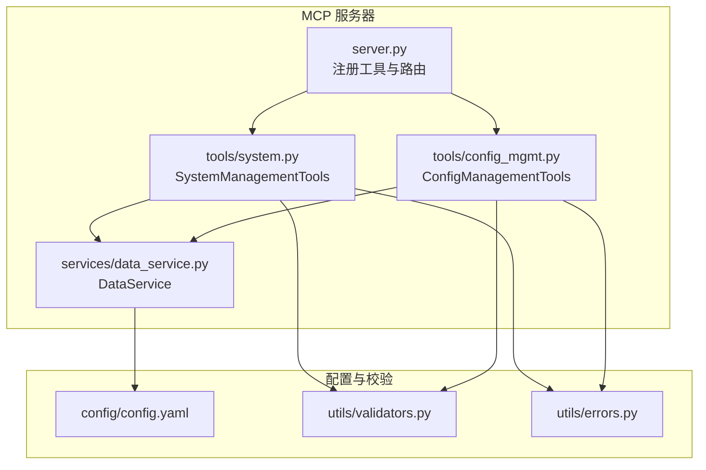
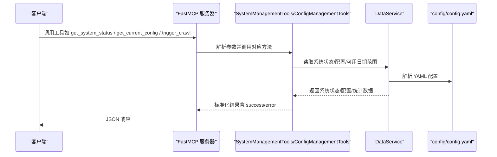
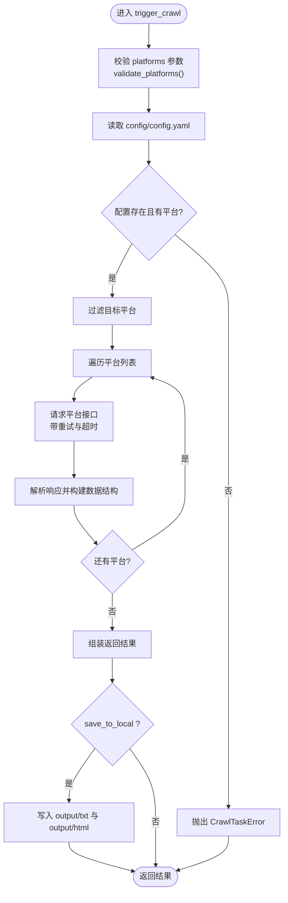
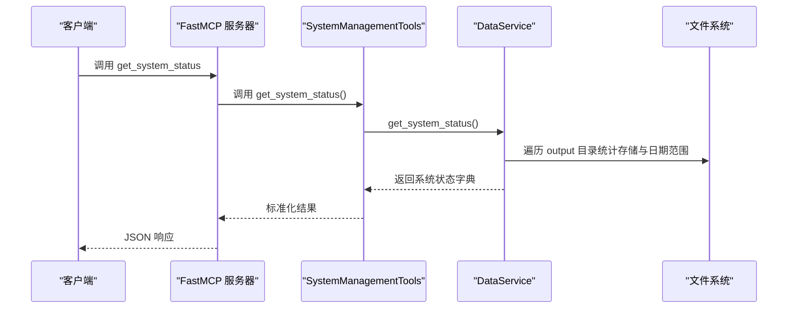
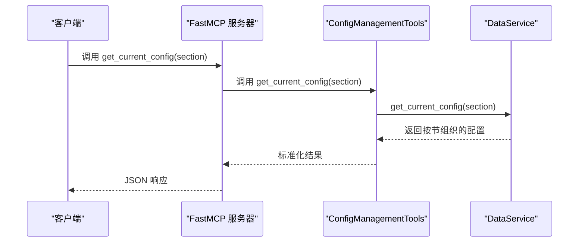
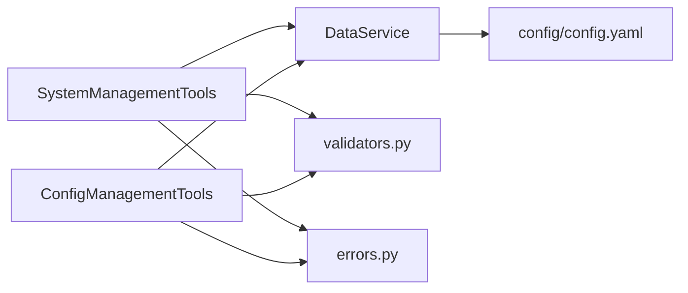

# 系统管理工具

<cite>
**本文引用的文件**
- [mcp_server/server.py](file://mcp_server/server.py)
- [mcp_server/tools/system.py](file://mcp_server/tools/system.py)
- [mcp_server/tools/config_mgmt.py](file://mcp_server/tools/config_mgmt.py)
- [mcp_server/services/data_service.py](file://mcp_server/services/data_service.py)
- [mcp_server/utils/validators.py](file://mcp_server/utils/validators.py)
- [mcp_server/utils/errors.py](file://mcp_server/utils/errors.py)
- [config/config.yaml](file://config/config.yaml)
- [docs/MCP-API-Reference.md](file://docs/MCP-API-Reference.md)
</cite>

## 目录
1. [简介](#简介)
2. [项目结构](#项目结构)
3. [核心组件](#核心组件)
4. [架构总览](#架构总览)
5. [详细组件分析](#详细组件分析)
6. [依赖关系分析](#依赖关系分析)
7. [性能考量](#性能考量)
8. [故障排查指南](#故障排查指南)
9. [结论](#结论)
10. [附录](#附录)

## 简介
本文件聚焦 TrendRadar MCP 服务器的系统管理工具，围绕以下目标展开：
- 详尽说明 trigger_crawl 工具如何手动触发全量或指定平台的爬取任务，涵盖 platforms 参数的多平台选择机制与 save_to_local 选项的数据持久化行为。
- 描述 get_system_status 工具返回的系统版本、数据统计、缓存状态等监控指标。
- 解释 get_current_config 工具暴露的运行时配置信息（爬虫、推送、关键词、权重等）。
- 阐明这些管理接口的安全控制策略与调用权限验证机制。
- 提供运维操作的实际应用案例。

## 项目结构
系统管理工具位于 MCP 服务器的工具层，通过 FastMCP 注册为标准工具，对外提供 HTTP/stdio 两种传输模式。系统管理工具主要由以下模块组成：
- 工具层：system.py（系统状态与爬取）、config_mgmt.py（配置查询）
- 服务层：data_service.py（系统状态与配置读取）
- 工具层入口：server.py（注册工具、参数校验、错误包装）
- 参数校验与错误：validators.py、errors.py
- 运行配置：config/config.yaml

图表来源
- [mcp_server/server.py](file://mcp_server/server.py#L585-L658)
- [mcp_server/tools/system.py](file://mcp_server/tools/system.py#L1-L120)
- [mcp_server/tools/config_mgmt.py](file://mcp_server/tools/config_mgmt.py#L1-L67)
- [mcp_server/services/data_service.py](file://mcp_server/services/data_service.py#L538-L605)
- [mcp_server/utils/validators.py](file://mcp_server/utils/validators.py#L43-L88)
- [config/config.yaml](file://config/config.yaml#L1-L140)

章节来源
- [mcp_server/server.py](file://mcp_server/server.py#L585-L658)
- [mcp_server/tools/system.py](file://mcp_server/tools/system.py#L1-L120)
- [mcp_server/tools/config_mgmt.py](file://mcp_server/tools/config_mgmt.py#L1-L67)
- [mcp_server/services/data_service.py](file://mcp_server/services/data_service.py#L538-L605)
- [mcp_server/utils/validators.py](file://mcp_server/utils/validators.py#L43-L88)
- [config/config.yaml](file://config/config.yaml#L1-L140)

## 核心组件
- SystemManagementTools：提供 get_system_status 与 trigger_crawl 两个系统管理能力。
- ConfigManagementTools：提供 get_current_config，按节返回运行时配置。
- DataService：封装系统状态与配置读取、可用日期范围扫描、缓存统计等。
- 参数校验与错误：validate_platforms、validate_config_section 等；统一错误包装 MCPError 子类。

章节来源
- [mcp_server/tools/system.py](file://mcp_server/tools/system.py#L15-L120)
- [mcp_server/tools/config_mgmt.py](file://mcp_server/tools/config_mgmt.py#L14-L67)
- [mcp_server/services/data_service.py](file://mcp_server/services/data_service.py#L538-L605)
- [mcp_server/utils/validators.py](file://mcp_server/utils/validators.py#L43-L88)
- [mcp_server/utils/errors.py](file://mcp_server/utils/errors.py#L10-L94)

## 架构总览
系统管理工具通过 FastMCP 注解注册为工具方法，客户端可通过 MCP 协议调用。工具内部依赖参数校验与错误处理，最终委托 DataService 完成系统状态与配置读取。

图表来源
- [mcp_server/server.py](file://mcp_server/server.py#L585-L658)
- [mcp_server/tools/system.py](file://mcp_server/tools/system.py#L33-L120)
- [mcp_server/tools/config_mgmt.py](file://mcp_server/tools/config_mgmt.py#L26-L67)
- [mcp_server/services/data_service.py](file://mcp_server/services/data_service.py#L538-L605)
- [config/config.yaml](file://config/config.yaml#L1-L140)

## 详细组件分析

### trigger_crawl：手动触发爬取任务
- 功能概述
  - 支持手动触发一次临时爬取任务，可选择平台集合与是否保存到本地 output 目录。
  - 支持 include_url 控制是否包含链接字段，以节省 token。
- 参数与行为
  - platforms：指定平台 ID 列表；为空或省略时使用 config.yaml 中配置的所有平台。
  - save_to_local：是否保存到本地 output 目录（按日期/时间生成 txt/html 文件）。
  - include_url：是否包含 URL 字段。
- 平台选择机制
  - 通过 validate_platforms 校验 platforms，若配置文件不可用则采用降级策略允许所有平台通过。
  - 从 config/config.yaml 的 platforms 节点读取平台列表，支持 id/name 字段。
- 爬取流程
  - 读取 config.yaml 的 request_interval 作为请求间隔参考。
  - 遍历目标平台，构造请求 URL 并发起请求，带有限时与重试机制。
  - 解析响应，构建新闻数据结构（标题、排名、URL 等），失败平台记录在 failed_platforms。
  - 若 save_to_local 为真，按日期/时间生成 output/年月日/txt 与 output/年月日/html 文件，并返回保存路径。
- 返回结构
  - success：布尔值，指示调用是否成功。
  - task_id/status/crawl_time/platforms/total_news/failed_platforms/data/saved_to_local 等字段。
  - 若保存成功，返回 saved_files（txt/html 路径）；若保存失败，返回 save_error 并提示仅内存中存在数据。
- 错误处理
  - 配置文件缺失或平台配置为空时抛出 CrawlTaskError。
  - 参数校验失败抛出 InvalidParameterError。
  - 其他异常统一包装为 INTERNAL_ERROR。

图表来源
- [mcp_server/tools/system.py](file://mcp_server/tools/system.py#L68-L375)
- [mcp_server/utils/validators.py](file://mcp_server/utils/validators.py#L43-L88)
- [config/config.yaml](file://config/config.yaml#L1-L140)

章节来源
- [mcp_server/tools/system.py](file://mcp_server/tools/system.py#L68-L375)
- [mcp_server/utils/validators.py](file://mcp_server/utils/validators.py#L43-L88)
- [config/config.yaml](file://config/config.yaml#L1-L140)

### get_system_status：系统运行状态与健康检查
- 功能概述
  - 返回系统版本、数据统计、缓存状态等健康指标。
- 返回字段
  - system.version、system.project_root
  - data.total_storage、data.oldest_record、data.latest_record
  - cache.stats（缓存命中率、条目数等）
  - health（健康状态）
- 数据来源
  - 扫描 output 目录统计存储大小与日期范围。
  - 读取版本文件获取版本号。
  - 读取缓存服务统计信息。

图表来源
- [mcp_server/server.py](file://mcp_server/server.py#L610-L623)
- [mcp_server/tools/system.py](file://mcp_server/tools/system.py#L33-L53)
- [mcp_server/services/data_service.py](file://mcp_server/services/data_service.py#L538-L605)

章节来源
- [mcp_server/server.py](file://mcp_server/server.py#L610-L623)
- [mcp_server/tools/system.py](file://mcp_server/tools/system.py#L33-L53)
- [mcp_server/services/data_service.py](file://mcp_server/services/data_service.py#L538-L605)

### get_current_config：运行时配置信息
- 功能概述
  - 返回当前系统配置，支持按节查询（all/crawler/push/keywords/weights）。
- 返回字段
  - config（按节组织的配置字典）
  - section（当前查询节）
  - success：布尔值
- 配置节说明
  - crawler：爬虫开关、代理、请求间隔、平台列表等。
  - push：通知开关、通道（飞书/钉钉/企业微信/Telegram/Slack/邮件等）、批次大小、推送时间窗口等。
  - keywords：关注词组与总数。
  - weights：排名、频率、热度权重。
- 数据来源
  - 解析 config/config.yaml 并按节裁剪返回。

图表来源
- [mcp_server/server.py](file://mcp_server/server.py#L587-L608)
- [mcp_server/tools/config_mgmt.py](file://mcp_server/tools/config_mgmt.py#L26-L67)
- [mcp_server/services/data_service.py](file://mcp_server/services/data_service.py#L411-L496)

章节来源
- [mcp_server/server.py](file://mcp_server/server.py#L587-L608)
- [mcp_server/tools/config_mgmt.py](file://mcp_server/tools/config_mgmt.py#L26-L67)
- [mcp_server/services/data_service.py](file://mcp_server/services/data_service.py#L411-L496)
- [config/config.yaml](file://config/config.yaml#L1-L140)

### 安全控制与权限验证
- 参数校验
  - 平台参数：validate_platforms，支持降级策略（当配置不可用时允许所有平台通过）。
  - 配置节参数：validate_config_section，限定合法取值。
- 错误包装
  - 统一使用 MCPError 及其子类（InvalidParameterError、CrawlTaskError、DataNotFoundError 等）进行错误包装，保证客户端稳定处理。
- 调用流程
  - 所有工具均通过 FastMCP 注解注册，客户端通过 MCP 协议调用；未发现显式的鉴权/权限拦截逻辑，建议结合部署环境（如网络隔离、代理、防火墙）保障安全。

章节来源
- [mcp_server/utils/validators.py](file://mcp_server/utils/validators.py#L43-L88)
- [mcp_server/utils/errors.py](file://mcp_server/utils/errors.py#L10-L94)
- [mcp_server/server.py](file://mcp_server/server.py#L585-L658)

## 依赖关系分析
- 工具层依赖
  - SystemManagementTools 依赖 DataService（系统状态）、validators（参数校验）、errors（错误包装）。
  - ConfigManagementTools 依赖 DataService（配置读取）、validators（参数校验）、errors（错误包装）。
- 服务层依赖
  - DataService 依赖 ParserService（解析配置/标题）、缓存服务、文件系统。
- 配置依赖
  - config/config.yaml 提供平台列表、爬虫配置、通知配置、权重等。

图表来源
- [mcp_server/tools/system.py](file://mcp_server/tools/system.py#L15-L120)
- [mcp_server/tools/config_mgmt.py](file://mcp_server/tools/config_mgmt.py#L14-L67)
- [mcp_server/services/data_service.py](file://mcp_server/services/data_service.py#L538-L605)
- [mcp_server/utils/validators.py](file://mcp_server/utils/validators.py#L43-L88)
- [mcp_server/utils/errors.py](file://mcp_server/utils/errors.py#L10-L94)
- [config/config.yaml](file://config/config.yaml#L1-L140)

章节来源
- [mcp_server/tools/system.py](file://mcp_server/tools/system.py#L15-L120)
- [mcp_server/tools/config_mgmt.py](file://mcp_server/tools/config_mgmt.py#L14-L67)
- [mcp_server/services/data_service.py](file://mcp_server/services/data_service.py#L538-L605)
- [mcp_server/utils/validators.py](file://mcp_server/utils/validators.py#L43-L88)
- [mcp_server/utils/errors.py](file://mcp_server/utils/errors.py#L10-L94)
- [config/config.yaml](file://config/config.yaml#L1-L140)

## 性能考量
- 爬取间隔与重试
  - request_interval 来源于配置，系统在遍历平台时会加入随机抖动并限制最小间隔，避免过于频繁请求。
- 缓存策略
  - DataService 对常用查询（如最新新闻、趋势话题、配置）设置缓存 TTL，减少重复 IO。
- 输出持久化
  - save_to_local 会生成 txt/html 文件，建议在批量爬取时合理规划磁盘空间与 IO 压力。

章节来源
- [mcp_server/tools/system.py](file://mcp_server/tools/system.py#L132-L223)
- [mcp_server/services/data_service.py](file://mcp_server/services/data_service.py#L538-L605)
- [config/config.yaml](file://config/config.yaml#L1-L140)

## 故障排查指南
- 常见错误与定位
  - INVALID_PARAMETER：参数类型或取值不合法（如 platforms 非列表、limit 超限、日期范围非法）。
  - DATA_NOT_FOUND：未找到数据（如历史日期无数据）。
  - CRAWL_TASK_ERROR：爬取任务错误（如配置文件缺失、平台不存在）。
  - INTERNAL_ERROR：未捕获异常，建议查看服务端日志并复现最小化用例。
- 平台参数校验失败
  - 检查 config/config.yaml 的 platforms 节点是否存在且 id 正确。
  - 若配置加载失败，validate_platforms 采用降级策略允许所有平台，此时可确认为配置文件问题。
- 爬取保存失败
  - 检查 output 目录权限与磁盘空间。
  - 观察返回的 save_error 字段，确认具体原因。
- 配置节查询异常
  - 确认 section 取值在 ["all","crawler","push","keywords","weights"] 之内。

章节来源
- [mcp_server/utils/errors.py](file://mcp_server/utils/errors.py#L10-L94)
- [mcp_server/utils/validators.py](file://mcp_server/utils/validators.py#L43-L88)
- [mcp_server/tools/system.py](file://mcp_server/tools/system.py#L361-L375)
- [mcp_server/tools/config_mgmt.py](file://mcp_server/tools/config_mgmt.py#L54-L67)

## 结论
- trigger_crawl 提供灵活的临时爬取能力，支持多平台选择与本地持久化，参数校验与错误包装完善。
- get_system_status 与 get_current_config 为运维提供了关键的系统健康与配置视图。
- 建议在生产环境中结合网络与部署安全策略，确保 MCP 服务器访问可控；同时利用缓存与合理的请求间隔提升性能与稳定性。

## 附录

### API 定义与调用示例

- get_system_status
  - 方法：get_system_status
  - 返回：系统版本、数据统计、缓存状态、健康状态等
  - 参考：[docs/MCP-API-Reference.md](file://docs/MCP-API-Reference.md#L314-L355)

- get_current_config
  - 方法：get_current_config(section)
  - 参数：section ∈ {"all","crawler","push","keywords","weights"}
  - 返回：按节组织的配置字典
  - 参考：[docs/MCP-API-Reference.md](file://docs/MCP-API-Reference.md#L315-L327)

- trigger_crawl
  - 方法：trigger_crawl(platforms, save_to_local, include_url)
  - 参数：
    - platforms：平台 ID 列表（可空，表示使用配置中的全部平台）
    - save_to_local：是否保存到本地 output 目录
    - include_url：是否包含 URL 字段
  - 返回：任务状态、平台列表、失败平台、新闻总数、数据、保存路径等
  - 参考：[docs/MCP-API-Reference.md](file://docs/MCP-API-Reference.md#L356-L383)

章节来源
- [docs/MCP-API-Reference.md](file://docs/MCP-API-Reference.md#L314-L383)
- [mcp_server/server.py](file://mcp_server/server.py#L587-L658)

### 运维操作案例
- 案例1：临时爬取指定平台并保存
  - 步骤：调用 trigger_crawl(platforms=["zhihu","weibo"], save_to_local=true)
  - 结果：返回 data 与 saved_files，可在 output/年月日/txt 与 output/年月日/html 查看
- 案例2：全量爬取并仅返回内存结果
  - 步骤：调用 trigger_crawl(save_to_local=false)
  - 结果：返回 data，未生成本地文件
- 案例3：查看系统健康状态
  - 步骤：调用 get_system_status
  - 结果：返回 system、data、cache、health 等字段
- 案例4：查看配置节
  - 步骤：调用 get_current_config(section="crawler")
  - 结果：返回爬虫相关配置（开关、代理、请求间隔、平台列表）

章节来源
- [mcp_server/server.py](file://mcp_server/server.py#L587-L658)
- [mcp_server/tools/system.py](file://mcp_server/tools/system.py#L68-L375)
- [mcp_server/tools/config_mgmt.py](file://mcp_server/tools/config_mgmt.py#L26-L67)
- [mcp_server/services/data_service.py](file://mcp_server/services/data_service.py#L538-L605)
- [config/config.yaml](file://config/config.yaml#L1-L140)