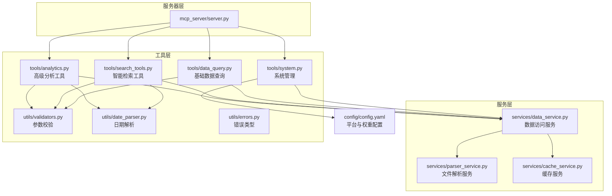
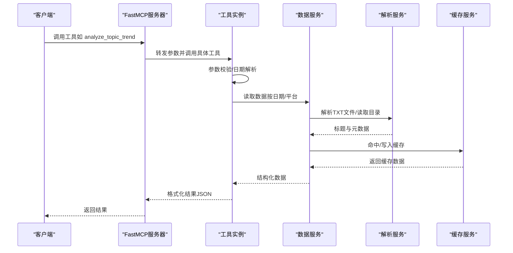
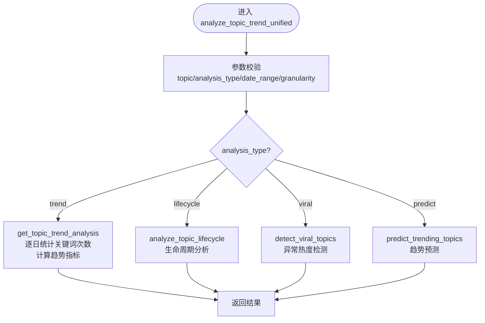
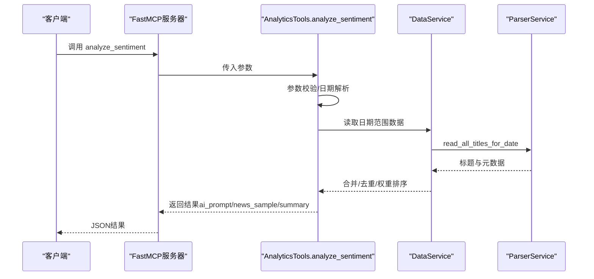
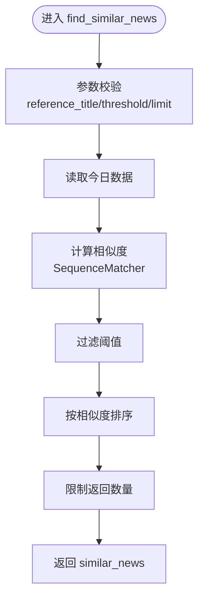
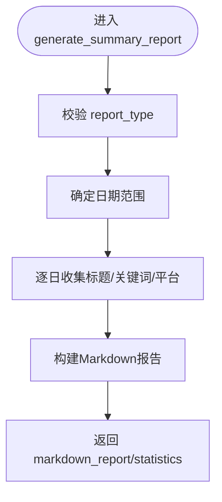
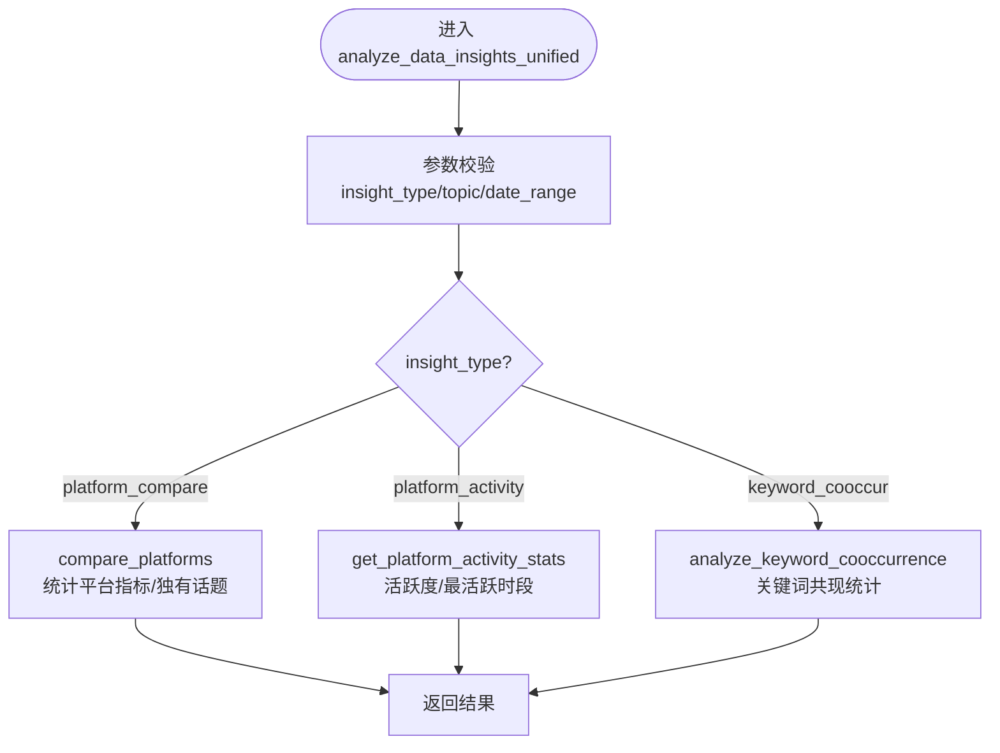
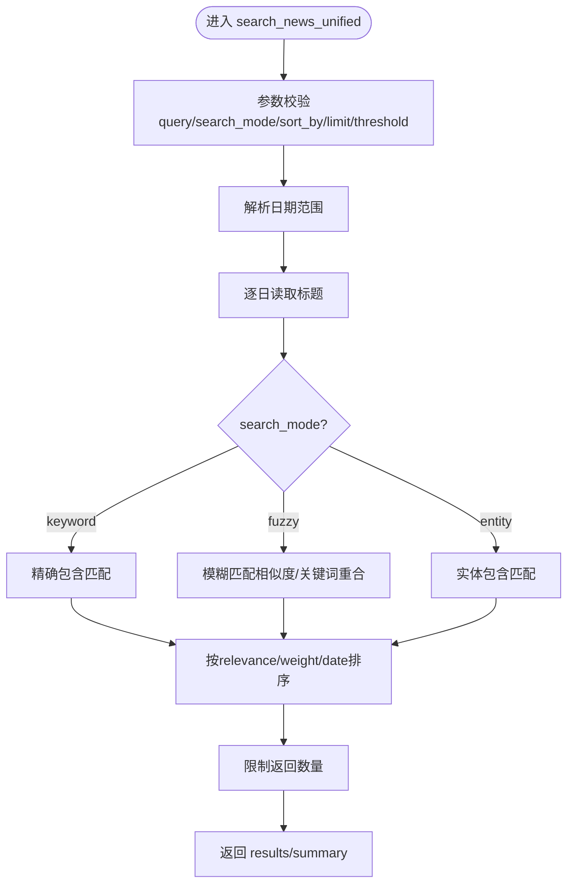
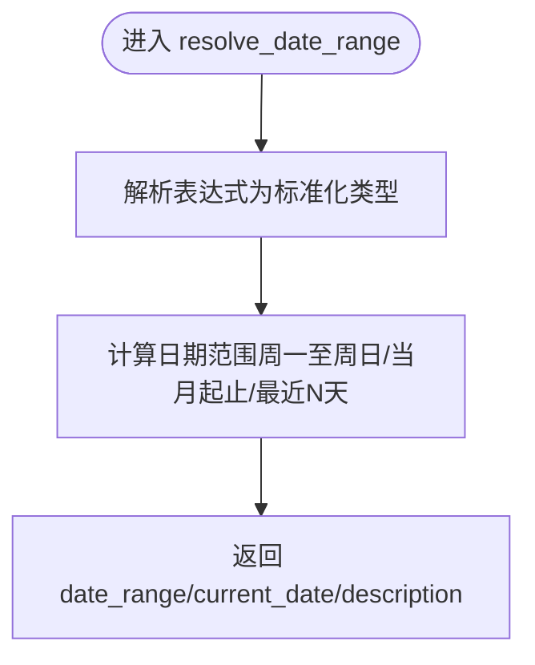
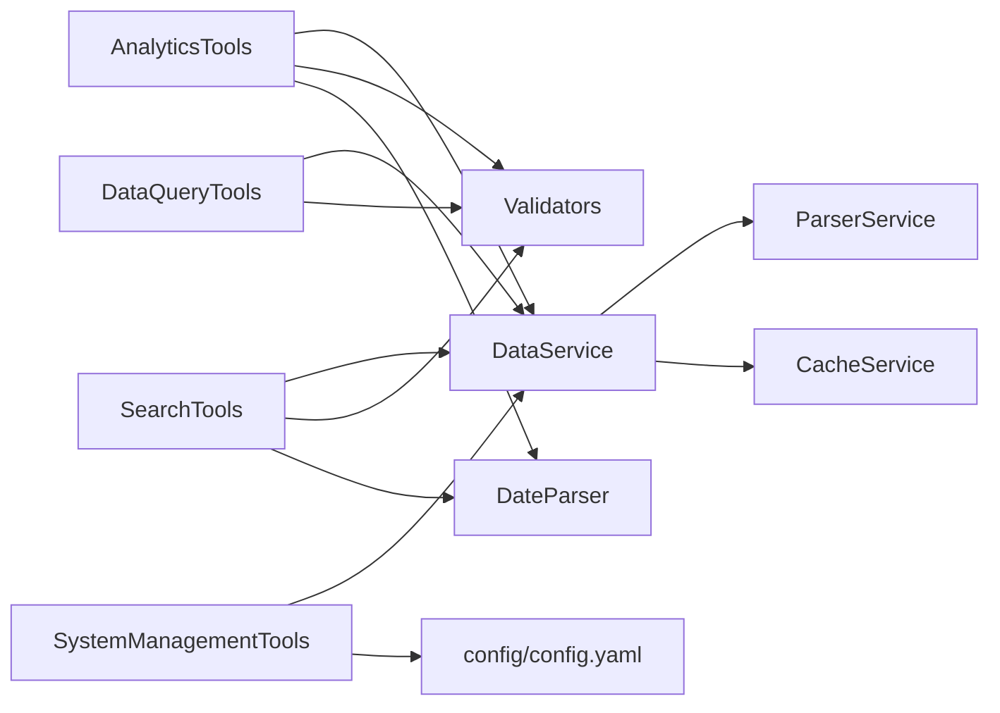

# 高级分析工具

<cite>
**本文引用的文件**
- [mcp_server/server.py](file://mcp_server/server.py)
- [mcp_server/tools/analytics.py](file://mcp_server/tools/analytics.py)
- [mcp_server/tools/search_tools.py](file://mcp_server/tools/search_tools.py)
- [mcp_server/tools/data_query.py](file://mcp_server/tools/data_query.py)
- [mcp_server/tools/system.py](file://mcp_server/tools/system.py)
- [mcp_server/services/data_service.py](file://mcp_server/services/data_service.py)
- [mcp_server/services/parser_service.py](file://mcp_server/services/parser_service.py)
- [mcp_server/services/cache_service.py](file://mcp_server/services/cache_service.py)
- [mcp_server/utils/validators.py](file://mcp_server/utils/validators.py)
- [mcp_server/utils/date_parser.py](file://mcp_server/utils/date_parser.py)
- [mcp_server/utils/errors.py](file://mcp_server/utils/errors.py)
- [config/config.yaml](file://config/config.yaml)
</cite>

## 目录
1. [简介](#简介)
2. [项目结构](#项目结构)
3. [核心组件](#核心组件)
4. [架构总览](#架构总览)
5. [详细组件分析](#详细组件分析)
6. [依赖关系分析](#依赖关系分析)
7. [性能考量](#性能考量)
8. [故障排查指南](#故障排查指南)
9. [结论](#结论)
10. [附录](#附录)

## 简介
本文件面向TrendRadar MCP服务器的高级分析工具集，围绕“话题趋势分析”“情感分析”“相似新闻发现”“生成摘要报告”等能力，系统梳理工具的输入参数、输出格式、内部算法与数据流，并说明analyze_data_insights如何整合多维数据生成深度洞察，以及这些分析结果如何支撑AI对话式交互。文档同时提供使用案例，展示如何通过自然语言指令触发复杂分析流程。

## 项目结构
- 服务器入口与工具注册：mcp_server/server.py
- 分析工具实现：mcp_server/tools/analytics.py
- 检索工具实现：mcp_server/tools/search_tools.py
- 基础数据查询工具：mcp_server/tools/data_query.py
- 系统管理工具：mcp_server/tools/system.py
- 数据服务层：mcp_server/services/data_service.py
- 解析服务层：mcp_server/services/parser_service.py
- 缓存服务：mcp_server/services/cache_service.py
- 参数校验与日期解析：mcp_server/utils/validators.py、mcp_server/utils/date_parser.py
- 错误类型定义：mcp_server/utils/errors.py
- 配置文件：config/config.yaml

图表来源
- [mcp_server/server.py](file://mcp_server/server.py#L1-L120)
- [mcp_server/tools/analytics.py](file://mcp_server/tools/analytics.py#L1-L120)
- [mcp_server/tools/search_tools.py](file://mcp_server/tools/search_tools.py#L1-L120)
- [mcp_server/tools/data_query.py](file://mcp_server/tools/data_query.py#L1-L120)
- [mcp_server/tools/system.py](file://mcp_server/tools/system.py#L1-L120)
- [mcp_server/services/data_service.py](file://mcp_server/services/data_service.py#L1-L120)
- [mcp_server/services/parser_service.py](file://mcp_server/services/parser_service.py#L1-L120)
- [mcp_server/services/cache_service.py](file://mcp_server/services/cache_service.py#L1-L120)
- [mcp_server/utils/validators.py](file://mcp_server/utils/validators.py#L1-L120)
- [mcp_server/utils/date_parser.py](file://mcp_server/utils/date_parser.py#L1-L120)
- [mcp_server/utils/errors.py](file://mcp_server/utils/errors.py#L1-L94)
- [config/config.yaml](file://config/config.yaml#L110-L140)

章节来源
- [mcp_server/server.py](file://mcp_server/server.py#L1-L120)
- [config/config.yaml](file://config/config.yaml#L110-L140)

## 核心组件
- 高级分析工具（AnalyticsTools）
  - analyze_topic_trend_unified：统一话题趋势分析（热度/生命周期/爆火/预测）
  - analyze_data_insights_unified：统一数据洞察（平台对比/活跃度/关键词共现）
  - analyze_sentiment：情感倾向分析（生成AI提示词）
  - find_similar_news：相似新闻查找
  - generate_summary_report：每日/每周摘要报告
  - detect_viral_topics/predict_trending_topics：异常热度检测与趋势预测
- 智能检索工具（SearchTools）
  - search_news_unified：统一新闻搜索（关键词/模糊/实体）
  - search_related_news_history：历史相关新闻检索
- 基础数据查询工具（DataQueryTools）
  - get_latest_news/get_news_by_date/search_news_by_keyword/get_trending_topics
- 系统管理工具（SystemManagementTools）
  - get_system_status/trigger_crawl

章节来源
- [mcp_server/tools/analytics.py](file://mcp_server/tools/analytics.py#L77-L120)
- [mcp_server/tools/search_tools.py](file://mcp_server/tools/search_tools.py#L18-L60)
- [mcp_server/tools/data_query.py](file://mcp_server/tools/data_query.py#L22-L60)
- [mcp_server/tools/system.py](file://mcp_server/tools/system.py#L15-L46)

## 架构总览
- 服务器入口通过FastMCP注册工具，客户端通过MCP协议调用。
- 工具层调用服务层，服务层负责解析数据文件、缓存与配置。
- 参数校验与日期解析贯穿工具层，保证输入合法性与一致性。
- 配置文件提供平台列表、权重与通知等系统级参数。

图表来源
- [mcp_server/server.py](file://mcp_server/server.py#L225-L332)
- [mcp_server/tools/analytics.py](file://mcp_server/tools/analytics.py#L156-L243)
- [mcp_server/services/data_service.py](file://mcp_server/services/data_service.py#L1-L120)
- [mcp_server/services/parser_service.py](file://mcp_server/services/parser_service.py#L160-L261)
- [mcp_server/services/cache_service.py](file://mcp_server/services/cache_service.py#L1-L120)

## 详细组件分析

### analyze_topic_trend（话题趋势分析）
- 功能概述
  - 统一入口：analyze_topic_trend_unified
  - 支持模式：trend（热度趋势）、lifecycle（生命周期）、viral（异常热度）、predict（话题预测）
- 输入参数
  - topic：必填，话题关键词
  - analysis_type：可选，trend/lifecycle/viral/predict
  - date_range：可选，{"start": "YYYY-MM-DD","end": "YYYY-MM-DD"}
  - granularity：仅trend模式，day
  - threshold/time_window：仅viral模式
  - lookahead_hours/confidence_threshold：仅predict模式
- 输出格式
  - success/error字段
  - trend_data/statistics/trend_direction（trend）
  - lifecycle_data/analysis（lifecycle）
  - viral_topics（viral）
  - predicted_topics（predict）
- 内部算法与数据流
  - 参数校验与日期解析
  - 逐日遍历数据，统计关键词出现次数
  - 计算涨跌幅度、峰值时间、平均值等指标
  - viral/predict模式基于关键词频率与历史趋势做异常检测与预测
- 使用案例
  - “分析AI本周的趋势”：先resolve_date_range解析日期，再调用analyze_topic_trend
  - “看看特斯拉最近30天的热度”：设置analysis_type="lifecycle"

图表来源
- [mcp_server/server.py](file://mcp_server/server.py#L225-L289)
- [mcp_server/tools/analytics.py](file://mcp_server/tools/analytics.py#L156-L243)
- [mcp_server/tools/analytics.py](file://mcp_server/tools/analytics.py#L244-L401)
- [mcp_server/tools/analytics.py](file://mcp_server/tools/analytics.py#L1465-L1621)
- [mcp_server/tools/analytics.py](file://mcp_server/tools/analytics.py#L1623-L1757)
- [mcp_server/tools/analytics.py](file://mcp_server/tools/analytics.py#L1759-L1919)

章节来源
- [mcp_server/server.py](file://mcp_server/server.py#L225-L289)
- [mcp_server/tools/analytics.py](file://mcp_server/tools/analytics.py#L156-L243)
- [mcp_server/tools/analytics.py](file://mcp_server/tools/analytics.py#L244-L401)
- [mcp_server/tools/analytics.py](file://mcp_server/tools/analytics.py#L1465-L1621)
- [mcp_server/tools/analytics.py](file://mcp_server/tools/analytics.py#L1623-L1757)
- [mcp_server/tools/analytics.py](file://mcp_server/tools/analytics.py#L1759-L1919)

### analyze_sentiment（情感分析）
- 功能概述
  - 生成用于AI情感分析的结构化提示词（ai_prompt）
  - 可按权重排序、去重、限制返回数量
- 输入参数
  - topic：可选，限定话题
  - platforms：可选，平台过滤
  - date_range：可选，{"start": "YYYY-MM-DD","end": "YYYY-MM-DD"}
  - limit：默认50，最大100
  - sort_by_weight：默认True
  - include_url：默认False
- 输出格式
  - summary（总量/去重数/平台分布/排序方式）
  - ai_prompt（结构化提示词）
  - news_sample（相关新闻样本）
  - note（提示信息）
- 内部算法与数据流
  - 参数校验与日期解析
  - 逐日读取标题，去重（同一标题在不同平台只保留一次）
  - 按权重排序（权重=综合排名/频次/热度加成）
  - 生成提示词模板，按平台分组输出
- 使用案例
  - “分析AI本周的情感倾向”：先resolve_date_range，再调用analyze_sentiment

图表来源
- [mcp_server/server.py](file://mcp_server/server.py#L334-L396)
- [mcp_server/tools/analytics.py](file://mcp_server/tools/analytics.py#L631-L803)
- [mcp_server/services/data_service.py](file://mcp_server/services/data_service.py#L1-L120)
- [mcp_server/services/parser_service.py](file://mcp_server/services/parser_service.py#L160-L261)

章节来源
- [mcp_server/server.py](file://mcp_server/server.py#L334-L396)
- [mcp_server/tools/analytics.py](file://mcp_server/tools/analytics.py#L631-L803)
- [mcp_server/services/data_service.py](file://mcp_server/services/data_service.py#L1-L120)
- [mcp_server/services/parser_service.py](file://mcp_server/services/parser_service.py#L160-L261)

### find_similar_news（相似新闻发现）
- 功能概述
  - 基于标题相似度查找相关新闻
- 输入参数
  - reference_title：参考标题
  - threshold：相似度阈值（0-1，默认0.6）
  - limit：默认50，最大100
  - include_url：默认False
- 输出格式
  - summary（total_found/returned_count/threshold/reference_title）
  - similar_news（按相似度排序）
- 内部算法与数据流
  - 参数校验
  - 读取今日数据，计算与参考标题的相似度（difflib.SequenceMatcher）
  - 过滤阈值并排序返回

图表来源
- [mcp_server/server.py](file://mcp_server/server.py#L398-L432)
- [mcp_server/tools/analytics.py](file://mcp_server/tools/analytics.py#L910-L1015)

章节来源
- [mcp_server/server.py](file://mcp_server/server.py#L398-L432)
- [mcp_server/tools/analytics.py](file://mcp_server/tools/analytics.py#L910-L1015)

### generate_summary_report（生成摘要报告）
- 功能概述
  - 自动生成每日/每周摘要报告（Markdown）
- 输入参数
  - report_type：daily/weekly
  - date_range：可选，{"start": "YYYY-MM-DD","end": "YYYY-MM-DD"}
- 输出格式
  - markdown_report（Markdown内容）
  - statistics（总新闻数/平台数/关键词数等）
  - date_range
- 内部算法与数据流
  - 确定日期范围
  - 逐日读取标题，统计关键词与平台分布
  - 生成报告（Top关键词/平台活跃度/趋势分析/精选样本）

图表来源
- [mcp_server/server.py](file://mcp_server/server.py#L434-L458)
- [mcp_server/tools/analytics.py](file://mcp_server/tools/analytics.py#L1158-L1336)

章节来源
- [mcp_server/server.py](file://mcp_server/server.py#L434-L458)
- [mcp_server/tools/analytics.py](file://mcp_server/tools/analytics.py#L1158-L1336)

### analyze_data_insights（统一数据洞察）
- 功能概述
  - 统一入口：analyze_data_insights_unified
  - 支持模式：platform_compare、platform_activity、keyword_cooccur
- 输入参数
  - insight_type：platform_compare/platform_activity/keyword_cooccur
  - topic/date_range/min_frequency/top_n：按模式生效
- 输出格式
  - platform_compare：platform_stats/unique_topics/total_platforms
  - platform_activity：platform_activity/most_active_platform/total_platforms
  - keyword_cooccur：cooccurrence_pairs/total_pairs/min_frequency/generated_at
- 内部算法与数据流
  - platform_compare：统计各平台新闻数、话题提及数、覆盖率、Top关键词，计算平台独有话题
  - platform_activity：统计更新次数、活跃天数、日均新闻数、最活跃时段
  - keyword_cooccur：提取关键词，统计两两共现频次，过滤阈值并排序

图表来源
- [mcp_server/server.py](file://mcp_server/server.py#L291-L332)
- [mcp_server/tools/analytics.py](file://mcp_server/tools/analytics.py#L89-L155)
- [mcp_server/tools/analytics.py](file://mcp_server/tools/analytics.py#L402-L525)
- [mcp_server/tools/analytics.py](file://mcp_server/tools/analytics.py#L526-L630)
- [mcp_server/tools/analytics.py](file://mcp_server/tools/analytics.py#L1338-L1463)

章节来源
- [mcp_server/server.py](file://mcp_server/server.py#L291-L332)
- [mcp_server/tools/analytics.py](file://mcp_server/tools/analytics.py#L89-L155)
- [mcp_server/tools/analytics.py](file://mcp_server/tools/analytics.py#L402-L525)
- [mcp_server/tools/analytics.py](file://mcp_server/tools/analytics.py#L526-L630)
- [mcp_server/tools/analytics.py](file://mcp_server/tools/analytics.py#L1338-L1463)

### search_news（统一新闻搜索）
- 功能概述
  - 支持keyword/fuzzy/entity三种模式
- 输入参数
  - query：关键词/内容片段/实体名称
  - search_mode：keyword/fuzzy/entity
  - date_range：可选
  - platforms：可选
  - limit：默认50，最大1000
  - sort_by：relevance/weight/date
  - threshold：仅fuzzy模式（0-1，默认0.6）
  - include_url：默认False
- 输出格式
  - summary（total_found/returned_count/requested_limit/search_mode/query/platforms/time_range/sort_by）
  - results（匹配新闻列表）

图表来源
- [mcp_server/server.py](file://mcp_server/server.py#L462-L539)
- [mcp_server/tools/search_tools.py](file://mcp_server/tools/search_tools.py#L38-L110)
- [mcp_server/tools/search_tools.py](file://mcp_server/tools/search_tools.py#L135-L240)
- [mcp_server/tools/search_tools.py](file://mcp_server/tools/search_tools.py#L291-L441)
- [mcp_server/tools/search_tools.py](file://mcp_server/tools/search_tools.py#L494-L702)

章节来源
- [mcp_server/server.py](file://mcp_server/server.py#L462-L539)
- [mcp_server/tools/search_tools.py](file://mcp_server/tools/search_tools.py#L38-L110)
- [mcp_server/tools/search_tools.py](file://mcp_server/tools/search_tools.py#L135-L240)
- [mcp_server/tools/search_tools.py](file://mcp_server/tools/search_tools.py#L291-L441)
- [mcp_server/tools/search_tools.py](file://mcp_server/tools/search_tools.py#L494-L702)

### resolve_date_range（日期解析）
- 功能概述
  - 将自然语言日期表达式解析为标准日期范围，确保AI与服务器日期一致
- 输入参数
  - expression：今天/昨天/本周/上周/本月/上月/最近7天/最近30天等
- 输出格式
  - date_range：{"start": "YYYY-MM-DD","end": "YYYY-MM-DD"}
  - current_date/description/success

图表来源
- [mcp_server/server.py](file://mcp_server/server.py#L40-L109)
- [mcp_server/utils/date_parser.py](file://mcp_server/utils/date_parser.py#L330-L424)

章节来源
- [mcp_server/server.py](file://mcp_server/server.py#L40-L109)
- [mcp_server/utils/date_parser.py](file://mcp_server/utils/date_parser.py#L330-L424)

## 依赖关系分析
- 工具层依赖
  - AnalyticsTools/SearchTools/DataQueryTools/SystemManagementTools依赖DataService
  - DataService依赖ParserService与CacheService
  - 参数校验与日期解析独立于业务逻辑，被广泛复用
- 配置依赖
  - config/config.yaml提供平台列表、权重与通知配置
- 错误处理
  - 统一的MCPError体系，便于客户端识别与处理

图表来源
- [mcp_server/tools/analytics.py](file://mcp_server/tools/analytics.py#L77-L120)
- [mcp_server/tools/search_tools.py](file://mcp_server/tools/search_tools.py#L18-L40)
- [mcp_server/tools/data_query.py](file://mcp_server/tools/data_query.py#L22-L40)
- [mcp_server/tools/system.py](file://mcp_server/tools/system.py#L15-L33)
- [mcp_server/services/data_service.py](file://mcp_server/services/data_service.py#L17-L40)
- [mcp_server/services/parser_service.py](file://mcp_server/services/parser_service.py#L18-L40)
- [mcp_server/services/cache_service.py](file://mcp_server/services/cache_service.py#L122-L137)
- [mcp_server/utils/validators.py](file://mcp_server/utils/validators.py#L16-L41)
- [mcp_server/utils/date_parser.py](file://mcp_server/utils/date_parser.py#L14-L31)
- [config/config.yaml](file://config/config.yaml#L110-L140)

章节来源
- [mcp_server/tools/analytics.py](file://mcp_server/tools/analytics.py#L77-L120)
- [mcp_server/tools/search_tools.py](file://mcp_server/tools/search_tools.py#L18-L40)
- [mcp_server/tools/data_query.py](file://mcp_server/tools/data_query.py#L22-L40)
- [mcp_server/tools/system.py](file://mcp_server/tools/system.py#L15-L33)
- [mcp_server/services/data_service.py](file://mcp_server/services/data_service.py#L17-L40)
- [mcp_server/services/parser_service.py](file://mcp_server/services/parser_service.py#L18-L40)
- [mcp_server/services/cache_service.py](file://mcp_server/services/cache_service.py#L122-L137)
- [mcp_server/utils/validators.py](file://mcp_server/utils/validators.py#L16-L41)
- [mcp_server/utils/date_parser.py](file://mcp_server/utils/date_parser.py#L14-L31)
- [config/config.yaml](file://config/config.yaml#L110-L140)

## 性能考量
- 缓存策略
  - ParserService/DataService对读取结果进行缓存，减少磁盘IO
  - CacheService提供TTL缓存与并发锁，支持清理过期项
- 排序与限制
  - 大多数工具支持limit与排序，避免返回过多数据
- 权重计算
  - calculate_news_weight综合排名、频次与热度加成，兼顾时效性与稳定性
- I/O与网络
  - SystemManagementTools触发外部爬取时具备重试与间隔控制，避免频繁请求

章节来源
- [mcp_server/services/cache_service.py](file://mcp_server/services/cache_service.py#L1-L120)
- [mcp_server/services/parser_service.py](file://mcp_server/services/parser_service.py#L160-L261)
- [mcp_server/tools/analytics.py](file://mcp_server/tools/analytics.py#L24-L75)
- [mcp_server/tools/system.py](file://mcp_server/tools/system.py#L68-L120)

## 故障排查指南
- 常见错误类型
  - INVALID_PARAMETER：参数格式/范围不合法
  - DATA_NOT_FOUND：未找到数据或日期在未来
  - CONFIGURATION_ERROR：配置文件异常
  - FILE_PARSE_ERROR：数据文件解析失败
- 排查步骤
  - 检查resolve_date_range返回的日期范围是否正确
  - 确认date_range未指向未来日期
  - 核对平台ID是否在config/config.yaml中配置
  - 检查output目录是否存在对应日期的数据文件
  - 查看get_system_status确认缓存与数据状态

章节来源
- [mcp_server/utils/errors.py](file://mcp_server/utils/errors.py#L1-L94)
- [mcp_server/utils/validators.py](file://mcp_server/utils/validators.py#L145-L209)
- [mcp_server/server.py](file://mcp_server/server.py#L610-L623)
- [mcp_server/services/data_service.py](file://mcp_server/services/data_service.py#L498-L537)

## 结论
TrendRadar MCP服务器的高级分析工具通过统一入口与严谨的参数校验、日期解析、缓存与数据服务，实现了从基础数据查询到多维洞察与AI提示词生成的全链路分析能力。analyze_data_insights将平台对比、活跃度统计与关键词共现整合为统一视图，analyze_topic_trend与analyze_sentiment分别覆盖趋势与情感两大核心场景，find_similar_news与generate_summary_report进一步完善了检索与报告能力。这些工具为AI对话式交互提供了结构化、可解释且可扩展的数据基础。

## 附录
- 使用案例（自然语言触发复杂分析流程）
  - “分析AI本周的情感倾向”
    1) resolve_date_range("本周") → 获取{"start":"YYYY-MM-DD","end":"YYYY-MM-DD"}
    2) analyze_sentiment(topic="AI", date_range=上一步返回的date_range)
  - “看看特斯拉最近30天的热度”
    1) resolve_date_range("最近30天")
    2) analyze_topic_trend(topic="特斯拉", analysis_type="lifecycle", date_range=...)
  - “查找和‘特斯拉降价’相似的新闻”
    1) find_similar_news(reference_title="特斯拉降价", threshold=0.6, limit=20)
  - “生成今天的新闻摘要报告”
    1) generate_summary_report(report_type="daily")

章节来源
- [mcp_server/server.py](file://mcp_server/server.py#L40-L109)
- [mcp_server/server.py](file://mcp_server/server.py#L334-L396)
- [mcp_server/server.py](file://mcp_server/server.py#L225-L289)
- [mcp_server/server.py](file://mcp_server/server.py#L398-L432)
- [mcp_server/server.py](file://mcp_server/server.py#L434-L458)