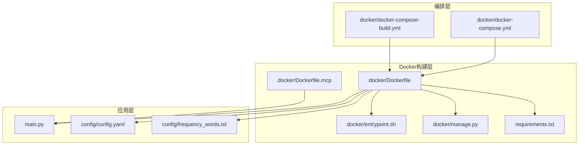
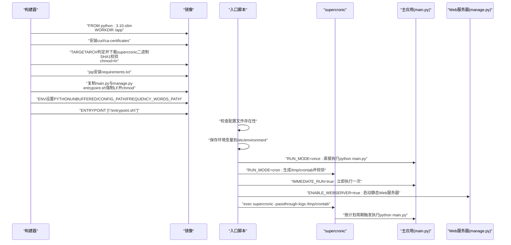
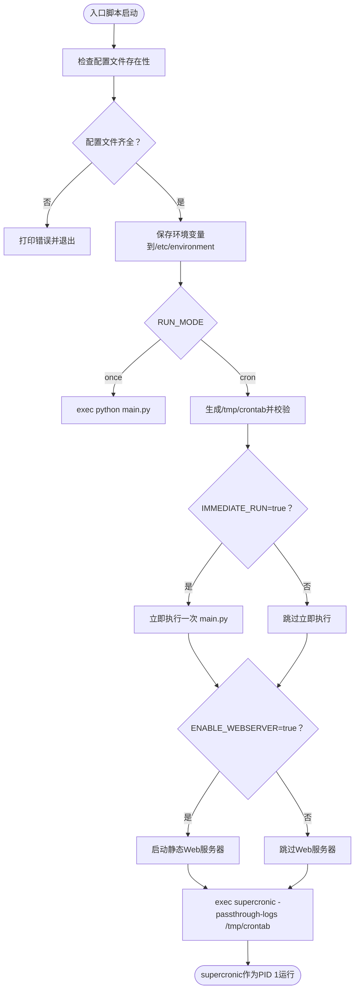
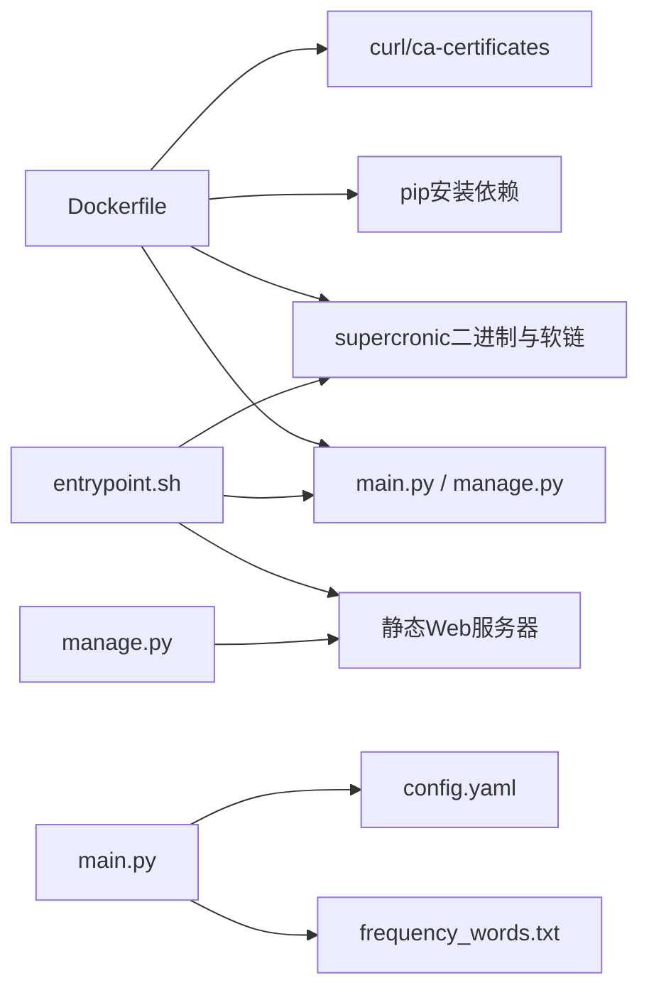

# Docker镜像构建流程

<cite>
**本文引用的文件**
- [Dockerfile](file://docker/Dockerfile)
- [entrypoint.sh](file://docker/entrypoint.sh)
- [manage.py](file://docker/manage.py)
- [requirements.txt](file://requirements.txt)
- [main.py](file://main.py)
- [docker-compose.yml](file://docker/docker-compose.yml)
- [docker-compose-build.yml](file://docker/docker-compose-build.yml)
- [Dockerfile.mcp](file://docker/Dockerfile.mcp)
- [config.yaml](file://config/config.yaml)
- [frequency_words.txt](file://config/frequency_words.txt)
</cite>

## 目录
1. [简介](#简介)
2. [项目结构](#项目结构)
3. [核心组件](#核心组件)
4. [架构总览](#架构总览)
5. [详细组件分析](#详细组件分析)
6. [依赖关系分析](#依赖关系分析)
7. [性能考量](#性能考量)
8. [故障排查指南](#故障排查指南)
9. [结论](#结论)
10. [附录](#附录)

## 简介
本文件面向Docker镜像构建流程，围绕Dockerfile的各阶段进行深入解析，涵盖基础镜像、WORKDIR设置、依赖安装、supercronic跨架构下载与校验、重试机制、requirements.txt安装、主程序与管理脚本复制、entrypoint.sh的LF格式转换与权限设置、ENV环境变量的作用，以及ENTRYPOINT如何协调supercronic与主应用运行。同时结合compose文件说明运行模式与挂载卷，帮助读者快速理解镜像构建与容器运行的整体流程。

## 项目结构
本仓库采用“按功能模块组织”的布局，Docker相关文件集中在docker目录，应用主程序位于根目录，配置文件位于config目录。compose文件分别用于直接拉取镜像运行与本地构建镜像运行两种场景。

图表来源
- [Dockerfile](file://docker/Dockerfile#L1-L71)
- [entrypoint.sh](file://docker/entrypoint.sh#L1-L50)
- [manage.py](file://docker/manage.py#L1-L625)
- [requirements.txt](file://requirements.txt#L1-L6)
- [main.py](file://main.py#L1-L800)
- [docker-compose.yml](file://docker/docker-compose.yml#L1-L74)
- [docker-compose-build.yml](file://docker/docker-compose-build.yml#L1-L78)
- [Dockerfile.mcp](file://docker/Dockerfile.mcp#L1-L24)

章节来源
- [Dockerfile](file://docker/Dockerfile#L1-L71)
- [docker-compose.yml](file://docker/docker-compose.yml#L1-L74)
- [docker-compose-build.yml](file://docker/docker-compose-build.yml#L1-L78)

## 核心组件
- 基础镜像与工作目录：基于python:3.10-slim，设置WORKDIR为/app，统一后续依赖安装与文件复制的根路径。
- 跨架构supercronic下载与校验：通过TARGETARCH区分amd64/arm64，下载对应二进制，执行SHA1校验，设置执行权限并建立软链，最后清理curl依赖与apt缓存。
- 依赖安装：复制requirements.txt并使用pip安装，避免缓存以减小镜像体积。
- 主程序与管理脚本：复制main.py与docker/manage.py至镜像；entrypoint.sh复制后强制转换为LF并赋予执行权限；同时创建/config与/output目录。
- 环境变量：设置PYTHONUNBUFFERED、CONFIG_PATH、FREQUENCY_WORDS_PATH，便于应用读取配置与词表。
- 入口点：ENTRYPOINT指向/docker/entrypoint.sh，由其根据RUN_MODE决定单次执行或supercronic定时执行，并可选启动Web服务器。

章节来源
- [Dockerfile](file://docker/Dockerfile#L1-L71)
- [entrypoint.sh](file://docker/entrypoint.sh#L1-L50)
- [manage.py](file://docker/manage.py#L1-L625)
- [requirements.txt](file://requirements.txt#L1-L6)
- [main.py](file://main.py#L1-L800)

## 架构总览
下图展示镜像构建阶段与容器运行阶段的关键交互，突出supercronic与主应用的协作关系。

图表来源
- [Dockerfile](file://docker/Dockerfile#L1-L71)
- [entrypoint.sh](file://docker/entrypoint.sh#L1-L50)
- [manage.py](file://docker/manage.py#L1-L625)

## 详细组件分析

### Dockerfile阶段解析
- 基础镜像与工作目录
  - 使用python:3.10-slim作为基础镜像，WORKDIR设置为/app，保证后续依赖安装与文件复制的统一路径。
- 跨架构supercronic下载与校验
  - 通过ARG TARGETARCH与case分支选择amd64或arm64对应的下载URL与SHA1校验值。
  - 下载采用curl，包含连接超时与最大时间限制，最多重试3次，每次失败sleep短暂等待。
  - 校验使用sha1sum -c，通过预设的SHA1值确保二进制完整性。
  - 设置执行权限并将二进制移动到/usr/local/bin，建立名为supercronic的软链，便于调用。
  - 最后移除curl并清理apt缓存，减少镜像体积。
- 依赖安装
  - 复制requirements.txt并使用pip安装，禁用缓存以降低镜像大小。
- 程序与脚本复制
  - 复制main.py与docker/manage.py至镜像根目录。
  - 复制entrypoint.sh临时文件，强制转换为LF换行，再移动为最终入口脚本并赋予执行权限。
  - 创建/app/config与/app/output目录，确保应用运行所需的配置与输出目录存在。
- 环境变量
  - 设置PYTHONUNBUFFERED=1，使Python输出实时可见，便于容器日志查看。
  - 设置CONFIG_PATH与FREQUENCY_WORDS_PATH，指向/app/config下的配置文件与词表文件。
- 入口点
  - 指定ENTRYPOINT为/docker/entrypoint.sh，容器启动后由该脚本接管PID 1。

章节来源
- [Dockerfile](file://docker/Dockerfile#L1-L71)

### entrypoint.sh运行逻辑
- 配置文件检查：启动前检查/app/config/config.yaml与/app/config/frequency_words.txt是否存在，缺失则退出。
- 环境持久化：将当前环境变量写入/etc/environment，便于容器内其他进程读取。
- 运行模式
  - once：直接执行python main.py，适合一次性任务或调试。
  - cron：生成/tmp/crontab，内容为“cd /app && /usr/local/bin/python main.py”，默认调度为每30分钟一次（可通过CRON_SCHEDULE覆盖）。
  - crontab格式验证：使用supercronic -test校验语法，失败则退出。
  - 立即执行：当IMMEDIATE_RUN=true时，在启动supercronic之前立即执行一次主程序。
  - Web服务器：当ENABLE_WEBSERVER=true时，启动静态Web服务器托管/app/output目录。
- 启动supercronic：以exec方式启动supercronic并传递-passthrough-logs参数，使其作为PID 1接管容器生命周期，负责按计划触发主程序执行。

图表来源
- [entrypoint.sh](file://docker/entrypoint.sh#L1-L50)

章节来源
- [entrypoint.sh](file://docker/entrypoint.sh#L1-L50)

### manage.py功能与容器运维
- Web服务器管理
  - start_webserver：在/app/output目录启动HTTP静态服务器，绑定0.0.0.0，端口来自WEBSERVER_PORT（默认8080），并写入PID文件便于停止。
  - stop_webserver：读取PID文件并尝试SIGTERM停止，若仍存活则SIGKILL，随后清理PID文件。
  - webserver_status：检查PID文件与进程状态，输出运行信息。
- 运行状态与诊断
  - show_status：检查supercronic是否为PID 1、环境变量、配置文件、关键文件与容器运行时间等，并给出建议。
  - show_config：显示当前生效的环境变量与crontab内容（若存在）。
  - show_files：列出/app/output中最近日期目录的文件数量与大小。
  - show_logs：尝试读取PID 1的标准输出/错误流，或提示使用docker logs。
  - restart_supercronic：提示supercronic为PID 1，需重启容器才能重启其进程。
- 帮助与命令路由
  - main函数根据命令分发到具体函数，提供run、status、config、files、logs、restart、start_webserver、stop_webserver、webserver_status、help等子命令。

章节来源
- [manage.py](file://docker/manage.py#L1-L625)

### requirements.txt与主程序复制
- 依赖安装：requirements.txt包含requests、pytz、PyYAML、fastmcp、websockets等库，pip安装时禁用缓存以减小镜像体积。
- 程序复制：main.py与docker/manage.py被复制到镜像根目录，供入口脚本与Web服务器使用。
- 配置与词表：config/config.yaml与config/frequency_words.txt通过卷挂载到/app/config，供应用读取。

章节来源
- [requirements.txt](file://requirements.txt#L1-L6)
- [main.py](file://main.py#L1-L800)
- [config.yaml](file://config/config.yaml#L1-L140)
- [frequency_words.txt](file://config/frequency_words.txt#L1-L114)

### 环境变量与运行模式
- PYTHONUNBUFFERED=1：使Python输出实时可见，便于容器日志查看。
- CONFIG_PATH=/app/config/config.yaml：主应用读取配置文件的路径。
- FREQUENCY_WORDS_PATH=/app/config/frequency_words.txt：主应用加载词表的路径。
- compose文件中的环境变量
  - CRON_SCHEDULE：定时任务表达式，默认每5分钟一次（示例），可在容器运行时覆盖。
  - RUN_MODE：运行模式，cron或once。
  - IMMEDIATE_RUN：是否在启动supercronic前立即执行一次主程序。
  - ENABLE_WEBSERVER：是否启动静态Web服务器。
  - WEBSERVER_PORT：Web服务器端口，默认8080。
  - TZ=Asia/Shanghai：设置容器时区。
  - 通知渠道与推送窗口等：通过环境变量覆盖config.yaml中的默认值。

章节来源
- [Dockerfile](file://docker/Dockerfile#L67-L70)
- [docker-compose.yml](file://docker/docker-compose.yml#L1-L74)
- [docker-compose-build.yml](file://docker/docker-compose-build.yml#L1-L78)

### MCP专用镜像对比
- Dockerfile.mcp与Dockerfile类似，但不包含supercronic与入口脚本逻辑，直接复制mcp_server目录并暴露3333端口，CMD启动MCP HTTP服务。
- 两者共享相同的ENV配置（PYTHONUNBUFFERED、CONFIG_PATH、FREQUENCY_WORDS_PATH）与目录结构。

章节来源
- [Dockerfile.mcp](file://docker/Dockerfile.mcp#L1-L24)

## 依赖关系分析
- 构建期依赖
  - curl与ca-certificates用于下载supercronic二进制与证书校验。
  - pip依赖来自requirements.txt。
- 运行期依赖
  - entrypoint.sh依赖supercronic二进制与软链。
  - manage.py依赖Web服务器端口与输出目录。
  - main.py依赖配置文件与词表文件（通过卷挂载）。
- 外部依赖
  - GitHub Releases下载supercronic二进制，需网络可达。
  - 应用运行依赖外部API（如新闻接口），受网络与目标站点可用性影响。

图表来源
- [Dockerfile](file://docker/Dockerfile#L1-L71)
- [entrypoint.sh](file://docker/entrypoint.sh#L1-L50)
- [manage.py](file://docker/manage.py#L1-L625)
- [main.py](file://main.py#L1-L800)

章节来源
- [Dockerfile](file://docker/Dockerfile#L1-L71)
- [entrypoint.sh](file://docker/entrypoint.sh#L1-L50)
- [manage.py](file://docker/manage.py#L1-L625)
- [main.py](file://main.py#L1-L800)

## 性能考量
- 镜像体积优化
  - pip安装时禁用缓存，减少中间层与缓存文件占用。
  - 下载supercronic后移除curl并清理apt缓存，避免冗余包残留。
- 启动性能
  - PYTHONUNBUFFERED=1有助于实时日志输出，便于快速定位问题。
  - IMMEDIATE_RUN=true可缩短首次执行等待时间，适合快速验证。
- 定时任务效率
  - 使用supercronic替代传统crond，具备更好的容器友好性与日志透传能力。
  - crontab表达式可根据需求调整，避免过于频繁导致资源争用。

[本节为通用指导，无需引用具体文件]

## 故障排查指南
- 配置文件缺失
  - 现象：容器启动即退出。
  - 排查：确认/app/config/config.yaml与/app/config/frequency_words.txt存在；检查卷挂载路径与权限。
- crontab格式错误
  - 现象：入口脚本在生成crontab后进行校验失败并退出。
  - 排查：检查CRON_SCHEDULE表达式是否符合规范；使用supercronic -test进行验证。
- Web服务器无法访问
  - 现象：浏览器无法访问静态页面。
  - 排查：确认ENABLE_WEBSERVER=true且WEBSERVER_PORT映射正确；检查/app/output目录是否存在；使用manage.py start_webserver/status/stop_webserver进行管理。
- 定时任务未执行
  - 现象：supercronic作为PID 1运行但未触发主程序。
  - 排查：使用manage.py status查看PID 1是否为supercronic；检查crontab内容与调度频率；查看容器日志；必要时重启容器。
- 网络下载失败
  - 现象：supercronic下载失败或SHA1校验失败。
  - 排查：检查网络连通性与DNS解析；确认TARGETARCH与版本号匹配；重试构建或更换网络环境。

章节来源
- [entrypoint.sh](file://docker/entrypoint.sh#L1-L50)
- [manage.py](file://docker/manage.py#L1-L625)

## 结论
本Dockerfile通过清晰的阶段划分与严格的校验机制，实现了跨架构supercronic的可靠安装与运行。配合entrypoint.sh的运行模式控制与manage.py的容器运维能力，能够灵活支持单次执行与定时任务两种场景，并可选提供静态Web服务器用于输出文件浏览。通过compose文件的环境变量与卷挂载，用户可以轻松定制配置与运行参数，满足不同部署需求。

[本节为总结性内容，无需引用具体文件]

## 附录
- 常用命令参考
  - 构建镜像（本地构建）：使用docker-compose-build.yml的build指令。
  - 直接运行（拉取镜像）：使用docker-compose.yml的服务定义。
  - 容器运维：进入容器后使用python manage.py子命令进行状态查询、日志查看、Web服务器启停等。

章节来源
- [docker-compose.yml](file://docker/docker-compose.yml#L1-L74)
- [docker-compose-build.yml](file://docker/docker-compose-build.yml#L1-L78)
- [manage.py](file://docker/manage.py#L1-L625)