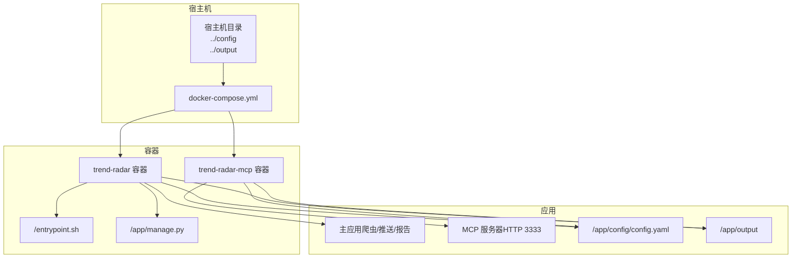
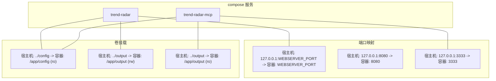
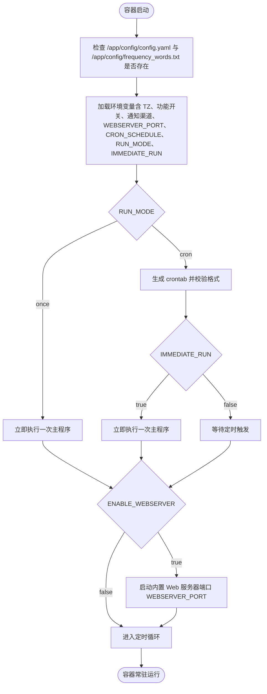
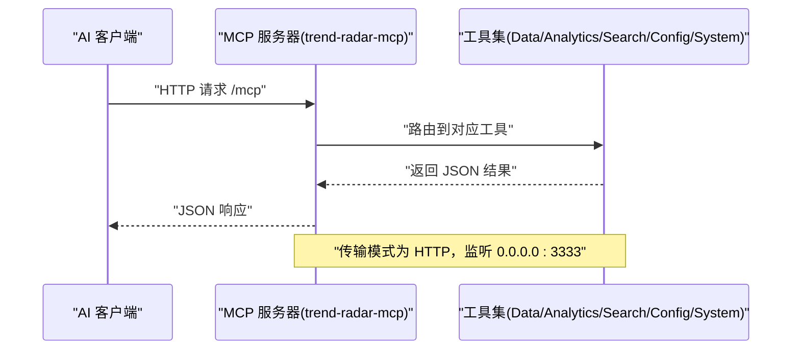
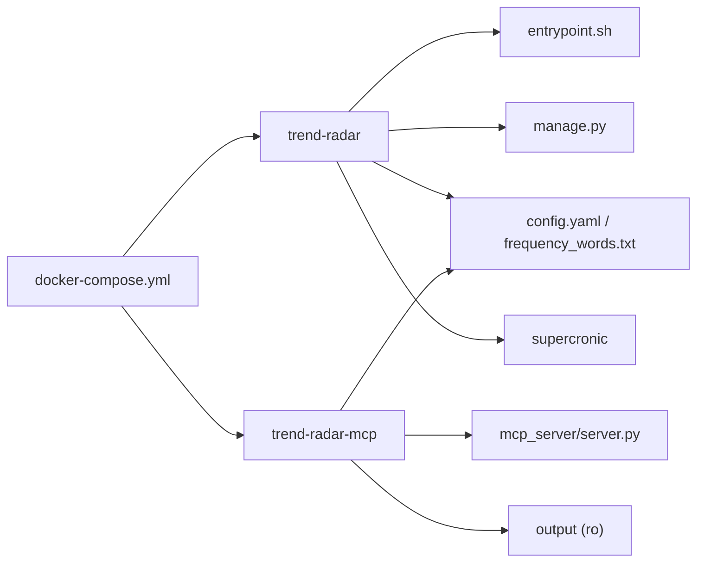

# docker-compose配置详解

<cite>
**本文引用的文件**
- [docker/docker-compose.yml](file://docker/docker-compose.yml)
- [docker/docker-compose-build.yml](file://docker/docker-compose-build.yml)
- [docker/Dockerfile](file://docker/Dockerfile)
- [docker/Dockerfile.mcp](file://docker/Dockerfile.mcp)
- [docker/entrypoint.sh](file://docker/entrypoint.sh)
- [docker/manage.py](file://docker/manage.py)
- [config/config.yaml](file://config/config.yaml)
- [config/blogger_config.yaml](file://config/blogger_config.yaml)
- [mcp_server/server.py](file://mcp_server/server.py)
- [docs/Deployment-Guide.md](file://docs/Deployment-Guide.md)
</cite>

## 目录
1. [简介](#简介)
2. [项目结构](#项目结构)
3. [核心组件](#核心组件)
4. [架构总览](#架构总览)
5. [详细组件分析](#详细组件分析)
6. [依赖关系分析](#依赖关系分析)
7. [性能与安全考量](#性能与安全考量)
8. [故障排查指南](#故障排查指南)
9. [结论](#结论)
10. [附录](#附录)

## 简介
本文件面向希望使用 docker-compose 部署 TrendRadar 的用户，聚焦两个服务：trend-radar（主应用）与 trend-radar-mcp（MCP 服务器）。文档将逐项解释 compose 文件中 image、container_name、restart 策略；ports 中 8080（主应用 Web 服务器）与 3333（MCP HTTP 服务器）的映射机制与本地回环绑定的安全考虑；volumes 中 ../config 与 ../output 的挂载方式与只读/可写权限设计；以及 environment 环境变量清单，包括 TZ、核心功能开关、运行模式、通知渠道 Webhook、Web 服务器端口 WEBSERVER_PORT 的动态注入机制，并提供实际部署示例与覆盖方式。

## 项目结构
- docker-compose.yml 定义了两个服务：trend-radar 与 trend-radar-mcp，分别指向官方镜像或本地构建镜像。
- Dockerfile 与 Dockerfile.mcp 定义了主应用与 MCP 服务的镜像构建过程。
- entrypoint.sh 负责容器启动时的环境准备、定时任务生成与 Web 服务器启动。
- manage.py 提供容器内管理命令，包括启动/停止 Web 服务器、查看状态、查看日志等。
- config/config.yaml 与 config/blogger_config.yaml 提供应用与博主监控的配置模板。
- mcp_server/server.py 定义 MCP 服务器的 HTTP 传输与工具集。

图表来源
- [docker/docker-compose.yml](file://docker/docker-compose.yml#L1-L78)
- [docker/Dockerfile](file://docker/Dockerfile#L1-L71)
- [docker/Dockerfile.mcp](file://docker/Dockerfile.mcp#L1-L24)
- [docker/entrypoint.sh](file://docker/entrypoint.sh#L1-L50)
- [docker/manage.py](file://docker/manage.py#L1-L625)
- [config/config.yaml](file://config/config.yaml#L1-L140)
- [mcp_server/server.py](file://mcp_server/server.py#L660-L782)

章节来源
- [docker/docker-compose.yml](file://docker/docker-compose.yml#L1-L78)
- [docker/docker-compose-build.yml](file://docker/docker-compose-build.yml#L1-L78)

## 核心组件
- trend-radar（主应用）
  - 使用官方镜像或本地构建镜像，容器名 trend-radar，重启策略 unless-stopped。
  - 端口映射：将宿主机的 WEBSERVER_PORT（默认 8080）映射到容器内的 Web 服务器端口。
  - 卷挂载：/app/config:ro（只读）、/app/output（可写）。
  - 环境变量：TZ、核心功能开关、运行模式、通知渠道 Webhook、Web 服务器端口 WEBSERVER_PORT 等。
- trend-radar-mcp（MCP 服务器）
  - 使用官方镜像或本地构建镜像，容器名 trend-radar-mcp，重启策略 unless-stopped。
  - 端口映射：将宿主机 3333 映射到容器 3333（HTTP 模式）。
  - 卷挂载：/app/config:ro、/app/output:ro（只读）。
  - 环境变量：TZ（默认 Asia/Shanghai）。

章节来源
- [docker/docker-compose.yml](file://docker/docker-compose.yml#L1-L78)
- [docker/docker-compose-build.yml](file://docker/docker-compose-build.yml#L1-L78)
- [docker/Dockerfile.mcp](file://docker/Dockerfile.mcp#L1-L24)
- [mcp_server/server.py](file://mcp_server/server.py#L660-L782)

## 架构总览
下图展示了两个服务在 compose 中的定义、端口映射与卷挂载关系，以及它们与宿主机目录的关系。

图表来源
- [docker/docker-compose.yml](file://docker/docker-compose.yml#L1-L78)
- [docker/docker-compose-build.yml](file://docker/docker-compose-build.yml#L1-L78)

## 详细组件分析

### trend-radar 服务（主应用）
- 镜像与容器名
  - 使用官方镜像标签 latest，容器名为 trend-radar。
- 重启策略
  - unless-stopped：容器退出后自动重启，除非显式停止。
- 端口映射
  - 宿主机绑定到 127.0.0.1，仅允许本地访问，避免外网暴露。
  - WEBSERVER_PORT 变量默认 8080，若宿主机未设置则使用 8080。
- 卷挂载
  - /app/config:ro：挂载 ../config 到容器内配置目录，只读，避免容器内修改宿主机配置。
  - /app/output：挂载 ../output 到容器内输出目录，可写，用于生成报告与数据文件。
- 环境变量（节选）
  - TZ=Asia/Shanghai：时区设置。
  - 核心功能开关：ENABLE_CRAWLER、ENABLE_NOTIFICATION、REPORT_MODE、SORT_BY_POSITION_FIRST、MAX_NEWS_PER_KEYWORD、REVERSE_CONTENT_ORDER。
  - Web 服务器：ENABLE_WEBSERVER（默认 false）、WEBSERVER_PORT（默认 8080）。
  - 多账号配置：MAX_ACCOUNTS_PER_CHANNEL。
  - 推送时间窗口：PUSH_WINDOW_ENABLED、PUSH_WINDOW_START、PUSH_WINDOW_END、PUSH_WINDOW_ONCE_PER_DAY、PUSH_WINDOW_RETENTION_DAYS。
  - 通知渠道 Webhook：FEISHU_WEBHOOK_URL、TELEGRAM_BOT_TOKEN、TELEGRAM_CHAT_ID、DINGTALK_WEBHOOK_URL、WEWORK_WEBHOOK_URL、WEWORK_MSG_TYPE、EMAIL_*、NTFY_*、BARK_URL、SLACK_WEBHOOK_URL。
  - 运行模式：CRON_SCHEDULE（默认 */5 * * * *）、RUN_MODE（默认 cron）、IMMEDIATE_RUN（默认 true）。

图表来源
- [docker/entrypoint.sh](file://docker/entrypoint.sh#L1-L50)
- [docker/manage.py](file://docker/manage.py#L1-L625)
- [docker/docker-compose.yml](file://docker/docker-compose.yml#L1-L78)

章节来源
- [docker/docker-compose.yml](file://docker/docker-compose.yml#L1-L78)
- [docker/entrypoint.sh](file://docker/entrypoint.sh#L1-L50)
- [docker/manage.py](file://docker/manage.py#L1-L625)
- [config/config.yaml](file://config/config.yaml#L1-L140)

### trend-radar-mcp 服务（MCP 服务器）
- 镜像与容器名
  - 使用官方镜像标签 latest，容器名为 trend-radar-mcp。
- 重启策略
  - unless-stopped：容器退出后自动重启。
- 端口映射
  - 宿主机绑定到 127.0.0.1:3333，仅本地访问，避免外网暴露。
- 卷挂载
  - /app/config:ro、/app/output:ro：挂载 ../config 与 ../output 为只读，避免容器内修改宿主机数据。
- 环境变量
  - TZ=Asia/Shanghai：时区设置。

图表来源
- [docker/docker-compose.yml](file://docker/docker-compose.yml#L60-L78)
- [docker/Dockerfile.mcp](file://docker/Dockerfile.mcp#L1-L24)
- [mcp_server/server.py](file://mcp_server/server.py#L660-L782)

章节来源
- [docker/docker-compose.yml](file://docker/docker-compose.yml#L60-L78)
- [docker/Dockerfile.mcp](file://docker/Dockerfile.mcp#L1-L24)
- [mcp_server/server.py](file://mcp_server/server.py#L660-L782)

### 端口映射与本地回环绑定的安全考虑
- trend-radar（主应用）
  - 宿主机端口绑定到 127.0.0.1:WEBSERVER_PORT，仅允许本机访问，避免外网暴露。
  - WEBSERVER_PORT 默认 8080，可通过环境变量覆盖。
- trend-radar-mcp（MCP 服务器）
  - 宿主机端口绑定到 127.0.0.1:3333，仅允许本机访问，避免外网暴露。
- 安全建议
  - 若需外网访问，应在宿主机上通过反向代理（如 Nginx）进行访问控制与 TLS 终止。
  - MCP 服务器默认监听 0.0.0.0:3333，compose 层面通过 127.0.0.1 限制外网访问，符合最小暴露原则。

章节来源
- [docker/docker-compose.yml](file://docker/docker-compose.yml#L1-L78)
- [docker/Dockerfile.mcp](file://docker/Dockerfile.mcp#L1-L24)
- [docs/Deployment-Guide.md](file://docs/Deployment-Guide.md#L135-L163)

### 卷挂载与权限设计
- trend-radar
  - /app/config:ro：只读挂载，避免容器内修改宿主机配置。
  - /app/output：可写挂载，用于生成报告与数据文件。
- trend-radar-mcp
  - /app/config:ro、/app/output:ro：只读挂载，避免容器内修改宿主机数据。
- 建议
  - 将 ../config 与 ../output 放置于受控目录，确保权限与备份策略完善。

章节来源
- [docker/docker-compose.yml](file://docker/docker-compose.yml#L1-L78)
- [docker/docker-compose-build.yml](file://docker/docker-compose-build.yml#L1-L78)

### 环境变量清单与动态注入机制
- 通用
  - TZ=Asia/Shanghai：时区设置。
- 核心功能开关
  - ENABLE_CRAWLER、ENABLE_NOTIFICATION、REPORT_MODE、SORT_BY_POSITION_FIRST、MAX_NEWS_PER_KEYWORD、REVERSE_CONTENT_ORDER。
- Web 服务器
  - ENABLE_WEBSERVER（默认 false）、WEBSERVER_PORT（默认 8080）。
- 多账号配置
  - MAX_ACCOUNTS_PER_CHANNEL。
- 推送时间窗口
  - PUSH_WINDOW_ENABLED、PUSH_WINDOW_START、PUSH_WINDOW_END、PUSH_WINDOW_ONCE_PER_DAY、PUSH_WINDOW_RETENTION_DAYS。
- 通知渠道 Webhook
  - FEISHU_WEBHOOK_URL、TELEGRAM_BOT_TOKEN、TELEGRAM_CHAT_ID、DINGTALK_WEBHOOK_URL、WEWORK_WEBHOOK_URL、WEWORK_MSG_TYPE、EMAIL_*、NTFY_*、BARK_URL、SLACK_WEBHOOK_URL。
- 运行模式
  - CRON_SCHEDULE（默认 */5 * * * *）、RUN_MODE（默认 cron）、IMMEDIATE_RUN（默认 true）。
- 动态注入机制
  - WEBSERVER_PORT 由 compose 中的环境变量 WEBSERVER_PORT 注入，若未设置则使用默认 8080。
  - entrypoint.sh 与 manage.py 会读取 WEBSERVER_PORT 以启动 Web 服务器。
  - 其他变量通过 compose 的 environment 列表注入，容器内程序按需读取。

章节来源
- [docker/docker-compose.yml](file://docker/docker-compose.yml#L1-L78)
- [docker/docker-compose-build.yml](file://docker/docker-compose-build.yml#L1-L78)
- [docker/entrypoint.sh](file://docker/entrypoint.sh#L1-L50)
- [docker/manage.py](file://docker/manage.py#L1-L625)
- [config/config.yaml](file://config/config.yaml#L1-L140)

## 依赖关系分析
- trend-radar 依赖
  - 配置文件：/app/config/config.yaml、/app/config/frequency_words.txt。
  - 定时任务：supercronic（由 entrypoint.sh 生成并校验 crontab）。
  - Web 服务器：manage.py 提供启动/停止与状态查询。
- trend-radar-mcp 依赖
  - MCP 服务器：mcp_server/server.py 提供 HTTP 传输与工具集。
  - 配置与数据：/app/config、/app/output（只读）。

图表来源
- [docker/docker-compose.yml](file://docker/docker-compose.yml#L1-L78)
- [docker/entrypoint.sh](file://docker/entrypoint.sh#L1-L50)
- [docker/manage.py](file://docker/manage.py#L1-L625)
- [mcp_server/server.py](file://mcp_server/server.py#L660-L782)

章节来源
- [docker/docker-compose.yml](file://docker/docker-compose.yml#L1-L78)
- [docker/entrypoint.sh](file://docker/entrypoint.sh#L1-L50)
- [docker/manage.py](file://docker/manage.py#L1-L625)
- [mcp_server/server.py](file://mcp_server/server.py#L660-L782)

## 性能与安全考量
- 性能
  - 定时任务：CRON_SCHEDULE 默认每 5 分钟执行一次，可根据需求调整。
  - Web 服务器：ENABLE_WEBSERVER=false 时不会启动，减少资源占用。
- 安全
  - 端口绑定到 127.0.0.1，避免外网直接访问。
  - 通知渠道 Webhook 为敏感信息，建议通过环境变量或密钥管理工具注入，避免硬编码。
  - 卷挂载权限：确保 ../config 与 ../output 的宿主机权限与 SELinux/AppArmor 策略正确配置。

[本节为通用指导，不直接分析具体文件]

## 故障排查指南
- 容器启动后 Web 服务器未启动
  - 检查 ENABLE_WEBSERVER 是否为 true，WEBSERVER_PORT 是否正确。
  - 使用 manage.py 启动/停止 Web 服务器并查看状态。
- 定时任务未执行
  - 检查 CRON_SCHEDULE 格式与 RUN_MODE。
  - 使用 manage.py status 查看 PID 1 是否为 supercronic，以及 crontab 内容。
- MCP 服务器无法访问
  - 确认 trend-radar-mcp 容器已运行，端口 3333 是否被占用。
  - 通过宿主机 127.0.0.1:3333 访问，避免外网直连。
- 配置文件缺失
  - 确保 ../config 下存在 config.yaml 与 frequency_words.txt。

章节来源
- [docker/entrypoint.sh](file://docker/entrypoint.sh#L1-L50)
- [docker/manage.py](file://docker/manage.py#L1-L625)
- [docker/docker-compose.yml](file://docker/docker-compose.yml#L1-L78)

## 结论
本文围绕 docker-compose 中 trend-radar 与 trend-radar-mcp 两个服务，系统梳理了镜像与容器名、重启策略、端口映射（含本地回环绑定的安全考量）、卷挂载（只读/可写权限设计）与环境变量（含 TZ、核心功能开关、运行模式、通知渠道 Webhook、WEBSERVER_PORT 动态注入机制）。通过实际部署示例与故障排查建议，帮助用户在本地或私有环境中安全、稳定地运行 TrendRadar 与 MCP 服务。

[本节为总结，不直接分析具体文件]

## 附录

### 实际部署示例与变量覆盖方式
- 使用 .env 文件覆盖变量
  - 在 compose 目录下创建 .env 文件，设置 WEBSERVER_PORT、ENABLE_WEBSERVER、CRON_SCHEDULE、RUN_MODE、IMMEDIATE_RUN、FEISHU_WEBHOOK_URL、TELEGRAM_*、DINGTALK_WEBHOOK_URL、WEWORK_*、EMAIL_*、NTFY_*、BARK_URL、SLACK_WEBHOOK_URL 等。
  - compose 会自动读取 .env 中的同名变量进行覆盖。
- 使用命令行覆盖变量
  - 在 docker compose up 前，通过环境变量传入 WEBSERVER_PORT、ENABLE_WEBSERVER 等。
  - 例如：WEBSERVER_PORT=8080 docker compose up -d
- 使用本地构建镜像
  - 使用 docker-compose-build.yml，通过 build 指令构建镜像，再运行服务。

章节来源
- [docker/docker-compose.yml](file://docker/docker-compose.yml#L1-L78)
- [docker/docker-compose-build.yml](file://docker/docker-compose-build.yml#L1-L78)
- [docs/Deployment-Guide.md](file://docs/Deployment-Guide.md#L192-L223)