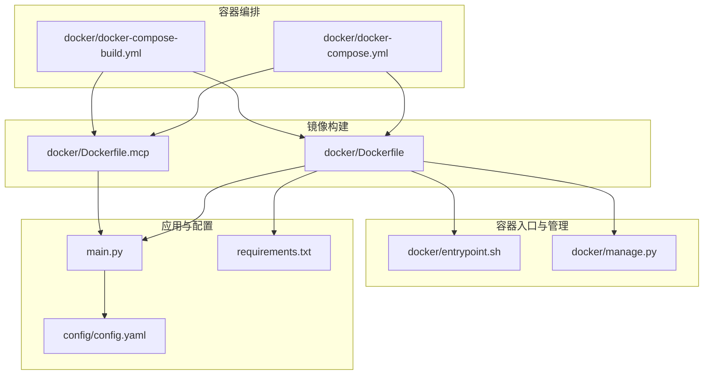
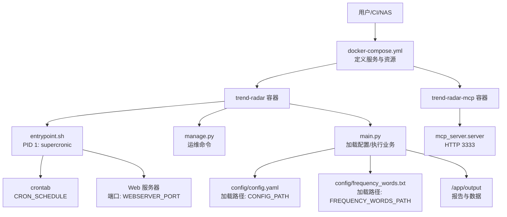
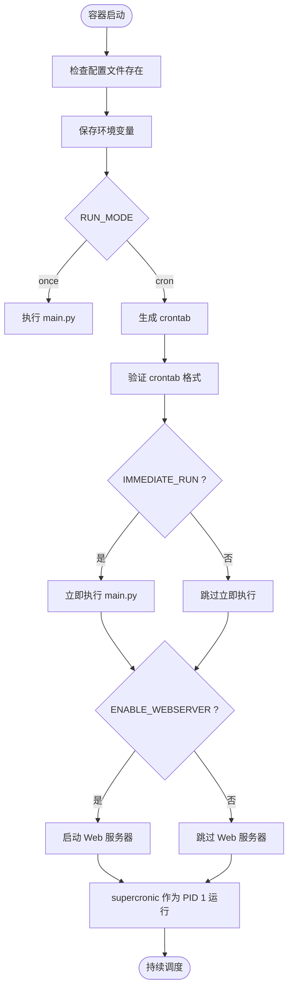
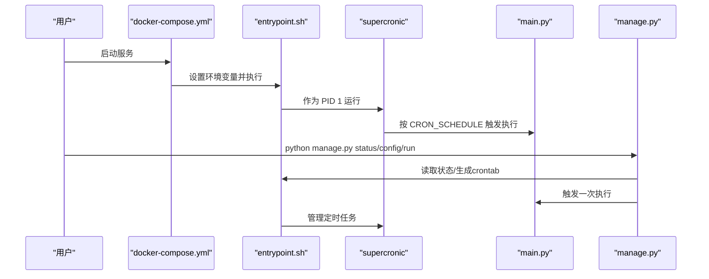
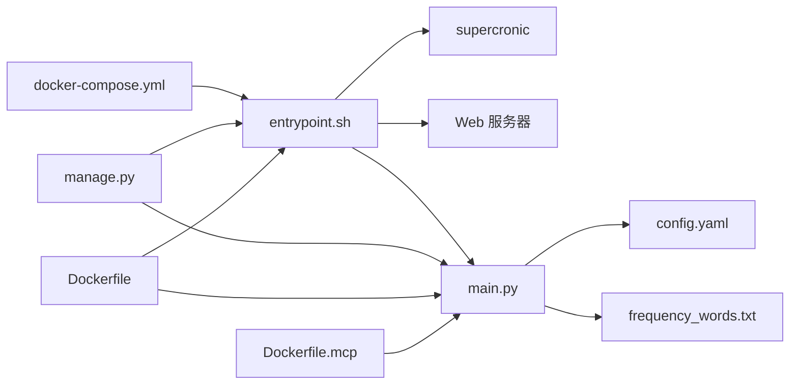

# 容器化部署集成

<cite>
**本文引用的文件**
- [docker/docker-compose.yml](file://docker/docker-compose.yml)
- [docker/docker-compose-build.yml](file://docker/docker-compose-build.yml)
- [docker/Dockerfile](file://docker/Dockerfile)
- [docker/Dockerfile.mcp](file://docker/Dockerfile.mcp)
- [docker/entrypoint.sh](file://docker/entrypoint.sh)
- [docker/manage.py](file://docker/manage.py)
- [config/config.yaml](file://config/config.yaml)
- [main.py](file://main.py)
- [requirements.txt](file://requirements.txt)
- [README-EN.md](file://README-EN.md)
</cite>

## 目录
1. [简介](#简介)
2. [项目结构](#项目结构)
3. [核心组件](#核心组件)
4. [架构总览](#架构总览)
5. [详细组件分析](#详细组件分析)
6. [依赖关系分析](#依赖关系分析)
7. [性能与可扩展性](#性能与可扩展性)
8. [故障排查指南](#故障排查指南)
9. [结论](#结论)
10. [附录](#附录)

## 简介
本文件面向TrendRadar的Docker容器化部署，聚焦docker-compose.yml中trend-radar与trend-radar-mcp两个服务的配置与运行机制。内容涵盖端口映射（8080与3333）、卷挂载（config与output目录）、环境变量注入与覆盖机制、镜像构建与多阶段策略、以及manage.py在容器生命周期管理中的作用。同时总结容器化部署带来的环境一致性、依赖隔离与快速扩展等优势。

## 项目结构
围绕容器化部署的关键文件与职责如下：
- docker/docker-compose.yml：定义两个服务的镜像、端口、卷与环境变量，提供默认端口与卷挂载策略
- docker/docker-compose-build.yml：本地构建版本，支持通过build指令从Dockerfile构建镜像
- docker/Dockerfile：主服务镜像构建，包含supercronic定时器、Python依赖安装、入口脚本与默认环境变量
- docker/Dockerfile.mcp：MCP分析服务镜像，暴露3333端口并以HTTP模式启动
- docker/entrypoint.sh：容器启动入口，负责校验配置、生成crontab、按RUN_MODE启动supercronic或一次性执行，并可选启动Web服务器
- docker/manage.py：容器内管理工具，提供状态查询、配置查看、手动执行、Web服务器启停、日志查看等运维能力
- config/config.yaml：应用主配置，包含爬虫、报告、通知、权重与平台等配置项
- main.py：应用主程序，负责加载配置（支持环境变量覆盖）、执行爬取与推送、生成报告
- requirements.txt：Python依赖清单
- README-EN.md：官方部署与使用说明，包含环境变量覆盖机制、服务管理命令与Web服务器访问路径

图表来源
- [docker/docker-compose.yml](file://docker/docker-compose.yml#L1-L74)
- [docker/docker-compose-build.yml](file://docker/docker-compose-build.yml#L1-L78)
- [docker/Dockerfile](file://docker/Dockerfile#L1-L71)
- [docker/Dockerfile.mcp](file://docker/Dockerfile.mcp#L1-L24)
- [docker/entrypoint.sh](file://docker/entrypoint.sh#L1-L50)
- [docker/manage.py](file://docker/manage.py#L1-L625)
- [main.py](file://main.py#L160-L210)
- [config/config.yaml](file://config/config.yaml#L1-L140)
- [requirements.txt](file://requirements.txt#L1-L6)

章节来源
- [docker/docker-compose.yml](file://docker/docker-compose.yml#L1-L74)
- [docker/docker-compose-build.yml](file://docker/docker-compose-build.yml#L1-L78)
- [docker/Dockerfile](file://docker/Dockerfile#L1-L71)
- [docker/Dockerfile.mcp](file://docker/Dockerfile.mcp#L1-L24)
- [docker/entrypoint.sh](file://docker/entrypoint.sh#L1-L50)
- [docker/manage.py](file://docker/manage.py#L1-L625)
- [config/config.yaml](file://config/config.yaml#L1-L140)
- [main.py](file://main.py#L160-L210)
- [requirements.txt](file://requirements.txt#L1-L6)

## 核心组件
- trend-radar服务
  - 镜像：wantcat/trendradar:latest
  - 端口：默认映射127.0.0.1:8080:8080（可通过WEBSERVER_PORT覆盖）
  - 卷：挂载../config至/app/config:ro，../output至/app/output
  - 环境变量：覆盖config.yaml中的多项配置，如ENABLE_CRAWLER、ENABLE_NOTIFICATION、REPORT_MODE、SORT_BY_POSITION_FIRST、MAX_NEWS_PER_KEYWORD、REVERSE_CONTENT_ORDER、ENABLE_WEBSERVER、WEBSERVER_PORT、PUSH_WINDOW_*、各通知渠道Webhook、邮件配置、NTFY/Bark/Slack配置、CRON_SCHEDULE、RUN_MODE、IMMEDIATE_RUN等
- trend-radar-mcp服务
  - 镜像：wantcat/trendradar-mcp:latest
  - 端口：127.0.0.1:3333:3333
  - 卷：挂载../config至/app/config:ro，../output至/app/output:ro
  - 环境变量：TZ=Asia/Shanghai
- 入口脚本与管理工具
  - entrypoint.sh：根据RUN_MODE生成crontab并由supercronic作为PID 1运行；可选立即执行一次与启动Web服务器
  - manage.py：提供status/config/files/logs/restart/start_webserver/stop_webserver/webserver_status等运维命令

章节来源
- [docker/docker-compose.yml](file://docker/docker-compose.yml#L1-L74)
- [docker/docker-compose-build.yml](file://docker/docker-compose-build.yml#L1-L78)
- [docker/entrypoint.sh](file://docker/entrypoint.sh#L1-L50)
- [docker/manage.py](file://docker/manage.py#L1-L625)

## 架构总览
下图展示了容器化部署的整体交互：compose文件定义服务与资源，镜像构建提供运行时环境，入口脚本负责调度与Web服务器启停，应用主程序加载配置并执行业务逻辑，配置文件与输出目录通过卷持久化。

图表来源
- [docker/docker-compose.yml](file://docker/docker-compose.yml#L1-L74)
- [docker/entrypoint.sh](file://docker/entrypoint.sh#L1-L50)
- [docker/manage.py](file://docker/manage.py#L1-L625)
- [main.py](file://main.py#L160-L210)
- [config/config.yaml](file://config/config.yaml#L1-L140)

## 详细组件分析

### trend-radar服务配置详解
- 端口映射
  - 默认将容器内8080端口映射到宿主机127.0.0.1:8080，WEBSERVER_PORT可覆盖
  - 通过环境变量WEBSERVER_PORT实现灵活端口配置
- 卷挂载
  - config目录以只读方式挂载至/app/config，确保配置文件在容器内不可被意外修改
  - output目录挂载至/app/output，用于持久化生成的HTML报告与数据
- 环境变量注入与覆盖机制
  - compose文件中大量环境变量用于覆盖config.yaml中的配置项，例如：
    - 爬虫开关与行为：ENABLE_CRAWLER、crawler.enable_crawler
    - 报告模式与排序：REPORT_MODE、report.mode、SORT_BY_POSITION_FIRST、MAX_NEWS_PER_KEYWORD、REVERSE_CONTENT_ORDER
    - 通知渠道：FEISHU_WEBHOOK_URL、TELEGRAM_*、DINGTALK_WEBHOOK_URL、WEWORK_*、EMAIL_*、NTFY_*、BARK_URL、SLACK_WEBHOOK_URL
    - 推送时间窗口：PUSH_WINDOW_ENABLED、PUSH_WINDOW_START、PUSH_WINDOW_END、PUSH_WINDOW_ONCE_PER_DAY、PUSH_WINDOW_RETENTION_DAYS
    - 运行模式：CRON_SCHEDULE、RUN_MODE、IMMEDIATE_RUN
  - main.py中明确实现了“环境变量优先于配置文件”的覆盖逻辑，确保在Docker环境下能通过环境变量快速调整行为
- Web服务器
  - ENABLE_WEBSERVER=true时，entrypoint.sh会在supercronic启动前启动Web服务器，绑定0.0.0.0并限制在output目录，仅提供静态文件访问

章节来源
- [docker/docker-compose.yml](file://docker/docker-compose.yml#L1-L74)
- [main.py](file://main.py#L160-L210)
- [README-EN.md](file://README-EN.md#L2045-L2120)

### trend-radar-mcp服务配置详解
- 端口与暴露
  - 容器内暴露3333端口，compose文件将其映射到宿主机127.0.0.1:3333:3333
- 卷与环境
  - config目录只读挂载，output目录只读挂载，便于MCP服务读取配置与历史报告
  - 环境变量仅设置时区TZ=Asia/Shanghai
- 运行方式
  - Dockerfile.mcp以HTTP模式启动mcp_server.server，监听0.0.0.0:3333，便于外部客户端连接

章节来源
- [docker/docker-compose.yml](file://docker/docker-compose.yml#L60-L74)
- [docker/Dockerfile.mcp](file://docker/Dockerfile.mcp#L1-L24)

### 入口脚本与定时调度
- 启动流程
  - 校验/app/config/config.yaml与/app/config/frequency_words.txt是否存在
  - 保存环境变量至/etc/environment
  - 根据RUN_MODE：
    - once：直接执行main.py
    - cron：生成/tmp/crontab，使用supercronic作为PID 1运行；若IMMEDIATE_RUN=true则立即执行一次；若ENABLE_WEBSERVER=true则启动Web服务器
- 定时器
  - 使用supercronic替代传统cron，具备更好的信号处理与日志透传能力

图表来源
- [docker/entrypoint.sh](file://docker/entrypoint.sh#L1-L50)

章节来源
- [docker/entrypoint.sh](file://docker/entrypoint.sh#L1-L50)

### manage.py在容器生命周期管理中的作用
- 主要功能
  - run：手动执行一次爬虫
  - status：检查supercronic是否为PID 1、显示CRON_SCHEDULE与RUN_MODE、检查关键文件与配置文件、显示容器运行时间
  - config：显示当前生效的环境变量与crontab内容
  - files：列出最近生成的报告文件（HTML与TXT）
  - logs：尝试读取PID 1的标准输出/错误流，否则建议使用docker logs
  - restart：说明supercronic为PID 1，需重启容器修复
  - start_webserver/stop_webserver/webserver_status：管理Web服务器启停与状态
  - help：提供常用操作指南与示例
- 与compose的关系
  - compose中WEBSERVER_PORT与ENABLE_WEBSERVER等环境变量通过entrypoint.sh生效
  - manage.py提供便捷运维命令，无需进入容器内部即可完成常见维护操作

图表来源
- [docker/docker-compose.yml](file://docker/docker-compose.yml#L1-L74)
- [docker/entrypoint.sh](file://docker/entrypoint.sh#L1-L50)
- [docker/manage.py](file://docker/manage.py#L1-L625)
- [main.py](file://main.py#L160-L210)

章节来源
- [docker/manage.py](file://docker/manage.py#L1-L625)
- [docker/entrypoint.sh](file://docker/entrypoint.sh#L1-L50)

### 镜像构建与多阶段策略
- trend-radar镜像（Dockerfile）
  - 基于python:3.10-slim，下载并校验supercronic二进制，安装依赖requirements.txt
  - 复制main.py与manage.py，复制entrypoint.sh并转换换行符，创建/app/{config,output}目录
  - 设置默认环境变量：CONFIG_PATH=/app/config/config.yaml、FREQUENCY_WORDS_PATH=/app/config/frequency_words.txt、PYTHONUNBUFFERED=1
  - 入口为/entrypoint.sh
- trend-radar-mcp镜像（Dockerfile.mcp）
  - 基于python:3.10-slim，安装依赖requirements.txt
  - 复制mcp_server/源码，创建/app/{config,output}目录
  - 设置默认环境变量：CONFIG_PATH=/app/config/config.yaml、FREQUENCY_WORDS_PATH=/app/config/frequency_words.txt、PYTHONUNBUFFERED=1
  - EXPOSE 3333，CMD以HTTP模式启动mcp_server.server
- 多阶段策略
  - 当前镜像构建采用单阶段，通过精简基础镜像与依赖安装减少镜像体积
  - 若未来需要进一步优化，可在Dockerfile中引入多阶段构建（如使用构建阶段安装依赖，运行阶段仅拷贝必要文件）

章节来源
- [docker/Dockerfile](file://docker/Dockerfile#L1-L71)
- [docker/Dockerfile.mcp](file://docker/Dockerfile.mcp#L1-L24)
- [requirements.txt](file://requirements.txt#L1-L6)

### 环境变量覆盖config.yaml的实现原理
- main.py中load_config函数明确体现了“环境变量优先于配置文件”的覆盖逻辑：
  - 读取CONFIG_PATH确定配置文件路径
  - 逐项从config.yaml读取默认值，再用os.environ.get()读取同名环境变量进行覆盖
  - 对布尔值与数值类型进行显式转换，确保容器环境下的灵活性
- README-EN.md进一步明确了覆盖优先级与可用环境变量清单，便于在NAS/Synology等Docker环境中直接通过界面注入变量

章节来源
- [main.py](file://main.py#L160-L210)
- [README-EN.md](file://README-EN.md#L2045-L2120)

## 依赖关系分析
- 组件耦合
  - trend-radar服务强依赖entrypoint.sh与supercronic，实现定时调度与Web服务器启停
  - main.py依赖config.yaml与frequency_words.txt，且受环境变量覆盖影响
  - manage.py作为运维辅助工具，与entrypoint.sh和main.py形成互补
- 外部依赖
  - Python依赖来自requirements.txt
  - MCP服务依赖fastmcp与websockets等库
- 潜在循环依赖
  - 未发现直接循环依赖；compose文件仅声明服务间独立，MCP服务可单独启动

图表来源
- [docker/docker-compose.yml](file://docker/docker-compose.yml#L1-L74)
- [docker/entrypoint.sh](file://docker/entrypoint.sh#L1-L50)
- [docker/manage.py](file://docker/manage.py#L1-L625)
- [main.py](file://main.py#L160-L210)
- [config/config.yaml](file://config/config.yaml#L1-L140)

章节来源
- [docker/docker-compose.yml](file://docker/docker-compose.yml#L1-L74)
- [docker/entrypoint.sh](file://docker/entrypoint.sh#L1-L50)
- [docker/manage.py](file://docker/manage.py#L1-L625)
- [main.py](file://main.py#L160-L210)
- [config/config.yaml](file://config/config.yaml#L1-L140)

## 性能与可扩展性
- 环境一致性
  - 统一的基础镜像与依赖清单，确保不同环境下的行为一致
- 依赖隔离
  - Python虚拟环境与依赖安装在镜像构建阶段完成，避免宿主机污染
- 快速扩展
  - 通过compose文件可独立启动trend-radar与trend-radar-mcp，满足不同场景需求
  - Web服务器仅提供静态文件访问，不承载业务逻辑，降低资源占用
- 定时调度稳定性
  - 使用supercronic替代传统cron，具备更好的信号处理与日志透传能力，提升可观测性

[本节为通用性能讨论，不直接分析具体文件]

## 故障排查指南
- 定时任务不执行
  - 使用manage.py status检查supercronic是否为PID 1、CRON_SCHEDULE与RUN_MODE是否正确、crontab文件是否存在
  - 如需立即测试，使用manage.py run手动执行一次
- Web服务器无法访问
  - 确认ENABLE_WEBSERVER=true且WEBSERVER_PORT已正确设置
  - 使用manage.py start_webserver/stop_webserver/webserver_status进行启停与状态检查
- 配置未生效
  - 确认环境变量覆盖优先级高于config.yaml
  - 使用manage.py config查看当前生效的环境变量与crontab内容
- 日志定位
  - 使用manage.py logs查看PID 1输出，或使用docker logs trend-radar
- 重启与恢复
  - manage.py restart提示supercronic为PID 1，需通过docker restart trend-radar进行重启

章节来源
- [docker/manage.py](file://docker/manage.py#L1-L625)
- [docker/entrypoint.sh](file://docker/entrypoint.sh#L1-L50)
- [README-EN.md](file://README-EN.md#L2185-L2218)

## 结论
通过docker-compose.yml中trend-radar与trend-radar-mcp两个服务的合理配置，结合entrypoint.sh与manage.py提供的生命周期管理能力，TrendRadar实现了高度可定制、可观察与可扩展的容器化部署方案。环境变量覆盖机制使得在Docker环境下能够灵活适配不同部署场景，而supercronic与Web服务器的配合则提供了稳定的定时调度与便捷的报告访问体验。

[本节为总结性内容，不直接分析具体文件]

## 附录
- 常用命令参考
  - 启动/停止/查看日志：参见README-EN.md中的服务管理命令
  - Web服务器访问路径：参见README-EN.md中的Web报告访问路径说明
- 数据持久化
  - output目录挂载用于持久化生成的报告与数据，即使容器重启或移除仍可保留

章节来源
- [README-EN.md](file://README-EN.md#L2185-L2244)