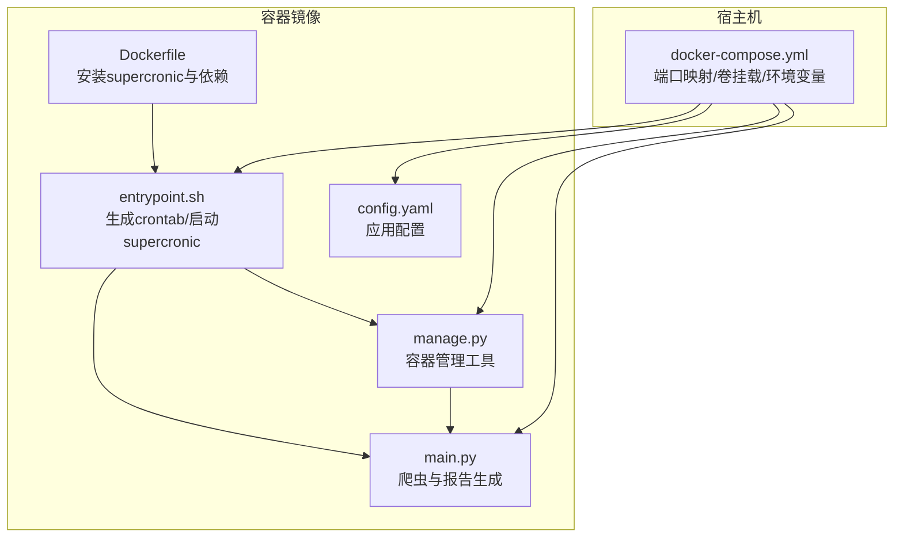
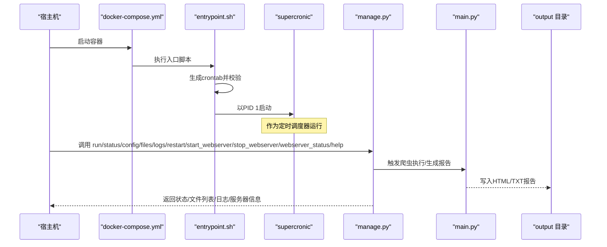
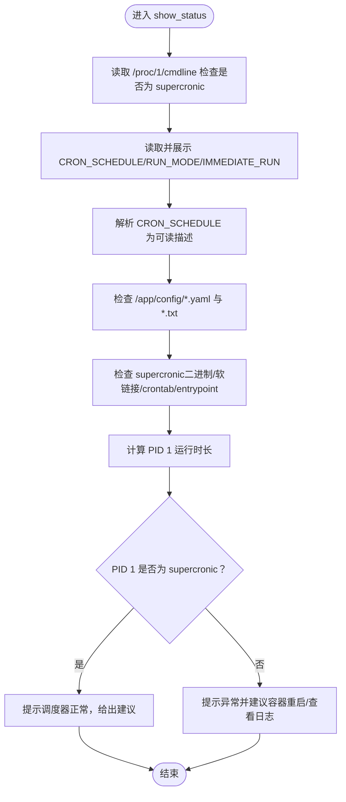
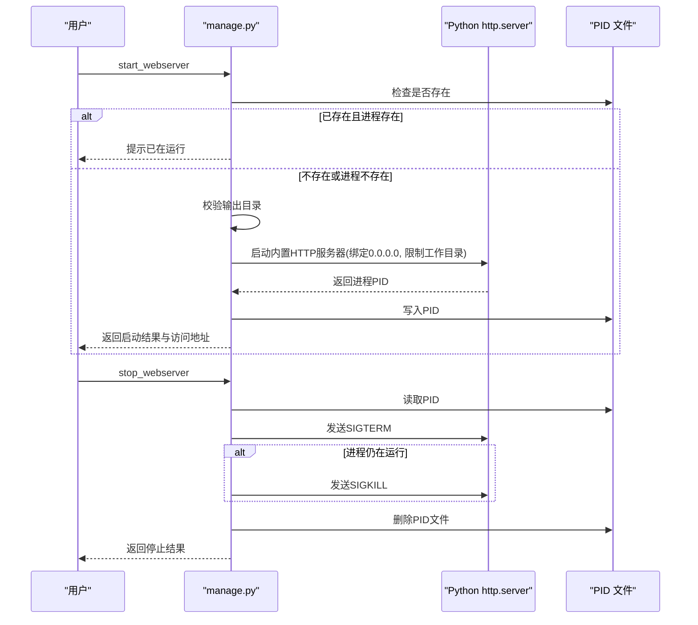
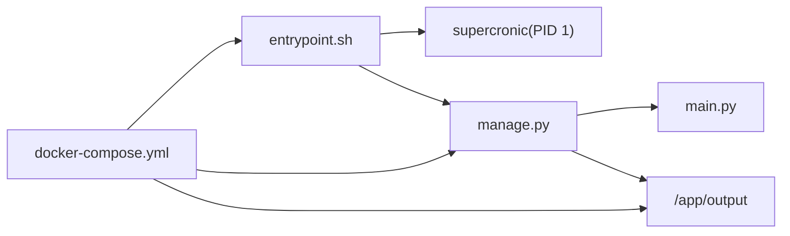

# 容器运行时管理

<cite>
**本文引用的文件**
- [docker/manage.py](file://docker/manage.py)
- [docker/entrypoint.sh](file://docker/entrypoint.sh)
- [docker/docker-compose.yml](file://docker/docker-compose.yml)
- [docker/Dockerfile](file://docker/Dockerfile)
- [main.py](file://main.py)
- [config/config.yaml](file://config/config.yaml)
</cite>

## 目录
1. [简介](#简介)
2. [项目结构](#项目结构)
3. [核心组件](#核心组件)
4. [架构总览](#架构总览)
5. [详细组件分析](#详细组件分析)
6. [依赖关系分析](#依赖关系分析)
7. [性能考量](#性能考量)
8. [故障排查指南](#故障排查指南)
9. [结论](#结论)
10. [附录](#附录)

## 简介
本文件面向容器运行时运维与开发人员，围绕 docker/manage.py 工具的12项核心功能展开，重点说明：
- manual_run 如何在容器内手动触发一次爬虫执行；
- show_status 对 PID 1 进程（supercronic）、环境变量、配置文件与关键二进制的健康检查机制；
- show_config 如何安全展示环境变量并对 Webhook/Token 进行脱敏；
- show_files 如何遍历 output 目录并展示最近生成的报告文件；
- start_webserver 与 stop_webserver 如何在容器内启动/停止 Python HTTP 服务器并管理 PID 文件；
- show_logs 的实时日志查看能力；
- restart_supercronic 无法直接重启 PID 1 的原因及容器级重启指引。

## 项目结构
容器运行时由入口脚本、定时调度器、主程序与管理工具共同组成。入口脚本负责根据运行模式生成 crontab、验证并启动 supercronic；管理工具提供运维与诊断能力。

图表来源
- [docker/Dockerfile](file://docker/Dockerfile#L1-L71)
- [docker/entrypoint.sh](file://docker/entrypoint.sh#L1-L50)
- [docker/manage.py](file://docker/manage.py#L1-L625)
- [docker/docker-compose.yml](file://docker/docker-compose.yml#L1-L74)
- [main.py](file://main.py#L1-L200)
- [config/config.yaml](file://config/config.yaml#L1-L140)

章节来源
- [docker/Dockerfile](file://docker/Dockerfile#L1-L71)
- [docker/entrypoint.sh](file://docker/entrypoint.sh#L1-L50)
- [docker/docker-compose.yml](file://docker/docker-compose.yml#L1-L74)

## 核心组件
本节概述 manage.py 的12项核心功能及其职责边界：
- run：手动执行一次爬虫
- status：容器健康检查（PID 1、环境变量、配置文件、关键文件、运行时长）
- config：安全展示环境变量与 crontab 内容
- files：列出 output 目录下最近生成的报告文件
- logs：实时查看 PID 1 输出
- restart：说明无法直接重启 PID 1，建议容器级重启
- start_webserver：启动 Python 内置 HTTP 服务器托管 output 目录，含 PID 文件管理
- stop_webserver：停止托管服务并清理 PID 文件
- webserver_status：查询 Web 服务器运行状态
- help：打印命令列表与常用操作指南
- 其他内部工具：命令执行封装、cron 表达式解析

章节来源
- [docker/manage.py](file://docker/manage.py#L1-L625)

## 架构总览
容器启动流程与管理工具交互如下：

图表来源
- [docker/entrypoint.sh](file://docker/entrypoint.sh#L1-L50)
- [docker/manage.py](file://docker/manage.py#L1-L625)
- [main.py](file://main.py#L1-L200)

## 详细组件分析

### manual_run：手动触发一次爬虫执行
- 功能要点
  - 在 /app 工作目录下调用主程序，不捕获输出，直接将子进程输出透传至容器标准输出。
  - 成功/失败分别打印确认/错误信息。
- 适用场景
  - 容器内快速验证程序是否能正常执行一次爬虫与报告生成。
- 注意事项
  - 若主程序抛出异常或返回非零退出码，将被识别为失败。

章节来源
- [docker/manage.py](file://docker/manage.py#L31-L44)
- [main.py](file://main.py#L1-L200)

### show_status：容器健康检查与状态汇总
- PID 1 检查
  - 读取 /proc/1/cmdline 判断是否为 supercronic，若不是则提示异常并建议容器级重启。
- 环境变量检查
  - 展示 CRON_SCHEDULE、RUN_MODE、IMMEDIATE_RUN 等关键变量，并解析 CRON_SCHEDULE 为人类可读描述。
- 配置文件检查
  - 校验 /app/config/config.yaml 与 /app/config/frequency_words.txt 是否存在。
- 关键文件检查
  - 校验 supercronic 二进制、软链接、/tmp/crontab、/entrypoint.sh 是否存在；对 crontab 显示其内容。
- 运行时长
  - 通过 /proc/1/stat 与 /proc/stat 计算 PID 1 启动时间并换算为小时/分钟。
- 总结与建议
  - 若 supercronic 正常运行，给出调度模式提示与常见问题排查建议；否则建议容器级重启并查看日志。

图表来源
- [docker/manage.py](file://docker/manage.py#L127-L271)
- [docker/entrypoint.sh](file://docker/entrypoint.sh#L1-L50)

章节来源
- [docker/manage.py](file://docker/manage.py#L127-L271)

### show_config：安全展示环境变量与 crontab
- 环境变量展示
  - 列举 CRON_SCHEDULE、RUN_MODE、IMMEDIATE_RUN、各类 Webhook/Token/Key 等。
  - 对包含敏感关键字的变量进行脱敏处理（仅显示前缀与掩码）。
- crontab 内容
  - 若 /tmp/crontab 存在，读取并展示其内容；否则提示不存在。

章节来源
- [docker/manage.py](file://docker/manage.py#L273-L313)
- [docker/entrypoint.sh](file://docker/entrypoint.sh#L1-L50)

### show_files：输出文件浏览
- 目录结构
  - output 下按日期分目录，每个日期目录包含 html 与 txt 两个子目录。
- 文件筛选
  - 仅展示最近2天的日期目录，每个子目录最多列出最近3个文件。
  - 显示文件名、大小（KB）与修改时间（时分）。
- 边界处理
  - 若 output 目录不存在或为空，给出相应提示。

章节来源
- [docker/manage.py](file://docker/manage.py#L315-L351)
- [main.py](file://main.py#L3773-L5412)

### start_webserver / stop_webserver：HTTP 服务器托管与 PID 管理
- 启动逻辑
  - 检查是否已有 PID 文件且对应进程存在；若存在则提示已在运行并返回。
  - 校验服务目录是否存在；不存在则报错。
  - 使用 Python 内置 http.server，在绑定到 0.0.0.0 的前提下限制工作目录为输出目录，避免越权访问。
  - 启动后短暂等待并检查进程状态，成功则写入 PID 文件。
- 停止逻辑
  - 读取 PID 文件，尝试 SIGTERM；若仍存活则强制 SIGKILL。
  - 清理 PID 文件，处理进程不存在或文件损坏等情况。
- 访问方式
  - 默认端口来自环境变量 WEBSERVER_PORT（默认 8080），容器内访问 http://localhost:PORT。

图表来源
- [docker/manage.py](file://docker/manage.py#L403-L506)
- [docker/docker-compose.yml](file://docker/docker-compose.yml#L1-L74)

章节来源
- [docker/manage.py](file://docker/manage.py#L403-L506)
- [docker/docker-compose.yml](file://docker/docker-compose.yml#L1-L74)

### show_logs：实时日志查看
- 优先尝试读取 PID 1 的标准输出/错误文件描述符，实现近实时日志流。
- 若无法定位到标准文件描述符，提示使用 docker logs 命令查看完整日志。

章节来源
- [docker/manage.py](file://docker/manage.py#L353-L377)

### restart_supercronic：为何无法直接重启 PID 1
- 原因
  - PID 1 是容器的初始化进程，通常由容器运行时负责生命周期管理；直接向 PID 1 发送信号或重启其可执行文件在大多数情况下不可行。
- 建议
  - 通过容器级重启修复异常状态，例如使用 docker restart trend-radar。

章节来源
- [docker/manage.py](file://docker/manage.py#L379-L401)
- [docker/entrypoint.sh](file://docker/entrypoint.sh#L1-L50)

## 依赖关系分析
- manage.py 与入口脚本
  - 入口脚本负责生成 crontab 并以 supercronic 作为 PID 1 运行；manage.py 通过 /proc/1/cmdline 与 /tmp/crontab 等路径与之交互。
- manage.py 与主程序
  - run/status 等功能最终调用主程序以生成报告或检查状态；输出目录由主程序写入。
- compose 与 manage.py
  - compose 提供端口映射与卷挂载，使 manage.py 的 Web 服务器可从宿主机访问；同时注入环境变量供 manage.py 读取。

图表来源
- [docker/entrypoint.sh](file://docker/entrypoint.sh#L1-L50)
- [docker/manage.py](file://docker/manage.py#L1-L625)
- [docker/docker-compose.yml](file://docker/docker-compose.yml#L1-L74)
- [main.py](file://main.py#L1-L200)

章节来源
- [docker/entrypoint.sh](file://docker/entrypoint.sh#L1-L50)
- [docker/manage.py](file://docker/manage.py#L1-L625)
- [docker/docker-compose.yml](file://docker/docker-compose.yml#L1-L74)

## 性能考量
- 日志查看
  - 直接读取 /proc/1/fd/* 会阻塞并占用资源，建议在生产环境中优先使用 docker logs。
- Web 服务器
  - 内置 http.server 适合临时调试；生产建议使用反向代理或专用静态服务器。
- 文件扫描
  - show_files 仅展示最近2天与最近3个文件，避免大规模目录扫描带来的 IO 压力。

## 故障排查指南
- 定时任务不执行
  - 使用 status 检查 PID 1 是否为 supercronic；核对 CRON_SCHEDULE 与 /tmp/crontab 内容；必要时通过容器级重启修复。
- Web 服务器无法访问
  - 使用 webserver_status 检查 PID 文件与进程状态；确认端口映射与卷挂载；如 PID 文件异常，先 stop_webserver 再 start_webserver。
- 日志无法实时查看
  - 使用 show_logs 或 docker logs；若容器内无法直接读取，优先使用 docker logs。
- 配置泄露风险
  - 使用 show_config 查看环境变量时，敏感字段已被脱敏；如需完整信息，建议在受控环境下查看。

章节来源
- [docker/manage.py](file://docker/manage.py#L127-L271)
- [docker/manage.py](file://docker/manage.py#L353-L377)
- [docker/manage.py](file://docker/manage.py#L403-L506)

## 结论
docker/manage.py 提供了覆盖“手动执行、健康检查、配置展示、文件浏览、日志查看、服务启停、状态查询”的完整容器运行时管理能力。结合入口脚本与 compose 配置，可实现稳定的定时调度与便捷的运维诊断。对于 PID 1 的重启需求，应采用容器级重启策略，确保调度器与容器生命周期的一致性。

## 附录
- 常用命令参考
  - 在容器内执行：python manage.py run/status/config/files/logs/restart/start_webserver/stop_webserver/webserver_status/help
  - 在宿主机执行：docker exec -it trend-radar python manage.py <command>
  - 查看日志：docker logs trend-radar 或 docker logs -f trend-radar
  - 重启容器：docker restart trend-radar