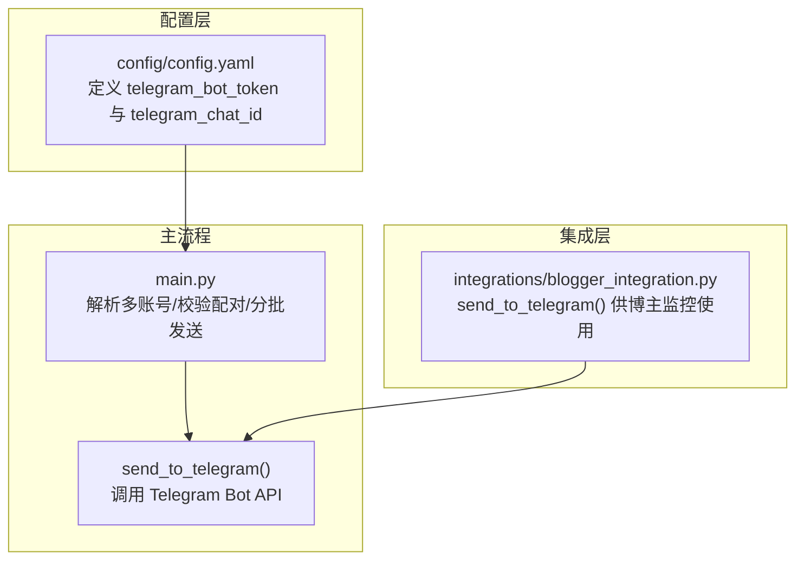
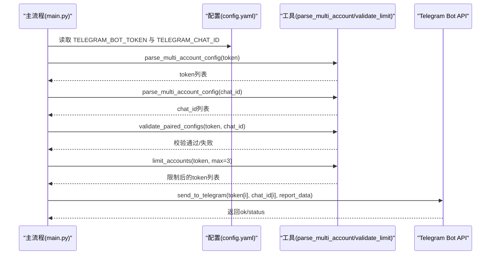
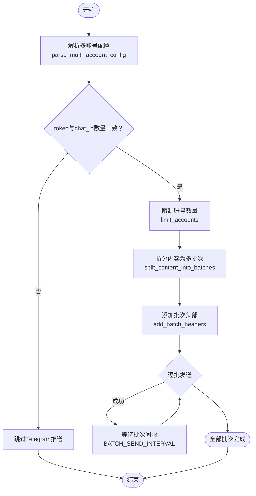
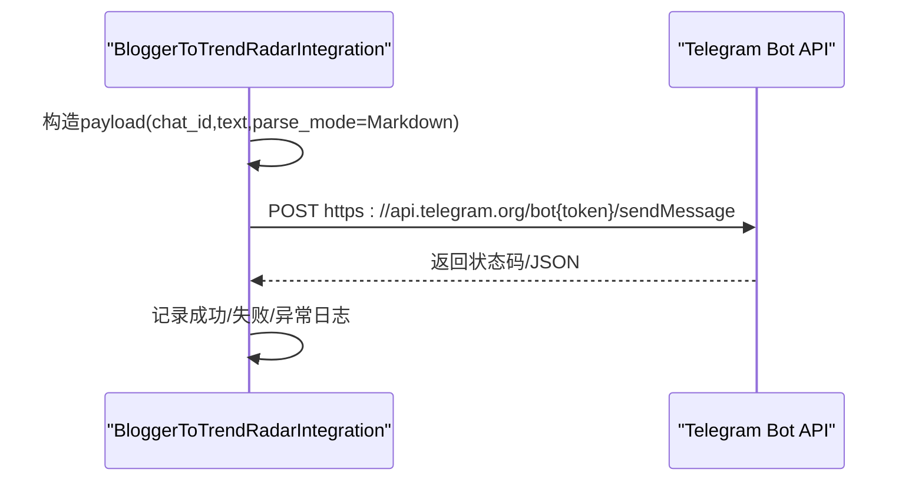
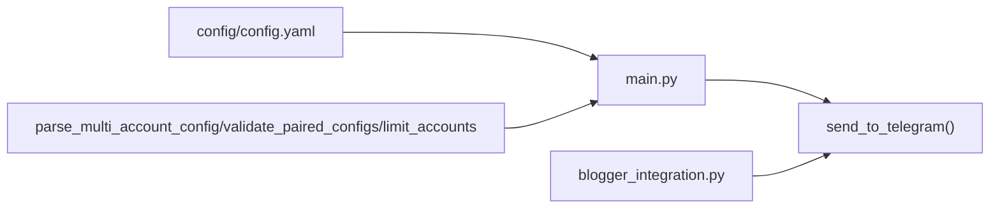

# Telegram通知集成

<cite>
**本文引用的文件**
- [config/config.yaml](file://config/config.yaml)
- [integrations/blogger_integration.py](file://integrations/blogger_integration.py)
- [main.py](file://main.py)
- [README.md](file://README.md)
</cite>

## 目录
1. [简介](#简介)
2. [项目结构](#项目结构)
3. [核心组件](#核心组件)
4. [架构总览](#架构总览)
5. [详细组件分析](#详细组件分析)
6. [依赖关系分析](#依赖关系分析)
7. [性能考量](#性能考量)
8. [故障排查指南](#故障排查指南)
9. [结论](#结论)
10. [附录](#附录)

## 简介
本文件面向TrendRadar的Telegram通知集成，围绕Bot API与Telegram的消息推送进行系统化说明。重点覆盖以下方面：
- config.yaml中telegram_bot_token与telegram_chat_id的配对配置要求，以及多Bot的分号分隔机制与数量一致性校验
- TrendRadar在主流程中如何调用https://api.telegram.org/bot{token}/sendMessage接口，构建包含chat_id、text与parse_mode=HTML的请求体
- 错误处理与重试策略（网络超时、API限流、批次发送间隔等）
- 获取Bot Token与Chat ID的完整操作指南

## 项目结构
TrendRadar的Telegram通知集成主要分布在如下位置：
- 配置层：config/config.yaml中定义通知渠道与多账号分号分隔规则
- 主流程：main.py中负责解析多账号配置、校验配对数量、逐批发送消息
- 博主监控集成：integrations/blogger_integration.py中提供send_to_telegram方法，用于将博主监控结果通过Telegram推送

图表来源
- [config/config.yaml](file://config/config.yaml#L92-L109)
- [main.py](file://main.py#L3880-L3905)
- [integrations/blogger_integration.py](file://integrations/blogger_integration.py#L217-L239)

章节来源
- [config/config.yaml](file://config/config.yaml#L92-L109)
- [main.py](file://main.py#L3880-L3905)
- [integrations/blogger_integration.py](file://integrations/blogger_integration.py#L217-L239)

## 核心组件
- 配置解析与多账号校验
  - parse_multi_account_config：将分号分隔的字符串拆分为列表
  - validate_paired_configs：校验Telegram的bot_token与chat_id数量是否一致
  - limit_accounts：限制每个渠道最多账号数量（默认上限）
- 发送流程
  - send_to_telegram：构造请求URL与JSON负载，逐批发送消息
- 博主监控集成
  - BloggerToTrendRadarIntegration.send_to_telegram：复用主流程的Telegram发送逻辑

章节来源
- [main.py](file://main.py#L58-L120)
- [main.py](file://main.py#L4289-L4362)
- [integrations/blogger_integration.py](file://integrations/blogger_integration.py#L217-L239)

## 架构总览
TrendRadar在主流程中统一处理各通知渠道的多账号配置与发送。对于Telegram，流程如下：
- 从配置中读取TELEGRAM_BOT_TOKEN与TELEGRAM_CHAT_ID
- 使用分号分隔解析为列表
- 校验token与chat_id数量一致
- 限制账号数量（默认最多3个）
- 逐个账号调用send_to_telegram进行分批发送

图表来源
- [main.py](file://main.py#L3880-L3905)
- [main.py](file://main.py#L58-L120)
- [main.py](file://main.py#L4289-L4362)

## 详细组件分析

### 配置与多账号机制
- 多账号分号分隔
  - telegram_bot_token与telegram_chat_id均支持分号分隔的多个值
  - 数量必须一致，否则跳过该渠道推送
- 数量限制
  - 每个渠道最多支持max_accounts_per_channel个账号（默认3个）
- 配置位置
  - config/config.yaml中notification.webhooks下定义

章节来源
- [config/config.yaml](file://config/config.yaml#L76-L91)
- [config/config.yaml](file://config/config.yaml#L92-L109)

### 主流程中的Telegram发送
- 解析与校验
  - 读取TELEGRAM_BOT_TOKEN与TELEGRAM_CHAT_ID
  - parse_multi_account_config拆分为列表
  - validate_paired_configs确保数量一致
  - limit_accounts限制账号数量
- 分批发送
  - 使用MESSAGE_BATCH_SIZE与批次头部预留空间，将内容拆分为多批次
  - add_batch_headers为每批添加统一头部
  - 每批发送后按BATCH_SEND_INTERVAL间隔
- 请求构建
  - URL：https://api.telegram.org/bot{token}/sendMessage
  - JSON负载包含chat_id、text、parse_mode=HTML、disable_web_page_preview=True
  - 超时：30秒
- 错误处理
  - 状态码非200或返回ok=false时视为失败
  - 异常捕获并返回False
  - 成功后打印批次发送成功与最终完成信息

图表来源
- [main.py](file://main.py#L3880-L3905)
- [main.py](file://main.py#L4289-L4362)

章节来源
- [main.py](file://main.py#L3880-L3905)
- [main.py](file://main.py#L4289-L4362)

### 博主监控集成中的Telegram发送
- BloggerToTrendRadarIntegration.send_to_telegram
  - 与主流程一致，调用requests.post发送消息
  - 请求URL：https://api.telegram.org/bot{bot_token}/sendMessage
  - 请求体：chat_id、text、parse_mode=Markdown
  - 超时：10秒
  - 成功/失败/异常均有日志输出

图表来源
- [integrations/blogger_integration.py](file://integrations/blogger_integration.py#L217-L239)

章节来源
- [integrations/blogger_integration.py](file://integrations/blogger_integration.py#L217-L239)

### 错误处理与重试策略
- 网络超时
  - 主流程：requests.post超时30秒
  - 博主集成：requests.post超时10秒
- 状态码与返回体
  - 主流程：状态码非200或返回ok=false即判定失败
  - 博主集成：状态码非200记录失败文本
- 重试策略
  - 当前实现未内置自动重试；若需重试可在调用处增加重试逻辑（例如指数退避）
- 批次间隔
  - 主流程在批次间按BATCH_SEND_INTERVAL进行等待，降低API压力

章节来源
- [main.py](file://main.py#L4289-L4362)
- [integrations/blogger_integration.py](file://integrations/blogger_integration.py#L217-L239)

### 获取Bot Token与Chat ID的完整操作指南
- 创建Telegram Bot
  - 在Telegram中搜索@BotFather，发送/newbot命令创建新机器人
  - 设置机器人名称（必须以“bot”结尾）
  - 获取Bot Token（格式如：123456789:AAHfiqksKZ8WmR2zSjiQ7_v4TMAKdiHm9T0）
- 获取Chat ID
  - 方法一：通过官方API获取
    - 先向你的机器人发送一条消息
    - 访问：https://api.telegram.org/bot<你的Bot Token>/getUpdates
    - 在返回的JSON中找到"chat":{"id":数字}中的数字
  - 方法二：使用第三方工具
    - 搜索@userinfobot并发送/start
    - 获取你的用户ID作为Chat ID
- 配置到TrendRadar
  - 在GitHub Secrets中添加：
    - TELEGRAM_BOT_TOKEN：填入Bot Token
    - TELEGRAM_CHAT_ID：填入Chat ID
  - 若使用多账号，使用分号分隔多个值，且token与chat_id数量必须一致

章节来源
- [README.md](file://README.md#L1061-L1098)

## 依赖关系分析
- 配置依赖
  - config/config.yaml提供telegram_bot_token与telegram_chat_id的默认占位
- 主流程依赖
  - parse_multi_account_config：将分号分隔字符串解析为列表
  - validate_paired_configs：校验配对数量
  - limit_accounts：限制账号数量
  - send_to_telegram：实际调用Telegram Bot API
- 集成依赖
  - BloggerToTrendRadarIntegration.send_to_telegram：复用主流程逻辑

图表来源
- [config/config.yaml](file://config/config.yaml#L92-L109)
- [main.py](file://main.py#L58-L120)
- [main.py](file://main.py#L4289-L4362)
- [integrations/blogger_integration.py](file://integrations/blogger_integration.py#L217-L239)

章节来源
- [config/config.yaml](file://config/config.yaml#L92-L109)
- [main.py](file://main.py#L58-L120)
- [main.py](file://main.py#L4289-L4362)
- [integrations/blogger_integration.py](file://integrations/blogger_integration.py#L217-L239)

## 性能考量
- 分批发送
  - 使用MESSAGE_BATCH_SIZE与批次头部预留，避免单条消息过大导致失败
  - 批次间间隔BATCH_SEND_INTERVAL有助于降低API限流风险
- 超时控制
  - 主流程30秒超时，博主集成10秒超时，避免长时间阻塞
- 多账号限制
  - 默认最多3个账号，减少并发压力与API限流概率

章节来源
- [main.py](file://main.py#L4289-L4362)

## 故障排查指南
- 配置问题
  - telegram_bot_token与telegram_chat_id数量不一致：将跳过Telegram推送
  - 账号数量超过限制：会被截断至最大数量
- 发送失败
  - 状态码非200或返回ok=false：检查token、chat_id与网络连通性
  - 异常捕获：查看日志中的异常信息
- API限流
  - 减少发送频率或增大批次间隔
  - 必要时增加重试逻辑（建议指数退避）

章节来源
- [main.py](file://main.py#L3880-L3905)
- [main.py](file://main.py#L4289-L4362)

## 结论
TrendRadar对Telegram的通知集成提供了完善的多账号配置、数量一致性校验与分批发送机制。主流程与博主监控集成共享统一的发送逻辑，确保在不同场景下都能稳定地将消息推送到Telegram。通过合理的超时与批次间隔设置，可有效规避网络超时与API限流带来的问题。建议在生产环境中结合GitHub Actions的Secret管理与合理的重试策略，进一步提升可靠性。

## 附录
- 配置要点速查
  - 多账号使用分号分隔
  - Telegram需保证token与chat_id数量一致
  - 每个渠道最多支持3个账号
- 推荐实践
  - 使用GitHub Secrets管理敏感配置
  - 在非高峰时段触发推送，降低限流风险
  - 对外暴露的推送通道需谨慎管理，避免滥用

章节来源
- [config/config.yaml](file://config/config.yaml#L76-L91)
- [README.md](file://README.md#L846-L900)