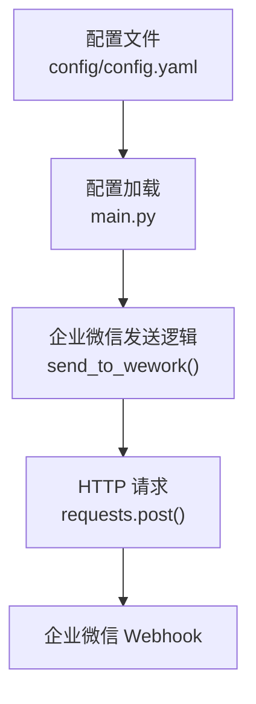
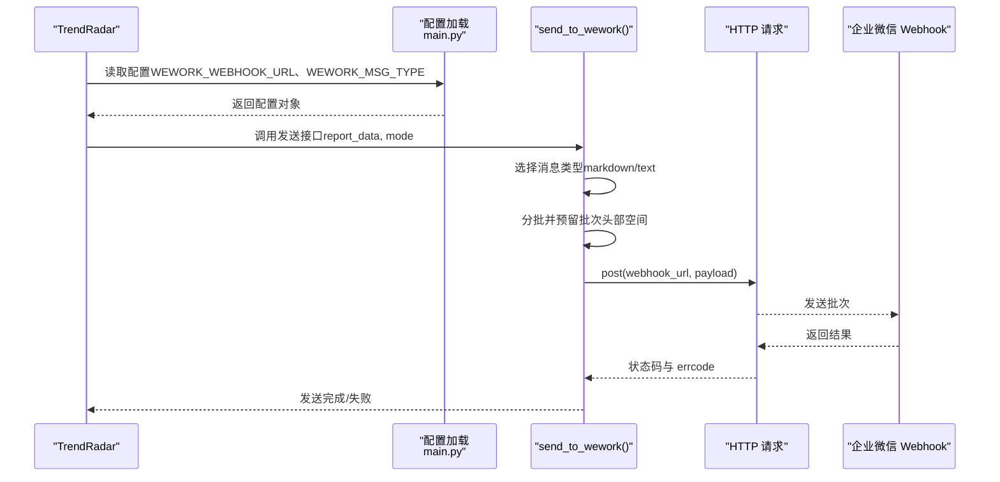
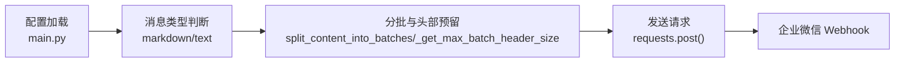

# 企业微信通知集成

<cite>
**本文引用的文件**
- [config/config.yaml](file://config/config.yaml)
- [main.py](file://main.py)
- [README.md](file://README.md)
- [README-EN.md](file://README-EN.md)
</cite>

## 目录
1. [简介](#简介)
2. [项目结构](#项目结构)
3. [核心组件](#核心组件)
4. [架构总览](#架构总览)
5. [详细组件分析](#详细组件分析)
6. [依赖关系分析](#依赖关系分析)
7. [性能考量](#性能考量)
8. [故障排查指南](#故障排查指南)
9. [结论](#结论)
10. [附录](#附录)

## 简介
本文件面向希望将 TrendRadar 与企业微信（WeCom）集成的用户，系统性说明如何通过 Webhook 实现通知推送，并重点解释配置项 wework_url 与 wework_msg_type（markdown/text）的作用、适用场景与安全策略。文档还涵盖消息内容格式要求（markdown 模式下的标题、列表、链接支持；text 模式下的纯文本限制）、GitHub Secrets 注入 Webhook URL 的最佳实践，以及企业微信侧“机器人”与“个人微信应用”的创建与权限建议。

## 项目结构
- 配置文件位于 config/config.yaml，包含通知渠道的 Webhook URL 与消息类型等配置。
- 主程序入口 main.py 负责加载配置、解析多账号、按批次发送消息，并针对企业微信实现两种消息格式（markdown/text）。
- README 文档提供了企业微信机器人与个人微信应用的创建步骤、消息格式差异说明及安全建议。

图表来源
- [config/config.yaml](file://config/config.yaml#L92-L101)
- [main.py](file://main.py#L269-L276)
- [main.py](file://main.py#L4201-L4286)

章节来源
- [config/config.yaml](file://config/config.yaml#L92-L101)
- [main.py](file://main.py#L269-L276)
- [main.py](file://main.py#L4201-L4286)

## 核心组件
- 配置加载与多账号解析
  - 从环境变量或配置文件读取 WEWORK_WEBHOOK_URL 与 WEWORK_MSG_TYPE。
  - 支持多账号（分号分隔），并限制最大账号数量。
- 企业微信发送模块
  - 根据消息类型（markdown 或 text）构造 payload。
  - 自动分批发送，预留批次头部空间，避免超限。
  - text 模式会移除 markdown 语法，确保兼容个人微信应用推送。

章节来源
- [main.py](file://main.py#L269-L276)
- [main.py](file://main.py#L3867-L3879)
- [main.py](file://main.py#L4201-L4286)

## 架构总览
企业微信通知的整体流程如下：
- TrendRadar 生成报告内容（词组统计、新增热点等）。
- 根据配置决定是否启用企业微信通知。
- 若启用，按消息类型（markdown 或 text）构造分批内容并发送至企业微信 Webhook。

图表来源
- [main.py](file://main.py#L269-L276)
- [main.py](file://main.py#L4201-L4286)

## 详细组件分析

### 配置项：wework_url 与 wework_msg_type
- wework_url
  - 类型：字符串（可包含多个 URL，使用分号分隔）
  - 作用：企业微信 Webhook 地址，支持多账号推送。
  - 读取优先级：环境变量 > 配置文件。
- wework_msg_type
  - 类型：字符串，取值 "markdown" 或 "text"
  - 作用：控制消息格式
    - markdown：富文本，支持标题、列表、链接等格式。
    - text：纯文本，自动移除 markdown 语法，适用于个人微信应用推送。

章节来源
- [config/config.yaml](file://config/config.yaml#L92-L101)
- [main.py](file://main.py#L269-L276)
- [main.py](file://main.py#L4201-L4286)

### 消息内容格式要求
- markdown 模式（默认）
  - 支持标题、列表、链接、加粗等富文本格式。
  - 适合企业微信群机器人，展示更丰富的信息。
- text 模式
  - 自动去除 markdown 语法，仅保留纯文本。
  - 适合企业微信“个人微信应用”推送，避免格式不兼容。

章节来源
- [main.py](file://main.py#L4201-L4286)

### 安全机制与 GitHub Secrets 注入
- 安全警告
  - 不要在配置文件中明文存储 Webhook URL；若通过 GitHub Fork 部署，请勿在配置文件中填写。
  - 推荐使用 GitHub Secrets 存储敏感信息，避免泄露。
- 注入方式
  - 在仓库 Settings → Secrets and variables → Actions 中添加 Secret，名称严格使用固定名称（如 WEWORK_WEBHOOK_URL、WEWORK_MSG_TYPE）。
  - 程序会优先从环境变量读取，确保敏感信息不落入仓库历史。
- 多账号与配对校验
  - 多账号使用分号分隔；部分渠道（如 Telegram、ntfy）需配对参数数量一致。
  - 每个渠道最多支持固定数量的账号，超出将被截断。

章节来源
- [config/config.yaml](file://config/config.yaml#L60-L91)
- [README.md](file://README.md#L846-L940)
- [README-EN.md](file://README-EN.md#L809-L903)

### 企业微信侧创建与权限建议
- 企业微信群机器人（推荐）
  - 适用场景：群内推送，支持富文本（markdown）。
  - 创建步骤：在企业微信 App 内进入目标内部群聊，点击右上角“…” → “消息推送” → “添加”，名称可自定义（如 TrendRadar），复制 Webhook 地址并配置到 GitHub Secrets。
- 个人微信应用（text 模式）
  - 适用场景：直接推送到个人微信，无需安装企业微信 App。
  - 创建步骤：先完成群机器人 Webhook 设置，再添加 WEWORK_MSG_TYPE Secret，值设为 text，并按文档指引关联个人微信。
  - 注意：text 模式会自动去除 markdown 语法，确保兼容性。

章节来源
- [README.md](file://README.md#L890-L940)
- [README-EN.md](file://README-EN.md#L853-L903)

## 依赖关系分析
- 配置依赖
  - main.py 从环境变量或配置文件读取 WEWORK_WEBHOOK_URL 与 WEWORK_MSG_TYPE。
- 发送逻辑依赖
  - send_to_wework() 根据消息类型构造 payload，并按批次大小进行分批发送。
  - 分批时预留批次头部空间，避免超限。

图表来源
- [main.py](file://main.py#L269-L276)
- [main.py](file://main.py#L4201-L4286)

章节来源
- [main.py](file://main.py#L269-L276)
- [main.py](file://main.py#L4201-L4286)

## 性能考量
- 分批发送
  - 通过 MESSAGE_BATCH_SIZE 与批次头部预留，避免单条消息过大导致失败。
  - 批次间存在固定间隔，降低推送压力。
- 文本模式优化
  - text 模式自动去除 markdown 语法，减少传输体积与解析成本。
- 多账号限制
  - 每个渠道最多支持固定数量的账号，超出将被截断，避免过度并发。

章节来源
- [main.py](file://main.py#L4201-L4286)
- [config/config.yaml](file://config/config.yaml#L34-L44)

## 故障排查指南
- 常见问题
  - Webhook URL 未配置或拼写错误：检查 GitHub Secrets 名称是否严格匹配，确认值为有效的企业微信 Webhook 地址。
  - 消息格式不兼容：若使用个人微信应用，请将 WEWORK_MSG_TYPE 设为 text。
  - 多账号数量不一致：如 Telegram/ntfy，需保证配对参数数量一致。
  - 超限或失败：检查 MESSAGE_BATCH_SIZE 与批次头部预留是否合理，适当降低消息体量。
- 排查步骤
  - 在 Actions 页面手动触发一次工作流，观察企业微信是否收到消息。
  - 查看程序日志输出，定位具体批次与状态码。
  - 确认企业微信 Webhook 返回的 errcode/errmsg，按错误提示修复。

章节来源
- [main.py](file://main.py#L4201-L4286)
- [README.md](file://README.md#L1461-L1522)

## 结论
通过 GitHub Secrets 注入企业微信 Webhook URL，并结合 wework_msg_type 的灵活切换，TrendRadar 可在企业微信群机器人与个人微信应用之间自由适配。建议优先使用群机器人（markdown）以获得更好的展示效果；若需直接推送到个人微信，请切换为 text 模式并正确配置关联。遵循安全规范，避免在配置文件中暴露敏感信息，确保推送稳定可靠。

## 附录
- 配置项速览
  - WEWORK_WEBHOOK_URL：企业微信 Webhook 地址（支持多账号，分号分隔）
  - WEWORK_MSG_TYPE：消息类型，"markdown" 或 "text"
- 参考文档
  - 企业微信机器人创建与个人微信应用配置步骤
  - 多账号与配对参数说明
  - 安全与 Secrets 使用建议

章节来源
- [config/config.yaml](file://config/config.yaml#L92-L101)
- [README.md](file://README.md#L890-L940)
- [README-EN.md](file://README-EN.md#L853-L903)