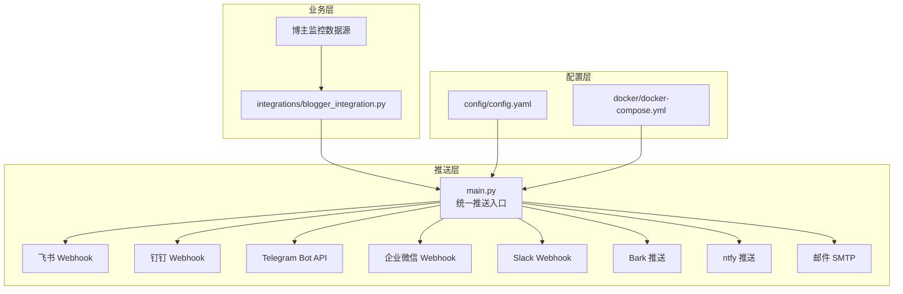
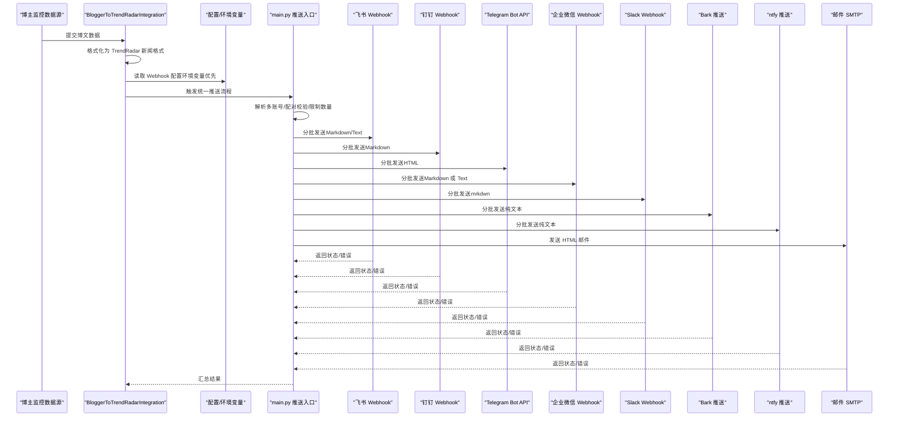
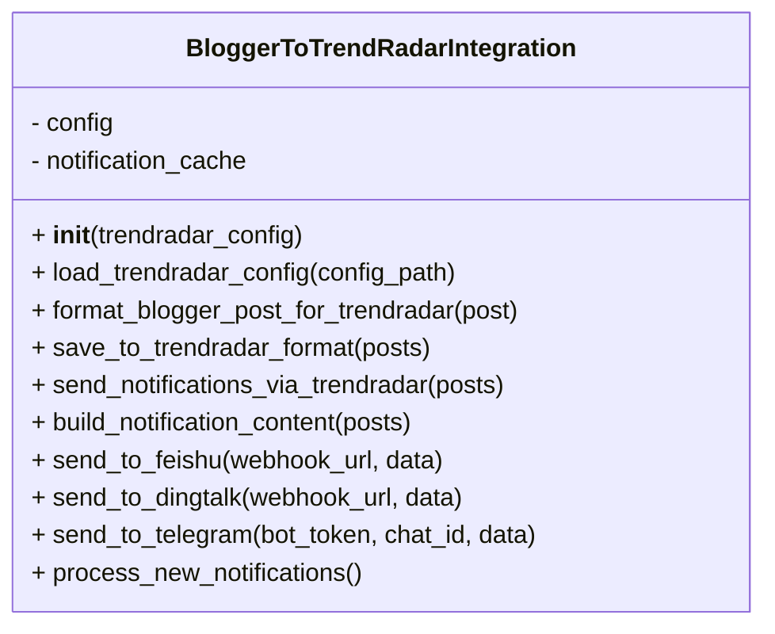
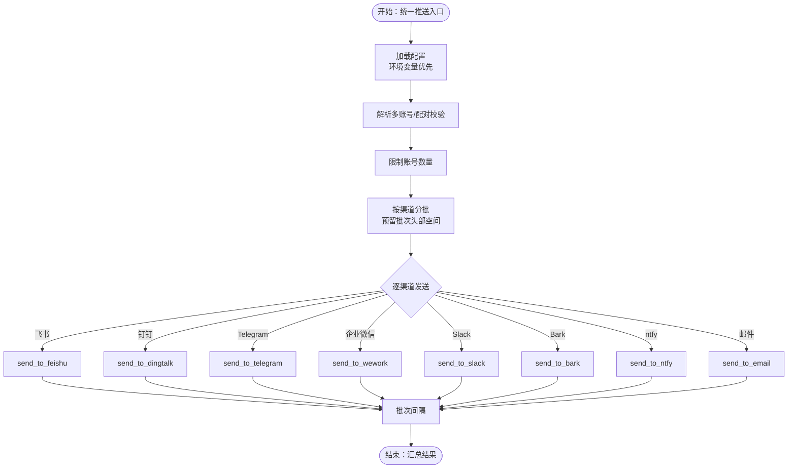
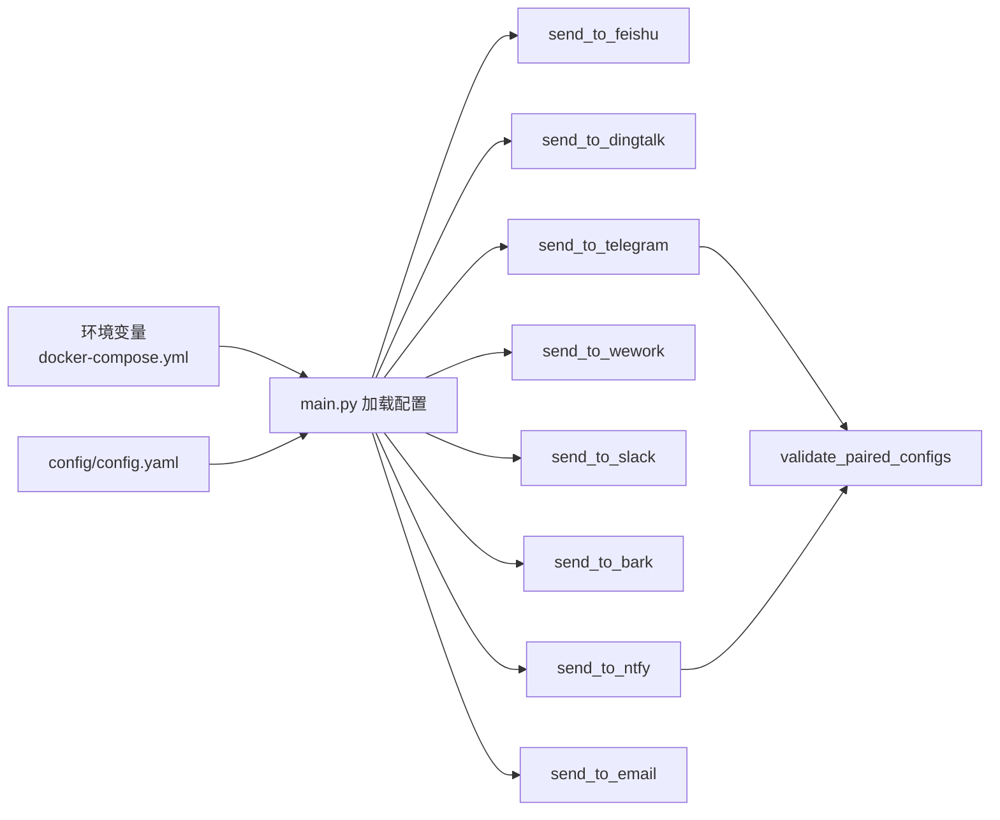

# 通知渠道集成

<cite>
**本文引用的文件**
- [integrations/blogger_integration.py](file://integrations/blogger_integration.py)
- [docker/docker-compose.yml](file://docker/docker-compose.yml)
- [config/blogger_config.yaml](file://config/blogger_config.yaml)
- [config/config.yaml](file://config/config.yaml)
- [main.py](file://main.py)
- [README.md](file://README.md)
- [README-EN.md](file://README-EN.md)
</cite>

## 目录
1. [简介](#简介)
2. [项目结构](#项目结构)
3. [核心组件](#核心组件)
4. [架构总览](#架构总览)
5. [详细组件分析](#详细组件分析)
6. [依赖关系分析](#依赖关系分析)
7. [性能考量](#性能考量)
8. [故障排查指南](#故障排查指南)
9. [结论](#结论)
10. [附录](#附录)

## 简介
本文件面向希望将 TrendRadar 与多种通知渠道（如飞书、钉钉、Telegram、企业微信、Slack、Bark、ntfy、邮件等）集成的用户与开发者，系统性说明：
- 如何通过 Webhook 协议与各平台进行安全通信
- 消息格式规范（如飞书交互式卡片、钉钉 Markdown、Telegram HTML）
- 认证机制（如 Telegram 的 bot_token、企业微信的 Webhook URL）
- 错误重试与批次发送策略
- docker-compose.yml 中环境变量（如 FEISHU_WEBHOOK_URL、TELEGRAM_BOT_TOKEN）如何实现配置解耦与安全注入
- blogger_integration.py 如何复用 TrendRadar 的推送系统，实现博主监控通知的统一发送，展示系统扩展性与集成模式的一致性

## 项目结构
本项目采用“推送系统 + 多渠道适配 + 配置解耦”的设计，核心文件与职责如下：
- integrations/blogger_integration.py：博主监控与 TrendRadar 推送系统的集成模块，负责格式化博文为 TrendRadar 新闻格式、落盘输出，并通过已配置的 Webhook 渠道发送通知
- config/config.yaml：全局配置，包含通知批次大小、时间窗口、多账号上限、Webhook 参数等
- docker/docker-compose.yml：容器编排与环境变量注入，集中管理各渠道的 Webhook URL、Token、Topic 等敏感信息
- main.py：核心推送逻辑，统一解析环境变量与配置文件，按渠道封装发送函数，支持分批、批次间隔、错误处理
- README.md / README-EN.md：渠道配置与安全提示的权威说明

图表来源
- [integrations/blogger_integration.py](file://integrations/blogger_integration.py#L1-L293)
- [config/config.yaml](file://config/config.yaml#L1-L140)
- [docker/docker-compose.yml](file://docker/docker-compose.yml#L1-L74)
- [main.py](file://main.py#L240-L439)

章节来源
- [integrations/blogger_integration.py](file://integrations/blogger_integration.py#L1-L293)
- [config/config.yaml](file://config/config.yaml#L1-L140)
- [docker/docker-compose.yml](file://docker/docker-compose.yml#L1-L74)
- [main.py](file://main.py#L240-L439)

## 核心组件
- 配置解耦与安全注入
  - 环境变量优先：main.py 会优先读取环境变量中的渠道配置，若未提供则回退到 config.yaml 的 webhooks 字段
  - docker-compose.yml 通过环境变量注入敏感信息，避免将密钥写入仓库
- 多账号支持与配对校验
  - parse_multi_account_config：按分号分隔多账号
  - validate_paired_configs：校验 Telegram 的 token 与 chat_id 数量一致；ntfy 的 topic 与 token 数量一致性
  - limit_accounts：限制每个渠道最多账号数
- 统一推送接口
  - send_to_feishu / send_to_dingtalk / send_to_telegram / send_to_wework / send_to_email 等，均支持分批发送、批次间隔、错误处理
- 博主集成模块
  - BloggerToTrendRadarIntegration：将博主博文格式化为 TrendRadar 新闻格式、落盘输出、并通过 Webhook 渠道发送通知

章节来源
- [main.py](file://main.py#L240-L439)
- [main.py](file://main.py#L58-L140)
- [main.py](file://main.py#L3881-L3904)
- [integrations/blogger_integration.py](file://integrations/blogger_integration.py#L1-L293)

## 架构总览
TrendRadar 的通知通道遵循“配置解耦 + 统一推送 + 多账号校验”的模式，整体流程如下：

图表来源
- [integrations/blogger_integration.py](file://integrations/blogger_integration.py#L103-L149)
- [main.py](file://main.py#L240-L439)
- [main.py](file://main.py#L3881-L3904)

## 详细组件分析

### 组件A：博主监控与 TrendRadar 集成（blogger_integration.py）
- 功能要点
  - 加载 TrendRadar 配置
  - 将博文数据格式化为 TrendRadar 新闻格式并落盘
  - 读取配置中的 webhooks，按渠道发送通知
  - 通知内容构建：标题、正文、博文列表摘要
- 关键方法
  - format_blogger_post_for_trendradar：生成唯一ID、平台标识、时间戳、内容摘要等
  - save_to_trendradar_format：合并现有数据并写入 output 目录
  - send_notifications_via_trendradar：统一调度各渠道发送
  - build_notification_content：生成人类可读的通知正文
  - send_to_feishu / send_to_dingtalk / send_to_telegram：各渠道发送实现
- 扩展性
  - 通过配置文件的 webhooks 字段即可接入新渠道，无需修改核心逻辑
  - 与 TrendRadar 的推送系统复用，保持消息格式与批次策略一致

图表来源
- [integrations/blogger_integration.py](file://integrations/blogger_integration.py#L16-L293)

章节来源
- [integrations/blogger_integration.py](file://integrations/blogger_integration.py#L16-L293)

### 组件B：统一推送入口与渠道适配（main.py）
- 配置加载与优先级
  - 环境变量优先：FEISHU_WEBHOOK_URL、DINGTALK_WEBHOOK_URL、TELEGRAM_BOT_TOKEN、TELEGRAM_CHAT_ID、WEWORK_WEBHOOK_URL、WEWORK_MSG_TYPE、NTFY_*、BARK_URL、SLACK_WEBHOOK_URL 等
  - 回退至 config.yaml 的 notification.webhooks 字段
- 多账号与配对校验
  - parse_multi_account_config：按分号拆分多账号
  - validate_paired_configs：校验 Telegram token 与 chat_id 数量一致；ntfy 的 topic 与 token 数量一致
  - limit_accounts：限制每个渠道最多账号数
- 分批发送与批次间隔
  - 各渠道均支持分批发送，预留批次头部空间，避免超限
  - BATCH_SEND_INTERVAL 控制批次间间隔
- 渠道发送函数
  - send_to_feishu：发送 text 类型内容，支持分批与错误码校验
  - send_to_dingtalk：发送 markdown，支持分批与 errcode 校验
  - send_to_telegram：发送 HTML，支持分批与 ok 校验
  - send_to_wework：支持 markdown 与 text 两种消息类型，自动去除 markdown 语法
  - send_to_email：发送 HTML 邮件，支持自定义 SMTP 与自动识别
  - send_to_slack：发送 mrkdwn，支持分批
  - send_to_ntfy：发送纯文本，支持多 topic 与 token
  - send_to_bark：发送纯文本，支持多设备

图表来源
- [main.py](file://main.py#L240-L439)
- [main.py](file://main.py#L58-L140)
- [main.py](file://main.py#L3881-L3904)

章节来源
- [main.py](file://main.py#L240-L439)
- [main.py](file://main.py#L58-L140)
- [main.py](file://main.py#L3881-L3904)

### 组件C：docker-compose.yml 中的环境变量注入
- 作用
  - 将敏感信息（Webhook URL、Token、Chat ID、Topic、Token 等）注入容器环境变量，避免硬编码到代码或配置文件
  - 通过环境变量覆盖 config.yaml 的 webhooks 字段，实现“配置解耦 + 安全注入”
- 关键变量
  - FEISHU_WEBHOOK_URL、DINGTALK_WEBHOOK_URL、TELEGRAM_BOT_TOKEN、TELEGRAM_CHAT_ID、WEWORK_WEBHOOK_URL、WEWORK_MSG_TYPE、NTFY_SERVER_URL、NTFY_TOPIC、NTFY_TOKEN、BARK_URL、SLACK_WEBHOOK_URL 等
- 安全建议
  - 不要在仓库中提交敏感信息，使用 GitHub Secrets 或 Docker 环境变量
  - README 中明确要求不要在配置文件中填写 webhooks，避免泄露

章节来源
- [docker/docker-compose.yml](file://docker/docker-compose.yml#L1-L74)
- [README.md](file://README.md#L846-L1522)
- [README-EN.md](file://README-EN.md#L809-L1492)

### 组件D：消息格式与认证机制
- 飞书（Webhook）
  - 消息类型：text（携带 content 字段）
  - 交互式卡片：blogger_integration.py 中演示了交互式卡片结构（header、elements、config 等），但统一推送入口使用 text 类型
  - 认证：Webhook URL
- 钉钉（Webhook）
  - 消息类型：markdown
  - 认证：Webhook URL
- Telegram（Bot API）
  - 消息类型：HTML
  - 认证：bot_token + chat_id
- 企业微信（Webhook）
  - 消息类型：markdown 或 text（由 WEWORK_MSG_TYPE 控制）
  - 认证：Webhook URL
- Slack（Webhook）
  - 消息类型：mrkdwn
  - 认证：Webhook URL
- Bark（HTTP 推送）
  - 消息类型：纯文本
  - 认证：设备 key（从 URL 解析）
- ntfy（HTTP 推送）
  - 消息类型：纯文本
  - 认证：topic（可选 token）
- 邮件（SMTP）
  - 消息类型：HTML
  - 认证：发件人邮箱 + 授权码/密码 + SMTP 服务器与端口

章节来源
- [integrations/blogger_integration.py](file://integrations/blogger_integration.py#L150-L239)
- [main.py](file://main.py#L3990-L4154)
- [main.py](file://main.py#L4200-L4399)
- [config/config.yaml](file://config/config.yaml#L1-L140)

### 组件E：错误重试与批次策略
- 分批发送
  - 各渠道均按批次大小分批，预留批次头部空间，避免超限
  - BATCH_SEND_INTERVAL 控制批次间间隔，降低平台限流风险
- 错误处理
  - 统一捕获异常并打印日志
  - 根据平台返回码/字段判断发送成功与否（如 errcode、ok、StatusCode）
  - 若某批次失败，立即终止后续批次并返回失败
- 重试策略
  - 当前实现未内置自动重试；可在外部调度层（如 GitHub Actions/Cron）进行重试
  - 建议结合批次间隔与平台限流规则，避免过于频繁重试

章节来源
- [main.py](file://main.py#L3990-L4154)
- [main.py](file://main.py#L4200-L4399)

## 依赖关系分析
- 配置来源依赖
  - main.py 优先读取环境变量，其次读取 config.yaml 的 webhooks 字段
  - docker-compose.yml 通过环境变量注入敏感信息，实现“配置解耦 + 安全注入”
- 渠道依赖
  - 各渠道发送函数依赖统一的分批与头部预留逻辑
  - Telegram 与 ntfy 需要配对参数数量一致，由 validate_paired_configs 校验
- 扩展依赖
  - 新增渠道只需在统一入口增加 send_to_xxx 函数，并在配置中提供相应环境变量或 config.yaml 字段

图表来源
- [docker/docker-compose.yml](file://docker/docker-compose.yml#L1-L74)
- [main.py](file://main.py#L240-L439)
- [main.py](file://main.py#L58-L140)
- [main.py](file://main.py#L3881-L3904)

章节来源
- [docker/docker-compose.yml](file://docker/docker-compose.yml#L1-L74)
- [main.py](file://main.py#L240-L439)
- [main.py](file://main.py#L58-L140)
- [main.py](file://main.py#L3881-L3904)

## 性能考量
- 分批大小与批次间隔
  - 各渠道提供独立的批次大小配置，避免单次消息过大导致失败
  - BATCH_SEND_INTERVAL 控制批次间隔，有助于规避平台限流
- 文本截断与字节安全
  - 统一使用字节级截断与头部预留，避免多字节字符截断
- 多账号并发
  - Telegram/ntfy 等多账号按顺序逐个发送，避免并发冲突
- 建议
  - 根据平台限制调整批次大小与间隔
  - 对高频推送场景，建议使用 Docker 部署并设置合理的推送时间窗口

[本节为通用指导，不直接分析具体文件]

## 故障排查指南
- 常见问题定位
  - 渠道未配置：确认环境变量或 config.yaml 的 webhooks 字段是否正确
  - Telegram/ntfy 配对不一致：检查 token 与 chat_id/ topic 与 token 数量是否一致
  - 飞书/钉钉/企业微信返回错误码：查看返回的 errcode/StatusCode/errcode 等字段
  - Telegram 返回 parse_mode/HTML 相关错误：确认 parse_mode 与内容格式
- 安全与合规
  - README 强调不要在配置文件中填写 webhooks，避免泄露
  - 使用 GitHub Secrets 或 Docker 环境变量注入敏感信息
- 日志与调试
  - 各渠道发送函数均打印批次发送状态与错误信息，便于定位问题
  - 可临时在本地禁用推送时间窗口，快速验证渠道连通性

章节来源
- [README.md](file://README.md#L846-L1522)
- [README-EN.md](file://README-EN.md#L809-L1492)
- [main.py](file://main.py#L3990-L4154)
- [main.py](file://main.py#L4200-L4399)

## 结论
TrendRadar 的通知集成体系通过“配置解耦 + 统一推送 + 多账号校验”实现了对多渠道的统一管理与扩展。blogger_integration.py 作为博主监控的桥接模块，复用 TrendRadar 的推送系统，确保消息格式与批次策略一致，具备良好的扩展性与安全性。配合 docker-compose 的环境变量注入与 README 的安全指引，用户可以以最小改动接入新渠道并保障敏感信息的安全。

[本节为总结性内容，不直接分析具体文件]

## 附录
- 配置文件与环境变量对照
  - config/config.yaml：notification.webhooks 字段
  - docker/docker-compose.yml：环境变量注入
  - main.py：优先读取环境变量，其次读取 config.yaml
- 多账号与配对配置示例
  - README 中提供了多账号与配对配置的示例与说明

章节来源
- [config/config.yaml](file://config/config.yaml#L1-L140)
- [docker/docker-compose.yml](file://docker/docker-compose.yml#L1-L74)
- [README.md](file://README.md#L2696-L2752)
- [README-EN.md](file://README-EN.md#L2603-L2718)