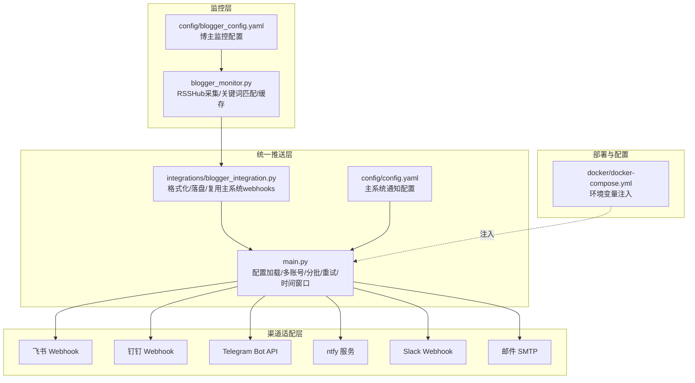
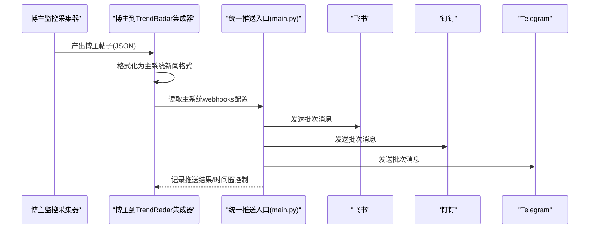
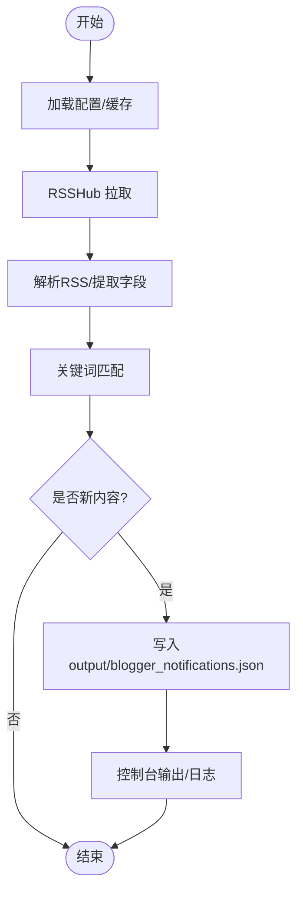
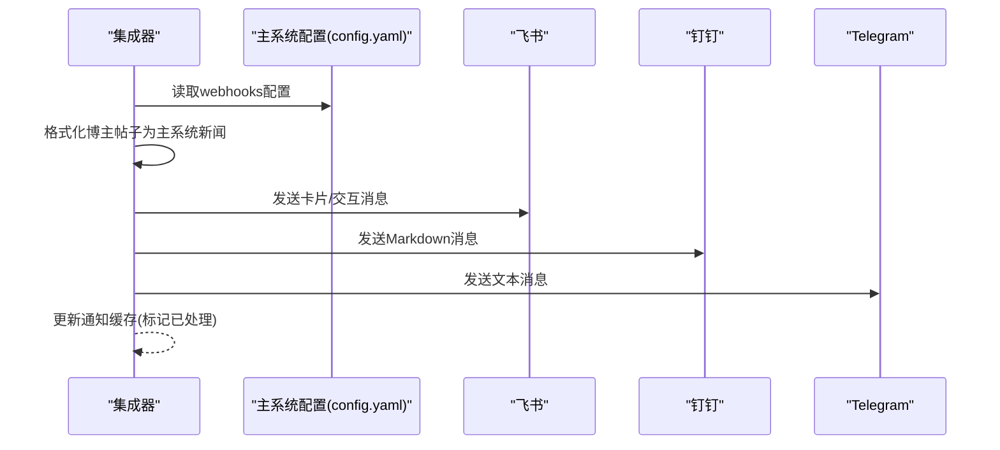
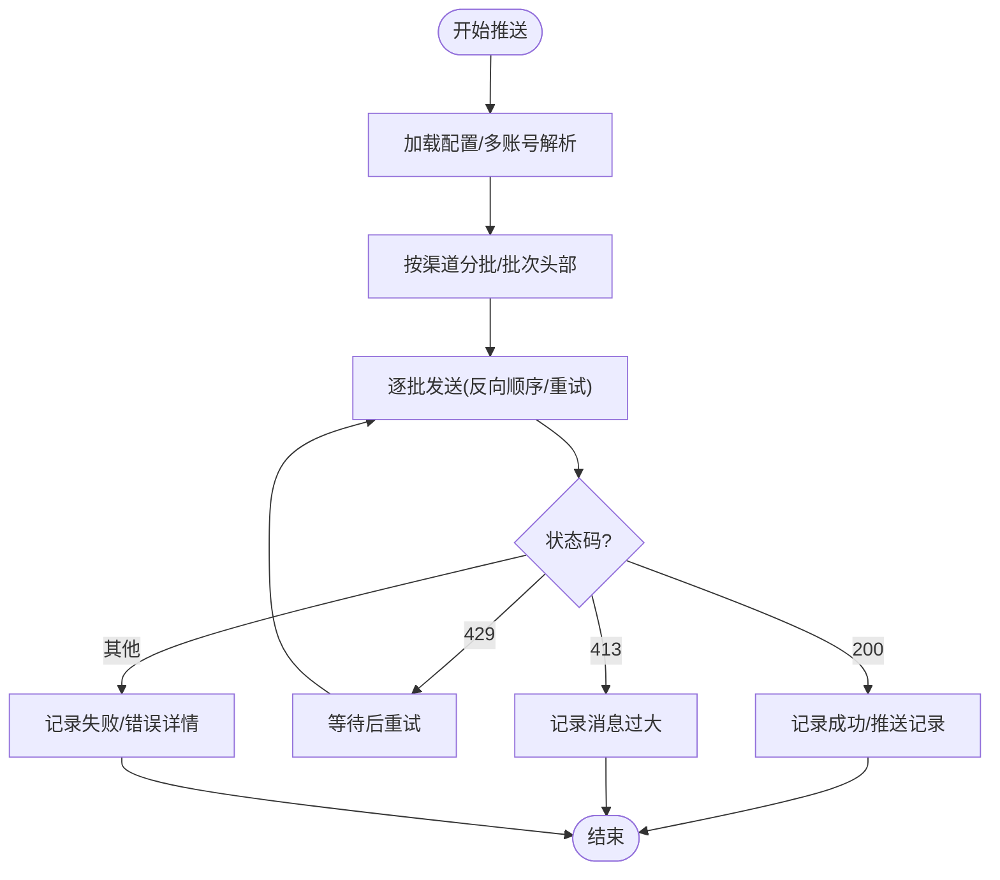
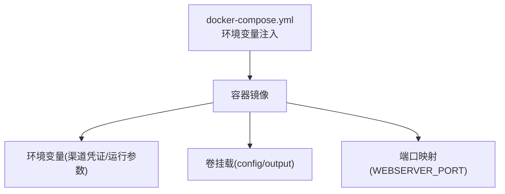
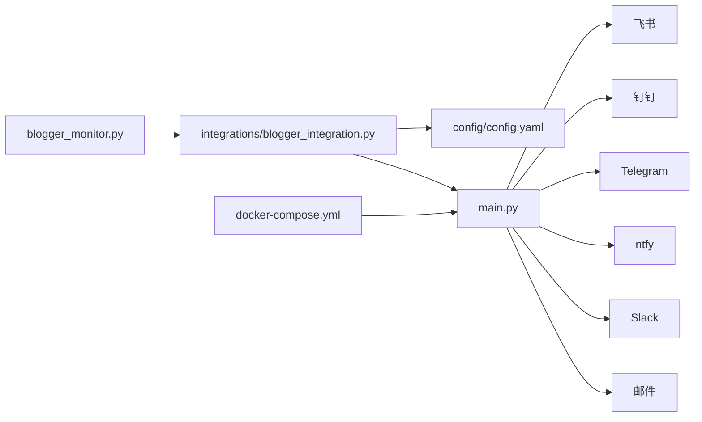

# 通知系统架构模式

<cite>
**本文引用的文件**
- [integrations/blogger_integration.py](file://integrations/blogger_integration.py)
- [docker/docker-compose.yml](file://docker/docker-compose.yml)
- [mcp_server/services/cache_service.py](file://mcp_server/services/cache_service.py)
- [config/blogger_config.yaml](file://config/blogger_config.yaml)
- [config/config.yaml](file://config/config.yaml)
- [blogger_monitor.py](file://blogger_monitor.py)
- [main.py](file://main.py)
</cite>

## 目录
1. [简介](#简介)
2. [项目结构](#项目结构)
3. [核心组件](#核心组件)
4. [架构总览](#架构总览)
5. [详细组件分析](#详细组件分析)
6. [依赖关系分析](#依赖关系分析)
7. [性能考量](#性能考量)
8. [故障排查指南](#故障排查指南)
9. [结论](#结论)
10. [附录](#附录)

## 简介
本文件围绕 TrendRadar 的统一推送架构进行系统化梳理，重点阐释以下方面：
- 如何通过 blogger_integration.py 复用主系统的 webhooks 配置，实现博主监控通知与主推送通道的一致性；
- docker-compose.yml 中环境变量（如 FEISHU_WEBHOOK_URL、TELEGRAM_BOT_TOKEN）如何实现配置解耦与安全注入，支撑 Docker 部署；
- 工厂模式在通知渠道创建中的应用思路与实践；
- 观察者模式在事件通知中的驱动机制；
- 缓存机制与错误重试策略，确保消息可靠送达。

## 项目结构
TrendRadar 的通知体系由“监控采集—格式转换—统一推送—渠道适配”四层构成：
- 博主监控采集与缓存：blogger_monitor.py 负责 RSSHub 拉取、关键词匹配、去重缓存与本地通知落盘；
- 统一推送入口：main.py 负责加载配置、解析多账号、分批发送、时间窗口控制与推送记录；
- 通知渠道适配：各渠道（飞书、钉钉、Telegram、ntfy、Slack、邮件等）通过统一接口适配；
- Docker 部署与环境变量注入：docker-compose.yml 将渠道凭证以环境变量形式注入容器，避免硬编码；
- 缓存与可靠性：mcp_server/services/cache_service.py 提供 TTL 缓存；主流程包含重试与分批策略。

图表来源
- [blogger_monitor.py](file://blogger_monitor.py#L1-L408)
- [integrations/blogger_integration.py](file://integrations/blogger_integration.py#L1-L293)
- [main.py](file://main.py#L162-L395)
- [config/config.yaml](file://config/config.yaml#L34-L109)
- [docker/docker-compose.yml](file://docker/docker-compose.yml#L1-L74)

章节来源
- [blogger_monitor.py](file://blogger_monitor.py#L1-L408)
- [integrations/blogger_integration.py](file://integrations/blogger_integration.py#L1-L293)
- [main.py](file://main.py#L162-L395)
- [config/config.yaml](file://config/config.yaml#L34-L109)
- [docker/docker-compose.yml](file://docker/docker-compose.yml#L1-L74)

## 核心组件
- 博主监控采集器（blogger_monitor.py）
  - 负责 RSSHub 拉取、关键词匹配、去重缓存、本地通知落盘；
  - 输出格式与主系统一致，便于后续统一推送。
- 博主到 TrendRadar 集成器（integrations/blogger_integration.py）
  - 将博主帖子格式化为主系统新闻格式；
  - 读取主系统配置中的 webhooks，复用飞书、钉钉、Telegram 等渠道；
  - 通过本地缓存文件实现“已处理标记”，避免重复推送。
- 统一推送入口（main.py）
  - 加载主配置与环境变量，合并 webhooks；
  - 多账号解析与配对校验；
  - 分批发送、批次头部、时间窗口控制、推送记录；
  - 各渠道发送函数（如 send_to_feishu、send_to_dingtalk、send_to_telegram 等）。
- Docker 部署与环境变量（docker/docker-compose.yml）
  - 通过环境变量注入各渠道凭证，实现配置解耦与安全注入；
  - 支持通知模式、时间窗口、多账号上限等运行参数。
- 缓存服务（mcp_server/services/cache_service.py）
  - 提供 TTL 缓存、清理过期、统计信息等能力，提升数据访问性能。

章节来源
- [blogger_monitor.py](file://blogger_monitor.py#L1-L408)
- [integrations/blogger_integration.py](file://integrations/blogger_integration.py#L1-L293)
- [main.py](file://main.py#L162-L395)
- [docker/docker-compose.yml](file://docker/docker-compose.yml#L1-L74)
- [mcp_server/services/cache_service.py](file://mcp_server/services/cache_service.py#L1-L137)

## 架构总览
统一推送架构采用“配置中心 + 渠道适配 + 分批重试”的设计：
- 配置中心：主配置文件与环境变量双轨，优先级与合并策略明确；
- 渠道适配：各渠道发送函数遵循统一签名，便于扩展；
- 分批重试：按渠道最大字节数分批，失败重试与速率限制处理；
- 时间窗口：可选的推送时间窗控制，避免非工作时间打扰；
- 多账号：分号分隔多账号，配对参数（如 Telegram token/chat_id）一致性校验。

图表来源
- [integrations/blogger_integration.py](file://integrations/blogger_integration.py#L103-L149)
- [main.py](file://main.py#L3990-L4060)

章节来源
- [integrations/blogger_integration.py](file://integrations/blogger_integration.py#L103-L149)
- [main.py](file://main.py#L3990-L4060)

## 详细组件分析

### 博主监控采集与通知落盘（blogger_monitor.py）
- 功能要点
  - 使用 RSSHub 获取微博、知乎用户动态；
  - 关键词匹配与去重缓存（MD5 哈希）；
  - 将新内容写入 output/blogger_notifications.json，保留最近若干条；
  - 日志输出与守护进程模式。
- 与统一推送的关系
  - 输出文件为后续统一推送提供“未处理通知”数据源；
  - 与主系统输出目录约定一致，便于复用。

图表来源
- [blogger_monitor.py](file://blogger_monitor.py#L115-L192)
- [blogger_monitor.py](file://blogger_monitor.py#L245-L293)

章节来源
- [blogger_monitor.py](file://blogger_monitor.py#L1-L408)

### 博主到 TrendRadar 集成（integrations/blogger_integration.py）
- 功能要点
  - 将博主帖子格式化为主系统新闻格式（含唯一ID、平台前缀、时间戳等）；
  - 保存为 output/<date>_blogger.json，便于主系统读取；
  - 读取主系统配置中的 webhooks，分别发送至飞书、钉钉、Telegram；
  - 通过本地缓存文件标记“已处理”，避免重复推送。
- 与主系统 webhooks 的复用
  - 从主系统配置中读取 webhooks 字段，复用飞书、钉钉、Telegram 等渠道；
  - 与主系统配置文件保持一致的字段命名，实现无缝对接。

图表来源
- [integrations/blogger_integration.py](file://integrations/blogger_integration.py#L103-L149)
- [integrations/blogger_integration.py](file://integrations/blogger_integration.py#L150-L240)
- [config/config.yaml](file://config/config.yaml#L92-L109)

章节来源
- [integrations/blogger_integration.py](file://integrations/blogger_integration.py#L1-L293)
- [config/config.yaml](file://config/config.yaml#L92-L109)

### 统一推送入口与渠道适配（main.py）
- 配置加载与合并
  - 优先读取环境变量，其次回退到配置文件；
  - 多账号解析（分号分隔）、配对校验（Telegram、ntfy）；
  - 推送时间窗口控制（启用、起止时间、每日仅一次、记录保留天数）。
- 渠道发送函数
  - send_to_feishu、send_to_dingtalk、send_to_telegram、send_to_ntfy、send_to_email 等；
  - 统一分批策略（按渠道最大字节数）、批次头部、反向推送顺序（ntfy）。
- 错误处理与重试
  - 状态码 429（速率限制）时等待后重试；
  - 状态码 413（消息过大）时提示并记录；
  - 通用异常捕获与日志输出。

图表来源
- [main.py](file://main.py#L3990-L4060)
- [main.py](file://main.py#L4558-L4639)

章节来源
- [main.py](file://main.py#L162-L395)
- [main.py](file://main.py#L3990-L4060)
- [main.py](file://main.py#L4558-L4639)

### Docker 部署与环境变量注入（docker/docker-compose.yml）
- 环境变量注入
  - FEISHU_WEBHOOK_URL、TELEGRAM_BOT_TOKEN、TELEGRAM_CHAT_ID、DINGTALK_WEBHOOK_URL、WEWORK_WEBHOOK_URL、WEWORK_MSG_TYPE、EMAIL_*、NTFY_*、BARK_URL、SLACK_WEBHOOK_URL 等；
  - 通过环境变量覆盖配置文件，实现“零代码变更”的安全注入。
- 端口映射与卷挂载
  - 将 config 与 output 目录挂载到容器内，便于持久化与配置共享；
  - Web 服务器端口可通过环境变量控制。
- 运行模式与调度
  - RUN_MODE、CRON_SCHEDULE、IMMEDIATE_RUN 等控制执行策略。

图表来源
- [docker/docker-compose.yml](file://docker/docker-compose.yml#L1-L74)

章节来源
- [docker/docker-compose.yml](file://docker/docker-compose.yml#L1-L74)

### 缓存机制与可靠性保障
- 缓存服务（TTL 缓存）
  - 提供 get/set/delete/clear/cleanup_expired/get_stats 等能力；
  - 适用于热点数据、临时状态、去重缓存等场景。
- 博主监控缓存
  - 使用 MD5 哈希与时间戳记录，避免重复推送；
  - 与统一推送的“已处理标记”协同工作。
- 错误重试与分批
  - 各渠道按最大字节数分批，避免被拒；
  - 429 时等待重试，413 记录告警，提升送达率。

章节来源
- [mcp_server/services/cache_service.py](file://mcp_server/services/cache_service.py#L1-L137)
- [blogger_monitor.py](file://blogger_monitor.py#L91-L114)
- [main.py](file://main.py#L4558-L4639)

## 依赖关系分析
- 组件耦合与协作
  - blogger_monitor.py 与 integrations/blogger_integration.py 通过输出文件衔接；
  - integrations/blogger_integration.py 依赖主系统配置文件的 webhooks 字段；
  - main.py 作为统一入口，依赖各渠道发送函数与配置加载逻辑；
  - docker-compose.yml 通过环境变量为 main.py 提供安全注入。
- 外部依赖
  - 各渠道 API（飞书、钉钉、Telegram、ntfy、Slack、邮件 SMTP）；
  - RSSHub（微博、知乎）。
- 潜在循环依赖
  - 当前文件组织清晰，未发现循环导入；若后续扩展，建议通过抽象接口隔离渠道差异。

图表来源
- [blogger_monitor.py](file://blogger_monitor.py#L1-L408)
- [integrations/blogger_integration.py](file://integrations/blogger_integration.py#L1-L293)
- [config/config.yaml](file://config/config.yaml#L34-L109)
- [main.py](file://main.py#L3990-L4060)
- [docker/docker-compose.yml](file://docker/docker-compose.yml#L1-L74)

章节来源
- [blogger_monitor.py](file://blogger_monitor.py#L1-L408)
- [integrations/blogger_integration.py](file://integrations/blogger_integration.py#L1-L293)
- [config/config.yaml](file://config/config.yaml#L34-L109)
- [main.py](file://main.py#L3990-L4060)
- [docker/docker-compose.yml](file://docker/docker-compose.yml#L1-L74)

## 性能考量
- 分批发送与字节限制
  - 各渠道最大字节数配置（如 FEISHU_BATCH_SIZE、SLACK_BATCH_SIZE 等）决定分批粒度；
  - 避免一次性发送超限导致被拒。
- 重试与速率限制
  - 429 时等待重试，减少瞬时压力；
  - ntfy 公共服务器建议间隔 2-3 秒，自托管可缩短。
- 缓存命中与去重
  - TTL 缓存与 MD5 去重降低重复请求与重复推送成本；
  - 定期清理过期缓存，维持内存占用稳定。
- 时间窗口控制
  - 在非工作时间禁用推送，减少无效流量与打扰。

章节来源
- [main.py](file://main.py#L197-L214)
- [main.py](file://main.py#L4558-L4639)
- [mcp_server/services/cache_service.py](file://mcp_server/services/cache_service.py#L78-L100)

## 故障排查指南
- 渠道凭证缺失或格式错误
  - 检查 docker-compose.yml 中环境变量是否正确注入；
  - 确认主配置文件 webhooks 字段与环境变量优先级；
  - Telegram/ntfy 需要配对参数数量一致，否则推送会被跳过。
- 推送被拒（413）
  - 检查分批大小配置与消息长度；
  - 对超限消息进行裁剪或拆分。
- 速率限制（429）
  - 等待后重试，适当增加批次间隔；
  - ntfy 公共服务器建议等待 10 秒后重试。
- 日志定位
  - 关注统一推送入口的日志输出与错误详情；
  - 博主监控输出文件与缓存文件可用于回溯。

章节来源
- [docker/docker-compose.yml](file://docker/docker-compose.yml#L1-L74)
- [config/config.yaml](file://config/config.yaml#L92-L109)
- [main.py](file://main.py#L4558-L4639)

## 结论
TrendRadar 的通知系统通过“配置中心 + 渠道适配 + 分批重试 + 时间窗口 + 多账号”的设计，实现了：
- 配置解耦与安全注入（Docker 环境变量）；
- 扩展性与一致性（统一 webhooks 适配多渠道）；
- 可靠性保障（分批、重试、告警与记录）；
- 可观测性（日志、统计、推送记录）。

该架构既满足 GitHub Actions 的无感部署，也支持 Docker 的私有化与自托管场景，具备良好的工程化落地能力。

## 附录
- 关键配置项速览
  - 主配置文件：notification.webhooks（飞书、钉钉、企业微信、Telegram、ntfy、Bark、Slack、邮件）；
  - Docker 环境变量：FEISHU_WEBHOOK_URL、TELEGRAM_BOT_TOKEN、TELEGRAM_CHAT_ID、DINGTALK_WEBHOOK_URL、WEWORK_WEBHOOK_URL、WEWORK_MSG_TYPE、EMAIL_*、NTFY_*、BARK_URL、SLACK_WEBHOOK_URL 等；
  - 运行参数：RUN_MODE、CRON_SCHEDULE、IMMEDIATE_RUN、PUSH_WINDOW_* 等。

章节来源
- [config/config.yaml](file://config/config.yaml#L34-L109)
- [docker/docker-compose.yml](file://docker/docker-compose.yml#L1-L74)
- [main.py](file://main.py#L162-L395)