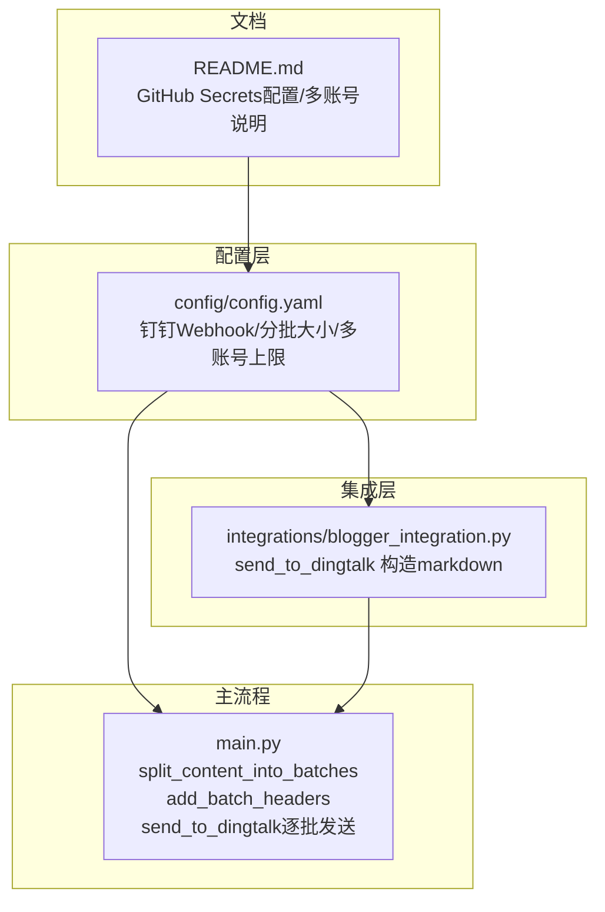
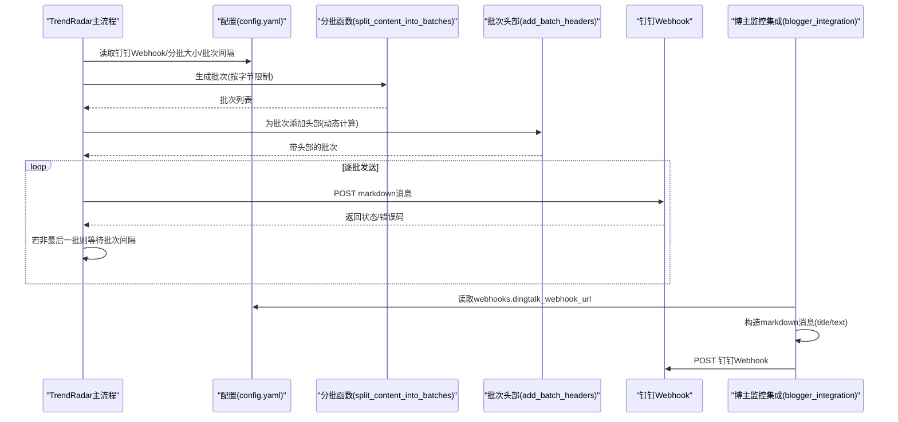
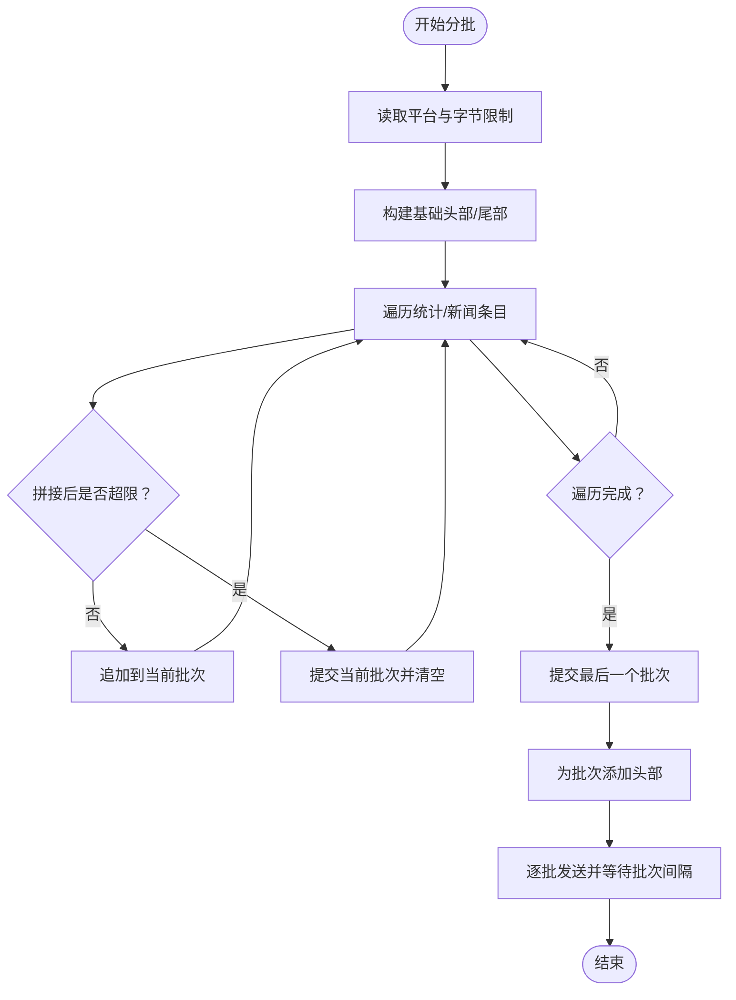
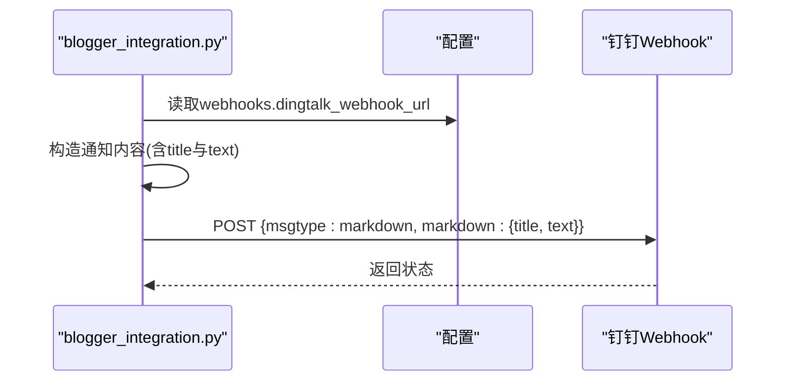
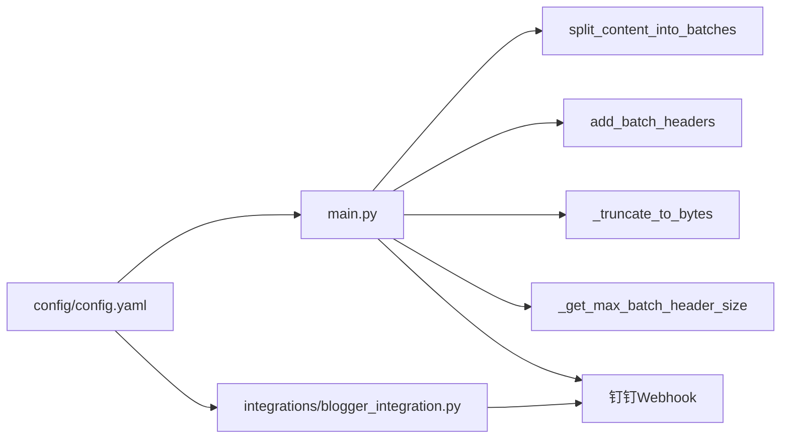

# 钉钉通知集成

<cite>
**本文引用的文件**
- [config/config.yaml](file://config/config.yaml)
- [main.py](file://main.py)
- [integrations/blogger_integration.py](file://integrations/blogger_integration.py)
- [README.md](file://README.md)
</cite>

## 目录
1. [简介](#简介)
2. [项目结构](#项目结构)
3. [核心组件](#核心组件)
4. [架构总览](#架构总览)
5. [详细组件分析](#详细组件分析)
6. [依赖关系分析](#依赖关系分析)
7. [性能与可靠性考量](#性能与可靠性考量)
8. [故障排查指南](#故障排查指南)
9. [结论](#结论)
10. [附录](#附录)

## 简介
本文件面向希望在TrendRadar中集成钉钉群机器人通知的开发者与运维人员，系统性阐述通过Webhook与钉钉群机器人通信的实现机制。重点覆盖以下方面：
- config.yaml中钉钉相关配置项的规范与含义
- 多机器人账号的分号分隔管理方式
- TrendRadar主流程对钉钉消息的分批发送与长度限制处理
- 博主监控集成模块中send_to_dingtalk函数的消息格式构造逻辑
- 安全最佳实践：使用GitHub Secrets存储Webhook以避免泄露

## 项目结构
与钉钉通知集成相关的代码主要分布在以下位置：
- 配置层：config/config.yaml中包含钉钉Webhook地址、分批大小、批次间隔、多账号上限等配置
- 主流程：main.py中实现钉钉消息分批、批次头部、长度截断、逐批发送与批次间隔
- 集成层：integrations/blogger_integration.py中提供send_to_dingtalk函数，负责将博主监控结果封装为钉钉markdown消息并发送
- 文档指引：README.md中提供GitHub Secrets配置与多账号分号分隔的说明

图表来源
- [config/config.yaml](file://config/config.yaml#L34-L109)
- [integrations/blogger_integration.py](file://integrations/blogger_integration.py#L192-L216)
- [main.py](file://main.py#L3263-L3449)
- [README.md](file://README.md#L1031-L1059)

章节来源
- [config/config.yaml](file://config/config.yaml#L34-L109)
- [integrations/blogger_integration.py](file://integrations/blogger_integration.py#L192-L216)
- [main.py](file://main.py#L3263-L3449)
- [README.md](file://README.md#L1031-L1059)

## 核心组件
- 配置项与多账号管理
  - 钉钉Webhook地址：通过环境变量或配置文件注入，支持多账号；多账号使用分号分隔
  - 分批大小与批次间隔：钉钉专用分批大小与通用批次间隔共同决定消息拆分与发送节奏
  - 多账号上限：每个渠道最多支持的数量限制，超出部分会被截断
- 主流程分批与长度控制
  - split_content_into_batches：按平台与字节限制生成批次，保证词组标题+至少一条新闻的原子性
  - add_batch_headers：为批次统一添加头部，动态计算允许内容大小，避免超限
  - send_to_dingtalk：逐批发送，支持批次间延迟
- 集成层消息构造
  - send_to_dingtalk：构造钉钉markdown消息，包含msgtype与markdown字段，title与text由主流程生成

章节来源
- [config/config.yaml](file://config/config.yaml#L34-L109)
- [main.py](file://main.py#L3263-L3449)
- [main.py](file://main.py#L4100-L4154)
- [integrations/blogger_integration.py](file://integrations/blogger_integration.py#L192-L216)

## 架构总览
TrendRadar通过两条路径与钉钉交互：
- 主流程推送：由主流程生成报告内容，按钉钉字节限制进行分批，逐批发送至钉钉Webhook
- 博主监控集成：将博主监控结果转换为TrendRadar格式并发送通知，其中包含钉钉通道

图表来源
- [config/config.yaml](file://config/config.yaml#L34-L109)
- [main.py](file://main.py#L3263-L3449)
- [main.py](file://main.py#L4100-L4154)
- [integrations/blogger_integration.py](file://integrations/blogger_integration.py#L192-L216)

## 详细组件分析

### 配置规范与多账号管理
- 钉钉Webhook地址
  - 通过环境变量或配置文件注入，名称为DINGTALK_WEBHOOK_URL
  - 支持多账号，使用分号分隔
- 分批大小与批次间隔
  - 钉钉专用分批大小：DINGTALK_BATCH_SIZE（字节）
  - 通用批次间隔：BATCH_SEND_INTERVAL（秒）
- 多账号上限
  - max_accounts_per_channel：每个渠道最多支持的数量，超出部分被截断
- 安全提示
  - 严禁在配置文件中直接填写Webhook，应使用GitHub Secrets存储

章节来源
- [config/config.yaml](file://config/config.yaml#L34-L109)
- [README.md](file://README.md#L846-L900)
- [README.md](file://README.md#L1031-L1059)

### 主流程分批与长度控制
- 分批策略
  - split_content_into_batches：按平台与字节限制生成批次，确保词组标题+至少一条新闻的原子性
  - 对于钉钉，使用DINGTALK_BATCH_SIZE作为最大字节限制
- 批次头部与长度截断
  - add_batch_headers：为批次统一添加头部，动态计算允许内容大小，避免超限
  - _truncate_to_bytes：安全截断字符串到指定字节数，避免截断多字节字符
- 逐批发送与批次间隔
  - send_to_dingtalk：逐批POST消息，若返回错误码或状态码非200则中止
  - 在非最后一批次之间插入BATCH_SEND_INTERVAL秒的等待，降低风控与抖动风险

图表来源
- [main.py](file://main.py#L3263-L3449)
- [main.py](file://main.py#L3179-L3261)
- [main.py](file://main.py#L4100-L4154)

章节来源
- [main.py](file://main.py#L3263-L3449)
- [main.py](file://main.py#L3179-L3261)
- [main.py](file://main.py#L4100-L4154)

### 集成层send_to_dingtalk消息构造
- 构造逻辑
  - send_to_dingtalk：构造钉钉markdown消息，包含msgtype与markdown字段
  - title与text字段来源于上层通知内容（由主流程生成），此处仅负责打包发送
- 与主流程的关系
  - 集成层的send_to_dingtalk与主流程的send_to_dingtalk职责不同：前者用于博主监控场景，后者用于常规报告推送

图表来源
- [integrations/blogger_integration.py](file://integrations/blogger_integration.py#L192-L216)
- [config/config.yaml](file://config/config.yaml#L92-L109)

章节来源
- [integrations/blogger_integration.py](file://integrations/blogger_integration.py#L192-L216)
- [config/config.yaml](file://config/config.yaml#L92-L109)

### 多机器人账号的分号分隔管理
- 配置与解析
  - 配置项：DINGTALK_WEBHOOK_URL（或webhooks.dingtalk_webhook_url）
  - 解析方式：分号分隔多个URL
  - 限制：受max_accounts_per_channel约束，超出部分被截断
- GitHub Secrets配置
  - 使用分号分隔多个账号值，示例：https://oapi.dingtalk.com/robot/send?access_token=...
  - 严禁在仓库中明文存储Webhook，应使用GitHub Secrets

章节来源
- [config/config.yaml](file://config/config.yaml#L34-L109)
- [README.md](file://README.md#L846-L900)
- [README.md](file://README.md#L1031-L1059)

## 依赖关系分析
- 配置依赖
  - 主流程依赖config.yaml中的DINGTALK_BATCH_SIZE、BATCH_SEND_INTERVAL、max_accounts_per_channel
  - 集成层依赖config.yaml中的webhooks.dingtalk_webhook_url
- 函数依赖
  - send_to_dingtalk依赖split_content_into_batches与add_batch_headers
  - 分批函数依赖_get_max_batch_header_size与_truncate_to_bytes
- 外部依赖
  - 钉钉Webhook接口，要求POST JSON，响应包含errcode与errmsg

图表来源
- [config/config.yaml](file://config/config.yaml#L34-L109)
- [main.py](file://main.py#L3263-L3449)
- [main.py](file://main.py#L4100-L4154)
- [integrations/blogger_integration.py](file://integrations/blogger_integration.py#L192-L216)

章节来源
- [config/config.yaml](file://config/config.yaml#L34-L109)
- [main.py](file://main.py#L3263-L3449)
- [main.py](file://main.py#L4100-L4154)
- [integrations/blogger_integration.py](file://integrations/blogger_integration.py#L192-L216)

## 性能与可靠性考量
- 分批大小与批次间隔
  - DINGTALK_BATCH_SIZE控制单批字节上限，避免超限导致失败
  - BATCH_SEND_INTERVAL在批次间增加等待，降低风控与抖动风险
- 长度截断与安全
  - _truncate_to_bytes确保截断不破坏UTF-8编码
  - add_batch_headers动态计算允许内容大小，避免事后截断破坏完整性
- 错误处理
  - send_to_dingtalk在非200或errcode非0时中止后续批次发送，避免累积失败
- 多账号发送
  - parse_multi_account_config解析多账号，limit_accounts按上限截断
  - 逐账号发送，任一失败不影响其他账号

章节来源
- [main.py](file://main.py#L3179-L3261)
- [main.py](file://main.py#L3263-L3449)
- [main.py](file://main.py#L4100-L4154)

## 故障排查指南
- Webhook未生效
  - 检查是否使用GitHub Secrets而非明文配置
  - 确认DINGTALK_WEBHOOK_URL是否正确且包含分号分隔的多个URL
- 发送失败
  - 查看返回状态码与errcode/errmsg
  - 检查批次大小是否过大，适当减小DINGTALK_BATCH_SIZE
- 消息被截断
  - 确认_get_max_batch_header_size与add_batch_headers的预留空间是否合理
  - 检查是否因批次头部过大导致内容被截断
- 多账号未全部发送
  - 检查max_accounts_per_channel是否小于账号数量
  - 确认limit_accounts逻辑是否生效

章节来源
- [README.md](file://README.md#L846-L900)
- [config/config.yaml](file://config/config.yaml#L34-L109)
- [main.py](file://main.py#L4100-L4154)

## 结论
TrendRadar对钉钉通知的集成采用“配置驱动+主流程分批”的设计：通过config.yaml统一管理Webhook与分批策略，借助split_content_into_batches与add_batch_headers保障消息完整性与合规性，再由send_to_dingtalk实现逐批发送与批次间隔控制。博主监控集成模块提供独立的send_to_dingtalk，便于将特定事件（如博主动态）以钉钉markdown形式推送。配合GitHub Secrets的安全实践，可有效避免Webhook泄露带来的安全风险。

## 附录
- 配置项速查
  - DINGTALK_WEBHOOK_URL：钉钉Webhook地址（多账号分号分隔）
  - DINGTALK_BATCH_SIZE：钉钉消息分批大小（字节）
  - BATCH_SEND_INTERVAL：批次发送间隔（秒）
  - max_accounts_per_channel：每渠道最大账号数量
- 安全最佳实践
  - 严禁在仓库中明文存储Webhook，使用GitHub Secrets
  - 多账号使用分号分隔，确保数量一致与上限控制

章节来源
- [config/config.yaml](file://config/config.yaml#L34-L109)
- [README.md](file://README.md#L846-L900)
- [README.md](file://README.md#L1031-L1059)