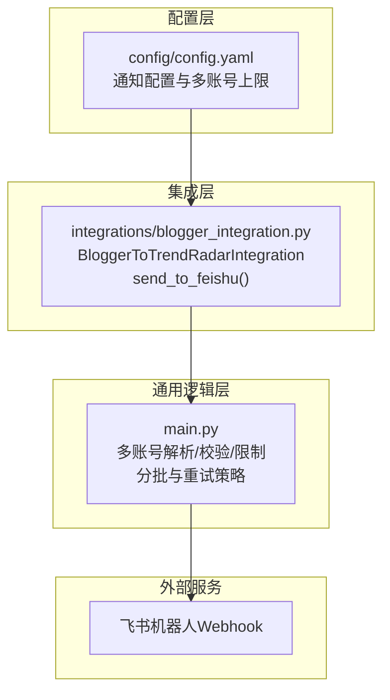
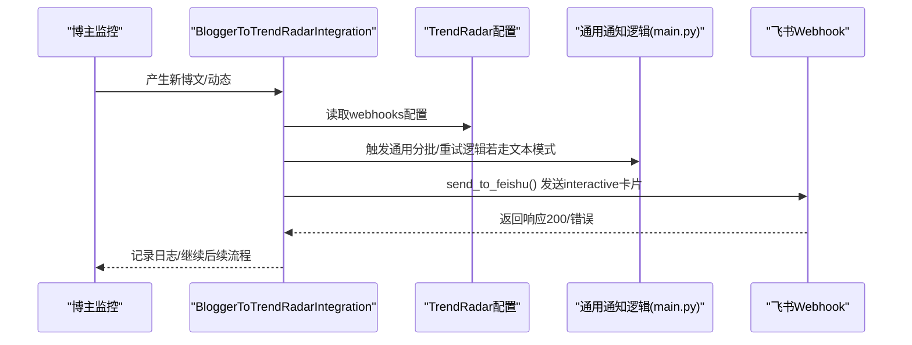
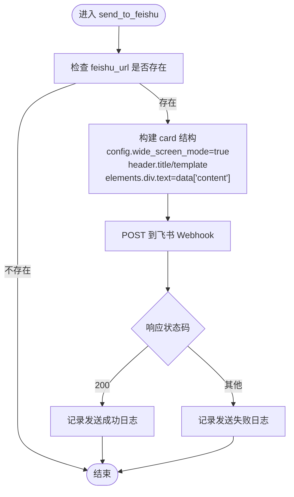
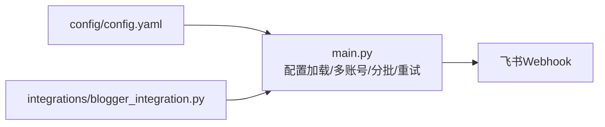

# 飞书通知集成

<cite>
**本文引用的文件**
- [config/config.yaml](file://config/config.yaml)
- [integrations/blogger_integration.py](file://integrations/blogger_integration.py)
- [main.py](file://main.py)
- [README-EN.md](file://README-EN.md)
</cite>

## 目录
1. [简介](#简介)
2. [项目结构](#项目结构)
3. [核心组件](#核心组件)
4. [架构总览](#架构总览)
5. [详细组件分析](#详细组件分析)
6. [依赖关系分析](#依赖关系分析)
7. [性能考量](#性能考量)
8. [故障排查指南](#故障排查指南)
9. [结论](#结论)
10. [附录](#附录)

## 简介
本文件面向希望在TrendRadar中集成飞书通知的用户与开发者，聚焦以下目标：
- 说明config.yaml中飞书相关配置项的含义与设置方法
- 解释多账号分号分隔的使用模式与限制
- 详解blogger_integration.py中的send_to_feishu函数如何构建符合飞书interactive卡片格式的消息结构（header、elements、wide_screen_mode）
- 提供消息模板要点，包括标题颜色、内容格式与分割线（feishu_message_separator）
- 说明认证机制、错误重试策略与常见问题（如414 Request-URI Too Large）的分批处理方案

## 项目结构
与飞书通知相关的文件与职责概览：
- config/config.yaml：集中存放通知配置，包含飞书批量大小、消息分割线、多账号上限等
- integrations/blogger_integration.py：博主监控与TrendRadar推送系统的集成模块，负责将博主动态转换为TrendRadar格式并发送到各渠道（含飞书）
- main.py：通用通知发送逻辑（文本模式）、分批策略、多账号解析与校验、错误处理与重试
- README-EN.md：飞书机器人配置步骤与多账号配置示例

图表来源
- [config/config.yaml](file://config/config.yaml#L34-L46)
- [integrations/blogger_integration.py](file://integrations/blogger_integration.py#L150-L191)
- [main.py](file://main.py#L58-L141)

章节来源
- [config/config.yaml](file://config/config.yaml#L34-L46)
- [integrations/blogger_integration.py](file://integrations/blogger_integration.py#L150-L191)
- [main.py](file://main.py#L58-L141)

## 核心组件
- 飞书批量大小与分割线
  - 在config.yaml中，notification段落提供feishu_batch_size与feishu_message_separator两项关键配置，分别控制消息分批大小（字节）与飞书消息分隔线样式
- 多账号分号分隔
  - config.yaml明确指出多账号使用分号分隔；README-EN.md进一步给出示例与注意事项
- send_to_feishu函数
  - 构建飞书interactive卡片消息，包含card.config.wide_screen_mode、header.title与header.template、elements.div.text等字段
- 通用分批与重试
  - main.py提供多账号解析、配对校验、账号数量限制、分批策略、批次间隔、错误处理与重试逻辑

章节来源
- [config/config.yaml](file://config/config.yaml#L34-L46)
- [README-EN.md](file://README-EN.md#L809-L992)
- [integrations/blogger_integration.py](file://integrations/blogger_integration.py#L150-L191)
- [main.py](file://main.py#L58-L141)

## 架构总览
下图展示从博主监控到飞书通知的整体流程，以及与通用通知逻辑的交互。

图表来源
- [integrations/blogger_integration.py](file://integrations/blogger_integration.py#L103-L149)
- [integrations/blogger_integration.py](file://integrations/blogger_integration.py#L150-L191)
- [main.py](file://main.py#L4008-L4045)

## 详细组件分析

### 配置项：feishu_url与feishu_batch_size
- feishu_url
  - 位于config.yaml的webhooks段落，用于填写飞书机器人Webhook地址；支持多账号分号分隔
  - 也可通过环境变量FEISHU_WEBHOOK_URL覆盖
- feishu_batch_size
  - 位于config.yaml的notification段落，单位为字节，用于控制飞书消息分批大小
  - 通用逻辑层会基于此配置进行分批与批次头部预留，避免超限
- feishu_message_separator
  - 位于config.yaml的notification段落，作为飞书消息分隔线内容，用于分隔不同词组或新增热点区域

章节来源
- [config/config.yaml](file://config/config.yaml#L34-L46)
- [config/config.yaml](file://config/config.yaml#L92-L101)
- [main.py](file://main.py#L204-L214)

### 多账号分号分隔使用模式
- 配置方式
  - 在FEISHU_WEBHOOK_URL中使用英文分号分隔多个Webhook地址
  - README-EN.md提供了示例与注意事项，强调每个渠道最多支持max_accounts_per_channel个账号
- 解析与校验
  - parse_multi_account_config按分号拆分并保留空串占位
  - validate_paired_configs用于校验配对配置数量一致性（如Telegram的token与chat_id）
  - limit_accounts限制账号数量，超过上限将截断
- 使用建议
  - 若fork部署，注意账号数量过多可能导致运行时间过长与账号风险

章节来源
- [config/config.yaml](file://config/config.yaml#L76-L91)
- [README-EN.md](file://README-EN.md#L809-L992)
- [main.py](file://main.py#L58-L141)

### send_to_feishu函数：飞书interactive卡片消息结构
send_to_feishu函数构建的payload包含以下关键字段：
- msg_type：interactive
- card.config.wide_screen_mode：开启宽屏模式，提升移动端阅读体验
- card.header
  - title：纯文本标题
  - template：标题模板颜色（如blue）
- card.elements
  - div元素，text为纯文本内容，承载通知正文

图表来源
- [integrations/blogger_integration.py](file://integrations/blogger_integration.py#L150-L191)

章节来源
- [integrations/blogger_integration.py](file://integrations/blogger_integration.py#L150-L191)

### 消息模板要点：标题颜色、内容格式与分割线
- 标题颜色
  - header.template用于设置标题模板颜色（如blue），可在飞书卡片中呈现不同色彩风格
- 内容格式
  - send_to_feishu使用纯文本div.text承载正文，适合简洁明了的文本展示
  - 若需要富文本或复杂布局，可考虑在上游生成Markdown或HTML，再由通用逻辑层进行分批与格式化
- 分割线
  - feishu_message_separator用于在不同词组或新增热点区域之间插入分隔线，提升可读性

章节来源
- [integrations/blogger_integration.py](file://integrations/blogger_integration.py#L150-L191)
- [config/config.yaml](file://config/config.yaml#L34-L46)

### 认证机制与安全
- Webhook认证
  - 飞书Webhook通常通过URL中的密钥进行认证，无需额外请求头
- 安全建议
  - 不要公开webhook；推荐使用GitHub Secrets存储敏感配置
  - README-EN.md明确指出多账号配置与安全注意事项

章节来源
- [config/config.yaml](file://config/config.yaml#L60-L82)
- [README-EN.md](file://README-EN.md#L809-L992)

### 错误重试策略与常见问题
- 通用重试与错误处理
  - main.py对各渠道统一处理：状态码非200时记录失败；部分渠道（如ntfy）支持重试与速率限制处理
  - 飞书文本模式（通用逻辑）采用分批策略，预留批次头部空间，避免超限
- 常见问题：414 Request-URI Too Large
  - 该问题通常出现在长查询参数导致的URI过长场景。通用逻辑通过“分批”与“批次头部预留”降低单批大小，从而规避该类问题
  - 对于飞书interactive卡片，建议优先使用POST请求体传递消息内容，避免过长的URI参数

章节来源
- [main.py](file://main.py#L4008-L4045)
- [main.py](file://main.py#L4260-L4286)

## 依赖关系分析
- 配置依赖
  - config/config.yaml提供基础配置，main.py将其加载到内存并合并环境变量
- 组件耦合
  - integrations/blogger_integration.py依赖TrendRadar配置与通用通知逻辑
  - main.py提供多账号解析、分批与重试能力，被各渠道复用
- 外部依赖
  - 飞书Webhook作为外部服务，遵循其消息格式与限制

图表来源
- [config/config.yaml](file://config/config.yaml#L162-L300)
- [main.py](file://main.py#L58-L141)
- [integrations/blogger_integration.py](file://integrations/blogger_integration.py#L150-L191)

章节来源
- [config/config.yaml](file://config/config.yaml#L162-L300)
- [main.py](file://main.py#L58-L141)
- [integrations/blogger_integration.py](file://integrations/blogger_integration.py#L150-L191)

## 性能考量
- 分批发送
  - 使用feishu_batch_size控制单批字节数，结合批次头部预留，避免超限
- 批次间隔
  - 通过batch_send_interval在批次间增加延迟，降低对外部服务的压力
- 多账号并发
  - 各账号独立发送，一个失败不影响其他账号；但会增加总耗时

章节来源
- [config/config.yaml](file://config/config.yaml#L34-L46)
- [main.py](file://main.py#L204-L214)
- [main.py](file://main.py#L4260-L4286)

## 故障排查指南
- 无法发送到飞书
  - 检查feishu_url是否正确且可用
  - 查看日志中是否有HTTP状态码与错误信息
- 多账号配置无效
  - 确认FEISHU_WEBHOOK_URL使用分号分隔
  - 检查是否超过max_accounts_per_channel上限
- 消息过大或超限
  - 减少单批内容或调整feishu_batch_size
  - 使用分隔线减少冗余内容
- 414 Request-URI Too Large
  - 优先使用POST请求体而非长URI参数
  - 通过分批与头部预留降低单批大小

章节来源
- [config/config.yaml](file://config/config.yaml#L34-L46)
- [config/config.yaml](file://config/config.yaml#L76-L91)
- [main.py](file://main.py#L4008-L4045)
- [main.py](file://main.py#L4260-L4286)

## 结论
通过合理配置config.yaml中的飞书相关参数、规范多账号分号分隔、利用send_to_feishu构建飞书interactive卡片消息，并结合main.py提供的分批与重试策略，TrendRadar能够在保证安全的前提下稳定地将博主监控结果推送到飞书。遇到超限或网络异常时，建议优先采用分批与批次间隔策略，并根据日志定位具体原因。

## 附录
- 飞书机器人配置步骤与示例可参考README-EN.md中的“Feishu Bot”章节
- 多账号配置示例与注意事项可参考README-EN.md中的“Multi-Account Push Notes”

章节来源
- [README-EN.md](file://README-EN.md#L809-L992)