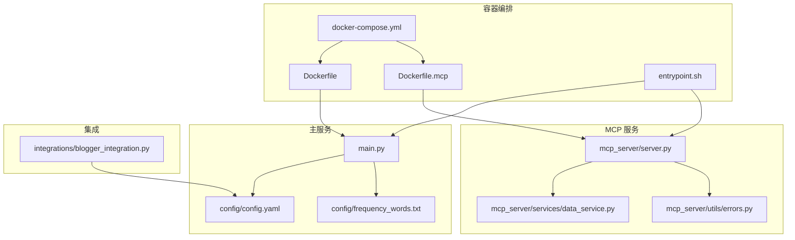
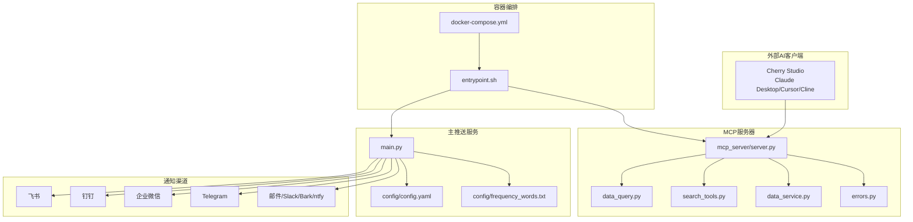
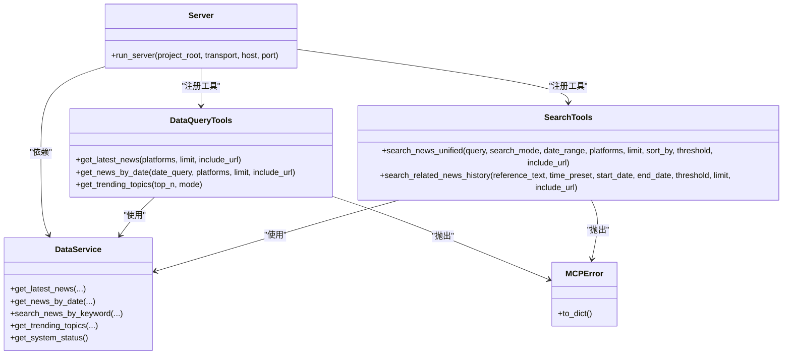
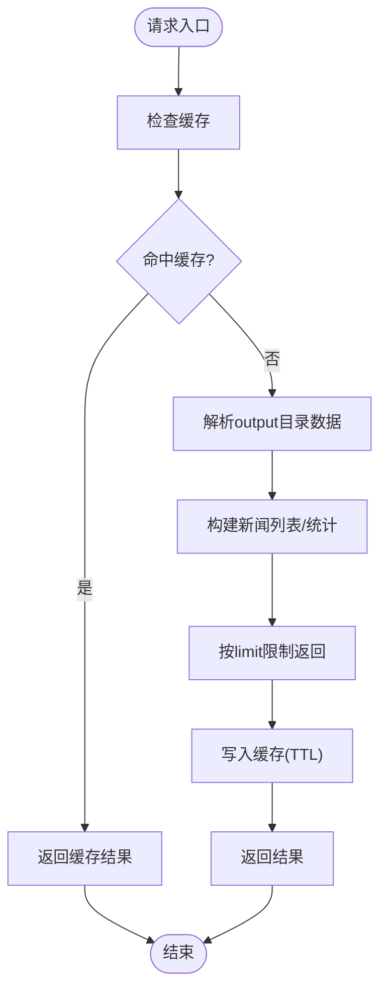
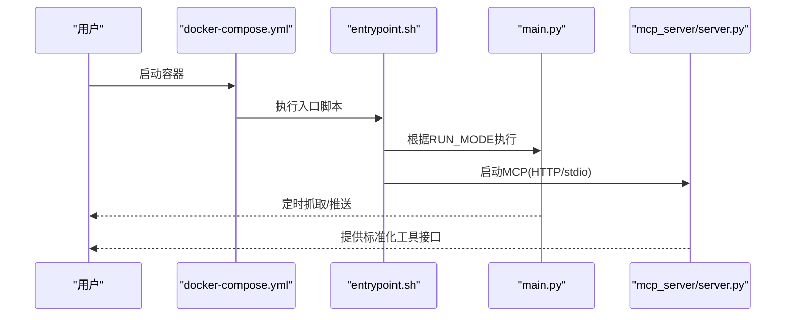
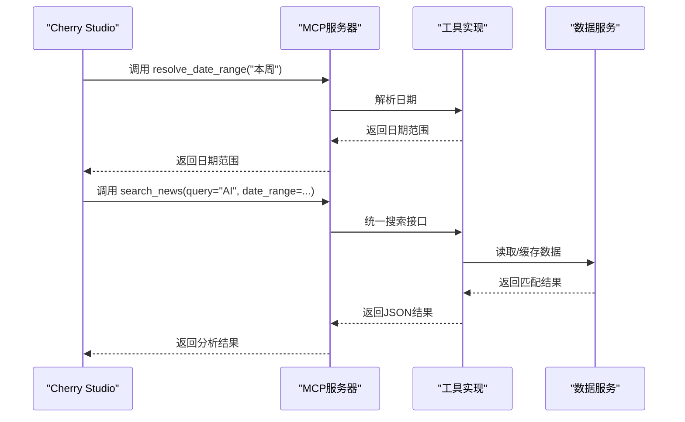
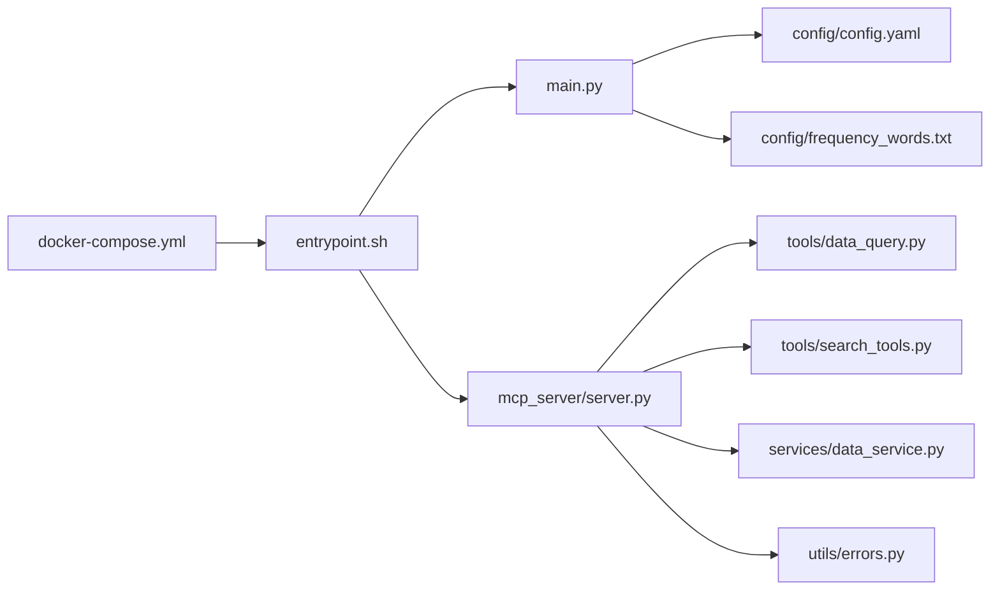

# 集成与扩展架构

<cite>
**本文引用的文件**
- [README.md](file://README.md)
- [mcp_server/server.py](file://mcp_server/server.py)
- [mcp_server/tools/data_query.py](file://mcp_server/tools/data_query.py)
- [mcp_server/tools/search_tools.py](file://mcp_server/tools/search_tools.py)
- [mcp_server/services/data_service.py](file://mcp_server/services/data_service.py)
- [mcp_server/utils/errors.py](file://mcp_server/utils/errors.py)
- [config/config.yaml](file://config/config.yaml)
- [config/frequency_words.txt](file://config/frequency_words.txt)
- [docker/docker-compose.yml](file://docker/docker-compose.yml)
- [docker/Dockerfile](file://docker/Dockerfile)
- [docker/Dockerfile.mcp](file://docker/Dockerfile.mcp)
- [docker/entrypoint.sh](file://docker/entrypoint.sh)
- [integrations/blogger_integration.py](file://integrations/blogger_integration.py)
- [main.py](file://main.py)
</cite>

## 目录
1. [简介](#简介)
2. [项目结构](#项目结构)
3. [核心组件](#核心组件)
4. [架构总览](#架构总览)
5. [详细组件分析](#详细组件分析)
6. [依赖关系分析](#依赖关系分析)
7. [性能考量](#性能考量)
8. [故障排查指南](#故障排查指南)
9. [结论](#结论)
10. [附录](#附录)

## 简介
本文件聚焦 TrendRadar 的“集成与扩展”能力，围绕 MCP 服务器如何作为核心集成点，通过标准化工具接口（如 get_latest_news、search_news）与外部 AI 系统（如 Cherry Studio）集成，实现对话式数据分析；同时阐述通过 Webhook 与企业微信、飞书、钉钉、Telegram 等 10+ 通知渠道的集成方式；说明 Docker 与 docker-compose.yml 如何实现容器化部署与依赖管理；最后分析当前架构的扩展点与未来插件化方向，并讨论安全性、认证与错误处理策略。

## 项目结构
- 核心运行与推送逻辑集中在根目录脚本与配置中，负责定时抓取、报告生成与多渠道推送。
- MCP 服务器位于 mcp_server 目录，提供标准化工具接口，面向外部 AI 客户端（如 Cherry Studio）。
- 配置与关键词规则位于 config 目录，支持通过修改 config.yaml 与 frequency_words.txt 进行功能扩展。
- docker 目录提供容器化镜像与编排文件，支持独立运行 MCP 服务与主推送服务。

图表来源
- [docker/docker-compose.yml](file://docker/docker-compose.yml#L1-L74)
- [docker/Dockerfile](file://docker/Dockerfile#L1-L71)
- [docker/Dockerfile.mcp](file://docker/Dockerfile.mcp#L1-L24)
- [docker/entrypoint.sh](file://docker/entrypoint.sh#L1-L50)
- [main.py](file://main.py#L1-L200)
- [mcp_server/server.py](file://mcp_server/server.py#L1-L120)
- [mcp_server/services/data_service.py](file://mcp_server/services/data_service.py#L1-L120)
- [mcp_server/utils/errors.py](file://mcp_server/utils/errors.py#L1-L94)
- [config/config.yaml](file://config/config.yaml#L1-L140)
- [config/frequency_words.txt](file://config/frequency_words.txt#L1-L114)
- [integrations/blogger_integration.py](file://integrations/blogger_integration.py#L1-L120)

章节来源
- [README.md](file://README.md#L312-L365)
- [docker/docker-compose.yml](file://docker/docker-compose.yml#L1-L74)
- [docker/Dockerfile](file://docker/Dockerfile#L1-L71)
- [docker/Dockerfile.mcp](file://docker/Dockerfile.mcp#L1-L24)
- [docker/entrypoint.sh](file://docker/entrypoint.sh#L1-L50)
- [main.py](file://main.py#L1-L200)
- [mcp_server/server.py](file://mcp_server/server.py#L1-L120)
- [mcp_server/services/data_service.py](file://mcp_server/services/data_service.py#L1-L120)
- [mcp_server/utils/errors.py](file://mcp_server/utils/errors.py#L1-L94)
- [config/config.yaml](file://config/config.yaml#L1-L140)
- [config/frequency_words.txt](file://config/frequency_words.txt#L1-L114)
- [integrations/blogger_integration.py](file://integrations/blogger_integration.py#L1-L120)

## 核心组件
- MCP 服务器：提供标准化工具接口，支持 stdio 与 HTTP 两种传输模式，面向外部 AI 客户端（如 Cherry Studio）。
- 数据服务层：封装数据访问与缓存，统一对外提供最新新闻、按日期查询、关键词搜索、趋势统计等能力。
- 工具实现：数据查询工具、智能检索工具、分析工具、配置与系统管理工具。
- 配置与关键词：通过 config.yaml 与 frequency_words.txt 控制推送模式、权重、平台、通知渠道等。
- Docker 与编排：通过 docker-compose.yml 同时运行主推送服务与 MCP 服务，挂载配置与输出目录，支持环境变量覆盖。
- 集成扩展：提供博客监控与 TrendRadar 推送通道的集成示例，便于扩展第三方内容源。

章节来源
- [mcp_server/server.py](file://mcp_server/server.py#L1-L120)
- [mcp_server/tools/data_query.py](file://mcp_server/tools/data_query.py#L1-L120)
- [mcp_server/tools/search_tools.py](file://mcp_server/tools/search_tools.py#L1-L120)
- [mcp_server/services/data_service.py](file://mcp_server/services/data_service.py#L1-L120)
- [config/config.yaml](file://config/config.yaml#L1-L140)
- [config/frequency_words.txt](file://config/frequency_words.txt#L1-L114)
- [docker/docker-compose.yml](file://docker/docker-compose.yml#L1-L74)
- [integrations/blogger_integration.py](file://integrations/blogger_integration.py#L1-L120)

## 架构总览
TrendRadar 的集成与扩展架构以 MCP 服务器为核心，通过标准化工具接口与外部 AI 客户端（如 Cherry Studio）进行对话式数据分析；同时，主推送服务负责定时抓取、报告生成与多渠道通知。容器化部署通过 docker-compose.yml 将主服务与 MCP 服务解耦运行，便于独立扩展与运维。

图表来源
- [mcp_server/server.py](file://mcp_server/server.py#L660-L782)
- [mcp_server/tools/data_query.py](file://mcp_server/tools/data_query.py#L1-L120)
- [mcp_server/tools/search_tools.py](file://mcp_server/tools/search_tools.py#L1-L120)
- [mcp_server/services/data_service.py](file://mcp_server/services/data_service.py#L1-L120)
- [mcp_server/utils/errors.py](file://mcp_server/utils/errors.py#L1-L94)
- [main.py](file://main.py#L1-L200)
- [config/config.yaml](file://config/config.yaml#L1-L140)
- [config/frequency_words.txt](file://config/frequency_words.txt#L1-L114)
- [docker/docker-compose.yml](file://docker/docker-compose.yml#L1-L74)
- [docker/entrypoint.sh](file://docker/entrypoint.sh#L1-L50)

## 详细组件分析

### MCP 服务器与工具接口
- 传输模式：支持 stdio 与 HTTP（生产推荐），通过命令行参数或环境变量控制。
- 工具分类：
  - 日期解析工具：resolve_date_range，统一自然语言日期解析，确保 AI 模型与服务端日期一致。
  - 数据查询工具：get_latest_news、get_news_by_date、get_trending_topics，提供最新、按日期、关注词趋势等查询。
  - 智能检索工具：search_news、search_related_news_history，支持关键词/模糊/实体搜索与历史相关性检索。
  - 高级分析工具：analyze_topic_trend、analyze_data_insights、analyze_sentiment、find_similar_news、generate_summary_report。
  - 配置与系统管理：get_current_config、get_system_status、trigger_crawl。
- 错误处理：统一抛出自定义 MCPError 及派生类，返回结构化的错误信息，便于客户端处理。

图表来源
- [mcp_server/server.py](file://mcp_server/server.py#L1-L120)
- [mcp_server/tools/data_query.py](file://mcp_server/tools/data_query.py#L1-L120)
- [mcp_server/tools/search_tools.py](file://mcp_server/tools/search_tools.py#L1-L120)
- [mcp_server/services/data_service.py](file://mcp_server/services/data_service.py#L1-L120)
- [mcp_server/utils/errors.py](file://mcp_server/utils/errors.py#L1-L94)

章节来源
- [mcp_server/server.py](file://mcp_server/server.py#L1-L120)
- [mcp_server/server.py](file://mcp_server/server.py#L660-L782)
- [mcp_server/tools/data_query.py](file://mcp_server/tools/data_query.py#L1-L120)
- [mcp_server/tools/search_tools.py](file://mcp_server/tools/search_tools.py#L1-L120)
- [mcp_server/utils/errors.py](file://mcp_server/utils/errors.py#L1-L94)

### 数据服务与缓存
- 数据服务封装了对 output 目录的解析与缓存，提供最新新闻、按日期查询、关键词搜索、趋势统计等能力。
- 缓存策略：针对不同查询设置 TTL，降低重复查询开销。
- 错误处理：当数据不存在时抛出 DataNotFoundError，便于上层工具统一处理。

图表来源
- [mcp_server/services/data_service.py](file://mcp_server/services/data_service.py#L1-L120)
- [mcp_server/services/data_service.py](file://mcp_server/services/data_service.py#L120-L220)
- [mcp_server/services/data_service.py](file://mcp_server/services/data_service.py#L220-L320)

章节来源
- [mcp_server/services/data_service.py](file://mcp_server/services/data_service.py#L1-L220)

### 配置与关键词扩展
- config.yaml：控制爬虫开关、推送模式、权重、平台列表、通知渠道与多账号配置、推送时间窗口等。
- frequency_words.txt：定义个人关注词列表，支持普通词、必须词、过滤词、数量限制、全局过滤等语义。
- 扩展点：通过修改 config.yaml 与 frequency_words.txt 即可调整推送策略、关键词筛选与权重分配。

章节来源
- [config/config.yaml](file://config/config.yaml#L1-L140)
- [config/frequency_words.txt](file://config/frequency_words.txt#L1-L114)

### Docker 与 docker-compose 部署
- docker-compose.yml：同时运行 trend-radar（主推送服务）与 trend-radar-mcp（MCP 服务），挂载 config 与 output，通过环境变量覆盖配置。
- Dockerfile/Dockerfile.mcp：分别构建主服务与 MCP 服务镜像，暴露端口与必要目录。
- entrypoint.sh：根据 RUN_MODE 决定单次执行或 cron 定时执行，支持立即执行与 Web 服务器启动。

图表来源
- [docker/docker-compose.yml](file://docker/docker-compose.yml#L1-L74)
- [docker/Dockerfile](file://docker/Dockerfile#L1-L71)
- [docker/Dockerfile.mcp](file://docker/Dockerfile.mcp#L1-L24)
- [docker/entrypoint.sh](file://docker/entrypoint.sh#L1-L50)
- [mcp_server/server.py](file://mcp_server/server.py#L660-L782)

章节来源
- [docker/docker-compose.yml](file://docker/docker-compose.yml#L1-L74)
- [docker/Dockerfile](file://docker/Dockerfile#L1-L71)
- [docker/Dockerfile.mcp](file://docker/Dockerfile.mcp#L1-L24)
- [docker/entrypoint.sh](file://docker/entrypoint.sh#L1-L50)

### 通知渠道集成（Webhook）
- 支持企业微信、飞书、钉钉、Telegram、邮件、ntfy、Bark、Slack 等 10+ 渠道。
- 多账号支持：通过分号分隔多个账号，自动校验配对参数数量一致性，限制最大账号数。
- 配置位置：config.yaml 的 notification.webhooks 下，支持环境变量覆盖。
- 集成示例：integrations/blogger_integration.py 展示如何将外部内容通过 TrendRadar 的推送通道发送至飞书、钉钉、Telegram。

章节来源
- [README.md](file://README.md#L312-L365)
- [config/config.yaml](file://config/config.yaml#L92-L140)
- [integrations/blogger_integration.py](file://integrations/blogger_integration.py#L1-L120)
- [main.py](file://main.py#L58-L160)

### 与 Cherry Studio 的集成流程
- Cherry Studio 通过 MCP 协议连接 TrendRadar 的 MCP 服务器，调用标准化工具接口进行对话式数据分析。
- 推荐流程：先调用 resolve_date_range 获取标准日期范围，再调用具体分析工具（如 search_news、analyze_sentiment、analyze_topic_trend）。
- 传输模式：HTTP（生产环境）或 stdio（调试/集成）。

图表来源
- [mcp_server/server.py](file://mcp_server/server.py#L40-L120)
- [mcp_server/server.py](file://mcp_server/server.py#L460-L540)
- [mcp_server/tools/search_tools.py](file://mcp_server/tools/search_tools.py#L1-L120)
- [mcp_server/services/data_service.py](file://mcp_server/services/data_service.py#L1-L120)

章节来源
- [mcp_server/server.py](file://mcp_server/server.py#L40-L120)
- [mcp_server/server.py](file://mcp_server/server.py#L460-L540)
- [mcp_server/tools/search_tools.py](file://mcp_server/tools/search_tools.py#L1-L120)
- [mcp_server/services/data_service.py](file://mcp_server/services/data_service.py#L1-L120)

### 扩展点与插件化设计
- 配置扩展：通过 config.yaml 与 frequency_words.txt 调整推送模式、权重、平台、通知渠道与关键词策略。
- 工具扩展：在 mcp_server/tools 下新增工具类与注册装饰器，即可扩展新的分析/检索能力。
- 数据源扩展：通过扩展解析器与数据服务，接入新的数据源或格式。
- 插件化方向：将工具注册与路由抽象为插件接口，支持动态加载与热插拔；将通知渠道抽象为插件，统一接入与配置。

章节来源
- [config/config.yaml](file://config/config.yaml#L1-L140)
- [config/frequency_words.txt](file://config/frequency_words.txt#L1-L114)
- [mcp_server/server.py](file://mcp_server/server.py#L1-L120)

## 依赖关系分析
- MCP 服务器依赖工具实现与数据服务，工具实现依赖数据服务与参数校验，数据服务依赖解析器与缓存。
- 主推送服务依赖配置与关键词规则，同时通过 Webhook 与多渠道集成。
- Docker 编排将主服务与 MCP 服务解耦，通过卷挂载 config 与 output，通过环境变量覆盖配置。

图表来源
- [mcp_server/server.py](file://mcp_server/server.py#L1-L120)
- [mcp_server/tools/data_query.py](file://mcp_server/tools/data_query.py#L1-L120)
- [mcp_server/tools/search_tools.py](file://mcp_server/tools/search_tools.py#L1-L120)
- [mcp_server/services/data_service.py](file://mcp_server/services/data_service.py#L1-L120)
- [mcp_server/utils/errors.py](file://mcp_server/utils/errors.py#L1-L94)
- [main.py](file://main.py#L1-L200)
- [config/config.yaml](file://config/config.yaml#L1-L140)
- [config/frequency_words.txt](file://config/frequency_words.txt#L1-L114)
- [docker/docker-compose.yml](file://docker/docker-compose.yml#L1-L74)
- [docker/entrypoint.sh](file://docker/entrypoint.sh#L1-L50)

章节来源
- [mcp_server/server.py](file://mcp_server/server.py#L1-L120)
- [mcp_server/tools/data_query.py](file://mcp_server/tools/data_query.py#L1-L120)
- [mcp_server/tools/search_tools.py](file://mcp_server/tools/search_tools.py#L1-L120)
- [mcp_server/services/data_service.py](file://mcp_server/services/data_service.py#L1-L120)
- [mcp_server/utils/errors.py](file://mcp_server/utils/errors.py#L1-L94)
- [main.py](file://main.py#L1-L200)
- [config/config.yaml](file://config/config.yaml#L1-L140)
- [config/frequency_words.txt](file://config/frequency_words.txt#L1-L114)
- [docker/docker-compose.yml](file://docker/docker-compose.yml#L1-L74)
- [docker/entrypoint.sh](file://docker/entrypoint.sh#L1-L50)

## 性能考量
- 缓存策略：数据服务对最新新闻、按日期查询、趋势统计等设置 TTL，减少重复 IO。
- 分批推送：针对飞书、钉钉、Bark、Slack 等渠道设置分批大小与间隔，避免消息超限与风控。
- 搜索优化：统一排序与阈值控制，减少不必要的相似度计算；模糊搜索模式下限制返回数量。
- 容器化：通过独立 MCP 服务镜像与编排，隔离资源与扩展点，便于水平扩展。

[本节为通用指导，不直接分析具体文件]

## 故障排查指南
- 配置安全：README 强调 webhook 不要公开，建议放入 GitHub Secrets；config.yaml 中的安全警告与多账号说明需严格遵守。
- 多账号校验：validate_paired_configs 会检查配对参数数量一致性，若不一致将跳过该渠道推送。
- 错误处理：工具层统一返回 MCPError 结构化错误，客户端可根据 code 与 message 进行处理。
- Docker 启动：entrypoint.sh 会检查配置文件是否存在，验证 crontab 格式，支持立即执行与 Web 服务器启动。

章节来源
- [README.md](file://README.md#L312-L365)
- [config/config.yaml](file://config/config.yaml#L60-L110)
- [main.py](file://main.py#L58-L160)
- [mcp_server/utils/errors.py](file://mcp_server/utils/errors.py#L1-L94)
- [docker/entrypoint.sh](file://docker/entrypoint.sh#L1-L50)

## 结论
TrendRadar 通过 MCP 服务器提供了标准化、可扩展的工具接口，能够与多种外部 AI 客户端（如 Cherry Studio）进行对话式数据分析；通过 docker-compose 实现主服务与 MCP 服务的容器化部署与依赖管理；通过 config.yaml 与 frequency_words.txt 实现灵活的功能扩展；通过 Webhook 与多渠道集成满足多样化通知需求。整体架构具备良好的扩展性与安全性实践，适合进一步演进为插件化体系。

[本节为总结性内容，不直接分析具体文件]

## 附录
- 安全与认证：README 强调 webhook 安全；config.yaml 提供多账号与推送时间窗口配置；entrypoint.sh 与环境变量配合，避免明文配置泄露。
- 错误处理：统一的 MCPError 体系，便于客户端侧进行降级与重试策略。
- 扩展建议：新增工具时遵循现有装饰器与参数校验模式；新增通知渠道时复用多账号与分批推送策略。

[本节为补充说明，不直接分析具体文件]