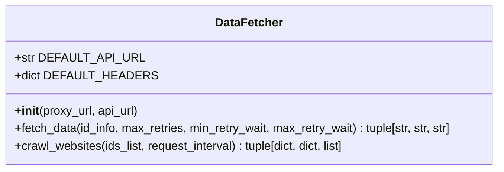
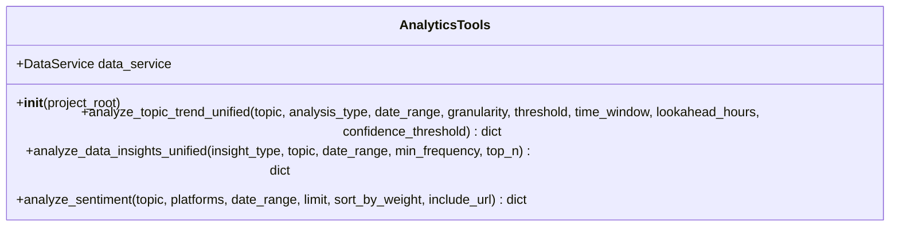

# 贡献指南

<cite>
**本文档引用的文件**   
- [README.md](file://README.md)
- [pyproject.toml](file://pyproject.toml)
- [requirements.txt](file://requirements.txt)
- [trendradar/crawler/fetcher.py](file://trendradar/crawler/fetcher.py)
- [mcp_server/tools/](file://mcp_server/tools/)
- [mcp_server/server.py](file://mcp_server/server.py)
- [trendradar/report/generator.py](file://trendradar/report/generator.py)
- [config/config.yaml](file://config/config.yaml)
- [setup-mac.sh](file://setup-mac.sh)
- [setup-windows-en.bat](file://setup-windows-en.bat)
</cite>

## 目录
1. [欢迎参与](#欢迎参与)
2. [提交问题与拉取请求](#提交问题与拉取请求)
3. [设置本地开发环境](#设置本地开发环境)
4. [代码风格与测试要求](#代码风格与测试要求)
5. [可贡献的领域](#可贡献的领域)
6. [新手友好任务](#新手友好任务)
7. [重大变更前的讨论](#重大变更前的讨论)

## 欢迎参与

TrendRadar 是一个开源的热点聚合与分析工具，我们非常欢迎社区成员的贡献。无论你是经验丰富的开发者，还是刚刚入门的新手，你的任何贡献都将帮助项目变得更好。本指南将详细介绍如何为项目做出贡献，包括提交问题、创建拉取请求、设置开发环境以及遵循代码规范。

**Section sources**
- [README.md](file://README.md#L1-L800)

## 提交问题与拉取请求

### 提交问题 (Issue)
当你在使用 TrendRadar 时遇到 bug，或者有新的功能想法，都可以通过提交 Issue 来告诉我们。在提交 Issue 前，请先检查是否已有类似的问题存在，以避免重复。

- **Bug 报告**：请尽可能详细地描述问题，包括复现步骤、预期行为和实际行为，以及你的运行环境（如操作系统、Python 版本等）。
- **功能请求**：请清晰地描述你希望添加的功能，并说明其用途和价值。

### 提交拉取请求 (Pull Request)
当你修复了一个 bug 或实现了新功能后，可以通过 Pull Request (PR) 将代码合并到主分支。提交 PR 的流程如下：
1. Fork 本仓库到你的 GitHub 账户。
2. 在本地创建一个新的分支（例如 `feature/new-crawler` 或 `fix/bug-fix`）。
3. 在新分支上进行代码修改。
4. 提交代码并推送到你的远程仓库。
5. 在 GitHub 上创建 Pull Request，选择 `main` 分支为目标分支。
6. 等待项目维护者审查和合并。

**Section sources**
- [README.md](file://README.md#L1-L800)

## 设置本地开发环境

为了开始贡献代码，你需要在本地设置开发环境。项目使用 `pyproject.toml` 管理依赖，并通过 `uv` 工具进行环境管理。

### 依赖管理
项目使用 `pyproject.toml` 作为依赖管理文件，其中定义了所有必需的 Python 包。`requirements.txt` 文件是根据 `pyproject.toml` 自动生成的，用于兼容其他工具。

- **安装依赖**：项目提供了针对不同操作系统的脚本，可以自动安装 `uv` 并同步依赖。
  - **macOS**：运行 `setup-mac.sh` 脚本。
  - **Windows**：运行 `setup-windows-en.bat` 脚本。

这些脚本会检查并安装 `uv`（一个快速的 Python 包管理器），然后执行 `uv sync` 来安装项目依赖。

### 同步 requirements.txt
当 `pyproject.toml` 中的依赖发生变化时，需要更新 `requirements.txt`。你可以使用以下命令生成或更新：
```bash
uv pip compile pyproject.toml -o requirements.txt
```

**Section sources**
- [pyproject.toml](file://pyproject.toml#L1-L26)
- [requirements.txt](file://requirements.txt#L1-L7)
- [setup-mac.sh](file://setup-mac.sh#L1-L119)
- [setup-windows-en.bat](file://setup-windows-en.bat#L1-L176)

## 代码风格与测试要求

### 代码风格
为了保持代码的一致性，我们遵循 PEP 8 代码风格指南。请确保你的代码符合以下要求：
- 使用 4 个空格进行缩进。
- 每行代码不超过 79 个字符。
- 使用清晰、有意义的变量和函数名。
- 在适当的地方添加注释和文档字符串。

### 测试要求
目前项目尚未建立完整的测试套件，但贡献者在提交代码前应手动测试其功能，确保不会引入新的 bug。建议在本地环境中运行项目，验证新功能或修复是否按预期工作。

**Section sources**
- [README.md](file://README.md#L1-L800)

## 可贡献的领域

我们鼓励社区成员在以下领域进行贡献：

### 添加新的爬虫平台
你可以在 `trendradar/crawler/fetcher.py` 文件中实现对新平台的爬取。该文件中的 `DataFetcher` 类负责从 NewsNow API 获取数据。要添加新平台，只需确保该平台的 ID 被包含在爬取列表中即可，因为数据源由外部 API 提供。



**Diagram sources**
- [trendradar/crawler/fetcher.py](file://trendradar/crawler/fetcher.py#L20-L185)

### 扩展 MCP 分析工具
MCP（Model Context Protocol）服务器提供了强大的 AI 分析功能。你可以在 `mcp_server/tools/` 目录下添加新的分析工具。例如，`analytics.py` 文件中已经包含了趋势分析、情感分析等高级功能。



**Diagram sources**
- [mcp_server/tools/analytics.py](file://mcp_server/tools/analytics.py#L76-L800)

### 改进报告模板
报告生成由 `trendradar/report/generator.py` 文件中的函数处理。你可以修改 `generate_html_report` 函数来改进 HTML 报告的样式和布局，使其更加美观和易读。

### 修复文档
文档是项目的重要组成部分。如果你发现 README 或其他文档中有错误、不清晰或过时的内容，请随时提交 PR 进行修正。

**Section sources**
- [trendradar/crawler/fetcher.py](file://trendradar/crawler/fetcher.py#L1-L185)
- [mcp_server/tools/](file://mcp_server/tools/#L1-L6)
- [trendradar/report/generator.py](file://trendradar/report/generator.py#L1-L236)
- [mcp_server/server.py](file://mcp_server/server.py#L1-L800)

## 新手友好任务

如果你是第一次为开源项目贡献，可以从以下简单任务开始：
- 修正文档中的拼写错误或语法错误。
- 更新 `config/config.yaml` 中的注释，使其更清晰易懂。
- 为 `mcp_server/tools/` 目录下的工具添加新的示例用法。
- 在 `README.md` 中补充缺失的功能说明或配置示例。

这些任务不需要深入理解代码逻辑，是熟悉项目结构和贡献流程的绝佳起点。

**Section sources**
- [config/config.yaml](file://config/config.yaml#L1-L187)
- [README.md](file://README.md#L1-L800)

## 重大变更前的讨论

在进行重大变更（如重构核心模块、添加新功能或修改 API）之前，请务必先通过 Issue 与社区讨论。这有助于确保你的想法与项目的发展方向一致，并可以提前获得反馈，避免不必要的工作。在 Issue 中详细描述你的提案，包括动机、设计思路和可能的影响，然后等待维护者的回复。

**Section sources**
- [README.md](file://README.md#L1-L800)