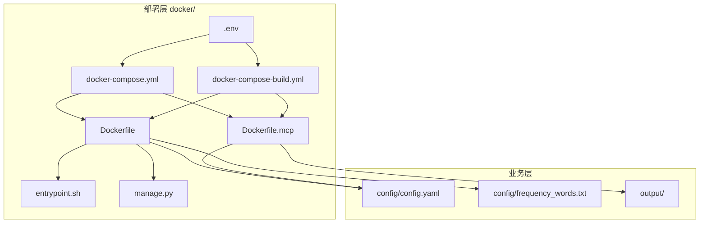
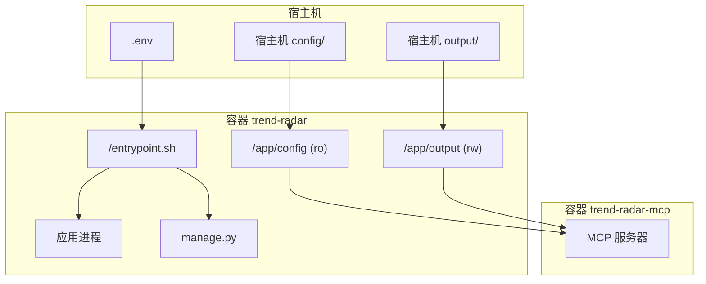
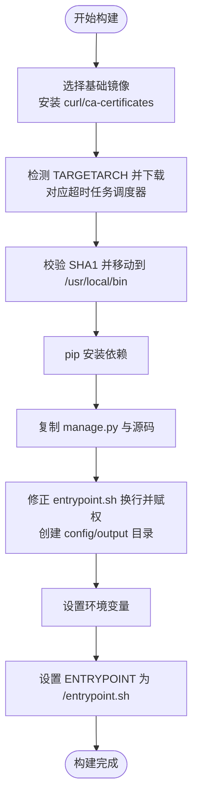
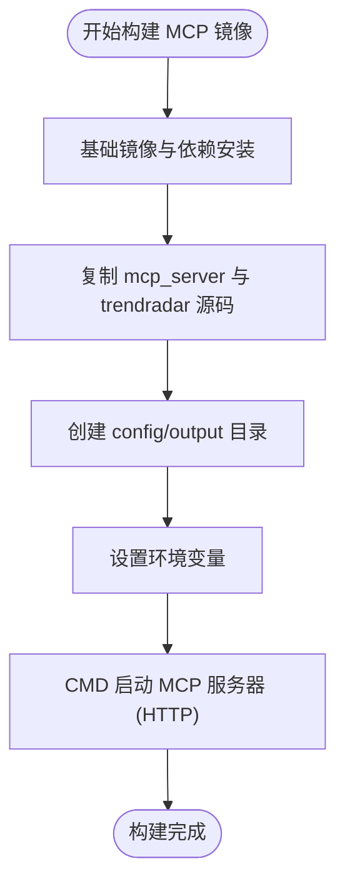
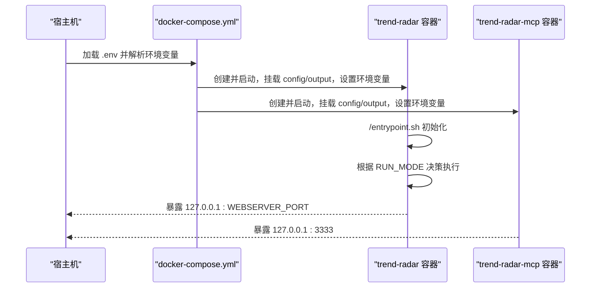
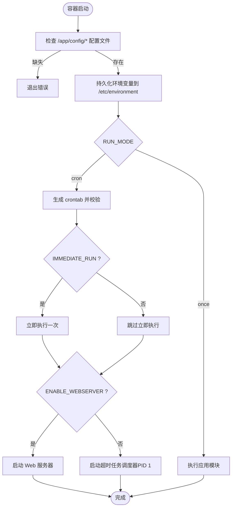
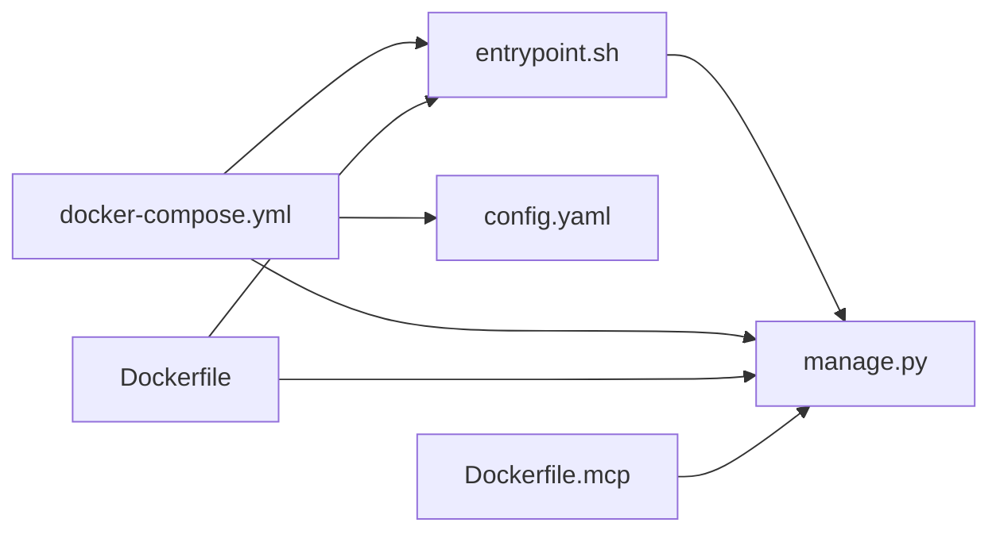

# Docker部署

<cite>
**本文引用的文件**
- [Dockerfile](file://docker/Dockerfile)
- [Dockerfile.mcp](file://docker/Dockerfile.mcp)
- [docker-compose.yml](file://docker/docker-compose.yml)
- [.env](file://docker/.env)
- [entrypoint.sh](file://docker/entrypoint.sh)
- [manage.py](file://docker/manage.py)
- [.dockerignore](file://.dockerignore)
- [config.yaml](file://config/config.yaml)
- [frequency_words.txt](file://config/frequency_words.txt)
- [docker-compose-build.yml](file://docker/docker-compose-build.yml)
</cite>

## 目录
1. [简介](#简介)
2. [项目结构](#项目结构)
3. [核心组件](#核心组件)
4. [架构总览](#架构总览)
5. [详细组件分析](#详细组件分析)
6. [依赖分析](#依赖分析)
7. [性能考虑](#性能考虑)
8. [故障排查指南](#故障排查指南)
9. [结论](#结论)
10. [附录](#附录)

## 简介
本指南面向希望使用Docker部署 TrendRadar 的用户，围绕以下目标展开：
- 解释 Dockerfile 的构建流程、多阶段构建策略与基础镜像选择
- 说明 docker-compose.yml 中的服务编排、网络与数据卷配置、依赖关系
- 详解 .env 环境变量的定义方式及在容器内的映射机制
- 提供从镜像构建到服务启动的完整部署步骤，含自定义配置（时区、存储路径、推送渠道等）
- 结合 entrypoint.sh 脚本说明容器初始化流程
- 提供常见问题排查与最佳实践建议

## 项目结构
仓库采用“根目录源码 + docker/ 部署层”的组织方式。部署相关文件集中在 docker/ 目录，包含：
- Dockerfile 与 Dockerfile.mcp：分别为主应用与 MCP 服务的镜像构建定义
- docker-compose.yml 与 docker-compose-build.yml：服务编排与构建编排
- .env：环境变量模板
- entrypoint.sh：容器入口脚本
- manage.py：容器内管理工具（Web 服务器、状态检查、日志查看等）

图表来源
- [Dockerfile](file://docker/Dockerfile#L1-L71)
- [Dockerfile.mcp](file://docker/Dockerfile.mcp#L1-L26)
- [docker-compose.yml](file://docker/docker-compose.yml#L1-L88)
- [docker-compose-build.yml](file://docker/docker-compose-build.yml#L1-L92)
- [.env](file://docker/.env#L1-L130)
- [entrypoint.sh](file://docker/entrypoint.sh#L1-L50)
- [manage.py](file://docker/manage.py#L1-L648)
- [config.yaml](file://config/config.yaml#L1-L187)
- [frequency_words.txt](file://config/frequency_words.txt#L1-L114)

章节来源
- [Dockerfile](file://docker/Dockerfile#L1-L71)
- [Dockerfile.mcp](file://docker/Dockerfile.mcp#L1-L26)
- [docker-compose.yml](file://docker/docker-compose.yml#L1-L88)
- [.env](file://docker/.env#L1-L130)
- [entrypoint.sh](file://docker/entrypoint.sh#L1-L50)
- [manage.py](file://docker/manage.py#L1-L648)
- [config.yaml](file://config/config.yaml#L1-L187)
- [frequency_words.txt](file://config/frequency_words.txt#L1-L114)

## 核心组件
- Dockerfile：定义主应用镜像构建流程，包含超轻量基础镜像、下载并校验超时任务调度器、安装依赖、复制应用代码与入口脚本、设置环境变量、指定入口点。
- Dockerfile.mcp：定义 MCP 服务镜像，暴露 HTTP 端口并以 HTTP 模式启动 MCP 服务器。
- docker-compose.yml：定义两个服务 trend-radar 与 trend-radar-mcp，分别绑定端口、挂载配置与输出目录、注入环境变量（含时区与推送渠道等）、设置重启策略。
- .env：提供环境变量模板，覆盖核心开关、Web 服务器、推送窗口、多账号、通知渠道、邮件、ntfy、Bark、Slack、存储后端、S3 兼容参数、拉取策略、运行模式与定时任务等。
- entrypoint.sh：容器初始化脚本，负责检查配置文件、持久化环境变量、根据 RUN_MODE 选择一次性执行或基于 supercronic 的定时执行，并在需要时启动 Web 服务器。
- manage.py：容器内管理工具，提供状态查询、配置查看、文件浏览、日志查看、Web 服务器启停、重启说明等能力。
- .dockerignore：排除不必要的构建上下文文件，减少镜像体积与构建时间。

章节来源
- [Dockerfile](file://docker/Dockerfile#L1-L71)
- [Dockerfile.mcp](file://docker/Dockerfile.mcp#L1-L26)
- [docker-compose.yml](file://docker/docker-compose.yml#L1-L88)
- [.env](file://docker/.env#L1-L130)
- [entrypoint.sh](file://docker/entrypoint.sh#L1-L50)
- [manage.py](file://docker/manage.py#L1-L648)
- [.dockerignore](file://.dockerignore#L1-L35)

## 架构总览
下图展示容器编排与数据流：主应用容器通过只读挂载 config、读写挂载 output，entrypoint.sh 根据 RUN_MODE 决策执行路径；MCP 服务独立运行，读取相同 config 与 output 以便分析。

图表来源
- [docker-compose.yml](file://docker/docker-compose.yml#L1-L88)
- [entrypoint.sh](file://docker/entrypoint.sh#L1-L50)
- [manage.py](file://docker/manage.py#L1-L648)

## 详细组件分析

### Dockerfile 构建流程与多阶段策略
- 基础镜像与架构适配：使用超轻量 Python 基础镜像，通过 ARG 传递 TARGETARCH，针对 amd64/arm64 下载对应版本的超时任务调度器并进行 SHA1 校验，具备重试机制与清理依赖。
- 依赖安装：复制 requirements.txt 并离线缓存安装，减少网络波动影响。
- 应用复制与准备：复制 manage.py、trendradar 源码至 /app，处理 entrypoint.sh 的换行符并赋予可执行权限，创建 config 与 output 目录。
- 环境变量：设置 Python 输出缓冲、配置文件路径与词频词典路径。
- 入口点：ENTRYPOINT 指向 /entrypoint.sh，由该脚本接管 PID 1 并决定后续执行路径。

图表来源
- [Dockerfile](file://docker/Dockerfile#L1-L71)

章节来源
- [Dockerfile](file://docker/Dockerfile#L1-L71)

### Dockerfile.mcp 构建流程
- 基础镜像：同样使用 Python 3.10-slim。
- 依赖安装：安装 requirements.txt。
- 代码复制：复制 mcp_server 与 trendradar 源码，便于 MCP 服务读取 SQLite 数据。
- 目录创建：创建 config 与 output 目录。
- 环境变量：设置 Python 输出缓冲与配置路径。
- CMD：以 HTTP 模式启动 MCP 服务器，监听 0.0.0.0:3333。

图表来源
- [Dockerfile.mcp](file://docker/Dockerfile.mcp#L1-L26)

章节来源
- [Dockerfile.mcp](file://docker/Dockerfile.mcp#L1-L26)

### docker-compose.yml 服务编排
- trend-radar 服务
  - 镜像与容器名：使用预构建镜像，容器名为 trend-radar，重启策略为 unless-stopped。
  - 端口映射：将宿主机端口映射到容器端口，WEBSERVER_PORT 默认 8080，仅绑定到 127.0.0.1。
  - 数据卷：/app/config:ro（只读）与 /app/output:rw（读写）。
  - 环境变量：TZ=Asia/Shanghai；大量运行与推送相关变量，均来自 .env 的环境变量替换。
- trend-radar-mcp 服务
  - 镜像与容器名：使用预构建镜像，容器名为 trend-radar-mcp。
  - 端口映射：将宿主机 3333 映射到容器 3333。
  - 数据卷：同 trend-radar。
  - 环境变量：TZ=Asia/Shanghai。

图表来源
- [docker-compose.yml](file://docker/docker-compose.yml#L1-L88)
- [.env](file://docker/.env#L1-L130)

章节来源
- [docker-compose.yml](file://docker/docker-compose.yml#L1-L88)

### docker-compose-build.yml 构建编排
- 与 docker-compose.yml 类似，但使用 build 指令从 docker/Dockerfile 与 docker/Dockerfile.mcp 构建镜像，适用于首次构建或自定义镜像。
- 服务定义与环境变量、端口与卷挂载与 docker-compose.yml 一致。

章节来源
- [docker-compose-build.yml](file://docker/docker-compose-build.yml#L1-L92)

### .env 环境变量定义与映射机制
- 定义范围：核心开关、Web 服务器、推送时间窗口、多账号、通知渠道（飞书、Telegram、钉钉、企业微信、邮件、ntfy、Bark、Slack）、存储后端与 S3 兼容参数、拉取策略、运行模式与定时任务等。
- 映射机制：compose 在启动时将 .env 中的变量注入到容器环境，容器内通过环境变量驱动应用行为；entrypoint.sh 会将当前环境持久化到 /etc/environment，便于调试与诊断。
- 优先级：.env 中的变量会被 compose 注入到容器环境，容器内应用通常以环境变量优先于配置文件中的值。

章节来源
- [.env](file://docker/.env#L1-L130)
- [docker-compose.yml](file://docker/docker-compose.yml#L1-L88)
- [entrypoint.sh](file://docker/entrypoint.sh#L1-L50)

### entrypoint.sh 容器初始化流程
- 配置检查：若 /app/config/config.yaml 或 /app/config/frequency_words.txt 不存在，容器直接退出。
- 环境持久化：将当前环境变量追加到 /etc/environment。
- 执行模式：
  - once：直接执行应用模块。
  - cron：生成 crontab，使用超时任务调度器校验后，按需立即执行一次，再启动超时任务调度器作为 PID 1。
- Web 服务器：当 ENABLE_WEBSERVER=true 时，启动内置 HTTP 服务器托管 /app/output 目录。

图表来源
- [entrypoint.sh](file://docker/entrypoint.sh#L1-L50)

章节来源
- [entrypoint.sh](file://docker/entrypoint.sh#L1-L50)

### manage.py 容器内管理工具
- 功能概览：手动执行、状态检查、配置查看、文件浏览、日志查看、Web 服务器启停、重启说明、帮助信息。
- Web 服务器：绑定 0.0.0.0，限制工作目录为 /app/output，仅提供静态文件访问。
- 日志查看：尝试读取 PID 1 的标准输出/错误文件，若不可用则建议使用 docker logs。

章节来源
- [manage.py](file://docker/manage.py#L1-L648)

## 依赖分析
- 组件耦合
  - entrypoint.sh 与 manage.py：前者负责 PID 1 与执行调度，后者提供运维辅助。
  - compose 与 .env：compose 通过 .env 注入环境变量，驱动容器行为。
  - Dockerfile 与 Dockerfile.mcp：均依赖 requirements.txt 与源码，MCP 额外依赖 mcp_server。
- 外部依赖
  - 超时任务调度器：用于 cron 调度，支持多架构下载与校验。
  - Python 依赖：requirements.txt 中声明。
- 潜在循环依赖：未发现直接循环依赖。

图表来源
- [docker-compose.yml](file://docker/docker-compose.yml#L1-L88)
- [entrypoint.sh](file://docker/entrypoint.sh#L1-L50)
- [manage.py](file://docker/manage.py#L1-L648)
- [Dockerfile](file://docker/Dockerfile#L1-L71)
- [Dockerfile.mcp](file://docker/Dockerfile.mcp#L1-L26)
- [config.yaml](file://config/config.yaml#L1-L187)

章节来源
- [docker-compose.yml](file://docker/docker-compose.yml#L1-L88)
- [entrypoint.sh](file://docker/entrypoint.sh#L1-L50)
- [manage.py](file://docker/manage.py#L1-L648)
- [Dockerfile](file://docker/Dockerfile#L1-L71)
- [Dockerfile.mcp](file://docker/Dockerfile.mcp#L1-L26)
- [config.yaml](file://config/config.yaml#L1-L187)

## 性能考虑
- 基础镜像选择：使用 slim 版本，减少镜像体积与攻击面。
- 依赖安装：离线安装并禁用缓存，降低网络波动带来的失败率。
- 超时任务调度器：通过校验与重试机制提升稳定性。
- 数据卷：将输出目录挂载到宿主机，避免容器内文件丢失与重复拷贝。
- Web 服务器：仅提供静态文件托管，避免额外资源消耗。

[本节为通用指导，无需列出章节来源]

## 故障排查指南
- 权限错误
  - 症状：容器启动后立即退出或无法写入输出目录。
  - 排查：确认宿主机 output 目录权限与属主，确保容器以非 root 用户运行时仍可写入。
  - 解决：调整宿主机目录权限或使用合适的用户/组映射。
- 网络隔离问题
  - 症状：应用无法访问外部网络或超时。
  - 排查：检查宿主机网络策略、防火墙与代理设置；确认容器网络模式与 DNS。
  - 解决：在 compose 中添加网络配置或使用宿主机网络模式（谨慎使用）。
- 环境变量未生效
  - 症状：应用行为不符合预期。
  - 排查：确认 .env 中变量是否被 compose 注入；在容器内执行命令查看环境变量；检查 entrypoint.sh 是否正确持久化。
  - 解决：修正 .env 或 compose 的环境变量注入；确保变量拼写与类型正确。
- 定时任务不执行
  - 症状：超时任务调度器未按期触发。
  - 排查：使用 manage.py status 查看 PID 1 是否为超时任务调度器；检查 CRON_SCHEDULE 与时区；查看容器日志。
  - 解决：修正 cron 表达式与时区；重启容器；必要时手动执行一次以验证。
- Web 服务器无法访问
  - 症状：浏览器无法访问输出目录。
  - 排查：确认 ENABLE_WEBSERVER=true；检查端口映射与绑定地址；确认 /app/output 是否存在且包含静态文件。
  - 解决：启动 Web 服务器；检查端口占用与防火墙；使用 manage.py start_webserver 与 webserver_status 检查状态。

章节来源
- [entrypoint.sh](file://docker/entrypoint.sh#L1-L50)
- [manage.py](file://docker/manage.py#L1-L648)
- [docker-compose.yml](file://docker/docker-compose.yml#L1-L88)

## 结论
本指南梳理了 TrendRadar 的 Docker 部署要点：以 slim 基础镜像与超时任务调度器为核心，通过 compose 实现服务编排与环境变量注入，借助 entrypoint.sh 与 manage.py 提供稳定的初始化与运维能力。遵循本文提供的部署步骤与最佳实践，可高效完成生产级部署与维护。

[本节为总结性内容，无需列出章节来源]

## 附录

### 部署步骤（从镜像构建到服务启动）
- 准备工作
  - 准备 config/config.yaml 与 config/frequency_words.txt，并确保其存在于宿主机的 ../config 目录中。
  - 准备 docker/.env，按需填写各环境变量。
- 镜像构建（可选）
  - 使用构建编排：docker-compose -f docker-compose-build.yml build
  - 若使用预构建镜像，可跳过此步骤。
- 启动服务
  - docker-compose up -d
- 验证
  - docker ps 查看容器状态
  - docker logs trend-radar 查看日志
  - 使用 manage.py status 与 files 检查运行状态与输出文件
  - 如需 Web 服务器：docker exec -it trend-radar python manage.py start_webserver

章节来源
- [docker-compose-build.yml](file://docker/docker-compose-build.yml#L1-L92)
- [docker-compose.yml](file://docker/docker-compose.yml#L1-L88)
- [entrypoint.sh](file://docker/entrypoint.sh#L1-L50)
- [manage.py](file://docker/manage.py#L1-L648)

### 自定义配置清单
- 时区设置
  - 在 compose 中设置 TZ=Asia/Shanghai；config.yaml 中也包含 timezone 字段，建议保持一致。
- 存储路径映射
  - /app/config:ro 与 /app/output:rw；确保宿主机 ../config 与 ../output 存在且权限正确。
- 推送渠道配置
  - 在 .env 中填写各渠道的 webhook/token/chat_id 等；注意多账号使用分号分隔，且成对配置数量一致。
- 运行模式与定时任务
  - RUN_MODE 可选 cron/once；CRON_SCHEDULE 控制定时表达式；IMMEDIATE_RUN 控制启动时是否立即执行一次。

章节来源
- [docker-compose.yml](file://docker/docker-compose.yml#L1-L88)
- [.env](file://docker/.env#L1-L130)
- [config.yaml](file://config/config.yaml#L1-L187)
- [entrypoint.sh](file://docker/entrypoint.sh#L1-L50)