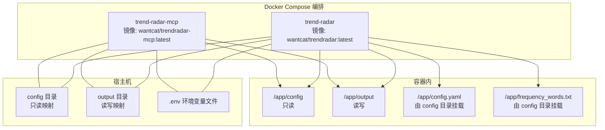
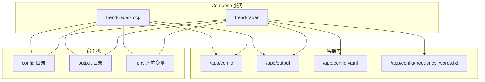
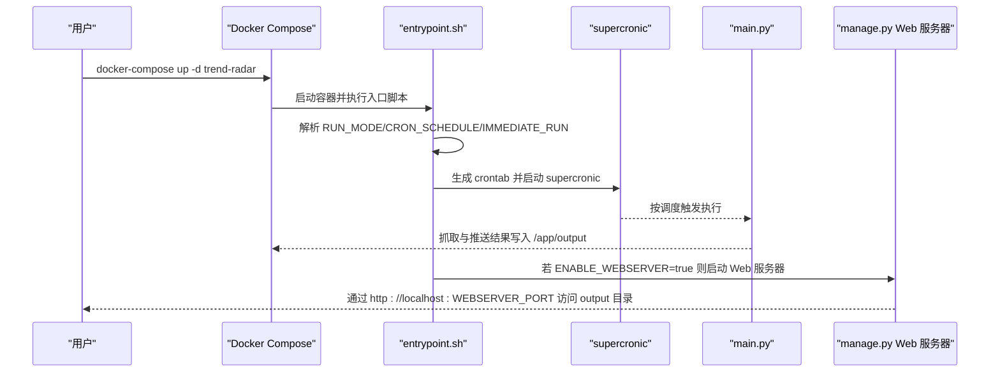
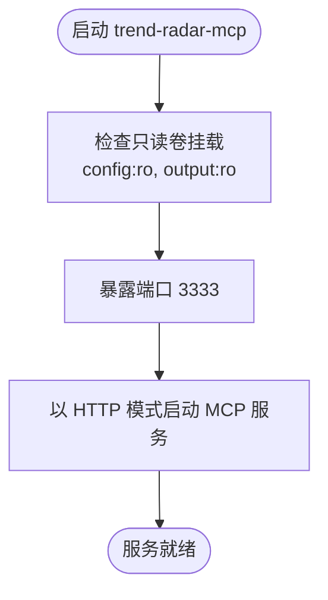
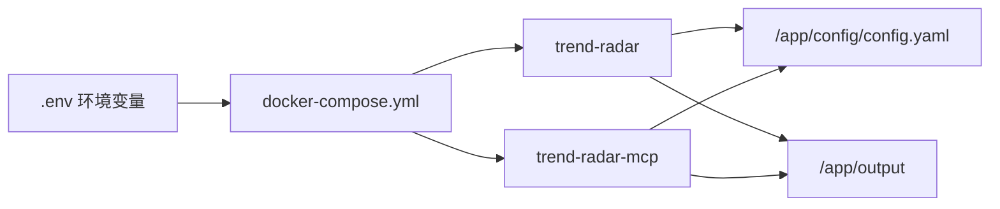

# Docker Compose编排

<cite>
**本文引用的文件**
- [docker/docker-compose.yml](file://docker/docker-compose.yml)
- [docker/docker-compose-build.yml](file://docker/docker-compose-build.yml)
- [docker/.env](file://docker/.env)
- [docker/Dockerfile](file://docker/Dockerfile)
- [docker/Dockerfile.mcp](file://docker/Dockerfile.mcp)
- [docker/entrypoint.sh](file://docker/entrypoint.sh)
- [docker/manage.py](file://docker/manage.py)
- [config/config.yaml](file://config/config.yaml)
- [docs/Deployment-Guide.md](file://docs/Deployment-Guide.md)
- [README.md](file://README.md)
</cite>

## 目录
1. [简介](#简介)
2. [项目结构](#项目结构)
3. [核心组件](#核心组件)
4. [架构总览](#架构总览)
5. [详细组件分析](#详细组件分析)
6. [依赖关系分析](#依赖关系分析)
7. [性能考虑](#性能考虑)
8. [故障排查指南](#故障排查指南)
9. [结论](#结论)
10. [附录](#附录)

## 简介
本文件面向使用 Docker Compose 部署 TrendRadar 的用户，围绕 docker-compose.yml 中定义的两个核心服务 trend-radar 与 trend-radar-mcp，系统性解析镜像来源、容器命名、重启策略、端口映射、卷挂载、环境变量注入与覆盖机制，以及 Web 服务器与 MCP 服务的运行方式。同时结合部署指南与环境变量文件，给出 docker-compose up 的使用示例与最佳实践。

## 项目结构
- docker-compose.yml 定义了两个服务：trend-radar（新闻抓取与推送）与 trend-radar-mcp（MCP AI 分析服务）。
- Dockerfile 与 Dockerfile.mcp 分别构建 trend-radar 与 trend-radar-mcp 的镜像。
- .env 提供环境变量，用于覆盖 config.yaml 中的配置项。
- entrypoint.sh 负责根据 RUN_MODE 初始化定时任务、立即执行与 Web 服务器启动。
- manage.py 提供 Web 服务器启停与输出目录托管能力。
- config/config.yaml 定义应用主配置（报告模式、推送设置、通知渠道等）。

图表来源
- [docker/docker-compose.yml](file://docker/docker-compose.yml#L1-L74)
- [docker/docker-compose-build.yml](file://docker/docker-compose-build.yml#L1-L78)
- [docker/Dockerfile](file://docker/Dockerfile#L1-L71)
- [docker/Dockerfile.mcp](file://docker/Dockerfile.mcp#L1-L24)
- [docker/.env](file://docker/.env#L1-L99)

章节来源
- [docker/docker-compose.yml](file://docker/docker-compose.yml#L1-L74)
- [docker/docker-compose-build.yml](file://docker/docker-compose-build.yml#L1-L78)
- [docker/Dockerfile](file://docker/Dockerfile#L1-L71)
- [docker/Dockerfile.mcp](file://docker/Dockerfile.mcp#L1-L24)
- [docker/.env](file://docker/.env#L1-L99)

## 核心组件
- trend-radar 服务
  - 镜像来源：wantcat/trendradar:latest
  - 容器命名：trend-radar
  - 重启策略：unless-stopped
  - 端口映射：WEBSERVER_PORT 环境变量注入，宿主机绑定到 127.0.0.1:WEBSERVER_PORT:WEBSERVER_PORT
  - 卷挂载：config 目录只读映射到 /app/config；output 目录读写映射到 /app/output
  - 环境变量：包含爬虫控制、通知系统开关、推送模式、Web 服务器配置、通知渠道 Webhook 地址、邮件配置、ntfy/Bark/Slack 配置、运行模式与定时任务等
- trend-radar-mcp 服务
  - 镜像来源：wantcat/trendradar-mcp:latest
  - 容器命名：trend-radar-mcp
  - 重启策略：unless-stopped
  - 端口映射：127.0.0.1:3333:3333（HTTP 模式）
  - 卷挂载：config 与 output 目录均以只读方式映射
  - 环境变量：TZ=Asia/Shanghai

章节来源
- [docker/docker-compose.yml](file://docker/docker-compose.yml#L1-L74)
- [docker/docker-compose-build.yml](file://docker/docker-compose-build.yml#L1-L78)

## 架构总览
下图展示两个服务在 Compose 中的交互关系与数据流。

图表来源
- [docker/docker-compose.yml](file://docker/docker-compose.yml#L1-L74)
- [docker/docker-compose-build.yml](file://docker/docker-compose-build.yml#L1-L78)

## 详细组件分析

### trend-radar 服务
- 镜像与命名
  - 镜像：wantcat/trendradar:latest
  - 容器名：trend-radar
- 重启策略
  - unless-stopped：容器退出后除非手动停止，否则随 Docker 引擎重启而自动恢复
- 端口映射与 WEBSERVER_PORT 注入机制
  - 宿主机绑定：127.0.0.1:WEBSERVER_PORT:WEBSERVER_PORT
  - 注入来源：WEBSERVER_PORT 环境变量（来自 .env 或 Compose environment）
  - 默认值：若未设置，Compose 中使用 WEBSERVER_PORT 的默认值（例如 8080）
- 卷挂载与持久化
  - config 目录只读映射至 /app/config，便于容器内读取配置文件与词表
  - output 目录读写映射至 /app/output，实现抓取结果与报告的持久化与热更新
- 环境变量清单与覆盖机制
  - 覆盖优先级：环境变量 > config.yaml
  - 关键变量类别：
    - 爬虫与通知控制：ENABLE_CRAWLER、ENABLE_NOTIFICATION、REPORT_MODE、SORT_BY_POSITION_FIRST、MAX_NEWS_PER_KEYWORD、REVERSE_CONTENT_ORDER
    - Web 服务器：ENABLE_WEBSERVER、WEBSERVER_PORT
    - 多账号：MAX_ACCOUNTS_PER_CHANNEL
    - 推送时间窗口：PUSH_WINDOW_ENABLED、PUSH_WINDOW_START、PUSH_WINDOW_END、PUSH_WINDOW_ONCE_PER_DAY、PUSH_WINDOW_RETENTION_DAYS
    - 通知渠道：FEISHU_WEBHOOK_URL、TELEGRAM_BOT_TOKEN、TELEGRAM_CHAT_ID、DINGTALK_WEBHOOK_URL、WEWORK_WEBHOOK_URL、WEWORK_MSG_TYPE
    - 邮件：EMAIL_FROM、EMAIL_PASSWORD、EMAIL_TO、EMAIL_SMTP_SERVER、EMAIL_SMTP_PORT
    - ntfy：NTFY_SERVER_URL、NTFY_TOPIC、NTFY_TOKEN
    - Bark：BARK_URL
    - Slack：SLACK_WEBHOOK_URL
    - 运行模式与调度：CRON_SCHEDULE、RUN_MODE、IMMEDIATE_RUN
- 启动流程与 Web 服务器
  - entrypoint.sh 根据 RUN_MODE 决定执行逻辑：
    - once：单次执行后退出
    - cron：生成 crontab 并由 supercronic 作为 PID 1 管理定时任务；可选立即执行一次；可选自动启动 Web 服务器
  - Web 服务器托管：当 ENABLE_WEBSERVER=true 时，容器内通过 manage.py 启动 HTTP 服务器，仅托管 output 目录，端口由 WEBSERVER_PORT 指定

图表来源
- [docker/docker-compose.yml](file://docker/docker-compose.yml#L1-L74)
- [docker/entrypoint.sh](file://docker/entrypoint.sh#L1-L50)
- [docker/manage.py](file://docker/manage.py#L390-L481)
- [README.md](file://README.md#L2072-L2146)

章节来源
- [docker/docker-compose.yml](file://docker/docker-compose.yml#L1-L74)
- [docker/.env](file://docker/.env#L1-L99)
- [docker/entrypoint.sh](file://docker/entrypoint.sh#L1-L50)
- [docker/manage.py](file://docker/manage.py#L390-L481)
- [README.md](file://README.md#L2072-L2146)

### trend-radar-mcp 服务
- 镜像与命名
  - 镜像：wantcat/trendradar-mcp:latest
  - 容器名：trend-radar-mcp
- 重启策略
  - unless-stopped：容器退出后随引擎重启自动恢复
- 端口映射
  - 127.0.0.1:3333:3333（HTTP 模式）
- 卷挂载
  - config 与 output 目录均以只读方式映射，避免 MCP 服务写入宿主机数据
- 环境变量
  - TZ=Asia/Shanghai

图表来源
- [docker/docker-compose.yml](file://docker/docker-compose.yml#L60-L74)
- [docker/Dockerfile.mcp](file://docker/Dockerfile.mcp#L1-L24)

章节来源
- [docker/docker-compose.yml](file://docker/docker-compose.yml#L60-L74)
- [docker/Dockerfile.mcp](file://docker/Dockerfile.mcp#L1-L24)

## 依赖关系分析
- Compose 服务依赖
  - trend-radar 依赖 config 与 output 卷，以及 .env 中的环境变量
  - trend-radar-mcp 依赖 config 与 output 卷，且仅暴露 3333 端口
- 镜像构建
  - docker-compose.yml 使用预构建镜像（wantcat/trendradar:latest、wantcat/trendradar-mcp:latest）
  - docker-compose-build.yml 展示了从 Dockerfile 构建镜像的方式（与实际运行镜像不同）
- 配置覆盖链路
  - 环境变量优先于 config.yaml 生效
  - .env 文件通过 Compose 的 environment 字段注入，或在 Docker 管理界面中设置

图表来源
- [docker/docker-compose.yml](file://docker/docker-compose.yml#L1-L74)
- [docker/docker-compose-build.yml](file://docker/docker-compose-build.yml#L1-L78)
- [docker/.env](file://docker/.env#L1-L99)
- [config/config.yaml](file://config/config.yaml#L1-L140)

章节来源
- [docker/docker-compose.yml](file://docker/docker-compose.yml#L1-L74)
- [docker/docker-compose-build.yml](file://docker/docker-compose-build.yml#L1-L78)
- [docker/.env](file://docker/.env#L1-L99)
- [config/config.yaml](file://config/config.yaml#L1-L140)

## 性能考虑
- 定时任务与日志
  - 使用 supercronic 管理 crontab，避免 PID 1 问题，保证容器稳定性
  - IMMEDIATE_RUN=true 可在启动后立即执行一次，缩短首次可用时间
- 端口与网络
  - trend-radar 通过 localhost 绑定 WEBSERVER_PORT，减少外部暴露面
  - trend-radar-mcp 通过 127.0.0.1:3333 暴露，适合本地或反向代理访问
- 卷权限
  - trend-radar 的 output 为读写，便于生成与更新报告；mcp 服务的 output 为只读，降低数据污染风险

[本节为通用建议，无需列出具体文件来源]

## 故障排查指南
- Web 服务器未启动
  - 检查 ENABLE_WEBSERVER 是否为 true，确认 WEBSERVER_PORT 是否正确设置
  - 使用 docker exec 进入容器，执行 manage.py 的 Web 服务器启停命令进行诊断
- 端口冲突或不可访问
  - 确认宿主机端口未被占用，且绑定到 127.0.0.1
  - 如需外网访问，可在 Compose 中调整端口映射或通过反向代理转发
- 定时任务未执行
  - 检查 CRON_SCHEDULE 格式与 IMMEDIATE_RUN 配置
  - 确认 supercronic 正常运行（PID 1 为 supercronic）
- 配置不生效
  - 确认 .env 中的环境变量已正确注入
  - 确认环境变量优先级高于 config.yaml

章节来源
- [docker/entrypoint.sh](file://docker/entrypoint.sh#L1-L50)
- [docker/manage.py](file://docker/manage.py#L390-L481)
- [README.md](file://README.md#L2072-L2146)

## 结论
通过 docker-compose.yml，TrendRadar 将新闻抓取与 AI 分析两大能力解耦为两个独立服务：trend-radar 负责定时抓取与推送，trend-radar-mcp 提供 MCP HTTP 接口。借助 .env 环境变量与只读/读写卷挂载，用户可以灵活地控制功能开关、通知渠道与 Web 服务器端口，并实现配置与数据的持久化与热更新。结合部署指南中的 Compose 使用示例，可快速完成一键部署与日常运维。

[本节为总结性内容，无需列出具体文件来源]

## 附录

### docker-compose up 使用示例
- 启动全部服务
  - docker-compose up -d
- 仅启动 trend-radar
  - docker-compose up -d trend-radar
- 仅启动 trend-radar-mcp
  - docker-compose up -d trend-radar-mcp
- 拉取最新镜像后再启动
  - docker-compose pull
  - docker-compose up -d

章节来源
- [README.md](file://README.md#L2102-L2146)
- [docs/Deployment-Guide.md](file://docs/Deployment-Guide.md#L192-L223)

### 环境变量文件 .env 的管理要点
- 位置与作用：位于 docker/.env，用于存放敏感配置与调度参数
- 覆盖规则：环境变量优先于 config.yaml 生效
- 常用项（摘录）
  - 核心配置：ENABLE_CRAWLER、ENABLE_NOTIFICATION、REPORT_MODE、SORT_BY_POSITION_FIRST、MAX_NEWS_PER_KEYWORD、REVERSE_CONTENT_ORDER
  - Web 服务器：ENABLE_WEBSERVER、WEBSERVER_PORT
  - 推送时间窗口：PUSH_WINDOW_ENABLED、PUSH_WINDOW_START、PUSH_WINDOW_END、PUSH_WINDOW_ONCE_PER_DAY、PUSH_WINDOW_RETENTION_DAYS
  - 通知渠道：FEISHU_WEBHOOK_URL、TELEGRAM_BOT_TOKEN、TELEGRAM_CHAT_ID、DINGTALK_WEBHOOK_URL、WEWORK_WEBHOOK_URL、WEWORK_MSG_TYPE、EMAIL_*、NTFY_*、BARK_URL、SLACK_WEBHOOK_URL
  - 运行配置：CRON_SCHEDULE、RUN_MODE、IMMEDIATE_RUN

章节来源
- [docker/.env](file://docker/.env#L1-L99)
- [README.md](file://README.md#L2072-L2101)