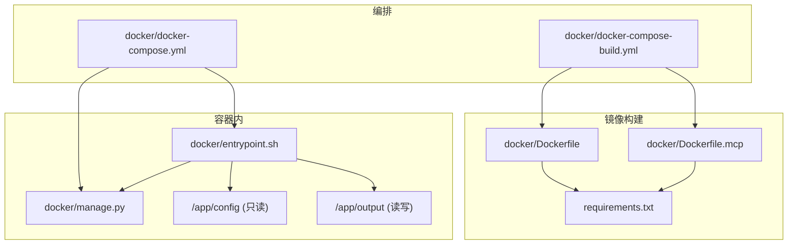
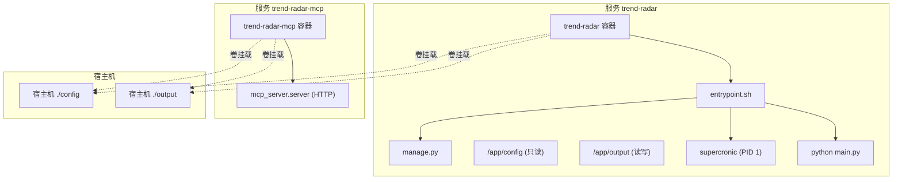
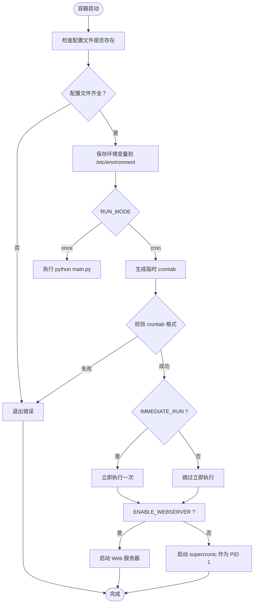
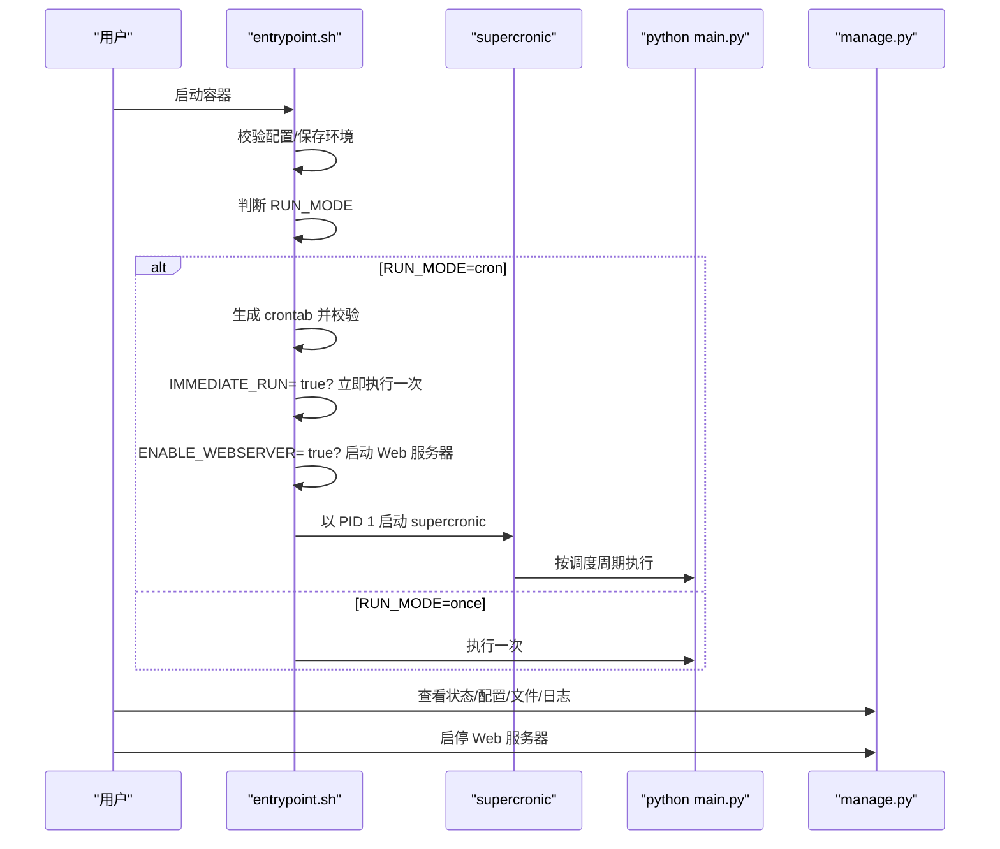
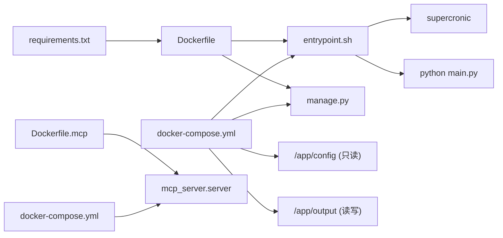

# Docker部署

<cite>
**本文引用的文件**
- [Dockerfile](file://docker/Dockerfile)
- [Dockerfile.mcp](file://docker/Dockerfile.mcp)
- [docker-compose.yml](file://docker/docker-compose.yml)
- [docker-compose-build.yml](file://docker/docker-compose-build.yml)
- [entrypoint.sh](file://docker/entrypoint.sh)
- [manage.py](file://docker/manage.py)
- [Deployment-Guide.md](file://docs/Deployment-Guide.md)
- [.dockerignore](file://.dockerignore)
- [requirements.txt](file://requirements.txt)
</cite>

## 目录
1. [简介](#简介)
2. [项目结构](#项目结构)
3. [核心组件](#核心组件)
4. [架构总览](#架构总览)
5. [详细组件分析](#详细组件分析)
6. [依赖关系分析](#依赖关系分析)
7. [性能考量](#性能考量)
8. [故障排查指南](#故障排查指南)
9. [结论](#结论)
10. [附录](#附录)

## 简介
本文件面向希望使用 Docker 部署 TrendRadar 的用户，围绕 Dockerfile 与 docker-compose.yml 展开，系统说明镜像构建流程、服务编排细节（端口映射、卷挂载、环境变量、重启策略），并深入解析入口脚本与管理工具的功能与用法。同时结合部署指南，给出构建镜像、运行容器与使用 compose 启动服务的完整命令示例，并说明如何通过环境变量控制爬虫、通知与 Web 服务器的启停。

## 项目结构
TrendRadar 的 Docker 相关文件集中在 docker/ 目录，包含：
- Dockerfile：主服务镜像构建规则
- Dockerfile.mcp：MCP 服务镜像构建规则
- docker-compose.yml：生产环境编排（含 Web 服务器）
- docker-compose-build.yml：开发/CI 构建编排（显式指定 Dockerfile 路径）
- entrypoint.sh：容器入口脚本，负责配置校验、定时任务与 Web 服务器启动
- manage.py：容器内管理工具，提供状态、配置、文件、日志、Web 服务器启停等能力

图表来源
- [Dockerfile](file://docker/Dockerfile#L1-L71)
- [Dockerfile.mcp](file://docker/Dockerfile.mcp#L1-L24)
- [docker-compose.yml](file://docker/docker-compose.yml#L1-L74)
- [docker-compose-build.yml](file://docker/docker-compose-build.yml#L1-L78)
- [entrypoint.sh](file://docker/entrypoint.sh#L1-L50)
- [manage.py](file://docker/manage.py#L1-L625)

章节来源
- [Dockerfile](file://docker/Dockerfile#L1-L71)
- [Dockerfile.mcp](file://docker/Dockerfile.mcp#L1-L24)
- [docker-compose.yml](file://docker/docker-compose.yml#L1-L74)
- [docker-compose-build.yml](file://docker/docker-compose-build.yml#L1-L78)
- [.dockerignore](file://.dockerignore#L1-L35)

## 核心组件
- Dockerfile：基于官方 Python slim 镜像，安装系统依赖与 Python 依赖，复制应用代码与入口脚本，设置工作目录与环境变量，最终以入口脚本作为容器 PID 1。
- Dockerfile.mcp：构建 MCP 服务专用镜像，暴露 HTTP 端口，以 HTTP 模式启动 MCP 服务器。
- docker-compose.yml：定义两个服务 trend-radar 与 trend-radar-mcp，分别挂载 config 与 output 目录，注入大量环境变量（爬虫、通知、Web 服务器、运行模式等），并设置重启策略。
- entrypoint.sh：启动阶段校验配置文件，根据 RUN_MODE 选择一次性执行或定时执行，可选启动 Web 服务器，最终由 supercronic 作为 PID 1 管理定时任务。
- manage.py：容器内管理工具，提供手动执行、状态检查、配置展示、文件浏览、日志查看、Web 服务器启停等功能。

章节来源
- [Dockerfile](file://docker/Dockerfile#L1-L71)
- [Dockerfile.mcp](file://docker/Dockerfile.mcp#L1-L24)
- [docker-compose.yml](file://docker/docker-compose.yml#L1-L74)
- [entrypoint.sh](file://docker/entrypoint.sh#L1-L50)
- [manage.py](file://docker/manage.py#L1-L625)

## 架构总览
下图展示了两个服务在容器内的交互关系与外部依赖：

图表来源
- [docker-compose.yml](file://docker/docker-compose.yml#L1-L74)
- [entrypoint.sh](file://docker/entrypoint.sh#L1-L50)
- [manage.py](file://docker/manage.py#L1-L625)

## 详细组件分析

### Dockerfile 构建流程
- 基础镜像与系统依赖
  - 基于 python:3.10-slim，安装 curl 与 ca-certificates，随后下载并校验 supercronic（支持 amd64/arm64），设置为 /usr/local/bin/supercronic。
- Python 依赖安装
  - 复制 requirements.txt 并安装，确保网络不稳定时的重试逻辑。
- 应用代码与入口脚本
  - 复制 main.py 与 docker/manage.py；复制并处理 entrypoint.sh（统一换行符），赋予可执行权限；创建 /app/config 与 /app/output 目录。
- 环境变量
  - 设置 PYTHONUNBUFFERED=1，以及默认配置路径与词频文件路径。
- 入口与工作目录
  - WORKDIR=/app，ENTRYPOINT 指向 /entrypoint.sh，使 supercronic 成为 PID 1。

章节来源
- [Dockerfile](file://docker/Dockerfile#L1-L71)
- [requirements.txt](file://requirements.txt#L1-L6)

### Dockerfile.mcp（MCP 服务镜像）
- 基于 python:3.10-slim，安装依赖，复制 mcp_server/ 源码，创建 /app/config 与 /app/output 目录。
- 暴露端口 3333，CMD 直接启动 MCP 服务器（HTTP 模式）。

章节来源
- [Dockerfile.mcp](file://docker/Dockerfile.mcp#L1-L24)

### docker-compose.yml（生产编排）
- trend-radar 服务
  - 镜像：wantcat/trendradar:latest
  - 重启策略：unless-stopped
  - 端口映射：WEBSERVER_PORT 默认 8080，仅绑定 127.0.0.1，避免外网暴露
  - 卷挂载：config 只读挂载，output 读写挂载
  - 环境变量：覆盖爬虫、通知、Web 服务器、运行模式、推送时间窗口、各通知渠道 Webhook、邮件、ntfy、Slack、Bark 等；默认值来自环境变量占位符
- trend-radar-mcp 服务
  - 镜像：wantcat/trendradar-mcp:latest
  - 重启策略：unless-stopped
  - 端口映射：127.0.0.1:3333:3333
  - 卷挂载：config 只读挂载，output 只读挂载
  - 环境变量：TZ=Asia/Shanghai

章节来源
- [docker-compose.yml](file://docker/docker-compose.yml#L1-L74)

### docker-compose-build.yml（开发/CI 构建）
- trend-radar：build 指向 docker/Dockerfile，其余与生产编排一致
- trend-radar-mcp：build 指向 docker/Dockerfile.mcp，其余与生产编排一致

章节来源
- [docker-compose-build.yml](file://docker/docker-compose-build.yml#L1-L78)

### entrypoint.sh（入口脚本）
- 配置校验：检查 /app/config/config.yaml 与 /app/config/frequency_words.txt 是否存在
- 环境持久化：将当前环境变量写入 /etc/environment
- 运行模式
  - once：直接执行 python main.py
  - cron：生成临时 crontab，先校验格式，再按 IMMEDIATE_RUN 决定是否立即执行一次，随后启动 supercronic 作为 PID 1
- Web 服务器：当 ENABLE_WEBSERVER=true 时，调用 manage.py start_webserver

图表来源
- [entrypoint.sh](file://docker/entrypoint.sh#L1-L50)

章节来源
- [entrypoint.sh](file://docker/entrypoint.sh#L1-L50)

### manage.py（容器管理工具）
- 功能概览
  - run：手动执行一次爬虫
  - status：显示容器状态、运行配置、关键文件检查、容器运行时间、调度解析与建议
  - config：展示当前环境变量与 crontab 内容
  - files：列出 output 目录最近文件
  - logs：尝试实时查看 PID 1 的标准输出/错误
  - restart：说明 supercronic 为 PID 1，需重启容器
  - start_webserver/stop_webserver/webserver_status：Web 服务器启停与状态检查
  - help：帮助信息与常用操作指南
- Web 服务器
  - 绑定 0.0.0.0:WEBSERVER_PORT，限制工作目录为 /app/output，仅提供静态文件访问
  - 使用 /tmp/webserver.pid 记录进程 PID，便于停止与状态检查

图表来源
- [entrypoint.sh](file://docker/entrypoint.sh#L1-L50)
- [manage.py](file://docker/manage.py#L1-L625)

章节来源
- [manage.py](file://docker/manage.py#L1-L625)

## 依赖关系分析
- 构建依赖
  - Dockerfile 依赖 requirements.txt 安装 Python 依赖
  - entrypoint.sh 依赖 supercronic 二进制与 /app/config 下的配置文件
  - manage.py 依赖 /app/output 目录与 Web 服务器端口配置
- 运行依赖
  - docker-compose.yml 将宿主机 ./config 与 ./output 挂载到容器 /app/config 与 /app/output
  - trend-radar 服务通过环境变量控制爬虫、通知、Web 服务器、运行模式与推送时间窗口
  - trend-radar-mcp 服务通过 CMD 启动 MCP HTTP 服务器

图表来源
- [Dockerfile](file://docker/Dockerfile#L1-L71)
- [Dockerfile.mcp](file://docker/Dockerfile.mcp#L1-L24)
- [docker-compose.yml](file://docker/docker-compose.yml#L1-L74)
- [entrypoint.sh](file://docker/entrypoint.sh#L1-L50)
- [manage.py](file://docker/manage.py#L1-L625)

章节来源
- [Dockerfile](file://docker/Dockerfile#L1-L71)
- [Dockerfile.mcp](file://docker/Dockerfile.mcp#L1-L24)
- [docker-compose.yml](file://docker/docker-compose.yml#L1-L74)
- [.dockerignore](file://.dockerignore#L1-L35)

## 性能考量
- 镜像体积与启动速度
  - 基于 slim 镜像，减少基础层体积；入口脚本与管理工具均为轻量级，启动快速
- 定时任务管理
  - 使用 supercronic 作为 PID 1，避免僵尸进程与信号处理问题，提高稳定性
- I/O 与持久化
  - output 目录挂载至宿主机，避免容器删除导致数据丢失；.dockerignore 中排除了不必要的文件，减少镜像层与构建时间

章节来源
- [Dockerfile](file://docker/Dockerfile#L1-L71)
- [.dockerignore](file://.dockerignore#L1-L35)

## 故障排查指南
- 容器启动失败（配置缺失）
  - 症状：容器立即退出
  - 排查：确认 /app/config/config.yaml 与 /app/config/frequency_words.txt 是否存在；可通过 docker exec 进入容器检查
- 定时任务不执行
  - 症状：supercronic 未作为 PID 1 或 crontab 校验失败
  - 排查：使用 manage.py status 查看 PID 1、crontab 内容与调度解析；检查 CRON_SCHEDULE 格式；确认时区 TZ
- Web 服务器无法访问
  - 症状：端口映射与访问异常
  - 排查：确认 ENABLE_WEBSERVER=true 且 WEBSERVER_PORT 设置；使用 manage.py start_webserver/stop_webserver/webserver_status 检查状态；注意 docker-compose.yml 仅映射 127.0.0.1，避免外网暴露
- 日志查看
  - 使用 docker logs trend-radar 查看完整日志；或使用 manage.py logs 实时查看 PID 1 输出
- 数据持久化
  - 确认 output 目录已正确挂载；如需备份，直接打包宿主机 ./output 目录

章节来源
- [entrypoint.sh](file://docker/entrypoint.sh#L1-L50)
- [manage.py](file://docker/manage.py#L1-L625)
- [docker-compose.yml](file://docker/docker-compose.yml#L1-L74)

## 结论
通过 Dockerfile 与 docker-compose.yml 的合理设计，TrendRadar 实现了稳定的定时抓取、灵活的通知推送与可选的 Web 服务器托管。entrypoint.sh 与 manage.py 提供了完善的生命周期管理与可观测性能力。结合部署指南中的命令与环境变量覆盖机制，用户可在不同环境中快速完成部署与运维。

## 附录

### 环境变量与配置要点（节选）
- 爬虫与通知
  - ENABLE_CRAWLER、ENABLE_NOTIFICATION、REPORT_MODE、SORT_BY_POSITION_FIRST、MAX_NEWS_PER_KEYWORD、REVERSE_CONTENT_ORDER
- 多账号与推送时间窗口
  - MAX_ACCOUNTS_PER_CHANNEL、PUSH_WINDOW_ENABLED、PUSH_WINDOW_START、PUSH_WINDOW_END、PUSH_WINDOW_ONCE_PER_DAY、PUSH_WINDOW_RETENTION_DAYS
- 通知渠道
  - FEISHU_WEBHOOK_URL、TELEGRAM_BOT_TOKEN、TELEGRAM_CHAT_ID、DINGTALK_WEBHOOK_URL、WEWORK_WEBHOOK_URL、WEWORK_MSG_TYPE、EMAIL_*、NTFY_*、BARK_URL、SLACK_WEBHOOK_URL
- 运行模式
  - CRON_SCHEDULE、RUN_MODE、IMMEDIATE_RUN
- Web 服务器
  - ENABLE_WEBSERVER、WEBSERVER_PORT

章节来源
- [docker-compose.yml](file://docker/docker-compose.yml#L1-L74)

### 构建与运行命令示例
- 构建镜像
  - 使用 docker build：在 docker/ 目录下执行构建
  - 使用 docker-compose 构建：参考 docker-compose-build.yml 的 build 字段
- 运行容器（单容器）
  - 单次运行：docker run --rm -v ... trendradar:latest
  - 后台运行：docker run -d --name ... -v ... trendradar:latest
- 使用 docker-compose 启动服务
  - 启动全部：docker-compose up -d
  - 仅启动 trend-radar：docker-compose up -d trend-radar
  - 仅启动 trend-radar-mcp：docker-compose up -d trend-radar-mcp
  - 拉取最新镜像后再启动：docker-compose pull && docker-compose up -d

章节来源
- [Deployment-Guide.md](file://docs/Deployment-Guide.md#L166-L223)
- [docker-compose-build.yml](file://docker/docker-compose-build.yml#L1-L78)

### 卷挂载与持久化
- config 目录：只读挂载，容器内路径 /app/config
- output 目录：读写挂载，容器内路径 /app/output
- 可选：logs 目录（在部署指南的 compose 示例中出现）

章节来源
- [docker-compose.yml](file://docker/docker-compose.yml#L1-L74)
- [Deployment-Guide.md](file://docs/Deployment-Guide.md#L192-L218)

### Web 服务器访问
- 仅限本机访问（127.0.0.1 映射），默认端口 8080（可通过 WEBSERVER_PORT 覆盖）
- 启动方式：在容器内执行 manage.py start_webserver，或通过 entrypoint.sh 在 cron 模式下自动启动

章节来源
- [docker-compose.yml](file://docker/docker-compose.yml#L1-L74)
- [entrypoint.sh](file://docker/entrypoint.sh#L1-L50)
- [manage.py](file://docker/manage.py#L1-L625)