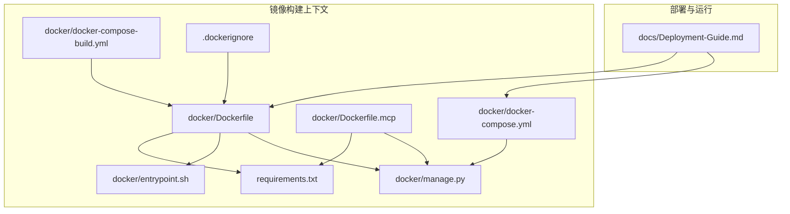
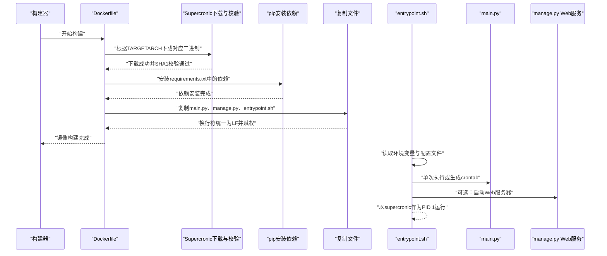
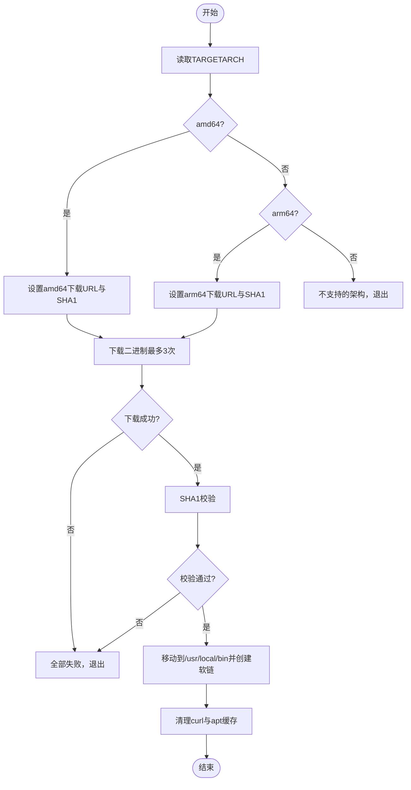
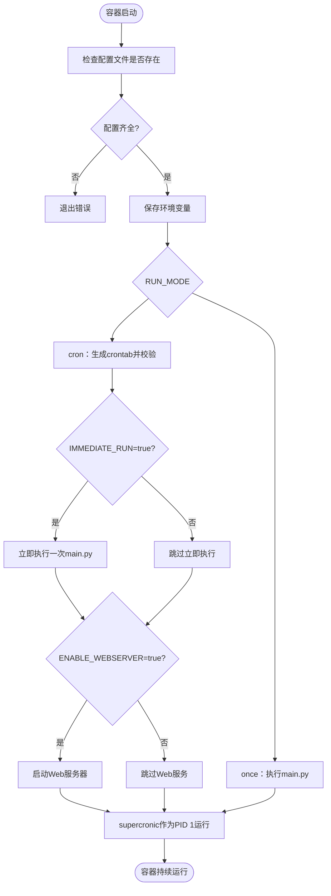
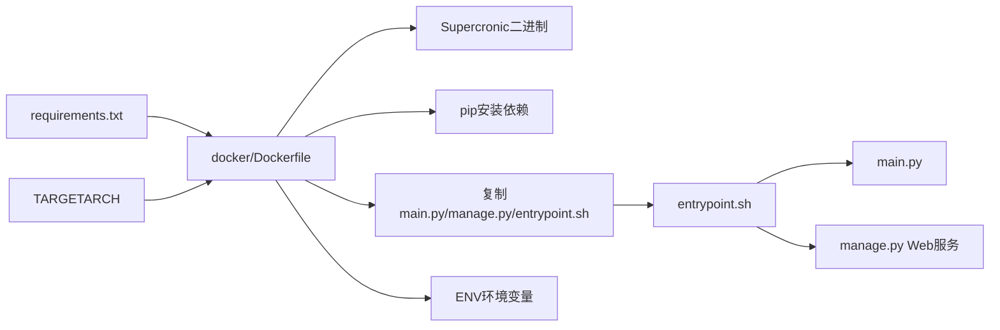

# Docker镜像构建

<cite>
**本文引用的文件**
- [Dockerfile](file://docker/Dockerfile)
- [Dockerfile.mcp](file://docker/Dockerfile.mcp)
- [entrypoint.sh](file://docker/entrypoint.sh)
- [manage.py](file://docker/manage.py)
- [Deployment-Guide.md](file://docs/Deployment-Guide.md)
- [requirements.txt](file://requirements.txt)
- [.dockerignore](file://.dockerignore)
- [docker-compose.yml](file://docker/docker-compose.yml)
- [docker-compose-build.yml](file://docker/docker-compose-build.yml)
</cite>

## 目录
1. [简介](#简介)
2. [项目结构](#项目结构)
3. [核心组件](#核心组件)
4. [架构总览](#架构总览)
5. [详细组件分析](#详细组件分析)
6. [依赖关系分析](#依赖关系分析)
7. [性能考量](#性能考量)
8. [故障排查指南](#故障排查指南)
9. [结论](#结论)
10. [附录](#附录)

## 简介
本文件围绕仓库中的Docker镜像构建流程展开，聚焦于Dockerfile中的各层指令与构建细节，包括基础镜像选择、工作目录设置、依赖安装、Supercronic定时任务工具的多架构下载与校验机制、COPY指令的跨平台换行处理、ENV环境变量的作用，以及与部署指南的配合使用。文档同时给出docker build命令的完整示例与最佳实践建议，帮助读者理解并高效构建与运行镜像。

## 项目结构
与Docker镜像构建直接相关的文件主要位于docker目录及根目录的部署与配置文件中。下图展示了与镜像构建相关的文件组织与交互关系。

图表来源
- [Dockerfile](file://docker/Dockerfile#L1-L71)
- [Dockerfile.mcp](file://docker/Dockerfile.mcp#L1-L24)
- [entrypoint.sh](file://docker/entrypoint.sh#L1-L50)
- [manage.py](file://docker/manage.py#L1-L625)
- [Deployment-Guide.md](file://docs/Deployment-Guide.md#L160-L223)
- [.dockerignore](file://.dockerignore#L1-L35)
- [docker-compose.yml](file://docker/docker-compose.yml#L1-L74)
- [docker-compose-build.yml](file://docker/docker-compose-build.yml#L1-L78)

章节来源
- [Dockerfile](file://docker/Dockerfile#L1-L71)
- [Dockerfile.mcp](file://docker/Dockerfile.mcp#L1-L24)
- [Deployment-Guide.md](file://docs/Deployment-Guide.md#L160-L223)

## 核心组件
- 基础镜像与工作目录：使用轻量级官方Python镜像作为基础，设置工作目录为/app，便于后续依赖安装与文件复制。
- Supercronic多架构下载与校验：通过TARGETARCH构建参数区分amd64与arm64，分别下载对应二进制并进行SHA1校验，确保二进制来源可信。
- 依赖安装：通过requirements.txt安装运行所需的Python包。
- 文件复制与跨平台换行处理：将main.py、manage.py与entrypoint.sh复制到容器中，并使用sed将换行符统一为LF，保证在不同平台上的可执行一致性。
- 环境变量：定义多个运行时环境变量，控制运行模式、定时任务、Web服务器等行为。
- 入口点：设置容器入口点为自定义的entrypoint脚本，负责根据环境变量决定单次执行或定时执行，并在需要时启动Web服务器。

章节来源
- [Dockerfile](file://docker/Dockerfile#L1-L71)
- [requirements.txt](file://requirements.txt#L1-L6)
- [entrypoint.sh](file://docker/entrypoint.sh#L1-L50)
- [manage.py](file://docker/manage.py#L1-L625)

## 架构总览
下图展示了镜像构建阶段的关键步骤与运行时的入口点流程。

图表来源
- [Dockerfile](file://docker/Dockerfile#L1-L71)
- [entrypoint.sh](file://docker/entrypoint.sh#L1-L50)
- [manage.py](file://docker/manage.py#L1-L625)

## 详细组件分析

### 基础镜像与工作目录
- 基础镜像：使用官方python:3.10-slim，兼顾体积与运行效率。
- 工作目录：设置为/app，后续所有文件复制与依赖安装均在此路径下进行，便于隔离与管理。

章节来源
- [Dockerfile](file://docker/Dockerfile#L1-L7)

### Supercronic多架构下载与校验机制
- 构建参数TARGETARCH：通过构建参数区分amd64与arm64，分别设置对应的下载URL与SHA1校验值。
- 下载重试逻辑：最多尝试3次，每次设置连接超时与最大下载时间；若全部失败则退出。
- SHA1校验：下载完成后使用sha1sum校验二进制完整性，确保来源可信。
- 清理与软链：移除curl依赖、清理apt缓存，并在/usr/local/bin创建二进制与软链，便于后续调用。

图表来源
- [Dockerfile](file://docker/Dockerfile#L6-L51)

章节来源
- [Dockerfile](file://docker/Dockerfile#L6-L51)

### 依赖安装（requirements.txt）
- 通过pip安装requirements.txt中声明的依赖，使用--no-cache-dir避免缓存污染镜像层。
- 依赖清单包含请求库、时区与时钟、YAML解析、MCP通信与WebSocket等模块。

章节来源
- [Dockerfile](file://docker/Dockerfile#L53-L54)
- [requirements.txt](file://requirements.txt#L1-L6)

### 文件复制与跨平台换行处理
- 复制main.py与manage.py至/app目录，便于容器内直接运行。
- 复制entrypoint.sh到临时路径，使用sed将换行符统一为LF，再移动到最终路径并赋予执行权限。
- 同步创建/app/config与/app/output目录，确保运行时具备必要的配置与输出目录。

章节来源
- [Dockerfile](file://docker/Dockerfile#L56-L65)

### 环境变量定义与作用
- PYTHONUNBUFFERED=1：禁用Python缓冲，便于容器日志实时输出。
- CONFIG_PATH与FREQUENCY_WORDS_PATH：指定配置文件与词频文件的默认路径，供应用读取。
- 运行时由entrypoint.sh进一步读取CRON_SCHEDULE、RUN_MODE、IMMEDIATE_RUN、ENABLE_WEBSERVER等变量，控制定时任务与Web服务行为。

章节来源
- [Dockerfile](file://docker/Dockerfile#L67-L69)
- [entrypoint.sh](file://docker/entrypoint.sh#L1-L50)

### 入口点与运行模式
- 入口点设置为自定义脚本，负责：
  - 检查配置文件是否存在；
  - 保存环境变量到系统环境；
  - 根据RUN_MODE选择单次执行或定时执行：
    - once：直接执行main.py；
    - cron：生成crontab并通过supercronic -test校验，支持IMMEDIATE_RUN立即执行一次，可选启动Web服务器；
  - 以supercronic作为PID 1运行，实现稳定的定时任务调度。

图表来源
- [entrypoint.sh](file://docker/entrypoint.sh#L1-L50)

章节来源
- [entrypoint.sh](file://docker/entrypoint.sh#L1-L50)

### MCP服务镜像（Dockerfile.mcp）
- 与主镜像类似，基于python:3.10-slim，安装requirements.txt依赖。
- 复制mcp_server目录，暴露3333端口，CMD启动MCP HTTP服务器。
- 该镜像用于独立运行MCP服务，与主镜像互补。

章节来源
- [Dockerfile.mcp](file://docker/Dockerfile.mcp#L1-L24)

## 依赖关系分析
- 构建阶段依赖：
  - Dockerfile依赖requirements.txt进行pip安装；
  - Supercronic下载依赖TARGETARCH构建参数与GitHub Releases；
  - 文件复制依赖main.py、manage.py与entrypoint.sh的存在。
- 运行阶段依赖：
  - entrypoint.sh依赖配置文件与环境变量；
  - manage.py提供Web服务器与状态检查等辅助能力；
  - supracronic作为PID 1负责定时任务调度。

图表来源
- [Dockerfile](file://docker/Dockerfile#L1-L71)
- [requirements.txt](file://requirements.txt#L1-L6)
- [entrypoint.sh](file://docker/entrypoint.sh#L1-L50)
- [manage.py](file://docker/manage.py#L1-L625)

章节来源
- [Dockerfile](file://docker/Dockerfile#L1-L71)
- [entrypoint.sh](file://docker/entrypoint.sh#L1-L50)
- [manage.py](file://docker/manage.py#L1-L625)

## 性能考量
- 层缓存策略：将Supercronic下载与pip安装放在较早层，有利于缓存命中；若依赖频繁变化，建议将依赖安装层置于更靠前位置。
- 二进制体积：Supercronic二进制较小，且通过SHA1校验确保完整性，不影响镜像体积。
- 运行时日志：PYTHONUNBUFFERED=1有助于实时日志输出，便于调试与运维。
- 多架构支持：通过TARGETARCH区分amd64与arm64，避免不必要的重复下载与错误匹配。

[本节为通用指导，无需列出具体文件来源]

## 故障排查指南
- Supercronic下载失败
  - 现象：下载重试多次后仍失败。
  - 排查：确认网络连通性、GitHub Releases可用性；检查TARGETARCH是否为amd64或arm64。
  - 参考路径：[Dockerfile](file://docker/Dockerfile#L12-L47)
- SHA1校验失败
  - 现象：校验不通过导致构建中断。
  - 排查：核对SUPERCRONIC_VERSION与对应架构的SHA1值是否匹配；确认下载URL正确。
  - 参考路径：[Dockerfile](file://docker/Dockerfile#L12-L47)
- 配置文件缺失
  - 现象：容器启动即退出。
  - 排查：确认/app/config/config.yaml与/app/config/frequency_words.txt已挂载。
  - 参考路径：[entrypoint.sh](file://docker/entrypoint.sh#L1-L12)
- 定时任务不执行
  - 现象：supercronic未按预期调度。
  - 排查：检查CRON_SCHEDULE格式；确认supercronic -test通过；查看容器日志。
  - 参考路径：[entrypoint.sh](file://docker/entrypoint.sh#L13-L46)
- Web服务器无法访问
  - 现象：ENABLE_WEBSERVER开启但无法访问。
  - 排查：确认WEBSERVER_PORT映射；检查manage.py start_webserver状态；确认output目录可读写。
  - 参考路径：[entrypoint.sh](file://docker/entrypoint.sh#L36-L41)，[manage.py](file://docker/manage.py#L403-L464)

章节来源
- [Dockerfile](file://docker/Dockerfile#L12-L47)
- [entrypoint.sh](file://docker/entrypoint.sh#L1-L50)
- [manage.py](file://docker/manage.py#L403-L464)

## 结论
本Dockerfile通过明确的分层设计与多架构支持，实现了Supercronic的可靠下载与校验、依赖的快速安装、以及跨平台兼容的脚本处理。结合entrypoint.sh的运行模式控制与manage.py的辅助能力，整体构建与运行流程清晰、可维护性强。配合部署指南中的构建与运行示例，可快速落地到生产环境。

[本节为总结性内容，无需列出具体文件来源]

## 附录

### docker build命令示例与最佳实践
- 基本构建
  - 示例命令：在docker目录下执行构建，镜像名为trendradar:latest。
  - 参考路径：[Deployment-Guide.md](file://docs/Deployment-Guide.md#L166-L170)
- 多架构构建（含TARGETARCH）
  - 示例命令：使用构建参数TARGETARCH指定架构，例如amd64或arm64。
  - 参考路径：[Dockerfile](file://docker/Dockerfile#L6-L11)
- 使用docker-compose构建
  - 使用docker-compose-build.yml在构建阶段指定dockerfile路径与上下文，便于多服务并行构建。
  - 参考路径：[docker-compose-build.yml](file://docker/docker-compose-build.yml#L1-L20)
- 运行容器
  - 单次运行：挂载config与output目录，一次性执行后自动清理。
  - 后台运行：守护进程方式运行，映射端口与挂载目录。
  - 参考路径：[Deployment-Guide.md](file://docs/Deployment-Guide.md#L172-L191)
- Docker Compose部署
  - 使用docker-compose.yml定义服务、端口映射、卷挂载与环境变量，便于一键启动。
  - 参考路径：[docker-compose.yml](file://docker/docker-compose.yml#L1-L74)

章节来源
- [Deployment-Guide.md](file://docs/Deployment-Guide.md#L166-L191)
- [docker-compose-build.yml](file://docker/docker-compose-build.yml#L1-L20)
- [docker-compose.yml](file://docker/docker-compose.yml#L1-L74)

### .dockerignore规则说明
- 忽略目标：版本控制、文档、日志、IDE相关文件与缓存，减少构建上下文大小，提升构建速度。
- 参考路径：[.dockerignore](file://.dockerignore#L1-L35)

章节来源
- [.dockerignore](file://.dockerignore#L1-L35)