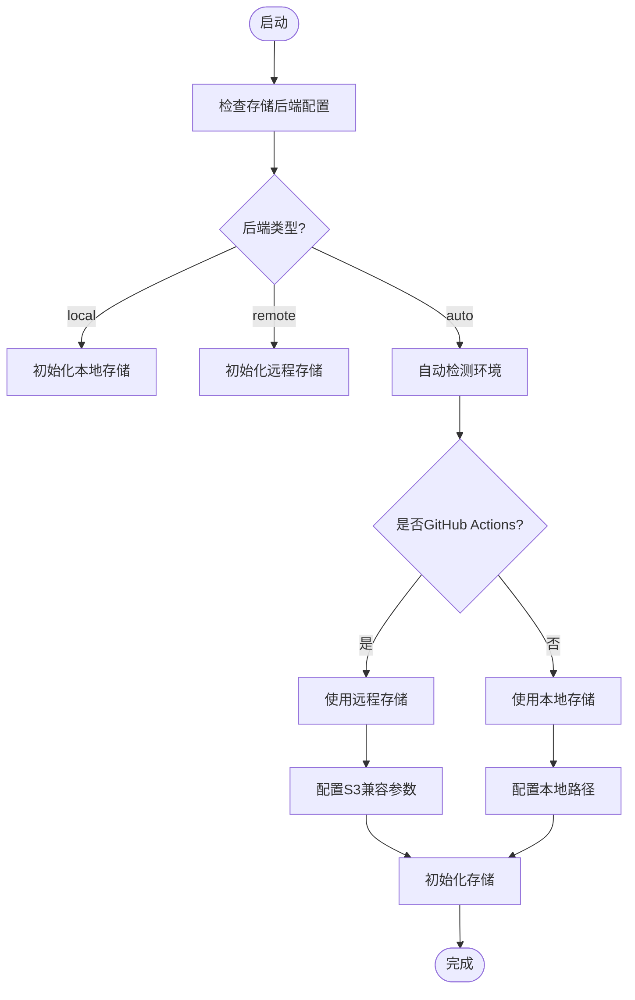

# GitHub Actions自动化部署

<cite>
**本文档引用文件**  
- [config.yaml](file://config/config.yaml)
- [.env](file://docker/.env)
- [entrypoint.sh](file://docker/entrypoint.sh)
- [Dockerfile](file://docker/Dockerfile)
- [docker-compose.yml](file://docker/docker-compose.yml)
- [README.md](file://README.md)
</cite>

## 目录
1. [简介](#简介)
2. [项目结构](#项目结构)
3. [核心组件](#核心组件)
4. [架构概述](#架构概述)
5. [详细组件分析](#详细组件分析)
6. [依赖分析](#依赖分析)
7. [性能考虑](#性能考虑)
8. [故障排除指南](#故障排除指南)
9. [结论](#结论)

## 简介

TrendRadar 是一个热点资讯聚合与推送系统，支持通过 GitHub Actions 实现自动化部署和定时运行。本项目利用 GitHub 的 CI/CD 能力，结合 Docker 容器化技术，实现了从代码检出、环境配置到服务启动的全流程自动化。系统能够定时爬取多个平台的热搜内容，并通过企业微信、飞书、Telegram 等多种渠道进行智能推送。通过合理的配置管理机制，用户可以灵活控制运行频率、推送模式和存储方式，满足不同场景下的需求。

## 项目结构

TrendRadar 项目采用模块化设计，主要包含配置文件、Docker 相关文件、核心代码和输出目录。配置文件集中存放在 `config/` 目录下，包括 `config.yaml` 和 `frequency_words.txt`，用于定义系统行为和监控关键词。Docker 相关文件位于 `docker/` 目录，包含 Dockerfile、docker-compose 文件和启动脚本。核心业务逻辑实现在 `trendradar/` 包中，按功能划分为爬虫、通知、报告生成等模块。`output/` 目录用于存储生成的报告文件，按日期组织。

**Diagram sources**
- [config.yaml](file://config/config.yaml)
- [.env](file://docker/.env)
- [Dockerfile](file://docker/Dockerfile)
- [docker-compose.yml](file://docker/docker-compose.yml)

**Section sources**
- [config.yaml](file://config/config.yaml)
- [.env](file://docker/.env)
- [Dockerfile](file://docker/Dockerfile)
- [docker-compose.yml](file://docker/docker-compose.yml)

## 核心组件

TrendRadar 的核心组件包括配置管理系统、定时任务调度器、数据爬取模块、通知推送服务和存储管理器。配置管理系统通过 `config.yaml` 文件和环境变量实现双重配置机制，允许用户在不同部署环境中灵活调整参数。定时任务调度器基于 supercronic 工具实现，能够在容器环境中可靠地执行周期性任务。数据爬取模块支持多个主流平台的热点数据采集，具有良好的扩展性。通知推送服务支持多种消息渠道，可根据用户偏好进行个性化配置。存储管理器支持本地 SQLite 和远程云存储两种模式，适应不同部署需求。

**Section sources**
- [config.yaml](file://config/config.yaml)
- [entrypoint.sh](file://docker/entrypoint.sh)
- [Dockerfile](file://docker/Dockerfile)

## 架构概述

TrendRadar 采用微服务架构思想，将不同功能模块解耦，通过清晰的接口进行通信。系统整体架构分为三层：接入层、业务逻辑层和数据存储层。接入层负责接收外部请求和触发定时任务；业务逻辑层包含核心的爬取、分析和推送功能；数据存储层提供持久化支持。在 GitHub Actions 环境中，系统通过定时触发器启动，执行完整的爬取-分析-推送流程，并将结果存储到远程云存储服务中。这种架构设计保证了系统的可维护性和可扩展性。

**Diagram sources**
- [entrypoint.sh](file://docker/entrypoint.sh)
- [Dockerfile](file://docker/Dockerfile)
- [config.yaml](file://config/config.yaml)

## 详细组件分析

### 配置管理组件分析

TrendRadar 的配置管理采用分层设计，优先级从高到低依次为：环境变量、配置文件、默认值。这种设计使得用户可以在不同部署环境中灵活调整参数，而无需修改代码。系统通过 `config.yaml` 文件定义大部分配置项，同时支持通过 `.env` 文件或 Docker 环境变量进行覆盖。关键安全参数如 webhook URL 和云存储凭证建议通过 GitHub Secrets 配置，以避免敏感信息泄露。

**Diagram sources**
- [config.yaml](file://config/config.yaml)
- [.env](file://docker/.env)

### 定时任务组件分析

定时任务组件基于 supercronic 工具实现，这是一个专为容器环境设计的 cron 实现。系统通过 `entrypoint.sh` 脚本生成 crontab 条目，并启动 supercronic 进程。定时表达式通过 `CRON_SCHEDULE` 环境变量配置，默认设置为每 30 分钟执行一次。该组件还支持立即执行一次的功能，通过 `IMMEDIATE_RUN` 环境变量控制，便于新部署后的快速验证。

**Diagram sources**
- [entrypoint.sh](file://docker/entrypoint.sh)
- [Dockerfile](file://docker/Dockerfile)

### 存储管理组件分析

存储管理组件支持多种后端存储方案，包括本地 SQLite 数据库和 S3 兼容的远程云存储。系统通过 `storage` 配置节定义存储策略，支持自动选择模式（auto），根据运行环境智能切换存储方式。对于 GitHub Actions 部署，推荐使用远程云存储（如 Cloudflare R2、阿里云 OSS），以避免污染代码仓库。数据保留策略可配置，支持自动清理过期数据。

**Diagram sources**
- [config.yaml](file://config/config.yaml)
- [Dockerfile](file://docker/Dockerfile)

## 依赖分析

TrendRadar 项目的依赖关系清晰，主要依赖包括 Python 基础库、Docker 运行时、supercronic 定时工具和云存储 SDK。项目通过 `requirements.txt` 文件管理 Python 依赖，确保环境一致性。Docker 镜像基于 `python:3.10-slim` 构建，保持轻量化。supercronic 作为关键的定时任务工具，通过多架构支持确保在不同硬件平台上正常运行。对于远程存储功能，系统依赖 boto3 库实现 S3 兼容协议的支持。

**Diagram sources**
- [requirements.txt](file://requirements.txt)
- [Dockerfile](file://docker/Dockerfile)

**Section sources**
- [requirements.txt](file://requirements.txt)
- [Dockerfile](file://docker/Dockerfile)

## 性能考虑

在 GitHub Actions 环境中运行 TrendRadar 需要考虑执行时间和资源限制。建议将定时任务间隔设置为至少 30 分钟，避免过于频繁的执行导致账户被限流。对于数据存储，推荐使用远程云存储而非 Git 提交，以减少仓库污染和提高性能。系统内置了消息分批发送机制，可有效处理大量推送内容，避免单条消息过长导致失败。此外，合理配置数据保留策略可以控制存储成本。

## 故障排除指南

常见问题包括 Secrets 配置错误、权限不足、定时任务未触发等。对于 Secrets 配置问题，应确保在 GitHub 仓库的 Secrets 中正确设置 `WEBHOOK_URL`、`S3_ACCESS_KEY_ID` 等关键参数，而非在配置文件中明文填写。权限问题通常出现在云存储访问时，需检查访问密钥的有效性和存储桶策略。定时任务未触发可能是由于 cron 表达式格式错误或 GitHub Actions 被禁用，可通过检查工作流文件和仓库设置来排查。

**Section sources**
- [config.yaml](file://config/config.yaml)
- [.env](file://docker/.env)
- [README.md](file://README.md)

## 结论

TrendRadar 通过 GitHub Actions 实现了完整的自动化部署流程，结合 Docker 容器化技术和灵活的配置管理，为用户提供了一个稳定可靠的热点资讯监控解决方案。系统设计充分考虑了安全性、可维护性和可扩展性，支持多种部署模式和通知渠道。通过合理的配置和监控，用户可以轻松实现每日早报等典型使用场景的自动推送，提高信息获取效率。