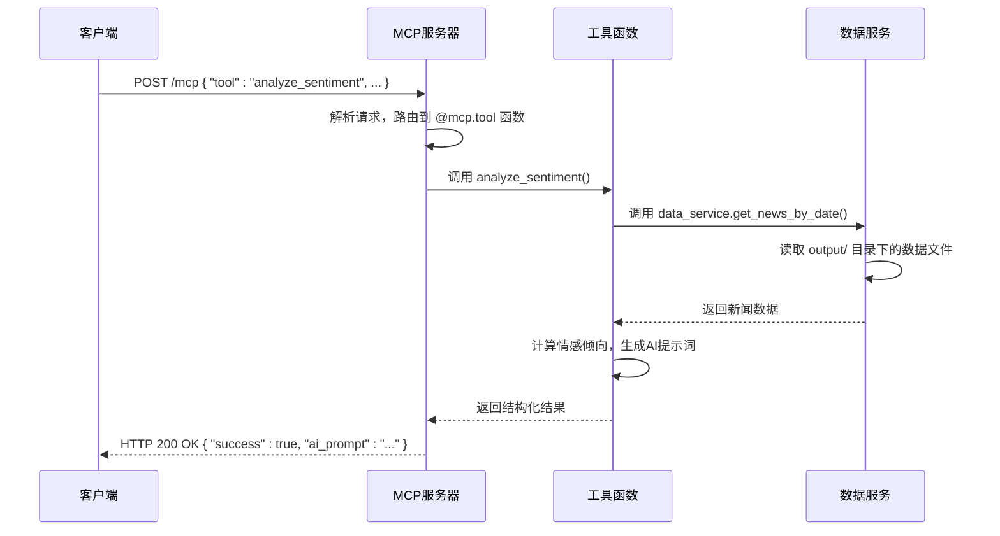
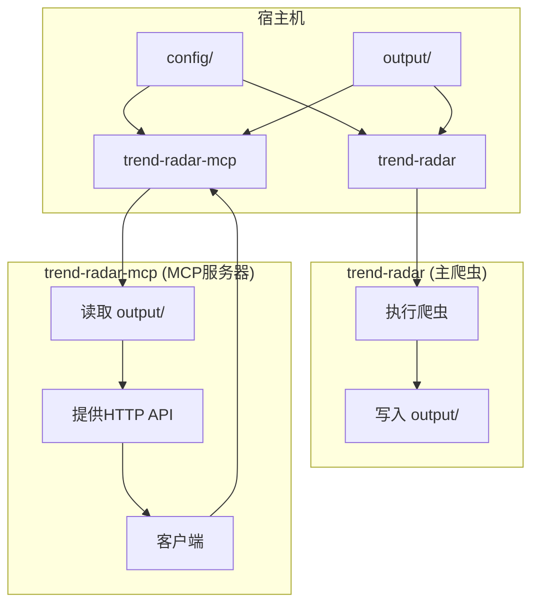

# MCP服务器部署

<cite>
**本文档引用文件**   
- [Dockerfile.mcp](file://docker/Dockerfile.mcp)
- [Dockerfile](file://docker/Dockerfile)
- [mcp_server/server.py](file://mcp_server/server.py)
- [docker/manage.py](file://docker/manage.py)
- [docker/docker-compose.yml](file://docker/docker-compose.yml)
- [mcp_server/tools/analytics.py](file://mcp_server/tools/analytics.py)
- [mcp_server/tools/data_query.py](file://mcp_server/tools/data_query.py)
- [mcp_server/tools/search_tools.py](file://mcp_server/tools/search_tools.py)
- [mcp_server/services/data_service.py](file://mcp_server/services/data_service.py)
- [mcp_server/utils/date_parser.py](file://mcp_server/utils/date_parser.py)
- [config/config.yaml](file://config/config.yaml)
</cite>

## 目录
1. [MCP服务器概述](#mcp服务器概述)
2. [Dockerfile差异分析](#dockerfile差异分析)
3. [WebSocket服务与请求处理](#websocket服务与请求处理)
4. [管理脚本功能](#管理脚本功能)
5. [Docker Compose配置](#docker-compose配置)
6. [MCP协议与工具调用](#mcp协议与工具调用)
7. [连接测试与交互示例](#连接测试与交互示例)
8. [常见问题与诊断](#常见问题与诊断)

## MCP服务器概述

MCP（Model Context Protocol）服务器作为TrendRadar项目的核心AI智能分析接口，为大语言模型提供了一套标准化的工具调用能力。该服务器通过HTTP协议暴露服务，允许客户端以自然语言发起查询，服务器端则将其解析为具体的工具调用，并返回结构化的JSON结果。MCP服务器的核心功能包括新闻数据查询、高级数据分析、智能检索、系统状态管理以及存储同步等，极大地增强了AI模型对实时热点数据的分析能力。

**Section sources**
- [mcp_server/server.py](file://mcp_server/server.py#L1-L910)

## Dockerfile差异分析

`Dockerfile.mcp`与标准`Dockerfile`在设计目标和实现细节上存在显著差异，分别服务于MCP服务器和主爬虫应用。

### 依赖项差异
`Dockerfile.mcp`专注于为MCP服务器提供运行环境，其依赖项精简且目标明确：
- **基础镜像**：使用`python:3.10-slim`，确保轻量化。
- **核心依赖**：通过`requirements.txt`安装，包括`fastmcp`（MCP协议实现）、`websockets`（WebSocket支持）和`boto3`（S3兼容存储支持）。
- **代码复制**：仅复制`mcp_server/`目录和`requirements.txt`，不包含爬虫核心逻辑。

相比之下，标准`Dockerfile`功能更全面：
- **定时任务**：集成`supercronic`（一个健壮的cron替代品），用于周期性执行爬虫任务。
- **入口脚本**：包含`entrypoint.sh`，负责环境初始化、配置验证和supercronic的启动。
- **完整代码**：复制`trendradar/`模块，包含爬虫、通知、报告生成等全部功能。

### 入口点与服务暴露
`Dockerfile.mcp`的入口点和端口暴露方式专为HTTP服务设计：
- **入口点**：通过`CMD`指令直接启动MCP服务器，使用`python -m mcp_server.server`命令，并指定`--transport http`模式。
- **服务端口**：通过`EXPOSE 3333`声明，MCP服务器在3333端口监听HTTP请求。

标准`Dockerfile`的入口点则更为复杂：
- **入口点**：使用`ENTRYPOINT ["/entrypoint.sh"]`，由shell脚本根据`RUN_MODE`环境变量决定是单次执行、定时执行还是传递其他命令。
- **服务端口**：不直接暴露，其端口由`entrypoint.sh`脚本根据`ENABLE_WEBSERVER`配置动态决定。

```mermaid
graph TD
subgraph "MCP服务器 (Dockerfile.mcp)"
A[基础镜像: python:3.10-slim]
B[安装: requirements.txt]
C[复制: mcp_server/]
D[复制: trendradar/ (仅用于读取数据)]
E[暴露端口: 3333]
F[入口点: CMD python -m mcp_server.server]
end
subgraph "主应用 (Dockerfile)"
G[基础镜像: python:3.10-slim]
H[安装: requirements.txt]
I[安装: supercronic]
J[复制: trendradar/]
K[复制: manage.py]
L[复制: entrypoint.sh]
M[入口点: ENTRYPOINT /entrypoint.sh]
end
A --> B --> C --> D --> E --> F
G --> H --> I --> J --> K --> L --> M
```

**Diagram sources**
- [docker/Dockerfile.mcp](file://docker/Dockerfile.mcp#L1-L26)
- [docker/Dockerfile](file://docker/Dockerfile#L1-L71)

**Section sources**
- [docker/Dockerfile.mcp](file://docker/Dockerfile.mcp#L1-L26)
- [docker/Dockerfile](file://docker/Dockerfile#L1-L71)

## WebSocket服务与请求处理

尽管`requirements.txt`中包含了`websockets`库，但根据`mcp_server/server.py`的代码分析，MCP服务器当前主要使用HTTP作为传输模式，而非WebSocket。

### 服务启动机制
MCP服务器的启动由`mcp_server/server.py`中的`run_server`函数控制。该函数通过`argparse`解析命令行参数，支持以下关键参数：
- `--transport`: 传输模式，可选`stdio`或`http`。在`Dockerfile.mcp`中，此参数被硬编码为`http`。
- `--host` 和 `--port`: 指定HTTP服务器的监听地址和端口，默认为`0.0.0.0:3333`。

启动流程如下：
1. 初始化全局工具实例（`_get_tools`函数），确保所有工具（如数据分析、数据查询）都已加载。
2. 打印详细的启动信息，包括传输模式、监听地址和已注册的工具列表。
3. 根据`transport`参数调用`fastmcp`库的`mcp.run()`方法。当`transport='http'`时，服务器会在指定的主机和端口上启动一个HTTP服务器。

### 请求处理流程
HTTP模式下的请求处理流程如下：
1. **接收请求**：客户端向`http://<host>:3333/mcp`发送POST请求，请求体包含MCP协议定义的工具调用指令。
2. **路由与执行**：`fastmcp`框架根据请求中的`tool`字段，将请求路由到`mcp_server/server.py`中用`@mcp.tool`装饰器标记的相应函数。
3. **工具调用**：目标函数（如`analyze_sentiment`）被调用，它会进一步调用`mcp_server/tools/`目录下的具体工具类（如`AnalyticsTools`）来执行业务逻辑。
4. **返回响应**：工具执行完成后，返回一个字典，该字典被序列化为JSON并作为HTTP响应返回给客户端。



**Diagram sources**
- [mcp_server/server.py](file://mcp_server/server.py#L785-L910)

**Section sources**
- [mcp_server/server.py](file://mcp_server/server.py#L785-L910)

## 管理脚本功能

`docker/manage.py`是一个功能丰富的管理脚本，为容器化应用提供了便捷的操作接口。

### 核心功能
该脚本通过命令行参数提供多种管理功能：
- **`run`**: 手动执行一次爬虫任务，等同于直接运行`python -m trendradar`。
- **`status`**: 显示容器的详细运行状态，包括PID 1进程、环境变量、配置文件检查、关键文件存在性以及容器运行时间。这是诊断问题的首要命令。
- **`config`**: 显示当前所有环境变量的配置，敏感信息（如Webhook URL）会被部分掩码显示。
- **`files`**: 列出`output/`目录下的最新文件，方便检查数据生成情况。
- **`logs`**: 尝试实时查看PID 1进程的日志输出。
- **`start_webserver` / `stop_webserver` / `webserver_status`**: 管理内嵌的HTTP服务器，用于托管`output/`目录下的静态文件，可通过浏览器访问。

### 运行机制
该脚本通常在容器内部执行，例如通过`docker exec -it trend-radar python manage.py status`来检查状态。它利用`subprocess`模块与系统交互，检查文件、进程和环境变量，并提供了清晰的用户界面和操作建议。

**Section sources**
- [docker/manage.py](file://docker/manage.py#L1-L648)

## Docker Compose配置

`docker-compose.yml`文件定义了两个服务：`trend-radar`（主爬虫）和`trend-radar-mcp`（MCP服务器），实现了组件间的解耦与通信。

### MCP专用配置
`trend-radar-mcp`服务的配置要点如下：
- **镜像**：使用专用的`wantcat/trendradar-mcp:latest`镜像。
- **端口映射**：将容器内的3333端口映射到宿主机的127.0.0.1:3333，确保服务仅在本地回环接口上可用，提高了安全性。
- **卷挂载**：将宿主机的`config/`和`output/`目录挂载到容器内，确保MCP服务器可以读取配置文件和最新的新闻数据。
- **环境变量**：仅设置了`TZ`（时区），其他配置通过挂载的`config.yaml`文件读取。

### 组件间通信
MCP服务器与主爬虫通过共享的`output/`目录进行通信：
1. **主爬虫**：在`RUN_MODE=cron`下，通过`supercronic`定时执行爬虫任务，将生成的新闻数据（SQLite, TXT, HTML）写入`output/`目录。
2. **MCP服务器**：通过挂载的`output/`目录，直接读取这些数据文件，为工具调用提供数据源。这种设计使得MCP服务器无需直接访问数据库或网络API，简化了架构。



**Diagram sources**
- [docker/docker-compose.yml](file://docker/docker-compose.yml#L1-L88)

**Section sources**
- [docker/docker-compose.yml](file://docker/docker-compose.yml#L1-L88)

## MCP协议与工具调用

MCP服务器的核心价值在于其丰富的工具集，客户端可通过自然语言查询触发这些工具。

### 客户端查询流程
1. **发起自然语言查询**：客户端向MCP服务器发送一个包含自然语言描述的请求，例如“分析AI本周的情感倾向”。
2. **工具选择与调用**：AI模型根据语义理解，选择并调用相应的MCP工具。对于上述查询，推荐流程是：
   a. 调用`resolve_date_range("本周")`获取精确的日期范围。
   b. 将返回的`date_range`作为参数，调用`analyze_sentiment(topic="AI", date_range=...)`。
3. **接收结构化响应**：服务器返回JSON格式的结果，其中可能包含原始数据、分析结果或用于进一步AI分析的提示词（prompt）。

### 服务器端工具响应
服务器端的工具调用流程如下：
1. **`resolve_date_range`**: 由`mcp_server/utils/date_parser.py`实现，将“本周”等自然语言解析为`{"start": "2025-11-18", "end": "2025-11-26"}`的JSON对象，确保日期计算的一致性。
2. **`analyze_sentiment`**: 由`mcp_server/tools/analytics.py`中的`AnalyticsTools`类实现。它调用`DataService`从`output/`目录读取数据，对包含指定话题的新闻进行去重和权重排序，最后生成一个优化的AI提示词。
3. **`get_latest_news`**: 由`mcp_server/tools/data_query.py`中的`DataQueryTools`实现，直接读取最新的数据文件，返回新闻列表。

**Section sources**
- [mcp_server/server.py](file://mcp_server/server.py#L44-L910)
- [mcp_server/tools/analytics.py](file://mcp_server/tools/analytics.py#L1-L1996)
- [mcp_server/tools/data_query.py](file://mcp_server/tools/data_query.py#L1-L285)
- [mcp_server/services/data_service.py](file://mcp_server/services/data_service.py#L1-L624)
- [mcp_server/utils/date_parser.py](file://mcp_server/utils/date_parser.py#L1-L508)

## 连接测试与交互示例

### 连接测试方法
1. **检查服务状态**：使用`docker-compose ps`确认`trend-radar-mcp`服务正在运行。
2. **测试HTTP连接**：使用`curl`命令测试端点。
    ```bash
    curl -X POST http://127.0.0.1:3333/mcp \
    -H "Content-Type: application/json" \
    -d '{"tool": "get_system_status"}'
    ```
    预期返回一个包含系统版本、数据统计和健康状态的JSON对象。

### 典型交互示例
**场景：分析“特斯拉”最近7天的热度趋势**
1. **客户端请求**：
    ```json
    {
      "tool": "resolve_date_range",
      "arguments": {
        "expression": "最近7天"
      }
    }
    ```
2. **服务器响应**：
    ```json
    {
      "success": true,
      "date_range": {
        "start": "2025-11-20",
        "end": "2025-11-26"
      }
    }
    ```
3. **客户端请求**（使用上一步的`date_range`）：
    ```json
    {
      "tool": "analyze_topic_trend",
      "arguments": {
        "topic": "特斯拉",
        "analysis_type": "trend",
        "date_range": {
          "start": "2025-11-20",
          "end": "2025-11-26"
        }
      }
    }
    ```
4. **服务器响应**：返回一个包含每日热度计数、趋势方向和统计指标的详细JSON报告。

**Section sources**
- [mcp_server/server.py](file://mcp_server/server.py#L246-L278)
- [mcp_server/server.py](file://mcp_server/server.py#L270-L278)

## 常见问题与诊断

### WebSocket连接失败
**问题**：尝试通过WebSocket连接时失败。
**诊断**：当前MCP服务器默认使用HTTP模式，`Dockerfile.mcp`中未配置WebSocket的监听。`fastmcp`库虽支持WebSocket，但项目配置为HTTP。
**修复建议**：客户端应使用HTTP POST请求与`/mcp`端点通信，而非WebSocket连接。

### 工具调用超时
**问题**：调用`search_news`或`analyze_data_insights`等复杂工具时超时。
**诊断**：这些工具需要遍历`output/`目录下的多个数据文件，如果数据量巨大，处理时间会很长。
**修复建议**：
1. 检查`output/`目录的大小，清理过期数据。
2. 优化查询，例如通过`date_range`参数缩小搜索范围。
3. 在客户端增加超时时间。

### 认证错误
**问题**：调用需要认证的工具时返回认证错误。
**诊断**：本MCP服务器的所有工具均为内部调用，不涉及用户认证。此错误可能源于客户端误将MCP服务器当作需要API密钥的外部服务。
**修复建议**：MCP服务器本身无认证机制，确保客户端直接调用其HTTP端点即可。

### 数据查询为空
**问题**：调用`get_latest_news`或`get_news_by_date`返回空结果。
**诊断**：
1. 主爬虫未运行或未成功生成数据。
2. `output/`目录未正确挂载。
3. 查询的日期范围超出数据范围。
**修复建议**：
1. 使用`docker exec -it trend-radar python manage.py status`检查主爬虫状态。
2. 使用`docker exec -it trend-radar python manage.py files`查看`output/`目录内容。
3. 调用`list_available_dates`工具确认可用的日期范围。

**Section sources**
- [mcp_server/server.py](file://mcp_server/server.py#L1-L910)
- [docker/manage.py](file://docker/manage.py#L1-L648)
- [config/config.yaml](file://config/config.yaml#L1-L187)