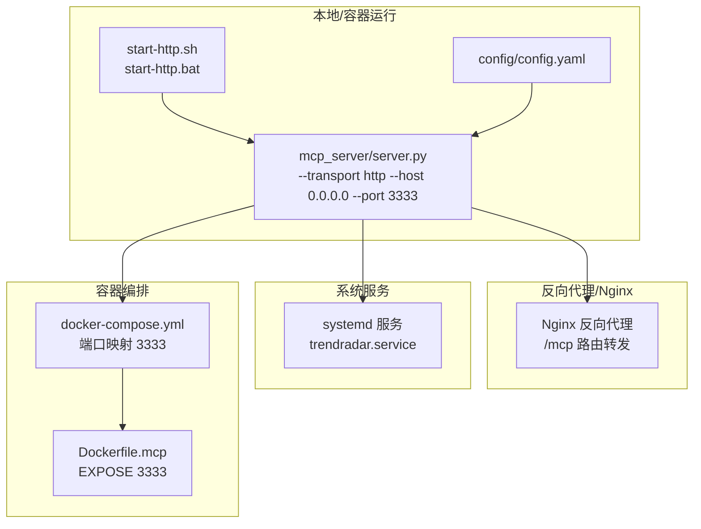
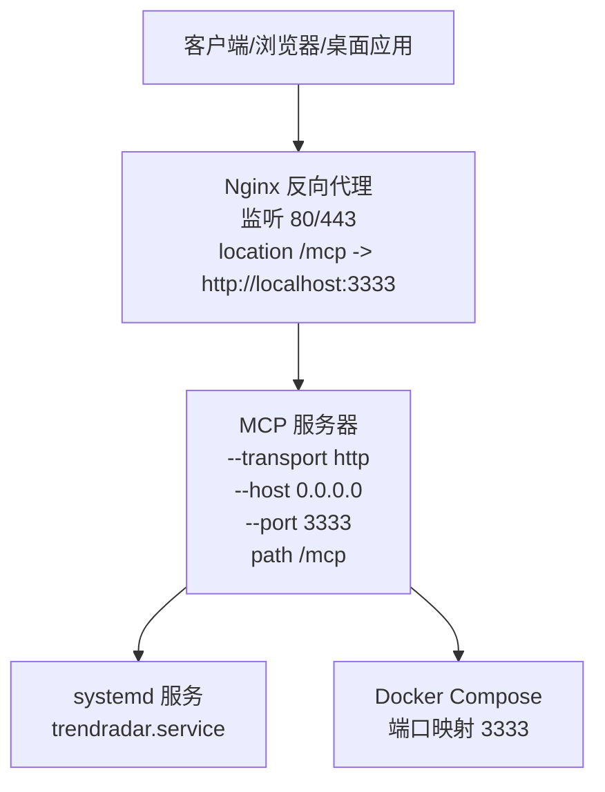
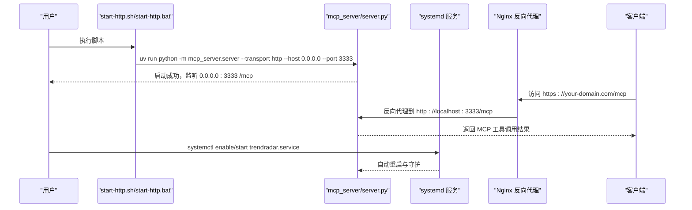
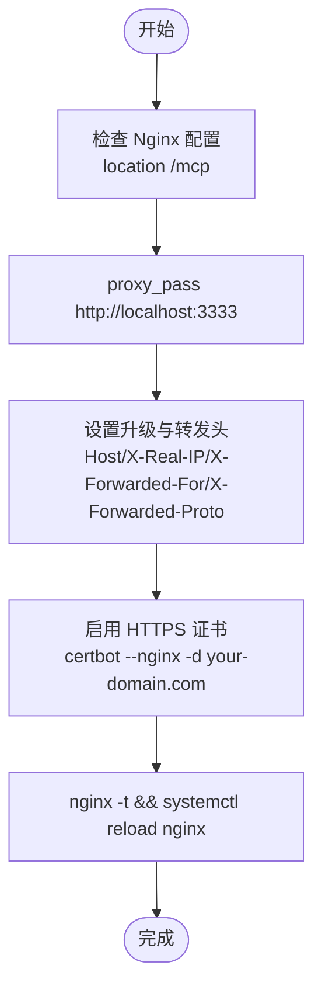
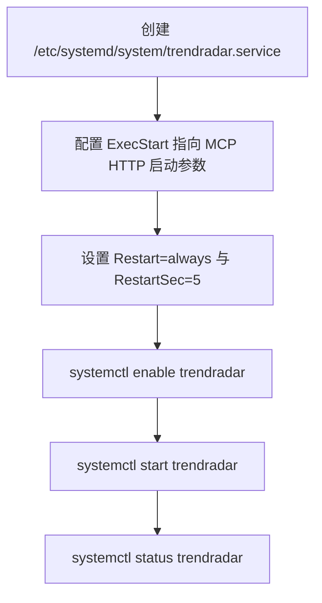
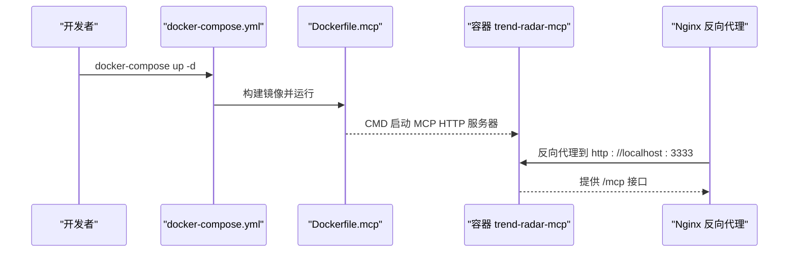
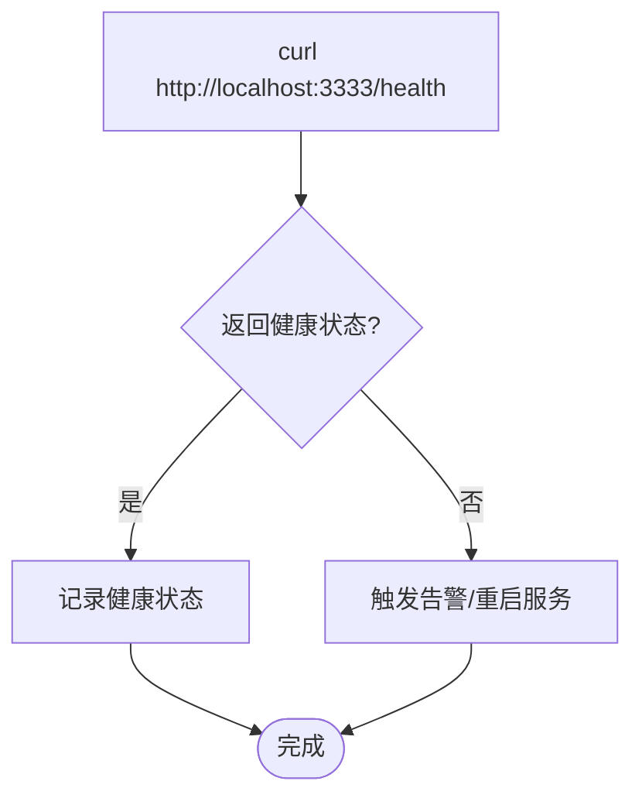
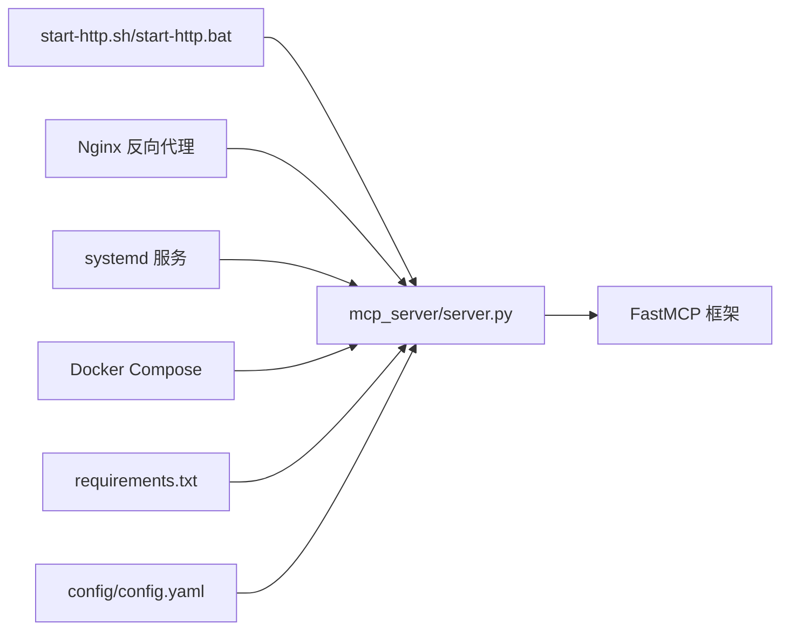

# HTTP模式部署

<cite>
**本文引用的文件**
- [start-http.sh](file://start-http.sh)
- [start-http.bat](file://start-http.bat)
- [mcp_server/server.py](file://mcp_server/server.py)
- [docs/Deployment-Guide.md](file://docs/Deployment-Guide.md)
- [docker/Dockerfile.mcp](file://docker/Dockerfile.mcp)
- [docker/docker-compose.yml](file://docker/docker-compose.yml)
- [config/config.yaml](file://config/config.yaml)
</cite>

## 目录
1. [简介](#简介)
2. [项目结构](#项目结构)
3. [核心组件](#核心组件)
4. [架构总览](#架构总览)
5. [详细组件分析](#详细组件分析)
6. [依赖关系分析](#依赖关系分析)
7. [性能与并发](#性能与并发)
8. [故障排查指南](#故障排查指南)
9. [结论](#结论)
10. [附录](#附录)

## 简介
本专项文档聚焦于通过 HTTP 传输模式部署 TrendRadar MCP 服务器，提供从本地便捷启动到生产环境的完整部署方案。内容涵盖：
- 使用命令行参数与脚本启动 HTTP 服务，暴露 3333 端口
- 结合部署指南中的 Nginx 反向代理配置，实现域名绑定、HTTPS 与反向代理
- systemd 服务创建与开机自启
- 生产环境关键配置：跨域访问、并发连接数、安全认证与健康检查
- Docker 镜像与 Compose 的端口映射与运行模式

## 项目结构
与 HTTP 模式部署直接相关的文件与职责如下：
- 启动脚本：start-http.sh（Linux/macOS）、start-http.bat（Windows）
- MCP 服务器入口：mcp_server/server.py（支持 --transport http、--host、--port）
- 部署指南：docs/Deployment-Guide.md（含 Nginx 反代、防火墙、HTTPS、systemd、健康检查等）
- Docker 配置：docker/Dockerfile.mcp（镜像构建与 EXPOSE 3333）、docker/docker-compose.yml（端口映射与服务编排）
- 应用配置：config/config.yaml（全局配置，影响服务行为）

图表来源
- [start-http.sh](file://start-http.sh#L1-L22)
- [start-http.bat](file://start-http.bat#L1-L26)
- [mcp_server/server.py](file://mcp_server/server.py#L727-L781)
- [docs/Deployment-Guide.md](file://docs/Deployment-Guide.md#L121-L163)
- [docker/docker-compose.yml](file://docker/docker-compose.yml#L60-L74)
- [docker/Dockerfile.mcp](file://docker/Dockerfile.mcp#L1-L24)
- [config/config.yaml](file://config/config.yaml#L1-L140)

章节来源
- [start-http.sh](file://start-http.sh#L1-L22)
- [start-http.bat](file://start-http.bat#L1-L26)
- [mcp_server/server.py](file://mcp_server/server.py#L727-L781)
- [docs/Deployment-Guide.md](file://docs/Deployment-Guide.md#L121-L163)
- [docker/docker-compose.yml](file://docker/docker-compose.yml#L60-L74)
- [docker/Dockerfile.mcp](file://docker/Dockerfile.mcp#L1-L24)
- [config/config.yaml](file://config/config.yaml#L1-L140)

## 核心组件
- HTTP 服务器启动参数
  - 传输模式：--transport http
  - 监听地址：--host 0.0.0.0
  - 监听端口：--port 3333
  - 端点路径：/mcp（由服务器内部设置）
- 便捷启动脚本
  - Linux/macOS：start-http.sh
  - Windows：start-http.bat
- 反向代理与域名绑定
  - Nginx 配置示例，location /mcp 转发至 http://localhost:3333
- systemd 服务
  - 部署指南提供 systemd 服务模板，ExecStart 指向 uv run python -m mcp_server.server --transport http --host 0.0.0.0 --port 3333
- Docker 镜像与 Compose
  - Dockerfile.mcp EXPOSE 3333；Compose 将宿主机 3333 映射到容器 3333
- 健康检查
  - 部署指南提供 /health 端点与 curl 健康检查示例

章节来源
- [mcp_server/server.py](file://mcp_server/server.py#L727-L781)
- [docs/Deployment-Guide.md](file://docs/Deployment-Guide.md#L121-L163)
- [docs/Deployment-Guide.md](file://docs/Deployment-Guide.md#L283-L305)
- [docker/Dockerfile.mcp](file://docker/Dockerfile.mcp#L1-L24)
- [docker/docker-compose.yml](file://docker/docker-compose.yml#L60-L74)
- [docs/Deployment-Guide.md](file://docs/Deployment-Guide.md#L397-L409)

## 架构总览
下图展示了 HTTP 模式部署的典型生产拓扑：客户端通过 Nginx 反向代理访问 MCP 服务器，服务器监听 0.0.0.0:3333，端点为 /mcp。系统通过 systemd 管理服务生命周期，容器通过 Docker Compose 编排。

图表来源
- [docs/Deployment-Guide.md](file://docs/Deployment-Guide.md#L135-L163)
- [mcp_server/server.py](file://mcp_server/server.py#L727-L781)
- [docs/Deployment-Guide.md](file://docs/Deployment-Guide.md#L283-L305)
- [docker/docker-compose.yml](file://docker/docker-compose.yml#L60-L74)

## 详细组件分析

### 启动参数与端口暴露
- 服务器入口通过参数控制传输模式、监听地址与端口，并在 HTTP 模式下将端点路径设置为 /mcp。
- 便捷脚本统一设置 host=0.0.0.0 与 port=3333，便于远程访问。
- Dockerfile.mcp EXPOSE 3333，Compose 将宿主机 3333 映射到容器 3333。

图表来源
- [start-http.sh](file://start-http.sh#L1-L22)
- [start-http.bat](file://start-http.bat#L1-L26)
- [mcp_server/server.py](file://mcp_server/server.py#L727-L781)
- [docs/Deployment-Guide.md](file://docs/Deployment-Guide.md#L283-L305)
- [docs/Deployment-Guide.md](file://docs/Deployment-Guide.md#L135-L163)

章节来源
- [mcp_server/server.py](file://mcp_server/server.py#L727-L781)
- [start-http.sh](file://start-http.sh#L1-L22)
- [start-http.bat](file://start-http.bat#L1-L26)
- [docker/Dockerfile.mcp](file://docker/Dockerfile.mcp#L1-L24)
- [docker/docker-compose.yml](file://docker/docker-compose.yml#L60-L74)

### Nginx 反向代理与 HTTPS
- 部署指南提供了 location /mcp 的反向代理配置，包含必要的 WebSocket/HTTP 升级头与 X-Forwarded-* 头。
- HTTPS 通过 Let's Encrypt 证书自动续期流程，建议在生产环境中开启。
- 建议将 /mcp 作为 MCP 的唯一对外入口，避免直接暴露后端端口。

图表来源
- [docs/Deployment-Guide.md](file://docs/Deployment-Guide.md#L135-L163)
- [docs/Deployment-Guide.md](file://docs/Deployment-Guide.md#L521-L532)

章节来源
- [docs/Deployment-Guide.md](file://docs/Deployment-Guide.md#L135-L163)
- [docs/Deployment-Guide.md](file://docs/Deployment-Guide.md#L521-L532)

### systemd 服务创建与自动恢复
- 部署指南提供了 systemd 服务模板，ExecStart 指向 uv run python -m mcp_server.server --transport http --host 0.0.0.0 --port 3333。
- 设置 Restart=always 与 RestartSec=5，确保异常退出后自动恢复。
- 启用服务：systemctl enable trendradar；启动服务：systemctl start trendradar。

图表来源
- [docs/Deployment-Guide.md](file://docs/Deployment-Guide.md#L283-L305)

章节来源
- [docs/Deployment-Guide.md](file://docs/Deployment-Guide.md#L283-L305)

### Docker 部署与端口映射
- Dockerfile.mcp EXPOSE 3333，并在 CMD 中以 HTTP 模式启动 MCP 服务器。
- docker-compose.yml 将宿主机 3333 映射到容器 3333，便于反向代理接入。
- 建议在生产环境使用 Compose 管理服务生命周期与健康检查。

图表来源
- [docker/Dockerfile.mcp](file://docker/Dockerfile.mcp#L1-L24)
- [docker/docker-compose.yml](file://docker/docker-compose.yml#L60-L74)

章节来源
- [docker/Dockerfile.mcp](file://docker/Dockerfile.mcp#L1-L24)
- [docker/docker-compose.yml](file://docker/docker-compose.yml#L60-L74)

### 健康检查与运维
- 部署指南提供 /health 健康检查端点与 curl 示例，可用于系统健康检查脚本与负载均衡探针。
- 建议在反向代理或负载均衡器中配置健康检查路径与超时参数。

图表来源
- [docs/Deployment-Guide.md](file://docs/Deployment-Guide.md#L397-L409)

章节来源
- [docs/Deployment-Guide.md](file://docs/Deployment-Guide.md#L397-L409)

## 依赖关系分析
- 启动脚本依赖 uv 与 Python 环境，确保虚拟环境存在后执行 MCP 服务器 HTTP 启动参数。
- 服务器入口依赖 FastMCP 框架，HTTP 模式下设置 path=/mcp。
- 反向代理依赖 Nginx，location /mcp 转发至本地 3333 端口。
- systemd 服务依赖 uv 与 Python 环境，ExecStart 指向 MCP 服务器 HTTP 启动参数。
- Docker 镜像依赖 requirements.txt 与 mcp_server 代码，EXPOSE 3333 并在 CMD 中启动 MCP 服务器。

图表来源
- [start-http.sh](file://start-http.sh#L1-L22)
- [start-http.bat](file://start-http.bat#L1-L26)
- [mcp_server/server.py](file://mcp_server/server.py#L727-L781)
- [docs/Deployment-Guide.md](file://docs/Deployment-Guide.md#L135-L163)
- [docs/Deployment-Guide.md](file://docs/Deployment-Guide.md#L283-L305)
- [docker/docker-compose.yml](file://docker/docker-compose.yml#L60-L74)
- [docker/Dockerfile.mcp](file://docker/Dockerfile.mcp#L1-L24)
- [config/config.yaml](file://config/config.yaml#L1-L140)

章节来源
- [start-http.sh](file://start-http.sh#L1-L22)
- [start-http.bat](file://start-http.bat#L1-L26)
- [mcp_server/server.py](file://mcp_server/server.py#L727-L781)
- [docs/Deployment-Guide.md](file://docs/Deployment-Guide.md#L135-L163)
- [docs/Deployment-Guide.md](file://docs/Deployment-Guide.md#L283-L305)
- [docker/docker-compose.yml](file://docker/docker-compose.yml#L60-L74)
- [docker/Dockerfile.mcp](file://docker/Dockerfile.mcp#L1-L24)
- [config/config.yaml](file://config/config.yaml#L1-L140)

## 性能与并发
- 并发连接数
  - 建议在反向代理层（Nginx）与系统内核层面合理配置并发连接上限与队列长度，参考部署指南中的内核参数调优建议。
- 超时与缓冲
  - 反代配置中包含升级头与缓存绕过设置，有助于提升 WebSocket/HTTP 升级场景下的稳定性。
- 负载均衡
  - 若需要横向扩展，可在反向代理后方部署多实例 MCP 服务器，并通过健康检查与会话亲和策略进行调度。

章节来源
- [docs/Deployment-Guide.md](file://docs/Deployment-Guide.md#L640-L651)
- [docs/Deployment-Guide.md](file://docs/Deployment-Guide.md#L135-L163)

## 故障排查指南
- 常见问题
  - uv 命令不可用：检查 PATH 或使用 pip 安装 uv。
  - 端口占用：使用 netstat 或 lsof 检查 3333 端口占用情况。
  - 日志定位：systemd journal 日志、容器日志与应用日志。
- 建议排查步骤
  - 检查服务状态：systemctl status trendradar
  - 检查端口占用：netstat -tlnp | grep 3333
  - 查看详细日志：journalctl -u trendradar -f
  - 健康检查：curl http://localhost:3333/health

章节来源
- [docs/Deployment-Guide.md](file://docs/Deployment-Guide.md#L431-L462)
- [docs/Deployment-Guide.md](file://docs/Deployment-Guide.md#L397-L409)

## 结论
通过 HTTP 传输模式部署 TrendRadar MCP 服务器，可快速实现远程访问与多客户端共享。结合 Nginx 反向代理、systemd 服务与 Docker 编排，能够满足生产环境的高可用与可维护性需求。建议在上线前完成 HTTPS 证书配置、健康检查与安全认证策略，并根据业务流量调整并发与超时参数。

## 附录

### A. HTTP 模式启动与端口暴露
- 命令行参数
  - --transport http
  - --host 0.0.0.0
  - --port 3333
  - 端点路径：/mcp（由服务器内部设置）
- 便捷脚本
  - Linux/macOS：start-http.sh
  - Windows：start-http.bat
- Docker
  - EXPOSE 3333；Compose 将宿主机 3333 映射到容器 3333

章节来源
- [mcp_server/server.py](file://mcp_server/server.py#L727-L781)
- [start-http.sh](file://start-http.sh#L1-L22)
- [start-http.bat](file://start-http.bat#L1-L26)
- [docker/Dockerfile.mcp](file://docker/Dockerfile.mcp#L1-L24)
- [docker/docker-compose.yml](file://docker/docker-compose.yml#L60-L74)

### B. 反向代理与域名绑定
- Nginx location /mcp 转发至 http://localhost:3333
- 升级头与转发头配置
- HTTPS 证书获取与自动续期

章节来源
- [docs/Deployment-Guide.md](file://docs/Deployment-Guide.md#L135-L163)
- [docs/Deployment-Guide.md](file://docs/Deployment-Guide.md#L521-L532)

### C. systemd 服务创建
- ExecStart 指向 uv run python -m mcp_server.server --transport http --host 0.0.0.0 --port 3333
- Restart=always 与 RestartSec=5
- 启用与启动命令

章节来源
- [docs/Deployment-Guide.md](file://docs/Deployment-Guide.md#L283-L305)

### D. 健康检查与运维
- /health 端点与 curl 示例
- 健康检查脚本与系统监控脚本

章节来源
- [docs/Deployment-Guide.md](file://docs/Deployment-Guide.md#L397-L409)
- [docs/Deployment-Guide.md](file://docs/Deployment-Guide.md#L369-L409)

### E. 安全认证与访问控制
- API 密钥认证中间件示例（Authorization: Bearer）
- 防火墙开放 3333 端口
- HTTPS 证书配置

章节来源
- [docs/Deployment-Guide.md](file://docs/Deployment-Guide.md#L534-L549)
- [docs/Deployment-Guide.md](file://docs/Deployment-Guide.md#L509-L519)
- [docs/Deployment-Guide.md](file://docs/Deployment-Guide.md#L521-L532)