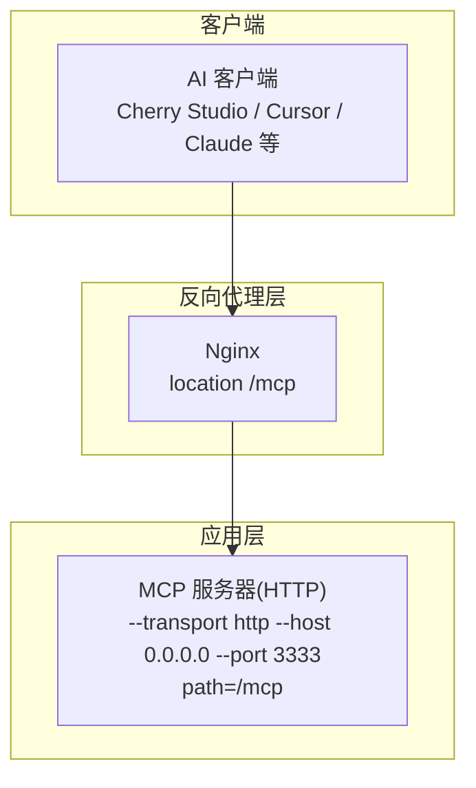
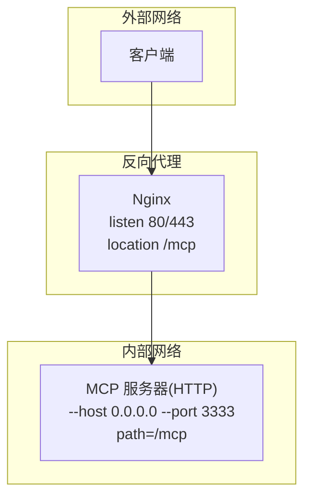
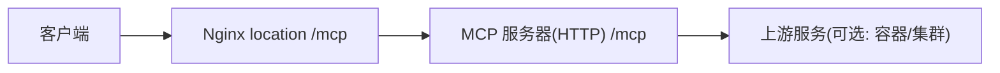

# 反向代理配置

<cite>
**本文引用的文件**
- [Deployment-Guide.md](file://docs/Deployment-Guide.md)
- [server.py](file://mcp_server/server.py)
- [start-http.sh](file://start-http.sh)
- [start-http.bat](file://start-http.bat)
- [docker-compose.yml](file://docker/docker-compose.yml)
- [Dockerfile.mcp](file://docker/Dockerfile.mcp)
- [README.md](file://README.md)
- [README-EN.md](file://README-EN.md)
- [README-Cherry-Studio.md](file://README-Cherry-Studio.md)
</cite>

## 目录
1. [简介](#简介)
2. [项目结构](#项目结构)
3. [核心组件](#核心组件)
4. [架构总览](#架构总览)
5. [详细组件分析](#详细组件分析)
6. [依赖关系分析](#依赖关系分析)
7. [性能考量](#性能考量)
8. [故障排查指南](#故障排查指南)
9. [结论](#结论)
10. [附录](#附录)

## 简介
本文件面向希望将 TrendRadar 的 MCP 服务器通过 Nginx 作为反向代理对外提供服务的读者，围绕 Deployment-Guide.md 中给出的 HTTP 模式部署示例，系统讲解如何在 Nginx 中配置 location /mcp 路径，重点说明 WebSocket 协议升级头（Upgrade、Connection）的设置原理，并提供包含域名绑定、负载均衡与 SSL 终止在内的完整站点配置思路与测试方法。同时，结合项目中 HTTP 模式启动参数与容器编排，帮助读者理解 MCP 服务端点路径与上游服务的关系。

## 项目结构
- MCP 服务器支持两种传输模式：stdio（本地开发）与 http（生产部署）。HTTP 模式下，服务器在本地监听指定端口，并将端点路径设置为 /mcp。
- 本地启动脚本提供了 HTTP 模式启动示例，便于在本机进行反向代理联调。
- Docker 镜像与 compose 文件展示了 MCP 服务的容器化部署方式，便于在容器环境中进行反向代理部署。

图表来源
- [server.py](file://mcp_server/server.py#L727-L781)
- [start-http.sh](file://start-http.sh#L1-L21)
- [start-http.bat](file://start-http.bat#L1-L25)

章节来源
- [server.py](file://mcp_server/server.py#L727-L781)
- [start-http.sh](file://start-http.sh#L1-L21)
- [start-http.bat](file://start-http.bat#L1-L25)

## 核心组件
- MCP 服务器（HTTP 模式）：通过命令行参数指定传输模式、监听地址、端口与端点路径。端点路径固定为 /mcp，这是 Nginx location 匹配的关键依据。
- Nginx 反向代理：负责将外部请求转发至 MCP 服务器，并正确传递协议升级头以支持 WebSocket。
- 本地启动脚本：提供 HTTP 模式启动示例，便于在本机联调反向代理。
- Docker 镜像与 compose：展示容器化部署方式，便于在容器环境中进行反向代理部署。

章节来源
- [server.py](file://mcp_server/server.py#L727-L781)
- [Deployment-Guide.md](file://docs/Deployment-Guide.md#L121-L163)
- [docker-compose.yml](file://docker/docker-compose.yml#L60-L74)
- [Dockerfile.mcp](file://docker/Dockerfile.mcp#L1-L24)

## 架构总览
下图展示了典型的反向代理架构：客户端通过 Nginx 访问 MCP 服务器，Nginx 将请求转发到本地监听的 MCP 服务器（端口 3333），并正确处理 WebSocket 协议升级头。

图表来源
- [Deployment-Guide.md](file://docs/Deployment-Guide.md#L135-L163)
- [server.py](file://mcp_server/server.py#L727-L781)

## 详细组件分析

### Nginx 反向代理配置要点
- 基础站点与域名绑定：站点监听 80 端口，server_name 指定域名；如需 HTTPS，应在 443 端口启用 SSL 并配置证书。
- location /mcp：将所有以 /mcp 开头的请求转发到 MCP 服务器（默认本地 3333 端口）。
- 协议升级头处理：为支持 WebSocket，必须显式传递 Upgrade 与 Connection 头，并设置 proxy_http_version 为 1.1。
- 其他常用头：Host、X-Real-IP、X-Forwarded-For、X-Forwarded-Proto 等，用于透传客户端真实 IP、协议与原始主机名等信息。
- 代理绕过缓存：当请求为 WebSocket 升级时，使用 proxy_cache_bypass $http_upgrade，避免代理层缓存导致握手失败。

章节来源
- [Deployment-Guide.md](file://docs/Deployment-Guide.md#L135-L163)

### location /mcp 路径匹配与转发原理
- 端点路径：MCP 服务器在 HTTP 模式下将端点路径固定为 /mcp，因此 Nginx 的 location 必须精确匹配 /mcp，以便将请求转发到 MCP 服务器。
- 转发目标：默认将请求转发到本地 3333 端口（可在同一主机上运行 MCP 服务器或通过容器映射暴露该端口）。
- 协议升级：WebSocket 握手依赖 Upgrade 与 Connection 头，Nginx 必须原样传递这些头，且 proxy_http_version 必须为 1.1。

章节来源
- [server.py](file://mcp_server/server.py#L727-L781)
- [Deployment-Guide.md](file://docs/Deployment-Guide.md#L135-L163)

### WebSocket 协议升级头设置原理
- Upgrade 头：指示客户端希望将协议从 HTTP 升级为 WebSocket。
- Connection 头：指示连接将被切换到新的协议。
- proxy_http_version 1.1：确保 Nginx 使用 HTTP/1.1，以便支持持久连接与升级。
- proxy_cache_bypass $http_upgrade：当请求为 WebSocket 升级时，绕过缓存，避免握手失败。

章节来源
- [Deployment-Guide.md](file://docs/Deployment-Guide.md#L135-L163)

### 完整站点配置示例（概念性说明）
以下为“概念性”的完整站点配置说明，涵盖域名绑定、负载均衡与 SSL 终止等高级特性。请根据实际环境替换域名、证书路径与上游节点。

- 域名绑定与监听
  - 监听 80 与 443 端口，server_name 指定主域名与泛域名。
  - 443 端口启用 SSL，配置证书与私钥路径。
- location /mcp
  - proxy_pass 指向上游 MCP 服务器（本地 3333 或容器映射后的地址）。
  - 透传 Upgrade 与 Connection 头，设置 proxy_http_version 为 1.1。
  - 透传 Host、X-Real-IP、X-Forwarded-For、X-Forwarded-Proto 等头。
  - 当请求为 WebSocket 升级时，proxy_cache_bypass $http_upgrade。
- 负载均衡（可选）
  - upstream 定义多个 MCP 实例，location /mcp 使用 proxy_pass 指向 upstream。
  - 可结合 keepalive、健康检查与权重策略提升可用性与吞吐。
- SSL 终止（可选）
  - 在 443 端口配置证书与私钥，Nginx 直接终止 TLS，上游 MCP 仍可保持 HTTP。
  - 或采用反向代理到上游 HTTPS（需相应证书与 SNI 配置）。

说明：本节为概念性说明，不直接映射到具体源文件，故不附“图表来源”与“章节来源”。

### MCP 服务器启动与端点路径
- 本地启动脚本展示了 HTTP 模式启动命令，监听 0.0.0.0:3333，并将端点路径设置为 /mcp。
- Docker 镜像与 compose 文件展示了 MCP 服务的容器化部署方式，便于在容器环境中进行反向代理部署。

章节来源
- [start-http.sh](file://start-http.sh#L1-L21)
- [start-http.bat](file://start-http.bat#L1-L25)
- [Dockerfile.mcp](file://docker/Dockerfile.mcp#L1-L24)
- [docker-compose.yml](file://docker/docker-compose.yml#L60-L74)

### 客户端连接与端点地址
- README 文档中明确给出了 HTTP 模式下的端点地址为 http://localhost:3333/mcp，用于在客户端（如 Cursor、Cherry Studio 等）中配置 MCP 服务器地址。
- 该地址与 Nginx 的 location /mcp 配置相呼应，确保客户端请求能够正确路由到 MCP 服务器。

章节来源
- [README.md](file://README.md#L2899-L2957)
- [README-EN.md](file://README-EN.md#L2883-L2987)
- [README-Cherry-Studio.md](file://README-Cherry-Studio.md#L141-L155)

## 依赖关系分析
- MCP 服务器端点路径固定为 /mcp，决定 Nginx location 的匹配规则。
- Nginx location /mcp 依赖上游 MCP 服务器在 3333 端口监听并正确处理 WebSocket 协议升级头。
- 客户端通过统一的端点地址 http://<domain>:<port>/mcp 连接 MCP 服务，Nginx 作为统一入口提供域名解析与协议终止。

图表来源
- [server.py](file://mcp_server/server.py#L727-L781)
- [Deployment-Guide.md](file://docs/Deployment-Guide.md#L135-L163)

章节来源
- [server.py](file://mcp_server/server.py#L727-L781)
- [Deployment-Guide.md](file://docs/Deployment-Guide.md#L135-L163)

## 性能考量
- 代理层缓存：对于非 WebSocket 的静态资源或响应，可考虑启用缓存以降低上游压力；但 WebSocket 握手必须 bypass 缓存。
- 连接复用：proxy_http_version 1.1 有助于维持长连接，减少握手开销。
- 负载均衡：在多实例场景下，合理配置 upstream 与 keepalive，提升吞吐与稳定性。
- 超时与缓冲：根据业务特征设置合理的超时与缓冲策略，避免慢连接占用资源。

说明：本节为通用指导，不直接分析具体源文件，故不附“章节来源”。

## 故障排查指南
- 验证 MCP 服务是否启动并监听 3333 端口
  - 使用本地启动脚本启动 HTTP 模式，确认端点路径为 /mcp。
- 验证 Nginx 配置语法与重载
  - 使用 Nginx 提供的配置测试命令检查语法，再执行服务重载。
- 使用 MCP Inspector 进行连通性测试
  - 在浏览器中访问 http://localhost:3333/mcp，使用 Inspector 测试 Ping 与 List Tools，验证 MCP 服务可用。
- 检查 WebSocket 握手
  - 若客户端为 WebSocket 场景，确认 Nginx 已透传 Upgrade 与 Connection 头，且 proxy_http_version 为 1.1。
- 防火墙与端口
  - 确认 3333 端口未被占用，且防火墙允许外部访问。

章节来源
- [start-http.sh](file://start-http.sh#L1-L21)
- [start-http.bat](file://start-http.bat#L1-L25)
- [Deployment-Guide.md](file://docs/Deployment-Guide.md#L135-L163)
- [README.md](file://README.md#L3094-L3119)
- [README-EN.md](file://README-EN.md#L3251-L3300)

## 结论
通过在 Nginx 中配置 location /mcp 并正确传递 WebSocket 协议升级头，可以将 TrendRadar 的 MCP 服务器以统一入口对外提供服务。结合域名绑定、负载均衡与 SSL 终止，可进一步提升安全性与可用性。建议在生产环境中配合健康检查、日志监控与限流策略，确保服务稳定运行。

## 附录
- 参考路径
  - Nginx 反向代理配置示例与启用站点命令：[Deployment-Guide.md](file://docs/Deployment-Guide.md#L135-L163)
  - MCP 服务器端点路径与启动参数：[server.py](file://mcp_server/server.py#L727-L781)
  - 本地 HTTP 模式启动脚本：[start-http.sh](file://start-http.sh#L1-L21)、[start-http.bat](file://start-http.bat#L1-L25)
  - 容器化部署与端口映射：[docker-compose.yml](file://docker/docker-compose.yml#L60-L74)、[Dockerfile.mcp](file://docker/Dockerfile.mcp#L1-L24)
  - 客户端端点地址说明：[README.md](file://README.md#L2899-L2957)、[README-EN.md](file://README-EN.md#L2883-L2987)、[README-Cherry-Studio.md](file://README-Cherry-Studio.md#L141-L155)