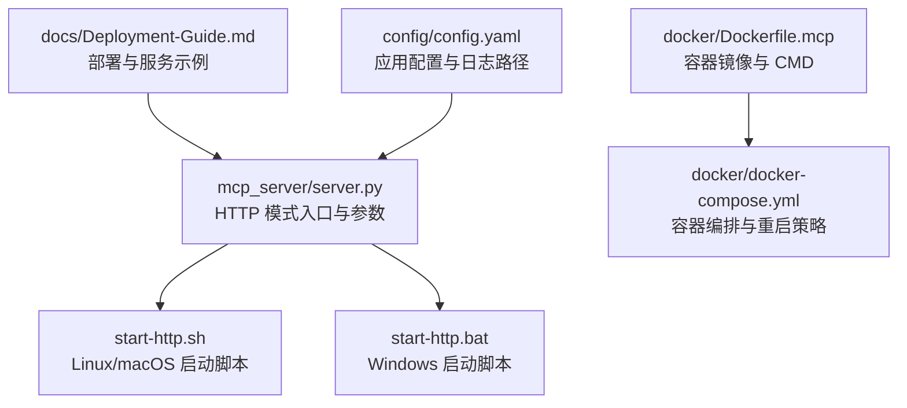
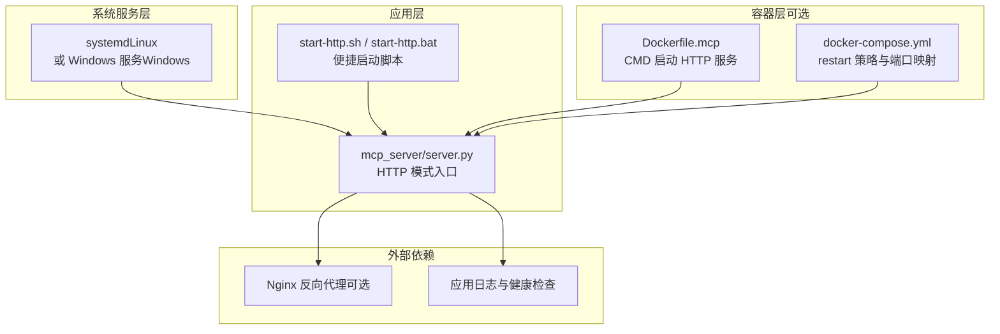
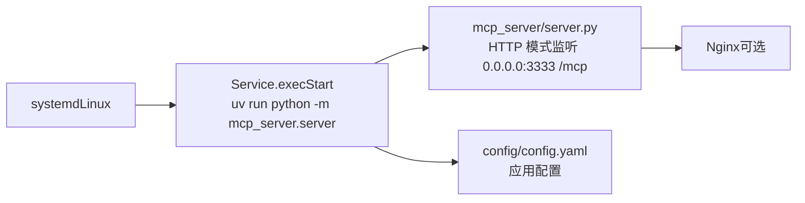

# 服务守护与管理

<cite>
**本文引用的文件**
- [Deployment-Guide.md](file://docs/Deployment-Guide.md)
- [mcp_server/server.py](file://mcp_server/server.py)
- [start-http.sh](file://start-http.sh)
- [start-http.bat](file://start-http.bat)
- [docker/Dockerfile.mcp](file://docker/Dockerfile.mcp)
- [docker/docker-compose.yml](file://docker/docker-compose.yml)
- [config/config.yaml](file://config/config.yaml)
</cite>

## 目录
1. [简介](#简介)
2. [项目结构](#项目结构)
3. [核心组件](#核心组件)
4. [架构总览](#架构总览)
5. [详细组件分析](#详细组件分析)
6. [依赖关系分析](#依赖关系分析)
7. [性能与稳定性考量](#性能与稳定性考量)
8. [故障排查指南](#故障排查指南)
9. [结论](#结论)
10. [附录](#附录)

## 简介
本文件面向希望将 MCP 服务器以 HTTP 模式作为系统服务长期运行的用户，结合部署指南中的 systemd 服务示例，系统讲解如何在 Linux 上使用 systemd、在 Windows 上使用 Windows 服务，将 TrendRadar 的 MCP 服务器配置为开机自启、自动恢复的守护进程。文档将逐段解释 [Unit]、[Service]、[Install] 各节的配置项含义，覆盖工作目录、执行命令、重启策略、日志与健康检查等运维要点，并给出启用、启动、状态查看与日志查询的标准命令，帮助您实现服务在系统重启后自动恢复运行。

## 项目结构
围绕“服务守护与管理”的目标，本项目与 HTTP 模式 MCP 服务相关的关键文件如下：
- 文档与部署参考：docs/Deployment-Guide.md
- MCP 服务器入口与 HTTP 模式参数：mcp_server/server.py
- 启动脚本（Linux/macOS/Windows）：start-http.sh、start-http.bat
- Docker 镜像与编排（便于理解服务暴露与重启策略）：docker/Dockerfile.mcp、docker/docker-compose.yml
- 应用配置（影响服务行为与日志路径）：config/config.yaml

图表来源
- [Deployment-Guide.md](file://docs/Deployment-Guide.md#L283-L305)
- [mcp_server/server.py](file://mcp_server/server.py#L660-L782)
- [start-http.sh](file://start-http.sh#L1-L22)
- [start-http.bat](file://start-http.bat#L1-L26)
- [docker/Dockerfile.mcp](file://docker/Dockerfile.mcp#L1-L24)
- [docker/docker-compose.yml](file://docker/docker-compose.yml#L1-L74)
- [config/config.yaml](file://config/config.yaml#L1-L140)

章节来源
- [Deployment-Guide.md](file://docs/Deployment-Guide.md#L283-L305)
- [mcp_server/server.py](file://mcp_server/server.py#L660-L782)
- [start-http.sh](file://start-http.sh#L1-L22)
- [start-http.bat](file://start-http.bat#L1-L26)
- [docker/Dockerfile.mcp](file://docker/Dockerfile.mcp#L1-L24)
- [docker/docker-compose.yml](file://docker/docker-compose.yml#L1-L74)
- [config/config.yaml](file://config/config.yaml#L1-L140)

## 核心组件
- MCP 服务器 HTTP 模式入口
  - 通过命令行参数控制传输模式、监听地址与端口，HTTP 模式默认监听路径为 /mcp。
  - 参考路径：[mcp_server/server.py](file://mcp_server/server.py#L660-L782)
- 启动脚本
  - Linux/macOS：start-http.sh 使用 uv 运行 mcp_server.server 的 HTTP 模式，监听 0.0.0.0:3333。
  - Windows：start-http.bat 同样以 HTTP 模式启动，监听 0.0.0.0:3333。
  - 参考路径：[start-http.sh](file://start-http.sh#L1-L22)、[start-http.bat](file://start-http.bat#L1-L26)
- systemd 服务示例
  - 部署指南提供了 systemd 服务文件模板，包含 [Unit]、[Service]、[Install] 三节，以及 ExecStart、WorkingDirectory、Restart 等关键配置。
  - 参考路径：[Deployment-Guide.md](file://docs/Deployment-Guide.md#L283-L305)
- Docker 服务参考
  - Dockerfile.mcp 与 docker-compose.yml 展示了容器内如何以 HTTP 模式运行 MCP 服务，以及 restart 策略与端口映射。
  - 参考路径：[docker/Dockerfile.mcp](file://docker/Dockerfile.mcp#L1-L24)、[docker/docker-compose.yml](file://docker/docker-compose.yml#L1-L74)

章节来源
- [mcp_server/server.py](file://mcp_server/server.py#L660-L782)
- [start-http.sh](file://start-http.sh#L1-L22)
- [start-http.bat](file://start-http.bat#L1-L26)
- [Deployment-Guide.md](file://docs/Deployment-Guide.md#L283-L305)
- [docker/Dockerfile.mcp](file://docker/Dockerfile.mcp#L1-L24)
- [docker/docker-compose.yml](file://docker/docker-compose.yml#L1-L74)

## 架构总览
下图展示了 MCP 服务器在 HTTP 模式下的典型运行路径与服务层关系。

图表来源
- [mcp_server/server.py](file://mcp_server/server.py#L660-L782)
- [start-http.sh](file://start-http.sh#L1-L22)
- [start-http.bat](file://start-http.bat#L1-L26)
- [docker/Dockerfile.mcp](file://docker/Dockerfile.mcp#L1-L24)
- [docker/docker-compose.yml](file://docker/docker-compose.yml#L1-L74)
- [Deployment-Guide.md](file://docs/Deployment-Guide.md#L121-L163)

## 详细组件分析

### systemd 服务配置详解（Linux）
部署指南提供了 systemd 服务文件模板，包含以下三节：
- [Unit]：服务元数据与依赖
  - Description：服务描述，便于识别。
  - After=network.target：在网络就绪后再启动，保证网络可用。
  - 参考路径：[Deployment-Guide.md](file://docs/Deployment-Guide.md#L283-L305)
- [Service]：服务执行与重启策略
  - Type=simple：简单类型，systemd 直接管理进程。
  - User：以指定用户身份运行，提升安全性。
  - WorkingDirectory：工作目录，确保相对路径与资源定位正确。
  - Environment=PATH：设置 PATH，确保 uv 可被发现。
  - ExecStart：执行命令，使用 uv 运行 MCP 服务器 HTTP 模式，监听 0.0.0.0:3333。
  - Restart=always：无论退出原因，总是重启；RestartSec=5：重启间隔。
  - 参考路径：[Deployment-Guide.md](file://docs/Deployment-Guide.md#L283-L305)
- [Install]：安装目标
  - WantedBy=multi-user.target：加入多用户目标，随系统启动。
  - 参考路径：[Deployment-Guide.md](file://docs/Deployment-Guide.md#L283-L305)

服务管理常用命令（Linux）：
- 启用服务：sudo systemctl enable trendradar
- 启动服务：sudo systemctl start trendradar
- 查看状态：sudo systemctl status trendradar
- 查看日志：sudo journalctl -u trendradar -f
- 重启服务：sudo systemctl restart trendradar

章节来源
- [Deployment-Guide.md](file://docs/Deployment-Guide.md#L283-L305)

### Windows 服务配置（概念性说明）
- Windows 服务通常通过 sc.exe 或 NSSM（非官方）等工具创建。
- 服务配置要点（与 systemd 类比）：
  - 可执行文件：指向 uv 或 Python 解释器。
  - 参数：--directory 项目根目录，run python -m mcp_server.server --transport http --host 0.0.0.0 --port 3333。
  - 工作目录：项目根目录。
  - 重启策略：失败自动重启。
  - 日志：将 stdout/stderr 重定向至文件或事件日志。
- 本节为概念性指导，具体实现请参考 Windows 服务管理工具的官方文档。

### MCP 服务器 HTTP 模式参数与端点
- 传输模式：--transport http
- 监听地址：--host 0.0.0.0
- 监听端口：--port 3333
- HTTP 端点：/mcp
- 参考路径：[mcp_server/server.py](file://mcp_server/server.py#L660-L782)

章节来源
- [mcp_server/server.py](file://mcp_server/server.py#L660-L782)

### 启动脚本与容器参考
- 启动脚本（Linux/macOS/Windows）均以 HTTP 模式运行 MCP 服务器，监听 0.0.0.0:3333。
- Dockerfile.mcp 与 docker-compose.yml 展示了容器内以 HTTP 模式运行 MCP 服务的方式，以及 restart: unless-stopped 的策略。
- 参考路径：
  - [start-http.sh](file://start-http.sh#L1-L22)
  - [start-http.bat](file://start-http.bat#L1-L26)
  - [docker/Dockerfile.mcp](file://docker/Dockerfile.mcp#L1-L24)
  - [docker/docker-compose.yml](file://docker/docker-compose.yml#L1-L74)

章节来源
- [start-http.sh](file://start-http.sh#L1-L22)
- [start-http.bat](file://start-http.bat#L1-L26)
- [docker/Dockerfile.mcp](file://docker/Dockerfile.mcp#L1-L24)
- [docker/docker-compose.yml](file://docker/docker-compose.yml#L1-L74)

## 依赖关系分析
- 服务依赖
  - 网络：After=network.target 确保网络可用。
  - 用户与权限：User 指定运行用户，WorkingDirectory 指定工作目录，Environment=PATH 指定可执行路径。
  - 可执行命令：ExecStart 使用 uv 运行 mcp_server.server，参数为 HTTP 模式。
- 运行时依赖
  - Python 与依赖：由 uv sync 安装，requirements.txt 与 FastMCP 提供运行时能力。
  - 配置文件：config/config.yaml 影响运行参数与日志路径。
- 外部依赖
  - Nginx 反向代理（可选）：部署指南提供了示例配置，便于对外提供服务。

图表来源
- [Deployment-Guide.md](file://docs/Deployment-Guide.md#L283-L305)
- [mcp_server/server.py](file://mcp_server/server.py#L660-L782)
- [config/config.yaml](file://config/config.yaml#L1-L140)

章节来源
- [Deployment-Guide.md](file://docs/Deployment-Guide.md#L283-L305)
- [mcp_server/server.py](file://mcp_server/server.py#L660-L782)
- [config/config.yaml](file://config/config.yaml#L1-L140)

## 性能与稳定性考量
- 重启策略
  - systemd：Restart=always + RestartSec=5，确保异常退出后自动恢复。
  - Docker：restart: unless-stopped，容器退出后自动重启。
  - 参考路径：[Deployment-Guide.md](file://docs/Deployment-Guide.md#L283-L305)、[docker/docker-compose.yml](file://docker/docker-compose.yml#L1-L74)
- 端口与网络
  - 监听 0.0.0.0:3333，若部署在公网，建议配合防火墙与反向代理。
  - 参考路径：[mcp_server/server.py](file://mcp_server/server.py#L660-L782)、[Deployment-Guide.md](file://docs/Deployment-Guide.md#L121-L163)
- 日志与健康检查
  - systemd 日志：journalctl -u trendradar -f。
  - 健康检查端点：/health（部署指南提供示例）。
  - 参考路径：[Deployment-Guide.md](file://docs/Deployment-Guide.md#L335-L429)

章节来源
- [Deployment-Guide.md](file://docs/Deployment-Guide.md#L121-L163)
- [Deployment-Guide.md](file://docs/Deployment-Guide.md#L335-L429)
- [docker/docker-compose.yml](file://docker/docker-compose.yml#L1-L74)

## 故障排查指南
- 常见问题定位
  - 服务状态：systemctl status trendradar
  - 端口占用：netstat -tlnp | grep 3333
  - 详细日志：journalctl -u trendradar -f
  - 参考路径：[Deployment-Guide.md](file://docs/Deployment-Guide.md#L431-L462)
- 日志分析
  - 应用日志：tail -f logs/trendradar.log
  - 错误统计：grep ERROR logs/trendradar.log | tail -20
  - 参考路径：[Deployment-Guide.md](file://docs/Deployment-Guide.md#L335-L358)
- 健康检查
  - curl http://localhost:3333/health
  - 参考路径：[Deployment-Guide.md](file://docs/Deployment-Guide.md#L395-L409)

章节来源
- [Deployment-Guide.md](file://docs/Deployment-Guide.md#L335-L462)

## 结论
通过 systemd（Linux）或 Windows 服务（Windows），您可以将 TrendRadar 的 MCP 服务器以 HTTP 模式作为系统服务长期运行。结合部署指南中的服务示例，合理配置 [Unit]、[Service]、[Install] 三节，即可实现开机自启与异常自动恢复。同时，借助健康检查端点与日志工具，可快速定位问题并保障服务稳定运行。

## 附录

### systemd 服务文件结构与配置项说明
- [Unit]
  - Description：服务描述
  - After：依赖网络就绪
- [Service]
  - Type：simple
  - User：运行用户
  - WorkingDirectory：工作目录
  - Environment：PATH
  - ExecStart：执行命令（uv 运行 MCP 服务器 HTTP 模式）
  - Restart：always
  - RestartSec：重启间隔
- [Install]
  - WantedBy：multi-user.target

章节来源
- [Deployment-Guide.md](file://docs/Deployment-Guide.md#L283-L305)

### 服务管理命令（Linux）
- 启用：sudo systemctl enable trendradar
- 启动：sudo systemctl start trendradar
- 状态：sudo systemctl status trendradar
- 日志：sudo journalctl -u trendradar -f
- 重启：sudo systemctl restart trendradar

章节来源
- [Deployment-Guide.md](file://docs/Deployment-Guide.md#L283-L305)

### HTTP 模式启动与端点
- 启动命令：uv run python -m mcp_server.server --transport http --host 0.0.0.0 --port 3333
- 端点：/mcp
- 参考路径：[mcp_server/server.py](file://mcp_server/server.py#L660-L782)

章节来源
- [mcp_server/server.py](file://mcp_server/server.py#L660-L782)