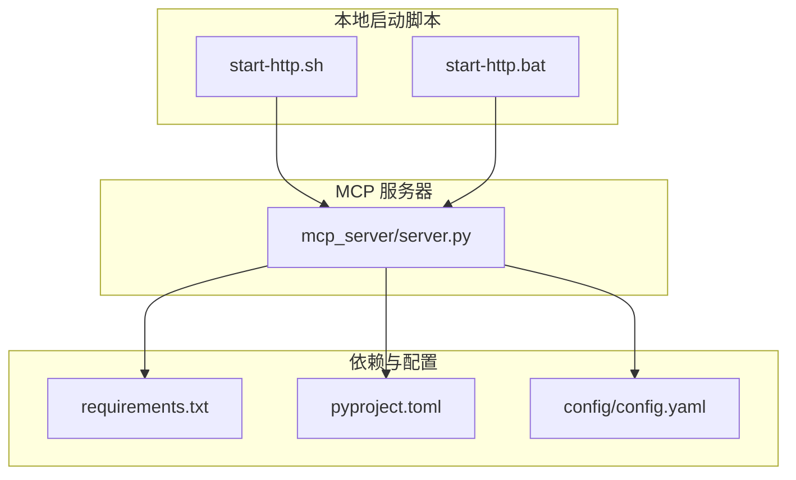
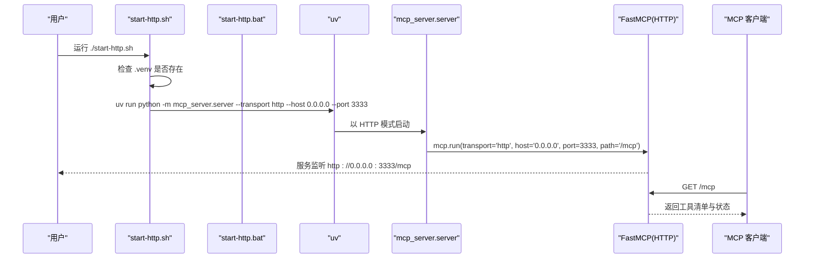
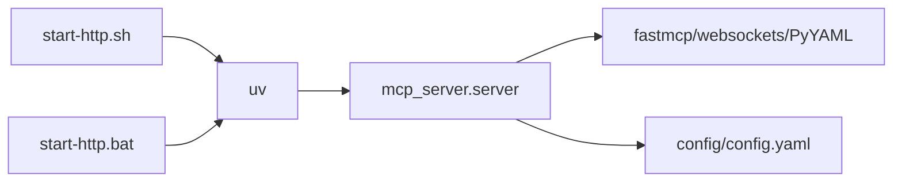

# 本地启动

<cite>
**本文引用的文件**
- [start-http.sh](file://start-http.sh)
- [start-http.bat](file://start-http.bat)
- [mcp_server/server.py](file://mcp_server/server.py)
- [requirements.txt](file://requirements.txt)
- [pyproject.toml](file://pyproject.toml)
- [config/config.yaml](file://config/config.yaml)
- [README.md](file://README.md)
- [setup-mac.sh](file://setup-mac.sh)
- [setup-windows.bat](file://setup-windows.bat)
- [setup-windows-en.bat](file://setup-windows-en.bat)
- [docker/Dockerfile.mcp](file://docker/Dockerfile.mcp)
</cite>

## 目录
1. [简介](#简介)
2. [项目结构](#项目结构)
3. [核心组件](#核心组件)
4. [架构总览](#架构总览)
5. [详细组件分析](#详细组件分析)
6. [依赖关系分析](#依赖关系分析)
7. [性能与并发](#性能与并发)
8. [启动验证与日志查看](#启动验证与日志查看)
9. [故障排查](#故障排查)
10. [结论](#结论)

## 简介
本章节面向希望在本地以 HTTP 模式启动 TrendRadar MCP 服务器的用户，围绕以下目标展开：
- 通过命令行直接启动 HTTP 服务
- 解释 Linux/macOS 的 start-http.sh 与 Windows 的 start-http.bat 两个便捷脚本的工作原理
- 说明虚拟环境检查、启动参数配置与错误处理机制
- 提供启动后的验证方法（如使用 curl 测试 HTTP 端点）
- 说明如何查看实时日志以及处理常见启动失败问题

## 项目结构
本项目采用“模块化 + 脚本化”的本地启动方式：
- 便捷启动脚本位于仓库根目录，分别针对 Linux/macOS 与 Windows
- MCP 服务器实现位于 mcp_server/server.py，支持 stdio 与 http 两种传输模式
- 依赖管理通过 requirements.txt 与 pyproject.toml 配置
- 配置文件 config/config.yaml 提供运行期配置（如平台、通知、权重等）

图表来源
- [start-http.sh](file://start-http.sh#L1-L22)
- [start-http.bat](file://start-http.bat#L1-L26)
- [mcp_server/server.py](file://mcp_server/server.py#L660-L782)
- [requirements.txt](file://requirements.txt#L1-L6)
- [pyproject.toml](file://pyproject.toml#L1-L26)
- [config/config.yaml](file://config/config.yaml#L1-L140)

章节来源
- [start-http.sh](file://start-http.sh#L1-L22)
- [start-http.bat](file://start-http.bat#L1-L26)
- [mcp_server/server.py](file://mcp_server/server.py#L660-L782)
- [requirements.txt](file://requirements.txt#L1-L6)
- [pyproject.toml](file://pyproject.toml#L1-L26)
- [config/config.yaml](file://config/config.yaml#L1-L140)

## 核心组件
- 启动脚本（Linux/macOS）
  - 负责检查虚拟环境是否存在，打印服务地址与提示信息，并调用 uv run python -m mcp_server.server 启动 HTTP 服务
- 启动脚本（Windows）
  - 负责检查虚拟环境是否存在，打印服务地址与提示信息，并调用 uv run python -m mcp_server.server 启动 HTTP 服务
- MCP 服务器
  - 提供 HTTP 端点 /mcp，监听 0.0.0.0:3333
  - 支持命令行参数：--transport、--host、--port、--project-root
- 依赖与配置
  - requirements.txt 与 pyproject.toml 约束运行时依赖
  - config/config.yaml 提供平台、通知、权重等配置

章节来源
- [start-http.sh](file://start-http.sh#L1-L22)
- [start-http.bat](file://start-http.bat#L1-L26)
- [mcp_server/server.py](file://mcp_server/server.py#L660-L782)
- [requirements.txt](file://requirements.txt#L1-L6)
- [pyproject.toml](file://pyproject.toml#L1-L26)
- [config/config.yaml](file://config/config.yaml#L1-L140)

## 架构总览
下图展示了本地 HTTP 启动的整体流程：脚本检查环境 → uv 运行 MCP 服务器 → FastMCP 启动 HTTP 服务 → 客户端通过 http://localhost:3333/mcp 访问工具。

图表来源
- [start-http.sh](file://start-http.sh#L1-L22)
- [start-http.bat](file://start-http.bat#L1-L26)
- [mcp_server/server.py](file://mcp_server/server.py#L660-L782)

## 详细组件分析

### 启动脚本（Linux/macOS）工作原理
- 虚拟环境检查
  - 若 .venv 目录不存在，打印错误并退出
- 服务信息提示
  - 输出“HTTP 模式”“地址 http://localhost:3333/mcp”“按 Ctrl+C 停止服务”
- 启动命令
  - uv run python -m mcp_server.server --transport http --host 0.0.0.0 --port 3333
  - 该命令由 mcp_server/server.py 的 run_server 函数解析并传入 FastMCP.run

章节来源
- [start-http.sh](file://start-http.sh#L1-L22)
- [mcp_server/server.py](file://mcp_server/server.py#L660-L782)

### 启动脚本（Windows）工作原理
- 虚拟环境检查
  - 若 .venv\Scripts\python.exe 不存在，打印错误并退出
- 服务信息提示
  - 输出“HTTP 模式”“地址 http://localhost:3333/mcp”“按 Ctrl+C 停止服务”
- 启动命令
  - uv run python -m mcp_server.server --transport http --host 0.0.0.0 --port 3333

章节来源
- [start-http.bat](file://start-http.bat#L1-L26)
- [mcp_server/server.py](file://mcp_server/server.py#L660-L782)

### MCP 服务器启动参数与行为
- 命令行参数
  - --transport: 选择 'stdio' 或 'http'
  - --host: HTTP 模式监听地址，默认 0.0.0.0
  - --port: HTTP 模式监听端口，默认 3333
  - --project-root: 项目根目录路径（可选）
- HTTP 端点
  - mcp.run(transport='http', host=host, port=port, path='/mcp')
  - 客户端通过 http://localhost:3333/mcp 访问

章节来源
- [mcp_server/server.py](file://mcp_server/server.py#L660-L782)

### 依赖与配置
- 依赖
  - requirements.txt 与 pyproject.toml 均声明了 fastmcp、websockets、PyYAML 等依赖
- 配置
  - config/config.yaml 提供平台、通知、权重等配置项，服务器启动时会加载工具实例并打印工具清单

章节来源
- [requirements.txt](file://requirements.txt#L1-L6)
- [pyproject.toml](file://pyproject.toml#L1-L26)
- [config/config.yaml](file://config/config.yaml#L1-L140)

## 依赖关系分析
- 启动脚本依赖 uv 与 .venv
- uv 通过 pyproject.toml 的 scripts 配置可直接运行 mcp_server.server
- mcp_server/server.py 依赖 fastmcp 并根据参数选择 HTTP 模式
- 服务器运行时读取 config/config.yaml 以初始化工具与配置

图表来源
- [start-http.sh](file://start-http.sh#L1-L22)
- [start-http.bat](file://start-http.bat#L1-L26)
- [pyproject.toml](file://pyproject.toml#L1-L26)
- [mcp_server/server.py](file://mcp_server/server.py#L1-L40)
- [config/config.yaml](file://config/config.yaml#L1-L140)

章节来源
- [pyproject.toml](file://pyproject.toml#L1-L26)
- [mcp_server/server.py](file://mcp_server/server.py#L1-L40)
- [config/config.yaml](file://config/config.yaml#L1-L140)

## 性能与并发
- 服务器默认监听 0.0.0.0:3333，允许来自本机或远程的连接
- 工具实现包含异步函数（async def），适合并发请求
- 依赖 fastmcp 与 websockets，具备较好的 HTTP/WS 服务能力
- 建议在生产环境中配合反向代理与负载均衡，以提升稳定性与安全性

章节来源
- [mcp_server/server.py](file://mcp_server/server.py#L660-L782)
- [requirements.txt](file://requirements.txt#L1-L6)

## 启动验证与日志查看

### 启动后的验证方法
- 使用浏览器访问 http://localhost:3333/mcp
- 使用 curl 测试端点（示例命令路径）
  - curl -v http://localhost:3333/mcp
- 使用 MCP 客户端（如 Cursor、Cherry Studio、Claude Desktop）连接 HTTP 地址 http://localhost:3333/mcp
- 参考文档中的“使用步骤”与“基本配置模板”

章节来源
- [README.md](file://README.md#L2926-L3165)

### 实时日志查看
- 启动脚本直接输出服务启动信息与工具清单
- FastMCP 在启动时会打印传输模式、监听地址与已注册工具列表
- 如需更详细的日志，可在客户端侧查看 MCP 协议交互日志

章节来源
- [mcp_server/server.py](file://mcp_server/server.py#L660-L782)
- [start-http.sh](file://start-http.sh#L1-L22)
- [start-http.bat](file://start-http.bat#L1-L26)

## 故障排查

### 常见启动失败问题与处理
- 虚拟环境未找到
  - 症状：脚本报错并退出
  - 处理：先运行 setup-mac.sh 或 setup-windows.bat/setup-windows-en.bat 完成依赖安装
- 端口占用
  - 症状：启动时报端口冲突
  - 处理：更换 --port 或释放占用端口；或在脚本中修改端口参数
- Python/uv 未安装或不可用
  - 症状：脚本提示找不到命令
  - 处理：安装 Python 3.10+ 与 uv，并确保 PATH 生效
- 网络或代理问题
  - 症状：依赖安装失败
  - 处理：检查网络连接，必要时配置代理；参考 setup 脚本中的错误提示与建议
- 配置文件缺失
  - 症状：运行时报错或工具不可用
  - 处理：准备 config/config.yaml 并按需填写平台、通知等配置

章节来源
- [start-http.sh](file://start-http.sh#L1-L22)
- [start-http.bat](file://start-http.bat#L1-L26)
- [setup-mac.sh](file://setup-mac.sh#L1-L119)
- [setup-windows.bat](file://setup-windows.bat#L1-L181)
- [setup-windows-en.bat](file://setup-windows-en.bat#L1-L176)
- [config/config.yaml](file://config/config.yaml#L1-L140)

## 结论
通过 start-http.sh（Linux/macOS）与 start-http.bat（Windows）两个脚本，用户可以快速在本地以 HTTP 模式启动 TrendRadar MCP 服务器。服务器默认监听 0.0.0.0:3333，并通过 /mcp 端点对外提供工具服务。建议在启动前完成依赖安装与配置准备，并使用浏览器或 MCP 客户端进行验证。若遇到启动失败，可依据脚本中的错误提示与 setup 脚本的诊断信息逐步排查。