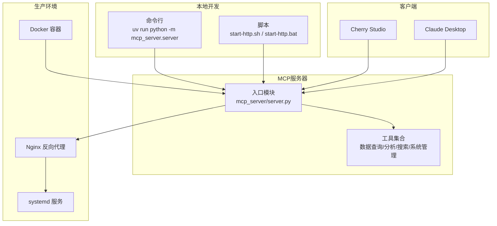
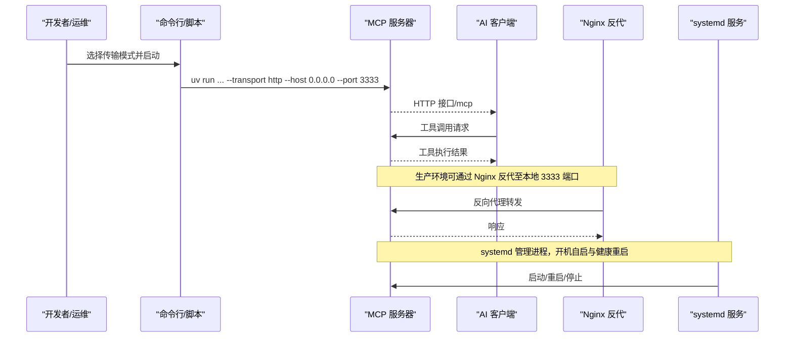
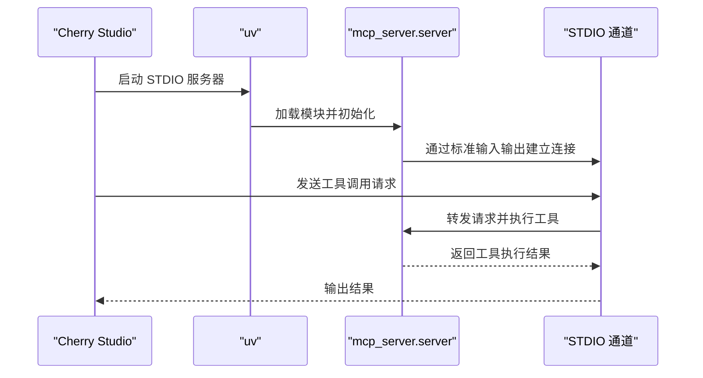
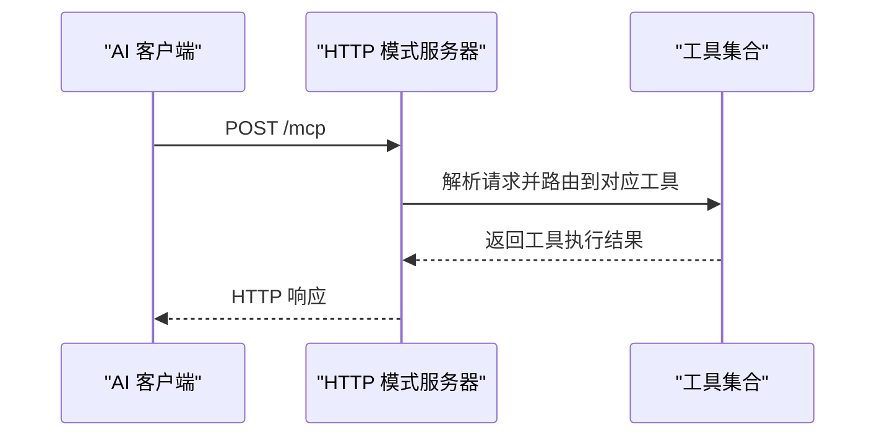
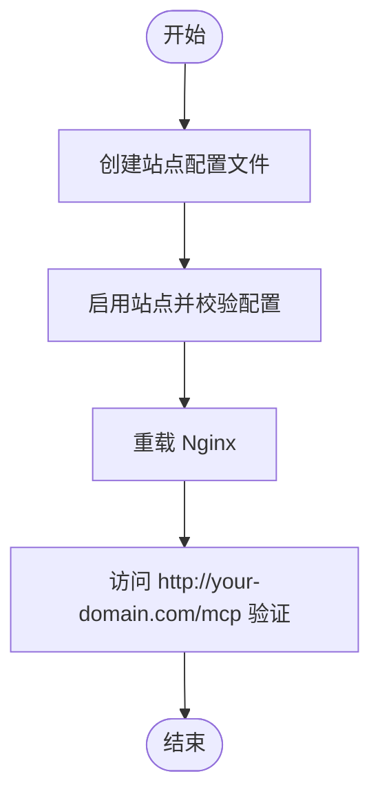
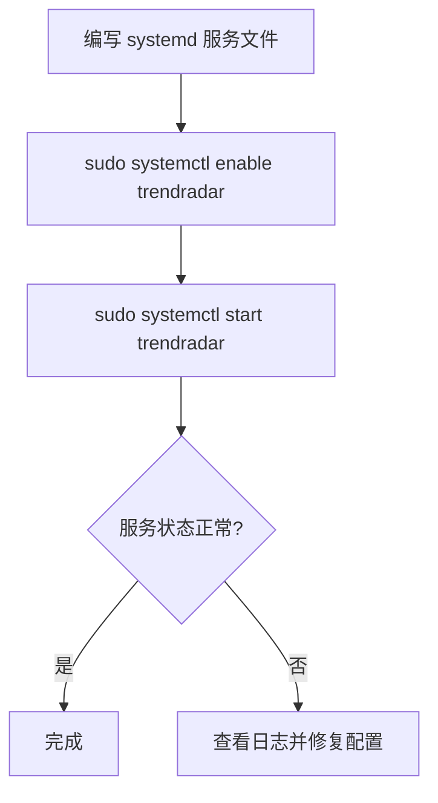
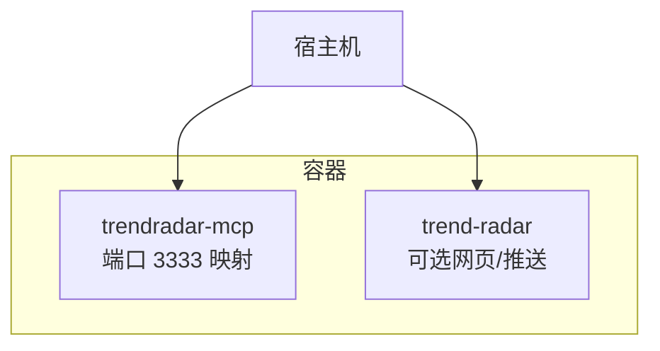
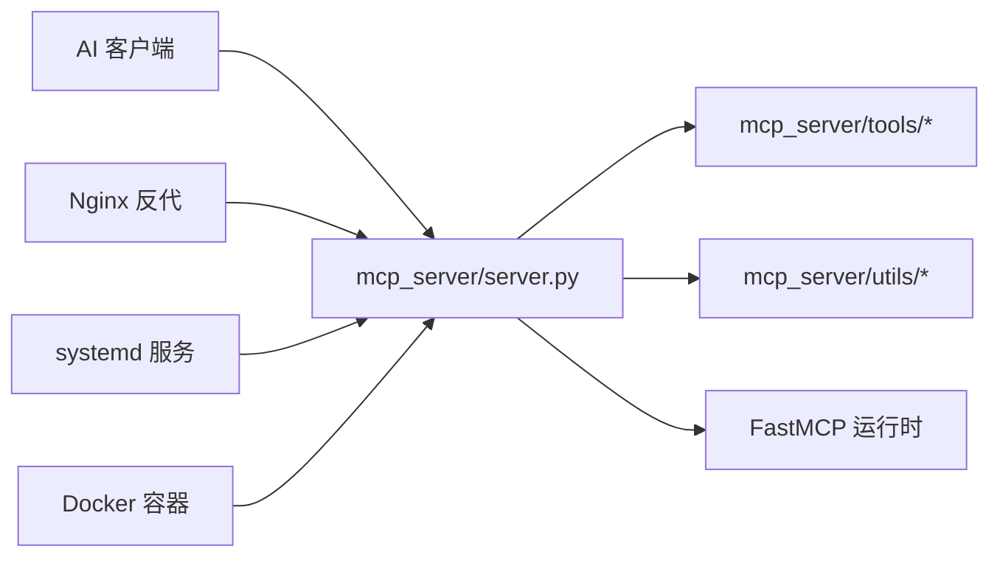

# MCP服务器部署

<cite>
**本文引用的文件**
- [docs/Deployment-Guide.md](file://docs/Deployment-Guide.md)
- [mcp_server/server.py](file://mcp_server/server.py)
- [start-http.sh](file://start-http.sh)
- [start-http.bat](file://start-http.bat)
- [README-Cherry-Studio.md](file://README-Cherry-Studio.md)
- [README-MCP-FAQ.md](file://README-MCP-FAQ.md)
- [docker/Dockerfile.mcp](file://docker/Dockerfile.mcp)
- [docker/docker-compose.yml](file://docker/docker-compose.yml)
- [config/config.yaml](file://config/config.yaml)
</cite>

## 目录
1. [简介](#简介)
2. [项目结构](#项目结构)
3. [核心组件](#核心组件)
4. [架构总览](#架构总览)
5. [详细组件分析](#详细组件分析)
6. [依赖关系分析](#依赖关系分析)
7. [性能考虑](#性能考虑)
8. [故障排查指南](#故障排查指南)
9. [结论](#结论)
10. [附录](#附录)

## 简介
本指南面向希望在本地或生产环境中稳定运行 TrendRadar MCP 服务器的用户，覆盖 STDIO 与 HTTP 两种传输模式的部署与客户端配置，并结合官方部署文档说明 Nginx 反向代理与 systemd 服务创建方法，确保 MCP 服务器在多客户端与远程访问场景下的可用性与稳定性。

## 项目结构
- MCP 服务器入口位于 mcp_server/server.py，提供 STDIO 与 HTTP 两种传输模式。
- 提供 start-http.sh/start-http.bat 便捷脚本用于 HTTP 模式启动。
- 文档 docs/Deployment-Guide.md 提供了 STDIO/HTTP 启动方式、Nginx 反代与 systemd 服务创建等生产级部署说明。
- README-Cherry-Studio.md 提供 Cherry Studio 客户端添加 MCP 服务器的步骤与 HTTP 模式配置要点。
- README-MCP-FAQ.md 提供 MCP 工具使用问答与日期解析工具的推荐用法。
- docker/Dockerfile.mcp 与 docker/docker-compose.yml 提供容器化部署与端口映射参考。
- config/config.yaml 提供平台与权重等系统配置，影响 MCP 工具行为。

**图示来源**
- [mcp_server/server.py](file://mcp_server/server.py#L660-L782)
- [docs/Deployment-Guide.md](file://docs/Deployment-Guide.md#L76-L163)
- [README-Cherry-Studio.md](file://README-Cherry-Studio.md#L133-L155)
- [docker/Dockerfile.mcp](file://docker/Dockerfile.mcp#L1-L24)
- [docker/docker-compose.yml](file://docker/docker-compose.yml#L60-L74)

**章节来源**
- [mcp_server/server.py](file://mcp_server/server.py#L660-L782)
- [docs/Deployment-Guide.md](file://docs/Deployment-Guide.md#L76-L163)
- [README-Cherry-Studio.md](file://README-Cherry-Studio.md#L133-L155)
- [docker/docker-compose.yml](file://docker/docker-compose.yml#L60-L74)

## 核心组件
- 传输模式选择
  - STDIO：通过标准输入输出与本地 AI 客户端通信，适合本地集成。
  - HTTP：通过 TCP 监听提供 HTTP 接口，适合远程访问与多客户端共享。
- 启动参数
  - --transport：选择 stdio 或 http。
  - --host/--port：HTTP 模式监听地址与端口。
  - --project-root：项目根目录路径（可选）。
- 工具注册
  - 服务器启动时注册一组分析工具，包括日期解析、基础查询、智能搜索、高级分析、情感分析、相似新闻、摘要生成、配置查询、系统状态、手动触发爬取等。

**章节来源**
- [mcp_server/server.py](file://mcp_server/server.py#L660-L782)

## 架构总览
下图展示 MCP 服务器在不同部署形态下的交互关系与数据流。

**图示来源**
- [mcp_server/server.py](file://mcp_server/server.py#L727-L740)
- [docs/Deployment-Guide.md](file://docs/Deployment-Guide.md#L121-L163)
- [docker/Dockerfile.mcp](file://docker/Dockerfile.mcp#L19-L24)

## 详细组件分析

### STDIO 模式部署
- 启动方式
  - 使用 uv 运行 MCP 服务器模块，不带 --transport 参数时默认走 STDIO。
- 适用场景
  - 本地 AI 客户端（如 Cherry Studio、Claude Desktop）直接通过标准输入输出连接。
- Cherry Studio 配置要点
  - 类型选择 STDIO；命令与参数指向 uv run python -m mcp_server.server，并确保项目目录正确。
- Claude Desktop 配置要点
  - 在配置文件中添加 mcpServers 条目，command 指向 uv，args 指向 uv run python -m mcp_server.server。

**图示来源**
- [docs/Deployment-Guide.md](file://docs/Deployment-Guide.md#L78-L120)
- [README-Cherry-Studio.md](file://README-Cherry-Studio.md#L81-L120)

**章节来源**
- [docs/Deployment-Guide.md](file://docs/Deployment-Guide.md#L78-L120)
- [README-Cherry-Studio.md](file://README-Cherry-Studio.md#L81-L120)

### HTTP 模式部署
- 启动方式
  - 基本启动：uv run python -m mcp_server.server --transport http --port 3333
  - 便捷脚本：start-http.sh（Linux/macOS）、start-http.bat（Windows）
- 端点路径
  - HTTP 模式默认挂载路径为 /mcp。
- 客户端配置
  - Cherry Studio（HTTP 模式）：类型选择 streamableHttp，URL 指向 http://localhost:3333/mcp。
  - Claude Desktop：可在其配置中添加对应 HTTP 服务器条目（参考部署文档中的 JSON 配置示例）。

**图示来源**
- [mcp_server/server.py](file://mcp_server/server.py#L727-L740)
- [docs/Deployment-Guide.md](file://docs/Deployment-Guide.md#L121-L163)
- [README-Cherry-Studio.md](file://README-Cherry-Studio.md#L133-L155)

**章节来源**
- [mcp_server/server.py](file://mcp_server/server.py#L727-L740)
- [docs/Deployment-Guide.md](file://docs/Deployment-Guide.md#L121-L163)
- [README-Cherry-Studio.md](file://README-Cherry-Studio.md#L133-L155)

### Nginx 反向代理配置
- 目标
  - 将外部域名流量转发到本地 3333 端口的 MCP 服务器。
- 关键点
  - 监听 80 端口，location /mcp 指向 http://localhost:3333。
  - 代理头设置（Host、X-Real-IP、X-Forwarded-For、X-Forwarded-Proto 等）。
  - WebSocket 升级头（Connection、Upgrade）透传。
- 启用步骤
  - 创建站点配置文件并启用，校验配置后重载 Nginx。

**图示来源**
- [docs/Deployment-Guide.md](file://docs/Deployment-Guide.md#L135-L163)

**章节来源**
- [docs/Deployment-Guide.md](file://docs/Deployment-Guide.md#L135-L163)

### systemd 服务创建（VPS/云服务器）
- 目标
  - 以 systemd 管理 MCP 服务器进程，实现开机自启、自动重启与日志管理。
- 关键点
  - ExecStart 指向 uv run python -m mcp_server.server --transport http --host 0.0.0.0 --port 3333。
  - Restart=always 与 RestartSec=5 保证异常退出后自动恢复。
  - WorkingDirectory 指向项目目录，确保相对路径与配置文件加载正确。
- 启用步骤
  - 创建 .service 文件，启用并启动服务。

**图示来源**
- [docs/Deployment-Guide.md](file://docs/Deployment-Guide.md#L283-L305)

**章节来源**
- [docs/Deployment-Guide.md](file://docs/Deployment-Guide.md#L283-L305)

### Docker 部署（可选）
- 单容器运行
  - 暴露 3333 端口，挂载 config 与 output 目录，容器内 CMD 直接启动 HTTP 模式。
- 双容器架构
  - trend-radar-mcp：独立运行 MCP 服务，端口 3333 映射到宿主机。
  - trend-radar：主服务，可单独运行网页报告或推送功能。
- 健康检查
  - docker-compose 中提供 HTTP 健康检查端点，便于编排与监控。

**图示来源**
- [docker/Dockerfile.mcp](file://docker/Dockerfile.mcp#L19-L24)
- [docker/docker-compose.yml](file://docker/docker-compose.yml#L60-L74)

**章节来源**
- [docker/Dockerfile.mcp](file://docker/Dockerfile.mcp#L1-L24)
- [docker/docker-compose.yml](file://docker/docker-compose.yml#L60-L74)

### 客户端配置示例

- Cherry Studio（STDIO）
  - 类型：STDIO
  - 命令：uv
  - 参数：--directory /path/to/TrendRadar run python -m mcp_server.server
  - 说明：确保项目目录与 uv 环境正确，以便客户端能定位到 MCP 服务器。

- Cherry Studio（HTTP）
  - 类型：streamableHttp
  - URL：http://localhost:3333/mcp
  - 说明：HTTP 模式下客户端通过 /mcp 路径与服务器交互。

- Claude Desktop（STDIO）
  - 在配置文件中添加 mcpServers 条目，command 指向 uv，args 指向 uv run python -m mcp_server.server。

- Claude Desktop（HTTP）
  - 在配置文件中添加 mcpServers 条目，指向 http://localhost:3333/mcp。

**章节来源**
- [docs/Deployment-Guide.md](file://docs/Deployment-Guide.md#L87-L120)
- [README-Cherry-Studio.md](file://README-Cherry-Studio.md#L133-L155)

## 依赖关系分析
- 组件耦合
  - mcp_server/server.py 作为入口，负责解析参数、初始化工具实例并在指定传输模式下启动服务。
  - 工具模块位于 mcp_server/tools 与 mcp_server/utils，由入口统一注册。
- 外部依赖
  - uv 包管理器与 Python 运行时。
  - Nginx（生产环境可选）。
  - systemd（VPS/云服务器可选）。
  - Docker（容器化部署可选）。

**图示来源**
- [mcp_server/server.py](file://mcp_server/server.py#L1-L40)
- [docs/Deployment-Guide.md](file://docs/Deployment-Guide.md#L121-L163)

**章节来源**
- [mcp_server/server.py](file://mcp_server/server.py#L1-L40)
- [docs/Deployment-Guide.md](file://docs/Deployment-Guide.md#L121-L163)

## 性能考虑
- 端口与路径
  - HTTP 模式默认监听 0.0.0.0:3333，路径为 /mcp，便于反代与多客户端接入。
- 进程管理
  - systemd 的自动重启策略可降低服务中断风险。
- 容器化
  - Dockerfile.mcp 暴露 3333 端口并以 HTTP 模式启动，便于与反代与编排工具配合。
- 配置与数据
  - config/config.yaml 中的平台与权重配置会影响工具执行效率与结果质量，建议按需调整。

**章节来源**
- [mcp_server/server.py](file://mcp_server/server.py#L727-L740)
- [docker/Dockerfile.mcp](file://docker/Dockerfile.mcp#L19-L24)
- [config/config.yaml](file://config/config.yaml#L110-L140)

## 故障排查指南
- UV 安装失败
  - 症状：uv: command not found
  - 解决：将 uv 添加到 PATH 或使用 pip 安装 uv。
- MCP 连接失败
  - 症状：客户端无法连接到 MCP 服务器
  - 解决：检查服务状态、端口占用与系统日志。
- 爬虫数据为空
  - 症状：output 目录没有数据文件
  - 解决：检查 config/config.yaml 配置、手动运行爬虫、检查网络连通性。
- 内存不足
  - 症状：系统内存使用过高
  - 解决：限制进程内存、优化 Python 内存使用策略。

**章节来源**
- [docs/Deployment-Guide.md](file://docs/Deployment-Guide.md#L431-L493)

## 结论
通过 STDIO 与 HTTP 两种传输模式，TrendRadar MCP 服务器既可满足本地 AI 客户端的快速集成，也可在生产环境中借助 Nginx 反代与 systemd 服务实现稳定的远程访问与多客户端共享。结合 Docker 部署与健康检查，可进一步提升系统的可维护性与可靠性。

## 附录
- 常用命令与脚本
  - STDIO 启动：uv run python -m mcp_server.server
  - HTTP 启动：uv run python -m mcp_server.server --transport http --port 3333
  - 便捷脚本：./start-http.sh 或 start-http.bat
- 客户端配置要点
  - Cherry Studio（STDIO）：类型选择 STDIO，命令与参数指向 uv run python -m mcp_server.server。
  - Cherry Studio（HTTP）：类型选择 streamableHttp，URL 指向 http://localhost:3333/mcp。
  - Claude Desktop：在配置中添加 mcpServers 条目，指向对应服务器。