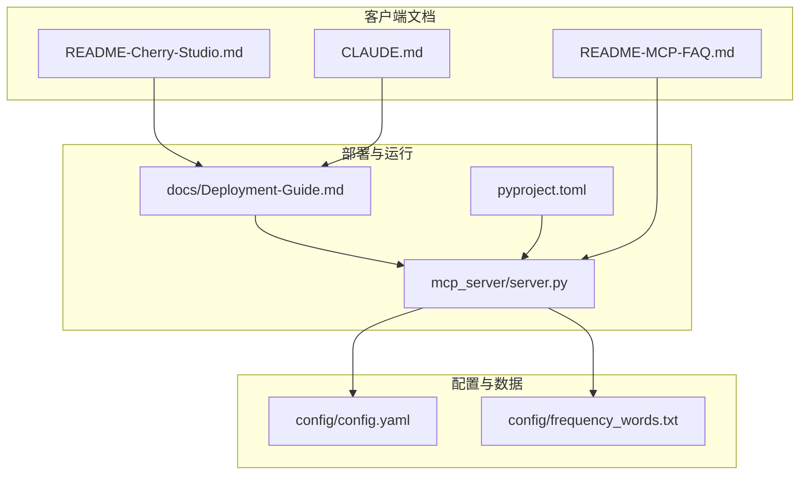
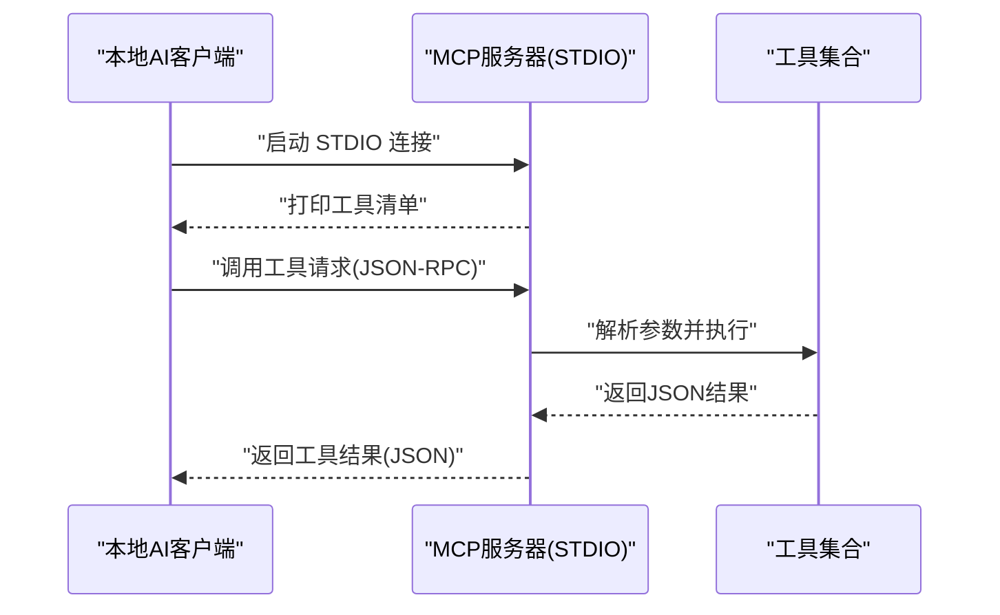
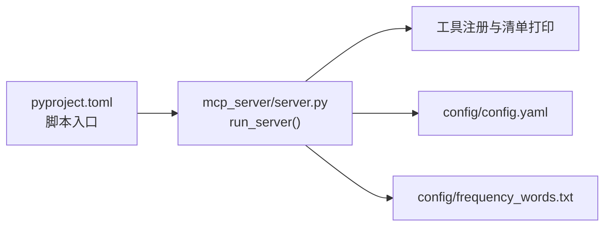

# STDIO模式部署

<cite>
**本文引用的文件**
- [docs/Deployment-Guide.md](file://docs/Deployment-Guide.md)
- [mcp_server/server.py](file://mcp_server/server.py)
- [pyproject.toml](file://pyproject.toml)
- [config/config.yaml](file://config/config.yaml)
- [config/frequency_words.txt](file://config/frequency_words.txt)
- [README-Cherry-Studio.md](file://README-Cherry-Studio.md)
- [README-MCP-FAQ.md](file://README-MCP-FAQ.md)
- [CLAUDE.md](file://CLAUDE.md)
</cite>

## 目录
1. [简介](#简介)
2. [项目结构](#项目结构)
3. [核心组件](#核心组件)
4. [架构概览](#架构概览)
5. [详细组件分析](#详细组件分析)
6. [依赖关系分析](#依赖关系分析)
7. [性能考虑](#性能考虑)
8. [故障排查指南](#故障排查指南)
9. [结论](#结论)
10. [附录](#附录)

## 简介
本指南聚焦于通过 STDIO 模式部署 TrendRadar 的 MCP 服务器，目标是帮助你在本地 AI 客户端（如 Cherry Studio、Claude Desktop 等）中无缝集成并使用 MCP 工具能力。你将学会：
- 使用 uv 运行器启动本地 MCP 服务器的标准命令
- 在 Cherry Studio 中图形化添加 STDIO 服务器
- 在 Claude Desktop 中通过 JSON 配置文件连接
- 配置环境变量、依赖同步与权限要求
- 常见启动错误的定位与修复方法

## 项目结构
围绕 MCP 服务器的核心文件与部署相关文档如下：
- docs/Deployment-Guide.md：官方部署指南，包含 STDIO 模式启动命令、客户端配置示例与故障排查
- mcp_server/server.py：MCP 服务器入口与工具注册、传输模式选择（stdio/http）
- pyproject.toml：项目元信息与脚本入口映射（包含可执行入口）
- config/config.yaml：系统配置（平台、权重、推送等）
- config/frequency_words.txt：个人关注词列表，用于“趋势话题”工具
- README-Cherry-Studio.md：Cherry Studio 的图形化配置步骤
- README-MCP-FAQ.md：MCP 工具使用问答与默认行为说明
- CLAUDE.md：项目架构与部署要点（含 Docker 与 UV 手动部署）

**图表来源**
- [docs/Deployment-Guide.md](file://docs/Deployment-Guide.md#L76-L120)
- [mcp_server/server.py](file://mcp_server/server.py#L660-L782)
- [pyproject.toml](file://pyproject.toml#L1-L26)
- [config/config.yaml](file://config/config.yaml#L1-L140)
- [config/frequency_words.txt](file://config/frequency_words.txt#L1-L114)
- [README-Cherry-Studio.md](file://README-Cherry-Studio.md#L80-L155)
- [README-MCP-FAQ.md](file://README-MCP-FAQ.md#L1-L120)
- [CLAUDE.md](file://CLAUDE.md#L150-L246)

**章节来源**
- [docs/Deployment-Guide.md](file://docs/Deployment-Guide.md#L76-L120)
- [mcp_server/server.py](file://mcp_server/server.py#L660-L782)
- [pyproject.toml](file://pyproject.toml#L1-L26)
- [config/config.yaml](file://config/config.yaml#L1-L140)
- [config/frequency_words.txt](file://config/frequency_words.txt#L1-L114)
- [README-Cherry-Studio.md](file://README-Cherry-Studio.md#L80-L155)
- [README-MCP-FAQ.md](file://README-MCP-FAQ.md#L1-L120)
- [CLAUDE.md](file://CLAUDE.md#L150-L246)

## 核心组件
- MCP 服务器入口与传输模式
  - 服务器支持 STDIO 与 HTTP 两种传输模式；STDIO 模式通过标准输入输出与客户端通信，适合本地集成
  - 启动函数负责打印启动信息、注册工具清单，并根据 transport 参数选择运行模式
- 工具注册与功能
  - 已注册工具涵盖：日期解析、基础数据查询、智能检索、高级分析、配置与系统管理等
- 可执行入口
  - 通过 pyproject.toml 的脚本映射，提供统一入口以 uv 运行器启动

**章节来源**
- [mcp_server/server.py](file://mcp_server/server.py#L660-L782)
- [pyproject.toml](file://pyproject.toml#L1-L26)

## 架构概览
STDIO 模式下的典型交互流程：
- 客户端通过 STDIO 与 MCP 服务器建立连接
- 服务器在启动时打印工具清单，便于客户端识别可用工具
- 客户端发起工具调用请求，服务器解析并执行相应工具逻辑，返回 JSON 结果

**图表来源**
- [mcp_server/server.py](file://mcp_server/server.py#L660-L782)

**章节来源**
- [mcp_server/server.py](file://mcp_server/server.py#L660-L782)

## 详细组件分析

### 启动命令与传输模式
- STDIO 模式启动命令
  - 使用 uv 运行器直接启动 MCP 服务器模块，无需额外参数即可进入 STDIO 模式
- 传输模式选择
  - run_server 函数根据 transport 参数选择 STDIO 或 HTTP 模式
  - STDIO 模式适合本地客户端集成；HTTP 模式适合远程访问与多客户端共享

**章节来源**
- [docs/Deployment-Guide.md](file://docs/Deployment-Guide.md#L78-L120)
- [mcp_server/server.py](file://mcp_server/server.py#L660-L782)

### Cherry Studio 图形化配置（STDIO）
- 添加 MCP 服务器步骤
  - 在设置中找到 MCP Servers，点击“添加”
  - 填写名称、描述、类型（STDIO）、命令（uv）以及参数（包含 --directory 指向项目根目录与模块入口）
- 验证与使用
  - 保存并启用后，可在对话中调用工具，如“获取最新新闻”、“搜索新闻”等

**章节来源**
- [docs/Deployment-Guide.md](file://docs/Deployment-Guide.md#L88-L120)
- [README-Cherry-Studio.md](file://README-Cherry-Studio.md#L80-L155)

### Claude Desktop JSON 配置（STDIO）
- 配置文件位置
  - 在用户主目录下的配置文件中添加 mcpServers 节点
- 关键字段
  - command：uv
  - args：包含 --directory 指向项目根目录与模块入口
- 注意事项
  - 确保路径正确且 uv 可执行文件在 PATH 中

**章节来源**
- [docs/Deployment-Guide.md](file://docs/Deployment-Guide.md#L105-L119)

### 环境变量、依赖同步与权限
- Python 版本要求
  - 项目要求 Python >= 3.10
- UV 包管理器
  - 需要安装并配置 uv，以便使用 uv sync 创建虚拟环境与 uv run 执行命令
- 依赖同步
  - 使用 uv sync 安装项目依赖
- 权限配置
  - 确保项目目录与输出目录具备读写权限
  - 若使用 HTTP 模式，确保端口未被占用且防火墙允许访问

**章节来源**
- [docs/Deployment-Guide.md](file://docs/Deployment-Guide.md#L48-L75)
- [docs/Deployment-Guide.md](file://docs/Deployment-Guide.md#L260-L305)
- [pyproject.toml](file://pyproject.toml#L1-L16)

### 工具清单与默认行为
- 工具清单
  - 服务器启动时会打印已注册工具列表，便于客户端识别
- 默认行为与提示
  - FAQ 中说明了默认返回条数、时间范围、URL 链接等默认策略，以及如何调整展示行为
- 日期解析工具
  - 推荐优先使用日期解析工具，确保不同客户端获得一致的日期范围

**章节来源**
- [mcp_server/server.py](file://mcp_server/server.py#L660-L782)
- [README-MCP-FAQ.md](file://README-MCP-FAQ.md#L1-L120)

### 配置文件与数据源
- config/config.yaml
  - 包含平台列表、权重配置、推送配置等
- config/frequency_words.txt
  - 个人关注词列表，用于“趋势话题”工具
- 输出数据
  - 服务器运行依赖项目中的输出数据（如 output 目录），确保客户端能读取真实数据

**章节来源**
- [config/config.yaml](file://config/config.yaml#L1-L140)
- [config/frequency_words.txt](file://config/frequency_words.txt#L1-L114)
- [README-Cherry-Studio.md](file://README-Cherry-Studio.md#L20-L40)

## 依赖关系分析
- 服务器入口与工具注册
  - server.py 通过 FastMCP 框架注册工具，并在 run_server 中根据 transport 选择运行模式
- 可执行入口映射
  - pyproject.toml 将 trendradar 命令映射到 server.run_server，便于 uv run 直接启动
- 配置与数据依赖
  - 工具执行依赖 config.yaml 与 frequency_words.txt 等配置文件

**图表来源**
- [pyproject.toml](file://pyproject.toml#L1-L26)
- [mcp_server/server.py](file://mcp_server/server.py#L660-L782)
- [config/config.yaml](file://config/config.yaml#L1-L140)
- [config/frequency_words.txt](file://config/frequency_words.txt#L1-L114)

**章节来源**
- [pyproject.toml](file://pyproject.toml#L1-L26)
- [mcp_server/server.py](file://mcp_server/server.py#L660-L782)
- [config/config.yaml](file://config/config.yaml#L1-L140)
- [config/frequency_words.txt](file://config/frequency_words.txt#L1-L114)

## 性能考虑
- STDIO 模式适合本地集成，延迟低、资源占用小
- 若需远程访问或多客户端共享，可切换 HTTP 模式并配置反向代理
- 建议在生产环境中使用 uv 管理器与虚拟环境，避免系统 Python 版本冲突

[本节为通用建议，不直接分析具体文件]

## 故障排查指南
- UV 命令未找到
  - 现象：提示 uv: command not found
  - 解决：将 uv 安装到系统 PATH，或使用 pip 安装 uv
- Python 版本不兼容
  - 现象：启动时报错或依赖安装失败
  - 解决：确保 Python 版本满足项目要求（>= 3.10）
- 端口占用或权限不足（HTTP 模式）
  - 现象：HTTP 模式启动失败或无法访问
  - 解决：检查端口占用情况并释放端口，或以管理员权限运行
- 客户端无法连接
  - 现象：客户端无法发现或连接 MCP 服务器
  - 解决：确认 STDIO 命令与参数正确、项目目录路径正确、uv 可执行文件在 PATH 中

**章节来源**
- [docs/Deployment-Guide.md](file://docs/Deployment-Guide.md#L431-L506)
- [docs/Deployment-Guide.md](file://docs/Deployment-Guide.md#L433-L461)

## 结论
通过 STDIO 模式部署 TrendRadar 的 MCP 服务器，能够以较低成本将本地数据与 AI 客户端集成。配合 Cherry Studio 的图形化配置与 Claude Desktop 的 JSON 配置，你可以快速完成本地 AI 客户端的 MCP 服务器接入。建议在部署前完成 UV 安装、依赖同步与权限配置，并在出现问题时依据部署指南进行排查。

[本节为总结性内容，不直接分析具体文件]

## 附录

### 客户端配置示例（文字说明）
- Cherry Studio（STDIO）
  - 在设置中添加 MCP 服务器，类型选择 STDIO，命令为 uv，参数包含 --directory 指向项目根目录与模块入口
- Claude Desktop（STDIO）
  - 在配置文件中添加 mcpServers 节点，command 为 uv，args 包含 --directory 与模块入口

**章节来源**
- [docs/Deployment-Guide.md](file://docs/Deployment-Guide.md#L88-L119)
- [README-Cherry-Studio.md](file://README-Cherry-Studio.md#L80-L155)