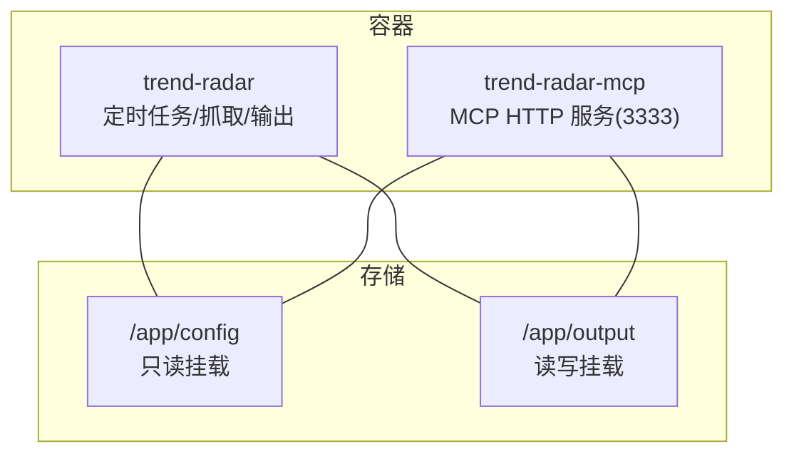
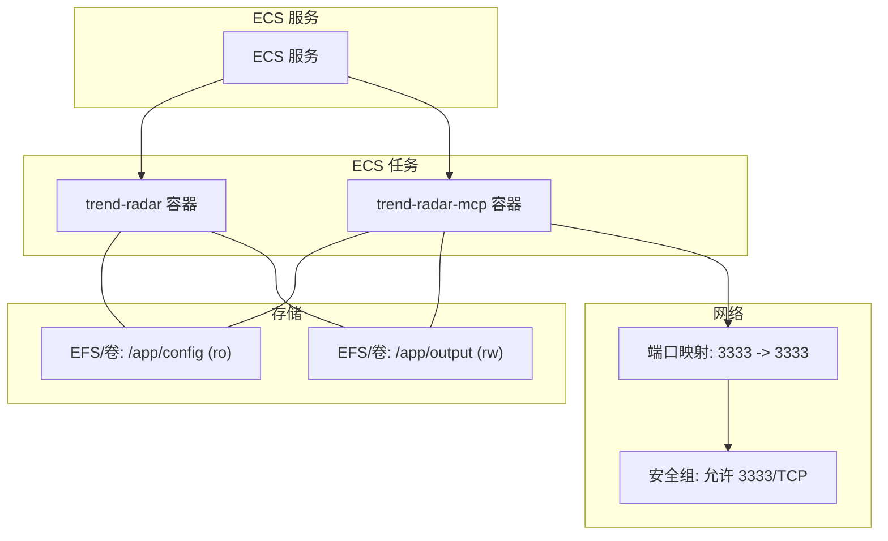
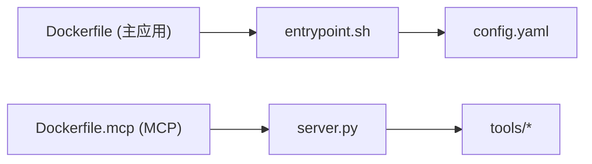

# AWS ECS 部署

<cite>
**本文引用的文件**
- [Deployment-Guide.md](file://docs/Deployment-Guide.md)
- [docker-compose-build.yml](file://docker/docker-compose-build.yml)
- [Dockerfile](file://docker/Dockerfile)
- [Dockerfile.mcp](file://docker/Dockerfile.mcp)
- [entrypoint.sh](file://docker/entrypoint.sh)
- [manage.py](file://docker/manage.py)
- [config.yaml](file://config/config.yaml)
- [server.py](file://mcp_server/server.py)
- [start-http.sh](file://start-http.sh)
</cite>

## 目录
1. [简介](#简介)
2. [项目结构](#项目结构)
3. [核心组件](#核心组件)
4. [架构总览](#架构总览)
5. [详细组件分析](#详细组件分析)
6. [依赖关系分析](#依赖关系分析)
7. [性能考虑](#性能考虑)
8. [故障排查指南](#故障排查指南)
9. [结论](#结论)
10. [附录](#附录)

## 简介
本指南面向希望将 TrendRadar 应用部署到 AWS ECS 的用户，围绕以下目标展开：创建 ECR 仓库、使用 docker-compose 构建镜像、通过 AWS CLI 登录并推送镜像、在 ECS 中创建任务定义与服务、配置自动扩缩容与健康检查，并结合 Deployment-Guide.md 中“Docker Cloud 部署”章节，给出云环境的日志驱动、安全组与 IAM 角色最佳实践建议。文中所有技术细节均来源于仓库现有文件，确保可落地实施。

## 项目结构
TrendRadar 采用多容器协作模式：
- trend-radar：主应用容器，负责定时抓取、处理与输出；通过 entrypoint.sh 管理运行模式（一次性/定时）与 Web 服务器托管。
- trend-radar-mcp：MCP HTTP 服务容器，监听 3333 端口，供外部客户端访问。

图表来源
- [docker-compose-build.yml](file://docker/docker-compose-build.yml#L1-L78)
- [Dockerfile](file://docker/Dockerfile#L1-L71)
- [Dockerfile.mcp](file://docker/Dockerfile.mcp#L1-L24)

章节来源
- [docker-compose-build.yml](file://docker/docker-compose-build.yml#L1-L78)

## 核心组件
- 容器镜像构建
  - 主应用镜像：基于 Python 3.10 slim，安装 supercronic，复制依赖与入口脚本，暴露 Web 服务器端口（可选）。
  - MCP 服务镜像：基于 Python 3.10 slim，复制 MCP 服务代码，暴露 3333 端口，以 HTTP 模式启动。
- 入口脚本与运行模式
  - entrypoint.sh 支持 RUN_MODE=once 或 cron，cron 模式下由 supercronic 作为 PID 1 调度；可选启动 Web 服务器。
- 配置与挂载
  - config 与 output 目录分别挂载为只读与读写，便于持久化与静态文件托管。
- 环境变量
  - 支持 TZ、CRON_SCHEDULE、RUN_MODE、IMMEDIATE_RUN、Webhook 与通知渠道等大量环境变量，用于控制运行行为与通知策略。

章节来源
- [Dockerfile](file://docker/Dockerfile#L1-L71)
- [Dockerfile.mcp](file://docker/Dockerfile.mcp#L1-L24)
- [entrypoint.sh](file://docker/entrypoint.sh#L1-L50)
- [docker-compose-build.yml](file://docker/docker-compose-build.yml#L1-L78)
- [config.yaml](file://config/config.yaml#L1-L140)

## 架构总览
下图展示了 ECS 中的典型部署拓扑：两个容器通过 ECS 任务定义运行，MCP 容器对外提供 3333 端口访问，主容器负责定时抓取与输出；两者共享 config 与 output 卷。

图表来源
- [docker-compose-build.yml](file://docker/docker-compose-build.yml#L1-L78)
- [Dockerfile.mcp](file://docker/Dockerfile.mcp#L1-L24)
- [Deployment-Guide.md](file://docs/Deployment-Guide.md#L307-L333)

## 详细组件分析

### 1) 创建 ECR 仓库与镜像推送流程
- 创建 ECR 仓库
  - 在 AWS 控制台或通过 AWS CLI 创建仓库，选择合适的区域与命名空间。
- 构建镜像
  - 使用 docker-compose 构建主应用与 MCP 服务镜像，参考 docker-compose-build.yml 中的两套服务定义。
- 登录并推送镜像
  - 使用 AWS CLI 获取 ECR 登录密码并通过 docker login 登录，随后打标签并推送至对应仓库。
- 参考命令流
  - 登录：aws ecr get-login-password --region <region> | docker login --username AWS --password-stdin <account>.dkr.ecr.<region>.amazonaws.com
  - 标签：docker tag <本地镜像>:latest <account>.dkr.ecr.<region>.amazonaws.com/<仓库名>:latest
  - 推送：docker push <account>.dkr.ecr.<region>.amazonaws.com/<仓库名>:latest

章节来源
- [Deployment-Guide.md](file://docs/Deployment-Guide.md#L307-L333)
- [docker-compose-build.yml](file://docker/docker-compose-build.yml#L1-L78)

### 2) ECS 任务定义关键配置
- CPU/内存分配
  - 建议为 trend-radar-mcp（MCP 服务）分配适中的 CPU/内存，保证 HTTP 服务响应能力；主容器根据定时任务负载适当提升内存。
- 容器端口映射
  - trend-radar-mcp 暴露 3333 端口，需在任务定义中映射到 ECS 服务的负载均衡器或直接暴露。
- 环境变量注入
  - TZ：统一时区，避免定时任务与时差问题。
  - 通知渠道：FEISHU_WEBHOOK_URL、TELEGRAM_BOT_TOKEN、TELEGRAM_CHAT_ID、DINGTALK_WEBHOOK_URL、WEWORK_WEBHOOK_URL、WEWORK_MSG_TYPE、EMAIL_*、NTFY_*、BARK_URL、SLACK_WEBHOOK_URL 等。
  - 运行模式：CRON_SCHEDULE、RUN_MODE、IMMEDIATE_RUN。
  - Web 服务器：ENABLE_WEBSERVER、WEBSERVER_PORT。
- 存储卷挂载
  - /app/config:ro（只读）与 /app/output:r（读写）挂载至持久化存储（如 EFS 或 ECS 卷），确保配置与输出数据持久化。

章节来源
- [docker-compose-build.yml](file://docker/docker-compose-build.yml#L1-L78)
- [config.yaml](file://config/config.yaml#L1-L140)
- [Dockerfile.mcp](file://docker/Dockerfile.mcp#L1-L24)

### 3) ECS 服务与自动扩缩容
- 服务创建
  - 在 ECS 服务中绑定负载均衡器（若需要对外暴露 MCP 服务），设置 desiredCount 初始副本数。
- 自动扩缩容策略
  - 基于 CPU 使用率或自定义指标（如 3333 端口请求延迟）设置扩展策略，确保 MCP 服务在高并发时可弹性扩容。
- 健康检查
  - 使用 HTTP 健康检查端点 /health（参考 Deployment-Guide.md 中的健康检查示例），周期性探测 MCP 服务可用性，失败次数达到阈值后触发重启或替换实例。

章节来源
- [Deployment-Guide.md](file://docs/Deployment-Guide.md#L395-L429)
- [server.py](file://mcp_server/server.py#L1-L200)

### 4) MCP 服务启动与端口说明
- MCP 服务默认监听 3333 端口，可通过 HTTP 模式对外提供工具调用能力。
- 若需要本地调试，可参考 start-http.sh 中的启动方式（HTTP 模式、绑定 0.0.0.0、端口 3333）。

章节来源
- [Dockerfile.mcp](file://docker/Dockerfile.mcp#L1-L24)
- [start-http.sh](file://start-http.sh#L1-L22)

### 5) 定时任务与运行模式
- RUN_MODE 支持 once 与 cron，cron 模式下由 supercronic 作为 PID 1 调度，CRON_SCHEDULE 控制定时频率。
- IMMEDIATE_RUN 可在容器启动后立即执行一次任务，便于首次部署验证。

章节来源
- [entrypoint.sh](file://docker/entrypoint.sh#L1-L50)
- [docker-compose-build.yml](file://docker/docker-compose-build.yml#L1-L78)

### 6) 配置与通知渠道
- config.yaml 提供丰富的配置项，包括抓取、报告模式、通知渠道、推送时间窗口等。
- 在 ECS 任务定义中通过环境变量注入上述配置，实现云环境下的灵活配置管理。

章节来源
- [config.yaml](file://config/config.yaml#L1-L140)
- [docker-compose-build.yml](file://docker/docker-compose-build.yml#L1-L78)

## 依赖关系分析
- 容器间依赖
  - trend-radar 与 trend-radar-mcp 通过共享卷（/app/config、/app/output）协同工作，前者负责抓取与输出，后者提供 MCP HTTP 服务。
- 外部依赖
  - MCP 服务依赖 FastMCP 2.0，工具模块位于 mcp_server/tools 下，提供数据查询、分析、搜索、配置管理与系统管理等工具集。

图表来源
- [Dockerfile](file://docker/Dockerfile#L1-L71)
- [Dockerfile.mcp](file://docker/Dockerfile.mcp#L1-L24)
- [entrypoint.sh](file://docker/entrypoint.sh#L1-L50)
- [config.yaml](file://config/config.yaml#L1-L140)
- [server.py](file://mcp_server/server.py#L1-L200)

章节来源
- [Dockerfile](file://docker/Dockerfile#L1-L71)
- [Dockerfile.mcp](file://docker/Dockerfile.mcp#L1-L24)
- [entrypoint.sh](file://docker/entrypoint.sh#L1-L50)
- [server.py](file://mcp_server/server.py#L1-L200)

## 性能考虑
- 定时任务频率与资源配比
  - CRON_SCHEDULE 过于频繁会增加 CPU/内存压力，建议结合业务需求设置合理的调度间隔。
- Web 服务器托管
  - 若启用 ENABLE_WEBSERVER，注意输出目录托管的静态文件规模，避免过多小文件导致 I/O 压力。
- 端口与网络
  - MCP 服务仅暴露 3333 端口，建议通过安全组限制访问源，降低攻击面。

[本节为通用指导，无需列出具体文件来源]

## 故障排查指南
- 健康检查失败
  - 使用 /health 端点进行探测，确认 MCP 服务可用；若失败，检查容器日志与端口映射。
- 定时任务不执行
  - 检查 CRON_SCHEDULE 格式与 RUN_MODE；确认 supercronic 作为 PID 1 正常运行。
- 配置缺失
  - 确保 /app/config/config.yaml 与 /app/config/frequency_words.txt 存在且可读。
- 日志查看
  - 在 ECS 中查看容器日志，定位异常堆栈与错误信息。

章节来源
- [Deployment-Guide.md](file://docs/Deployment-Guide.md#L395-L429)
- [entrypoint.sh](file://docker/entrypoint.sh#L1-L50)
- [manage.py](file://docker/manage.py#L1-L625)

## 结论
通过 ECR 与 ECS 的组合，TrendRadar 可以在云端稳定运行。主容器负责定时抓取与输出，MCP 容器提供 HTTP 工具服务；通过合理配置 CPU/内存、端口映射、环境变量与存储卷，配合健康检查与自动扩缩容，可满足生产级可用性与可维护性要求。同时，结合 Deployment-Guide.md 中关于日志驱动、安全组与 IAM 角色的最佳实践，可进一步提升安全性与可观测性。

[本节为总结性内容，无需列出具体文件来源]

## 附录

### A. ECS 任务定义与服务配置清单
- 任务定义
  - 容器名称与镜像来源（ECR）
  - CPU/内存配额
  - 端口映射：3333
  - 环境变量：TZ、CRON_SCHEDULE、RUN_MODE、IMMEDIATE_RUN、通知渠道、Web 服务器开关与端口
  - 卷挂载：/app/config:ro、/app/output:r
- 服务
  - desiredCount、负载均衡器（可选）
  - 自动扩缩容策略（CPU 使用率/自定义指标）
  - 健康检查：/health

章节来源
- [docker-compose-build.yml](file://docker/docker-compose-build.yml#L1-L78)
- [Dockerfile.mcp](file://docker/Dockerfile.mcp#L1-L24)
- [Deployment-Guide.md](file://docs/Deployment-Guide.md#L395-L429)

### B. 云环境最佳实践（摘自 Deployment-Guide.md）
- 日志驱动
  - 在云环境中建议使用 CloudWatch Logs 等集中式日志收集，便于跨容器与服务聚合分析。
- 安全组
  - 仅开放 3333 端口给受信任的来源，避免公网暴露。
- IAM 角色
  - ECS 任务执行角色授予访问 ECR、EFS 或 ECS 卷的最小权限，避免过度授权。

章节来源
- [Deployment-Guide.md](file://docs/Deployment-Guide.md#L307-L333)