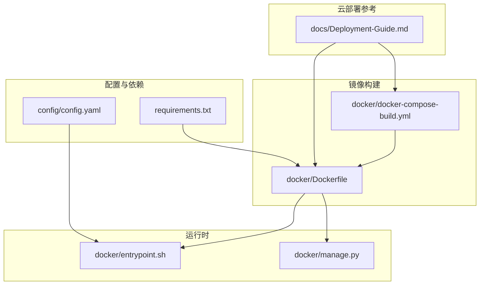
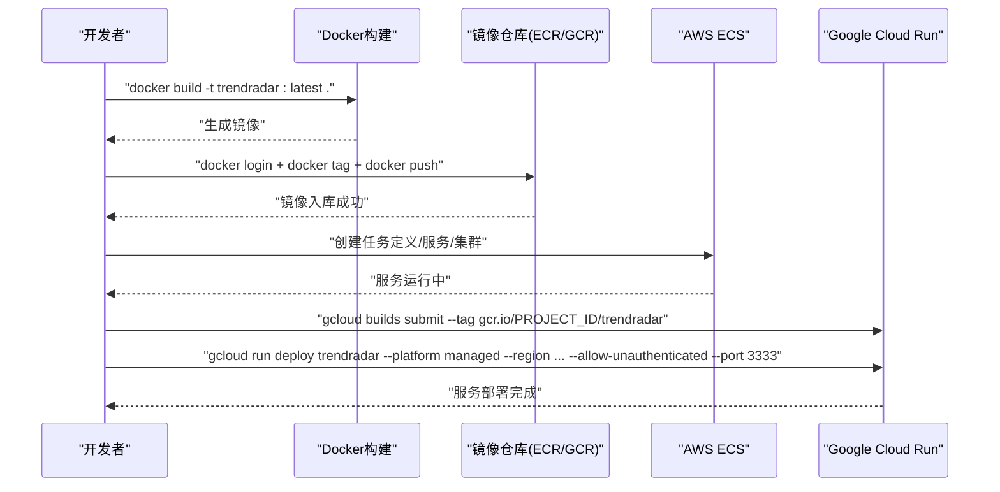
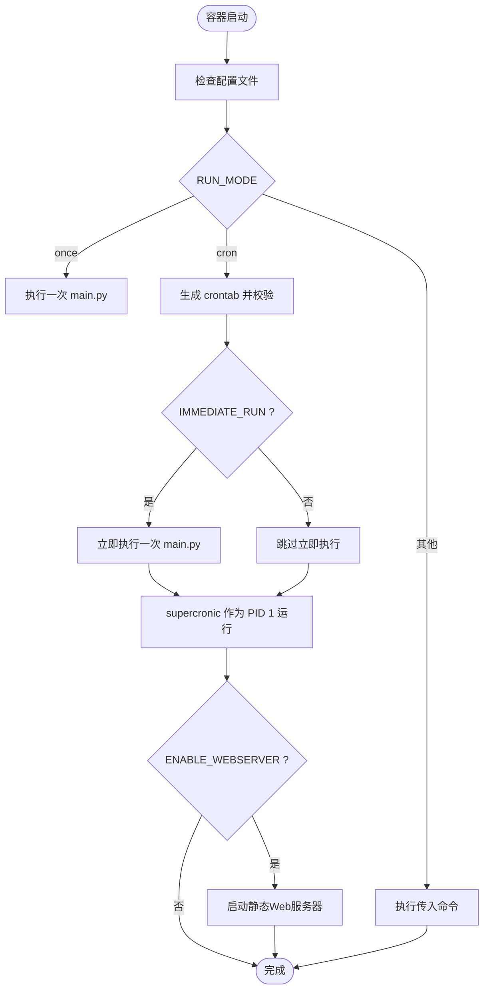
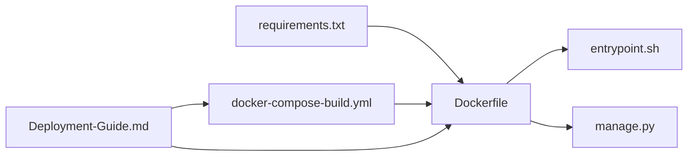

# Docker云平台部署

<cite>
**本文引用的文件**
- [Dockerfile](file://docker/Dockerfile)
- [docker-compose-build.yml](file://docker/docker-compose-build.yml)
- [docker-compose.yml](file://docker/docker-compose.yml)
- [entrypoint.sh](file://docker/entrypoint.sh)
- [manage.py](file://docker/manage.py)
- [Deployment-Guide.md](file://docs/Deployment-Guide.md)
- [config.yaml](file://config/config.yaml)
- [requirements.txt](file://requirements.txt)
</cite>

## 目录
1. [简介](#简介)
2. [项目结构](#项目结构)
3. [核心组件](#核心组件)
4. [架构总览](#架构总览)
5. [详细组件分析](#详细组件分析)
6. [依赖关系分析](#依赖关系分析)
7. [性能与资源建议](#性能与资源建议)
8. [故障排查指南](#故障排查指南)
9. [结论](#结论)
10. [附录](#附录)

## 简介
本指南面向在云平台上进行容器化部署的用户，聚焦于AWS ECS与Google Cloud Run两大容器化云服务。内容涵盖：
- 基于Dockerfile与docker-compose构建镜像与运行容器
- 推送镜像至ECR与GCR的命令流程（含AWS CLI登录、镜像标记与推送）
- AWS ECS任务定义、服务与集群配置要点
- Google Cloud Run gcloud部署参数详解（如--platform、--region、--allow-unauthenticated、--port等）
- 引用Deployment-Guide.md中的Docker云部署章节，强调环境变量、端口暴露（3333）、健康检查与自动扩缩容注意事项

## 项目结构
围绕Docker与云部署的关键文件组织如下：
- Docker镜像构建：docker/Dockerfile、docker/docker-compose-build.yml
- 运行时入口与Web服务器：docker/entrypoint.sh、docker/manage.py
- 云部署参考：docs/Deployment-Guide.md
- 配置与依赖：config/config.yaml、requirements.txt

图表来源
- [Dockerfile](file://docker/Dockerfile#L1-L71)
- [docker-compose-build.yml](file://docker/docker-compose-build.yml#L1-L78)
- [entrypoint.sh](file://docker/entrypoint.sh#L1-L50)
- [manage.py](file://docker/manage.py#L1-L625)
- [config.yaml](file://config/config.yaml#L1-L140)
- [requirements.txt](file://requirements.txt#L1-L6)
- [Deployment-Guide.md](file://docs/Deployment-Guide.md#L307-L333)

章节来源
- [Dockerfile](file://docker/Dockerfile#L1-L71)
- [docker-compose-build.yml](file://docker/docker-compose-build.yml#L1-L78)
- [entrypoint.sh](file://docker/entrypoint.sh#L1-L50)
- [manage.py](file://docker/manage.py#L1-L625)
- [config.yaml](file://config/config.yaml#L1-L140)
- [requirements.txt](file://requirements.txt#L1-L6)
- [Deployment-Guide.md](file://docs/Deployment-Guide.md#L307-L333)

## 核心组件
- Dockerfile：定义基础镜像、安装supercronic、复制依赖与入口脚本、设置环境变量与入口点
- entrypoint.sh：启动时校验配置、根据RUN_MODE选择一次性执行或定时任务，并可启动Web服务器
- manage.py：容器内管理工具，提供状态、配置、文件、日志、Web服务器启停等能力
- docker-compose-build.yml：本地构建与开发环境示例，包含端口映射、卷挂载与环境变量
- docker-compose.yml：生产镜像示例，暴露3333端口并挂载配置与输出目录
- Deployment-Guide.md：云部署章节，给出ECR/GCR推送与Cloud Run部署命令
- config/config.yaml：应用配置入口，决定运行模式、通知渠道、推送窗口等
- requirements.txt：Python依赖清单

章节来源
- [Dockerfile](file://docker/Dockerfile#L1-L71)
- [entrypoint.sh](file://docker/entrypoint.sh#L1-L50)
- [manage.py](file://docker/manage.py#L1-L625)
- [docker-compose-build.yml](file://docker/docker-compose-build.yml#L1-L78)
- [docker-compose.yml](file://docker/docker-compose.yml#L1-L74)
- [Deployment-Guide.md](file://docs/Deployment-Guide.md#L307-L333)
- [config.yaml](file://config/config.yaml#L1-L140)
- [requirements.txt](file://requirements.txt#L1-L6)

## 架构总览
下图展示容器启动到服务可用的关键路径，以及云部署阶段的镜像推送与服务编排要点。

图表来源
- [Dockerfile](file://docker/Dockerfile#L1-L71)
- [Deployment-Guide.md](file://docs/Deployment-Guide.md#L307-L333)

## 详细组件分析

### Dockerfile与镜像构建
- 基础镜像与架构适配：支持amd64/arm64，下载并校验supercronic二进制，设置PATH与软链
- 依赖安装：pip安装requirements.txt
- 文件复制与权限：复制main.py、manage.py、entrypoint.sh并设置可执行权限
- 环境变量：设置Python缓冲、配置路径等
- 入口点：ENTRYPOINT指向entrypoint.sh

章节来源
- [Dockerfile](file://docker/Dockerfile#L1-L71)
- [requirements.txt](file://requirements.txt#L1-L6)

### 入口脚本与运行模式
- 配置校验：启动时检查配置文件是否存在
- 运行模式：
  - once：单次执行main.py
  - cron：生成crontab并通过supercronic作为PID 1运行；支持IMMEDIATE_RUN立即执行一次
  - 其他：透传命令
- Web服务器：当ENABLE_WEBSERVER=true时，启动manage.py的静态Web服务器（端口来自WEBSERVER_PORT）

图表来源
- [entrypoint.sh](file://docker/entrypoint.sh#L1-L50)
- [manage.py](file://docker/manage.py#L403-L464)

章节来源
- [entrypoint.sh](file://docker/entrypoint.sh#L1-L50)
- [manage.py](file://docker/manage.py#L403-L464)

### 容器管理工具（manage.py）
- 常用子命令：run、status、config、files、logs、restart、start_webserver、stop_webserver、webserver_status、help
- Web服务器：绑定0.0.0.0，限制工作目录在输出目录，端口来自WEBSERVER_PORT
- 状态检查：检测supercronic是否为PID 1、显示crontab内容、容器运行时间等

章节来源
- [manage.py](file://docker/manage.py#L1-L625)

### docker-compose示例
- docker-compose-build.yml：本地开发构建，映射WEBSERVER_PORT到宿主，挂载config与output，注入大量环境变量
- docker-compose.yml：生产镜像示例，暴露3333端口，挂载只读配置与输出目录，设置TZ

章节来源
- [docker-compose-build.yml](file://docker/docker-compose-build.yml#L1-L78)
- [docker-compose.yml](file://docker/docker-compose.yml#L1-L74)

### 云平台部署流程

#### AWS ECS
- ECR仓库准备与镜像推送
  - 登录：使用aws ecr get-login-password配合docker login
  - 标记：docker tag trendradar:latest ACCOUNT.dkr.ecr.REGION.amazonaws.com/REPO:TAG
  - 推送：docker push ACCOUNT.dkr.ecr.REGION.amazonaws.com/REPO:TAG
- ECS任务定义、服务与集群
  - 任务定义：选择ECR镜像、设置容器端口映射（3333）、挂载卷、注入环境变量
  - 服务：选择集群、负载均衡（如需）、设置期望容量与健康检查
  - 集群：创建EC2或Fargate集群，配置安全组与IAM角色

章节来源
- [Deployment-Guide.md](file://docs/Deployment-Guide.md#L307-L319)

#### Google Cloud Run
- 镜像构建与推送
  - gcloud builds submit --tag gcr.io/PROJECT_ID/trendradar
- 部署命令
  - gcloud run deploy trendradar --image gcr.io/PROJECT_ID/trendradar --platform managed --region REGION --allow-unauthenticated --port 3333
- 参数说明
  - --platform managed：托管平台
  - --region：区域
  - --allow-unauthenticated：允许匿名访问（谨慎使用）
  - --port 3333：容器监听端口

章节来源
- [Deployment-Guide.md](file://docs/Deployment-Guide.md#L320-L332)

## 依赖关系分析
- Dockerfile依赖requirements.txt安装Python依赖
- entrypoint.sh依赖supercronic执行定时任务
- manage.py提供Web服务器与容器运维能力
- docker-compose示例依赖Dockerfile构建镜像
- 云部署参考依赖Dockerfile与镜像推送流程

图表来源
- [requirements.txt](file://requirements.txt#L1-L6)
- [Dockerfile](file://docker/Dockerfile#L1-L71)
- [entrypoint.sh](file://docker/entrypoint.sh#L1-L50)
- [manage.py](file://docker/manage.py#L1-L625)
- [docker-compose-build.yml](file://docker/docker-compose-build.yml#L1-L78)
- [Deployment-Guide.md](file://docs/Deployment-Guide.md#L307-L333)

章节来源
- [requirements.txt](file://requirements.txt#L1-L6)
- [Dockerfile](file://docker/Dockerfile#L1-L71)
- [entrypoint.sh](file://docker/entrypoint.sh#L1-L50)
- [manage.py](file://docker/manage.py#L1-L625)
- [docker-compose-build.yml](file://docker/docker-compose-build.yml#L1-L78)
- [Deployment-Guide.md](file://docs/Deployment-Guide.md#L307-L333)

## 性能与资源建议
- 端口暴露与网络
  - 3333端口用于MCP HTTP服务，需在云平台安全组/防火墙放通
  - Cloud Run默认HTTP/HTTPS，若使用3333需显式指定--port
- 健康检查
  - 建议在ECS/Cloud Run中配置健康检查端点，参考Deployment-Guide.md中的健康检查示例
- 自动扩缩容
  - ECS：结合Auto Scaling组与Service的最小/最大实例数策略
  - Cloud Run：使用--max-instances与--min-instances限制扩缩容范围
- 资源限制
  - 根据业务负载设置CPU/内存配额，避免频繁OOM
- 定时任务
  - 使用supercronic保证容器内PID 1稳定性，避免僵尸进程

[本节为通用建议，无需列出具体文件来源]

## 故障排查指南
- 定时任务不执行
  - 检查crontab格式与supercronic是否为PID 1
  - 使用manage.py status查看调度与容器运行时间
- Web服务器无法访问
  - 确认WEBSERVER_PORT与容器端口映射一致
  - 使用manage.py start_webserver/stop_webserver进行启停
- 配置缺失
  - entrypoint.sh会在缺少配置文件时退出，确认config卷挂载与文件存在
- 日志定位
  - 使用manage.py logs或docker logs查看实时输出
- 云平台访问
  - Cloud Run需确保--allow-unauthenticated策略符合安全要求
  - ECS需检查安全组与负载均衡监听端口

章节来源
- [entrypoint.sh](file://docker/entrypoint.sh#L1-L50)
- [manage.py](file://docker/manage.py#L1-L625)
- [Deployment-Guide.md](file://docs/Deployment-Guide.md#L395-L429)

## 结论
通过Dockerfile与compose示例，可快速构建并运行TrendRadar容器；结合Deployment-Guide.md提供的云部署命令，可在AWS ECS与Google Cloud Run上完成镜像推送与服务部署。部署时应重点关注端口暴露（3333）、健康检查与自动扩缩容策略、环境变量与配置文件挂载，以及安全组与访问控制设置。

[本节为总结性内容，无需列出具体文件来源]

## 附录

### 环境变量与配置要点
- 关键环境变量（示例来源于compose文件与入口脚本）
  - RUN_MODE、CRON_SCHEDULE、IMMEDIATE_RUN：控制定时任务
  - ENABLE_WEBSERVER、WEBSERVER_PORT：控制Web服务器
  - TZ：时区
  - CONFIG_PATH、FREQUENCY_WORDS_PATH：配置文件路径
  - 通知渠道变量：FEISHU_WEBHOOK_URL、TELEGRAM_BOT_TOKEN、DINGTALK_WEBHOOK_URL、WEWORK_WEBHOOK_URL、EMAIL_*、NTFY_*、BARK_URL、SLACK_WEBHOOK_URL等
- 配置文件
  - config/config.yaml：应用配置入口，包含爬虫、报告、通知、平台等配置项

章节来源
- [docker-compose-build.yml](file://docker/docker-compose-build.yml#L16-L61)
- [docker-compose.yml](file://docker/docker-compose.yml#L14-L59)
- [entrypoint.sh](file://docker/entrypoint.sh#L1-L50)
- [config.yaml](file://config/config.yaml#L1-L140)

### 健康检查与自动扩缩容
- 健康检查端点：/health（参考Deployment-Guide.md）
- ECS：在任务定义中配置健康检查与Auto Scaling策略
- Cloud Run：使用--max-instances/--min-instances限制扩缩容范围

章节来源
- [Deployment-Guide.md](file://docs/Deployment-Guide.md#L395-L429)