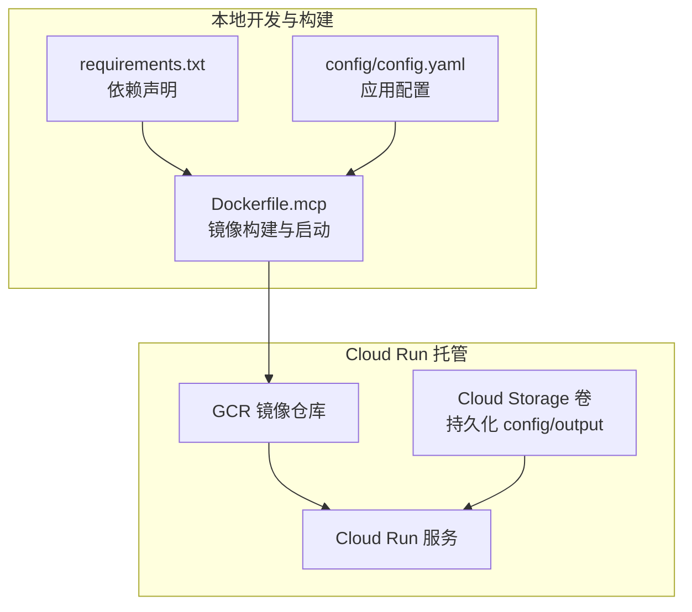
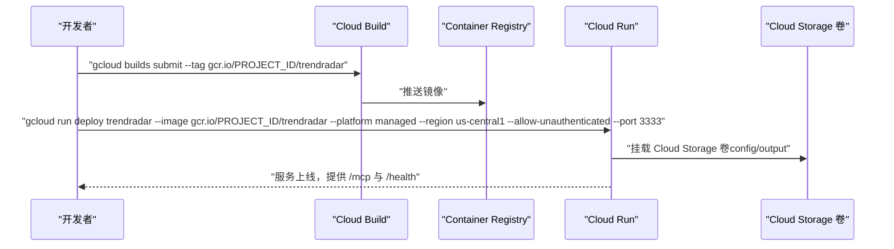
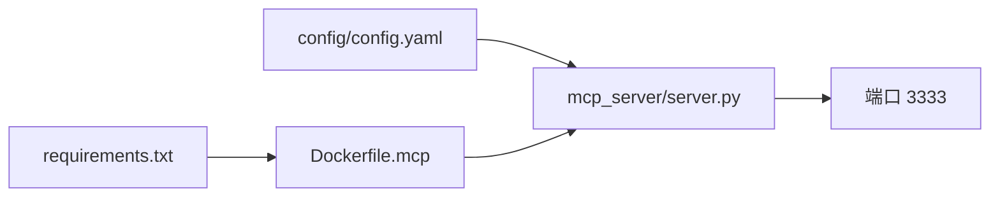

# Google Cloud Run 部署

<cite>
**本文引用的文件**
- [Deployment-Guide.md](file://docs/Deployment-Guide.md)
- [Dockerfile.mcp](file://docker/Dockerfile.mcp)
- [docker-compose.yml](file://docker/docker-compose.yml)
- [server.py](file://mcp_server/server.py)
- [requirements.txt](file://requirements.txt)
- [config.yaml](file://config/config.yaml)
- [entrypoint.sh](file://docker/entrypoint.sh)
- [manage.py](file://docker/manage.py)
- [start-http.sh](file://start-http.sh)
</cite>

## 目录
1. [简介](#简介)
2. [项目结构](#项目结构)
3. [核心组件](#核心组件)
4. [架构总览](#架构总览)
5. [详细组件分析](#详细组件分析)
6. [依赖关系分析](#依赖关系分析)
7. [性能与可靠性配置](#性能与可靠性配置)
8. [故障排查指南](#故障排查指南)
9. [结论](#结论)
10. [附录](#附录)

## 简介
本指南面向希望将 TrendRadar 的 MCP 服务部署到 Google Cloud Run 的用户，围绕以下目标展开：
- 使用 gcloud 命令行工具在 Cloud Build 中构建 Docker 镜像并推送到 Google Container Registry（GCR）
- 使用 gcloud run deploy 完成托管式 Cloud Run 部署，重点参数说明：--image、--platform managed、--region、--allow-unauthenticated、--port 3333
- 通过环境变量配置通知渠道与爬虫参数，并在 Cloud Run 中挂载 Cloud Storage 卷以持久化 config 与 output 目录
- 引用部署指南中关于 Cloud Run 的 Docker Cloud 部署章节，结合 MCP 服务特性，给出在无服务器环境下的并发、超时、最大实例数与健康检查端点（/health）的最佳实践

## 项目结构
TrendRadar 的 MCP 服务由 Python 与 FastMCP 框架驱动，提供 HTTP 传输模式，监听 3333 端口；Dockerfile.mcp 定义了镜像构建与启动命令；部署指南提供了 gcloud run deploy 的参考命令；配置文件 config.yaml 定义了爬虫与通知等核心参数；docker-compose.yml 展示了环境变量与卷挂载的典型用法。

图表来源
- [Dockerfile.mcp](file://docker/Dockerfile.mcp#L1-L24)
- [requirements.txt](file://requirements.txt#L1-L6)
- [config.yaml](file://config/config.yaml#L1-L140)
- [Deployment-Guide.md](file://docs/Deployment-Guide.md#L320-L333)

章节来源
- [Dockerfile.mcp](file://docker/Dockerfile.mcp#L1-L24)
- [requirements.txt](file://requirements.txt#L1-L6)
- [config.yaml](file://config/config.yaml#L1-L140)
- [Deployment-Guide.md](file://docs/Deployment-Guide.md#L320-L333)

## 核心组件
- MCP 服务器（HTTP 模式）：监听 3333 端口，提供 /mcp 接口与 /health 健康检查端点
- Docker 镜像：基于 Python slim 镜像，安装依赖，复制 MCP 服务器代码，暴露 3333 端口，CMD 启动 HTTP 模式
- 配置与环境变量：config.yaml 为主配置，支持通过环境变量覆盖（如通知渠道、爬虫开关、推送时间窗口等）
- 定时任务与 Web 服务器：容器内可通过 supercronic 与 manage.py 管理定时任务与静态文件服务（在 Cloud Run 场景下，建议将定时任务迁移到 Cloud Scheduler）

章节来源
- [server.py](file://mcp_server/server.py#L660-L782)
- [Dockerfile.mcp](file://docker/Dockerfile.mcp#L1-L24)
- [config.yaml](file://config/config.yaml#L1-L140)
- [docker-compose.yml](file://docker/docker-compose.yml#L1-L74)
- [manage.py](file://docker/manage.py#L403-L464)

## 架构总览
下图展示了从本地构建镜像到 Cloud Run 托管服务的关键交互，以及与 Cloud Storage 的数据持久化关系。

图表来源
- [Deployment-Guide.md](file://docs/Deployment-Guide.md#L320-L333)
- [Dockerfile.mcp](file://docker/Dockerfile.mcp#L1-L24)

## 详细组件分析

### 1) gcloud 构建与推送（Cloud Build）
- 在本地执行 gcloud builds submit，将 Dockerfile.mcp 构建为镜像并推送到 gcr.io/PROJECT_ID/trendradar
- Cloud Build 会读取 Dockerfile.mcp，安装 requirements.txt 中的依赖，复制 MCP 服务器代码，最终生成镜像

章节来源
- [Deployment-Guide.md](file://docs/Deployment-Guide.md#L320-L333)
- [Dockerfile.mcp](file://docker/Dockerfile.mcp#L1-L24)
- [requirements.txt](file://requirements.txt#L1-L6)

### 2) gcloud run deploy 关键参数说明
- --image：指定镜像标签，如 gcr.io/PROJECT_ID/trendradar
- --platform managed：托管式 Cloud Run 平台
- --region：部署区域，如 us-central1
- --allow-unauthenticated：允许匿名访问（生产环境建议配合 IAM 与 API 密钥鉴权）
- --port 3333：MCP 服务监听端口，需与 Dockerfile.mcp EXPOSE 一致

章节来源
- [Deployment-Guide.md](file://docs/Deployment-Guide.md#L320-L333)
- [Dockerfile.mcp](file://docker/Dockerfile.mcp#L1-L24)

### 3) 环境变量配置通知渠道与爬虫参数
- 通知渠道：支持飞书、钉钉、企业微信、Telegram、邮件、ntfy、Bark、Slack 等，可通过环境变量覆盖 config.yaml 中的 notification.webhooks 与相关配置
- 爬虫与报告：ENABLE_CRAWLER、ENABLE_NOTIFICATION、REPORT_MODE、MAX_ACCOUNTS_PER_CHANNEL、PUSH_WINDOW_ENABLED/START/END 等
- 其他：PYTHONUNBUFFERED、TZ 等

章节来源
- [config.yaml](file://config/config.yaml#L1-L140)
- [docker-compose.yml](file://docker/docker-compose.yml#L1-L74)
- [main.py](file://main.py#L162-L395)

### 4) 挂载 Cloud Storage 卷以持久化 config 与 output
- Cloud Run 支持挂载 Cloud Storage 卷，将 config 与 output 目录持久化
- 在 Cloud Run 部署时，通过卷挂载将 GCS 目录映射到容器内的 /app/config 与 /app/output，从而实现配置与数据持久化

章节来源
- [Dockerfile.mcp](file://docker/Dockerfile.mcp#L1-L24)
- [config.yaml](file://config/config.yaml#L1-L140)

### 5) 健康检查端点与无服务器特性
- MCP 服务提供 /health 健康检查端点，Cloud Run 可通过健康探针探测该端点
- 在 Cloud Run 无服务器环境下，实例按需伸缩，建议合理设置并发、超时与最大实例数，确保服务稳定

章节来源
- [Deployment-Guide.md](file://docs/Deployment-Guide.md#L395-L429)
- [server.py](file://mcp_server/server.py#L660-L782)

### 6) MCP 服务器启动与端口绑定
- CMD 在 Dockerfile.mcp 中启动 MCP 服务器 HTTP 模式，监听 0.0.0.0:3333
- 本地脚本 start-http.sh 也演示了相同参数

章节来源
- [Dockerfile.mcp](file://docker/Dockerfile.mcp#L1-L24)
- [start-http.sh](file://start-http.sh#L1-L22)
- [server.py](file://mcp_server/server.py#L660-L782)

## 依赖关系分析
- Dockerfile.mcp 依赖 requirements.txt 中的 fastmcp、websockets、requests、pytz、PyYAML
- MCP 服务器依赖 FastMCP 框架，提供工具注册与 HTTP 传输
- 配置加载依赖 config.yaml，支持环境变量覆盖

图表来源
- [requirements.txt](file://requirements.txt#L1-L6)
- [Dockerfile.mcp](file://docker/Dockerfile.mcp#L1-L24)
- [server.py](file://mcp_server/server.py#L660-L782)
- [config.yaml](file://config/config.yaml#L1-L140)

章节来源
- [requirements.txt](file://requirements.txt#L1-L6)
- [Dockerfile.mcp](file://docker/Dockerfile.mcp#L1-L24)
- [server.py](file://mcp_server/server.py#L660-L782)
- [config.yaml](file://config/config.yaml#L1-L140)

## 性能与可靠性配置
- 并发与实例扩缩容：Cloud Run 默认按流量自动扩缩容，建议根据 MCP 服务的 CPU/内存特征与外部 API 延迟，评估并发与最大实例数
- 请求超时：Cloud Run 默认超时约 500 秒，若 MCP 服务涉及长时间任务，建议拆分为异步作业或迁移到 Cloud Tasks
- 健康检查：使用 /health 端点，确保 Cloud Run 健康探针能正确识别服务状态
- 配置与数据持久化：通过 Cloud Storage 卷挂载 config 与 output，避免无状态容器丢失配置与数据
- 安全访问：生产环境建议开启身份验证与授权，避免 allow-unauthenticated 暴露给公网

章节来源
- [Deployment-Guide.md](file://docs/Deployment-Guide.md#L395-L429)
- [Dockerfile.mcp](file://docker/Dockerfile.mcp#L1-L24)
- [config.yaml](file://config/config.yaml#L1-L140)

## 故障排查指南
- 健康检查失败：使用 curl http://localhost:3333/health 或文档中的示例进行验证
- 日志查看：在 Cloud Run 中通过 Cloud Logging 查看容器日志；或在本地使用 docker logs -f trendradar（容器场景）
- 配置不生效：确认环境变量优先级高于 config.yaml；检查 CONFIG_PATH 与 FREQUENCY_WORDS_PATH 是否正确
- 端口与传输：确保 --port 3333 与 Dockerfile.mcp EXPOSE 一致，且传输模式为 HTTP

章节来源
- [Deployment-Guide.md](file://docs/Deployment-Guide.md#L395-L429)
- [server.py](file://mcp_server/server.py#L660-L782)
- [Dockerfile.mcp](file://docker/Dockerfile.mcp#L1-L24)
- [config.yaml](file://config/config.yaml#L1-L140)

## 结论
通过 gcloud builds submit 与 gcloud run deploy，可快速将 TrendRadar 的 MCP 服务部署到 Google Cloud Run。结合环境变量与 Cloud Storage 卷，可在无服务器环境中实现稳定的配置与数据持久化。建议在生产环境完善鉴权、超时与健康检查策略，确保服务的可靠性与安全性。

## 附录
- 参考命令与参数：见“gcloud 构建与推送”、“gcloud run deploy 关键参数说明”
- 环境变量覆盖表：见“环境变量配置通知渠道与爬虫参数”
- 健康检查端点：见“健康检查端点与无服务器特性”