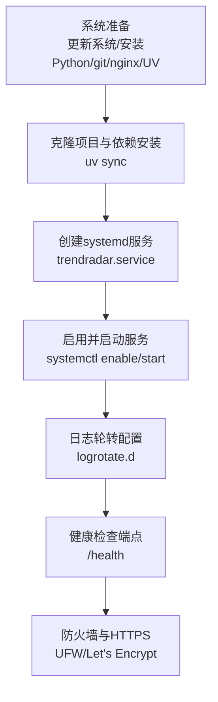
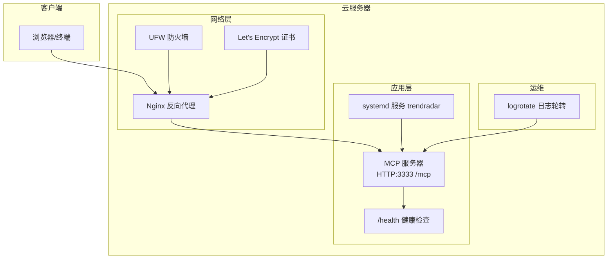
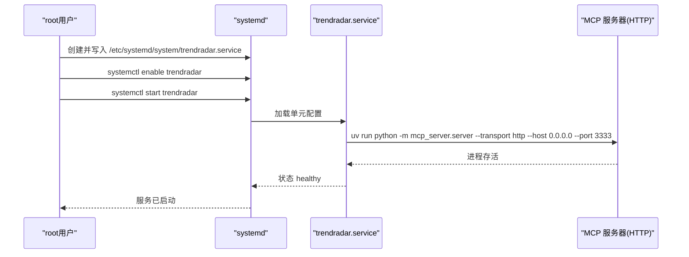
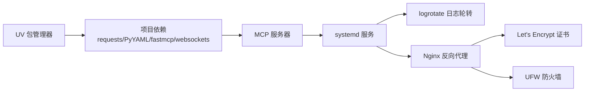

# VPS部署

<cite>
**本文引用的文件**
- [Deployment-Guide.md](file://docs/Deployment-Guide.md)
- [README.md](file://README.md)
- [mcp_server/server.py](file://mcp_server/server.py)
- [start-http.sh](file://start-http.sh)
- [setup-mac.sh](file://setup-mac.sh)
- [config/config.yaml](file://config/config.yaml)
- [pyproject.toml](file://pyproject.toml)
- [requirements.txt](file://requirements.txt)
</cite>

## 目录
1. [简介](#简介)
2. [项目结构](#项目结构)
3. [核心组件](#核心组件)
4. [架构总览](#架构总览)
5. [详细组件分析](#详细组件分析)
6. [依赖关系分析](#依赖关系分析)
7. [性能与运维建议](#性能与运维建议)
8. [故障排查指南](#故障排查指南)
9. [结论](#结论)
10. [附录](#附录)

## 简介
本指南面向在 AWS、GCP 等云服务器上部署 TrendRadar 的用户，聚焦 VPS 环境下的完整部署流程：系统准备、项目克隆与依赖安装（使用 UV 包管理器）、systemd 服务配置与开机自启、日志轮转策略、健康检查机制、防火墙与 HTTPS 安全加固。文档严格依据仓库内的部署指南与相关脚本/配置文件，确保可操作性与可追溯性。

## 项目结构
- 项目采用模块化组织，MCP 服务入口位于 mcp_server/server.py，提供 HTTP 与 STDIO 两种传输模式。
- 部署指南中提供了 VPS 部署章节，包含系统准备、依赖安装、systemd 服务创建、日志轮转与健康检查等关键步骤。
- 一键部署脚本 setup-mac.sh 与 start-http.sh 展示了 UV 环境与 HTTP 模式启动流程，便于在 VPS 上复用。

图表来源
- [Deployment-Guide.md](file://docs/Deployment-Guide.md#L259-L305)
- [Deployment-Guide.md](file://docs/Deployment-Guide.md#L336-L409)
- [Deployment-Guide.md](file://docs/Deployment-Guide.md#L507-L532)
- [start-http.sh](file://start-http.sh#L1-L22)
- [setup-mac.sh](file://setup-mac.sh#L1-L119)

章节来源
- [Deployment-Guide.md](file://docs/Deployment-Guide.md#L259-L305)
- [start-http.sh](file://start-http.sh#L1-L22)
- [setup-mac.sh](file://setup-mac.sh#L1-L119)

## 核心组件
- MCP 服务器：提供 HTTP 接口（默认 3333 端口），支持 /mcp 路由与 /health 健康检查端点。
- UV 包管理器：用于快速安装与同步依赖，替代传统 pip。
- systemd 服务：实现进程守护、开机自启与自动重启。
- 日志轮转：通过 logrotate 管理日志文件大小与保留周期。
- 健康检查：HTTP GET /health 返回服务状态、版本与运行时信息。
- 安全加固：UFW 防火墙开放必要端口；Let's Encrypt 证书用于 HTTPS。

章节来源
- [mcp_server/server.py](file://mcp_server/server.py#L1-L200)
- [Deployment-Guide.md](file://docs/Deployment-Guide.md#L395-L409)
- [Deployment-Guide.md](file://docs/Deployment-Guide.md#L507-L532)

## 架构总览
下图展示了 VPS 上的部署架构：客户端通过 Nginx 反代访问 MCP 服务，systemd 负责进程守护，logrotate 管理日志，UFW 与 Let's Encrypt 提供网络安全与 HTTPS。

图表来源
- [Deployment-Guide.md](file://docs/Deployment-Guide.md#L135-L163)
- [Deployment-Guide.md](file://docs/Deployment-Guide.md#L336-L358)
- [Deployment-Guide.md](file://docs/Deployment-Guide.md#L507-L532)
- [mcp_server/server.py](file://mcp_server/server.py#L1-L200)

## 详细组件分析

### 系统准备与依赖安装（UV）
- 更新系统与安装必要软件：Python、git、nginx、UV。
- 使用 UV 创建隔离环境并同步依赖，确保 MCP 服务所需依赖满足。
- 一键部署脚本展示了 UV 的安装与依赖同步流程，VPS 可直接复用。

章节来源
- [Deployment-Guide.md](file://docs/Deployment-Guide.md#L261-L272)
- [Deployment-Guide.md](file://docs/Deployment-Guide.md#L274-L283)
- [setup-mac.sh](file://setup-mac.sh#L22-L55)
- [setup-mac.sh](file://setup-mac.sh#L60-L74)

### systemd 服务配置与开机自启
- 创建 trendradar.service 单元文件，设置描述、依赖网络、用户、工作目录、环境变量与 ExecStart。
- 使用 ExecStart 指定 uv run python -m mcp_server.server，并以 HTTP 模式监听 0.0.0.0:3333。
- 启用并启动服务，systemd 将在失败时自动重启。

图表来源
- [Deployment-Guide.md](file://docs/Deployment-Guide.md#L283-L305)

章节来源
- [Deployment-Guide.md](file://docs/Deployment-Guide.md#L283-L305)

### Nginx 反向代理与 HTTPS
- 在 Nginx 中为域名配置站点，将 /mcp 路由代理至本地 3333 端口。
- 使用 UFW 开放 80/443/3333 端口。
- 通过 Certbot 为域名申请并自动续期 Let's Encrypt 证书。

章节来源
- [Deployment-Guide.md](file://docs/Deployment-Guide.md#L135-L163)
- [Deployment-Guide.md](file://docs/Deployment-Guide.md#L507-L532)

### 日志轮转策略（logrotate）
- 在 /etc/logrotate.d/ 创建 trendradar 配置，按日轮转、压缩、保留 30 天。
- 指定日志文件路径与权限，确保服务日志不会无限增长。

章节来源
- [Deployment-Guide.md](file://docs/Deployment-Guide.md#L336-L358)

### 健康检查机制
- MCP 服务器提供 /health 端点，返回服务状态、版本与运行时信息。
- 可通过 curl 或定时脚本进行健康检查，结合 systemd 自动重启保障可用性。

章节来源
- [Deployment-Guide.md](file://docs/Deployment-Guide.md#L395-L409)

### 防火墙与 HTTPS 安全加固
- UFW 开放 SSH、HTTP、HTTPS、MCP 服务端口，启用防火墙。
- 使用 Certbot 为域名申请证书，并配置自动续期。

章节来源
- [Deployment-Guide.md](file://docs/Deployment-Guide.md#L507-L532)

## 依赖关系分析
- MCP 服务依赖 Python 3.10+ 与项目依赖（requests、PyYAML、fastmcp、websockets 等）。
- UV 作为包管理器，负责依赖解析与安装，简化部署流程。
- systemd 依赖 MCP 服务进程，logrotate 依赖日志文件路径，Nginx 依赖 MCP 服务端口与证书。

图表来源
- [pyproject.toml](file://pyproject.toml#L1-L26)
- [requirements.txt](file://requirements.txt#L1-L6)
- [mcp_server/server.py](file://mcp_server/server.py#L1-L200)
- [Deployment-Guide.md](file://docs/Deployment-Guide.md#L336-L358)
- [Deployment-Guide.md](file://docs/Deployment-Guide.md#L507-L532)

章节来源
- [pyproject.toml](file://pyproject.toml#L1-L26)
- [requirements.txt](file://requirements.txt#L1-L6)

## 性能与运维建议
- 端口与路由：确保 MCP 服务监听 0.0.0.0:3333，Nginx 将 /mcp 路由转发至该端口。
- 进程守护：systemd 的 Restart=always 与 RestartSec=5 可在异常退出后自动恢复。
- 日志管理：定期轮转，避免磁盘占满；结合监控脚本清理过期数据。
- 安全加固：仅开放必要端口；使用 HTTPS；限制访问来源（可选）。
- 配置优先级：环境变量优先于 config.yaml，生产环境建议通过环境变量注入敏感配置。

章节来源
- [Deployment-Guide.md](file://docs/Deployment-Guide.md#L336-L409)
- [config/config.yaml](file://config/config.yaml#L1-L140)

## 故障排查指南
- UV 安装失败：检查 PATH 是否包含 UV 安装路径；必要时使用 pip 安装。
- 服务状态异常：使用 systemctl status trendradar 查看状态与错误日志；journalctl -u trendradar -f 实时跟踪。
- 端口占用：netstat -tlnp | grep 3333 检查 3333 端口占用情况。
- 数据为空：检查 config/config.yaml 配置；手动运行 uv run python main.py 验证爬虫功能。
- 内存不足：通过 ulimit 或系统层面限制内存使用；优化代码内存使用。

章节来源
- [Deployment-Guide.md](file://docs/Deployment-Guide.md#L431-L494)

## 结论
通过 UV 快速安装依赖、systemd 实现进程守护与开机自启、Nginx 反代与 HTTPS 加固、logrotate 日志轮转与 /health 健康检查，TrendRadar 可在 AWS、GCP 等云服务器上稳定运行。建议结合环境变量与最小权限原则，进一步提升安全性与可维护性。

## 附录

### systemd 单元文件关键字段说明
- [Unit]：描述服务名称与依赖网络。
- [Service]：设置用户、工作目录、环境变量、ExecStart（HTTP 模式）、重启策略。
- [Install]：设置 WantedBy=multi-user.target，配合 systemctl enable 生效。

章节来源
- [Deployment-Guide.md](file://docs/Deployment-Guide.md#L283-L305)

### HTTP 模式启动与 Nginx 反代
- HTTP 模式启动：uv run python -m mcp_server.server --transport http --host 0.0.0.0 --port 3333。
- Nginx 反代：将 /mcp 路由转发至 http://localhost:3333，并设置必要的头部与升级参数。

章节来源
- [start-http.sh](file://start-http.sh#L1-L22)
- [Deployment-Guide.md](file://docs/Deployment-Guide.md#L121-L163)

### 健康检查端点
- /health：返回服务状态、版本与运行时信息，便于自动化监控与自愈。

章节来源
- [Deployment-Guide.md](file://docs/Deployment-Guide.md#L395-L409)

### 安全配置要点
- UFW：允许 SSH、80、443、3333 端口，启用防火墙。
- HTTPS：使用 Certbot 为域名申请证书并配置自动续期。

章节来源
- [Deployment-Guide.md](file://docs/Deployment-Guide.md#L507-L532)